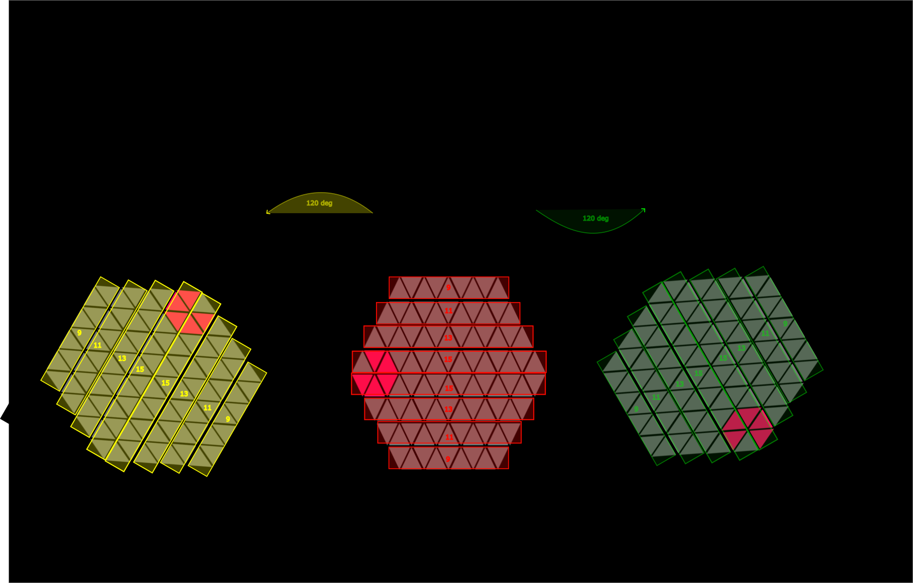

# Tricked AI Engine


Tricked is a high-performance Reinforcement Learning engine that solves a custom topological board puzzle. It trains AlphaZero/MuZero-style agents utilizing strict zero-debt Rust lock-free algorithms to squeeze 100% throughput out of multi-core CPU and GPU platforms without memory starvation.

## 1. The Game Mechanics & Problem
**Tricked** is played on a **96-triangle hexagonal grid**. The objective is to place poly-triangle pieces to complete continuous lines.



- **Rhombus Coordinate Cube System:** The board is conceptually treated as looking at rhombuses forming 3D cubes. This provides an elegant 3-axis (X, Y, Z) coordinate addressing system that radically simplifies line-clearing validation. 
- **The 3-Piece Buffer:** Pieces are drawn in batches of 3. You must place all 3 to receive the next batch. In our AI formulation, these are purely topological obstacles without colors.
- **Line Clearing:** Completing a line across any axis clears it, granting 2 points per triangle. Intersections of multi-line combos multiply the reward signal significantly.
- **Terminal State:** The game is over when the board is too cluttered to legitimately fit any piece from the buffer.

## 2. Architecture & Tech Solutions
To maximize game simulation (self-play throughput) during RL training, the Tricked Engine relies on carefully mapped hardware architectures:
1. **O(1) MCTS Arena Compaction:** Standard mark-and-sweep GC fragments heap memory. We implemented a Constant-Time Bump Allocator mapping active game tree nodes into pre-allocated `Vec<LatentNode>` contiguous arrays.
2. **Virtual Loss & Inference Queues:** Instead of single-threading batched evaluations, workers apply "Virtual Loss" locally to trick themselves into exploring alternate branches while waiting for the GPU to evaluate batched leaves.
3. **Lock-Free SumTrees:** Prioritized Experience Replay (PER) sampling requires constant probability weight updates. We transitioned from `Mutex<f64>` wrappers to native `AtomicI64` fixed-point representations.
4. **ONNX / TensorRT Migration:** Extracted logic away from raw Python/LibTorch to run exclusively on TensorRT via ONNX bridging. 

## 3. Usage & Development

### Setup & Build
This repository relies on a zero-debt compilation standard.
```bash
cargo build --release
make lint
make test
```

### Forge UI (Web Controller)
1. Start the React Frontend.
```bash
cd ui && npm install && npm start
```
2. Spawn the Rust Axum Engine server to ingest configurations and dispatch workers.
```bash
cargo run --release --bin tricked_engine
```

### Auto-Tuning
Run the dynamic python auto-tuner to empirically search for optimal batching hyperparameters on your hardware.
```bash
venv/bin/python scripts/auto_tune.py --trials 20
```
Then, map the resulting metrics into the Advanced Config panels in the Forge UI.

## 4. Contributing
See [CONTRIBUTING.md](CONTRIBUTING.md) for our exact standards. We enforce a zero-debt policy. No `#[allow(...)]` tags, no suppressed warnings, all lints and tests must pass locally.

## License
MIT License. See [LICENSE](LICENSE) for more details.
