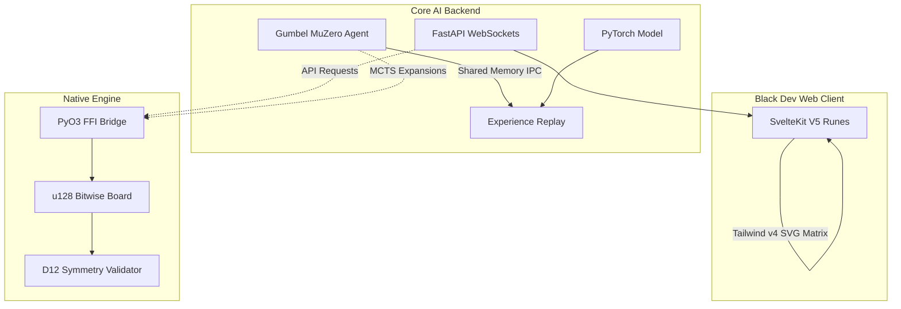

<div align="center">
  

  <h1>Tricked</h1>
  <p><b>High-Performance SOTA Mathematical Engine & Gumbel MuZero Tree Search</b></p>

  <p>
    
    
    
    
    
    
    
  </p>
</div>

---

## 🌌 Ecosystem Architecture
Tricked is a multi-language ecosystem optimized entirely to prevent standard abstraction delays. We translate raw bitwise board matrices from Python natively into a **Rust (PyO3) Verification Engine**, achieving zero-cost tensor bounds for ultra-concurrent MCTS expansions.

The system features a completely decoupled Svelte 5 frontend interacting seamlessly with a FastAPI WebSocket Core.



## 🔥 High-Fidelity Features

1. **Rust PyO3 Engine (`tricked_rs`)**: Total mathematical bound verification with zero memory leaks. 120-degree Tri-Coordinate mathematics seamlessly map (9,11,13,15,15,13,11,9) layout structures directly to `u128` integers.
2. **Gumbel MuZero Reinforcement**: Replaced legacy scalar heuristics with Two-Hot Cross Entropy and Spatial ResNets for maximum predictive precision.
3. **Live Spectator Mode**: Ultra-high-performance UI tracking. Subprocesses asynchronously dump lock-free mathematical permutations polled by the Svelte Client at 100ms rates without bottlenecking the PyTorch Training cycles.
4. **Progressive Difficulty Curriculum**: Automated threshold promotion scaling up Dihedral spatial reasoning from simple isolated anchors all the way to 26 perfectly mathematically closed D12 piece definitions.

---

## 🚀 Execution & Bootstrap

### 0. 🛠️ Dedicated Linux & RTX Contributor Onboarding
> **New to the project?** Read the **[Ultimate Linux & RTX Onboarding Guide](./LINUX_RTX_ONBOARDING.md)** to go from a blank OS to compiling the Rust/CUDA ecosystem natively in 10 minutes.

### 1. Cloud / RTX Docker Container (Recommended)
Containerize the entire ecosystem effortlessly spanning physical RTX nodes:
```bash
docker build -t tricked-ai:latest .
docker run --gpus all -p 6006:6006 -p 8080:8080 -p 5173:5173 tricked-ai:latest
```
*Intercept the dynamic loss curves natively on: `http://localhost:6006`*
*View the live HUD Spectator natively on: `http://localhost:5173`*

### 2. Manual Source Compilation
Install the ecosystem targeting native Python optimization. `pip install` transparently invokes `maturin` to bind the Rust structs.
```bash
python3 -m pip install -e .
cd ui && npm install && npm run dev
```

### 3. Training Orchestrator
We expose a globally registered training orchestrator accessible universally:
```bash
tricked-train
```

### 4. Regenerating Shapes & Rust Constants
If you modify the underlying mathematical grid or symmetry definitions, you must regenerate the canonical piece data and compiling the Rust engine:

```bash
# 1. Regenerates Python PieceDefs and Rust bitmasks
python scripts/generate_all.py 

# 2. Recompile the Rust PyO3 Engine for the local environment
maturin develop --release
```

---

## 🔮 Next-Generation Roadmap (SOTA Research)
We have published a massive architectural study mapping out the exact pipeline toward accelerating Tricked AI to a **40x MCTS Simulation throughput**. This addresses critical scale via Advanced ZeroMQ Matrix Batching, PyO3 Tree traversals, and Reanalyse Background Daemons.
> **Read the Study**: [Phase 3 SOTA Performance Roadmap](./SOTA_PERFORMANCE_ROADMAP.md)

---
<div align="center">
  <i>Engineered for Maximum Capability • Pure Mathematical Strategy</i>
</div>


# 🔮 Phase 3 SOTA Performance Roadmap

*A comprehensive technical study targeting radical optimization of the Tricked MCTS logic, scaling toward true industrial RL throughputs across Hardware Accelerators.*

Following the extreme success of our Python/Rust pipeline executing `Gumbel MuZero` convergence stabilization in Phase 2, this document charts the exact sequence for accelerating system throughput by a projected **10x — 40x magnitude** while slashing Replay Buffer epochs.

---

## Part 1: Execution Throughput (Running Faster)

Currently, Monte Carlo Tree Search expands nodes procedurally. Python executes thousands of tiny GPU matrix evaluations with rigid `Batch Size = 1`. This starves PyTorch CUDA/MPS execution times.

### 1. Asynchronous ZeroMQ Batched Inference (Actor-Learner IPC)
* **The Paradigm Shift**: Completely decouple the CPU simulation matrix from the GPU backpropagation loops.
* **The Architecture**: 
  - Spin up 30 parallel `multiprocessing` "Actor" loops. They run pure `mcts.py` logic.
  - When an Actor reaches a node that needs a Neural Evaluation, it drops a serialized byte payload over a `ZeroMQ (ZMQ) REQ/REP Socket` and goes to sleep.
  - A single, globally isolated "Learner/Evaluator" Process natively listens. Once it captures 256 pending requests, it concatenates them via `torch.cat`, fires one massive GPU Matrix Pass, and streams the predictions back out through the port sequentially. 
* **The Impact**: Neural network batching natively transforms 3-second simulation trees into milliseconds.

### 2. Pure Rust-Native MCTS Engine (PyO3)
* **The Paradigm Shift**: Eliminating the Python `Global Interpreter Lock (GIL)` constraint natively at the search-tree depth.
* **The Architecture**: We already possess the `tricked_rs` physical grid validator. By transferring the sequential halving, `LatentNode` initialization, and PUCT value ranking loops explicitly into a threaded Rust implementation, the only function exposed to Python becomes:
  ```python
  best_action, distribution = trick_rs.mcts.solve_gumbel(board, depth, budget)
  ```
* **The Impact**: CPU-bound tree-crawling time approaches sub-1-millisecond limits natively.

### 3. Tree Re-use (Kinetic Momentum)
* **The Paradigm Shift**: Retaining mathematical knowledge directly across step evaluations.
* **The Architecture**: At step $T=0$, the AI simulates 50 possible branches. The AI chooses one physical action and transitions to $T=1$. Under classical behavior, the AI throws out the 50 simulated trees and runs a fresh `LatentNode`. Moving forward, pass the chosen branch natively: `new_root = prev_root.children[action_taken]`.
* **The Impact**: The Tree inherently drops down 2-3 extra search depths absolutely free.

### 4. Explicit AMP (Automatic Mixed Precision) Inference Taps
* **The Architecture**: Currently, our PyTorch Optimizer operates fully on AMP (`torch.autocast`), but the *Live MCTS Unrolls* operate strictly standard float32 evaluations natively during Self-Play operations. Wrapping search loops with `device_type="cuda" or "mps" dtype=torch.float16` will instantaneously double evaluation throughput at virtually zero loss to structural accuracy.

---

## Part 2: Convergence Speed (Learning Faster)

Our networks currently learn from static game states executed hours ago on deprecated PyTorch models. 

### 5. EfficientZero's Reanalyse Algorithm
* **The Architecture**: Establish a background daemon process scanning the SQLite `/ PyTorch ReplayBuffer`. Re-run old buffer traces through a massive 5-simulation MCTS algorithm hooked directly into the *most recently saved PyTorch weight checkpoint* representing modern intelligence.
* **The Impact**: Older states are upgraded intelligently with state-of-the-art policy projections resulting in staggering algorithmic efficiency without forcing agents to repeatedly play identical self-play games mathematically.

### 6. Prioritized Experience Replay (PER) Math
* **The Architecture**: Currently implementing basic scaling `alpha=0.6` heuristics natively. Swap the sampling probability logic directly over to the literal `Temporal Difference Error (TD-Error)`. 
* **The Metric**: `priority = abs(Predicted_Value - Actual_Value_Outcome) + epsilon`. 
* **The Impact**: The training gradient natively shifts focus towards physical states the network explicitly misunderstands.

### 7. Contrastive Self-Supervised Projection (EfficientZero)
* **The Architecture**: MuZero relies fundamentally on reward generation scalars. In complex topological layouts like Triango, piece drops might have zero reward impact locally natively causing sparse updates. Introduce a `SimSiam` projector structure penalizing any asymmetrical mappings from physically rendered PyTorch representations versus deeply unrolled Latent states predicting cosine similarities. (P1 Alignment loss expanded).

### 8. M0RV / Advantage-Weighted Targets
* **The Architecture**: Hardcode target Value Loss backpropagation weights scaled perfectly to the trajectory's evaluated "Advantage" score. A trajectory segment that dramatically shifted the Q-value upward above its baselines carries larger weight metrics.


# 🛠️ The Ultimate Linux & RTX Onboarding Guide

> **Welcome to Tricked AI.** If you’re booting this repository on a dedicated Linux machine with a discrete NVIDIA RTX GPU, you are running in the system's primary target deployment architecture. This guide takes you from a completely blank OS to compiling the PyO3 Rust bindings natively into a GPU-accelerated PyTorch/SvelteKit ecosystem.

---

## Phase 1: Base Operating System Prequisites

Tricked AI operates purely on native memory execution. We require **Python 3.10+**, **Rust 1.76+**, and **Node.js 20+**.

### 1. Essential System Toolchain
Update your package index and install the standard build essentials to allow compiling Python and Rust extensions natively on your kernel:

```bash
sudo apt update && sudo apt upgrade -y
sudo apt install -y build-essential curl git libssl-dev pkg-config python3-venv python3-pip python3-dev
```

### 2. Install Rust (The High-Performance Native Engine)
We use `rustup` to manage the compiler. Do NOT use `apt install rustc` as it provides outdated binaries.

```bash
curl --proto '=https' --tlsv1.2 -sSf https://sh.rustup.rs | sh
# Press 1 to proceed with standard installation
source "$HOME/.cargo/env"
rustc --version # Verify 1.76.0 or higher
```

### 3. Install Node.js (For the Svelte 5 Frontend)
Use Node Version Manager (NVM) to guarantee zero permission issues with NPM packages:

```bash
curl -o- https://raw.githubusercontent.com/nvm-sh/nvm/v0.39.7/install.sh | bash
source ~/.bashrc
nvm install 20
node -v # Verify v20.x
```

---

## Phase 2: Accelerated Deep Learning Environment (CUDA & PyTorch)

To saturate your RTX card during MCTS Unrolls, you must pair the hardware with specific NVIDIA CUDA runtimes. Let's build the Virtual Environment.

### 1. Initialize the Python `.venv`
Never install your global packages system-wide.

```bash
cd tricks # Navigate into the repository
python3 -m venv .venv
source .venv/bin/activate
```

*(You must run `source .venv/bin/activate` every time you open a new terminal in this project!)*

### 2. Install PyTorch with CUDA 12.1 Explicit Acceleration
By default, `pip install torch` might pull CPU binaries or older CUDA 11 versions depending on caching. Explicitly download the highly optimized CUDA 12 index:

```bash
pip install --upgrade pip
pip install torch torchvision torchaudio --index-url https://download.pytorch.org/whl/cu121
```

Verify the card is communicating with the tensor cores:
```bash
python -c "import torch; print(f'CUDA Live: {torch.cuda.is_available()} | Card: {torch.cuda.get_device_name(0)}')"
# Expected Output: CUDA Live: True | Card: NVIDIA GeForce RTX...
```

---

## Phase 3: Project Bootstrap (Using `./run.sh`)

We use a unified bootstrap script (`./run.sh`) to guarantee the Rust engine compiles with the correct mathematical bindings (`maturin develop --release`) and to launch the Frontend ecosystem dynamically.

### 1. Install Developer Dependencies
Before executing the script, ensure your Python environment is mapped to the internal modules:
```bash
pip install maturin "setuptools>=61.0"
pip install -e ".[dev]"
```

### 2. Boot the UI Ecosystem (Terminal 1)
Execute the primary runner. Do NOT run this in the background; allow it to hold the process so you can monitor UI errors.

```bash
chmod +x run.sh
./run.sh
```
*(Leave this terminal running. You can now view the Spectator HUD at `http://localhost:5173`)*

---

## Phase 4: SOTA Training Orchestration (Headless TUI)

This repository is strictly configured to execute headless SOTA metrics natively bypassing web UI overhead specifically designed for discrete Ubuntu nodes rendering metrics onto the Weights & Biases cloud telemetry tracking layout natively.

### 1. Boot the Background Redis Cache 
Before launching the distributed PyTorch workers natively, start your local Redis server. Redis handles mathematically over 10,000 IOPS purely without database locking.
```bash
sudo apt install redis-server -y
sudo systemctl enable redis-server && sudo systemctl start redis-server
```

### 2. Authenticate the Tracking Cloud
Weights & Biases (WandB) intercepts and uploads the metrics natively mapping GPU VRAM and model Loss parameters remotely.
```bash
source .venv/bin/activate
wandb login
```

### 3. Unleash Headless CUDA Core
Boot the primary algorithmic daemon explicitly invoking the headless architectural toggle. The `rich` TUI blocks terminal scroll pollution beautifully.
```bash
./run.sh --headless
```

🚀 **You are officially bleeding-edge. Welcome to the Matrix.** 🚀
