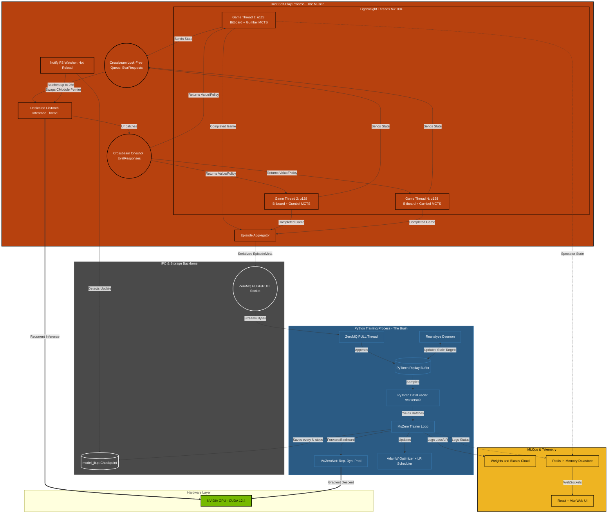

  

  <h1>Tricked</h1>
  
<b>High-Performance SOTA Mathematical Engine & Gumbel MuZero Tree Search</b>

  

    
    
    
    
    
    
    
  

---

## 🏗️ The Hybrid AlphaZero Architecture

```mermaid
graph TD
    subgraph Hardware_Layer [Hardware Layer]
        GPU[NVIDIA GPU - CUDA 12.4]
    end

    subgraph MLOps_and_Telemetry [MLOps & Telemetry]
        WandB[Weights and Biases Cloud]
        Redis[Redis In-Memory Datastore]
        ReactUI[React + Vite Web UI]
        Redis -->|WebSockets| ReactUI
    end

    subgraph IPC_Communication_Backbone [IPC & Storage Backbone]
        ZMQ_Socket((ZeroMQ PUSH/PULL Socket))
        JIT_File[(model_jit.pt Checkpoint)]
    end

    subgraph Rust_Self_Play_Engine[Rust Self-Play Process - The Muscle]
        direction TB
        subgraph Rust_Workers[Lightweight Threads N=100+]
            W1[Game Thread 1: u128 Bitboard + Gumbel MCTS]
            W2[Game Thread 2: u128 Bitboard + Gumbel MCTS]
            WN[Game Thread N: u128 Bitboard + Gumbel MCTS]
        end

        CB_Req((Crossbeam Lock-Free Queue: EvalRequests))
        CB_Resp((Crossbeam Oneshot: EvalResponses))
        
        LibTorch[Dedicated LibTorch Inference Thread]
        FileWatcher[Notify FS Watcher: Hot Reload]
        EpAggregator[Episode Aggregator]

        W1 -->|Sends State| CB_Req
        W2 -->|Sends State| CB_Req
        WN -->|Sends State| CB_Req

        CB_Req -->|Batches up to 256| LibTorch
        LibTorch == Recurrent Inference ==> GPU
        LibTorch -->|Unbatches| CB_Resp
        
        CB_Resp -->|Returns Value/Policy| W1
        CB_Resp -->|Returns Value/Policy| W2
        CB_Resp -->|Returns Value/Policy| WN

        W1 -->|Completed Game| EpAggregator
        W2 -->|Completed Game| EpAggregator
        WN -->|Completed Game| EpAggregator

        EpAggregator -->|Serializes EpisodeMeta| ZMQ_Socket
        FileWatcher -->|Detects Update| JIT_File
        FileWatcher -->|Swaps CModule Pointer| LibTorch
        
        W1 -.->|Spectator State| Redis
    end

    subgraph Python_Training_Engine [Python Training Process - The Brain]
        direction TB
        ZMQ_Receiver[ZeroMQ PULL Thread]
        PyBuffer[(PyTorch Replay Buffer)]
        DataLoader[PyTorch DataLoader workers=0]
        
        Trainer[MuZero Trainer Loop]
        Model[MuZeroNet: Rep, Dyn, Pred]
        Opt[AdamW Optimizer + LR Scheduler]
        Reanalyze[Reanalyze Daemon]

        ZMQ_Socket -->|Streams Bytes| ZMQ_Receiver
        ZMQ_Receiver -->|Appends| PyBuffer
        PyBuffer -->|Samples| DataLoader
        DataLoader -->|Yields Batches| Trainer
        
        Trainer -->|Forward/Backward| Model
        Model == Gradient Descent ==> GPU
        Trainer -->|Updates| Opt
        
        Trainer -->|Saves every N steps| JIT_File
        Trainer -->|Logs Loss/LR| WandB
        Trainer -.->|Logs Status| Redis
        
        Reanalyze <-->|Updates Stale Targets| PyBuffer
    end

    classDef rust fill:#b7410e,stroke:#000,stroke-width:2px,color:#fff;
    classDef python fill:#2b5b84,stroke:#3776ab,stroke-width:2px,color:#fff;
    classDef hardware fill:#76b900,stroke:#000,stroke-width:2px,color:#000;
    classDef ipc fill:#4a4a4a,stroke:#fff,stroke-width:2px,color:#fff;
    classDef mlops fill:#eeb422,stroke:#000,stroke-width:2px,color:#000;

    class Rust_Self_Play_Engine,Rust_Workers,W1,W2,WN,CB_Req,CB_Resp,LibTorch,FileWatcher,EpAggregator rust;
    class Python_Training_Engine,ZMQ_Receiver,PyBuffer,DataLoader,Trainer,Model,Opt,Reanalyze python;
    class GPU hardware;
    class IPC_Communication_Backbone,ZMQ_Socket,JIT_File ipc;
    class MLOps_and_Telemetry,WandB,Redis,ReactUI mlops;
```

```mermaid
graph TD
    subgraph Hardware_Layer [Hardware Layer]
        GPU[NVIDIA GPU - CUDA 12.4]
    end

    subgraph MLOps_and_Telemetry [MLOps & Telemetry]
        WandB[Weights and Biases Cloud]
        Redis[Redis In-Memory Datastore]
        ReactUI[React + Vite Web UI]
        Redis -->|WebSockets| ReactUI
    end

    subgraph IPC_Communication_Backbone [IPC & Storage Backbone]
        ZMQ_Socket((ZeroMQ PUSH/PULL Socket))
        JIT_File[(model_jit.pt Checkpoint)]
    end

    subgraph Rust_Self_Play_Engine[Rust Self-Play Process - The Muscle]
        direction TB
        subgraph Rust_Workers[Lightweight Threads N=100+]
            W1[Game Thread 1: u128 Bitboard + Gumbel MCTS]
            W2[Game Thread 2: u128 Bitboard + Gumbel MCTS]
            WN[Game Thread N: u128 Bitboard + Gumbel MCTS]
        end

        CB_Req((Crossbeam Lock-Free Queue: EvalRequests))
        CB_Resp((Crossbeam Oneshot: EvalResponses))
        
        LibTorch[Dedicated LibTorch Inference Thread]
        FileWatcher[Notify FS Watcher: Hot Reload]
        EpAggregator[Episode Aggregator]

        W1 -->|Sends State| CB_Req
        W2 -->|Sends State| CB_Req
        WN -->|Sends State| CB_Req

        CB_Req -->|Batches up to 256| LibTorch
        LibTorch == Recurrent Inference ==> GPU
        LibTorch -->|Unbatches| CB_Resp
        
        CB_Resp -->|Returns Value/Policy| W1
        CB_Resp -->|Returns Value/Policy| W2
        CB_Resp -->|Returns Value/Policy| WN

        W1 -->|Completed Game| EpAggregator
        W2 -->|Completed Game| EpAggregator
        WN -->|Completed Game| EpAggregator

        EpAggregator -->|Serializes EpisodeMeta| ZMQ_Socket
        FileWatcher -->|Detects Update| JIT_File
        FileWatcher -->|Swaps CModule Pointer| LibTorch
        
        W1 -.->|Spectator State| Redis
    end

    subgraph Python_Training_Engine [Python Training Process - The Brain]
        direction TB
        ZMQ_Receiver[ZeroMQ PULL Thread]
        PyBuffer[(PyTorch Replay Buffer)]
        DataLoader[PyTorch DataLoader workers=0]
        
        Trainer[MuZero Trainer Loop]
        Model[MuZeroNet: Rep, Dyn, Pred]
        Opt[AdamW Optimizer + LR Scheduler]
        Reanalyze[Reanalyze Daemon]

        ZMQ_Socket -->|Streams Bytes| ZMQ_Receiver
        ZMQ_Receiver -->|Appends| PyBuffer
        PyBuffer -->|Samples| DataLoader
        DataLoader -->|Yields Batches| Trainer
        
        Trainer -->|Forward/Backward| Model
        Model == Gradient Descent ==> GPU
        Trainer -->|Updates| Opt
        
        Trainer -->|Saves every N steps| JIT_File
        Trainer -->|Logs Loss/LR| WandB
        Trainer -.->|Logs Status| Redis
        
        Reanalyze <-->|Updates Stale Targets| PyBuffer
    end

    classDef rust fill:#b7410e,stroke:#000,stroke-width:2px,color:#fff;
    classDef python fill:#2b5b84,stroke:#3776ab,stroke-width:2px,color:#fff;
    classDef hardware fill:#76b900,stroke:#000,stroke-width:2px,color:#000;
    classDef ipc fill:#4a4a4a,stroke:#fff,stroke-width:2px,color:#fff;
    classDef mlops fill:#eeb422,stroke:#000,stroke-width:2px,color:#000;

    class Rust_Self_Play_Engine,Rust_Workers,W1,W2,WN,CB_Req,CB_Resp,LibTorch,FileWatcher,EpAggregator rust;
    class Python_Training_Engine,ZMQ_Receiver,PyBuffer,DataLoader,Trainer,Model,Opt,Reanalyze python;
    class GPU hardware;
    class IPC_Communication_Backbone,ZMQ_Socket,JIT_File ipc;
    class MLOps_and_Telemetry,WandB,Redis,ReactUI mlops;
```