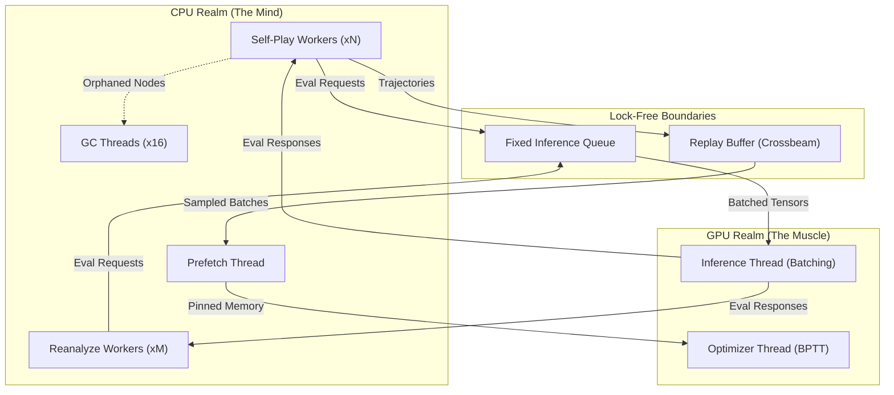
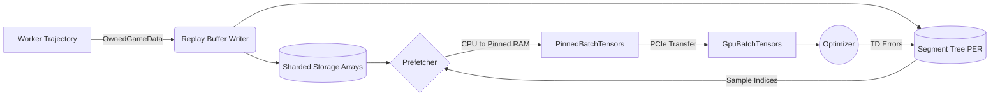
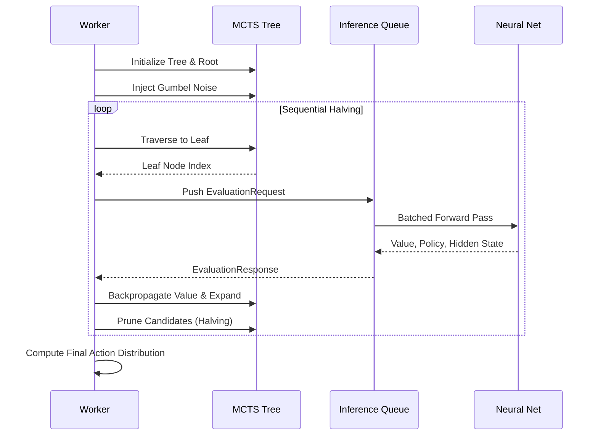
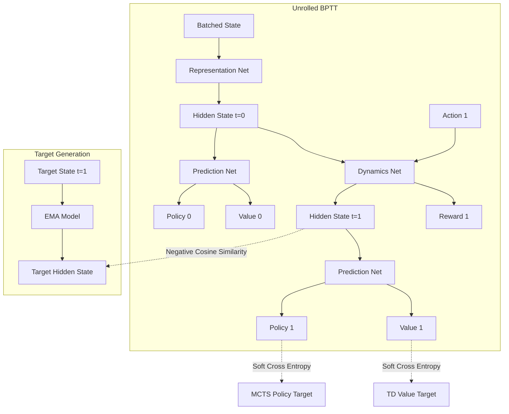

# Tricked AI Engine


Tricked is a high-performance Reinforcement Learning engine that solves a custom topological board puzzle. It trains AlphaZero/MuZero-style agents utilizing strict zero-debt Rust lock-free algorithms to squeeze 100% throughput out of multi-core CPU and GPU platforms without memory starvation.

***

## 1. Game Mechanics & Environment
**Tricked** is a single-player topological survival puzzle. Unlike traditional zero-sum board games like Chess or Go, the primary adversary here is geometric entropy. The agent must continuously clear lines to manage board density, utilizing extreme spatial reasoning to chain multi-axis intersecting combos.

*   **The Grid:** A regular hexagon composed of exactly **96 equilateral triangles** (side length of 4 units).
*   **Rhombus Coordinate Cube System:** To elegantly handle spatial reasoning, the board uses a 3-axis ($X, Y, Z$) coordinate system. Adjacent triangles are conceptually treated as rhombuses, representing the visible faces of 3D cubes in an isometric projection. This allows for hyper-efficient mathematical validation of straight lines across the grid.
*   **The 3-Piece Buffer:** The agent is given a buffer of up to 3 randomly generated poly-triangle pieces. It must place them in unoccupied absolute coordinates. The buffer only regenerates a fresh batch *after* all 3 pieces have been legally placed.
*   **Monochrome Topology:** Pieces have no colors and function purely as binary obstacles (1 = occupied, 0 = empty), forcing the AI to rely entirely on pure geometric shape.
*   **Scoring & Line Clearing:** A "line" is an edge-to-edge sequence of triangles spanning any of the 3 axes.
    *   *Base Value:* **2 points** per triangle in a cleared line.
    *   *Intersection Multiplier (Combos):* If a piece completes multiple overlapping lines simultaneously, intersection triangles are scored independently for *each* line. (e.g., An overlapping intersection in a 3-line cross yields $2 \times 3 = 6$ points).
*   **Terminal State:** The episode terminates when board clutter prevents the legal placement of *any* remaining pieces in the 3-piece buffer.

---

## 2. Mathematical Baseline (Monte Carlo Metrics)
To establish an absolute mathematical floor, a blind Monte Carlo uniform distribution analysis was run. This defines the exact statistical behavior of an agent placing pieces entirely at random without any spatial planning. 

<div align="center">
  <p><i>Simulated 100,000,000 Games in 197.10s | Pure Random Policy</i></p>
</div>

| 🎯 Average Score | 🏆 P99 Score | 👑 Max Score |
| :---: | :---: | :---: |
| <h1>103.8</h1> | <h1>337</h1> | <h1>643</h1> |
| **⏱️ Average Length** | **💀 Death Rate (0 Lines)** | **🧩 Total Pieces Placed** |
| <h1>47.6 <br><sup>Turns</sup></h1> | <h1>51.8%</h1> | <h1>4.75 <br><sup>Billion</sup></h1> |

### 📊 Key Distribution Insights
*   **The 51.8% Gravity Well:** More than half of all random games end before a single line is cleared. A blind agent essentially suffocates itself instantly by failing to understand topological alignment.
*   **The P99 Barrier:** Only 1% of purely random games survive past a score of 337.
*   **Piece Geometry Limit:** Across 4.75 billion pieces placed, a Size 6 triangle piece was **never legally placed**. This mathematically proves that surviving long enough to fit massive geometry requires deliberate, forward-looking board management.

---

## 3. AI Learning Objectives & Milestones
To mathematically prove that the AlphaZero/MuZero representation has transcended random geometric variance, the following milestones must be sequentially achieved during the Auto-Tuning Reinforcement loop.

### Phase 1: "Sight" *(Escaping the Gravity Well)*
The first goal of the localized Value/Policy network. The agent must prove it can "see" the board and avoid the immediate topological traps that kill random agents 51.8% of the time.
> **Target Survival:** `> 65 turns` (Consistent)
> **Target Score:** `> 180 points`
> **Mechanic Goal:** Consistently clear 2 to 3 lines per episode, establishing the foundational understanding that clearing lines frees up board space.

### Phase 2: "Planning" *(P99 Mathematical Parity)*
At this stage, the network's value head has stabilized. The MCTS (Monte Carlo Tree Search) successfully connects multiple piece placements over time.
> **Target Survival:** `> 100 turns` (Consistent)
> **Target Score:** `> 340 points` *(Officially beating 99% of 100M random games)*
> **Mechanic Goal:** The agent recognizes that waiting for a specific piece to complete a 9-length coordinate axis is more valuable than placing pieces uniformly.

### Phase 3: "Mastery" *(Super-Human Intersection)*
Achieving this state proves the AI understands the `apply_move` multi-axis intersection multiplier. 
> **Target Survival:** `> 300 turns`
> **Target Score:** `> 1,500 points`
> **Mechanic Goal:** The agent intentionally builds "stars" (highly structured grid layouts) before clearing them. It heavily prioritizes playing pieces at grid intersections *(0,0,0 coordinate centers)* to cascade simultaneous line clears.

### Phase 4: "God-Level" *(Infinite Play)*
Theoretical topological God-Level mastery. Absolute mastery means achieving a strictly positive clearance-to-clutter ratio.
> **Target Survival:** `1,000+ turns` *(Effectively Unbounded)*
> **Target Score:** `10,000+ points`
> **Mechanic Goal:** Board density stabilizes perfectly at `< 40%`. The agent strictly maintains open 5-length vectors to accommodate massive 5-triangle piece geometries at all times, ensuring the 3-piece buffer is never choked.

#### ⚙️ Hardware Implementation Note: D6 Dihedral Augmentation
To accelerate the AI's journey to God-Level parity, the training loop implements **Dihedral D6 Data Augmentation**. Because the hexagonal game board is symmetric, *Tricked* inherently contains **12 topological symmetries** (6 Rotations, 6 Reflections). During training, a single MCTS simulation trajectory is multiplied by 12 using geometric transformations before being fed into the Neural Network, drastically reducing the wall-clock time required to achieve structural "Sight".

---

## 4. Architecture Overview

Tricked AI is built on a strictly lock-free, zero-allocation hotpath architecture. The system is divided into distinct realms to prevent CPU/GPU starvation and maximize PCIe bus throughput.

### I. Process & Thread Topology
The engine isolates the unpredictable branching logic of MCTS from the brutal matrix arithmetic of the GPU. Communication occurs strictly over Crossbeam channels.



### II. Data Flow & Memory Management
To prevent heap thrashing, memory is pre-allocated into massive arenas. The GPU never waits for the CPU to format data; the Prefetch thread prepares `PinnedBatchTensors` in the background and seamlessly transfers them to `GpuBatchTensors`.



### III. MCTS & Gumbel AlphaZero Search
The search tree utilizes Sequential Halving and Gumbel Noise to aggressively prune the search space. Nodes are allocated from a lock-free `ArrayQueue` to guarantee zero-allocation traversals.



### IV. MuZero Training & Unrolled BPTT
The optimizer unrolls the dynamics network over time, calculating Soft Cross Entropy and Negative Cosine Similarity against an Exponential Moving Average (EMA) target network to prevent representation collapse.



---

## 5. Usage & Development

### Setup & Build
This repository relies on a zero-debt compilation standard.
```bash
cargo build --release
make lint
make test
```

## 6. RL Cricket Style: The Philosophy of Leverage

> “The cricket’s leap is not born of magic, but of perfect, coiled tension. We do not build monoliths; we build engines of pure leverage.”

You are one mind. You have one machine. You are competing against armies of engineers backed by infinite compute. To win, you cannot rely on brute force. You must rely on absolute clarity, ruthless division of labor, and a profound respect for the physical limits of your vessel. 

**Cricket Style** is not a set of instructions. It is a philosophy of maximum leverage. It is the art of doing exactly what is necessary, exactly where it belongs, and naming it exactly what it is.

---

### The Duality of Mind and Muscle

The greatest sin of modern AI engineering is asking the mind to lift boulders, or asking the muscle to solve riddles. Cricket Style demands a hard, impenetrable boundary between logic and geometry.

**The Realm of Rust (The Mind):**
The CPU is the realm of branching paths, infinite futures, and unpredictable exploration. It is where the Monte Carlo Tree Search lives. It is where the rules of the universe (the environment) are enforced. The mind is agile. It handles the chaos of concurrency, the mutation of memory, and the traversal of the unknown. We do not ask the GPU to walk the tree; it would stumble. *Zero-Allocation Paths:* To maintain maximum throughput, the MCTS hot-path utilizes strictly stack-allocated structures (`ArrayVec`) for spatial search traversals and inference queue batching, eliminating heap thrashing and unpredictable GC pauses.

**The Realm of CUDA (The Muscle):**
The GPU is a blind, unthinking engine of pure geometric transformation. It does not understand rules, it does not understand trees, and it abhors a decision. It only understands dense, massive matrices. We do not write custom kernels to teach the muscle how to think. We simply feed it massive blocks of contiguous memory, let it perform its brutal arithmetic, and get out of its way.

---

### The Reverence for Boundaries

A solo developer pushing a machine to the edge must design around the physical laws of the hardware. To ignore these limits is to invite starvation and collapse. We embrace our constraints, for art is born of them.

1.  **The Boundary of Space (VRAM):** 
    Memory is finite. As our explorers dream of millions of future states, the muscle's memory will fill. We must practice ruthless impermanence. When a future is no longer needed, its memory must be instantly reclaimed. Garbage collection is not a background task; it is the heartbeat of survival.
2.  **The Boundary of Distance (The PCIe Bus):**
    The bridge between the mind and the muscle is narrow and slow. We do not cross it unless absolute necessity dictates. When the muscle imagines a future state, that state remains with the muscle. We do not drag heavy thoughts back across the bridge; we pass only a whisper—a lightweight index, a pointer to a memory already held.
3.  **The Boundary of Time (Starvation):**
    The muscle is a leviathan; if fed a single thought, it starves. It demands a feast. Therefore, the mind must be fractured into legions of independent explorers. While the muscle digests a massive batch of thoughts, the explorers must already be gathering the next feast. Neither mind nor muscle must ever wait for the other. *Pinned Object Pooling:* To safeguard this pipeline and eliminate locking bottlenecks, memory arenas containing heavily pre-pinned GPU transfer blocks are seamlessly recycled back to background threads using lock-free channels, making memory overwriting strictly impossible and rendering GPU starvation impossible.

---

### The Symphony of the Loop

In the ideal world, communication between processes is not a series of locks and blocks, but a frictionless, continuous flow. 

**The Explorers and the Oracle:**
Our workers are solitary explorers wandering the forest of futures. They share no state. They do not wait for one another. When an explorer reaches the edge of its understanding, it does not attempt to guess the future. It leaves a question at the Boundary (the Queue) and sleeps. 

The Boundary gathers these questions into a chorus (the Batch). Only when the chorus is loud enough does it present the questions to the Oracle (the GPU). The Oracle speaks in geometry, writing its answers directly into the void of its own memory, returning only a map of where the answers lie. The explorers awaken, read the map, and continue their journey.

**The Architect in the Shadows:**
While the explorers dream, the Architect (the Optimizer) learns. It observes the memories of past journeys and reshapes the Oracle's understanding. But the explorers must never be interrupted by the Architect's work. We embrace the philosophy of the *Double Mind*. The Architect builds a new mind in the shadows. When it is ready, the minds are swapped in a single, atomic instant. Zero locks. Zero stutter. Uninterrupted flow.

---

### The Sanctity of Language

Language is the map of our understanding. Code is read infinitely more times than it is written. As a solo developer, your greatest enemy is not the compiler; it is your own forgotten context. Six months from now, you will wander these halls alone. 

**We hate abbreviations with a burning passion.** 
To abbreviate is to obscure. To shorten a word is to steal meaning from the future self. Keystrokes are infinite and free; cognitive capacity is precious and strictly bounded. 

*   A name must be a complete, unbroken thought. 
*   We do not write `td_steps`; we write `temporal_difference_steps`. 
*   We do not write `obs`; we write `batched_observations`. 
*   We do not write `val`; we write `predicted_value_scalar`.

**We encode the shape of reality into our words.**
In the realm of tensors, a shape mismatch is a silent killer. The dimensions of reality must be spoken aloud in the name of the thing itself. We do not pass a `policy`; we pass `target_policies_batch_time_action`. When the shape of the data is woven into its true name, the architecture becomes self-evident, and the mind is freed from remembering what the machine can simply state.

---

### The Final Stage

We do not build complex systems because we want to; we build them because the domain demands it. But within that complexity, we enforce brutal simplicity. 

We respect the mind. We respect the muscle. We respect the boundaries of the machine. And above all, we respect the sanctity of the words we use to bind them together.

Keep the thoughts clear. Keep the names whole. Keep the leaps massive. 

Jump.

## 7. Contributing
See [CONTRIBUTING.md](CONTRIBUTING.md) for our exact standards. We enforce a zero-debt policy. No `#[allow(...)]` tags, no suppressed warnings, all lints and tests must pass locally.

## License
MIT License. See [LICENSE](LICENSE) for more details.