<div align="center">
  
</div>

<br/>

# Tricked | Ultra-Low Latency RL Engine

**Tricked** is a state-of-the-art, high-throughput Reinforcement Learning engine built specifically for MuZero/AlphaZero style algorithms. Bridging the gap between rapid Python prototyping and bare-metal performance, Tricked leverages a hybrid architecture: **Python/LangGraph** for high-level orchestration and a **Rust 1.75+ C++ (CUDA)** core for sub-millisecond Monte Carlo Tree Search (MCTS) execution. 

Designed to train complex latent dynamics models without getting bottlenecked by the Python Global Interpreter Lock (GIL) or Garbage Collector, it implements lock-free concurrency, zero-copy buffer sharing, and Gumbel-bounded MCTS to eliminate GPU thread divergence.

---

## 🏗 Exhaustive System Architecture & Workflow

To fully grasp the scale, latency optimization, and memory safety paradigms of Tricked, the architecture is broken down into **20 Systems Diagrams**, exploring everything from the FFI boundary to the MCTS nodes.

---

### Part 1: Core System & FFI Architecture

#### 1. High-Level Hybrid Architecture
The macro-view of how Python orchestration delegates to the Rust execution engine.

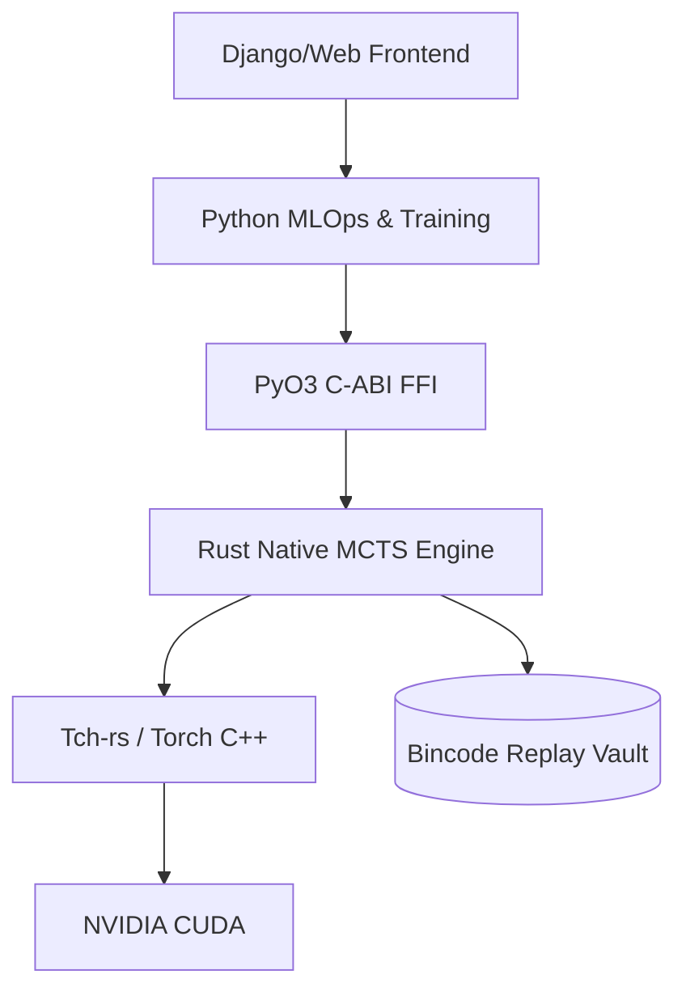

#### 2. The PyO3 Execution Boundary
How commands cross from the GC-heavy Python environment into the memory-safe Rust execution without copying large arrays.

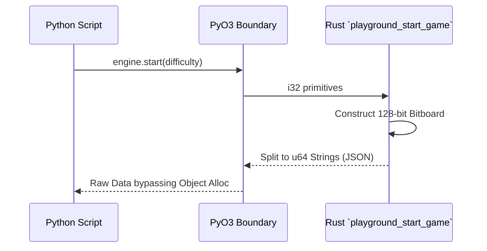

#### 3. Lock-Free Inference Concurrency (`FixedInferenceQueue`)
To prevent OS-level mutex contention (cache-line bouncing), inference requests use Crossbeam's ArrayQueues linked to pinned memory slots.

```mermaid
flowchart LR
    Act[MCTS Actor 1] --> Pop[Pop `free_slot`]
    Act2[MCTS Actor 2] --> Pop
    Pop --> Write[Write to UnsafeCell[slot]]
    Write --> Push[Push `slot` to `initial_ready`]
    Push --> Worker[Inference Worker]
    Worker --> Free[Push to `free_slots`]
```

#### 4. The UnsafeCell Pinned Memory Strategy
How Rust bypasses the allocator entirely in the hot-path to strictly prevent GC pauses during peak inference.

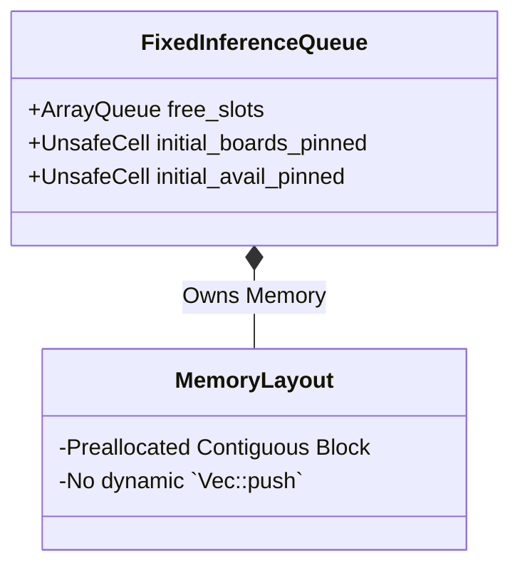

---

### Part 2: Monte Carlo Tree Search & Mathematics

#### 5. MCTS Gumbel MuZero Expansion Tree
Tricked doesn't use standard bounds; it uses Sequential Halving (Gumbel MuZero) to iteratively prune actions rather than simulating infinitely deep linear rollouts.

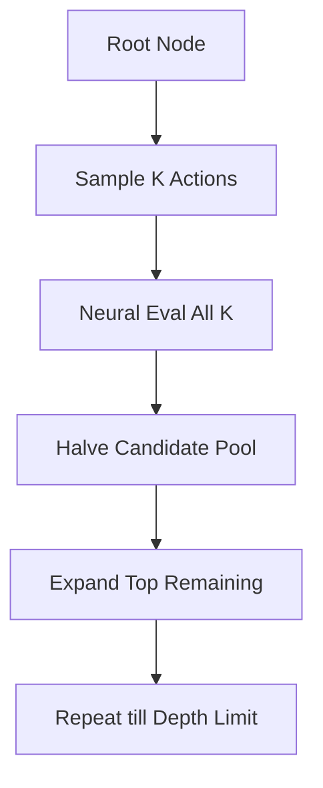

#### 6. Mitigating GPU Thread Divergence
Traditional MCTS simulates game paths of varying lengths, causing SIMT GPU divergence. Tricked aligns requests perfectly.

```mermaid
stateDiagram-v2
    State1 : Asynchronous CPU Threads Tree Search
    State2 : Micro-Batch Gather (250µs Window)
    State3 : Uniform Dense Tensor [B, C, H, W]
    State4 : CUDA CModule::forward_is
    
    State1 --> State2 : Wait & Batch
    State2 --> State3 : Align Matrix
    State3 --> State4 : Zero Branching
```

#### 7. Gumbel Noise Action Injection
Forcing exploration deterministically mathematically without relying purely on Dirichlet noise.

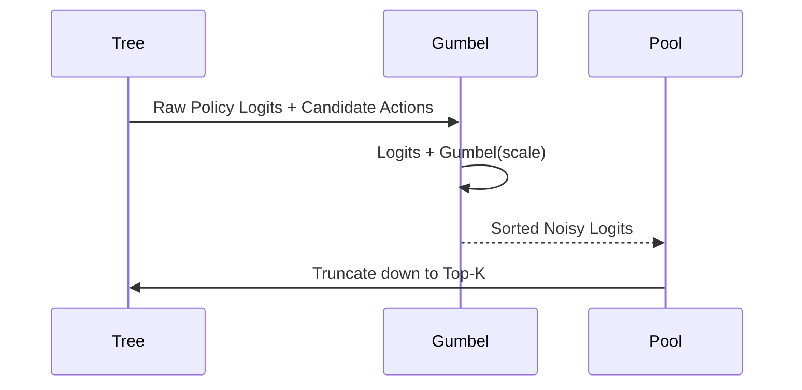

#### 8. GPU Argmax Linear Proxy Quantization
Instead of computing the highly expensive floating-point expected value `sum(P(x)*x)` across channel dimensions, Tricked trades slight ensemble precision for blistering speed.

```mermaid
graph LR
    Log[Value Logits] --> GPUMax[GPU argmax(1)]
    GPUMax --> Cast[i64 int_value]
    Cast --> Proxy[v_idx - support_size]
    Proxy --> Float(f32 Scalar for Python)
```

---

### Part 3: Deep Data Locality & Synchronization

#### 9. U128 Bitboard vs Dense Tensor Mapping
Translating the complex game hexagonal grids into byte-perfect structures instantly.


#### 10. Latent State Caching (Zero-Copy Dynamics)
When calculating Recurrent phases, the high-dimensional hidden state never leaves the C++ context. Python acts strictly via pointers.

```mermaid
flowchart TD
    Init[Initial Core] -->|Returns| Index[leaf_cache_index]
    Index --> Py[Python Context (i64)]
    Py -->|Submits Action| RecReq[Recurrent Request]
    RecReq --> Recur[Recurrent Engine]
    Recur -->|Gather from Storage| Mem[(hidden_state_cache tensor)]
```

#### 11. The Mailbox Synchronization Pattern
How Rust threads wake up exactly when their specific tensor slice is finished processing on the GPU.

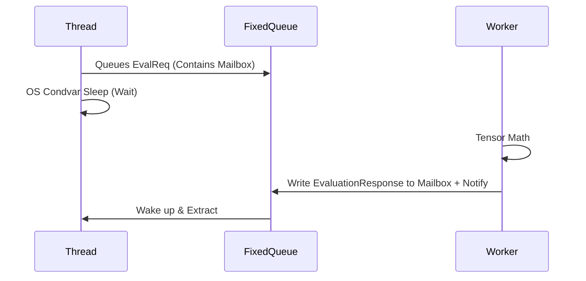

---

### Part 4: Replay Buffer & Training Vault System

#### 12. Bincode Replay Buffer Serialization
Why we abandoned Pickle/JSON for storing high-dimensional episode trajectories.

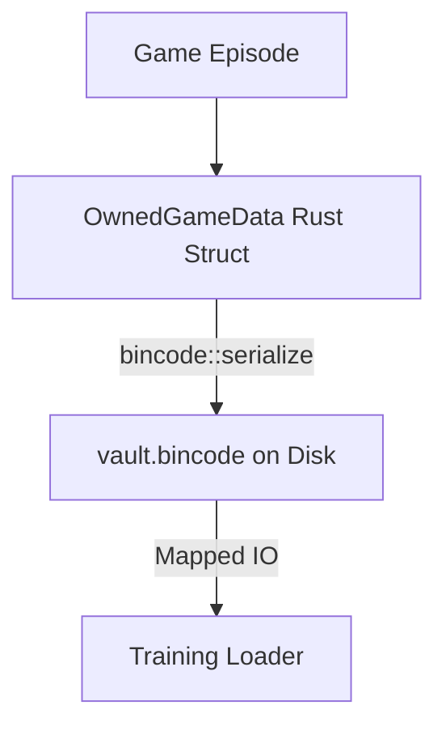

#### 13. Data Vault Compartmentalization
Managing the splits between human gameplay and reinforcement self-play cleanly.

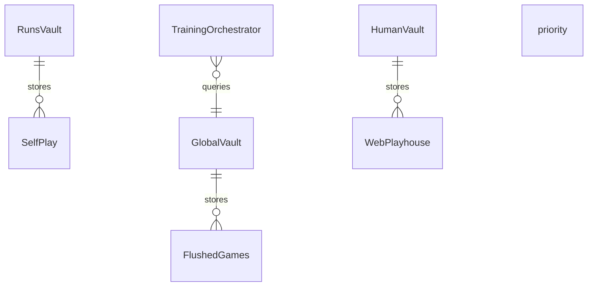

#### 14. Zero-Copy Inference Batching
Building contiguous arrays for Tch without repetitive memory allocations.

```mermaid
stateDiagram-v2
    Req1 --> Merge
    Req2 --> Merge 
    Merge --> PtrArray : Write slice direct to pinned array
    PtrArray --> F_Tensor : tch::Tensor::from_slice (O(1))
```

---

### Part 5: MLOps & System Telemetry

#### 15. Real-Time Job Monitoring & Telemetry
The `telemetry.rs` and `job_monitor.py` feedback loop, enforcing deterministic throughput monitoring.

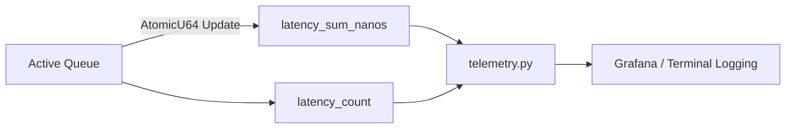

#### 16. Django / Frontend Orchestration
How the visual playground interfaces with the deep Rust bindings without hanging.

```mermaid
graph TD
    Browser[React/Websocket] --> Django[server.py]
    Django -->|JSON Request| view[commit_human_game()]
    view --> PyO3_Module[tricked_engine module]
    PyO3_Module --> Bincode[Appends to human_vault]
```

#### 17. The Training Loop Epoch Flow
Coordination of distributed actor nodes vs the central gradient optimizer.

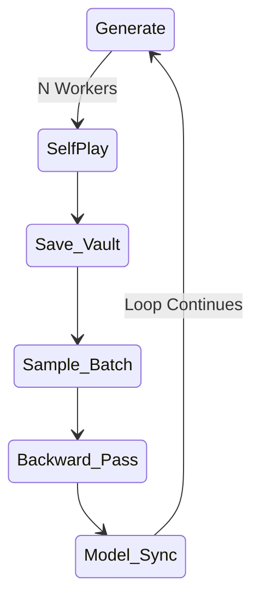

#### 18. Hardware Resource & Process Manager
Process orchestration allocating specific CPU pins and GPUs globally.

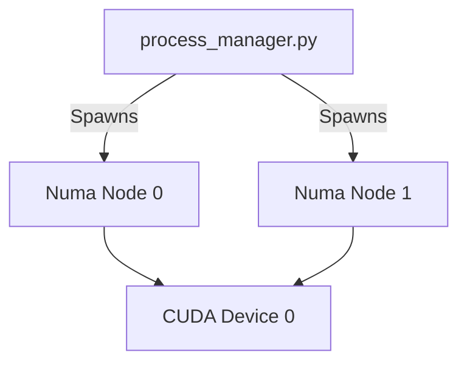

#### 19. Initial vs Recurrent Batch Slicing
Because Initial Inference and Recurrent Inference use completely different CModules, the engine bifurcates efficiently.

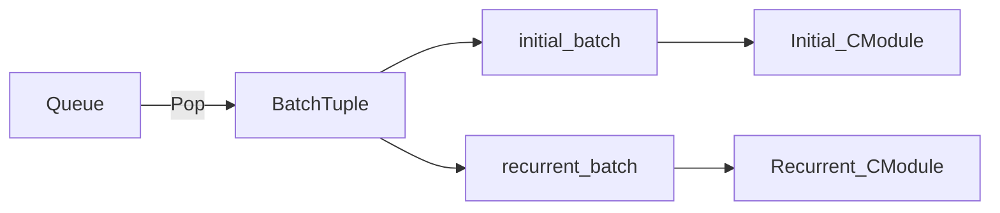

#### 20. Tricked Complete Project Integration Event Cycle
From cold start to continuous autonomous reinforcement learning.

```mermaid
sequenceDiagram
    participant Manage as main.py
    participant PM as Process Manager
    participant Actor as Rust Actor
    participant GPU as CModule
    participant DB as Vault
    participant Train as Trainer

    Manage->>PM: Boot N Actors
    PM->>Actor: Start loop
    Actor<->GPU: Play 1000 games
    Actor->>DB: Dump Bincode Artifacts
    Manage->>Train: Initialize Loss Check
    Train->>DB: Pluck Top 100
    Train->>Train: Backpropagate
    Train->>GPU: Reload Weights
```

---

## 🛠 Building & Setup

### Prerequisites
* Rust Toolchain `1.75+`
* Python `3.10+`
* LibTorch C++ (`libtorch` / CUDA 12 support)

### Installation
```bash
# 1. Compile the high-performance Engine
cd tricked/engine
cargo build --release

# 2. Build Python bindings (requires maturine or setuptools-rust)
cd ../..
pip install -e .

# 3. Enter orchestrator
python manage.py run_pipeline
```

> **Note:** The Rust components assume access to AVX/SIMD CPU lines for bitboard calculation and will aggressively allocate system cache limits for the `FixedInferenceQueue`. Ensure your target device fits the required `pyproject.toml` specs.
