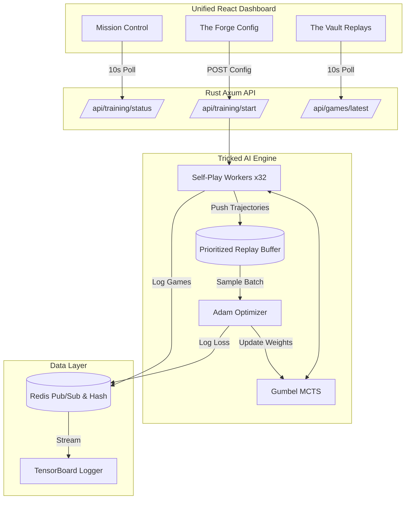
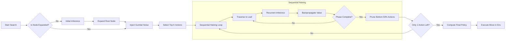
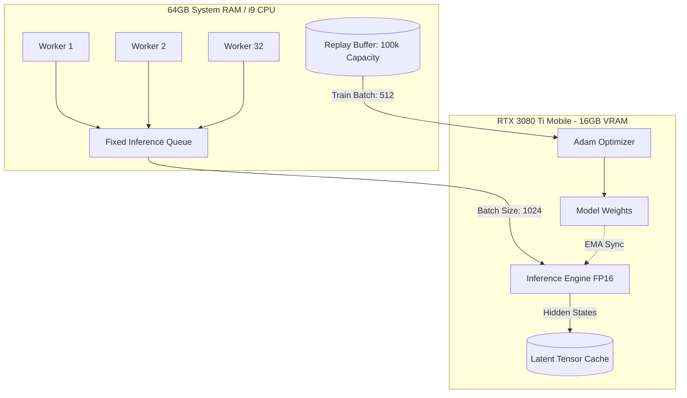
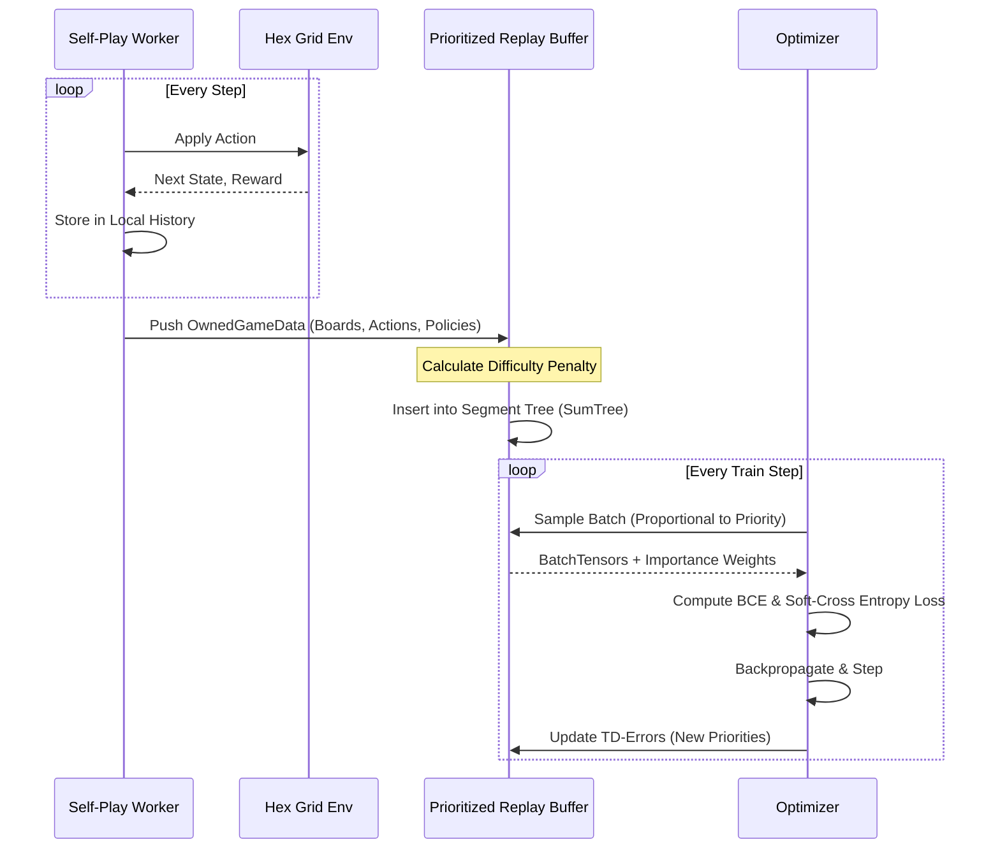
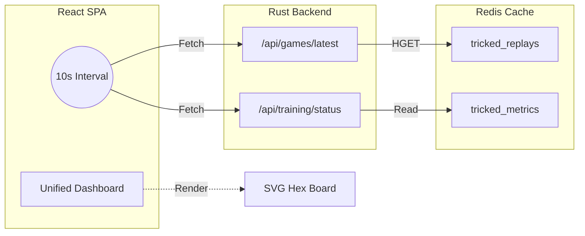

<div align="center">
  
  <h1>Tricked AI Engine</h1>
  <p><em>A High-Performance, Native Reinforcement Learning Engine</em></p>

  
  
  
  
</div>

**Tricked** is an elite, native Reinforcement Learning engine implementing a **Gumbel MuZero** agent to master a topological puzzle game on a 96-triangle hexagonal grid. 

Optimized specifically for solo-developer hardware (RTX 3080 Ti Mobile, i9, 64GB RAM), the engine bypasses the Python GIL entirely, leveraging a **Rust backend** and `tch-rs` (LibTorch) to orchestrate massively concurrent self-play, MCTS search, and network optimization.

---

## 🏗️ 1. END-TO-END SYSTEM TOPOLOGY

This diagram illustrates the macro architecture, showing how the Rust Engine, Redis, and the Unified React UI interact via 10-second REST polling.



---

## 🧠 2. GUMBEL MUZERO MCTS EXECUTION FLOW

The core decision-making algorithm. This details how Sequential Halving and Gumbel Noise are injected into the Monte Carlo Tree Search to ensure optimal exploration without the Python GIL overhead.



---

## 🕸️ 3. NEURAL NETWORK ARCHITECTURE

The MuZero model is split into three distinct ResNet-based networks. The environment is mapped to a 20-channel 8x16 spatial tensor.

```mermaid
graph TD
    Input[State Tensor: 20x8x16] --> RepNet
    
    subgraph Representation_Network
        RepNet[Conv2D Projection] --> R_Res1[ResNet Block 1]
        R_Res1 --> R_ResN[ResNet Block N]
        R_ResN --> HiddenState[Hidden State: d_model x 8 x 8]
    end

    HiddenState --> PredNet
    HiddenState --> DynNet

    subgraph Prediction_Network
        PredNet[LayerNorm] --> P_Val[Value Head]
        PredNet --> P_Pol[Policy Head]
        P_Val --> ValOut[Scalar Value]
        P_Pol --> PolOut[Action Logits: 288]
    end

    subgraph Dynamics_Network
        DynNet[Concat Action + Hidden] --> D_Res1[ResNet Block 1]
        D_Res1 --> D_ResN[ResNet Block N]
        D_ResN --> NextHidden[Next Hidden State]
        DynNet --> D_Rew[Reward Head]
        D_Rew --> RewOut[Scalar Reward]
    end
```



---

## 💻 4. HARDWARE RESOURCE MAPPING (RTX 3080 Ti Mobile)

How the engine maps threads and memory to a solo-developer laptop (16GB VRAM, 14-Core CPU).



---

## 🔄 5. DATA PIPELINE & REPLAY BUFFER

The lifecycle of a game trajectory from generation to optimization.



---

## 🌐 6. UNIFIED UI POLLING ARCHITECTURE

The refactored, memory-efficient UI architecture. WebSockets have been removed to save 2GB of RAM. The UI now uses lightweight 10-second polling.



---

## 🚀 Getting Started

### Prerequisites
*   **Rust**: Standard `cargo` toolchain (1.75+).
*   **Node.js**: v18+ for the frontend.
*   **Redis**: Running on `localhost:6379`.
*   **Hardware**: Optimized for RTX 3080 Ti Mobile (16GB VRAM).

### 1. Launch the Engine & TensorBoard
```bash
docker-compose up -d redis
make run
```
* TensorBoard: `http://localhost:6006`
* Axum API: `http://localhost:8000`

### 2. Start the Unified UI
```bash
cd ui
npm install
npm run dev
```
* Navigate to `http://localhost:5173` to access the Unified Dashboard.
