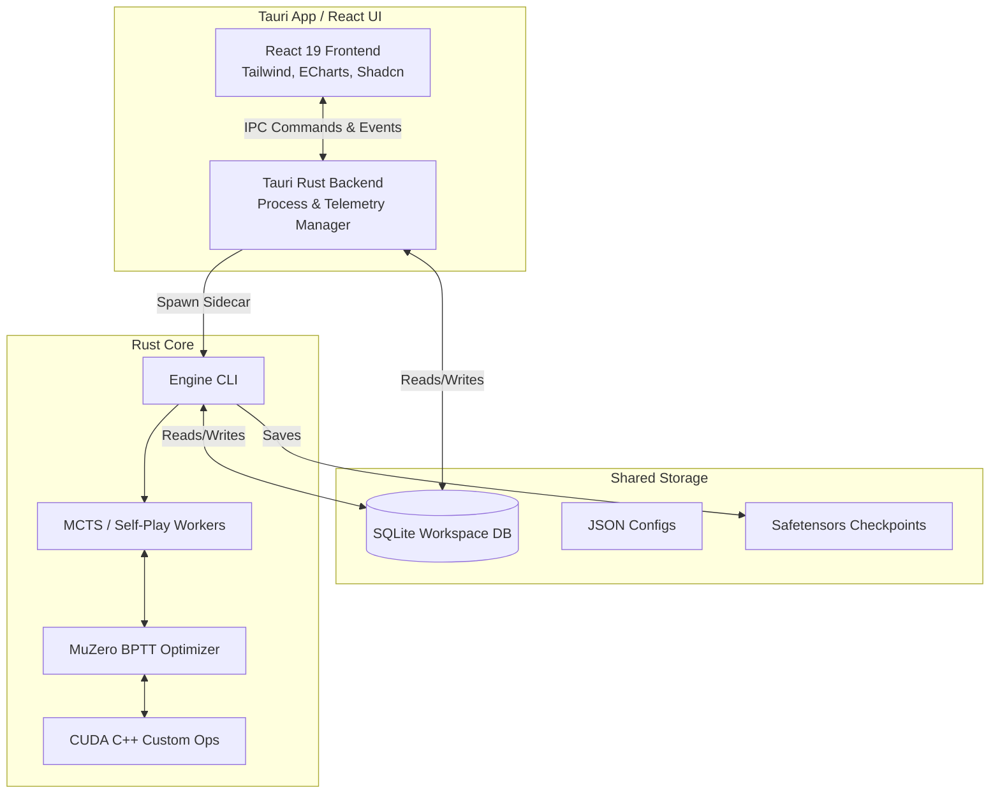
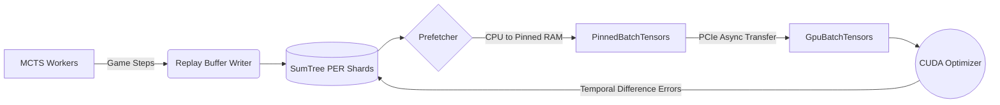
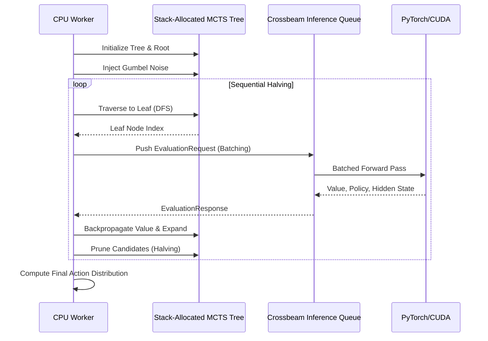
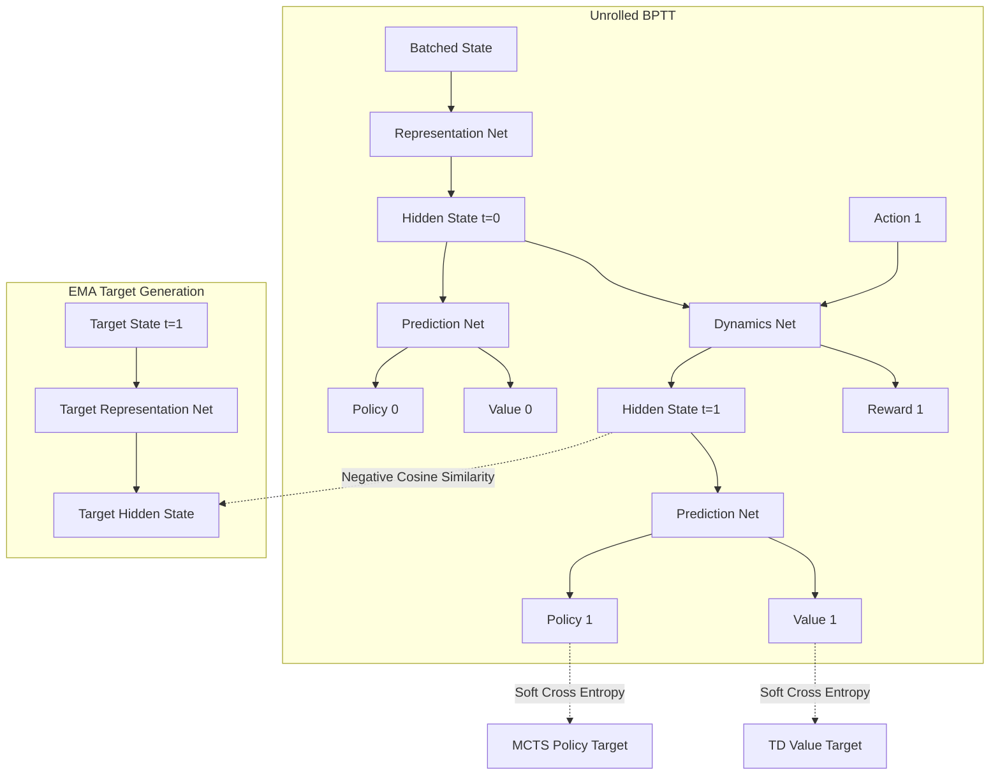

<div align="center">


# Tricked AI Engine

**A Zero-Debt, Lock-Free MuZero Reinforcement Learning Engine & Control Center**

[](https://www.rust-lang.org)
[](https://v2.tauri.app/)
[](https://react.dev/)
[](https://developer.nvidia.com/cuda-toolkit)
[](LICENSE)

</div>

Tricked is a high-performance Reinforcement Learning engine that solves a custom topological board puzzle. It trains AlphaZero/MuZero-style agents utilizing strict zero-debt Rust lock-free algorithms to squeeze 100% throughput out of multi-core CPU and GPU platforms without memory starvation. 

Beyond the core engine, Tricked features a native **Tauri + React Control Center** for real-time hardware telemetry, live log routing, hyperparameter tuning via Optuna, and interactive environment playgrounds.

---

## 🏗️ High-Level Architecture

The Tricked ecosystem is split into the headless Rust/CUDA training engine and the Tauri-based Control Center. They communicate asynchronously via a unified SQLite workspace database and stdout log streams.



---

## 🖥️ The Control Center (Tauri)

The Tricked engine ships with a deeply integrated GUI to visualize the massive streams of telemetry data generated during reinforcement learning.

*   **Live Process Diagnostics:** View process trees, RAM, VRAM, and CPU saturation down to the specific PID of training workers.
*   **Optuna Tuning Lab:** A massive 2D/3D visualization suite displaying Pareto fronts (Hardware limits vs. Evaluation Loss), hyperparameter importance, and pruning step distributions dynamically fetched from `unified_optuna_study.db`.
*   **Tricked Playground:** Play the exact hexagonal board game the AI is learning. Native Rust state-bindings (`GameStateExt`) are compiled to WebAssembly/Tauri IPC to guarantee the frontend reflects the exact mathematical boundaries the AI sees.

### Tuning & Optuna Pipeline
```mermaid
sequenceDiagram
    participant UI as Tauri Control Center
    participant Eng as Tricked Engine (Sidecar)
    participant Opt as Optuna Python
    participant DB as SQLite DB

    UI->>Eng: Start Tuning Study (Trials: 50)
    loop Every Trial
        Eng->>Opt: Request Hyperparameters (optuna_ask.py)
        Opt-->>Eng: JSON Bounds (Batch Size, LR, etc)
        Eng->>Eng: Run BPTT Optimization Loop
        Eng->>DB: Stream Live Telemetry (Loss, FPS)
        Eng->>Opt: Report Final Loss & Hardware Penalty (optuna_tell.py)
        Opt->>DB: Update Pareo Fronts & Importance
    end
    DB-->>UI: Live ECharts Updates
```

---

## ⚙️ Core Engine Architecture (The Mind vs. Muscle)

The greatest sin of modern AI engineering is asking the mind to lift boulders, or asking the muscle to solve riddles. Tricked demands a hard, impenetrable boundary between logical tree-search and geometric tensor arithmetic.

### I. Lock-Free CPU/GPU Pipeline
Memory is finite. The GPU never waits for the CPU to format data. A dedicated `Prefetch` thread formats memory arenas into pinned memory (`PinnedBatchTensors`) in the background and seamlessly transfers them to `GpuBatchTensors` via PCIe.



### II. Gumbel AlphaZero MCTS Flow
The search tree utilizes **Sequential Halving** and **Gumbel Noise** to aggressively prune the search space. Nodes are allocated from a lock-free `ArrayQueue` to guarantee zero-allocation traversals.



### III. MuZero Unrolled BPTT Architecture
The optimizer unrolls the dynamics network over time, calculating Soft Cross Entropy and Negative Cosine Similarity against an Exponential Moving Average (EMA) target network to prevent representation collapse.



---

## 🎮 Game Mechanics & Environment

**Tricked** is a single-player topological survival puzzle. The agent must continuously clear lines to manage board density, utilizing extreme spatial reasoning to chain multi-axis intersecting combos.

*   **The Grid:** A regular hexagon composed of exactly **96 equilateral triangles** (side length of 4 units).
*   **Coordinate System:** The board is represented natively as a raw `u128` bitmask, processing line clears at near-zero latency using `ALL_MASKS` bitwise comparisons.
*   **Scoring:** A cleared line spanning any axis grants points. Overlapping intersections act as combo multipliers.
*   **Terminal State:** The episode ends when board clutter mathematically prevents the placement of *any* remaining pieces in the 3-piece tray.

---

## 🚀 Installation & Usage

### Prerequisites
Tricked enforces a **Zero-Debt** compilation standard. All lints must pass.
- Rust Toolchain (`stable`)
- Node.js (`v20+`)
- CUDA Toolkit (`13.2+`)
- Python 3 with `uv` package manager

### Building the Project
We provide a centralized `Makefile` to handle building the custom PyTorch C++ extensions (`tricked_ops.so`), the Rust engine sidecar, and the Tauri frontend simultaneously.

```bash
# 1. Install dependencies and compile CUDA ops
make all

# 2. Run the Tauri Control Center in Dev Mode
make dev
```

### Headless CLI Usage
If you wish to run the engine bypassing the UI, you can use the CLI directly:

```bash
cargo run --release --bin tricked_engine -- train \
    --experiment-name "baseline_v1" \
    --simulations 200 \
    --train-batch-size 1024 \
    --lr-init 0.02
```

## ⚖️ License
MIT License. See [LICENSE](LICENSE) for more details.
