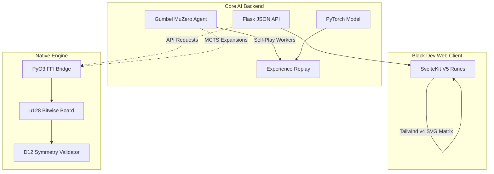

<div align="center">
  

  <h1>Tricked 🔺</h1>
  <p><b>High-Performance SOTA Mathematical Engine & Gumbel MuZero Tree Search</b></p>

  <p>
    
    
    
    
    
    
    
  </p>
</div>

---

## 🌌 Ecosystem Architecture
Tricked is a multi-language ecosystem optimized entirely to prevent standard abstraction delays. We translate raw bitwise board matrices from Python natively into a **Rust (PyO3) Verification Engine**, achieving zero-cost tensor bounds for ultra-concurrent MCTS expansions.

The system features a completely decoupled Svelte 5 frontend interacting seamlessly with a Flask JSON Core.



## 🔥 High-Fidelity Features

1. **Rust PyO3 Engine (`tricked_rs`)**: Total mathematical bound verification with zero memory leaks. 120-degree Tri-Coordinate mathematics seamlessly map (9,11,13,15,15,13,11,9) layout structures directly to `u128` integers.
2. **Gumbel MuZero Reinforcement**: Replaced legacy scalar heuristics with Two-Hot Cross Entropy and Spatial ResNets for maximum predictive precision.
3. **Live Spectator Mode**: Ultra-high-performance UI tracking. Subprocesses asynchronously dump lock-free mathematical permutations polled by the Svelte Client at 100ms rates without bottlenecking the PyTorch Training cycles.
4. **Progressive Difficulty Curriculum**: Automated threshold promotion scaling up Dihedral spatial reasoning from simple isolated anchors all the way to 26 perfectly mathematically closed D12 piece definitions.

---

## 🚀 Execution & Bootstrap

### 1. Cloud / RTX Docker Container (Recommended)
Containerize the entire ecosystem effortlessly spanning physical RTX nodes:
```bash
docker build -t tricked-ai:latest .
docker run --gpus all -p 6006:6006 -p 8080:8080 -p 5173:5173 tricked-ai:latest
```
*Intercept the dynamic loss curves natively on: `http://localhost:6006`*
*View the live HUD Spectator natively on: `http://localhost:5173`*

### 2. Manual Source Compilation
Install the ecosystem targeting native Python optimization. `pip install` transparently invokes `maturin` to bind the Rust structs.
```bash
python3 -m pip install -e .
cd ui && npm install && npm run dev
```

### 3. Training Orchestrator
We expose a globally registered training orchestrator accessible universally:
```bash
tricked-train
```

### 4. Regenerating Shapes & Rust Constants
If you modify the underlying mathematical grid or symmetry definitions, you must regenerate the canonical piece data and compiling the Rust engine:

```bash
# 1. Regenerates Python PieceDefs and Rust bitmasks
python scripts/generate_all.py 

# 2. Recompile the Rust PyO3 Engine for the local environment
maturin develop --release
```

---
<div align="center">
  <i>Engineered for Maximum Capability • Pure Mathematical Strategy</i>
</div>
