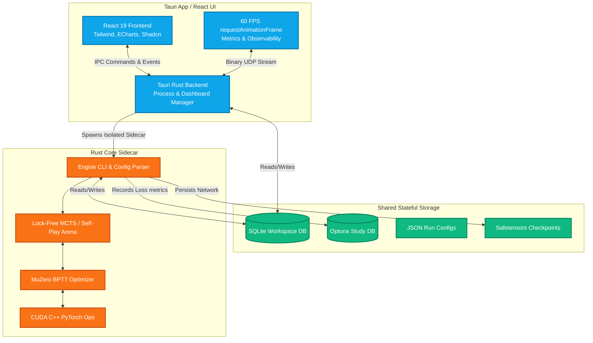
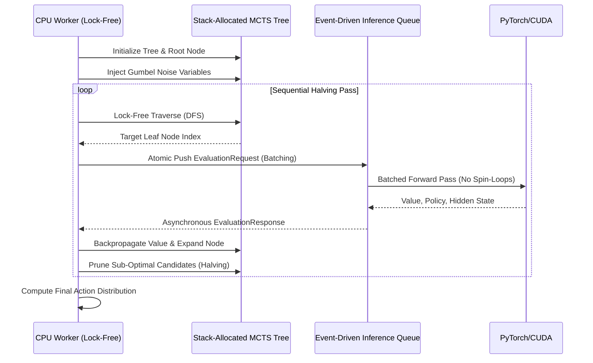
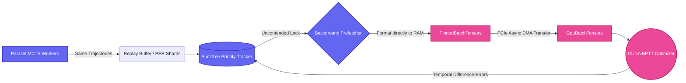
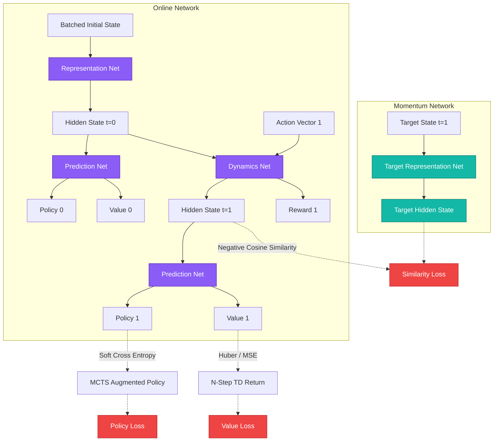
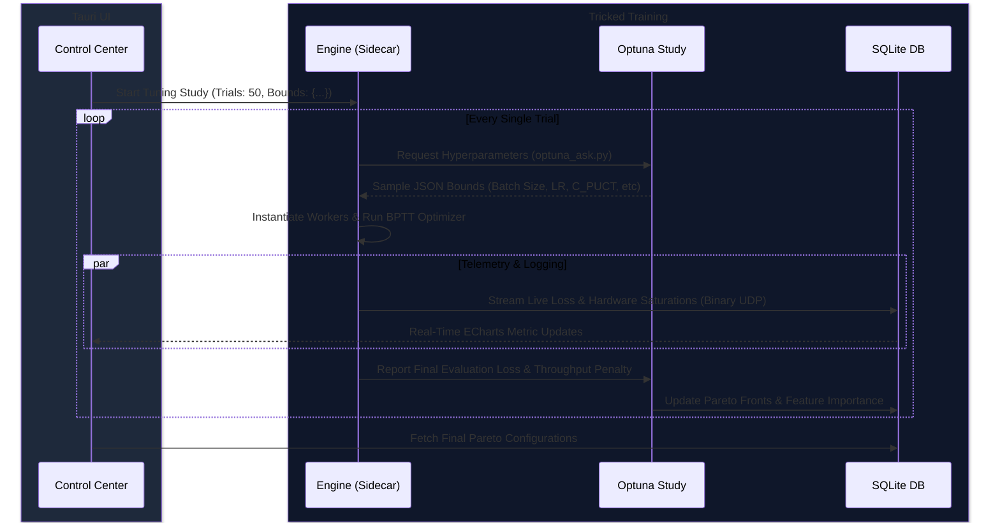

<div align="center">


# Tricked AI Engine

**A Zero-Debt, Lock-Free MuZero Reinforcement Learning Engine & Control Center**

[](https://www.rust-lang.org)
[](https://v2.tauri.app/)
[](https://react.dev/)
[](https://developer.nvidia.com/cuda-toolkit)
[](https://optuna.org/)
[](LICENSE)

</div>

## 🌌 Introduction

**Tricked** is a high-performance, strictly lock-free Reinforcement Learning engine engineered to solve a custom topological board puzzle. It trains AlphaZero and MuZero-style general board game agents, utilizing a rigorous **zero-debt Rust architecture** that extracts 100% throughput from multi-core CPU and GPU platforms without falling victim to cache starvation, lock contention, or memory saturation.

Beyond the core training algorithms, the Tricked ecosystem features a natively integrated **Tauri + React Control Center**—a production-grade MLOps dashboard providing real-time hardware telemetry, live UDP log routing, dynamic hyperparameter tuning via Optuna, and interactive environment playgrounds.

This repository serves as both a cutting-edge RL research lab and a showcase of modern Rust systems engineering applied to artificial intelligence.

---

## 🏗️ 1. High-Level Ecosystem Architecture

The Tricked platform is radically decoupled into two primary domains: the headless, hyper-optimized Rust/CUDA training engine ("The Muscle"), and the responsive Tauri/React-based Control Center ("The Eyes"). Relieving the GPU training hotpath from UI and telemetry overhead guarantees zero latency spikes during inference.



---

## 🎮 2. Game Mechanics & The Topological Environment

**Tricked** is effectively a single-player topological survival puzzle demanding massive combinatorial spatial reasoning. The reinforcement learning agent must continuously clear lines to manage board density, surviving as long as possible by chaining multi-axis intersecting combos.

*   **The Grid:** A regular hexagon composed of exactly **96 equilateral triangles** configured with a side length of 4 units.
*   **Mathematical Coordinate System:** The board is represented natively as a raw `u128` bitmask. This allows engine logic to process complex line clears, intersections, and collision detections at near-zero latency executing `ALL_MASKS` bitwise comparisons.
*   **D6 Rotational Symmetry (Data Augmentation):** To artificially expand the training distribution, Tricked employs a mathematically complete D6 rotational symmetry set consisting of **89 distinct piece rotations**. This massively accelerates network generalization without the agent knowing it is being fed augmented trajectories.
*   **Scoring & Terminal State:** Clearing lines spanning any axis grants points, with overlapping intersections acting as exponential combo multipliers. The episode terminates when the board's clutter mathematically prevents the placement of *any* of the remaining pieces in the agent's 3-piece tray.

---

## 🧠 3. Core Engine Architecture (The Mind vs. Muscle)

The greatest sin of modern AI engineering is asking the logical mind to lift boulders, or asking the GPU muscle to solve tree-search riddles. Tricked enforces a hard, impenetrable hardware boundary between chronological tree-search, and concurrent geometric tensor arithmetic.

### I. Gumbel AlphaZero MCTS & Parallel Garbage Collection

The Monte Carlo Tree Search operates using a state-of-the-art **Sequential Halving** pipeline injected with **Gumbel Noise**, aggressively pruning the search space to find the optimal policy. 

To eliminate locking overhead, MCTS nodes are allocated from a lock-free `ArrayQueue`, guaranteeing zero-allocation runtime traversals. Furthermore, Tricked parallelizes MCTS garbage collection to prevent worker starvation and entirely avoids `spin-loop` architecture by utilizing event-driven, atomic inference hand-offs.



### II. Lock-Free CPU/GPU Memory Pipeline

Memory limits are finite. The GPU should never sit idle waiting for the CPU to arrange tensors. 
Tricked completely decouples tensor formatting using a dedicated `Prefetch` threading hierarchy. It formats observation arenas directly into explicitly pinned host memory (`PinnedBatchTensors`), allowing PyTorch to execute non-blocking, asynchronous PCIe DMA transfers directly into `GpuBatchTensors`.



### III. MuZero Unrolled BPTT Network Architecture

The optimizer unrolls the dynamics network over arbitrary temporal structures, computing Soft Cross Entropy and Negative Cosine Similarity against an Exponential Moving Average (EMA) momentum target network. This explicitly prevents representation collapse in environments with sparse rewards. Tricked has completely removed FP64 precision liabilities from the hotpath, allowing pure FP32/TensorFloat32 (TF32) throughput.



---

## 🖥️ 4. The MLOps Control Center (Tauri + React 19)

Tricked isn’t just a headless AI—it ships with a production-grade, highly-themed Control Center to manage the immense stream of metrics. Utilizing React 19, Tailwind, ECharts, and Shadcn, the interface guarantees actionable visual feedback at 60 FPS.

### Deep Observability & Telemetry Pipeline
We abandoned standard synchronous `stdout` string logging. System telemetry operates via a highly-optimized **Binary UDP Protocol**, sending thousands of metrics per second over localhost. The frontend ingests these via a Rust Tauri command, passing them into pre-allocated mutable React references rendering via `requestAnimationFrame` to ensure zero UI jank.

*   **Granular System Diagnostics:** A unified, toggleable **Treemap & Sunburst visualization** displaying CPU core topography, alongside specific PID-level RAM, VRAM, and GPU utilization for all internal engine and sidecar processes.
*   **Hierarchical Theming:** Visual accents distinctly highlight the relationship between overarching "Runs" and associated "Runnages" (MCTS workers, BPTT servers).
*   **Live Metrics:** High-fidelity, gradient-smoothed area charts monitor critical AI health signs dynamically: 
    * *Queue Latency & Spin-Wait Cycles*
    * *SumTree Lock Contention Ratios*
    * *Layer-Wise Neural Network Gradient Norms*
    * *Action Space Entropy & KL Divergences*
    * *Replay Buffer Prioritization Heatmaps*

---

## 🔬 5. Optuna Tuning Lab

Configuring hyperparameters for AlphaZero engines is notoriously difficult. The Control Center features an **Optuna Tuning Lab** seamlessly integrated into the React frontend. It fetches completed trials from the `unified_optuna_study.db` SQLite database, plotting multi-objective parameter success.

*   View **Pareto Fronts** charting Hardware Limits (FPS/Throughput) vs. Evaluation Loss.
*   Inspect parameter importance via hyper-dimensional filtering.
*   Interact with real-time trial pruning distributions to see exactly where failing theories are killed. 

### Tuning Pipeline Architecture



---

## 🕹️ 6. Tricked Interactive Playground

To assist in behavioral debugging, the UI includes an **Interactive Playground** mirroring the AI's exact spatial sandbox. 
By utilizing `GameStateExt` bindings compiled via WASM/Tauri IPC, human players compete using the identical mathematical constraints the Rust engine natively executes. This allows researchers to playtest difficulty parameters, verify the complete D6 rotational symmetry augmentation visually, and confirm terminal state logic before firing up the GPU cluster.

---

## 🚀 7. Installation & Setup

Tricked relies on strict formatting hooks and requires the user to satisfy an assortment of specific ML tools. 

### Prerequisites
*   **Rust Toolchain:** `stable` (1.80+)
*   **Node.js:** `v20.x` or higher
*   **NVIDIA CUDA Toolkit:** `13.2+` (Required for custom C++ operations)
*   **Python:** 3.11+ via the `uv` blazing fast package manager.

### Standard Build Workflow

Tricked uses a unified `Makefile` that orchestrates building custom PyTorch C++ extensions (`tricked_ops.so`), compiling the Rust backend, resolving `pnpm` frontend dependencies, and tying it all into the Tauri binary. It also acts as the primary defense hook for our zero-debt CI expectations.

```bash
# 1. Clone the repository
git clone https://github.com/Tricked-AI/Tricked.git
cd Tricked

# 2. Build everything (CUDA ops, Rust server, React frontend)
make all

# 3. Launch the Control Center GUI in Developer Mode
make dev
```

### Headless CLI Mode

For dedicated training clusters (e.g., Slurm / Kubernetes environments), the UI can be bypassed entirely. 

```bash
cargo run --release --bin tricked_engine -- train \
    --experiment-name "resnet_v2_baseline" \
    --simulations 400 \
    --train-batch-size 2048 \
    --lr-init 0.005 \
    --workers 16 \
    --gumbel-scale 1.5
```

---

## 🛡️ License

Tricked is distributed under the **MIT License**. For an exhaustive explanation of warranties and liabilities, see the [LICENSE](LICENSE) file.
