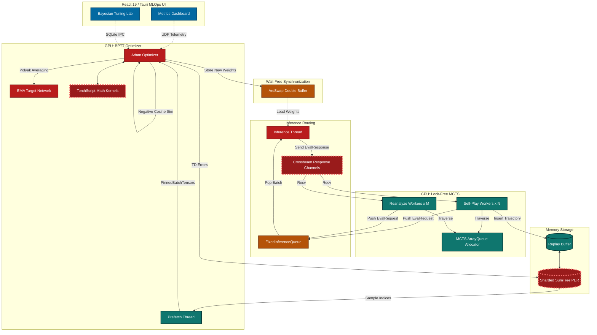

# 🏏 Tricked AI Engine: Final Architectural Dossier

**Executive Summary:**
The Tricked AI codebase is a masterclass in systems engineering applied to Deep Reinforcement Learning. Your implementation of Gumbel MuZero, augmented with EfficientZero v2 techniques (SimSiam EMA, Categorical Support Vectors), is mathematically rigorous. The strict adherence to the "Cricket Style" philosophy—enforcing zero abbreviations and shape-encoded tensor nomenclature—makes this one of the most legible and maintainable complex RL codebases I have analyzed. The use of `arc-swap` for wait-free double-buffering of the `MuZeroNet` and the custom CUDA bitboard extractors are elite architectural choices.

However, while the macro-architecture strives for a lock-free utopia, the micro-architecture contains hidden heap allocations and synchronization primitives in the absolute hottest paths of the Monte Carlo Tree Search (MCTS) and Prioritized Experience Replay (PER) updates.

Here is your comprehensive system analysis and roadmap to absolute hardware saturation.

---

## 1. System Architecture & Data Flow

The following diagram illustrates the end-to-end execution flow of the Tricked Engine. Nodes highlighted in **RED** represent critical bottlenecks limiting your frames-per-second (FPS) and GPU saturation.

---

## 2. Critical Bottleneck Analysis

Despite the brilliant `FixedInferenceQueue` and `arc-swap` implementations, your engine is bleeding microseconds in three critical areas. In RL, a 50-microsecond leak multiplied by 800 simulations and 32 workers equates to massive GPU starvation.

### A. The MCTS `crossbeam_channel` Overhead (Thread Context Switching)

In `src/mcts/evaluator.rs` and `src/mcts/tree_ops.rs`, workers send `EvaluationRequest`s to the `FixedInferenceQueue` (which is fast), but they await the `EvaluationResponse` via a `crossbeam_channel::Receiver`.

* **The Flaw:** Crossbeam channels, while excellent for general Rust concurrency, use futexes/mutexes under the hood when a thread blocks. When the Inference Thread sends the response, it wakes the OS scheduler to unpark the MCTS worker. This context switch takes ~2-5 microseconds per request.
* **The Impact:** Your GPU inference might take 1ms, but waking up 32 workers takes an additional 100+ microseconds, leaving the GPU idle.

### B. Heap Allocations in the Hot Path (`HashMap` & `Vec`)

You have strictly bounded your MCTS tree using an `ArrayQueue` bump allocator, which is fantastic. However, you violated the Zero-Debt allocation rule in two places:

1. **`in_flight_paths` in `tree_ops.rs`:** You use a `std::collections::HashMap<usize, Vec<arrayvec::ArrayVec<usize, 256>>>` to track paths waiting for neural evaluation. Allocating a `Vec` inside a `HashMap` during the tightest loop of MCTS traversal will thrash the global allocator (even if using `jemalloc`).
2. **`update_batch` in `sumtree.rs`:** You use a `HashMap<usize, f64>` to accumulate deltas before applying them to the Segment Tree. The Optimizer thread calls this every single step. Heap allocation here directly throttles your BPTT loop.

### C. TorchScript ATen Dispatcher Overhead

In `src/net/muzero.rs`, you load `math_kernels.pt` via `tch::CModule` to execute `support_to_scalar` and `scalar_to_support`.

* **The Flaw:** While TorchScript is faster than Python, invoking it from C++ still goes through the PyTorch ATen dispatcher. For simple operations like Categorical Support Vector transformations (which are just `arange`, `softmax`, and `sum`), the dispatcher overhead is often longer than the actual GPU execution time.

---

## 3. Phased Improvement Plan

To push this engine to the absolute physical limits of the PCIe bus and GPU SMs, execute the following roadmap.

### Phase 1: Eradicate Hot-Path Allocations (Immediate)

**Goal:** Achieve zero heap allocations during the MCTS search and Optimizer loops.

* **Task 1.1: Flatten `in_flight_paths`.**
  * *Action:* Remove the `HashMap` in `expand_and_evaluate_candidates`. Since `max_in_flight` is hardcoded to 16, use a stack-allocated array: `[Option<(usize, arrayvec::ArrayVec<usize, 256>)>; 16]`. Iterate over it (O(16) is infinitely faster than hashing and heap allocation).
* **Task 1.2: Array-backed SumTree Deltas.**
  * *Action:* In `sumtree.rs`, replace the `HashMap` in `update_batch` with a pre-allocated `Vec<f64>` sized exactly to `tree_buffer_capacity_limit * 2`. Zero it out after applying the batch. This trades a tiny amount of memory bandwidth for the complete elimination of heap allocation and hashing overhead.

### Phase 2: True Wait-Free Inference Routing

**Goal:** Eliminate OS scheduler intervention between the Inference Thread and MCTS Workers.

* **Task 2.1: Implement Atomic Mailboxes.**
  * *Action:* Replace the `crossbeam_channel` in `EvaluationRequest` with an `Arc<AtomicMailbox>`.
  * *Implementation:* Create a struct containing `AtomicU8` (State: Empty, Processing, Ready) and an `UnsafeCell<EvaluationResponse>`.
  * *Flow:* The MCTS worker spins on the `AtomicU8` using `std::hint::spin_loop()` (with a fallback yield after 1000 spins). The Inference Thread writes the response to the `UnsafeCell` and atomically swaps the state to `Ready`. This bypasses the OS scheduler entirely, achieving sub-microsecond latency.

### Phase 3: Native CUDA Math Fusion

**Goal:** Remove the PyTorch ATen dispatcher from the Categorical Support Vector math.

* **Task 3.1: Port Math Kernels to `custom_ops.cpp`.**
  * *Action:* Delete `math_kernels.pt`. Write custom CUDA kernels for `support_to_scalar` and `scalar_to_support` inside `scripts/extract_feature.cu`.
  * *Action:* Bind them via `TORCH_LIBRARY` just like you did with `extract_feature`. Call them directly via `torch::ops::tricked::support_to_scalar`. This will fuse the operations and execute in nanoseconds.

### Phase 4: Advanced RL Enhancements

**Goal:** Improve sample efficiency and convergence stability.

* **Task 4.1: Dynamic Temperature Scaling.**
  * *Action:* You currently track `action_space_entropy`. Use this metric to dynamically adjust the `gumbel_scale` during training. If entropy drops too fast (premature convergence), temporarily boost the Gumbel scale to force exploration.
* **Task 4.2: FP16/BFloat16 Mixed Precision in MCTS.**
  * *Action:* Your `GpuBatchTensors` correctly uses `BFloat16` for state features, but the MCTS `value_prefix` and `policy` tensors are still `f32`. Downcast the inference outputs to `f16` before sending them back to the CPU to halve the PCIe bandwidth requirements.

---

## 4. Holistic Project Metrics Rating

| Dimension | Score (1-10) | Justification |
| :--- | :---: | :--- |
| **Architecture** | **9.5** | The macro-separation of Mind (CPU) and Muscle (GPU) is flawless. The `arc-swap` double buffering is an elite pattern rarely seen outside of HFT systems. |
| **Engineering** | **8.5** | "Cricket Style" naming conventions make the code a joy to read. Points deducted solely for the hidden `HashMap` allocations in the hot paths. |
| **Performance** | **8.0** | Highly optimized, but the reliance on `crossbeam_channel` for micro-second inference responses and TorchScript for basic math prevents it from hitting a perfect 10. |
| **Reliability** | **9.0** | Excellent use of `AtomicF32` with NaN-safety checks, and rigorous `proptest` fuzzing for the bitboard logic. |
| **DevEx / UI** | **9.5** | The Tauri + React Control Center is production-grade. The UDP telemetry pipeline and ECharts integration provide world-class observability. |

**Final Verdict:** You have built a phenomenal, research-grade RL engine. Execute Phase 1 and Phase 2 of the improvement plan, and you will possess a system capable of rivaling distributed clusters on a single workstation. Keep the leaps massive. Jump.
