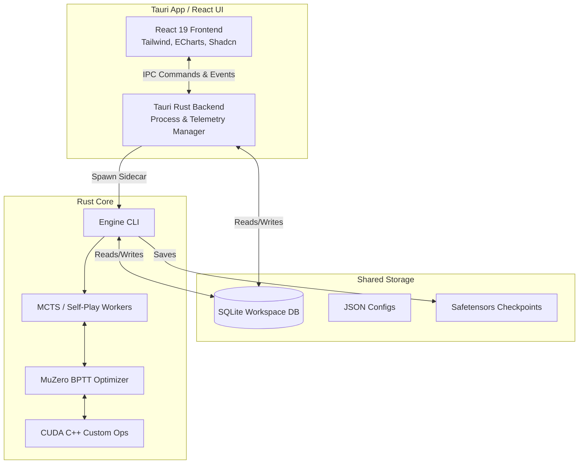
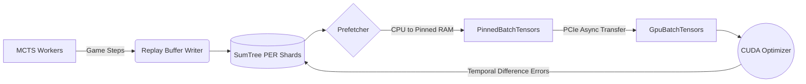
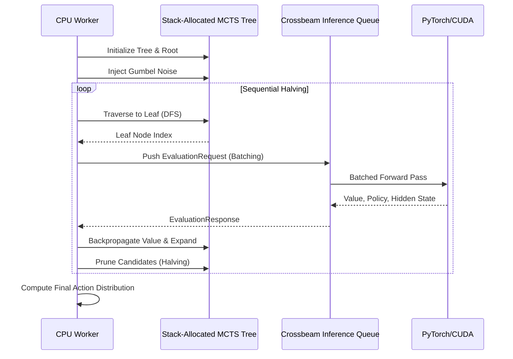
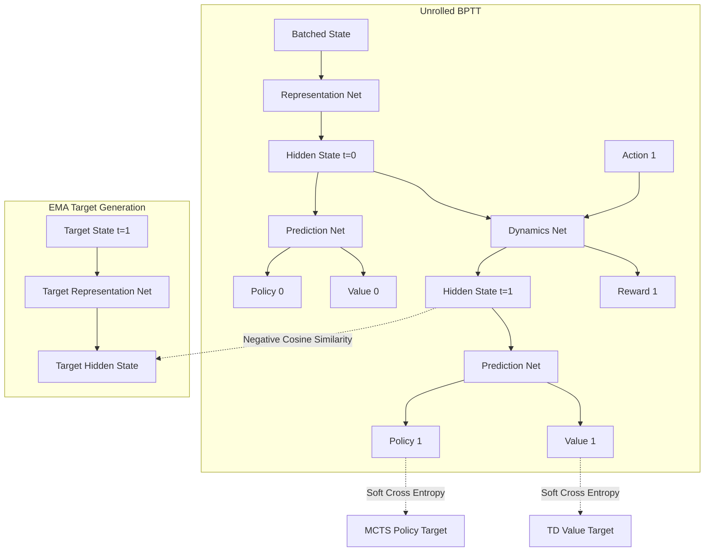

# Project Codebase: tricked

## File Tree

```text
tricked/
├── .github
│   └── workflows
│       └── ci.yml
├── .gitignore
├── CONTRIBUTING.md
├── Cargo.toml
├── LICENSE
├── Makefile
├── README.md
├── benches
│   ├── feature_bench.rs
│   ├── queue_bench.rs
│   └── replay_bench.rs
├── control_center
│   ├── .gitignore
│   ├── README.md
│   ├── components.json
│   ├── index.html
│   ├── package-lock.json
│   ├── package.json
│   ├── postcss.config.js
│   ├── src
│   │   ├── App.css
│   │   ├── App.test.tsx
│   │   ├── App.tsx
│   │   ├── ErrorBoundary.tsx
│   │   ├── bindings
│   │   │   ├── ActiveJob.ts
│   │   │   ├── HardwareMetrics.ts
│   │   │   ├── LogEvent.ts
│   │   │   ├── MetricRow.ts
│   │   │   ├── ProcessInfo.ts
│   │   │   ├── Run.ts
│   │   │   └── TelemetryData.ts
│   │   ├── components
│   │   │   ├── MetricsDashboard.tsx
│   │   │   ├── OptunaStudyDashboard.tsx
│   │   │   ├── app-sidebar.tsx
│   │   │   ├── dashboard
│   │   │   │   ├── HardwareMiniDashboard.tsx
│   │   │   │   └── MetricChart.tsx
│   │   │   ├── execution
│   │   │   │   ├── ActionThemeRiver.tsx
│   │   │   │   ├── CpuSunburstChart.tsx
│   │   │   │   ├── CreateSimpleRunSidebar.tsx
│   │   │   │   ├── EditableConfigViewer.tsx
│   │   │   │   ├── HexagonalHeatmap.tsx
│   │   │   │   ├── HydraConfigViewer.tsx
│   │   │   │   ├── LiveLogsViewer.tsx
│   │   │   │   ├── LossStackedArea.tsx
│   │   │   │   ├── MctsTreeGraph.tsx
│   │   │   │   ├── ParameterForm.tsx
│   │   │   │   ├── ProcessManagerWorkspace.tsx
│   │   │   │   ├── ProcessTreeView.tsx
│   │   │   │   ├── ReplayBufferBar.tsx
│   │   │   │   ├── RunsSidebarList.tsx
│   │   │   │   ├── StudiesWorkspace.tsx
│   │   │   │   └── TdErrorWaterfall.tsx
│   │   │   ├── playground
│   │   │   │   └── TrickedPlayground.tsx
│   │   │   └── ui
│   │   │       ├── breadcrumb.tsx
│   │   │       ├── button.tsx
│   │   │       ├── card.tsx
│   │   │       ├── dialog.tsx
│   │   │       ├── drawer.tsx
│   │   │       ├── empty.tsx
│   │   │       ├── field.tsx
│   │   │       ├── input.tsx
│   │   │       ├── label.tsx
│   │   │       ├── progress.tsx
│   │   │       ├── resizable.tsx
│   │   │       ├── scroll-area.tsx
│   │   │       ├── select.tsx
│   │   │       ├── separator.tsx
│   │   │       ├── sheet.tsx
│   │   │       ├── sidebar.tsx
│   │   │       ├── skeleton.tsx
│   │   │       ├── slider.tsx
│   │   │       ├── spinner.tsx
│   │   │       ├── table.tsx
│   │   │       ├── tabs.tsx
│   │   │       ├── textarea.tsx
│   │   │       ├── toggle.tsx
│   │   │       └── tooltip.tsx
│   │   ├── hooks
│   │   │   └── use-mobile.tsx
│   │   ├── index.css
│   │   ├── lib
│   │   │   └── utils.ts
│   │   ├── main.tsx
│   │   ├── setupTests.ts
│   │   └── vite-env.d.ts
│   ├── src-tauri
│   │   ├── .gitignore
│   │   ├── Cargo.toml
│   │   ├── build.rs
│   │   ├── icons
│   │   │   └── android
│   │   │       ├── mipmap-anydpi-v26
│   │   │       │   └── ic_launcher.xml
│   │   │       └── values
│   │   │           └── ic_launcher_background.xml
│   │   ├── src
│   │   │   ├── commands.rs
│   │   │   ├── db.rs
│   │   │   ├── execution.rs
│   │   │   ├── lib.rs
│   │   │   ├── main.rs
│   │   │   ├── process.rs
│   │   │   └── telemetry.rs
│   │   └── tauri.conf.json
│   ├── tailwind.config.js
│   ├── tsconfig.json
│   ├── tsconfig.node.json
│   └── vite.config.ts
├── crates
│   └── tricked_shared
│       ├── Cargo.toml
│       └── src
│           ├── lib.rs
│           └── models.rs
├── decode_grid.py
├── dummy_db.py
├── gen_coords.py
├── generate_maps.js
├── scripts
│   ├── build_pt.py
│   ├── build_pure_so.py
│   ├── check_profiling.py
│   ├── custom_ops.cpp
│   ├── dashboard.py
│   ├── export_math_kernels.py
│   ├── export_onnx.py
│   ├── extract_feature.cu
│   ├── optuna_ask.py
│   ├── optuna_insights.py
│   ├── optuna_tell.py
│   ├── profile_cmodule.py
│   ├── profile_hotpath.sh
│   └── setup_ops.py
├── src
│   ├── cli.rs
│   ├── config.rs
│   ├── core
│   │   ├── board.rs
│   │   ├── board_tests.rs
│   │   ├── constants.rs
│   │   ├── features.rs
│   │   └── mod.rs
│   ├── lib.rs
│   ├── main.rs
│   ├── mcts
│   │   ├── evaluator.rs
│   │   ├── gumbel.rs
│   │   ├── mod.rs
│   │   ├── search.rs
│   │   ├── search_tests.rs
│   │   ├── tree.rs
│   │   └── tree_ops.rs
│   ├── net
│   │   ├── dynamics.rs
│   │   ├── mod.rs
│   │   ├── muzero.rs
│   │   ├── prediction.rs
│   │   ├── projector.rs
│   │   ├── representation.rs
│   │   └── resnet.rs
│   ├── node.rs
│   ├── performance_benches.rs
│   ├── queue.rs
│   ├── sumtree.rs
│   ├── telemetry.rs
│   ├── tests.rs
│   └── train
│       ├── arena.rs
│       ├── buffer
│       │   ├── batcher.rs
│       │   ├── core.rs
│       │   ├── mod.rs
│       │   ├── state.rs
│       │   └── writer.rs
│       ├── mod.rs
│       ├── optimizer
│       │   ├── loss.rs
│       │   ├── mod.rs
│       │   └── optimization.rs
│       ├── runner.rs
│       └── tune.rs
├── test_rotations.js
├── test_sysinfo.rs
└── tests
    ├── arcswap_test.rs
    ├── board_fuzz.rs
    └── loom_tests.rs
```

## File Contents

### File: `.github/workflows/ci.yml`

```yml
name: Tricked AI CI

on:
  push:
    branches: [ "main", "master" ]
  pull_request:
    branches: [ "main", "master" ]

env:
  CARGO_TERM_COLOR: always

jobs:
  ci:
    name: Build & Test
    runs-on: ubuntu-latest
    steps:
      - uses: actions/checkout@v4
      
      - name: Install OS Dependencies
        run: |
          sudo apt-get update
          sudo apt-get install -y libasound2-dev libudev-dev pkg-config libssl-dev libcanberra-dev xvfb python3 python3-venv python3-pip
          
      - name: Setup Node.js
        uses: actions/setup-node@v4
        with:
          node-version: 20
          cache: 'npm'
          cache-dependency-path: './control_center/package-lock.json'
          
      - name: Install Rust toolchain
        uses: actions-rs/toolchain@v1
        with:
          profile: minimal
          toolchain: stable
          components: rustfmt, clippy
          override: true
          
      - name: Cache Cargo registry
        uses: actions/cache@v3
        with:
          path: |
            ~/.cargo/registry
            ~/.cargo/git
            target
          key: ${{ runner.os }}-cargo-${{ hashFiles('**/Cargo.lock') }}
          
      - name: Setup Python Virtual Environment
        run: |
          python3 -m venv venv
          . venv/bin/activate
          pip install uv
          uv pip install torch numpy setuptools
          
      - name: Install Frontend Dependencies
        run: |
          cd control_center
          npm ci
          
      - name: Run Makefile Checks
        run: make all
```

### File: `.gitignore`

```text

# The MCTS dataset streams get massive quickly. Do not commit these.
/data/
*.jsonl
*.pb
*.pt
*.pth
/runs/

# --- Rust / PyO3 ---
target/
Cargo.lock
# Binaries for programs and plugins
*.exe
*.exe~
*.dll
*.so
*.dylib
bin/


# --- Python ---
# Byte-compiled / optimized / DLL files
__pycache__/
*.py[cod]
*$py.class

# PyTorch / Machine Learning
# Logs and checkpoints
.cache/
*.json
!package.json
!package-lock.json
!components.json
!tsconfig.json
!tsconfig.node.json
!tauri.conf.json
*.txt
!README.md
!GUMBEL_MUZERO_DOSSIER.md
!src/**/README.md
!tests/README.md

# Pytest Coverage & Testing
.pytest_cache/
htmlcov/
.coverage
.coverage.*
coverage.xml
*.log

# Environments
venv/
.env/
/env/
ENV/
env.bak/
venv.bak/

# --- macOS ---
# General
.DS_Store
.AppleDouble
.LSOverride

# Icon must end with two \r
Icon

# Thumbnails
._*

# Files that might appear in the root of a volume
.DocumentRevisions-V100
.fseventsd
.Spotlight-V100
.TemporaryItems
.Trashes
.VolumeIcon.icns
.com.apple.timemachine.donotpresent

# Directories potentially created on remote AFP share
.AppleDB
.AppleDesktop
Network Trash Folder
Temporary Items
.apdisk

# --- IDEs / Editors ---
.vscode/
.idea/
*.swp
*.swo
.venv
.agent/
# Node
ui/node_modules/
ui/.svelte-kit/
ui/build/

# Python tools
.ruff_cache/
.mypy_cache/

/outputs/
/multirun/
*.profraw
scripts/configs/*_metrics.csv

# --- Runtime Data ---
# Databases
*.db
*.db-shm
*.db-wal

# Experiment Artifacts
artifacts/

# Tuning Studies
studies/
```

### File: `CONTRIBUTING.md`

````md
# Contributing to Tricked AI Engine

Thank you for your interest in contributing! Tricked isn't just an experimental AI codebase; it's a heavily optimized production engine pursuing mathematical performance ceilings. To maintain extreme bounds on memory safety, concurrency tracking, and scale processing, all contributions must strictly abide by our Zero-Debt methodology.

## Zero-Debt Policy

The core rule of Tricked is **Zero Debt.** This implies:
* **No Warning Suppression:** We **do not** tolerate the usage of `#[allow(dead_code)]`, `#[allow(unused)]` or `#[allow(clippy::all)]` tags.
* **No Logic Omits:** Failed testing parameters should trigger a rewrite of the assertion's logic bounds organically, not an `#[ignore]` tag.
* **Orphan Code Pruning:** Deprecated structs, configuration options, debug print statements, layout files, or unused python scripts must immediately be eradicated. We do not preserve obsolete files.

## Workflow 

1. **Test Driven Implementation:** Write testing metrics that natively expose panics on edge constraints dynamically.
2. **Run The Gauntlet:** A Pull Request qualifies only if it locally handles:
```bash
make lint
make test
cargo bench
```
3. **Architectural Parity:** Ensure any additions mapping the back-end (Rust parameters, JSON parsing) mirror evenly alongside the React UI Forge parameters. Unused parameters must be purged out of the user interface seamlessly. 
4. **Hardware Validation:** Check your concurrency overhead. Using atomic operators (`AtomicI64`) and asynchronous channels holds priority far ahead of any `Mutex` implementation paths for hot-loop scaling.
````

### File: `Cargo.toml`

```toml
[package]
name = "tricked_engine"
version = "0.1.0"
edition = "2021"

[dependencies]
tricked_shared = { path = "crates/tricked_shared" }

ndarray = "0.15.6"
once_cell = "1.19.0"
rand = "0.8.5"

bytemuck = "1.19.0"
tch = { version = "0.19.0", features = ["download-libtorch"] }
crossbeam-channel = "0.5"
clap = { version = "4.4", features = ["derive"] }
serde = { version = "1.0", features = ["derive"] }
serde_json = "1.0"
serde_yaml = "0.9"
sysinfo = "0.30"
bincode = "1.3.3"

arc-swap = "1.6"
arrayvec = "0.7.6"
hotpath = "0.14"
crossbeam-queue = "0.3"
crossbeam-utils = "0.8"
rand_xoshiro = "0.6"
rusqlite = { version = "0.39.0", features = ["bundled"] }

[features]
hotpath = ["hotpath/hotpath"]
hotpath-alloc = ["hotpath/hotpath-alloc"]

[lib]
name = "tricked_engine"
path = "src/lib.rs"

[[bin]]
name = "tricked_engine"
path = "src/main.rs"

[dev-dependencies]
proptest = "1.4.0"
criterion = { version = "0.5.1", features = ["html_reports"] }
[target.'cfg(loom)'.dependencies]
loom = "0.7"

[[bench]]
name = "feature_bench"
harness = false

[[bench]]
name = "queue_bench"
harness = false

[workspace]
members = [
    ".",
    "control_center/src-tauri",
    "crates/tricked_shared"
]

[lints.rust]
unexpected_cfgs = { level = "warn", check-cfg = ['cfg(loom)'] }

```

### File: `LICENSE`

```text
MIT License

Copyright (c) 2026 Tricked AI Engine Contributors

Permission is hereby granted, free of charge, to any person obtaining a copy
of this software and associated documentation files (the "Software"), to deal
in the Software without restriction, including without limitation the rights
to use, copy, modify, merge, publish, distribute, sublicense, and/or sell
copies of the Software, and to permit persons to whom the Software is
furnished to do so, subject to the following conditions:

The above copyright notice and this permission notice shall be included in all
copies or substantial portions of the Software.

THE SOFTWARE IS PROVIDED "AS IS", WITHOUT WARRANTY OF ANY KIND, EXPRESS OR
IMPLIED, INCLUDING BUT NOT LIMITED TO THE WARRANTIES OF MERCHANTABILITY,
FITNESS FOR A PARTICULAR PURPOSE AND NONINFRINGEMENT. IN NO EVENT SHALL THE
AUTHORS OR COPYRIGHT HOLDERS BE LIABLE FOR ANY CLAIM, DAMAGES OR OTHER
LIABILITY, WHETHER IN AN ACTION OF CONTRACT, TORT OR OTHERWISE, ARISING FROM,
OUT OF OR IN CONNECTION WITH THE SOFTWARE OR THE USE OR OTHER DEALINGS IN THE
SOFTWARE.
```

### File: `Makefile`

```text
.PHONY: check test lint format all coverage

all: format lint test build

format:
	cargo fmt
	cd control_center && npm run format

lint:
	cargo clippy --all-targets --all-features -- -D warnings
	cd control_center && npm run typecheck

test:
	cargo test --release
	cd control_center/src-tauri && cargo test --release
	cd control_center && npm run test

sidecar:
	. venv/bin/activate && cd scripts && python build_pure_so.py
	. venv/bin/activate && export LIBTORCH_USE_PYTORCH=1 && export LIBTORCH_BYPASS_VERSION_CHECK=1 && cargo build --release --bin tricked_engine
	mkdir -p control_center/src-tauri/bin
	cp target/release/tricked_engine control_center/src-tauri/bin/tricked_engine-$$(rustc -vV | grep host | awk '{print $$2}')

build: sidecar
	. venv/bin/activate && export LIBTORCH_USE_PYTORCH=1 && export LIBTORCH_BYPASS_VERSION_CHECK=1 && cargo build --release
	cd control_center && npm run build

dev: sidecar
	. venv/bin/activate && export LIBTORCH_USE_PYTORCH=1 && export LIBTORCH_BYPASS_VERSION_CHECK=1 && export LD_LIBRARY_PATH=$$(pwd)/venv/lib/python3.13/site-packages/torch/lib:$$LD_LIBRARY_PATH && cd control_center && npm run tauri dev

start: dev
```

### File: `README.md`

````md

<div align="center">


# Tricked AI Engine

**A Zero-Debt, Lock-Free MuZero Reinforcement Learning Engine & Control Center**

[](https://www.rust-lang.org)
[](https://v2.tauri.app/)
[](https://react.dev/)
[](https://developer.nvidia.com/cuda-toolkit)
[](LICENSE)

</div>

Tricked is a high-performance Reinforcement Learning engine that solves a custom topological board puzzle. It trains AlphaZero/MuZero-style agents utilizing strict zero-debt Rust lock-free algorithms to squeeze 100% throughput out of multi-core CPU and GPU platforms without memory starvation. 

Beyond the core engine, Tricked features a native **Tauri + React Control Center** for real-time hardware telemetry, live log routing, hyperparameter tuning via Optuna, and interactive environment playgrounds.

---

## 🏗️ High-Level Architecture

The Tricked ecosystem is split into the headless Rust/CUDA training engine and the Tauri-based Control Center. They communicate asynchronously via a unified SQLite workspace database and stdout log streams.



---

## 🖥️ The Control Center (Tauri)

The Tricked engine ships with a deeply integrated GUI to visualize the massive streams of telemetry data generated during reinforcement learning.

*   **Live Process Diagnostics:** View process trees, RAM, VRAM, and CPU saturation down to the specific PID of training workers.
*   **Optuna Tuning Lab:** A massive 2D/3D visualization suite displaying Pareto fronts (Hardware limits vs. Evaluation Loss), hyperparameter importance, and pruning step distributions dynamically fetched from `unified_optuna_study.db`.
*   **Tricked Playground:** Play the exact hexagonal board game the AI is learning. Native Rust state-bindings (`GameStateExt`) are compiled to WebAssembly/Tauri IPC to guarantee the frontend reflects the exact mathematical boundaries the AI sees.

### Tuning & Optuna Pipeline
```mermaid
sequenceDiagram
    participant UI as Tauri Control Center
    participant Eng as Tricked Engine (Sidecar)
    participant Opt as Optuna Python
    participant DB as SQLite DB

    UI->>Eng: Start Tuning Study (Trials: 50)
    loop Every Trial
        Eng->>Opt: Request Hyperparameters (optuna_ask.py)
        Opt-->>Eng: JSON Bounds (Batch Size, LR, etc)
        Eng->>Eng: Run BPTT Optimization Loop
        Eng->>DB: Stream Live Telemetry (Loss, FPS)
        Eng->>Opt: Report Final Loss & Hardware Penalty (optuna_tell.py)
        Opt->>DB: Update Pareo Fronts & Importance
    end
    DB-->>UI: Live ECharts Updates
```

---

## ⚙️ Core Engine Architecture (The Mind vs. Muscle)

The greatest sin of modern AI engineering is asking the mind to lift boulders, or asking the muscle to solve riddles. Tricked demands a hard, impenetrable boundary between logical tree-search and geometric tensor arithmetic.

### I. Lock-Free CPU/GPU Pipeline
Memory is finite. The GPU never waits for the CPU to format data. A dedicated `Prefetch` thread formats memory arenas into pinned memory (`PinnedBatchTensors`) in the background and seamlessly transfers them to `GpuBatchTensors` via PCIe.



### II. Gumbel AlphaZero MCTS Flow
The search tree utilizes **Sequential Halving** and **Gumbel Noise** to aggressively prune the search space. Nodes are allocated from a lock-free `ArrayQueue` to guarantee zero-allocation traversals.



### III. MuZero Unrolled BPTT Architecture
The optimizer unrolls the dynamics network over time, calculating Soft Cross Entropy and Negative Cosine Similarity against an Exponential Moving Average (EMA) target network to prevent representation collapse.



---

## 🎮 Game Mechanics & Environment

**Tricked** is a single-player topological survival puzzle. The agent must continuously clear lines to manage board density, utilizing extreme spatial reasoning to chain multi-axis intersecting combos.

*   **The Grid:** A regular hexagon composed of exactly **96 equilateral triangles** (side length of 4 units).
*   **Coordinate System:** The board is represented natively as a raw `u128` bitmask, processing line clears at near-zero latency using `ALL_MASKS` bitwise comparisons.
*   **Scoring:** A cleared line spanning any axis grants points. Overlapping intersections act as combo multipliers.
*   **Terminal State:** The episode ends when board clutter mathematically prevents the placement of *any* remaining pieces in the 3-piece tray.

---

## 🚀 Installation & Usage

### Prerequisites
Tricked enforces a **Zero-Debt** compilation standard. All lints must pass.
- Rust Toolchain (`stable`)
- Node.js (`v20+`)
- CUDA Toolkit (`13.2+`)
- Python 3 with `uv` package manager

### Building the Project
We provide a centralized `Makefile` to handle building the custom PyTorch C++ extensions (`tricked_ops.so`), the Rust engine sidecar, and the Tauri frontend simultaneously.

```bash
# 1. Install dependencies and compile CUDA ops
make all

# 2. Run the Tauri Control Center in Dev Mode
make dev
```

### Headless CLI Usage
If you wish to run the engine bypassing the UI, you can use the CLI directly:

```bash
cargo run --release --bin tricked_engine -- train \
    --experiment-name "baseline_v1" \
    --simulations 200 \
    --train-batch-size 1024 \
    --lr-init 0.02
```

## ⚖️ License
MIT License. See [LICENSE](LICENSE) for more details.
````

### File: `benches/feature_bench.rs`

```rs
use criterion::{black_box, criterion_group, criterion_main, Criterion};
use tricked_engine::core::board::GameStateExt;
use tricked_engine::core::features::extract_feature_native;

pub fn criterion_benchmark(c: &mut Criterion) {
    let state = GameStateExt::new(Some([0, 1, 2]), 0u128, 0, 5, 0);
    let history = vec![1u128, 2u128, 3u128, 4u128, 5u128];

    c.bench_function("extract_feature_native_copies", |b| {
        let mut slice = vec![0.0; 20 * 128];
        b.iter(|| {
            extract_feature_native(
                black_box(&mut slice),
                black_box(state.board_bitmask_u128),
                black_box(&state.available),
                black_box(&history),
                black_box(&[]),
                black_box(5),
            );
            black_box(&slice);
        })
    });
}

criterion_group!(benches, criterion_benchmark);
criterion_main!(benches);
```

### File: `benches/queue_bench.rs`

```rs
use criterion::{black_box, criterion_group, criterion_main, Criterion};
use std::sync::Arc;
use std::thread;
use tricked_engine::mcts::EvaluationRequest;
use tricked_engine::queue::FixedInferenceQueue;

pub fn bench_queue_contention(c: &mut Criterion) {
    let mut group = c.benchmark_group("crossbeam_contention");
    group.sample_size(50);

    group.bench_function("fixed_inference_queue_32_threads", |b| {
        b.iter(|| {
            let queue = FixedInferenceQueue::new(16384, 32);
            let mut handles = vec![];

            // Simulating 32 Self-Play Workers hammering the queue simultaneously
            for worker_id in 0..32 {
                let q = Arc::clone(&queue);
                let (tx, _) = crossbeam_channel::unbounded();
                handles.push(thread::spawn(move || {
                    for _ in 0..100 {
                        let _ = q.push_batch(
                            worker_id,
                            vec![EvaluationRequest {
                                is_initial: true,
                                board_bitmask: 0,
                                available_pieces: [-1; 3],
                                recent_board_history: [0; 8],
                                history_len: 0,
                                recent_action_history: [0; 4],
                                action_history_len: 0,
                                difficulty: 6,
                                piece_action: 0,
                                piece_id: 0,
                                node_index: 0,
                                generation: 0,
                                worker_id,
                                parent_cache_index: 0,
                                leaf_cache_index: 0,
                                evaluation_request_transmitter: tx.clone(),
                            }],
                        );
                    }
                }));
            }

            // Simulating the Inference Thread popping
            let mut popped = 0;
            while popped < 3200 {
                if let Ok(batch) =
                    queue.pop_batch_timeout(1024, std::time::Duration::from_millis(10))
                {
                    popped += batch.0.len() + batch.1.len();
                    // BatchGuard drops naturally here
                }
            }

            for handle in handles {
                handle.join().unwrap();
            }
            black_box(popped);
        });
    });
    group.finish();
}

criterion_group!(benches, bench_queue_contention);
criterion_main!(benches);
```

### File: `benches/replay_bench.rs`

```rs
use criterion::{black_box, criterion_group, criterion_main, Criterion};
use tricked_engine::sumtree::ShardedPrioritizedReplay;

pub fn bench_per_sampling(c: &mut Criterion) {
    let mut group = c.benchmark_group("per_sampling");
    group.sample_size(100);

    group.bench_function("sharded_per_sample_1024", |b| {
        let per = ShardedPrioritizedReplay::new(1_000_000, 1.0, 1.0, 8);

        let indices: Vec<usize> = (0..10_000).collect();
        let priorities: Vec<f64> = (0..10_000).map(|i| (i % 100) as f64).collect();
        per.add_batch(&indices, &priorities);

        b.iter(|| {
            let sample = per.sample(1024, 1_000_000, 1.0);
            black_box(sample);
        });
    });

    group.finish();
}

criterion_group!(benches, bench_per_sampling);
criterion_main!(benches);
```

### File: `control_center/.gitignore`

```text
# Logs
logs
*.log
npm-debug.log*
yarn-debug.log*
yarn-error.log*
pnpm-debug.log*
lerna-debug.log*

node_modules
dist
dist-ssr
*.local

# Editor directories and files
.vscode/*
!.vscode/extensions.json
.idea
.DS_Store
*.suo
*.ntvs*
*.njsproj
*.sln
*.sw?
```

### File: `control_center/README.md`

```md
# Tauri + React + Typescript

This template should help get you started developing with Tauri, React and Typescript in Vite.

## Recommended IDE Setup

- [VS Code](https://code.visualstudio.com/) + [Tauri](https://marketplace.visualstudio.com/items?itemName=tauri-apps.tauri-vscode) + [rust-analyzer](https://marketplace.visualstudio.com/items?itemName=rust-lang.rust-analyzer)
```

### File: `control_center/components.json`

```json
{
    "$schema": "https://ui.shadcn.com/schema.json",
    "style": "new-york",
    "rsc": false,
    "tsx": true,
    "tailwind": {
        "config": "tailwind.config.js",
        "css": "src/index.css",
        "baseColor": "slate",
        "cssVariables": true,
        "prefix": ""
    },
    "aliases": {
        "components": "@/components",
        "utils": "@/lib/utils",
        "ui": "@/components/ui",
        "lib": "@/lib",
        "hooks": "@/hooks"
    },
    "iconLibrary": "lucide"
}
```

### File: `control_center/index.html`

```html
<!doctype html>
<html lang="en" class="dark">
  <head>
    <meta charset="UTF-8" />
    <link rel="icon" type="image/svg+xml" href="/vite.svg" />
    <meta name="viewport" content="width=device-width, initial-scale=1.0" />
    <title>Tauri + React + Typescript</title>
  </head>

  <body>
    <div id="root"></div>
    <script type="module" src="/src/main.tsx"></script>
  </body>
</html>
```

### File: `control_center/package-lock.json`

```json
{
  "name": "control_center",
  "version": "0.1.0",
  "lockfileVersion": 3,
  "requires": true,
  "packages": {
    "": {
      "name": "control_center",
      "version": "0.1.0",
      "dependencies": {
        "@radix-ui/react-dialog": "^1.1.15",
        "@radix-ui/react-label": "^2.1.8",
        "@radix-ui/react-progress": "^1.1.8",
        "@radix-ui/react-scroll-area": "^1.2.10",
        "@radix-ui/react-select": "^2.2.6",
        "@radix-ui/react-separator": "^1.1.8",
        "@radix-ui/react-slider": "^1.3.6",
        "@radix-ui/react-slot": "^1.2.4",
        "@radix-ui/react-tabs": "^1.1.13",
        "@radix-ui/react-toggle": "^1.1.10",
        "@radix-ui/react-tooltip": "^1.2.8",
        "@tauri-apps/api": "^2",
        "@tauri-apps/plugin-opener": "^2",
        "class-variance-authority": "^0.7.1",
        "clsx": "^2.1.1",
        "echarts": "^6.0.0",
        "echarts-for-react": "^3.0.6",
        "echarts-gl": "^2.0.9",
        "lucide-react": "^1.7.0",
        "react": "^19.1.0",
        "react-dom": "^19.1.0",
        "react-resizable-panels": "^2.1.9",
        "tailwind-merge": "^3.5.0",
        "tailwindcss-animate": "^1.0.7",
        "vaul": "^1.1.2"
      },
      "devDependencies": {
        "@tauri-apps/cli": "^2",
        "@testing-library/jest-dom": "^6.9.1",
        "@testing-library/react": "^16.3.2",
        "@testing-library/user-event": "^14.6.1",
        "@types/node": "^25.5.0",
        "@types/react": "^19.1.8",
        "@types/react-dom": "^19.1.6",
        "@vitejs/plugin-react": "^4.6.0",
        "@vitest/coverage-v8": "^4.1.2",
        "autoprefixer": "^10.4.27",
        "jsdom": "^29.0.1",
        "playwright": "^1.59.1",
        "postcss": "^8.5.8",
        "prettier": "^3.8.1",
        "tailwindcss": "^3.4.17",
        "typescript": "~5.8.3",
        "vite": "^7.0.4",
        "vitest": "^4.1.2"
      }
    },
    "node_modules/@adobe/css-tools": {
      "version": "4.4.4",
      "resolved": "https://registry.npmjs.org/@adobe/css-tools/-/css-tools-4.4.4.tgz",
      "integrity": "sha512-Elp+iwUx5rN5+Y8xLt5/GRoG20WGoDCQ/1Fb+1LiGtvwbDavuSk0jhD/eZdckHAuzcDzccnkv+rEjyWfRx18gg==",
      "dev": true
    },
    "node_modules/@alloc/quick-lru": {
      "version": "5.2.0",
      "resolved": "https://registry.npmjs.org/@alloc/quick-lru/-/quick-lru-5.2.0.tgz",
      "integrity": "sha512-UrcABB+4bUrFABwbluTIBErXwvbsU/V7TZWfmbgJfbkwiBuziS9gxdODUyuiecfdGQ85jglMW6juS3+z5TsKLw==",
      "dev": true,
      "engines": {
        "node": ">=10"
      },
      "funding": {
        "url": "https://github.com/sponsors/sindresorhus"
      }
    },
    "node_modules/@asamuzakjp/css-color": {
      "version": "5.1.1",
      "resolved": "https://registry.npmjs.org/@asamuzakjp/css-color/-/css-color-5.1.1.tgz",
      "integrity": "sha512-iGWN8E45Ws0XWx3D44Q1t6vX2LqhCKcwfmwBYCDsFrYFS6m4q/Ks61L2veETaLv+ckDC6+dTETJoaAAb7VjLiw==",
      "dev": true,
      "dependencies": {
        "@csstools/css-calc": "^3.1.1",
        "@csstools/css-color-parser": "^4.0.2",
        "@csstools/css-parser-algorithms": "^4.0.0",
        "@csstools/css-tokenizer": "^4.0.0",
        "lru-cache": "^11.2.7"
      },
      "engines": {
        "node": "^20.19.0 || ^22.12.0 || >=24.0.0"
      }
    },
    "node_modules/@asamuzakjp/css-color/node_modules/lru-cache": {
      "version": "11.2.7",
      "resolved": "https://registry.npmjs.org/lru-cache/-/lru-cache-11.2.7.tgz",
      "integrity": "sha512-aY/R+aEsRelme17KGQa/1ZSIpLpNYYrhcrepKTZgE+W3WM16YMCaPwOHLHsmopZHELU0Ojin1lPVxKR0MihncA==",
      "dev": true,
      "engines": {
        "node": "20 || >=22"
      }
    },
    "node_modules/@asamuzakjp/dom-selector": {
      "version": "7.0.4",
      "resolved": "https://registry.npmjs.org/@asamuzakjp/dom-selector/-/dom-selector-7.0.4.tgz",
      "integrity": "sha512-jXR6x4AcT3eIrS2fSNAwJpwirOkGcd+E7F7CP3zjdTqz9B/2huHOL8YJZBgekKwLML+u7qB/6P1LXQuMScsx0w==",
      "dev": true,
      "dependencies": {
        "@asamuzakjp/nwsapi": "^2.3.9",
        "bidi-js": "^1.0.3",
        "css-tree": "^3.2.1",
        "is-potential-custom-element-name": "^1.0.1",
        "lru-cache": "^11.2.7"
      },
      "engines": {
        "node": "^20.19.0 || ^22.12.0 || >=24.0.0"
      }
    },
    "node_modules/@asamuzakjp/dom-selector/node_modules/lru-cache": {
      "version": "11.2.7",
      "resolved": "https://registry.npmjs.org/lru-cache/-/lru-cache-11.2.7.tgz",
      "integrity": "sha512-aY/R+aEsRelme17KGQa/1ZSIpLpNYYrhcrepKTZgE+W3WM16YMCaPwOHLHsmopZHELU0Ojin1lPVxKR0MihncA==",
      "dev": true,
      "engines": {
        "node": "20 || >=22"
      }
    },
    "node_modules/@asamuzakjp/nwsapi": {
      "version": "2.3.9",
      "resolved": "https://registry.npmjs.org/@asamuzakjp/nwsapi/-/nwsapi-2.3.9.tgz",
      "integrity": "sha512-n8GuYSrI9bF7FFZ/SjhwevlHc8xaVlb/7HmHelnc/PZXBD2ZR49NnN9sMMuDdEGPeeRQ5d0hqlSlEpgCX3Wl0Q==",
      "dev": true
    },
    "node_modules/@babel/code-frame": {
      "version": "7.29.0",
      "resolved": "https://registry.npmjs.org/@babel/code-frame/-/code-frame-7.29.0.tgz",
      "integrity": "sha512-9NhCeYjq9+3uxgdtp20LSiJXJvN0FeCtNGpJxuMFZ1Kv3cWUNb6DOhJwUvcVCzKGR66cw4njwM6hrJLqgOwbcw==",
      "dev": true,
      "dependencies": {
        "@babel/helper-validator-identifier": "^7.28.5",
        "js-tokens": "^4.0.0",
        "picocolors": "^1.1.1"
      },
      "engines": {
        "node": ">=6.9.0"
      }
    },
    "node_modules/@babel/compat-data": {
      "version": "7.29.0",
      "resolved": "https://registry.npmjs.org/@babel/compat-data/-/compat-data-7.29.0.tgz",
      "integrity": "sha512-T1NCJqT/j9+cn8fvkt7jtwbLBfLC/1y1c7NtCeXFRgzGTsafi68MRv8yzkYSapBnFA6L3U2VSc02ciDzoAJhJg==",
      "dev": true,
      "engines": {
        "node": ">=6.9.0"
      }
    },
    "node_modules/@babel/core": {
      "version": "7.29.0",
      "resolved": "https://registry.npmjs.org/@babel/core/-/core-7.29.0.tgz",
      "integrity": "sha512-CGOfOJqWjg2qW/Mb6zNsDm+u5vFQ8DxXfbM09z69p5Z6+mE1ikP2jUXw+j42Pf1XTYED2Rni5f95npYeuwMDQA==",
      "dev": true,
      "dependencies": {
        "@babel/code-frame": "^7.29.0",
        "@babel/generator": "^7.29.0",
        "@babel/helper-compilation-targets": "^7.28.6",
        "@babel/helper-module-transforms": "^7.28.6",
        "@babel/helpers": "^7.28.6",
        "@babel/parser": "^7.29.0",
        "@babel/template": "^7.28.6",
        "@babel/traverse": "^7.29.0",
        "@babel/types": "^7.29.0",
        "@jridgewell/remapping": "^2.3.5",
        "convert-source-map": "^2.0.0",
        "debug": "^4.1.0",
        "gensync": "^1.0.0-beta.2",
        "json5": "^2.2.3",
        "semver": "^6.3.1"
      },
      "engines": {
        "node": ">=6.9.0"
      },
      "funding": {
        "type": "opencollective",
        "url": "https://opencollective.com/babel"
      }
    },
    "node_modules/@babel/generator": {
      "version": "7.29.1",
      "resolved": "https://registry.npmjs.org/@babel/generator/-/generator-7.29.1.tgz",
      "integrity": "sha512-qsaF+9Qcm2Qv8SRIMMscAvG4O3lJ0F1GuMo5HR/Bp02LopNgnZBC/EkbevHFeGs4ls/oPz9v+Bsmzbkbe+0dUw==",
      "dev": true,
      "dependencies": {
        "@babel/parser": "^7.29.0",
        "@babel/types": "^7.29.0",
        "@jridgewell/gen-mapping": "^0.3.12",
        "@jridgewell/trace-mapping": "^0.3.28",
        "jsesc": "^3.0.2"
      },
      "engines": {
        "node": ">=6.9.0"
      }
    },
    "node_modules/@babel/helper-compilation-targets": {
      "version": "7.28.6",
      "resolved": "https://registry.npmjs.org/@babel/helper-compilation-targets/-/helper-compilation-targets-7.28.6.tgz",
      "integrity": "sha512-JYtls3hqi15fcx5GaSNL7SCTJ2MNmjrkHXg4FSpOA/grxK8KwyZ5bubHsCq8FXCkua6xhuaaBit+3b7+VZRfcA==",
      "dev": true,
      "dependencies": {
        "@babel/compat-data": "^7.28.6",
        "@babel/helper-validator-option": "^7.27.1",
        "browserslist": "^4.24.0",
        "lru-cache": "^5.1.1",
        "semver": "^6.3.1"
      },
      "engines": {
        "node": ">=6.9.0"
      }
    },
    "node_modules/@babel/helper-globals": {
      "version": "7.28.0",
      "resolved": "https://registry.npmjs.org/@babel/helper-globals/-/helper-globals-7.28.0.tgz",
      "integrity": "sha512-+W6cISkXFa1jXsDEdYA8HeevQT/FULhxzR99pxphltZcVaugps53THCeiWA8SguxxpSp3gKPiuYfSWopkLQ4hw==",
      "dev": true,
      "engines": {
        "node": ">=6.9.0"
      }
    },
    "node_modules/@babel/helper-module-imports": {
      "version": "7.28.6",
      "resolved": "https://registry.npmjs.org/@babel/helper-module-imports/-/helper-module-imports-7.28.6.tgz",
      "integrity": "sha512-l5XkZK7r7wa9LucGw9LwZyyCUscb4x37JWTPz7swwFE/0FMQAGpiWUZn8u9DzkSBWEcK25jmvubfpw2dnAMdbw==",
      "dev": true,
      "dependencies": {
        "@babel/traverse": "^7.28.6",
        "@babel/types": "^7.28.6"
      },
      "engines": {
        "node": ">=6.9.0"
      }
    },
    "node_modules/@babel/helper-module-transforms": {
      "version": "7.28.6",
      "resolved": "https://registry.npmjs.org/@babel/helper-module-transforms/-/helper-module-transforms-7.28.6.tgz",
      "integrity": "sha512-67oXFAYr2cDLDVGLXTEABjdBJZ6drElUSI7WKp70NrpyISso3plG9SAGEF6y7zbha/wOzUByWWTJvEDVNIUGcA==",
      "dev": true,
      "dependencies": {
        "@babel/helper-module-imports": "^7.28.6",
        "@babel/helper-validator-identifier": "^7.28.5",
        "@babel/traverse": "^7.28.6"
      },
      "engines": {
        "node": ">=6.9.0"
      },
      "peerDependencies": {
        "@babel/core": "^7.0.0"
      }
    },
    "node_modules/@babel/helper-plugin-utils": {
      "version": "7.28.6",
      "resolved": "https://registry.npmjs.org/@babel/helper-plugin-utils/-/helper-plugin-utils-7.28.6.tgz",
      "integrity": "sha512-S9gzZ/bz83GRysI7gAD4wPT/AI3uCnY+9xn+Mx/KPs2JwHJIz1W8PZkg2cqyt3RNOBM8ejcXhV6y8Og7ly/Dug==",
      "dev": true,
      "engines": {
        "node": ">=6.9.0"
      }
    },
    "node_modules/@babel/helper-string-parser": {
      "version": "7.27.1",
      "resolved": "https://registry.npmjs.org/@babel/helper-string-parser/-/helper-string-parser-7.27.1.tgz",
      "integrity": "sha512-qMlSxKbpRlAridDExk92nSobyDdpPijUq2DW6oDnUqd0iOGxmQjyqhMIihI9+zv4LPyZdRje2cavWPbCbWm3eA==",
      "dev": true,
      "engines": {
        "node": ">=6.9.0"
      }
    },
    "node_modules/@babel/helper-validator-identifier": {
      "version": "7.28.5",
      "resolved": "https://registry.npmjs.org/@babel/helper-validator-identifier/-/helper-validator-identifier-7.28.5.tgz",
      "integrity": "sha512-qSs4ifwzKJSV39ucNjsvc6WVHs6b7S03sOh2OcHF9UHfVPqWWALUsNUVzhSBiItjRZoLHx7nIarVjqKVusUZ1Q==",
      "dev": true,
      "engines": {
        "node": ">=6.9.0"
      }
    },
    "node_modules/@babel/helper-validator-option": {
      "version": "7.27.1",
      "resolved": "https://registry.npmjs.org/@babel/helper-validator-option/-/helper-validator-option-7.27.1.tgz",
      "integrity": "sha512-YvjJow9FxbhFFKDSuFnVCe2WxXk1zWc22fFePVNEaWJEu8IrZVlda6N0uHwzZrUM1il7NC9Mlp4MaJYbYd9JSg==",
      "dev": true,
      "engines": {
        "node": ">=6.9.0"
      }
    },
    "node_modules/@babel/helpers": {
      "version": "7.29.2",
      "resolved": "https://registry.npmjs.org/@babel/helpers/-/helpers-7.29.2.tgz",
      "integrity": "sha512-HoGuUs4sCZNezVEKdVcwqmZN8GoHirLUcLaYVNBK2J0DadGtdcqgr3BCbvH8+XUo4NGjNl3VOtSjEKNzqfFgKw==",
      "dev": true,
      "dependencies": {
        "@babel/template": "^7.28.6",
        "@babel/types": "^7.29.0"
      },
      "engines": {
        "node": ">=6.9.0"
      }
    },
    "node_modules/@babel/parser": {
      "version": "7.29.2",
      "resolved": "https://registry.npmjs.org/@babel/parser/-/parser-7.29.2.tgz",
      "integrity": "sha512-4GgRzy/+fsBa72/RZVJmGKPmZu9Byn8o4MoLpmNe1m8ZfYnz5emHLQz3U4gLud6Zwl0RZIcgiLD7Uq7ySFuDLA==",
      "dev": true,
      "dependencies": {
        "@babel/types": "^7.29.0"
      },
      "bin": {
        "parser": "bin/babel-parser.js"
      },
      "engines": {
        "node": ">=6.0.0"
      }
    },
    "node_modules/@babel/plugin-transform-react-jsx-self": {
      "version": "7.27.1",
      "resolved": "https://registry.npmjs.org/@babel/plugin-transform-react-jsx-self/-/plugin-transform-react-jsx-self-7.27.1.tgz",
      "integrity": "sha512-6UzkCs+ejGdZ5mFFC/OCUrv028ab2fp1znZmCZjAOBKiBK2jXD1O+BPSfX8X2qjJ75fZBMSnQn3Rq2mrBJK2mw==",
      "dev": true,
      "dependencies": {
        "@babel/helper-plugin-utils": "^7.27.1"
      },
      "engines": {
        "node": ">=6.9.0"
      },
      "peerDependencies": {
        "@babel/core": "^7.0.0-0"
      }
    },
    "node_modules/@babel/plugin-transform-react-jsx-source": {
      "version": "7.27.1",
      "resolved": "https://registry.npmjs.org/@babel/plugin-transform-react-jsx-source/-/plugin-transform-react-jsx-source-7.27.1.tgz",
      "integrity": "sha512-zbwoTsBruTeKB9hSq73ha66iFeJHuaFkUbwvqElnygoNbj/jHRsSeokowZFN3CZ64IvEqcmmkVe89OPXc7ldAw==",
      "dev": true,
      "dependencies": {
        "@babel/helper-plugin-utils": "^7.27.1"
      },
      "engines": {
        "node": ">=6.9.0"
      },
      "peerDependencies": {
        "@babel/core": "^7.0.0-0"
      }
    },
    "node_modules/@babel/runtime": {
      "version": "7.29.2",
      "resolved": "https://registry.npmjs.org/@babel/runtime/-/runtime-7.29.2.tgz",
      "integrity": "sha512-JiDShH45zKHWyGe4ZNVRrCjBz8Nh9TMmZG1kh4QTK8hCBTWBi8Da+i7s1fJw7/lYpM4ccepSNfqzZ/QvABBi5g==",
      "dev": true,
      "engines": {
        "node": ">=6.9.0"
      }
    },
    "node_modules/@babel/template": {
      "version": "7.28.6",
      "resolved": "https://registry.npmjs.org/@babel/template/-/template-7.28.6.tgz",
      "integrity": "sha512-YA6Ma2KsCdGb+WC6UpBVFJGXL58MDA6oyONbjyF/+5sBgxY/dwkhLogbMT2GXXyU84/IhRw/2D1Os1B/giz+BQ==",
      "dev": true,
      "dependencies": {
        "@babel/code-frame": "^7.28.6",
        "@babel/parser": "^7.28.6",
        "@babel/types": "^7.28.6"
      },
      "engines": {
        "node": ">=6.9.0"
      }
    },
    "node_modules/@babel/traverse": {
      "version": "7.29.0",
      "resolved": "https://registry.npmjs.org/@babel/traverse/-/traverse-7.29.0.tgz",
      "integrity": "sha512-4HPiQr0X7+waHfyXPZpWPfWL/J7dcN1mx9gL6WdQVMbPnF3+ZhSMs8tCxN7oHddJE9fhNE7+lxdnlyemKfJRuA==",
      "dev": true,
      "dependencies": {
        "@babel/code-frame": "^7.29.0",
        "@babel/generator": "^7.29.0",
        "@babel/helper-globals": "^7.28.0",
        "@babel/parser": "^7.29.0",
        "@babel/template": "^7.28.6",
        "@babel/types": "^7.29.0",
        "debug": "^4.3.1"
      },
      "engines": {
        "node": ">=6.9.0"
      }
    },
    "node_modules/@babel/types": {
      "version": "7.29.0",
      "resolved": "https://registry.npmjs.org/@babel/types/-/types-7.29.0.tgz",
      "integrity": "sha512-LwdZHpScM4Qz8Xw2iKSzS+cfglZzJGvofQICy7W7v4caru4EaAmyUuO6BGrbyQ2mYV11W0U8j5mBhd14dd3B0A==",
      "dev": true,
      "dependencies": {
        "@babel/helper-string-parser": "^7.27.1",
        "@babel/helper-validator-identifier": "^7.28.5"
      },
      "engines": {
        "node": ">=6.9.0"
      }
    },
    "node_modules/@bcoe/v8-coverage": {
      "version": "1.0.2",
      "resolved": "https://registry.npmjs.org/@bcoe/v8-coverage/-/v8-coverage-1.0.2.tgz",
      "integrity": "sha512-6zABk/ECA/QYSCQ1NGiVwwbQerUCZ+TQbp64Q3AgmfNvurHH0j8TtXa1qbShXA6qqkpAj4V5W8pP6mLe1mcMqA==",
      "dev": true,
      "engines": {
        "node": ">=18"
      }
    },
    "node_modules/@bramus/specificity": {
      "version": "2.4.2",
      "resolved": "https://registry.npmjs.org/@bramus/specificity/-/specificity-2.4.2.tgz",
      "integrity": "sha512-ctxtJ/eA+t+6q2++vj5j7FYX3nRu311q1wfYH3xjlLOsczhlhxAg2FWNUXhpGvAw3BWo1xBcvOV6/YLc2r5FJw==",
      "dev": true,
      "dependencies": {
        "css-tree": "^3.0.0"
      },
      "bin": {
        "specificity": "bin/cli.js"
      }
    },
    "node_modules/@csstools/color-helpers": {
      "version": "6.0.2",
      "resolved": "https://registry.npmjs.org/@csstools/color-helpers/-/color-helpers-6.0.2.tgz",
      "integrity": "sha512-LMGQLS9EuADloEFkcTBR3BwV/CGHV7zyDxVRtVDTwdI2Ca4it0CCVTT9wCkxSgokjE5Ho41hEPgb8OEUwoXr6Q==",
      "dev": true,
      "funding": [
        {
          "type": "github",
          "url": "https://github.com/sponsors/csstools"
        },
        {
          "type": "opencollective",
          "url": "https://opencollective.com/csstools"
        }
      ],
      "engines": {
        "node": ">=20.19.0"
      }
    },
    "node_modules/@csstools/css-calc": {
      "version": "3.1.1",
      "resolved": "https://registry.npmjs.org/@csstools/css-calc/-/css-calc-3.1.1.tgz",
      "integrity": "sha512-HJ26Z/vmsZQqs/o3a6bgKslXGFAungXGbinULZO3eMsOyNJHeBBZfup5FiZInOghgoM4Hwnmw+OgbJCNg1wwUQ==",
      "dev": true,
      "funding": [
        {
          "type": "github",
          "url": "https://github.com/sponsors/csstools"
        },
        {
          "type": "opencollective",
          "url": "https://opencollective.com/csstools"
        }
      ],
      "engines": {
        "node": ">=20.19.0"
      },
      "peerDependencies": {
        "@csstools/css-parser-algorithms": "^4.0.0",
        "@csstools/css-tokenizer": "^4.0.0"
      }
    },
    "node_modules/@csstools/css-color-parser": {
      "version": "4.0.2",
      "resolved": "https://registry.npmjs.org/@csstools/css-color-parser/-/css-color-parser-4.0.2.tgz",
      "integrity": "sha512-0GEfbBLmTFf0dJlpsNU7zwxRIH0/BGEMuXLTCvFYxuL1tNhqzTbtnFICyJLTNK4a+RechKP75e7w42ClXSnJQw==",
      "dev": true,
      "funding": [
        {
          "type": "github",
          "url": "https://github.com/sponsors/csstools"
        },
        {
          "type": "opencollective",
          "url": "https://opencollective.com/csstools"
        }
      ],
      "dependencies": {
        "@csstools/color-helpers": "^6.0.2",
        "@csstools/css-calc": "^3.1.1"
      },
      "engines": {
        "node": ">=20.19.0"
      },
      "peerDependencies": {
        "@csstools/css-parser-algorithms": "^4.0.0",
        "@csstools/css-tokenizer": "^4.0.0"
      }
    },
    "node_modules/@csstools/css-parser-algorithms": {
      "version": "4.0.0",
      "resolved": "https://registry.npmjs.org/@csstools/css-parser-algorithms/-/css-parser-algorithms-4.0.0.tgz",
      "integrity": "sha512-+B87qS7fIG3L5h3qwJ/IFbjoVoOe/bpOdh9hAjXbvx0o8ImEmUsGXN0inFOnk2ChCFgqkkGFQ+TpM5rbhkKe4w==",
      "dev": true,
      "funding": [
        {
          "type": "github",
          "url": "https://github.com/sponsors/csstools"
        },
        {
          "type": "opencollective",
          "url": "https://opencollective.com/csstools"
        }
      ],
      "engines": {
        "node": ">=20.19.0"
      },
      "peerDependencies": {
        "@csstools/css-tokenizer": "^4.0.0"
      }
    },
    "node_modules/@csstools/css-syntax-patches-for-csstree": {
      "version": "1.1.2",
      "resolved": "https://registry.npmjs.org/@csstools/css-syntax-patches-for-csstree/-/css-syntax-patches-for-csstree-1.1.2.tgz",
      "integrity": "sha512-5GkLzz4prTIpoyeUiIu3iV6CSG3Plo7xRVOFPKI7FVEJ3mZ0A8SwK0XU3Gl7xAkiQ+mDyam+NNp875/C5y+jSA==",
      "dev": true,
      "funding": [
        {
          "type": "github",
          "url": "https://github.com/sponsors/csstools"
        },
        {
          "type": "opencollective",
          "url": "https://opencollective.com/csstools"
        }
      ],
      "peerDependencies": {
        "css-tree": "^3.2.1"
      },
      "peerDependenciesMeta": {
        "css-tree": {
          "optional": true
        }
      }
    },
    "node_modules/@csstools/css-tokenizer": {
      "version": "4.0.0",
      "resolved": "https://registry.npmjs.org/@csstools/css-tokenizer/-/css-tokenizer-4.0.0.tgz",
      "integrity": "sha512-QxULHAm7cNu72w97JUNCBFODFaXpbDg+dP8b/oWFAZ2MTRppA3U00Y2L1HqaS4J6yBqxwa/Y3nMBaxVKbB/NsA==",
      "dev": true,
      "funding": [
        {
          "type": "github",
          "url": "https://github.com/sponsors/csstools"
        },
        {
          "type": "opencollective",
          "url": "https://opencollective.com/csstools"
        }
      ],
      "engines": {
        "node": ">=20.19.0"
      }
    },
    "node_modules/@esbuild/aix-ppc64": {
      "version": "0.27.4",
      "resolved": "https://registry.npmjs.org/@esbuild/aix-ppc64/-/aix-ppc64-0.27.4.tgz",
      "integrity": "sha512-cQPwL2mp2nSmHHJlCyoXgHGhbEPMrEEU5xhkcy3Hs/O7nGZqEpZ2sUtLaL9MORLtDfRvVl2/3PAuEkYZH0Ty8Q==",
      "cpu": [
        "ppc64"
      ],
      "dev": true,
      "optional": true,
      "os": [
        "aix"
      ],
      "engines": {
        "node": ">=18"
      }
    },
    "node_modules/@esbuild/android-arm": {
      "version": "0.27.4",
      "resolved": "https://registry.npmjs.org/@esbuild/android-arm/-/android-arm-0.27.4.tgz",
      "integrity": "sha512-X9bUgvxiC8CHAGKYufLIHGXPJWnr0OCdR0anD2e21vdvgCI8lIfqFbnoeOz7lBjdrAGUhqLZLcQo6MLhTO2DKQ==",
      "cpu": [
        "arm"
      ],
      "dev": true,
      "optional": true,
      "os": [
        "android"
      ],
      "engines": {
        "node": ">=18"
      }
    },
    "node_modules/@esbuild/android-arm64": {
      "version": "0.27.4",
      "resolved": "https://registry.npmjs.org/@esbuild/android-arm64/-/android-arm64-0.27.4.tgz",
      "integrity": "sha512-gdLscB7v75wRfu7QSm/zg6Rx29VLdy9eTr2t44sfTW7CxwAtQghZ4ZnqHk3/ogz7xao0QAgrkradbBzcqFPasw==",
      "cpu": [
        "arm64"
      ],
      "dev": true,
      "optional": true,
      "os": [
        "android"
      ],
      "engines": {
        "node": ">=18"
      }
    },
    "node_modules/@esbuild/android-x64": {
      "version": "0.27.4",
      "resolved": "https://registry.npmjs.org/@esbuild/android-x64/-/android-x64-0.27.4.tgz",
      "integrity": "sha512-PzPFnBNVF292sfpfhiyiXCGSn9HZg5BcAz+ivBuSsl6Rk4ga1oEXAamhOXRFyMcjwr2DVtm40G65N3GLeH1Lvw==",
      "cpu": [
        "x64"
      ],
      "dev": true,
      "optional": true,
      "os": [
        "android"
      ],
      "engines": {
        "node": ">=18"
      }
    },
    "node_modules/@esbuild/darwin-arm64": {
      "version": "0.27.4",
      "resolved": "https://registry.npmjs.org/@esbuild/darwin-arm64/-/darwin-arm64-0.27.4.tgz",
      "integrity": "sha512-b7xaGIwdJlht8ZFCvMkpDN6uiSmnxxK56N2GDTMYPr2/gzvfdQN8rTfBsvVKmIVY/X7EM+/hJKEIbbHs9oA4tQ==",
      "cpu": [
        "arm64"
      ],
      "dev": true,
      "optional": true,
      "os": [
        "darwin"
      ],
      "engines": {
        "node": ">=18"
      }
    },
    "node_modules/@esbuild/darwin-x64": {
      "version": "0.27.4",
      "resolved": "https://registry.npmjs.org/@esbuild/darwin-x64/-/darwin-x64-0.27.4.tgz",
      "integrity": "sha512-sR+OiKLwd15nmCdqpXMnuJ9W2kpy0KigzqScqHI3Hqwr7IXxBp3Yva+yJwoqh7rE8V77tdoheRYataNKL4QrPw==",
      "cpu": [
        "x64"
      ],
      "dev": true,
      "optional": true,
      "os": [
        "darwin"
      ],
      "engines": {
        "node": ">=18"
      }
    },
    "node_modules/@esbuild/freebsd-arm64": {
      "version": "0.27.4",
      "resolved": "https://registry.npmjs.org/@esbuild/freebsd-arm64/-/freebsd-arm64-0.27.4.tgz",
      "integrity": "sha512-jnfpKe+p79tCnm4GVav68A7tUFeKQwQyLgESwEAUzyxk/TJr4QdGog9sqWNcUbr/bZt/O/HXouspuQDd9JxFSw==",
      "cpu": [
        "arm64"
      ],
      "dev": true,
      "optional": true,
      "os": [
        "freebsd"
      ],
      "engines": {
        "node": ">=18"
      }
    },
    "node_modules/@esbuild/freebsd-x64": {
      "version": "0.27.4",
      "resolved": "https://registry.npmjs.org/@esbuild/freebsd-x64/-/freebsd-x64-0.27.4.tgz",
      "integrity": "sha512-2kb4ceA/CpfUrIcTUl1wrP/9ad9Atrp5J94Lq69w7UwOMolPIGrfLSvAKJp0RTvkPPyn6CIWrNy13kyLikZRZQ==",
      "cpu": [
        "x64"
      ],
      "dev": true,
      "optional": true,
      "os": [
        "freebsd"
      ],
      "engines": {
        "node": ">=18"
      }
    },
    "node_modules/@esbuild/linux-arm": {
      "version": "0.27.4",
      "resolved": "https://registry.npmjs.org/@esbuild/linux-arm/-/linux-arm-0.27.4.tgz",
      "integrity": "sha512-aBYgcIxX/wd5n2ys0yESGeYMGF+pv6g0DhZr3G1ZG4jMfruU9Tl1i2Z+Wnj9/KjGz1lTLCcorqE2viePZqj4Eg==",
      "cpu": [
        "arm"
      ],
      "dev": true,
      "optional": true,
      "os": [
        "linux"
      ],
      "engines": {
        "node": ">=18"
      }
    },
    "node_modules/@esbuild/linux-arm64": {
      "version": "0.27.4",
      "resolved": "https://registry.npmjs.org/@esbuild/linux-arm64/-/linux-arm64-0.27.4.tgz",
      "integrity": "sha512-7nQOttdzVGth1iz57kxg9uCz57dxQLHWxopL6mYuYthohPKEK0vU0C3O21CcBK6KDlkYVcnDXY099HcCDXd9dA==",
      "cpu": [
        "arm64"
      ],
      "dev": true,
      "optional": true,
      "os": [
        "linux"
      ],
      "engines": {
        "node": ">=18"
      }
    },
    "node_modules/@esbuild/linux-ia32": {
      "version": "0.27.4",
      "resolved": "https://registry.npmjs.org/@esbuild/linux-ia32/-/linux-ia32-0.27.4.tgz",
      "integrity": "sha512-oPtixtAIzgvzYcKBQM/qZ3R+9TEUd1aNJQu0HhGyqtx6oS7qTpvjheIWBbes4+qu1bNlo2V4cbkISr8q6gRBFA==",
      "cpu": [
        "ia32"
      ],
      "dev": true,
      "optional": true,
      "os": [
        "linux"
      ],
      "engines": {
        "node": ">=18"
      }
    },
    "node_modules/@esbuild/linux-loong64": {
      "version": "0.27.4",
      "resolved": "https://registry.npmjs.org/@esbuild/linux-loong64/-/linux-loong64-0.27.4.tgz",
      "integrity": "sha512-8mL/vh8qeCoRcFH2nM8wm5uJP+ZcVYGGayMavi8GmRJjuI3g1v6Z7Ni0JJKAJW+m0EtUuARb6Lmp4hMjzCBWzA==",
      "cpu": [
        "loong64"
      ],
      "dev": true,
      "optional": true,
      "os": [
        "linux"
      ],
      "engines": {
        "node": ">=18"
      }
    },
    "node_modules/@esbuild/linux-mips64el": {
      "version": "0.27.4",
      "resolved": "https://registry.npmjs.org/@esbuild/linux-mips64el/-/linux-mips64el-0.27.4.tgz",
      "integrity": "sha512-1RdrWFFiiLIW7LQq9Q2NES+HiD4NyT8Itj9AUeCl0IVCA459WnPhREKgwrpaIfTOe+/2rdntisegiPWn/r/aAw==",
      "cpu": [
        "mips64el"
      ],
      "dev": true,
      "optional": true,
      "os": [
        "linux"
      ],
      "engines": {
        "node": ">=18"
      }
    },
    "node_modules/@esbuild/linux-ppc64": {
      "version": "0.27.4",
      "resolved": "https://registry.npmjs.org/@esbuild/linux-ppc64/-/linux-ppc64-0.27.4.tgz",
      "integrity": "sha512-tLCwNG47l3sd9lpfyx9LAGEGItCUeRCWeAx6x2Jmbav65nAwoPXfewtAdtbtit/pJFLUWOhpv0FpS6GQAmPrHA==",
      "cpu": [
        "ppc64"
      ],
      "dev": true,
      "optional": true,
      "os": [
        "linux"
      ],
      "engines": {
        "node": ">=18"
      }
    },
    "node_modules/@esbuild/linux-riscv64": {
      "version": "0.27.4",
      "resolved": "https://registry.npmjs.org/@esbuild/linux-riscv64/-/linux-riscv64-0.27.4.tgz",
      "integrity": "sha512-BnASypppbUWyqjd1KIpU4AUBiIhVr6YlHx/cnPgqEkNoVOhHg+YiSVxM1RLfiy4t9cAulbRGTNCKOcqHrEQLIw==",
      "cpu": [
        "riscv64"
      ],
      "dev": true,
      "optional": true,
      "os": [
        "linux"
      ],
      "engines": {
        "node": ">=18"
      }
    },
    "node_modules/@esbuild/linux-s390x": {
      "version": "0.27.4",
      "resolved": "https://registry.npmjs.org/@esbuild/linux-s390x/-/linux-s390x-0.27.4.tgz",
      "integrity": "sha512-+eUqgb/Z7vxVLezG8bVB9SfBie89gMueS+I0xYh2tJdw3vqA/0ImZJ2ROeWwVJN59ihBeZ7Tu92dF/5dy5FttA==",
      "cpu": [
        "s390x"
      ],
      "dev": true,
      "optional": true,
      "os": [
        "linux"
      ],
      "engines": {
        "node": ">=18"
      }
    },
    "node_modules/@esbuild/linux-x64": {
      "version": "0.27.4",
      "resolved": "https://registry.npmjs.org/@esbuild/linux-x64/-/linux-x64-0.27.4.tgz",
      "integrity": "sha512-S5qOXrKV8BQEzJPVxAwnryi2+Iq5pB40gTEIT69BQONqR7JH1EPIcQ/Uiv9mCnn05jff9umq/5nqzxlqTOg9NA==",
      "cpu": [
        "x64"
      ],
      "dev": true,
      "optional": true,
      "os": [
        "linux"
      ],
      "engines": {
        "node": ">=18"
      }
    },
    "node_modules/@esbuild/netbsd-arm64": {
      "version": "0.27.4",
      "resolved": "https://registry.npmjs.org/@esbuild/netbsd-arm64/-/netbsd-arm64-0.27.4.tgz",
      "integrity": "sha512-xHT8X4sb0GS8qTqiwzHqpY00C95DPAq7nAwX35Ie/s+LO9830hrMd3oX0ZMKLvy7vsonee73x0lmcdOVXFzd6Q==",
      "cpu": [
        "arm64"
      ],
      "dev": true,
      "optional": true,
      "os": [
        "netbsd"
      ],
      "engines": {
        "node": ">=18"
      }
    },
    "node_modules/@esbuild/netbsd-x64": {
      "version": "0.27.4",
      "resolved": "https://registry.npmjs.org/@esbuild/netbsd-x64/-/netbsd-x64-0.27.4.tgz",
      "integrity": "sha512-RugOvOdXfdyi5Tyv40kgQnI0byv66BFgAqjdgtAKqHoZTbTF2QqfQrFwa7cHEORJf6X2ht+l9ABLMP0dnKYsgg==",
      "cpu": [
        "x64"
      ],
      "dev": true,
      "optional": true,
      "os": [
        "netbsd"
      ],
      "engines": {
        "node": ">=18"
      }
    },
    "node_modules/@esbuild/openbsd-arm64": {
      "version": "0.27.4",
      "resolved": "https://registry.npmjs.org/@esbuild/openbsd-arm64/-/openbsd-arm64-0.27.4.tgz",
      "integrity": "sha512-2MyL3IAaTX+1/qP0O1SwskwcwCoOI4kV2IBX1xYnDDqthmq5ArrW94qSIKCAuRraMgPOmG0RDTA74mzYNQA9ow==",
      "cpu": [
        "arm64"
      ],
      "dev": true,
      "optional": true,
      "os": [
        "openbsd"
      ],
      "engines": {
        "node": ">=18"
      }
    },
    "node_modules/@esbuild/openbsd-x64": {
      "version": "0.27.4",
      "resolved": "https://registry.npmjs.org/@esbuild/openbsd-x64/-/openbsd-x64-0.27.4.tgz",
      "integrity": "sha512-u8fg/jQ5aQDfsnIV6+KwLOf1CmJnfu1ShpwqdwC0uA7ZPwFws55Ngc12vBdeUdnuWoQYx/SOQLGDcdlfXhYmXQ==",
      "cpu": [
        "x64"
      ],
      "dev": true,
      "optional": true,
      "os": [
        "openbsd"
      ],
      "engines": {
        "node": ">=18"
      }
    },
    "node_modules/@esbuild/openharmony-arm64": {
      "version": "0.27.4",
      "resolved": "https://registry.npmjs.org/@esbuild/openharmony-arm64/-/openharmony-arm64-0.27.4.tgz",
      "integrity": "sha512-JkTZrl6VbyO8lDQO3yv26nNr2RM2yZzNrNHEsj9bm6dOwwu9OYN28CjzZkH57bh4w0I2F7IodpQvUAEd1mbWXg==",
      "cpu": [
        "arm64"
      ],
      "dev": true,
      "optional": true,
      "os": [
        "openharmony"
      ],
      "engines": {
        "node": ">=18"
      }
    },
    "node_modules/@esbuild/sunos-x64": {
      "version": "0.27.4",
      "resolved": "https://registry.npmjs.org/@esbuild/sunos-x64/-/sunos-x64-0.27.4.tgz",
      "integrity": "sha512-/gOzgaewZJfeJTlsWhvUEmUG4tWEY2Spp5M20INYRg2ZKl9QPO3QEEgPeRtLjEWSW8FilRNacPOg8R1uaYkA6g==",
      "cpu": [
        "x64"
      ],
      "dev": true,
      "optional": true,
      "os": [
        "sunos"
      ],
      "engines": {
        "node": ">=18"
      }
    },
    "node_modules/@esbuild/win32-arm64": {
      "version": "0.27.4",
      "resolved": "https://registry.npmjs.org/@esbuild/win32-arm64/-/win32-arm64-0.27.4.tgz",
      "integrity": "sha512-Z9SExBg2y32smoDQdf1HRwHRt6vAHLXcxD2uGgO/v2jK7Y718Ix4ndsbNMU/+1Qiem9OiOdaqitioZwxivhXYg==",
      "cpu": [
        "arm64"
      ],
      "dev": true,
      "optional": true,
      "os": [
        "win32"
      ],
      "engines": {
        "node": ">=18"
      }
    },
    "node_modules/@esbuild/win32-ia32": {
      "version": "0.27.4",
      "resolved": "https://registry.npmjs.org/@esbuild/win32-ia32/-/win32-ia32-0.27.4.tgz",
      "integrity": "sha512-DAyGLS0Jz5G5iixEbMHi5KdiApqHBWMGzTtMiJ72ZOLhbu/bzxgAe8Ue8CTS3n3HbIUHQz/L51yMdGMeoxXNJw==",
      "cpu": [
        "ia32"
      ],
      "dev": true,
      "optional": true,
      "os": [
        "win32"
      ],
      "engines": {
        "node": ">=18"
      }
    },
    "node_modules/@esbuild/win32-x64": {
      "version": "0.27.4",
      "resolved": "https://registry.npmjs.org/@esbuild/win32-x64/-/win32-x64-0.27.4.tgz",
      "integrity": "sha512-+knoa0BDoeXgkNvvV1vvbZX4+hizelrkwmGJBdT17t8FNPwG2lKemmuMZlmaNQ3ws3DKKCxpb4zRZEIp3UxFCg==",
      "cpu": [
        "x64"
      ],
      "dev": true,
      "optional": true,
      "os": [
        "win32"
      ],
      "engines": {
        "node": ">=18"
      }
    },
    "node_modules/@exodus/bytes": {
      "version": "1.15.0",
      "resolved": "https://registry.npmjs.org/@exodus/bytes/-/bytes-1.15.0.tgz",
      "integrity": "sha512-UY0nlA+feH81UGSHv92sLEPLCeZFjXOuHhrIo0HQydScuQc8s0A7kL/UdgwgDq8g8ilksmuoF35YVTNphV2aBQ==",
      "dev": true,
      "engines": {
        "node": "^20.19.0 || ^22.12.0 || >=24.0.0"
      },
      "peerDependencies": {
        "@noble/hashes": "^1.8.0 || ^2.0.0"
      },
      "peerDependenciesMeta": {
        "@noble/hashes": {
          "optional": true
        }
      }
    },
    "node_modules/@floating-ui/core": {
      "version": "1.7.5",
      "resolved": "https://registry.npmjs.org/@floating-ui/core/-/core-1.7.5.tgz",
      "integrity": "sha512-1Ih4WTWyw0+lKyFMcBHGbb5U5FtuHJuujoyyr5zTaWS5EYMeT6Jb2AuDeftsCsEuchO+mM2ij5+q9crhydzLhQ==",
      "dependencies": {
        "@floating-ui/utils": "^0.2.11"
      }
    },
    "node_modules/@floating-ui/dom": {
      "version": "1.7.6",
      "resolved": "https://registry.npmjs.org/@floating-ui/dom/-/dom-1.7.6.tgz",
      "integrity": "sha512-9gZSAI5XM36880PPMm//9dfiEngYoC6Am2izES1FF406YFsjvyBMmeJ2g4SAju3xWwtuynNRFL2s9hgxpLI5SQ==",
      "dependencies": {
        "@floating-ui/core": "^1.7.5",
        "@floating-ui/utils": "^0.2.11"
      }
    },
    "node_modules/@floating-ui/react-dom": {
      "version": "2.1.8",
      "resolved": "https://registry.npmjs.org/@floating-ui/react-dom/-/react-dom-2.1.8.tgz",
      "integrity": "sha512-cC52bHwM/n/CxS87FH0yWdngEZrjdtLW/qVruo68qg+prK7ZQ4YGdut2GyDVpoGeAYe/h899rVeOVm6Oi40k2A==",
      "dependencies": {
        "@floating-ui/dom": "^1.7.6"
      },
      "peerDependencies": {
        "react": ">=16.8.0",
        "react-dom": ">=16.8.0"
      }
    },
    "node_modules/@floating-ui/utils": {
      "version": "0.2.11",
      "resolved": "https://registry.npmjs.org/@floating-ui/utils/-/utils-0.2.11.tgz",
      "integrity": "sha512-RiB/yIh78pcIxl6lLMG0CgBXAZ2Y0eVHqMPYugu+9U0AeT6YBeiJpf7lbdJNIugFP5SIjwNRgo4DhR1Qxi26Gg=="
    },
    "node_modules/@jridgewell/gen-mapping": {
      "version": "0.3.13",
      "resolved": "https://registry.npmjs.org/@jridgewell/gen-mapping/-/gen-mapping-0.3.13.tgz",
      "integrity": "sha512-2kkt/7niJ6MgEPxF0bYdQ6etZaA+fQvDcLKckhy1yIQOzaoKjBBjSj63/aLVjYE3qhRt5dvM+uUyfCg6UKCBbA==",
      "dev": true,
      "dependencies": {
        "@jridgewell/sourcemap-codec": "^1.5.0",
        "@jridgewell/trace-mapping": "^0.3.24"
      }
    },
    "node_modules/@jridgewell/remapping": {
      "version": "2.3.5",
      "resolved": "https://registry.npmjs.org/@jridgewell/remapping/-/remapping-2.3.5.tgz",
      "integrity": "sha512-LI9u/+laYG4Ds1TDKSJW2YPrIlcVYOwi2fUC6xB43lueCjgxV4lffOCZCtYFiH6TNOX+tQKXx97T4IKHbhyHEQ==",
      "dev": true,
      "dependencies": {
        "@jridgewell/gen-mapping": "^0.3.5",
        "@jridgewell/trace-mapping": "^0.3.24"
      }
    },
    "node_modules/@jridgewell/resolve-uri": {
      "version": "3.1.2",
      "resolved": "https://registry.npmjs.org/@jridgewell/resolve-uri/-/resolve-uri-3.1.2.tgz",
      "integrity": "sha512-bRISgCIjP20/tbWSPWMEi54QVPRZExkuD9lJL+UIxUKtwVJA8wW1Trb1jMs1RFXo1CBTNZ/5hpC9QvmKWdopKw==",
      "dev": true,
      "engines": {
        "node": ">=6.0.0"
      }
    },
    "node_modules/@jridgewell/sourcemap-codec": {
      "version": "1.5.5",
      "resolved": "https://registry.npmjs.org/@jridgewell/sourcemap-codec/-/sourcemap-codec-1.5.5.tgz",
      "integrity": "sha512-cYQ9310grqxueWbl+WuIUIaiUaDcj7WOq5fVhEljNVgRfOUhY9fy2zTvfoqWsnebh8Sl70VScFbICvJnLKB0Og==",
      "dev": true
    },
    "node_modules/@jridgewell/trace-mapping": {
      "version": "0.3.31",
      "resolved": "https://registry.npmjs.org/@jridgewell/trace-mapping/-/trace-mapping-0.3.31.tgz",
      "integrity": "sha512-zzNR+SdQSDJzc8joaeP8QQoCQr8NuYx2dIIytl1QeBEZHJ9uW6hebsrYgbz8hJwUQao3TWCMtmfV8Nu1twOLAw==",
      "dev": true,
      "dependencies": {
        "@jridgewell/resolve-uri": "^3.1.0",
        "@jridgewell/sourcemap-codec": "^1.4.14"
      }
    },
    "node_modules/@nodelib/fs.scandir": {
      "version": "2.1.5",
      "resolved": "https://registry.npmjs.org/@nodelib/fs.scandir/-/fs.scandir-2.1.5.tgz",
      "integrity": "sha512-vq24Bq3ym5HEQm2NKCr3yXDwjc7vTsEThRDnkp2DK9p1uqLR+DHurm/NOTo0KG7HYHU7eppKZj3MyqYuMBf62g==",
      "dev": true,
      "dependencies": {
        "@nodelib/fs.stat": "2.0.5",
        "run-parallel": "^1.1.9"
      },
      "engines": {
        "node": ">= 8"
      }
    },
    "node_modules/@nodelib/fs.stat": {
      "version": "2.0.5",
      "resolved": "https://registry.npmjs.org/@nodelib/fs.stat/-/fs.stat-2.0.5.tgz",
      "integrity": "sha512-RkhPPp2zrqDAQA/2jNhnztcPAlv64XdhIp7a7454A5ovI7Bukxgt7MX7udwAu3zg1DcpPU0rz3VV1SeaqvY4+A==",
      "dev": true,
      "engines": {
        "node": ">= 8"
      }
    },
    "node_modules/@nodelib/fs.walk": {
      "version": "1.2.8",
      "resolved": "https://registry.npmjs.org/@nodelib/fs.walk/-/fs.walk-1.2.8.tgz",
      "integrity": "sha512-oGB+UxlgWcgQkgwo8GcEGwemoTFt3FIO9ababBmaGwXIoBKZ+GTy0pP185beGg7Llih/NSHSV2XAs1lnznocSg==",
      "dev": true,
      "dependencies": {
        "@nodelib/fs.scandir": "2.1.5",
        "fastq": "^1.6.0"
      },
      "engines": {
        "node": ">= 8"
      }
    },
    "node_modules/@radix-ui/number": {
      "version": "1.1.1",
      "resolved": "https://registry.npmjs.org/@radix-ui/number/-/number-1.1.1.tgz",
      "integrity": "sha512-MkKCwxlXTgz6CFoJx3pCwn07GKp36+aZyu/u2Ln2VrA5DcdyCZkASEDBTd8x5whTQQL5CiYf4prXKLcgQdv29g=="
    },
    "node_modules/@radix-ui/primitive": {
      "version": "1.1.3",
      "resolved": "https://registry.npmjs.org/@radix-ui/primitive/-/primitive-1.1.3.tgz",
      "integrity": "sha512-JTF99U/6XIjCBo0wqkU5sK10glYe27MRRsfwoiq5zzOEZLHU3A3KCMa5X/azekYRCJ0HlwI0crAXS/5dEHTzDg=="
    },
    "node_modules/@radix-ui/react-arrow": {
      "version": "1.1.7",
      "resolved": "https://registry.npmjs.org/@radix-ui/react-arrow/-/react-arrow-1.1.7.tgz",
      "integrity": "sha512-F+M1tLhO+mlQaOWspE8Wstg+z6PwxwRd8oQ8IXceWz92kfAmalTRf0EjrouQeo7QssEPfCn05B4Ihs1K9WQ/7w==",
      "dependencies": {
        "@radix-ui/react-primitive": "2.1.3"
      },
      "peerDependencies": {
        "@types/react": "*",
        "@types/react-dom": "*",
        "react": "^16.8 || ^17.0 || ^18.0 || ^19.0 || ^19.0.0-rc",
        "react-dom": "^16.8 || ^17.0 || ^18.0 || ^19.0 || ^19.0.0-rc"
      },
      "peerDependenciesMeta": {
        "@types/react": {
          "optional": true
        },
        "@types/react-dom": {
          "optional": true
        }
      }
    },
    "node_modules/@radix-ui/react-arrow/node_modules/@radix-ui/react-primitive": {
      "version": "2.1.3",
      "resolved": "https://registry.npmjs.org/@radix-ui/react-primitive/-/react-primitive-2.1.3.tgz",
      "integrity": "sha512-m9gTwRkhy2lvCPe6QJp4d3G1TYEUHn/FzJUtq9MjH46an1wJU+GdoGC5VLof8RX8Ft/DlpshApkhswDLZzHIcQ==",
      "dependencies": {
        "@radix-ui/react-slot": "1.2.3"
      },
      "peerDependencies": {
        "@types/react": "*",
        "@types/react-dom": "*",
        "react": "^16.8 || ^17.0 || ^18.0 || ^19.0 || ^19.0.0-rc",
        "react-dom": "^16.8 || ^17.0 || ^18.0 || ^19.0 || ^19.0.0-rc"
      },
      "peerDependenciesMeta": {
        "@types/react": {
          "optional": true
        },
        "@types/react-dom": {
          "optional": true
        }
      }
    },
    "node_modules/@radix-ui/react-arrow/node_modules/@radix-ui/react-slot": {
      "version": "1.2.3",
      "resolved": "https://registry.npmjs.org/@radix-ui/react-slot/-/react-slot-1.2.3.tgz",
      "integrity": "sha512-aeNmHnBxbi2St0au6VBVC7JXFlhLlOnvIIlePNniyUNAClzmtAUEY8/pBiK3iHjufOlwA+c20/8jngo7xcrg8A==",
      "dependencies": {
        "@radix-ui/react-compose-refs": "1.1.2"
      },
      "peerDependencies": {
        "@types/react": "*",
        "react": "^16.8 || ^17.0 || ^18.0 || ^19.0 || ^19.0.0-rc"
      },
      "peerDependenciesMeta": {
        "@types/react": {
          "optional": true
        }
      }
    },
    "node_modules/@radix-ui/react-collection": {
      "version": "1.1.7",
      "resolved": "https://registry.npmjs.org/@radix-ui/react-collection/-/react-collection-1.1.7.tgz",
      "integrity": "sha512-Fh9rGN0MoI4ZFUNyfFVNU4y9LUz93u9/0K+yLgA2bwRojxM8JU1DyvvMBabnZPBgMWREAJvU2jjVzq+LrFUglw==",
      "dependencies": {
        "@radix-ui/react-compose-refs": "1.1.2",
        "@radix-ui/react-context": "1.1.2",
        "@radix-ui/react-primitive": "2.1.3",
        "@radix-ui/react-slot": "1.2.3"
      },
      "peerDependencies": {
        "@types/react": "*",
        "@types/react-dom": "*",
        "react": "^16.8 || ^17.0 || ^18.0 || ^19.0 || ^19.0.0-rc",
        "react-dom": "^16.8 || ^17.0 || ^18.0 || ^19.0 || ^19.0.0-rc"
      },
      "peerDependenciesMeta": {
        "@types/react": {
          "optional": true
        },
        "@types/react-dom": {
          "optional": true
        }
      }
    },
    "node_modules/@radix-ui/react-collection/node_modules/@radix-ui/react-primitive": {
      "version": "2.1.3",
      "resolved": "https://registry.npmjs.org/@radix-ui/react-primitive/-/react-primitive-2.1.3.tgz",
      "integrity": "sha512-m9gTwRkhy2lvCPe6QJp4d3G1TYEUHn/FzJUtq9MjH46an1wJU+GdoGC5VLof8RX8Ft/DlpshApkhswDLZzHIcQ==",
      "dependencies": {
        "@radix-ui/react-slot": "1.2.3"
      },
      "peerDependencies": {
        "@types/react": "*",
        "@types/react-dom": "*",
        "react": "^16.8 || ^17.0 || ^18.0 || ^19.0 || ^19.0.0-rc",
        "react-dom": "^16.8 || ^17.0 || ^18.0 || ^19.0 || ^19.0.0-rc"
      },
      "peerDependenciesMeta": {
        "@types/react": {
          "optional": true
        },
        "@types/react-dom": {
          "optional": true
        }
      }
    },
    "node_modules/@radix-ui/react-collection/node_modules/@radix-ui/react-slot": {
      "version": "1.2.3",
      "resolved": "https://registry.npmjs.org/@radix-ui/react-slot/-/react-slot-1.2.3.tgz",
      "integrity": "sha512-aeNmHnBxbi2St0au6VBVC7JXFlhLlOnvIIlePNniyUNAClzmtAUEY8/pBiK3iHjufOlwA+c20/8jngo7xcrg8A==",
      "dependencies": {
        "@radix-ui/react-compose-refs": "1.1.2"
      },
      "peerDependencies": {
        "@types/react": "*",
        "react": "^16.8 || ^17.0 || ^18.0 || ^19.0 || ^19.0.0-rc"
      },
      "peerDependenciesMeta": {
        "@types/react": {
          "optional": true
        }
      }
    },
    "node_modules/@radix-ui/react-compose-refs": {
      "version": "1.1.2",
      "resolved": "https://registry.npmjs.org/@radix-ui/react-compose-refs/-/react-compose-refs-1.1.2.tgz",
      "integrity": "sha512-z4eqJvfiNnFMHIIvXP3CY57y2WJs5g2v3X0zm9mEJkrkNv4rDxu+sg9Jh8EkXyeqBkB7SOcboo9dMVqhyrACIg==",
      "peerDependencies": {
        "@types/react": "*",
        "react": "^16.8 || ^17.0 || ^18.0 || ^19.0 || ^19.0.0-rc"
      },
      "peerDependenciesMeta": {
        "@types/react": {
          "optional": true
        }
      }
    },
    "node_modules/@radix-ui/react-context": {
      "version": "1.1.2",
      "resolved": "https://registry.npmjs.org/@radix-ui/react-context/-/react-context-1.1.2.tgz",
      "integrity": "sha512-jCi/QKUM2r1Ju5a3J64TH2A5SpKAgh0LpknyqdQ4m6DCV0xJ2HG1xARRwNGPQfi1SLdLWZ1OJz6F4OMBBNiGJA==",
      "peerDependencies": {
        "@types/react": "*",
        "react": "^16.8 || ^17.0 || ^18.0 || ^19.0 || ^19.0.0-rc"
      },
      "peerDependenciesMeta": {
        "@types/react": {
          "optional": true
        }
      }
    },
    "node_modules/@radix-ui/react-dialog": {
      "version": "1.1.15",
      "resolved": "https://registry.npmjs.org/@radix-ui/react-dialog/-/react-dialog-1.1.15.tgz",
      "integrity": "sha512-TCglVRtzlffRNxRMEyR36DGBLJpeusFcgMVD9PZEzAKnUs1lKCgX5u9BmC2Yg+LL9MgZDugFFs1Vl+Jp4t/PGw==",
      "dependencies": {
        "@radix-ui/primitive": "1.1.3",
        "@radix-ui/react-compose-refs": "1.1.2",
        "@radix-ui/react-context": "1.1.2",
        "@radix-ui/react-dismissable-layer": "1.1.11",
        "@radix-ui/react-focus-guards": "1.1.3",
        "@radix-ui/react-focus-scope": "1.1.7",
        "@radix-ui/react-id": "1.1.1",
        "@radix-ui/react-portal": "1.1.9",
        "@radix-ui/react-presence": "1.1.5",
        "@radix-ui/react-primitive": "2.1.3",
        "@radix-ui/react-slot": "1.2.3",
        "@radix-ui/react-use-controllable-state": "1.2.2",
        "aria-hidden": "^1.2.4",
        "react-remove-scroll": "^2.6.3"
      },
      "peerDependencies": {
        "@types/react": "*",
        "@types/react-dom": "*",
        "react": "^16.8 || ^17.0 || ^18.0 || ^19.0 || ^19.0.0-rc",
        "react-dom": "^16.8 || ^17.0 || ^18.0 || ^19.0 || ^19.0.0-rc"
      },
      "peerDependenciesMeta": {
        "@types/react": {
          "optional": true
        },
        "@types/react-dom": {
          "optional": true
        }
      }
    },
    "node_modules/@radix-ui/react-dialog/node_modules/@radix-ui/react-primitive": {
      "version": "2.1.3",
      "resolved": "https://registry.npmjs.org/@radix-ui/react-primitive/-/react-primitive-2.1.3.tgz",
      "integrity": "sha512-m9gTwRkhy2lvCPe6QJp4d3G1TYEUHn/FzJUtq9MjH46an1wJU+GdoGC5VLof8RX8Ft/DlpshApkhswDLZzHIcQ==",
      "dependencies": {
        "@radix-ui/react-slot": "1.2.3"
      },
      "peerDependencies": {
        "@types/react": "*",
        "@types/react-dom": "*",
        "react": "^16.8 || ^17.0 || ^18.0 || ^19.0 || ^19.0.0-rc",
        "react-dom": "^16.8 || ^17.0 || ^18.0 || ^19.0 || ^19.0.0-rc"
      },
      "peerDependenciesMeta": {
        "@types/react": {
          "optional": true
        },
        "@types/react-dom": {
          "optional": true
        }
      }
    },
    "node_modules/@radix-ui/react-dialog/node_modules/@radix-ui/react-slot": {
      "version": "1.2.3",
      "resolved": "https://registry.npmjs.org/@radix-ui/react-slot/-/react-slot-1.2.3.tgz",
      "integrity": "sha512-aeNmHnBxbi2St0au6VBVC7JXFlhLlOnvIIlePNniyUNAClzmtAUEY8/pBiK3iHjufOlwA+c20/8jngo7xcrg8A==",
      "dependencies": {
        "@radix-ui/react-compose-refs": "1.1.2"
      },
      "peerDependencies": {
        "@types/react": "*",
        "react": "^16.8 || ^17.0 || ^18.0 || ^19.0 || ^19.0.0-rc"
      },
      "peerDependenciesMeta": {
        "@types/react": {
          "optional": true
        }
      }
    },
    "node_modules/@radix-ui/react-direction": {
      "version": "1.1.1",
      "resolved": "https://registry.npmjs.org/@radix-ui/react-direction/-/react-direction-1.1.1.tgz",
      "integrity": "sha512-1UEWRX6jnOA2y4H5WczZ44gOOjTEmlqv1uNW4GAJEO5+bauCBhv8snY65Iw5/VOS/ghKN9gr2KjnLKxrsvoMVw==",
      "peerDependencies": {
        "@types/react": "*",
        "react": "^16.8 || ^17.0 || ^18.0 || ^19.0 || ^19.0.0-rc"
      },
      "peerDependenciesMeta": {
        "@types/react": {
          "optional": true
        }
      }
    },
    "node_modules/@radix-ui/react-dismissable-layer": {
      "version": "1.1.11",
      "resolved": "https://registry.npmjs.org/@radix-ui/react-dismissable-layer/-/react-dismissable-layer-1.1.11.tgz",
      "integrity": "sha512-Nqcp+t5cTB8BinFkZgXiMJniQH0PsUt2k51FUhbdfeKvc4ACcG2uQniY/8+h1Yv6Kza4Q7lD7PQV0z0oicE0Mg==",
      "dependencies": {
        "@radix-ui/primitive": "1.1.3",
        "@radix-ui/react-compose-refs": "1.1.2",
        "@radix-ui/react-primitive": "2.1.3",
        "@radix-ui/react-use-callback-ref": "1.1.1",
        "@radix-ui/react-use-escape-keydown": "1.1.1"
      },
      "peerDependencies": {
        "@types/react": "*",
        "@types/react-dom": "*",
        "react": "^16.8 || ^17.0 || ^18.0 || ^19.0 || ^19.0.0-rc",
        "react-dom": "^16.8 || ^17.0 || ^18.0 || ^19.0 || ^19.0.0-rc"
      },
      "peerDependenciesMeta": {
        "@types/react": {
          "optional": true
        },
        "@types/react-dom": {
          "optional": true
        }
      }
    },
    "node_modules/@radix-ui/react-dismissable-layer/node_modules/@radix-ui/react-primitive": {
      "version": "2.1.3",
      "resolved": "https://registry.npmjs.org/@radix-ui/react-primitive/-/react-primitive-2.1.3.tgz",
      "integrity": "sha512-m9gTwRkhy2lvCPe6QJp4d3G1TYEUHn/FzJUtq9MjH46an1wJU+GdoGC5VLof8RX8Ft/DlpshApkhswDLZzHIcQ==",
      "dependencies": {
        "@radix-ui/react-slot": "1.2.3"
      },
      "peerDependencies": {
        "@types/react": "*",
        "@types/react-dom": "*",
        "react": "^16.8 || ^17.0 || ^18.0 || ^19.0 || ^19.0.0-rc",
        "react-dom": "^16.8 || ^17.0 || ^18.0 || ^19.0 || ^19.0.0-rc"
      },
      "peerDependenciesMeta": {
        "@types/react": {
          "optional": true
        },
        "@types/react-dom": {
          "optional": true
        }
      }
    },
    "node_modules/@radix-ui/react-dismissable-layer/node_modules/@radix-ui/react-slot": {
      "version": "1.2.3",
      "resolved": "https://registry.npmjs.org/@radix-ui/react-slot/-/react-slot-1.2.3.tgz",
      "integrity": "sha512-aeNmHnBxbi2St0au6VBVC7JXFlhLlOnvIIlePNniyUNAClzmtAUEY8/pBiK3iHjufOlwA+c20/8jngo7xcrg8A==",
      "dependencies": {
        "@radix-ui/react-compose-refs": "1.1.2"
      },
      "peerDependencies": {
        "@types/react": "*",
        "react": "^16.8 || ^17.0 || ^18.0 || ^19.0 || ^19.0.0-rc"
      },
      "peerDependenciesMeta": {
        "@types/react": {
          "optional": true
        }
      }
    },
    "node_modules/@radix-ui/react-focus-guards": {
      "version": "1.1.3",
      "resolved": "https://registry.npmjs.org/@radix-ui/react-focus-guards/-/react-focus-guards-1.1.3.tgz",
      "integrity": "sha512-0rFg/Rj2Q62NCm62jZw0QX7a3sz6QCQU0LpZdNrJX8byRGaGVTqbrW9jAoIAHyMQqsNpeZ81YgSizOt5WXq0Pw==",
      "peerDependencies": {
        "@types/react": "*",
        "react": "^16.8 || ^17.0 || ^18.0 || ^19.0 || ^19.0.0-rc"
      },
      "peerDependenciesMeta": {
        "@types/react": {
          "optional": true
        }
      }
    },
    "node_modules/@radix-ui/react-focus-scope": {
      "version": "1.1.7",
      "resolved": "https://registry.npmjs.org/@radix-ui/react-focus-scope/-/react-focus-scope-1.1.7.tgz",
      "integrity": "sha512-t2ODlkXBQyn7jkl6TNaw/MtVEVvIGelJDCG41Okq/KwUsJBwQ4XVZsHAVUkK4mBv3ewiAS3PGuUWuY2BoK4ZUw==",
      "dependencies": {
        "@radix-ui/react-compose-refs": "1.1.2",
        "@radix-ui/react-primitive": "2.1.3",
        "@radix-ui/react-use-callback-ref": "1.1.1"
      },
      "peerDependencies": {
        "@types/react": "*",
        "@types/react-dom": "*",
        "react": "^16.8 || ^17.0 || ^18.0 || ^19.0 || ^19.0.0-rc",
        "react-dom": "^16.8 || ^17.0 || ^18.0 || ^19.0 || ^19.0.0-rc"
      },
      "peerDependenciesMeta": {
        "@types/react": {
          "optional": true
        },
        "@types/react-dom": {
          "optional": true
        }
      }
    },
    "node_modules/@radix-ui/react-focus-scope/node_modules/@radix-ui/react-primitive": {
      "version": "2.1.3",
      "resolved": "https://registry.npmjs.org/@radix-ui/react-primitive/-/react-primitive-2.1.3.tgz",
      "integrity": "sha512-m9gTwRkhy2lvCPe6QJp4d3G1TYEUHn/FzJUtq9MjH46an1wJU+GdoGC5VLof8RX8Ft/DlpshApkhswDLZzHIcQ==",
      "dependencies": {
        "@radix-ui/react-slot": "1.2.3"
      },
      "peerDependencies": {
        "@types/react": "*",
        "@types/react-dom": "*",
        "react": "^16.8 || ^17.0 || ^18.0 || ^19.0 || ^19.0.0-rc",
        "react-dom": "^16.8 || ^17.0 || ^18.0 || ^19.0 || ^19.0.0-rc"
      },
      "peerDependenciesMeta": {
        "@types/react": {
          "optional": true
        },
        "@types/react-dom": {
          "optional": true
        }
      }
    },
    "node_modules/@radix-ui/react-focus-scope/node_modules/@radix-ui/react-slot": {
      "version": "1.2.3",
      "resolved": "https://registry.npmjs.org/@radix-ui/react-slot/-/react-slot-1.2.3.tgz",
      "integrity": "sha512-aeNmHnBxbi2St0au6VBVC7JXFlhLlOnvIIlePNniyUNAClzmtAUEY8/pBiK3iHjufOlwA+c20/8jngo7xcrg8A==",
      "dependencies": {
        "@radix-ui/react-compose-refs": "1.1.2"
      },
      "peerDependencies": {
        "@types/react": "*",
        "react": "^16.8 || ^17.0 || ^18.0 || ^19.0 || ^19.0.0-rc"
      },
      "peerDependenciesMeta": {
        "@types/react": {
          "optional": true
        }
      }
    },
    "node_modules/@radix-ui/react-id": {
      "version": "1.1.1",
      "resolved": "https://registry.npmjs.org/@radix-ui/react-id/-/react-id-1.1.1.tgz",
      "integrity": "sha512-kGkGegYIdQsOb4XjsfM97rXsiHaBwco+hFI66oO4s9LU+PLAC5oJ7khdOVFxkhsmlbpUqDAvXw11CluXP+jkHg==",
      "dependencies": {
        "@radix-ui/react-use-layout-effect": "1.1.1"
      },
      "peerDependencies": {
        "@types/react": "*",
        "react": "^16.8 || ^17.0 || ^18.0 || ^19.0 || ^19.0.0-rc"
      },
      "peerDependenciesMeta": {
        "@types/react": {
          "optional": true
        }
      }
    },
    "node_modules/@radix-ui/react-label": {
      "version": "2.1.8",
      "resolved": "https://registry.npmjs.org/@radix-ui/react-label/-/react-label-2.1.8.tgz",
      "integrity": "sha512-FmXs37I6hSBVDlO4y764TNz1rLgKwjJMQ0EGte6F3Cb3f4bIuHB/iLa/8I9VKkmOy+gNHq8rql3j686ACVV21A==",
      "dependencies": {
        "@radix-ui/react-primitive": "2.1.4"
      },
      "peerDependencies": {
        "@types/react": "*",
        "@types/react-dom": "*",
        "react": "^16.8 || ^17.0 || ^18.0 || ^19.0 || ^19.0.0-rc",
        "react-dom": "^16.8 || ^17.0 || ^18.0 || ^19.0 || ^19.0.0-rc"
      },
      "peerDependenciesMeta": {
        "@types/react": {
          "optional": true
        },
        "@types/react-dom": {
          "optional": true
        }
      }
    },
    "node_modules/@radix-ui/react-popper": {
      "version": "1.2.8",
      "resolved": "https://registry.npmjs.org/@radix-ui/react-popper/-/react-popper-1.2.8.tgz",
      "integrity": "sha512-0NJQ4LFFUuWkE7Oxf0htBKS6zLkkjBH+hM1uk7Ng705ReR8m/uelduy1DBo0PyBXPKVnBA6YBlU94MBGXrSBCw==",
      "dependencies": {
        "@floating-ui/react-dom": "^2.0.0",
        "@radix-ui/react-arrow": "1.1.7",
        "@radix-ui/react-compose-refs": "1.1.2",
        "@radix-ui/react-context": "1.1.2",
        "@radix-ui/react-primitive": "2.1.3",
        "@radix-ui/react-use-callback-ref": "1.1.1",
        "@radix-ui/react-use-layout-effect": "1.1.1",
        "@radix-ui/react-use-rect": "1.1.1",
        "@radix-ui/react-use-size": "1.1.1",
        "@radix-ui/rect": "1.1.1"
      },
      "peerDependencies": {
        "@types/react": "*",
        "@types/react-dom": "*",
        "react": "^16.8 || ^17.0 || ^18.0 || ^19.0 || ^19.0.0-rc",
        "react-dom": "^16.8 || ^17.0 || ^18.0 || ^19.0 || ^19.0.0-rc"
      },
      "peerDependenciesMeta": {
        "@types/react": {
          "optional": true
        },
        "@types/react-dom": {
          "optional": true
        }
      }
    },
    "node_modules/@radix-ui/react-popper/node_modules/@radix-ui/react-primitive": {
      "version": "2.1.3",
      "resolved": "https://registry.npmjs.org/@radix-ui/react-primitive/-/react-primitive-2.1.3.tgz",
      "integrity": "sha512-m9gTwRkhy2lvCPe6QJp4d3G1TYEUHn/FzJUtq9MjH46an1wJU+GdoGC5VLof8RX8Ft/DlpshApkhswDLZzHIcQ==",
      "dependencies": {
        "@radix-ui/react-slot": "1.2.3"
      },
      "peerDependencies": {
        "@types/react": "*",
        "@types/react-dom": "*",
        "react": "^16.8 || ^17.0 || ^18.0 || ^19.0 || ^19.0.0-rc",
        "react-dom": "^16.8 || ^17.0 || ^18.0 || ^19.0 || ^19.0.0-rc"
      },
      "peerDependenciesMeta": {
        "@types/react": {
          "optional": true
        },
        "@types/react-dom": {
          "optional": true
        }
      }
    },
    "node_modules/@radix-ui/react-popper/node_modules/@radix-ui/react-slot": {
      "version": "1.2.3",
      "resolved": "https://registry.npmjs.org/@radix-ui/react-slot/-/react-slot-1.2.3.tgz",
      "integrity": "sha512-aeNmHnBxbi2St0au6VBVC7JXFlhLlOnvIIlePNniyUNAClzmtAUEY8/pBiK3iHjufOlwA+c20/8jngo7xcrg8A==",
      "dependencies": {
        "@radix-ui/react-compose-refs": "1.1.2"
      },
      "peerDependencies": {
        "@types/react": "*",
        "react": "^16.8 || ^17.0 || ^18.0 || ^19.0 || ^19.0.0-rc"
      },
      "peerDependenciesMeta": {
        "@types/react": {
          "optional": true
        }
      }
    },
    "node_modules/@radix-ui/react-portal": {
      "version": "1.1.9",
      "resolved": "https://registry.npmjs.org/@radix-ui/react-portal/-/react-portal-1.1.9.tgz",
      "integrity": "sha512-bpIxvq03if6UNwXZ+HTK71JLh4APvnXntDc6XOX8UVq4XQOVl7lwok0AvIl+b8zgCw3fSaVTZMpAPPagXbKmHQ==",
      "dependencies": {
        "@radix-ui/react-primitive": "2.1.3",
        "@radix-ui/react-use-layout-effect": "1.1.1"
      },
      "peerDependencies": {
        "@types/react": "*",
        "@types/react-dom": "*",
        "react": "^16.8 || ^17.0 || ^18.0 || ^19.0 || ^19.0.0-rc",
        "react-dom": "^16.8 || ^17.0 || ^18.0 || ^19.0 || ^19.0.0-rc"
      },
      "peerDependenciesMeta": {
        "@types/react": {
          "optional": true
        },
        "@types/react-dom": {
          "optional": true
        }
      }
    },
    "node_modules/@radix-ui/react-portal/node_modules/@radix-ui/react-primitive": {
      "version": "2.1.3",
      "resolved": "https://registry.npmjs.org/@radix-ui/react-primitive/-/react-primitive-2.1.3.tgz",
      "integrity": "sha512-m9gTwRkhy2lvCPe6QJp4d3G1TYEUHn/FzJUtq9MjH46an1wJU+GdoGC5VLof8RX8Ft/DlpshApkhswDLZzHIcQ==",
      "dependencies": {
        "@radix-ui/react-slot": "1.2.3"
      },
      "peerDependencies": {
        "@types/react": "*",
        "@types/react-dom": "*",
        "react": "^16.8 || ^17.0 || ^18.0 || ^19.0 || ^19.0.0-rc",
        "react-dom": "^16.8 || ^17.0 || ^18.0 || ^19.0 || ^19.0.0-rc"
      },
      "peerDependenciesMeta": {
        "@types/react": {
          "optional": true
        },
        "@types/react-dom": {
          "optional": true
        }
      }
    },
    "node_modules/@radix-ui/react-portal/node_modules/@radix-ui/react-slot": {
      "version": "1.2.3",
      "resolved": "https://registry.npmjs.org/@radix-ui/react-slot/-/react-slot-1.2.3.tgz",
      "integrity": "sha512-aeNmHnBxbi2St0au6VBVC7JXFlhLlOnvIIlePNniyUNAClzmtAUEY8/pBiK3iHjufOlwA+c20/8jngo7xcrg8A==",
      "dependencies": {
        "@radix-ui/react-compose-refs": "1.1.2"
      },
      "peerDependencies": {
        "@types/react": "*",
        "react": "^16.8 || ^17.0 || ^18.0 || ^19.0 || ^19.0.0-rc"
      },
      "peerDependenciesMeta": {
        "@types/react": {
          "optional": true
        }
      }
    },
    "node_modules/@radix-ui/react-presence": {
      "version": "1.1.5",
      "resolved": "https://registry.npmjs.org/@radix-ui/react-presence/-/react-presence-1.1.5.tgz",
      "integrity": "sha512-/jfEwNDdQVBCNvjkGit4h6pMOzq8bHkopq458dPt2lMjx+eBQUohZNG9A7DtO/O5ukSbxuaNGXMjHicgwy6rQQ==",
      "dependencies": {
        "@radix-ui/react-compose-refs": "1.1.2",
        "@radix-ui/react-use-layout-effect": "1.1.1"
      },
      "peerDependencies": {
        "@types/react": "*",
        "@types/react-dom": "*",
        "react": "^16.8 || ^17.0 || ^18.0 || ^19.0 || ^19.0.0-rc",
        "react-dom": "^16.8 || ^17.0 || ^18.0 || ^19.0 || ^19.0.0-rc"
      },
      "peerDependenciesMeta": {
        "@types/react": {
          "optional": true
        },
        "@types/react-dom": {
          "optional": true
        }
      }
    },
    "node_modules/@radix-ui/react-primitive": {
      "version": "2.1.4",
      "resolved": "https://registry.npmjs.org/@radix-ui/react-primitive/-/react-primitive-2.1.4.tgz",
      "integrity": "sha512-9hQc4+GNVtJAIEPEqlYqW5RiYdrr8ea5XQ0ZOnD6fgru+83kqT15mq2OCcbe8KnjRZl5vF3ks69AKz3kh1jrhg==",
      "dependencies": {
        "@radix-ui/react-slot": "1.2.4"
      },
      "peerDependencies": {
        "@types/react": "*",
        "@types/react-dom": "*",
        "react": "^16.8 || ^17.0 || ^18.0 || ^19.0 || ^19.0.0-rc",
        "react-dom": "^16.8 || ^17.0 || ^18.0 || ^19.0 || ^19.0.0-rc"
      },
      "peerDependenciesMeta": {
        "@types/react": {
          "optional": true
        },
        "@types/react-dom": {
          "optional": true
        }
      }
    },
    "node_modules/@radix-ui/react-progress": {
      "version": "1.1.8",
      "resolved": "https://registry.npmjs.org/@radix-ui/react-progress/-/react-progress-1.1.8.tgz",
      "integrity": "sha512-+gISHcSPUJ7ktBy9RnTqbdKW78bcGke3t6taawyZ71pio1JewwGSJizycs7rLhGTvMJYCQB1DBK4KQsxs7U8dA==",
      "dependencies": {
        "@radix-ui/react-context": "1.1.3",
        "@radix-ui/react-primitive": "2.1.4"
      },
      "peerDependencies": {
        "@types/react": "*",
        "@types/react-dom": "*",
        "react": "^16.8 || ^17.0 || ^18.0 || ^19.0 || ^19.0.0-rc",
        "react-dom": "^16.8 || ^17.0 || ^18.0 || ^19.0 || ^19.0.0-rc"
      },
      "peerDependenciesMeta": {
        "@types/react": {
          "optional": true
        },
        "@types/react-dom": {
          "optional": true
        }
      }
    },
    "node_modules/@radix-ui/react-progress/node_modules/@radix-ui/react-context": {
      "version": "1.1.3",
      "resolved": "https://registry.npmjs.org/@radix-ui/react-context/-/react-context-1.1.3.tgz",
      "integrity": "sha512-ieIFACdMpYfMEjF0rEf5KLvfVyIkOz6PDGyNnP+u+4xQ6jny3VCgA4OgXOwNx2aUkxn8zx9fiVcM8CfFYv9Lxw==",
      "peerDependencies": {
        "@types/react": "*",
        "react": "^16.8 || ^17.0 || ^18.0 || ^19.0 || ^19.0.0-rc"
      },
      "peerDependenciesMeta": {
        "@types/react": {
          "optional": true
        }
      }
    },
    "node_modules/@radix-ui/react-roving-focus": {
      "version": "1.1.11",
      "resolved": "https://registry.npmjs.org/@radix-ui/react-roving-focus/-/react-roving-focus-1.1.11.tgz",
      "integrity": "sha512-7A6S9jSgm/S+7MdtNDSb+IU859vQqJ/QAtcYQcfFC6W8RS4IxIZDldLR0xqCFZ6DCyrQLjLPsxtTNch5jVA4lA==",
      "dependencies": {
        "@radix-ui/primitive": "1.1.3",
        "@radix-ui/react-collection": "1.1.7",
        "@radix-ui/react-compose-refs": "1.1.2",
        "@radix-ui/react-context": "1.1.2",
        "@radix-ui/react-direction": "1.1.1",
        "@radix-ui/react-id": "1.1.1",
        "@radix-ui/react-primitive": "2.1.3",
        "@radix-ui/react-use-callback-ref": "1.1.1",
        "@radix-ui/react-use-controllable-state": "1.2.2"
      },
      "peerDependencies": {
        "@types/react": "*",
        "@types/react-dom": "*",
        "react": "^16.8 || ^17.0 || ^18.0 || ^19.0 || ^19.0.0-rc",
        "react-dom": "^16.8 || ^17.0 || ^18.0 || ^19.0 || ^19.0.0-rc"
      },
      "peerDependenciesMeta": {
        "@types/react": {
          "optional": true
        },
        "@types/react-dom": {
          "optional": true
        }
      }
    },
    "node_modules/@radix-ui/react-roving-focus/node_modules/@radix-ui/react-primitive": {
      "version": "2.1.3",
      "resolved": "https://registry.npmjs.org/@radix-ui/react-primitive/-/react-primitive-2.1.3.tgz",
      "integrity": "sha512-m9gTwRkhy2lvCPe6QJp4d3G1TYEUHn/FzJUtq9MjH46an1wJU+GdoGC5VLof8RX8Ft/DlpshApkhswDLZzHIcQ==",
      "dependencies": {
        "@radix-ui/react-slot": "1.2.3"
      },
      "peerDependencies": {
        "@types/react": "*",
        "@types/react-dom": "*",
        "react": "^16.8 || ^17.0 || ^18.0 || ^19.0 || ^19.0.0-rc",
        "react-dom": "^16.8 || ^17.0 || ^18.0 || ^19.0 || ^19.0.0-rc"
      },
      "peerDependenciesMeta": {
        "@types/react": {
          "optional": true
        },
        "@types/react-dom": {
          "optional": true
        }
      }
    },
    "node_modules/@radix-ui/react-roving-focus/node_modules/@radix-ui/react-slot": {
      "version": "1.2.3",
      "resolved": "https://registry.npmjs.org/@radix-ui/react-slot/-/react-slot-1.2.3.tgz",
      "integrity": "sha512-aeNmHnBxbi2St0au6VBVC7JXFlhLlOnvIIlePNniyUNAClzmtAUEY8/pBiK3iHjufOlwA+c20/8jngo7xcrg8A==",
      "dependencies": {
        "@radix-ui/react-compose-refs": "1.1.2"
      },
      "peerDependencies": {
        "@types/react": "*",
        "react": "^16.8 || ^17.0 || ^18.0 || ^19.0 || ^19.0.0-rc"
      },
      "peerDependenciesMeta": {
        "@types/react": {
          "optional": true
        }
      }
    },
    "node_modules/@radix-ui/react-scroll-area": {
      "version": "1.2.10",
      "resolved": "https://registry.npmjs.org/@radix-ui/react-scroll-area/-/react-scroll-area-1.2.10.tgz",
      "integrity": "sha512-tAXIa1g3sM5CGpVT0uIbUx/U3Gs5N8T52IICuCtObaos1S8fzsrPXG5WObkQN3S6NVl6wKgPhAIiBGbWnvc97A==",
      "dependencies": {
        "@radix-ui/number": "1.1.1",
        "@radix-ui/primitive": "1.1.3",
        "@radix-ui/react-compose-refs": "1.1.2",
        "@radix-ui/react-context": "1.1.2",
        "@radix-ui/react-direction": "1.1.1",
        "@radix-ui/react-presence": "1.1.5",
        "@radix-ui/react-primitive": "2.1.3",
        "@radix-ui/react-use-callback-ref": "1.1.1",
        "@radix-ui/react-use-layout-effect": "1.1.1"
      },
      "peerDependencies": {
        "@types/react": "*",
        "@types/react-dom": "*",
        "react": "^16.8 || ^17.0 || ^18.0 || ^19.0 || ^19.0.0-rc",
        "react-dom": "^16.8 || ^17.0 || ^18.0 || ^19.0 || ^19.0.0-rc"
      },
      "peerDependenciesMeta": {
        "@types/react": {
          "optional": true
        },
        "@types/react-dom": {
          "optional": true
        }
      }
    },
    "node_modules/@radix-ui/react-scroll-area/node_modules/@radix-ui/react-primitive": {
      "version": "2.1.3",
      "resolved": "https://registry.npmjs.org/@radix-ui/react-primitive/-/react-primitive-2.1.3.tgz",
      "integrity": "sha512-m9gTwRkhy2lvCPe6QJp4d3G1TYEUHn/FzJUtq9MjH46an1wJU+GdoGC5VLof8RX8Ft/DlpshApkhswDLZzHIcQ==",
      "dependencies": {
        "@radix-ui/react-slot": "1.2.3"
      },
      "peerDependencies": {
        "@types/react": "*",
        "@types/react-dom": "*",
        "react": "^16.8 || ^17.0 || ^18.0 || ^19.0 || ^19.0.0-rc",
        "react-dom": "^16.8 || ^17.0 || ^18.0 || ^19.0 || ^19.0.0-rc"
      },
      "peerDependenciesMeta": {
        "@types/react": {
          "optional": true
        },
        "@types/react-dom": {
          "optional": true
        }
      }
    },
    "node_modules/@radix-ui/react-scroll-area/node_modules/@radix-ui/react-slot": {
      "version": "1.2.3",
      "resolved": "https://registry.npmjs.org/@radix-ui/react-slot/-/react-slot-1.2.3.tgz",
      "integrity": "sha512-aeNmHnBxbi2St0au6VBVC7JXFlhLlOnvIIlePNniyUNAClzmtAUEY8/pBiK3iHjufOlwA+c20/8jngo7xcrg8A==",
      "dependencies": {
        "@radix-ui/react-compose-refs": "1.1.2"
      },
      "peerDependencies": {
        "@types/react": "*",
        "react": "^16.8 || ^17.0 || ^18.0 || ^19.0 || ^19.0.0-rc"
      },
      "peerDependenciesMeta": {
        "@types/react": {
          "optional": true
        }
      }
    },
    "node_modules/@radix-ui/react-select": {
      "version": "2.2.6",
      "resolved": "https://registry.npmjs.org/@radix-ui/react-select/-/react-select-2.2.6.tgz",
      "integrity": "sha512-I30RydO+bnn2PQztvo25tswPH+wFBjehVGtmagkU78yMdwTwVf12wnAOF+AeP8S2N8xD+5UPbGhkUfPyvT+mwQ==",
      "dependencies": {
        "@radix-ui/number": "1.1.1",
        "@radix-ui/primitive": "1.1.3",
        "@radix-ui/react-collection": "1.1.7",
        "@radix-ui/react-compose-refs": "1.1.2",
        "@radix-ui/react-context": "1.1.2",
        "@radix-ui/react-direction": "1.1.1",
        "@radix-ui/react-dismissable-layer": "1.1.11",
        "@radix-ui/react-focus-guards": "1.1.3",
        "@radix-ui/react-focus-scope": "1.1.7",
        "@radix-ui/react-id": "1.1.1",
        "@radix-ui/react-popper": "1.2.8",
        "@radix-ui/react-portal": "1.1.9",
        "@radix-ui/react-primitive": "2.1.3",
        "@radix-ui/react-slot": "1.2.3",
        "@radix-ui/react-use-callback-ref": "1.1.1",
        "@radix-ui/react-use-controllable-state": "1.2.2",
        "@radix-ui/react-use-layout-effect": "1.1.1",
        "@radix-ui/react-use-previous": "1.1.1",
        "@radix-ui/react-visually-hidden": "1.2.3",
        "aria-hidden": "^1.2.4",
        "react-remove-scroll": "^2.6.3"
      },
      "peerDependencies": {
        "@types/react": "*",
        "@types/react-dom": "*",
        "react": "^16.8 || ^17.0 || ^18.0 || ^19.0 || ^19.0.0-rc",
        "react-dom": "^16.8 || ^17.0 || ^18.0 || ^19.0 || ^19.0.0-rc"
      },
      "peerDependenciesMeta": {
        "@types/react": {
          "optional": true
        },
        "@types/react-dom": {
          "optional": true
        }
      }
    },
    "node_modules/@radix-ui/react-select/node_modules/@radix-ui/react-primitive": {
      "version": "2.1.3",
      "resolved": "https://registry.npmjs.org/@radix-ui/react-primitive/-/react-primitive-2.1.3.tgz",
      "integrity": "sha512-m9gTwRkhy2lvCPe6QJp4d3G1TYEUHn/FzJUtq9MjH46an1wJU+GdoGC5VLof8RX8Ft/DlpshApkhswDLZzHIcQ==",
      "dependencies": {
        "@radix-ui/react-slot": "1.2.3"
      },
      "peerDependencies": {
        "@types/react": "*",
        "@types/react-dom": "*",
        "react": "^16.8 || ^17.0 || ^18.0 || ^19.0 || ^19.0.0-rc",
        "react-dom": "^16.8 || ^17.0 || ^18.0 || ^19.0 || ^19.0.0-rc"
      },
      "peerDependenciesMeta": {
        "@types/react": {
          "optional": true
        },
        "@types/react-dom": {
          "optional": true
        }
      }
    },
    "node_modules/@radix-ui/react-select/node_modules/@radix-ui/react-slot": {
      "version": "1.2.3",
      "resolved": "https://registry.npmjs.org/@radix-ui/react-slot/-/react-slot-1.2.3.tgz",
      "integrity": "sha512-aeNmHnBxbi2St0au6VBVC7JXFlhLlOnvIIlePNniyUNAClzmtAUEY8/pBiK3iHjufOlwA+c20/8jngo7xcrg8A==",
      "dependencies": {
        "@radix-ui/react-compose-refs": "1.1.2"
      },
      "peerDependencies": {
        "@types/react": "*",
        "react": "^16.8 || ^17.0 || ^18.0 || ^19.0 || ^19.0.0-rc"
      },
      "peerDependenciesMeta": {
        "@types/react": {
          "optional": true
        }
      }
    },
    "node_modules/@radix-ui/react-separator": {
      "version": "1.1.8",
      "resolved": "https://registry.npmjs.org/@radix-ui/react-separator/-/react-separator-1.1.8.tgz",
      "integrity": "sha512-sDvqVY4itsKwwSMEe0jtKgfTh+72Sy3gPmQpjqcQneqQ4PFmr/1I0YA+2/puilhggCe2gJcx5EBAYFkWkdpa5g==",
      "dependencies": {
        "@radix-ui/react-primitive": "2.1.4"
      },
      "peerDependencies": {
        "@types/react": "*",
        "@types/react-dom": "*",
        "react": "^16.8 || ^17.0 || ^18.0 || ^19.0 || ^19.0.0-rc",
        "react-dom": "^16.8 || ^17.0 || ^18.0 || ^19.0 || ^19.0.0-rc"
      },
      "peerDependenciesMeta": {
        "@types/react": {
          "optional": true
        },
        "@types/react-dom": {
          "optional": true
        }
      }
    },
    "node_modules/@radix-ui/react-slider": {
      "version": "1.3.6",
      "resolved": "https://registry.npmjs.org/@radix-ui/react-slider/-/react-slider-1.3.6.tgz",
      "integrity": "sha512-JPYb1GuM1bxfjMRlNLE+BcmBC8onfCi60Blk7OBqi2MLTFdS+8401U4uFjnwkOr49BLmXxLC6JHkvAsx5OJvHw==",
      "dependencies": {
        "@radix-ui/number": "1.1.1",
        "@radix-ui/primitive": "1.1.3",
        "@radix-ui/react-collection": "1.1.7",
        "@radix-ui/react-compose-refs": "1.1.2",
        "@radix-ui/react-context": "1.1.2",
        "@radix-ui/react-direction": "1.1.1",
        "@radix-ui/react-primitive": "2.1.3",
        "@radix-ui/react-use-controllable-state": "1.2.2",
        "@radix-ui/react-use-layout-effect": "1.1.1",
        "@radix-ui/react-use-previous": "1.1.1",
        "@radix-ui/react-use-size": "1.1.1"
      },
      "peerDependencies": {
        "@types/react": "*",
        "@types/react-dom": "*",
        "react": "^16.8 || ^17.0 || ^18.0 || ^19.0 || ^19.0.0-rc",
        "react-dom": "^16.8 || ^17.0 || ^18.0 || ^19.0 || ^19.0.0-rc"
      },
      "peerDependenciesMeta": {
        "@types/react": {
          "optional": true
        },
        "@types/react-dom": {
          "optional": true
        }
      }
    },
    "node_modules/@radix-ui/react-slider/node_modules/@radix-ui/react-primitive": {
      "version": "2.1.3",
      "resolved": "https://registry.npmjs.org/@radix-ui/react-primitive/-/react-primitive-2.1.3.tgz",
      "integrity": "sha512-m9gTwRkhy2lvCPe6QJp4d3G1TYEUHn/FzJUtq9MjH46an1wJU+GdoGC5VLof8RX8Ft/DlpshApkhswDLZzHIcQ==",
      "dependencies": {
        "@radix-ui/react-slot": "1.2.3"
      },
      "peerDependencies": {
        "@types/react": "*",
        "@types/react-dom": "*",
        "react": "^16.8 || ^17.0 || ^18.0 || ^19.0 || ^19.0.0-rc",
        "react-dom": "^16.8 || ^17.0 || ^18.0 || ^19.0 || ^19.0.0-rc"
      },
      "peerDependenciesMeta": {
        "@types/react": {
          "optional": true
        },
        "@types/react-dom": {
          "optional": true
        }
      }
    },
    "node_modules/@radix-ui/react-slider/node_modules/@radix-ui/react-slot": {
      "version": "1.2.3",
      "resolved": "https://registry.npmjs.org/@radix-ui/react-slot/-/react-slot-1.2.3.tgz",
      "integrity": "sha512-aeNmHnBxbi2St0au6VBVC7JXFlhLlOnvIIlePNniyUNAClzmtAUEY8/pBiK3iHjufOlwA+c20/8jngo7xcrg8A==",
      "dependencies": {
        "@radix-ui/react-compose-refs": "1.1.2"
      },
      "peerDependencies": {
        "@types/react": "*",
        "react": "^16.8 || ^17.0 || ^18.0 || ^19.0 || ^19.0.0-rc"
      },
      "peerDependenciesMeta": {
        "@types/react": {
          "optional": true
        }
      }
    },
    "node_modules/@radix-ui/react-slot": {
      "version": "1.2.4",
      "resolved": "https://registry.npmjs.org/@radix-ui/react-slot/-/react-slot-1.2.4.tgz",
      "integrity": "sha512-Jl+bCv8HxKnlTLVrcDE8zTMJ09R9/ukw4qBs/oZClOfoQk/cOTbDn+NceXfV7j09YPVQUryJPHurafcSg6EVKA==",
      "dependencies": {
        "@radix-ui/react-compose-refs": "1.1.2"
      },
      "peerDependencies": {
        "@types/react": "*",
        "react": "^16.8 || ^17.0 || ^18.0 || ^19.0 || ^19.0.0-rc"
      },
      "peerDependenciesMeta": {
        "@types/react": {
          "optional": true
        }
      }
    },
    "node_modules/@radix-ui/react-tabs": {
      "version": "1.1.13",
      "resolved": "https://registry.npmjs.org/@radix-ui/react-tabs/-/react-tabs-1.1.13.tgz",
      "integrity": "sha512-7xdcatg7/U+7+Udyoj2zodtI9H/IIopqo+YOIcZOq1nJwXWBZ9p8xiu5llXlekDbZkca79a/fozEYQXIA4sW6A==",
      "dependencies": {
        "@radix-ui/primitive": "1.1.3",
        "@radix-ui/react-context": "1.1.2",
        "@radix-ui/react-direction": "1.1.1",
        "@radix-ui/react-id": "1.1.1",
        "@radix-ui/react-presence": "1.1.5",
        "@radix-ui/react-primitive": "2.1.3",
        "@radix-ui/react-roving-focus": "1.1.11",
        "@radix-ui/react-use-controllable-state": "1.2.2"
      },
      "peerDependencies": {
        "@types/react": "*",
        "@types/react-dom": "*",
        "react": "^16.8 || ^17.0 || ^18.0 || ^19.0 || ^19.0.0-rc",
        "react-dom": "^16.8 || ^17.0 || ^18.0 || ^19.0 || ^19.0.0-rc"
      },
      "peerDependenciesMeta": {
        "@types/react": {
          "optional": true
        },
        "@types/react-dom": {
          "optional": true
        }
      }
    },
    "node_modules/@radix-ui/react-tabs/node_modules/@radix-ui/react-primitive": {
      "version": "2.1.3",
      "resolved": "https://registry.npmjs.org/@radix-ui/react-primitive/-/react-primitive-2.1.3.tgz",
      "integrity": "sha512-m9gTwRkhy2lvCPe6QJp4d3G1TYEUHn/FzJUtq9MjH46an1wJU+GdoGC5VLof8RX8Ft/DlpshApkhswDLZzHIcQ==",
      "dependencies": {
        "@radix-ui/react-slot": "1.2.3"
      },
      "peerDependencies": {
        "@types/react": "*",
        "@types/react-dom": "*",
        "react": "^16.8 || ^17.0 || ^18.0 || ^19.0 || ^19.0.0-rc",
        "react-dom": "^16.8 || ^17.0 || ^18.0 || ^19.0 || ^19.0.0-rc"
      },
      "peerDependenciesMeta": {
        "@types/react": {
          "optional": true
        },
        "@types/react-dom": {
          "optional": true
        }
      }
    },
    "node_modules/@radix-ui/react-tabs/node_modules/@radix-ui/react-slot": {
      "version": "1.2.3",
      "resolved": "https://registry.npmjs.org/@radix-ui/react-slot/-/react-slot-1.2.3.tgz",
      "integrity": "sha512-aeNmHnBxbi2St0au6VBVC7JXFlhLlOnvIIlePNniyUNAClzmtAUEY8/pBiK3iHjufOlwA+c20/8jngo7xcrg8A==",
      "dependencies": {
        "@radix-ui/react-compose-refs": "1.1.2"
      },
      "peerDependencies": {
        "@types/react": "*",
        "react": "^16.8 || ^17.0 || ^18.0 || ^19.0 || ^19.0.0-rc"
      },
      "peerDependenciesMeta": {
        "@types/react": {
          "optional": true
        }
      }
    },
    "node_modules/@radix-ui/react-toggle": {
      "version": "1.1.10",
      "resolved": "https://registry.npmjs.org/@radix-ui/react-toggle/-/react-toggle-1.1.10.tgz",
      "integrity": "sha512-lS1odchhFTeZv3xwHH31YPObmJn8gOg7Lq12inrr0+BH/l3Tsq32VfjqH1oh80ARM3mlkfMic15n0kg4sD1poQ==",
      "dependencies": {
        "@radix-ui/primitive": "1.1.3",
        "@radix-ui/react-primitive": "2.1.3",
        "@radix-ui/react-use-controllable-state": "1.2.2"
      },
      "peerDependencies": {
        "@types/react": "*",
        "@types/react-dom": "*",
        "react": "^16.8 || ^17.0 || ^18.0 || ^19.0 || ^19.0.0-rc",
        "react-dom": "^16.8 || ^17.0 || ^18.0 || ^19.0 || ^19.0.0-rc"
      },
      "peerDependenciesMeta": {
        "@types/react": {
          "optional": true
        },
        "@types/react-dom": {
          "optional": true
        }
      }
    },
    "node_modules/@radix-ui/react-toggle/node_modules/@radix-ui/react-primitive": {
      "version": "2.1.3",
      "resolved": "https://registry.npmjs.org/@radix-ui/react-primitive/-/react-primitive-2.1.3.tgz",
      "integrity": "sha512-m9gTwRkhy2lvCPe6QJp4d3G1TYEUHn/FzJUtq9MjH46an1wJU+GdoGC5VLof8RX8Ft/DlpshApkhswDLZzHIcQ==",
      "dependencies": {
        "@radix-ui/react-slot": "1.2.3"
      },
      "peerDependencies": {
        "@types/react": "*",
        "@types/react-dom": "*",
        "react": "^16.8 || ^17.0 || ^18.0 || ^19.0 || ^19.0.0-rc",
        "react-dom": "^16.8 || ^17.0 || ^18.0 || ^19.0 || ^19.0.0-rc"
      },
      "peerDependenciesMeta": {
        "@types/react": {
          "optional": true
        },
        "@types/react-dom": {
          "optional": true
        }
      }
    },
    "node_modules/@radix-ui/react-toggle/node_modules/@radix-ui/react-slot": {
      "version": "1.2.3",
      "resolved": "https://registry.npmjs.org/@radix-ui/react-slot/-/react-slot-1.2.3.tgz",
      "integrity": "sha512-aeNmHnBxbi2St0au6VBVC7JXFlhLlOnvIIlePNniyUNAClzmtAUEY8/pBiK3iHjufOlwA+c20/8jngo7xcrg8A==",
      "dependencies": {
        "@radix-ui/react-compose-refs": "1.1.2"
      },
      "peerDependencies": {
        "@types/react": "*",
        "react": "^16.8 || ^17.0 || ^18.0 || ^19.0 || ^19.0.0-rc"
      },
      "peerDependenciesMeta": {
        "@types/react": {
          "optional": true
        }
      }
    },
    "node_modules/@radix-ui/react-tooltip": {
      "version": "1.2.8",
      "resolved": "https://registry.npmjs.org/@radix-ui/react-tooltip/-/react-tooltip-1.2.8.tgz",
      "integrity": "sha512-tY7sVt1yL9ozIxvmbtN5qtmH2krXcBCfjEiCgKGLqunJHvgvZG2Pcl2oQ3kbcZARb1BGEHdkLzcYGO8ynVlieg==",
      "dependencies": {
        "@radix-ui/primitive": "1.1.3",
        "@radix-ui/react-compose-refs": "1.1.2",
        "@radix-ui/react-context": "1.1.2",
        "@radix-ui/react-dismissable-layer": "1.1.11",
        "@radix-ui/react-id": "1.1.1",
        "@radix-ui/react-popper": "1.2.8",
        "@radix-ui/react-portal": "1.1.9",
        "@radix-ui/react-presence": "1.1.5",
        "@radix-ui/react-primitive": "2.1.3",
        "@radix-ui/react-slot": "1.2.3",
        "@radix-ui/react-use-controllable-state": "1.2.2",
        "@radix-ui/react-visually-hidden": "1.2.3"
      },
      "peerDependencies": {
        "@types/react": "*",
        "@types/react-dom": "*",
        "react": "^16.8 || ^17.0 || ^18.0 || ^19.0 || ^19.0.0-rc",
        "react-dom": "^16.8 || ^17.0 || ^18.0 || ^19.0 || ^19.0.0-rc"
      },
      "peerDependenciesMeta": {
        "@types/react": {
          "optional": true
        },
        "@types/react-dom": {
          "optional": true
        }
      }
    },
    "node_modules/@radix-ui/react-tooltip/node_modules/@radix-ui/react-primitive": {
      "version": "2.1.3",
      "resolved": "https://registry.npmjs.org/@radix-ui/react-primitive/-/react-primitive-2.1.3.tgz",
      "integrity": "sha512-m9gTwRkhy2lvCPe6QJp4d3G1TYEUHn/FzJUtq9MjH46an1wJU+GdoGC5VLof8RX8Ft/DlpshApkhswDLZzHIcQ==",
      "dependencies": {
        "@radix-ui/react-slot": "1.2.3"
      },
      "peerDependencies": {
        "@types/react": "*",
        "@types/react-dom": "*",
        "react": "^16.8 || ^17.0 || ^18.0 || ^19.0 || ^19.0.0-rc",
        "react-dom": "^16.8 || ^17.0 || ^18.0 || ^19.0 || ^19.0.0-rc"
      },
      "peerDependenciesMeta": {
        "@types/react": {
          "optional": true
        },
        "@types/react-dom": {
          "optional": true
        }
      }
    },
    "node_modules/@radix-ui/react-tooltip/node_modules/@radix-ui/react-slot": {
      "version": "1.2.3",
      "resolved": "https://registry.npmjs.org/@radix-ui/react-slot/-/react-slot-1.2.3.tgz",
      "integrity": "sha512-aeNmHnBxbi2St0au6VBVC7JXFlhLlOnvIIlePNniyUNAClzmtAUEY8/pBiK3iHjufOlwA+c20/8jngo7xcrg8A==",
      "dependencies": {
        "@radix-ui/react-compose-refs": "1.1.2"
      },
      "peerDependencies": {
        "@types/react": "*",
        "react": "^16.8 || ^17.0 || ^18.0 || ^19.0 || ^19.0.0-rc"
      },
      "peerDependenciesMeta": {
        "@types/react": {
          "optional": true
        }
      }
    },
    "node_modules/@radix-ui/react-use-callback-ref": {
      "version": "1.1.1",
      "resolved": "https://registry.npmjs.org/@radix-ui/react-use-callback-ref/-/react-use-callback-ref-1.1.1.tgz",
      "integrity": "sha512-FkBMwD+qbGQeMu1cOHnuGB6x4yzPjho8ap5WtbEJ26umhgqVXbhekKUQO+hZEL1vU92a3wHwdp0HAcqAUF5iDg==",
      "peerDependencies": {
        "@types/react": "*",
        "react": "^16.8 || ^17.0 || ^18.0 || ^19.0 || ^19.0.0-rc"
      },
      "peerDependenciesMeta": {
        "@types/react": {
          "optional": true
        }
      }
    },
    "node_modules/@radix-ui/react-use-controllable-state": {
      "version": "1.2.2",
      "resolved": "https://registry.npmjs.org/@radix-ui/react-use-controllable-state/-/react-use-controllable-state-1.2.2.tgz",
      "integrity": "sha512-BjasUjixPFdS+NKkypcyyN5Pmg83Olst0+c6vGov0diwTEo6mgdqVR6hxcEgFuh4QrAs7Rc+9KuGJ9TVCj0Zzg==",
      "dependencies": {
        "@radix-ui/react-use-effect-event": "0.0.2",
        "@radix-ui/react-use-layout-effect": "1.1.1"
      },
      "peerDependencies": {
        "@types/react": "*",
        "react": "^16.8 || ^17.0 || ^18.0 || ^19.0 || ^19.0.0-rc"
      },
      "peerDependenciesMeta": {
        "@types/react": {
          "optional": true
        }
      }
    },
    "node_modules/@radix-ui/react-use-effect-event": {
      "version": "0.0.2",
      "resolved": "https://registry.npmjs.org/@radix-ui/react-use-effect-event/-/react-use-effect-event-0.0.2.tgz",
      "integrity": "sha512-Qp8WbZOBe+blgpuUT+lw2xheLP8q0oatc9UpmiemEICxGvFLYmHm9QowVZGHtJlGbS6A6yJ3iViad/2cVjnOiA==",
      "dependencies": {
        "@radix-ui/react-use-layout-effect": "1.1.1"
      },
      "peerDependencies": {
        "@types/react": "*",
        "react": "^16.8 || ^17.0 || ^18.0 || ^19.0 || ^19.0.0-rc"
      },
      "peerDependenciesMeta": {
        "@types/react": {
          "optional": true
        }
      }
    },
    "node_modules/@radix-ui/react-use-escape-keydown": {
      "version": "1.1.1",
      "resolved": "https://registry.npmjs.org/@radix-ui/react-use-escape-keydown/-/react-use-escape-keydown-1.1.1.tgz",
      "integrity": "sha512-Il0+boE7w/XebUHyBjroE+DbByORGR9KKmITzbR7MyQ4akpORYP/ZmbhAr0DG7RmmBqoOnZdy2QlvajJ2QA59g==",
      "dependencies": {
        "@radix-ui/react-use-callback-ref": "1.1.1"
      },
      "peerDependencies": {
        "@types/react": "*",
        "react": "^16.8 || ^17.0 || ^18.0 || ^19.0 || ^19.0.0-rc"
      },
      "peerDependenciesMeta": {
        "@types/react": {
          "optional": true
        }
      }
    },
    "node_modules/@radix-ui/react-use-layout-effect": {
      "version": "1.1.1",
      "resolved": "https://registry.npmjs.org/@radix-ui/react-use-layout-effect/-/react-use-layout-effect-1.1.1.tgz",
      "integrity": "sha512-RbJRS4UWQFkzHTTwVymMTUv8EqYhOp8dOOviLj2ugtTiXRaRQS7GLGxZTLL1jWhMeoSCf5zmcZkqTl9IiYfXcQ==",
      "peerDependencies": {
        "@types/react": "*",
        "react": "^16.8 || ^17.0 || ^18.0 || ^19.0 || ^19.0.0-rc"
      },
      "peerDependenciesMeta": {
        "@types/react": {
          "optional": true
        }
      }
    },
    "node_modules/@radix-ui/react-use-previous": {
      "version": "1.1.1",
      "resolved": "https://registry.npmjs.org/@radix-ui/react-use-previous/-/react-use-previous-1.1.1.tgz",
      "integrity": "sha512-2dHfToCj/pzca2Ck724OZ5L0EVrr3eHRNsG/b3xQJLA2hZpVCS99bLAX+hm1IHXDEnzU6by5z/5MIY794/a8NQ==",
      "peerDependencies": {
        "@types/react": "*",
        "react": "^16.8 || ^17.0 || ^18.0 || ^19.0 || ^19.0.0-rc"
      },
      "peerDependenciesMeta": {
        "@types/react": {
          "optional": true
        }
      }
    },
    "node_modules/@radix-ui/react-use-rect": {
      "version": "1.1.1",
      "resolved": "https://registry.npmjs.org/@radix-ui/react-use-rect/-/react-use-rect-1.1.1.tgz",
      "integrity": "sha512-QTYuDesS0VtuHNNvMh+CjlKJ4LJickCMUAqjlE3+j8w+RlRpwyX3apEQKGFzbZGdo7XNG1tXa+bQqIE7HIXT2w==",
      "dependencies": {
        "@radix-ui/rect": "1.1.1"
      },
      "peerDependencies": {
        "@types/react": "*",
        "react": "^16.8 || ^17.0 || ^18.0 || ^19.0 || ^19.0.0-rc"
      },
      "peerDependenciesMeta": {
        "@types/react": {
          "optional": true
        }
      }
    },
    "node_modules/@radix-ui/react-use-size": {
      "version": "1.1.1",
      "resolved": "https://registry.npmjs.org/@radix-ui/react-use-size/-/react-use-size-1.1.1.tgz",
      "integrity": "sha512-ewrXRDTAqAXlkl6t/fkXWNAhFX9I+CkKlw6zjEwk86RSPKwZr3xpBRso655aqYafwtnbpHLj6toFzmd6xdVptQ==",
      "dependencies": {
        "@radix-ui/react-use-layout-effect": "1.1.1"
      },
      "peerDependencies": {
        "@types/react": "*",
        "react": "^16.8 || ^17.0 || ^18.0 || ^19.0 || ^19.0.0-rc"
      },
      "peerDependenciesMeta": {
        "@types/react": {
          "optional": true
        }
      }
    },
    "node_modules/@radix-ui/react-visually-hidden": {
      "version": "1.2.3",
      "resolved": "https://registry.npmjs.org/@radix-ui/react-visually-hidden/-/react-visually-hidden-1.2.3.tgz",
      "integrity": "sha512-pzJq12tEaaIhqjbzpCuv/OypJY/BPavOofm+dbab+MHLajy277+1lLm6JFcGgF5eskJ6mquGirhXY2GD/8u8Ug==",
      "dependencies": {
        "@radix-ui/react-primitive": "2.1.3"
      },
      "peerDependencies": {
        "@types/react": "*",
        "@types/react-dom": "*",
        "react": "^16.8 || ^17.0 || ^18.0 || ^19.0 || ^19.0.0-rc",
        "react-dom": "^16.8 || ^17.0 || ^18.0 || ^19.0 || ^19.0.0-rc"
      },
      "peerDependenciesMeta": {
        "@types/react": {
          "optional": true
        },
        "@types/react-dom": {
          "optional": true
        }
      }
    },
    "node_modules/@radix-ui/react-visually-hidden/node_modules/@radix-ui/react-primitive": {
      "version": "2.1.3",
      "resolved": "https://registry.npmjs.org/@radix-ui/react-primitive/-/react-primitive-2.1.3.tgz",
      "integrity": "sha512-m9gTwRkhy2lvCPe6QJp4d3G1TYEUHn/FzJUtq9MjH46an1wJU+GdoGC5VLof8RX8Ft/DlpshApkhswDLZzHIcQ==",
      "dependencies": {
        "@radix-ui/react-slot": "1.2.3"
      },
      "peerDependencies": {
        "@types/react": "*",
        "@types/react-dom": "*",
        "react": "^16.8 || ^17.0 || ^18.0 || ^19.0 || ^19.0.0-rc",
        "react-dom": "^16.8 || ^17.0 || ^18.0 || ^19.0 || ^19.0.0-rc"
      },
      "peerDependenciesMeta": {
        "@types/react": {
          "optional": true
        },
        "@types/react-dom": {
          "optional": true
        }
      }
    },
    "node_modules/@radix-ui/react-visually-hidden/node_modules/@radix-ui/react-slot": {
      "version": "1.2.3",
      "resolved": "https://registry.npmjs.org/@radix-ui/react-slot/-/react-slot-1.2.3.tgz",
      "integrity": "sha512-aeNmHnBxbi2St0au6VBVC7JXFlhLlOnvIIlePNniyUNAClzmtAUEY8/pBiK3iHjufOlwA+c20/8jngo7xcrg8A==",
      "dependencies": {
        "@radix-ui/react-compose-refs": "1.1.2"
      },
      "peerDependencies": {
        "@types/react": "*",
        "react": "^16.8 || ^17.0 || ^18.0 || ^19.0 || ^19.0.0-rc"
      },
      "peerDependenciesMeta": {
        "@types/react": {
          "optional": true
        }
      }
    },
    "node_modules/@radix-ui/rect": {
      "version": "1.1.1",
      "resolved": "https://registry.npmjs.org/@radix-ui/rect/-/rect-1.1.1.tgz",
      "integrity": "sha512-HPwpGIzkl28mWyZqG52jiqDJ12waP11Pa1lGoiyUkIEuMLBP0oeK/C89esbXrxsky5we7dfd8U58nm0SgAWpVw=="
    },
    "node_modules/@rolldown/pluginutils": {
      "version": "1.0.0-beta.27",
      "resolved": "https://registry.npmjs.org/@rolldown/pluginutils/-/pluginutils-1.0.0-beta.27.tgz",
      "integrity": "sha512-+d0F4MKMCbeVUJwG96uQ4SgAznZNSq93I3V+9NHA4OpvqG8mRCpGdKmK8l/dl02h2CCDHwW2FqilnTyDcAnqjA==",
      "dev": true
    },
    "node_modules/@rollup/rollup-android-arm-eabi": {
      "version": "4.60.1",
      "resolved": "https://registry.npmjs.org/@rollup/rollup-android-arm-eabi/-/rollup-android-arm-eabi-4.60.1.tgz",
      "integrity": "sha512-d6FinEBLdIiK+1uACUttJKfgZREXrF0Qc2SmLII7W2AD8FfiZ9Wjd+rD/iRuf5s5dWrr1GgwXCvPqOuDquOowA==",
      "cpu": [
        "arm"
      ],
      "dev": true,
      "optional": true,
      "os": [
        "android"
      ]
    },
    "node_modules/@rollup/rollup-android-arm64": {
      "version": "4.60.1",
      "resolved": "https://registry.npmjs.org/@rollup/rollup-android-arm64/-/rollup-android-arm64-4.60.1.tgz",
      "integrity": "sha512-YjG/EwIDvvYI1YvYbHvDz/BYHtkY4ygUIXHnTdLhG+hKIQFBiosfWiACWortsKPKU/+dUwQQCKQM3qrDe8c9BA==",
      "cpu": [
        "arm64"
      ],
      "dev": true,
      "optional": true,
      "os": [
        "android"
      ]
    },
    "node_modules/@rollup/rollup-darwin-arm64": {
      "version": "4.60.1",
      "resolved": "https://registry.npmjs.org/@rollup/rollup-darwin-arm64/-/rollup-darwin-arm64-4.60.1.tgz",
      "integrity": "sha512-mjCpF7GmkRtSJwon+Rq1N8+pI+8l7w5g9Z3vWj4T7abguC4Czwi3Yu/pFaLvA3TTeMVjnu3ctigusqWUfjZzvw==",
      "cpu": [
        "arm64"
      ],
      "dev": true,
      "optional": true,
      "os": [
        "darwin"
      ]
    },
    "node_modules/@rollup/rollup-darwin-x64": {
      "version": "4.60.1",
      "resolved": "https://registry.npmjs.org/@rollup/rollup-darwin-x64/-/rollup-darwin-x64-4.60.1.tgz",
      "integrity": "sha512-haZ7hJ1JT4e9hqkoT9R/19XW2QKqjfJVv+i5AGg57S+nLk9lQnJ1F/eZloRO3o9Scy9CM3wQ9l+dkXtcBgN5Ew==",
      "cpu": [
        "x64"
      ],
      "dev": true,
      "optional": true,
      "os": [
        "darwin"
      ]
    },
    "node_modules/@rollup/rollup-freebsd-arm64": {
      "version": "4.60.1",
      "resolved": "https://registry.npmjs.org/@rollup/rollup-freebsd-arm64/-/rollup-freebsd-arm64-4.60.1.tgz",
      "integrity": "sha512-czw90wpQq3ZsAVBlinZjAYTKduOjTywlG7fEeWKUA7oCmpA8xdTkxZZlwNJKWqILlq0wehoZcJYfBvOyhPTQ6w==",
      "cpu": [
        "arm64"
      ],
      "dev": true,
      "optional": true,
      "os": [
        "freebsd"
      ]
    },
    "node_modules/@rollup/rollup-freebsd-x64": {
      "version": "4.60.1",
      "resolved": "https://registry.npmjs.org/@rollup/rollup-freebsd-x64/-/rollup-freebsd-x64-4.60.1.tgz",
      "integrity": "sha512-KVB2rqsxTHuBtfOeySEyzEOB7ltlB/ux38iu2rBQzkjbwRVlkhAGIEDiiYnO2kFOkJp+Z7pUXKyrRRFuFUKt+g==",
      "cpu": [
        "x64"
      ],
      "dev": true,
      "optional": true,
      "os": [
        "freebsd"
      ]
    },
    "node_modules/@rollup/rollup-linux-arm-gnueabihf": {
      "version": "4.60.1",
      "resolved": "https://registry.npmjs.org/@rollup/rollup-linux-arm-gnueabihf/-/rollup-linux-arm-gnueabihf-4.60.1.tgz",
      "integrity": "sha512-L+34Qqil+v5uC0zEubW7uByo78WOCIrBvci69E7sFASRl0X7b/MB6Cqd1lky/CtcSVTydWa2WZwFuWexjS5o6g==",
      "cpu": [
        "arm"
      ],
      "dev": true,
      "optional": true,
      "os": [
        "linux"
      ]
    },
    "node_modules/@rollup/rollup-linux-arm-musleabihf": {
      "version": "4.60.1",
      "resolved": "https://registry.npmjs.org/@rollup/rollup-linux-arm-musleabihf/-/rollup-linux-arm-musleabihf-4.60.1.tgz",
      "integrity": "sha512-n83O8rt4v34hgFzlkb1ycniJh7IR5RCIqt6mz1VRJD6pmhRi0CXdmfnLu9dIUS6buzh60IvACM842Ffb3xd6Gg==",
      "cpu": [
        "arm"
      ],
      "dev": true,
      "optional": true,
      "os": [
        "linux"
      ]
    },
    "node_modules/@rollup/rollup-linux-arm64-gnu": {
      "version": "4.60.1",
      "resolved": "https://registry.npmjs.org/@rollup/rollup-linux-arm64-gnu/-/rollup-linux-arm64-gnu-4.60.1.tgz",
      "integrity": "sha512-Nql7sTeAzhTAja3QXeAI48+/+GjBJ+QmAH13snn0AJSNL50JsDqotyudHyMbO2RbJkskbMbFJfIJKWA6R1LCJQ==",
      "cpu": [
        "arm64"
      ],
      "dev": true,
      "optional": true,
      "os": [
        "linux"
      ]
    },
    "node_modules/@rollup/rollup-linux-arm64-musl": {
      "version": "4.60.1",
      "resolved": "https://registry.npmjs.org/@rollup/rollup-linux-arm64-musl/-/rollup-linux-arm64-musl-4.60.1.tgz",
      "integrity": "sha512-+pUymDhd0ys9GcKZPPWlFiZ67sTWV5UU6zOJat02M1+PiuSGDziyRuI/pPue3hoUwm2uGfxdL+trT6Z9rxnlMA==",
      "cpu": [
        "arm64"
      ],
      "dev": true,
      "optional": true,
      "os": [
        "linux"
      ]
    },
    "node_modules/@rollup/rollup-linux-loong64-gnu": {
      "version": "4.60.1",
      "resolved": "https://registry.npmjs.org/@rollup/rollup-linux-loong64-gnu/-/rollup-linux-loong64-gnu-4.60.1.tgz",
      "integrity": "sha512-VSvgvQeIcsEvY4bKDHEDWcpW4Yw7BtlKG1GUT4FzBUlEKQK0rWHYBqQt6Fm2taXS+1bXvJT6kICu5ZwqKCnvlQ==",
      "cpu": [
        "loong64"
      ],
      "dev": true,
      "optional": true,
      "os": [
        "linux"
      ]
    },
    "node_modules/@rollup/rollup-linux-loong64-musl": {
      "version": "4.60.1",
      "resolved": "https://registry.npmjs.org/@rollup/rollup-linux-loong64-musl/-/rollup-linux-loong64-musl-4.60.1.tgz",
      "integrity": "sha512-4LqhUomJqwe641gsPp6xLfhqWMbQV04KtPp7/dIp0nzPxAkNY1AbwL5W0MQpcalLYk07vaW9Kp1PBhdpZYYcEw==",
      "cpu": [
        "loong64"
      ],
      "dev": true,
      "optional": true,
      "os": [
        "linux"
      ]
    },
    "node_modules/@rollup/rollup-linux-ppc64-gnu": {
      "version": "4.60.1",
      "resolved": "https://registry.npmjs.org/@rollup/rollup-linux-ppc64-gnu/-/rollup-linux-ppc64-gnu-4.60.1.tgz",
      "integrity": "sha512-tLQQ9aPvkBxOc/EUT6j3pyeMD6Hb8QF2BTBnCQWP/uu1lhc9AIrIjKnLYMEroIz/JvtGYgI9dF3AxHZNaEH0rw==",
      "cpu": [
        "ppc64"
      ],
      "dev": true,
      "optional": true,
      "os": [
        "linux"
      ]
    },
    "node_modules/@rollup/rollup-linux-ppc64-musl": {
      "version": "4.60.1",
      "resolved": "https://registry.npmjs.org/@rollup/rollup-linux-ppc64-musl/-/rollup-linux-ppc64-musl-4.60.1.tgz",
      "integrity": "sha512-RMxFhJwc9fSXP6PqmAz4cbv3kAyvD1etJFjTx4ONqFP9DkTkXsAMU4v3Vyc5BgzC+anz7nS/9tp4obsKfqkDHg==",
      "cpu": [
        "ppc64"
      ],
      "dev": true,
      "optional": true,
      "os": [
        "linux"
      ]
    },
    "node_modules/@rollup/rollup-linux-riscv64-gnu": {
      "version": "4.60.1",
      "resolved": "https://registry.npmjs.org/@rollup/rollup-linux-riscv64-gnu/-/rollup-linux-riscv64-gnu-4.60.1.tgz",
      "integrity": "sha512-QKgFl+Yc1eEk6MmOBfRHYF6lTxiiiV3/z/BRrbSiW2I7AFTXoBFvdMEyglohPj//2mZS4hDOqeB0H1ACh3sBbg==",
      "cpu": [
        "riscv64"
      ],
      "dev": true,
      "optional": true,
      "os": [
        "linux"
      ]
    },
    "node_modules/@rollup/rollup-linux-riscv64-musl": {
      "version": "4.60.1",
      "resolved": "https://registry.npmjs.org/@rollup/rollup-linux-riscv64-musl/-/rollup-linux-riscv64-musl-4.60.1.tgz",
      "integrity": "sha512-RAjXjP/8c6ZtzatZcA1RaQr6O1TRhzC+adn8YZDnChliZHviqIjmvFwHcxi4JKPSDAt6Uhf/7vqcBzQJy0PDJg==",
      "cpu": [
        "riscv64"
      ],
      "dev": true,
      "optional": true,
      "os": [
        "linux"
      ]
    },
    "node_modules/@rollup/rollup-linux-s390x-gnu": {
      "version": "4.60.1",
      "resolved": "https://registry.npmjs.org/@rollup/rollup-linux-s390x-gnu/-/rollup-linux-s390x-gnu-4.60.1.tgz",
      "integrity": "sha512-wcuocpaOlaL1COBYiA89O6yfjlp3RwKDeTIA0hM7OpmhR1Bjo9j31G1uQVpDlTvwxGn2nQs65fBFL5UFd76FcQ==",
      "cpu": [
        "s390x"
      ],
      "dev": true,
      "optional": true,
      "os": [
        "linux"
      ]
    },
    "node_modules/@rollup/rollup-linux-x64-gnu": {
      "version": "4.60.1",
      "resolved": "https://registry.npmjs.org/@rollup/rollup-linux-x64-gnu/-/rollup-linux-x64-gnu-4.60.1.tgz",
      "integrity": "sha512-77PpsFQUCOiZR9+LQEFg9GClyfkNXj1MP6wRnzYs0EeWbPcHs02AXu4xuUbM1zhwn3wqaizle3AEYg5aeoohhg==",
      "cpu": [
        "x64"
      ],
      "dev": true,
      "optional": true,
      "os": [
        "linux"
      ]
    },
    "node_modules/@rollup/rollup-linux-x64-musl": {
      "version": "4.60.1",
      "resolved": "https://registry.npmjs.org/@rollup/rollup-linux-x64-musl/-/rollup-linux-x64-musl-4.60.1.tgz",
      "integrity": "sha512-5cIATbk5vynAjqqmyBjlciMJl1+R/CwX9oLk/EyiFXDWd95KpHdrOJT//rnUl4cUcskrd0jCCw3wpZnhIHdD9w==",
      "cpu": [
        "x64"
      ],
      "dev": true,
      "optional": true,
      "os": [
        "linux"
      ]
    },
    "node_modules/@rollup/rollup-openbsd-x64": {
      "version": "4.60.1",
      "resolved": "https://registry.npmjs.org/@rollup/rollup-openbsd-x64/-/rollup-openbsd-x64-4.60.1.tgz",
      "integrity": "sha512-cl0w09WsCi17mcmWqqglez9Gk8isgeWvoUZ3WiJFYSR3zjBQc2J5/ihSjpl+VLjPqjQ/1hJRcqBfLjssREQILw==",
      "cpu": [
        "x64"
      ],
      "dev": true,
      "optional": true,
      "os": [
        "openbsd"
      ]
    },
    "node_modules/@rollup/rollup-openharmony-arm64": {
      "version": "4.60.1",
      "resolved": "https://registry.npmjs.org/@rollup/rollup-openharmony-arm64/-/rollup-openharmony-arm64-4.60.1.tgz",
      "integrity": "sha512-4Cv23ZrONRbNtbZa37mLSueXUCtN7MXccChtKpUnQNgF010rjrjfHx3QxkS2PI7LqGT5xXyYs1a7LbzAwT0iCA==",
      "cpu": [
        "arm64"
      ],
      "dev": true,
      "optional": true,
      "os": [
        "openharmony"
      ]
    },
    "node_modules/@rollup/rollup-win32-arm64-msvc": {
      "version": "4.60.1",
      "resolved": "https://registry.npmjs.org/@rollup/rollup-win32-arm64-msvc/-/rollup-win32-arm64-msvc-4.60.1.tgz",
      "integrity": "sha512-i1okWYkA4FJICtr7KpYzFpRTHgy5jdDbZiWfvny21iIKky5YExiDXP+zbXzm3dUcFpkEeYNHgQ5fuG236JPq0g==",
      "cpu": [
        "arm64"
      ],
      "dev": true,
      "optional": true,
      "os": [
        "win32"
      ]
    },
    "node_modules/@rollup/rollup-win32-ia32-msvc": {
      "version": "4.60.1",
      "resolved": "https://registry.npmjs.org/@rollup/rollup-win32-ia32-msvc/-/rollup-win32-ia32-msvc-4.60.1.tgz",
      "integrity": "sha512-u09m3CuwLzShA0EYKMNiFgcjjzwqtUMLmuCJLeZWjjOYA3IT2Di09KaxGBTP9xVztWyIWjVdsB2E9goMjZvTQg==",
      "cpu": [
        "ia32"
      ],
      "dev": true,
      "optional": true,
      "os": [
        "win32"
      ]
    },
    "node_modules/@rollup/rollup-win32-x64-gnu": {
      "version": "4.60.1",
      "resolved": "https://registry.npmjs.org/@rollup/rollup-win32-x64-gnu/-/rollup-win32-x64-gnu-4.60.1.tgz",
      "integrity": "sha512-k+600V9Zl1CM7eZxJgMyTUzmrmhB/0XZnF4pRypKAlAgxmedUA+1v9R+XOFv56W4SlHEzfeMtzujLJD22Uz5zg==",
      "cpu": [
        "x64"
      ],
      "dev": true,
      "optional": true,
      "os": [
        "win32"
      ]
    },
    "node_modules/@rollup/rollup-win32-x64-msvc": {
      "version": "4.60.1",
      "resolved": "https://registry.npmjs.org/@rollup/rollup-win32-x64-msvc/-/rollup-win32-x64-msvc-4.60.1.tgz",
      "integrity": "sha512-lWMnixq/QzxyhTV6NjQJ4SFo1J6PvOX8vUx5Wb4bBPsEb+8xZ89Bz6kOXpfXj9ak9AHTQVQzlgzBEc1SyM27xQ==",
      "cpu": [
        "x64"
      ],
      "dev": true,
      "optional": true,
      "os": [
        "win32"
      ]
    },
    "node_modules/@standard-schema/spec": {
      "version": "1.1.0",
      "resolved": "https://registry.npmjs.org/@standard-schema/spec/-/spec-1.1.0.tgz",
      "integrity": "sha512-l2aFy5jALhniG5HgqrD6jXLi/rUWrKvqN/qJx6yoJsgKhblVd+iqqU4RCXavm/jPityDo5TCvKMnpjKnOriy0w==",
      "dev": true
    },
    "node_modules/@tauri-apps/api": {
      "version": "2.10.1",
      "resolved": "https://registry.npmjs.org/@tauri-apps/api/-/api-2.10.1.tgz",
      "integrity": "sha512-hKL/jWf293UDSUN09rR69hrToyIXBb8CjGaWC7gfinvnQrBVvnLr08FeFi38gxtugAVyVcTa5/FD/Xnkb1siBw==",
      "funding": {
        "type": "opencollective",
        "url": "https://opencollective.com/tauri"
      }
    },
    "node_modules/@tauri-apps/cli": {
      "version": "2.10.1",
      "resolved": "https://registry.npmjs.org/@tauri-apps/cli/-/cli-2.10.1.tgz",
      "integrity": "sha512-jQNGF/5quwORdZSSLtTluyKQ+o6SMa/AUICfhf4egCGFdMHqWssApVgYSbg+jmrZoc8e1DscNvjTnXtlHLS11g==",
      "dev": true,
      "bin": {
        "tauri": "tauri.js"
      },
      "engines": {
        "node": ">= 10"
      },
      "funding": {
        "type": "opencollective",
        "url": "https://opencollective.com/tauri"
      },
      "optionalDependencies": {
        "@tauri-apps/cli-darwin-arm64": "2.10.1",
        "@tauri-apps/cli-darwin-x64": "2.10.1",
        "@tauri-apps/cli-linux-arm-gnueabihf": "2.10.1",
        "@tauri-apps/cli-linux-arm64-gnu": "2.10.1",
        "@tauri-apps/cli-linux-arm64-musl": "2.10.1",
        "@tauri-apps/cli-linux-riscv64-gnu": "2.10.1",
        "@tauri-apps/cli-linux-x64-gnu": "2.10.1",
        "@tauri-apps/cli-linux-x64-musl": "2.10.1",
        "@tauri-apps/cli-win32-arm64-msvc": "2.10.1",
        "@tauri-apps/cli-win32-ia32-msvc": "2.10.1",
        "@tauri-apps/cli-win32-x64-msvc": "2.10.1"
      }
    },
    "node_modules/@tauri-apps/cli-darwin-arm64": {
      "version": "2.10.1",
      "resolved": "https://registry.npmjs.org/@tauri-apps/cli-darwin-arm64/-/cli-darwin-arm64-2.10.1.tgz",
      "integrity": "sha512-Z2OjCXiZ+fbYZy7PmP3WRnOpM9+Fy+oonKDEmUE6MwN4IGaYqgceTjwHucc/kEEYZos5GICve35f7ZiizgqEnQ==",
      "cpu": [
        "arm64"
      ],
      "dev": true,
      "optional": true,
      "os": [
        "darwin"
      ],
      "engines": {
        "node": ">= 10"
      }
    },
    "node_modules/@tauri-apps/cli-darwin-x64": {
      "version": "2.10.1",
      "resolved": "https://registry.npmjs.org/@tauri-apps/cli-darwin-x64/-/cli-darwin-x64-2.10.1.tgz",
      "integrity": "sha512-V/irQVvjPMGOTQqNj55PnQPVuH4VJP8vZCN7ajnj+ZS8Kom1tEM2hR3qbbIRoS3dBKs5mbG8yg1WC+97dq17Pw==",
      "cpu": [
        "x64"
      ],
      "dev": true,
      "optional": true,
      "os": [
        "darwin"
      ],
      "engines": {
        "node": ">= 10"
      }
    },
    "node_modules/@tauri-apps/cli-linux-arm-gnueabihf": {
      "version": "2.10.1",
      "resolved": "https://registry.npmjs.org/@tauri-apps/cli-linux-arm-gnueabihf/-/cli-linux-arm-gnueabihf-2.10.1.tgz",
      "integrity": "sha512-Hyzwsb4VnCWKGfTw+wSt15Z2pLw2f0JdFBfq2vHBOBhvg7oi6uhKiF87hmbXOBXUZaGkyRDkCHsdzJcIfoJC2w==",
      "cpu": [
        "arm"
      ],
      "dev": true,
      "optional": true,
      "os": [
        "linux"
      ],
      "engines": {
        "node": ">= 10"
      }
    },
    "node_modules/@tauri-apps/cli-linux-arm64-gnu": {
      "version": "2.10.1",
      "resolved": "https://registry.npmjs.org/@tauri-apps/cli-linux-arm64-gnu/-/cli-linux-arm64-gnu-2.10.1.tgz",
      "integrity": "sha512-OyOYs2t5GkBIvyWjA1+h4CZxTcdz1OZPCWAPz5DYEfB0cnWHERTnQ/SLayQzncrT0kwRoSfSz9KxenkyJoTelA==",
      "cpu": [
        "arm64"
      ],
      "dev": true,
      "optional": true,
      "os": [
        "linux"
      ],
      "engines": {
        "node": ">= 10"
      }
    },
    "node_modules/@tauri-apps/cli-linux-arm64-musl": {
      "version": "2.10.1",
      "resolved": "https://registry.npmjs.org/@tauri-apps/cli-linux-arm64-musl/-/cli-linux-arm64-musl-2.10.1.tgz",
      "integrity": "sha512-MIj78PDDGjkg3NqGptDOGgfXks7SYJwhiMh8SBoZS+vfdz7yP5jN18bNaLnDhsVIPARcAhE1TlsZe/8Yxo2zqg==",
      "cpu": [
        "arm64"
      ],
      "dev": true,
      "optional": true,
      "os": [
        "linux"
      ],
      "engines": {
        "node": ">= 10"
      }
    },
    "node_modules/@tauri-apps/cli-linux-riscv64-gnu": {
      "version": "2.10.1",
      "resolved": "https://registry.npmjs.org/@tauri-apps/cli-linux-riscv64-gnu/-/cli-linux-riscv64-gnu-2.10.1.tgz",
      "integrity": "sha512-X0lvOVUg8PCVaoEtEAnpxmnkwlE1gcMDTqfhbefICKDnOTJ5Est3qL0SrWxizDackIOKBcvtpejrSiVpuJI1kw==",
      "cpu": [
        "riscv64"
      ],
      "dev": true,
      "optional": true,
      "os": [
        "linux"
      ],
      "engines": {
        "node": ">= 10"
      }
    },
    "node_modules/@tauri-apps/cli-linux-x64-gnu": {
      "version": "2.10.1",
      "resolved": "https://registry.npmjs.org/@tauri-apps/cli-linux-x64-gnu/-/cli-linux-x64-gnu-2.10.1.tgz",
      "integrity": "sha512-2/12bEzsJS9fAKybxgicCDFxYD1WEI9kO+tlDwX5znWG2GwMBaiWcmhGlZ8fi+DMe9CXlcVarMTYc0L3REIRxw==",
      "cpu": [
        "x64"
      ],
      "dev": true,
      "optional": true,
      "os": [
        "linux"
      ],
      "engines": {
        "node": ">= 10"
      }
    },
    "node_modules/@tauri-apps/cli-linux-x64-musl": {
      "version": "2.10.1",
      "resolved": "https://registry.npmjs.org/@tauri-apps/cli-linux-x64-musl/-/cli-linux-x64-musl-2.10.1.tgz",
      "integrity": "sha512-Y8J0ZzswPz50UcGOFuXGEMrxbjwKSPgXftx5qnkuMs2rmwQB5ssvLb6tn54wDSYxe7S6vlLob9vt0VKuNOaCIQ==",
      "cpu": [
        "x64"
      ],
      "dev": true,
      "optional": true,
      "os": [
        "linux"
      ],
      "engines": {
        "node": ">= 10"
      }
    },
    "node_modules/@tauri-apps/cli-win32-arm64-msvc": {
      "version": "2.10.1",
      "resolved": "https://registry.npmjs.org/@tauri-apps/cli-win32-arm64-msvc/-/cli-win32-arm64-msvc-2.10.1.tgz",
      "integrity": "sha512-iSt5B86jHYAPJa/IlYw++SXtFPGnWtFJriHn7X0NFBVunF6zu9+/zOn8OgqIWSl8RgzhLGXQEEtGBdR4wzpVgg==",
      "cpu": [
        "arm64"
      ],
      "dev": true,
      "optional": true,
      "os": [
        "win32"
      ],
      "engines": {
        "node": ">= 10"
      }
    },
    "node_modules/@tauri-apps/cli-win32-ia32-msvc": {
      "version": "2.10.1",
      "resolved": "https://registry.npmjs.org/@tauri-apps/cli-win32-ia32-msvc/-/cli-win32-ia32-msvc-2.10.1.tgz",
      "integrity": "sha512-gXyxgEzsFegmnWywYU5pEBURkcFN/Oo45EAwvZrHMh+zUSEAvO5E8TXsgPADYm31d1u7OQU3O3HsYfVBf2moHw==",
      "cpu": [
        "ia32"
      ],
      "dev": true,
      "optional": true,
      "os": [
        "win32"
      ],
      "engines": {
        "node": ">= 10"
      }
    },
    "node_modules/@tauri-apps/cli-win32-x64-msvc": {
      "version": "2.10.1",
      "resolved": "https://registry.npmjs.org/@tauri-apps/cli-win32-x64-msvc/-/cli-win32-x64-msvc-2.10.1.tgz",
      "integrity": "sha512-6Cn7YpPFwzChy0ERz6djKEmUehWrYlM+xTaNzGPgZocw3BD7OfwfWHKVWxXzdjEW2KfKkHddfdxK1XXTYqBRLg==",
      "cpu": [
        "x64"
      ],
      "dev": true,
      "optional": true,
      "os": [
        "win32"
      ],
      "engines": {
        "node": ">= 10"
      }
    },
    "node_modules/@tauri-apps/plugin-opener": {
      "version": "2.5.3",
      "resolved": "https://registry.npmjs.org/@tauri-apps/plugin-opener/-/plugin-opener-2.5.3.tgz",
      "integrity": "sha512-CCcUltXMOfUEArbf3db3kCE7Ggy1ExBEBl51Ko2ODJ6GDYHRp1nSNlQm5uNCFY5k7/ufaK5Ib3Du/Zir19IYQQ==",
      "dependencies": {
        "@tauri-apps/api": "^2.8.0"
      }
    },
    "node_modules/@testing-library/jest-dom": {
      "version": "6.9.1",
      "resolved": "https://registry.npmjs.org/@testing-library/jest-dom/-/jest-dom-6.9.1.tgz",
      "integrity": "sha512-zIcONa+hVtVSSep9UT3jZ5rizo2BsxgyDYU7WFD5eICBE7no3881HGeb/QkGfsJs6JTkY1aQhT7rIPC7e+0nnA==",
      "dev": true,
      "dependencies": {
        "@adobe/css-tools": "^4.4.0",
        "aria-query": "^5.0.0",
        "css.escape": "^1.5.1",
        "dom-accessibility-api": "^0.6.3",
        "picocolors": "^1.1.1",
        "redent": "^3.0.0"
      },
      "engines": {
        "node": ">=14",
        "npm": ">=6",
        "yarn": ">=1"
      }
    },
    "node_modules/@testing-library/jest-dom/node_modules/dom-accessibility-api": {
      "version": "0.6.3",
      "resolved": "https://registry.npmjs.org/dom-accessibility-api/-/dom-accessibility-api-0.6.3.tgz",
      "integrity": "sha512-7ZgogeTnjuHbo+ct10G9Ffp0mif17idi0IyWNVA/wcwcm7NPOD/WEHVP3n7n3MhXqxoIYm8d6MuZohYWIZ4T3w==",
      "dev": true
    },
    "node_modules/@testing-library/react": {
      "version": "16.3.2",
      "resolved": "https://registry.npmjs.org/@testing-library/react/-/react-16.3.2.tgz",
      "integrity": "sha512-XU5/SytQM+ykqMnAnvB2umaJNIOsLF3PVv//1Ew4CTcpz0/BRyy/af40qqrt7SjKpDdT1saBMc42CUok5gaw+g==",
      "dev": true,
      "dependencies": {
        "@babel/runtime": "^7.12.5"
      },
      "engines": {
        "node": ">=18"
      },
      "peerDependencies": {
        "@testing-library/dom": "^10.0.0",
        "@types/react": "^18.0.0 || ^19.0.0",
        "@types/react-dom": "^18.0.0 || ^19.0.0",
        "react": "^18.0.0 || ^19.0.0",
        "react-dom": "^18.0.0 || ^19.0.0"
      },
      "peerDependenciesMeta": {
        "@types/react": {
          "optional": true
        },
        "@types/react-dom": {
          "optional": true
        }
      }
    },
    "node_modules/@testing-library/user-event": {
      "version": "14.6.1",
      "resolved": "https://registry.npmjs.org/@testing-library/user-event/-/user-event-14.6.1.tgz",
      "integrity": "sha512-vq7fv0rnt+QTXgPxr5Hjc210p6YKq2kmdziLgnsZGgLJ9e6VAShx1pACLuRjd/AS/sr7phAR58OIIpf0LlmQNw==",
      "dev": true,
      "engines": {
        "node": ">=12",
        "npm": ">=6"
      },
      "peerDependencies": {
        "@testing-library/dom": ">=7.21.4"
      }
    },
    "node_modules/@types/babel__core": {
      "version": "7.20.5",
      "resolved": "https://registry.npmjs.org/@types/babel__core/-/babel__core-7.20.5.tgz",
      "integrity": "sha512-qoQprZvz5wQFJwMDqeseRXWv3rqMvhgpbXFfVyWhbx9X47POIA6i/+dXefEmZKoAgOaTdaIgNSMqMIU61yRyzA==",
      "dev": true,
      "dependencies": {
        "@babel/parser": "^7.20.7",
        "@babel/types": "^7.20.7",
        "@types/babel__generator": "*",
        "@types/babel__template": "*",
        "@types/babel__traverse": "*"
      }
    },
    "node_modules/@types/babel__generator": {
      "version": "7.27.0",
      "resolved": "https://registry.npmjs.org/@types/babel__generator/-/babel__generator-7.27.0.tgz",
      "integrity": "sha512-ufFd2Xi92OAVPYsy+P4n7/U7e68fex0+Ee8gSG9KX7eo084CWiQ4sdxktvdl0bOPupXtVJPY19zk6EwWqUQ8lg==",
      "dev": true,
      "dependencies": {
        "@babel/types": "^7.0.0"
      }
    },
    "node_modules/@types/babel__template": {
      "version": "7.4.4",
      "resolved": "https://registry.npmjs.org/@types/babel__template/-/babel__template-7.4.4.tgz",
      "integrity": "sha512-h/NUaSyG5EyxBIp8YRxo4RMe2/qQgvyowRwVMzhYhBCONbW8PUsg4lkFMrhgZhUe5z3L3MiLDuvyJ/CaPa2A8A==",
      "dev": true,
      "dependencies": {
        "@babel/parser": "^7.1.0",
        "@babel/types": "^7.0.0"
      }
    },
    "node_modules/@types/babel__traverse": {
      "version": "7.28.0",
      "resolved": "https://registry.npmjs.org/@types/babel__traverse/-/babel__traverse-7.28.0.tgz",
      "integrity": "sha512-8PvcXf70gTDZBgt9ptxJ8elBeBjcLOAcOtoO/mPJjtji1+CdGbHgm77om1GrsPxsiE+uXIpNSK64UYaIwQXd4Q==",
      "dev": true,
      "dependencies": {
        "@babel/types": "^7.28.2"
      }
    },
    "node_modules/@types/chai": {
      "version": "5.2.3",
      "resolved": "https://registry.npmjs.org/@types/chai/-/chai-5.2.3.tgz",
      "integrity": "sha512-Mw558oeA9fFbv65/y4mHtXDs9bPnFMZAL/jxdPFUpOHHIXX91mcgEHbS5Lahr+pwZFR8A7GQleRWeI6cGFC2UA==",
      "dev": true,
      "dependencies": {
        "@types/deep-eql": "*",
        "assertion-error": "^2.0.1"
      }
    },
    "node_modules/@types/deep-eql": {
      "version": "4.0.2",
      "resolved": "https://registry.npmjs.org/@types/deep-eql/-/deep-eql-4.0.2.tgz",
      "integrity": "sha512-c9h9dVVMigMPc4bwTvC5dxqtqJZwQPePsWjPlpSOnojbor6pGqdk541lfA7AqFQr5pB1BRdq0juY9db81BwyFw==",
      "dev": true
    },
    "node_modules/@types/estree": {
      "version": "1.0.8",
      "resolved": "https://registry.npmjs.org/@types/estree/-/estree-1.0.8.tgz",
      "integrity": "sha512-dWHzHa2WqEXI/O1E9OjrocMTKJl2mSrEolh1Iomrv6U+JuNwaHXsXx9bLu5gG7BUWFIN0skIQJQ/L1rIex4X6w==",
      "dev": true
    },
    "node_modules/@types/node": {
      "version": "25.5.0",
      "resolved": "https://registry.npmjs.org/@types/node/-/node-25.5.0.tgz",
      "integrity": "sha512-jp2P3tQMSxWugkCUKLRPVUpGaL5MVFwF8RDuSRztfwgN1wmqJeMSbKlnEtQqU8UrhTmzEmZdu2I6v2dpp7XIxw==",
      "dev": true,
      "dependencies": {
        "undici-types": "~7.18.0"
      }
    },
    "node_modules/@types/react": {
      "version": "19.2.14",
      "resolved": "https://registry.npmjs.org/@types/react/-/react-19.2.14.tgz",
      "integrity": "sha512-ilcTH/UniCkMdtexkoCN0bI7pMcJDvmQFPvuPvmEaYA/NSfFTAgdUSLAoVjaRJm7+6PvcM+q1zYOwS4wTYMF9w==",
      "dev": true,
      "dependencies": {
        "csstype": "^3.2.2"
      }
    },
    "node_modules/@types/react-dom": {
      "version": "19.2.3",
      "resolved": "https://registry.npmjs.org/@types/react-dom/-/react-dom-19.2.3.tgz",
      "integrity": "sha512-jp2L/eY6fn+KgVVQAOqYItbF0VY/YApe5Mz2F0aykSO8gx31bYCZyvSeYxCHKvzHG5eZjc+zyaS5BrBWya2+kQ==",
      "dev": true,
      "peerDependencies": {
        "@types/react": "^19.2.0"
      }
    },
    "node_modules/@vitejs/plugin-react": {
      "version": "4.7.0",
      "resolved": "https://registry.npmjs.org/@vitejs/plugin-react/-/plugin-react-4.7.0.tgz",
      "integrity": "sha512-gUu9hwfWvvEDBBmgtAowQCojwZmJ5mcLn3aufeCsitijs3+f2NsrPtlAWIR6OPiqljl96GVCUbLe0HyqIpVaoA==",
      "dev": true,
      "dependencies": {
        "@babel/core": "^7.28.0",
        "@babel/plugin-transform-react-jsx-self": "^7.27.1",
        "@babel/plugin-transform-react-jsx-source": "^7.27.1",
        "@rolldown/pluginutils": "1.0.0-beta.27",
        "@types/babel__core": "^7.20.5",
        "react-refresh": "^0.17.0"
      },
      "engines": {
        "node": "^14.18.0 || >=16.0.0"
      },
      "peerDependencies": {
        "vite": "^4.2.0 || ^5.0.0 || ^6.0.0 || ^7.0.0"
      }
    },
    "node_modules/@vitest/coverage-v8": {
      "version": "4.1.2",
      "resolved": "https://registry.npmjs.org/@vitest/coverage-v8/-/coverage-v8-4.1.2.tgz",
      "integrity": "sha512-sPK//PHO+kAkScb8XITeB1bf7fsk85Km7+rt4eeuRR3VS1/crD47cmV5wicisJmjNdfeokTZwjMk4Mj2d58Mgg==",
      "dev": true,
      "dependencies": {
        "@bcoe/v8-coverage": "^1.0.2",
        "@vitest/utils": "4.1.2",
        "ast-v8-to-istanbul": "^1.0.0",
        "istanbul-lib-coverage": "^3.2.2",
        "istanbul-lib-report": "^3.0.1",
        "istanbul-reports": "^3.2.0",
        "magicast": "^0.5.2",
        "obug": "^2.1.1",
        "std-env": "^4.0.0-rc.1",
        "tinyrainbow": "^3.1.0"
      },
      "funding": {
        "url": "https://opencollective.com/vitest"
      },
      "peerDependencies": {
        "@vitest/browser": "4.1.2",
        "vitest": "4.1.2"
      },
      "peerDependenciesMeta": {
        "@vitest/browser": {
          "optional": true
        }
      }
    },
    "node_modules/@vitest/expect": {
      "version": "4.1.2",
      "resolved": "https://registry.npmjs.org/@vitest/expect/-/expect-4.1.2.tgz",
      "integrity": "sha512-gbu+7B0YgUJ2nkdsRJrFFW6X7NTP44WlhiclHniUhxADQJH5Szt9mZ9hWnJPJ8YwOK5zUOSSlSvyzRf0u1DSBQ==",
      "dev": true,
      "dependencies": {
        "@standard-schema/spec": "^1.1.0",
        "@types/chai": "^5.2.2",
        "@vitest/spy": "4.1.2",
        "@vitest/utils": "4.1.2",
        "chai": "^6.2.2",
        "tinyrainbow": "^3.1.0"
      },
      "funding": {
        "url": "https://opencollective.com/vitest"
      }
    },
    "node_modules/@vitest/mocker": {
      "version": "4.1.2",
      "resolved": "https://registry.npmjs.org/@vitest/mocker/-/mocker-4.1.2.tgz",
      "integrity": "sha512-Ize4iQtEALHDttPRCmN+FKqOl2vxTiNUhzobQFFt/BM1lRUTG7zRCLOykG/6Vo4E4hnUdfVLo5/eqKPukcWW7Q==",
      "dev": true,
      "dependencies": {
        "@vitest/spy": "4.1.2",
        "estree-walker": "^3.0.3",
        "magic-string": "^0.30.21"
      },
      "funding": {
        "url": "https://opencollective.com/vitest"
      },
      "peerDependencies": {
        "msw": "^2.4.9",
        "vite": "^6.0.0 || ^7.0.0 || ^8.0.0"
      },
      "peerDependenciesMeta": {
        "msw": {
          "optional": true
        },
        "vite": {
          "optional": true
        }
      }
    },
    "node_modules/@vitest/pretty-format": {
      "version": "4.1.2",
      "resolved": "https://registry.npmjs.org/@vitest/pretty-format/-/pretty-format-4.1.2.tgz",
      "integrity": "sha512-dwQga8aejqeuB+TvXCMzSQemvV9hNEtDDpgUKDzOmNQayl2OG241PSWeJwKRH3CiC+sESrmoFd49rfnq7T4RnA==",
      "dev": true,
      "dependencies": {
        "tinyrainbow": "^3.1.0"
      },
      "funding": {
        "url": "https://opencollective.com/vitest"
      }
    },
    "node_modules/@vitest/runner": {
      "version": "4.1.2",
      "resolved": "https://registry.npmjs.org/@vitest/runner/-/runner-4.1.2.tgz",
      "integrity": "sha512-Gr+FQan34CdiYAwpGJmQG8PgkyFVmARK8/xSijia3eTFgVfpcpztWLuP6FttGNfPLJhaZVP/euvujeNYar36OQ==",
      "dev": true,
      "dependencies": {
        "@vitest/utils": "4.1.2",
        "pathe": "^2.0.3"
      },
      "funding": {
        "url": "https://opencollective.com/vitest"
      }
    },
    "node_modules/@vitest/snapshot": {
      "version": "4.1.2",
      "resolved": "https://registry.npmjs.org/@vitest/snapshot/-/snapshot-4.1.2.tgz",
      "integrity": "sha512-g7yfUmxYS4mNxk31qbOYsSt2F4m1E02LFqO53Xpzg3zKMhLAPZAjjfyl9e6z7HrW6LvUdTwAQR3HHfLjpko16A==",
      "dev": true,
      "dependencies": {
        "@vitest/pretty-format": "4.1.2",
        "@vitest/utils": "4.1.2",
        "magic-string": "^0.30.21",
        "pathe": "^2.0.3"
      },
      "funding": {
        "url": "https://opencollective.com/vitest"
      }
    },
    "node_modules/@vitest/spy": {
      "version": "4.1.2",
      "resolved": "https://registry.npmjs.org/@vitest/spy/-/spy-4.1.2.tgz",
      "integrity": "sha512-DU4fBnbVCJGNBwVA6xSToNXrkZNSiw59H8tcuUspVMsBDBST4nfvsPsEHDHGtWRRnqBERBQu7TrTKskmjqTXKA==",
      "dev": true,
      "funding": {
        "url": "https://opencollective.com/vitest"
      }
    },
    "node_modules/@vitest/utils": {
      "version": "4.1.2",
      "resolved": "https://registry.npmjs.org/@vitest/utils/-/utils-4.1.2.tgz",
      "integrity": "sha512-xw2/TiX82lQHA06cgbqRKFb5lCAy3axQ4H4SoUFhUsg+wztiet+co86IAMDtF6Vm1hc7J6j09oh/rgDn+JdKIQ==",
      "dev": true,
      "dependencies": {
        "@vitest/pretty-format": "4.1.2",
        "convert-source-map": "^2.0.0",
        "tinyrainbow": "^3.1.0"
      },
      "funding": {
        "url": "https://opencollective.com/vitest"
      }
    },
    "node_modules/any-promise": {
      "version": "1.3.0",
      "resolved": "https://registry.npmjs.org/any-promise/-/any-promise-1.3.0.tgz",
      "integrity": "sha512-7UvmKalWRt1wgjL1RrGxoSJW/0QZFIegpeGvZG9kjp8vrRu55XTHbwnqq2GpXm9uLbcuhxm3IqX9OB4MZR1b2A==",
      "dev": true
    },
    "node_modules/anymatch": {
      "version": "3.1.3",
      "resolved": "https://registry.npmjs.org/anymatch/-/anymatch-3.1.3.tgz",
      "integrity": "sha512-KMReFUr0B4t+D+OBkjR3KYqvocp2XaSzO55UcB6mgQMd3KbcE+mWTyvVV7D/zsdEbNnV6acZUutkiHQXvTr1Rw==",
      "dev": true,
      "dependencies": {
        "normalize-path": "^3.0.0",
        "picomatch": "^2.0.4"
      },
      "engines": {
        "node": ">= 8"
      }
    },
    "node_modules/anymatch/node_modules/picomatch": {
      "version": "2.3.2",
      "resolved": "https://registry.npmjs.org/picomatch/-/picomatch-2.3.2.tgz",
      "integrity": "sha512-V7+vQEJ06Z+c5tSye8S+nHUfI51xoXIXjHQ99cQtKUkQqqO1kO/KCJUfZXuB47h/YBlDhah2H3hdUGXn8ie0oA==",
      "dev": true,
      "engines": {
        "node": ">=8.6"
      },
      "funding": {
        "url": "https://github.com/sponsors/jonschlinkert"
      }
    },
    "node_modules/arg": {
      "version": "5.0.2",
      "resolved": "https://registry.npmjs.org/arg/-/arg-5.0.2.tgz",
      "integrity": "sha512-PYjyFOLKQ9y57JvQ6QLo8dAgNqswh8M1RMJYdQduT6xbWSgK36P/Z/v+p888pM69jMMfS8Xd8F6I1kQ/I9HUGg==",
      "dev": true
    },
    "node_modules/aria-hidden": {
      "version": "1.2.6",
      "resolved": "https://registry.npmjs.org/aria-hidden/-/aria-hidden-1.2.6.tgz",
      "integrity": "sha512-ik3ZgC9dY/lYVVM++OISsaYDeg1tb0VtP5uL3ouh1koGOaUMDPpbFIei4JkFimWUFPn90sbMNMXQAIVOlnYKJA==",
      "dependencies": {
        "tslib": "^2.0.0"
      },
      "engines": {
        "node": ">=10"
      }
    },
    "node_modules/aria-query": {
      "version": "5.3.0",
      "resolved": "https://registry.npmjs.org/aria-query/-/aria-query-5.3.0.tgz",
      "integrity": "sha512-b0P0sZPKtyu8HkeRAfCq0IfURZK+SuwMjY1UXGBU27wpAiTwQAIlq56IbIO+ytk/JjS1fMR14ee5WBBfKi5J6A==",
      "dev": true,
      "dependencies": {
        "dequal": "^2.0.3"
      }
    },
    "node_modules/assertion-error": {
      "version": "2.0.1",
      "resolved": "https://registry.npmjs.org/assertion-error/-/assertion-error-2.0.1.tgz",
      "integrity": "sha512-Izi8RQcffqCeNVgFigKli1ssklIbpHnCYc6AknXGYoB6grJqyeby7jv12JUQgmTAnIDnbck1uxksT4dzN3PWBA==",
      "dev": true,
      "engines": {
        "node": ">=12"
      }
    },
    "node_modules/ast-v8-to-istanbul": {
      "version": "1.0.0",
      "resolved": "https://registry.npmjs.org/ast-v8-to-istanbul/-/ast-v8-to-istanbul-1.0.0.tgz",
      "integrity": "sha512-1fSfIwuDICFA4LKkCzRPO7F0hzFf0B7+Xqrl27ynQaa+Rh0e1Es0v6kWHPott3lU10AyAr7oKHa65OppjLn3Rg==",
      "dev": true,
      "dependencies": {
        "@jridgewell/trace-mapping": "^0.3.31",
        "estree-walker": "^3.0.3",
        "js-tokens": "^10.0.0"
      }
    },
    "node_modules/ast-v8-to-istanbul/node_modules/js-tokens": {
      "version": "10.0.0",
      "resolved": "https://registry.npmjs.org/js-tokens/-/js-tokens-10.0.0.tgz",
      "integrity": "sha512-lM/UBzQmfJRo9ABXbPWemivdCW8V2G8FHaHdypQaIy523snUjog0W71ayWXTjiR+ixeMyVHN2XcpnTd/liPg/Q==",
      "dev": true
    },
    "node_modules/autoprefixer": {
      "version": "10.4.27",
      "resolved": "https://registry.npmjs.org/autoprefixer/-/autoprefixer-10.4.27.tgz",
      "integrity": "sha512-NP9APE+tO+LuJGn7/9+cohklunJsXWiaWEfV3si4Gi/XHDwVNgkwr1J3RQYFIvPy76GmJ9/bW8vyoU1LcxwKHA==",
      "dev": true,
      "funding": [
        {
          "type": "opencollective",
          "url": "https://opencollective.com/postcss/"
        },
        {
          "type": "tidelift",
          "url": "https://tidelift.com/funding/github/npm/autoprefixer"
        },
        {
          "type": "github",
          "url": "https://github.com/sponsors/ai"
        }
      ],
      "dependencies": {
        "browserslist": "^4.28.1",
        "caniuse-lite": "^1.0.30001774",
        "fraction.js": "^5.3.4",
        "picocolors": "^1.1.1",
        "postcss-value-parser": "^4.2.0"
      },
      "bin": {
        "autoprefixer": "bin/autoprefixer"
      },
      "engines": {
        "node": "^10 || ^12 || >=14"
      },
      "peerDependencies": {
        "postcss": "^8.1.0"
      }
    },
    "node_modules/baseline-browser-mapping": {
      "version": "2.10.13",
      "resolved": "https://registry.npmjs.org/baseline-browser-mapping/-/baseline-browser-mapping-2.10.13.tgz",
      "integrity": "sha512-BL2sTuHOdy0YT1lYieUxTw/QMtPBC3pmlJC6xk8BBYVv6vcw3SGdKemQ+Xsx9ik2F/lYDO9tqsFQH1r9PFuHKw==",
      "dev": true,
      "bin": {
        "baseline-browser-mapping": "dist/cli.cjs"
      },
      "engines": {
        "node": ">=6.0.0"
      }
    },
    "node_modules/bidi-js": {
      "version": "1.0.3",
      "resolved": "https://registry.npmjs.org/bidi-js/-/bidi-js-1.0.3.tgz",
      "integrity": "sha512-RKshQI1R3YQ+n9YJz2QQ147P66ELpa1FQEg20Dk8oW9t2KgLbpDLLp9aGZ7y8WHSshDknG0bknqGw5/tyCs5tw==",
      "dev": true,
      "dependencies": {
        "require-from-string": "^2.0.2"
      }
    },
    "node_modules/binary-extensions": {
      "version": "2.3.0",
      "resolved": "https://registry.npmjs.org/binary-extensions/-/binary-extensions-2.3.0.tgz",
      "integrity": "sha512-Ceh+7ox5qe7LJuLHoY0feh3pHuUDHAcRUeyL2VYghZwfpkNIy/+8Ocg0a3UuSoYzavmylwuLWQOf3hl0jjMMIw==",
      "dev": true,
      "engines": {
        "node": ">=8"
      },
      "funding": {
        "url": "https://github.com/sponsors/sindresorhus"
      }
    },
    "node_modules/braces": {
      "version": "3.0.3",
      "resolved": "https://registry.npmjs.org/braces/-/braces-3.0.3.tgz",
      "integrity": "sha512-yQbXgO/OSZVD2IsiLlro+7Hf6Q18EJrKSEsdoMzKePKXct3gvD8oLcOQdIzGupr5Fj+EDe8gO/lxc1BzfMpxvA==",
      "dev": true,
      "dependencies": {
        "fill-range": "^7.1.1"
      },
      "engines": {
        "node": ">=8"
      }
    },
    "node_modules/browserslist": {
      "version": "4.28.2",
      "resolved": "https://registry.npmjs.org/browserslist/-/browserslist-4.28.2.tgz",
      "integrity": "sha512-48xSriZYYg+8qXna9kwqjIVzuQxi+KYWp2+5nCYnYKPTr0LvD89Jqk2Or5ogxz0NUMfIjhh2lIUX/LyX9B4oIg==",
      "dev": true,
      "funding": [
        {
          "type": "opencollective",
          "url": "https://opencollective.com/browserslist"
        },
        {
          "type": "tidelift",
          "url": "https://tidelift.com/funding/github/npm/browserslist"
        },
        {
          "type": "github",
          "url": "https://github.com/sponsors/ai"
        }
      ],
      "dependencies": {
        "baseline-browser-mapping": "^2.10.12",
        "caniuse-lite": "^1.0.30001782",
        "electron-to-chromium": "^1.5.328",
        "node-releases": "^2.0.36",
        "update-browserslist-db": "^1.2.3"
      },
      "bin": {
        "browserslist": "cli.js"
      },
      "engines": {
        "node": "^6 || ^7 || ^8 || ^9 || ^10 || ^11 || ^12 || >=13.7"
      }
    },
    "node_modules/camelcase-css": {
      "version": "2.0.1",
      "resolved": "https://registry.npmjs.org/camelcase-css/-/camelcase-css-2.0.1.tgz",
      "integrity": "sha512-QOSvevhslijgYwRx6Rv7zKdMF8lbRmx+uQGx2+vDc+KI/eBnsy9kit5aj23AgGu3pa4t9AgwbnXWqS+iOY+2aA==",
      "dev": true,
      "engines": {
        "node": ">= 6"
      }
    },
    "node_modules/caniuse-lite": {
      "version": "1.0.30001782",
      "resolved": "https://registry.npmjs.org/caniuse-lite/-/caniuse-lite-1.0.30001782.tgz",
      "integrity": "sha512-dZcaJLJeDMh4rELYFw1tvSn1bhZWYFOt468FcbHHxx/Z/dFidd1I6ciyFdi3iwfQCyOjqo9upF6lGQYtMiJWxw==",
      "dev": true,
      "funding": [
        {
          "type": "opencollective",
          "url": "https://opencollective.com/browserslist"
        },
        {
          "type": "tidelift",
          "url": "https://tidelift.com/funding/github/npm/caniuse-lite"
        },
        {
          "type": "github",
          "url": "https://github.com/sponsors/ai"
        }
      ]
    },
    "node_modules/chai": {
      "version": "6.2.2",
      "resolved": "https://registry.npmjs.org/chai/-/chai-6.2.2.tgz",
      "integrity": "sha512-NUPRluOfOiTKBKvWPtSD4PhFvWCqOi0BGStNWs57X9js7XGTprSmFoz5F0tWhR4WPjNeR9jXqdC7/UpSJTnlRg==",
      "dev": true,
      "engines": {
        "node": ">=18"
      }
    },
    "node_modules/chokidar": {
      "version": "3.6.0",
      "resolved": "https://registry.npmjs.org/chokidar/-/chokidar-3.6.0.tgz",
      "integrity": "sha512-7VT13fmjotKpGipCW9JEQAusEPE+Ei8nl6/g4FBAmIm0GOOLMua9NDDo/DWp0ZAxCr3cPq5ZpBqmPAQgDda2Pw==",
      "dev": true,
      "dependencies": {
        "anymatch": "~3.1.2",
        "braces": "~3.0.2",
        "glob-parent": "~5.1.2",
        "is-binary-path": "~2.1.0",
        "is-glob": "~4.0.1",
        "normalize-path": "~3.0.0",
        "readdirp": "~3.6.0"
      },
      "engines": {
        "node": ">= 8.10.0"
      },
      "funding": {
        "url": "https://paulmillr.com/funding/"
      },
      "optionalDependencies": {
        "fsevents": "~2.3.2"
      }
    },
    "node_modules/chokidar/node_modules/glob-parent": {
      "version": "5.1.2",
      "resolved": "https://registry.npmjs.org/glob-parent/-/glob-parent-5.1.2.tgz",
      "integrity": "sha512-AOIgSQCepiJYwP3ARnGx+5VnTu2HBYdzbGP45eLw1vr3zB3vZLeyed1sC9hnbcOc9/SrMyM5RPQrkGz4aS9Zow==",
      "dev": true,
      "dependencies": {
        "is-glob": "^4.0.1"
      },
      "engines": {
        "node": ">= 6"
      }
    },
    "node_modules/class-variance-authority": {
      "version": "0.7.1",
      "resolved": "https://registry.npmjs.org/class-variance-authority/-/class-variance-authority-0.7.1.tgz",
      "integrity": "sha512-Ka+9Trutv7G8M6WT6SeiRWz792K5qEqIGEGzXKhAE6xOWAY6pPH8U+9IY3oCMv6kqTmLsv7Xh/2w2RigkePMsg==",
      "dependencies": {
        "clsx": "^2.1.1"
      },
      "funding": {
        "url": "https://polar.sh/cva"
      }
    },
    "node_modules/claygl": {
      "version": "1.3.0",
      "resolved": "https://registry.npmjs.org/claygl/-/claygl-1.3.0.tgz",
      "integrity": "sha512-+gGtJjT6SSHD2l2yC3MCubW/sCV40tZuSs5opdtn79vFSGUgp/lH139RNEQ6Jy078/L0aV8odCw8RSrUcMfLaQ=="
    },
    "node_modules/clsx": {
      "version": "2.1.1",
      "resolved": "https://registry.npmjs.org/clsx/-/clsx-2.1.1.tgz",
      "integrity": "sha512-eYm0QWBtUrBWZWG0d386OGAw16Z995PiOVo2B7bjWSbHedGl5e0ZWaq65kOGgUSNesEIDkB9ISbTg/JK9dhCZA==",
      "engines": {
        "node": ">=6"
      }
    },
    "node_modules/commander": {
      "version": "4.1.1",
      "resolved": "https://registry.npmjs.org/commander/-/commander-4.1.1.tgz",
      "integrity": "sha512-NOKm8xhkzAjzFx8B2v5OAHT+u5pRQc2UCa2Vq9jYL/31o2wi9mxBA7LIFs3sV5VSC49z6pEhfbMULvShKj26WA==",
      "dev": true,
      "engines": {
        "node": ">= 6"
      }
    },
    "node_modules/convert-source-map": {
      "version": "2.0.0",
      "resolved": "https://registry.npmjs.org/convert-source-map/-/convert-source-map-2.0.0.tgz",
      "integrity": "sha512-Kvp459HrV2FEJ1CAsi1Ku+MY3kasH19TFykTz2xWmMeq6bk2NU3XXvfJ+Q61m0xktWwt+1HSYf3JZsTms3aRJg==",
      "dev": true
    },
    "node_modules/css-tree": {
      "version": "3.2.1",
      "resolved": "https://registry.npmjs.org/css-tree/-/css-tree-3.2.1.tgz",
      "integrity": "sha512-X7sjQzceUhu1u7Y/ylrRZFU2FS6LRiFVp6rKLPg23y3x3c3DOKAwuXGDp+PAGjh6CSnCjYeAul8pcT8bAl+lSA==",
      "dev": true,
      "dependencies": {
        "mdn-data": "2.27.1",
        "source-map-js": "^1.2.1"
      },
      "engines": {
        "node": "^10 || ^12.20.0 || ^14.13.0 || >=15.0.0"
      }
    },
    "node_modules/css.escape": {
      "version": "1.5.1",
      "resolved": "https://registry.npmjs.org/css.escape/-/css.escape-1.5.1.tgz",
      "integrity": "sha512-YUifsXXuknHlUsmlgyY0PKzgPOr7/FjCePfHNt0jxm83wHZi44VDMQ7/fGNkjY3/jV1MC+1CmZbaHzugyeRtpg==",
      "dev": true
    },
    "node_modules/cssesc": {
      "version": "3.0.0",
      "resolved": "https://registry.npmjs.org/cssesc/-/cssesc-3.0.0.tgz",
      "integrity": "sha512-/Tb/JcjK111nNScGob5MNtsntNM1aCNUDipB/TkwZFhyDrrE47SOx/18wF2bbjgc3ZzCSKW1T5nt5EbFoAz/Vg==",
      "dev": true,
      "bin": {
        "cssesc": "bin/cssesc"
      },
      "engines": {
        "node": ">=4"
      }
    },
    "node_modules/csstype": {
      "version": "3.2.3",
      "resolved": "https://registry.npmjs.org/csstype/-/csstype-3.2.3.tgz",
      "integrity": "sha512-z1HGKcYy2xA8AGQfwrn0PAy+PB7X/GSj3UVJW9qKyn43xWa+gl5nXmU4qqLMRzWVLFC8KusUX8T/0kCiOYpAIQ==",
      "dev": true
    },
    "node_modules/data-urls": {
      "version": "7.0.0",
      "resolved": "https://registry.npmjs.org/data-urls/-/data-urls-7.0.0.tgz",
      "integrity": "sha512-23XHcCF+coGYevirZceTVD7NdJOqVn+49IHyxgszm+JIiHLoB2TkmPtsYkNWT1pvRSGkc35L6NHs0yHkN2SumA==",
      "dev": true,
      "dependencies": {
        "whatwg-mimetype": "^5.0.0",
        "whatwg-url": "^16.0.0"
      },
      "engines": {
        "node": "^20.19.0 || ^22.12.0 || >=24.0.0"
      }
    },
    "node_modules/debug": {
      "version": "4.4.3",
      "resolved": "https://registry.npmjs.org/debug/-/debug-4.4.3.tgz",
      "integrity": "sha512-RGwwWnwQvkVfavKVt22FGLw+xYSdzARwm0ru6DhTVA3umU5hZc28V3kO4stgYryrTlLpuvgI9GiijltAjNbcqA==",
      "dev": true,
      "dependencies": {
        "ms": "^2.1.3"
      },
      "engines": {
        "node": ">=6.0"
      },
      "peerDependenciesMeta": {
        "supports-color": {
          "optional": true
        }
      }
    },
    "node_modules/decimal.js": {
      "version": "10.6.0",
      "resolved": "https://registry.npmjs.org/decimal.js/-/decimal.js-10.6.0.tgz",
      "integrity": "sha512-YpgQiITW3JXGntzdUmyUR1V812Hn8T1YVXhCu+wO3OpS4eU9l4YdD3qjyiKdV6mvV29zapkMeD390UVEf2lkUg==",
      "dev": true
    },
    "node_modules/dequal": {
      "version": "2.0.3",
      "resolved": "https://registry.npmjs.org/dequal/-/dequal-2.0.3.tgz",
      "integrity": "sha512-0je+qPKHEMohvfRTCEo3CrPG6cAzAYgmzKyxRiYSSDkS6eGJdyVJm7WaYA5ECaAD9wLB2T4EEeymA5aFVcYXCA==",
      "dev": true,
      "engines": {
        "node": ">=6"
      }
    },
    "node_modules/detect-node-es": {
      "version": "1.1.0",
      "resolved": "https://registry.npmjs.org/detect-node-es/-/detect-node-es-1.1.0.tgz",
      "integrity": "sha512-ypdmJU/TbBby2Dxibuv7ZLW3Bs1QEmM7nHjEANfohJLvE0XVujisn1qPJcZxg+qDucsr+bP6fLD1rPS3AhJ7EQ=="
    },
    "node_modules/didyoumean": {
      "version": "1.2.2",
      "resolved": "https://registry.npmjs.org/didyoumean/-/didyoumean-1.2.2.tgz",
      "integrity": "sha512-gxtyfqMg7GKyhQmb056K7M3xszy/myH8w+B4RT+QXBQsvAOdc3XymqDDPHx1BgPgsdAA5SIifona89YtRATDzw==",
      "dev": true
    },
    "node_modules/dlv": {
      "version": "1.1.3",
      "resolved": "https://registry.npmjs.org/dlv/-/dlv-1.1.3.tgz",
      "integrity": "sha512-+HlytyjlPKnIG8XuRG8WvmBP8xs8P71y+SKKS6ZXWoEgLuePxtDoUEiH7WkdePWrQ5JBpE6aoVqfZfJUQkjXwA==",
      "dev": true
    },
    "node_modules/echarts": {
      "version": "6.0.0",
      "resolved": "https://registry.npmjs.org/echarts/-/echarts-6.0.0.tgz",
      "integrity": "sha512-Tte/grDQRiETQP4xz3iZWSvoHrkCQtwqd6hs+mifXcjrCuo2iKWbajFObuLJVBlDIJlOzgQPd1hsaKt/3+OMkQ==",
      "dependencies": {
        "tslib": "2.3.0",
        "zrender": "6.0.0"
      }
    },
    "node_modules/echarts-for-react": {
      "version": "3.0.6",
      "resolved": "https://registry.npmjs.org/echarts-for-react/-/echarts-for-react-3.0.6.tgz",
      "integrity": "sha512-4zqLgTGWS3JvkQDXjzkR1k1CHRdpd6by0988TWMJgnvDytegWLbeP/VNZmMa+0VJx2eD7Y632bi2JquXDgiGJg==",
      "dependencies": {
        "fast-deep-equal": "^3.1.3",
        "size-sensor": "^1.0.1"
      },
      "peerDependencies": {
        "echarts": "^3.0.0 || ^4.0.0 || ^5.0.0 || ^6.0.0",
        "react": "^15.0.0 || >=16.0.0"
      }
    },
    "node_modules/echarts-gl": {
      "version": "2.0.9",
      "resolved": "https://registry.npmjs.org/echarts-gl/-/echarts-gl-2.0.9.tgz",
      "integrity": "sha512-oKeMdkkkpJGWOzjgZUsF41DOh6cMsyrGGXimbjK2l6Xeq/dBQu4ShG2w2Dzrs/1bD27b2pLTGSaUzouY191gzA==",
      "dependencies": {
        "claygl": "^1.2.1",
        "zrender": "^5.1.1"
      },
      "peerDependencies": {
        "echarts": "^5.1.2"
      }
    },
    "node_modules/echarts-gl/node_modules/tslib": {
      "version": "2.3.0",
      "resolved": "https://registry.npmjs.org/tslib/-/tslib-2.3.0.tgz",
      "integrity": "sha512-N82ooyxVNm6h1riLCoyS9e3fuJ3AMG2zIZs2Gd1ATcSFjSA23Q0fzjjZeh0jbJvWVDZ0cJT8yaNNaaXHzueNjg=="
    },
    "node_modules/echarts-gl/node_modules/zrender": {
      "version": "5.6.1",
      "resolved": "https://registry.npmjs.org/zrender/-/zrender-5.6.1.tgz",
      "integrity": "sha512-OFXkDJKcrlx5su2XbzJvj/34Q3m6PvyCZkVPHGYpcCJ52ek4U/ymZyfuV1nKE23AyBJ51E/6Yr0mhZ7xGTO4ag==",
      "dependencies": {
        "tslib": "2.3.0"
      }
    },
    "node_modules/echarts/node_modules/tslib": {
      "version": "2.3.0",
      "resolved": "https://registry.npmjs.org/tslib/-/tslib-2.3.0.tgz",
      "integrity": "sha512-N82ooyxVNm6h1riLCoyS9e3fuJ3AMG2zIZs2Gd1ATcSFjSA23Q0fzjjZeh0jbJvWVDZ0cJT8yaNNaaXHzueNjg=="
    },
    "node_modules/electron-to-chromium": {
      "version": "1.5.330",
      "resolved": "https://registry.npmjs.org/electron-to-chromium/-/electron-to-chromium-1.5.330.tgz",
      "integrity": "sha512-jFNydB5kFtYUobh4IkWUnXeyDbjf/r9gcUEXe1xcrcUxIGfTdzPXA+ld6zBRbwvgIGVzDll/LTIiDztEtckSnA==",
      "dev": true
    },
    "node_modules/entities": {
      "version": "6.0.1",
      "resolved": "https://registry.npmjs.org/entities/-/entities-6.0.1.tgz",
      "integrity": "sha512-aN97NXWF6AWBTahfVOIrB/NShkzi5H7F9r1s9mD3cDj4Ko5f2qhhVoYMibXF7GlLveb/D2ioWay8lxI97Ven3g==",
      "dev": true,
      "engines": {
        "node": ">=0.12"
      },
      "funding": {
        "url": "https://github.com/fb55/entities?sponsor=1"
      }
    },
    "node_modules/es-module-lexer": {
      "version": "2.0.0",
      "resolved": "https://registry.npmjs.org/es-module-lexer/-/es-module-lexer-2.0.0.tgz",
      "integrity": "sha512-5POEcUuZybH7IdmGsD8wlf0AI55wMecM9rVBTI/qEAy2c1kTOm3DjFYjrBdI2K3BaJjJYfYFeRtM0t9ssnRuxw==",
      "dev": true
    },
    "node_modules/esbuild": {
      "version": "0.27.4",
      "resolved": "https://registry.npmjs.org/esbuild/-/esbuild-0.27.4.tgz",
      "integrity": "sha512-Rq4vbHnYkK5fws5NF7MYTU68FPRE1ajX7heQ/8QXXWqNgqqJ/GkmmyxIzUnf2Sr/bakf8l54716CcMGHYhMrrQ==",
      "dev": true,
      "hasInstallScript": true,
      "bin": {
        "esbuild": "bin/esbuild"
      },
      "engines": {
        "node": ">=18"
      },
      "optionalDependencies": {
        "@esbuild/aix-ppc64": "0.27.4",
        "@esbuild/android-arm": "0.27.4",
        "@esbuild/android-arm64": "0.27.4",
        "@esbuild/android-x64": "0.27.4",
        "@esbuild/darwin-arm64": "0.27.4",
        "@esbuild/darwin-x64": "0.27.4",
        "@esbuild/freebsd-arm64": "0.27.4",
        "@esbuild/freebsd-x64": "0.27.4",
        "@esbuild/linux-arm": "0.27.4",
        "@esbuild/linux-arm64": "0.27.4",
        "@esbuild/linux-ia32": "0.27.4",
        "@esbuild/linux-loong64": "0.27.4",
        "@esbuild/linux-mips64el": "0.27.4",
        "@esbuild/linux-ppc64": "0.27.4",
        "@esbuild/linux-riscv64": "0.27.4",
        "@esbuild/linux-s390x": "0.27.4",
        "@esbuild/linux-x64": "0.27.4",
        "@esbuild/netbsd-arm64": "0.27.4",
        "@esbuild/netbsd-x64": "0.27.4",
        "@esbuild/openbsd-arm64": "0.27.4",
        "@esbuild/openbsd-x64": "0.27.4",
        "@esbuild/openharmony-arm64": "0.27.4",
        "@esbuild/sunos-x64": "0.27.4",
        "@esbuild/win32-arm64": "0.27.4",
        "@esbuild/win32-ia32": "0.27.4",
        "@esbuild/win32-x64": "0.27.4"
      }
    },
    "node_modules/escalade": {
      "version": "3.2.0",
      "resolved": "https://registry.npmjs.org/escalade/-/escalade-3.2.0.tgz",
      "integrity": "sha512-WUj2qlxaQtO4g6Pq5c29GTcWGDyd8itL8zTlipgECz3JesAiiOKotd8JU6otB3PACgG6xkJUyVhboMS+bje/jA==",
      "dev": true,
      "engines": {
        "node": ">=6"
      }
    },
    "node_modules/estree-walker": {
      "version": "3.0.3",
      "resolved": "https://registry.npmjs.org/estree-walker/-/estree-walker-3.0.3.tgz",
      "integrity": "sha512-7RUKfXgSMMkzt6ZuXmqapOurLGPPfgj6l9uRZ7lRGolvk0y2yocc35LdcxKC5PQZdn2DMqioAQ2NoWcrTKmm6g==",
      "dev": true,
      "dependencies": {
        "@types/estree": "^1.0.0"
      }
    },
    "node_modules/expect-type": {
      "version": "1.3.0",
      "resolved": "https://registry.npmjs.org/expect-type/-/expect-type-1.3.0.tgz",
      "integrity": "sha512-knvyeauYhqjOYvQ66MznSMs83wmHrCycNEN6Ao+2AeYEfxUIkuiVxdEa1qlGEPK+We3n0THiDciYSsCcgW/DoA==",
      "dev": true,
      "engines": {
        "node": ">=12.0.0"
      }
    },
    "node_modules/fast-deep-equal": {
      "version": "3.1.3",
      "resolved": "https://registry.npmjs.org/fast-deep-equal/-/fast-deep-equal-3.1.3.tgz",
      "integrity": "sha512-f3qQ9oQy9j2AhBe/H9VC91wLmKBCCU/gDOnKNAYG5hswO7BLKj09Hc5HYNz9cGI++xlpDCIgDaitVs03ATR84Q=="
    },
    "node_modules/fast-glob": {
      "version": "3.3.3",
      "resolved": "https://registry.npmjs.org/fast-glob/-/fast-glob-3.3.3.tgz",
      "integrity": "sha512-7MptL8U0cqcFdzIzwOTHoilX9x5BrNqye7Z/LuC7kCMRio1EMSyqRK3BEAUD7sXRq4iT4AzTVuZdhgQ2TCvYLg==",
      "dev": true,
      "dependencies": {
        "@nodelib/fs.stat": "^2.0.2",
        "@nodelib/fs.walk": "^1.2.3",
        "glob-parent": "^5.1.2",
        "merge2": "^1.3.0",
        "micromatch": "^4.0.8"
      },
      "engines": {
        "node": ">=8.6.0"
      }
    },
    "node_modules/fast-glob/node_modules/glob-parent": {
      "version": "5.1.2",
      "resolved": "https://registry.npmjs.org/glob-parent/-/glob-parent-5.1.2.tgz",
      "integrity": "sha512-AOIgSQCepiJYwP3ARnGx+5VnTu2HBYdzbGP45eLw1vr3zB3vZLeyed1sC9hnbcOc9/SrMyM5RPQrkGz4aS9Zow==",
      "dev": true,
      "dependencies": {
        "is-glob": "^4.0.1"
      },
      "engines": {
        "node": ">= 6"
      }
    },
    "node_modules/fastq": {
      "version": "1.20.1",
      "resolved": "https://registry.npmjs.org/fastq/-/fastq-1.20.1.tgz",
      "integrity": "sha512-GGToxJ/w1x32s/D2EKND7kTil4n8OVk/9mycTc4VDza13lOvpUZTGX3mFSCtV9ksdGBVzvsyAVLM6mHFThxXxw==",
      "dev": true,
      "dependencies": {
        "reusify": "^1.0.4"
      }
    },
    "node_modules/fdir": {
      "version": "6.5.0",
      "resolved": "https://registry.npmjs.org/fdir/-/fdir-6.5.0.tgz",
      "integrity": "sha512-tIbYtZbucOs0BRGqPJkshJUYdL+SDH7dVM8gjy+ERp3WAUjLEFJE+02kanyHtwjWOnwrKYBiwAmM0p4kLJAnXg==",
      "dev": true,
      "engines": {
        "node": ">=12.0.0"
      },
      "peerDependencies": {
        "picomatch": "^3 || ^4"
      },
      "peerDependenciesMeta": {
        "picomatch": {
          "optional": true
        }
      }
    },
    "node_modules/fill-range": {
      "version": "7.1.1",
      "resolved": "https://registry.npmjs.org/fill-range/-/fill-range-7.1.1.tgz",
      "integrity": "sha512-YsGpe3WHLK8ZYi4tWDg2Jy3ebRz2rXowDxnld4bkQB00cc/1Zw9AWnC0i9ztDJitivtQvaI9KaLyKrc+hBW0yg==",
      "dev": true,
      "dependencies": {
        "to-regex-range": "^5.0.1"
      },
      "engines": {
        "node": ">=8"
      }
    },
    "node_modules/fraction.js": {
      "version": "5.3.4",
      "resolved": "https://registry.npmjs.org/fraction.js/-/fraction.js-5.3.4.tgz",
      "integrity": "sha512-1X1NTtiJphryn/uLQz3whtY6jK3fTqoE3ohKs0tT+Ujr1W59oopxmoEh7Lu5p6vBaPbgoM0bzveAW4Qi5RyWDQ==",
      "dev": true,
      "engines": {
        "node": "*"
      },
      "funding": {
        "type": "github",
        "url": "https://github.com/sponsors/rawify"
      }
    },
    "node_modules/fsevents": {
      "version": "2.3.3",
      "resolved": "https://registry.npmjs.org/fsevents/-/fsevents-2.3.3.tgz",
      "integrity": "sha512-5xoDfX+fL7faATnagmWPpbFtwh/R77WmMMqqHGS65C3vvB0YHrgF+B1YmZ3441tMj5n63k0212XNoJwzlhffQw==",
      "dev": true,
      "hasInstallScript": true,
      "optional": true,
      "os": [
        "darwin"
      ],
      "engines": {
        "node": "^8.16.0 || ^10.6.0 || >=11.0.0"
      }
    },
    "node_modules/function-bind": {
      "version": "1.1.2",
      "resolved": "https://registry.npmjs.org/function-bind/-/function-bind-1.1.2.tgz",
      "integrity": "sha512-7XHNxH7qX9xG5mIwxkhumTox/MIRNcOgDrxWsMt2pAr23WHp6MrRlN7FBSFpCpr+oVO0F744iUgR82nJMfG2SA==",
      "dev": true,
      "funding": {
        "url": "https://github.com/sponsors/ljharb"
      }
    },
    "node_modules/gensync": {
      "version": "1.0.0-beta.2",
      "resolved": "https://registry.npmjs.org/gensync/-/gensync-1.0.0-beta.2.tgz",
      "integrity": "sha512-3hN7NaskYvMDLQY55gnW3NQ+mesEAepTqlg+VEbj7zzqEMBVNhzcGYYeqFo/TlYz6eQiFcp1HcsCZO+nGgS8zg==",
      "dev": true,
      "engines": {
        "node": ">=6.9.0"
      }
    },
    "node_modules/get-nonce": {
      "version": "1.0.1",
      "resolved": "https://registry.npmjs.org/get-nonce/-/get-nonce-1.0.1.tgz",
      "integrity": "sha512-FJhYRoDaiatfEkUK8HKlicmu/3SGFD51q3itKDGoSTysQJBnfOcxU5GxnhE1E6soB76MbT0MBtnKJuXyAx+96Q==",
      "engines": {
        "node": ">=6"
      }
    },
    "node_modules/glob-parent": {
      "version": "6.0.2",
      "resolved": "https://registry.npmjs.org/glob-parent/-/glob-parent-6.0.2.tgz",
      "integrity": "sha512-XxwI8EOhVQgWp6iDL+3b0r86f4d6AX6zSU55HfB4ydCEuXLXc5FcYeOu+nnGftS4TEju/11rt4KJPTMgbfmv4A==",
      "dev": true,
      "dependencies": {
        "is-glob": "^4.0.3"
      },
      "engines": {
        "node": ">=10.13.0"
      }
    },
    "node_modules/has-flag": {
      "version": "4.0.0",
      "resolved": "https://registry.npmjs.org/has-flag/-/has-flag-4.0.0.tgz",
      "integrity": "sha512-EykJT/Q1KjTWctppgIAgfSO0tKVuZUjhgMr17kqTumMl6Afv3EISleU7qZUzoXDFTAHTDC4NOoG/ZxU3EvlMPQ==",
      "dev": true,
      "engines": {
        "node": ">=8"
      }
    },
    "node_modules/hasown": {
      "version": "2.0.2",
      "resolved": "https://registry.npmjs.org/hasown/-/hasown-2.0.2.tgz",
      "integrity": "sha512-0hJU9SCPvmMzIBdZFqNPXWa6dqh7WdH0cII9y+CyS8rG3nL48Bclra9HmKhVVUHyPWNH5Y7xDwAB7bfgSjkUMQ==",
      "dev": true,
      "dependencies": {
        "function-bind": "^1.1.2"
      },
      "engines": {
        "node": ">= 0.4"
      }
    },
    "node_modules/html-encoding-sniffer": {
      "version": "6.0.0",
      "resolved": "https://registry.npmjs.org/html-encoding-sniffer/-/html-encoding-sniffer-6.0.0.tgz",
      "integrity": "sha512-CV9TW3Y3f8/wT0BRFc1/KAVQ3TUHiXmaAb6VW9vtiMFf7SLoMd1PdAc4W3KFOFETBJUb90KatHqlsZMWV+R9Gg==",
      "dev": true,
      "dependencies": {
        "@exodus/bytes": "^1.6.0"
      },
      "engines": {
        "node": "^20.19.0 || ^22.12.0 || >=24.0.0"
      }
    },
    "node_modules/html-escaper": {
      "version": "2.0.2",
      "resolved": "https://registry.npmjs.org/html-escaper/-/html-escaper-2.0.2.tgz",
      "integrity": "sha512-H2iMtd0I4Mt5eYiapRdIDjp+XzelXQ0tFE4JS7YFwFevXXMmOp9myNrUvCg0D6ws8iqkRPBfKHgbwig1SmlLfg==",
      "dev": true
    },
    "node_modules/indent-string": {
      "version": "4.0.0",
      "resolved": "https://registry.npmjs.org/indent-string/-/indent-string-4.0.0.tgz",
      "integrity": "sha512-EdDDZu4A2OyIK7Lr/2zG+w5jmbuk1DVBnEwREQvBzspBJkCEbRa8GxU1lghYcaGJCnRWibjDXlq779X1/y5xwg==",
      "dev": true,
      "engines": {
        "node": ">=8"
      }
    },
    "node_modules/is-binary-path": {
      "version": "2.1.0",
      "resolved": "https://registry.npmjs.org/is-binary-path/-/is-binary-path-2.1.0.tgz",
      "integrity": "sha512-ZMERYes6pDydyuGidse7OsHxtbI7WVeUEozgR/g7rd0xUimYNlvZRE/K2MgZTjWy725IfelLeVcEM97mmtRGXw==",
      "dev": true,
      "dependencies": {
        "binary-extensions": "^2.0.0"
      },
      "engines": {
        "node": ">=8"
      }
    },
    "node_modules/is-core-module": {
      "version": "2.16.1",
      "resolved": "https://registry.npmjs.org/is-core-module/-/is-core-module-2.16.1.tgz",
      "integrity": "sha512-UfoeMA6fIJ8wTYFEUjelnaGI67v6+N7qXJEvQuIGa99l4xsCruSYOVSQ0uPANn4dAzm8lkYPaKLrrijLq7x23w==",
      "dev": true,
      "dependencies": {
        "hasown": "^2.0.2"
      },
      "engines": {
        "node": ">= 0.4"
      },
      "funding": {
        "url": "https://github.com/sponsors/ljharb"
      }
    },
    "node_modules/is-extglob": {
      "version": "2.1.1",
      "resolved": "https://registry.npmjs.org/is-extglob/-/is-extglob-2.1.1.tgz",
      "integrity": "sha512-SbKbANkN603Vi4jEZv49LeVJMn4yGwsbzZworEoyEiutsN3nJYdbO36zfhGJ6QEDpOZIFkDtnq5JRxmvl3jsoQ==",
      "dev": true,
      "engines": {
        "node": ">=0.10.0"
      }
    },
    "node_modules/is-glob": {
      "version": "4.0.3",
      "resolved": "https://registry.npmjs.org/is-glob/-/is-glob-4.0.3.tgz",
      "integrity": "sha512-xelSayHH36ZgE7ZWhli7pW34hNbNl8Ojv5KVmkJD4hBdD3th8Tfk9vYasLM+mXWOZhFkgZfxhLSnrwRr4elSSg==",
      "dev": true,
      "dependencies": {
        "is-extglob": "^2.1.1"
      },
      "engines": {
        "node": ">=0.10.0"
      }
    },
    "node_modules/is-number": {
      "version": "7.0.0",
      "resolved": "https://registry.npmjs.org/is-number/-/is-number-7.0.0.tgz",
      "integrity": "sha512-41Cifkg6e8TylSpdtTpeLVMqvSBEVzTttHvERD741+pnZ8ANv0004MRL43QKPDlK9cGvNp6NZWZUBlbGXYxxng==",
      "dev": true,
      "engines": {
        "node": ">=0.12.0"
      }
    },
    "node_modules/is-potential-custom-element-name": {
      "version": "1.0.1",
      "resolved": "https://registry.npmjs.org/is-potential-custom-element-name/-/is-potential-custom-element-name-1.0.1.tgz",
      "integrity": "sha512-bCYeRA2rVibKZd+s2625gGnGF/t7DSqDs4dP7CrLA1m7jKWz6pps0LpYLJN8Q64HtmPKJ1hrN3nzPNKFEKOUiQ==",
      "dev": true
    },
    "node_modules/istanbul-lib-coverage": {
      "version": "3.2.2",
      "resolved": "https://registry.npmjs.org/istanbul-lib-coverage/-/istanbul-lib-coverage-3.2.2.tgz",
      "integrity": "sha512-O8dpsF+r0WV/8MNRKfnmrtCWhuKjxrq2w+jpzBL5UZKTi2LeVWnWOmWRxFlesJONmc+wLAGvKQZEOanko0LFTg==",
      "dev": true,
      "engines": {
        "node": ">=8"
      }
    },
    "node_modules/istanbul-lib-report": {
      "version": "3.0.1",
      "resolved": "https://registry.npmjs.org/istanbul-lib-report/-/istanbul-lib-report-3.0.1.tgz",
      "integrity": "sha512-GCfE1mtsHGOELCU8e/Z7YWzpmybrx/+dSTfLrvY8qRmaY6zXTKWn6WQIjaAFw069icm6GVMNkgu0NzI4iPZUNw==",
      "dev": true,
      "dependencies": {
        "istanbul-lib-coverage": "^3.0.0",
        "make-dir": "^4.0.0",
        "supports-color": "^7.1.0"
      },
      "engines": {
        "node": ">=10"
      }
    },
    "node_modules/istanbul-reports": {
      "version": "3.2.0",
      "resolved": "https://registry.npmjs.org/istanbul-reports/-/istanbul-reports-3.2.0.tgz",
      "integrity": "sha512-HGYWWS/ehqTV3xN10i23tkPkpH46MLCIMFNCaaKNavAXTF1RkqxawEPtnjnGZ6XKSInBKkiOA5BKS+aZiY3AvA==",
      "dev": true,
      "dependencies": {
        "html-escaper": "^2.0.0",
        "istanbul-lib-report": "^3.0.0"
      },
      "engines": {
        "node": ">=8"
      }
    },
    "node_modules/jiti": {
      "version": "1.21.7",
      "resolved": "https://registry.npmjs.org/jiti/-/jiti-1.21.7.tgz",
      "integrity": "sha512-/imKNG4EbWNrVjoNC/1H5/9GFy+tqjGBHCaSsN+P2RnPqjsLmv6UD3Ej+Kj8nBWaRAwyk7kK5ZUc+OEatnTR3A==",
      "dev": true,
      "bin": {
        "jiti": "bin/jiti.js"
      }
    },
    "node_modules/js-tokens": {
      "version": "4.0.0",
      "resolved": "https://registry.npmjs.org/js-tokens/-/js-tokens-4.0.0.tgz",
      "integrity": "sha512-RdJUflcE3cUzKiMqQgsCu06FPu9UdIJO0beYbPhHN4k6apgJtifcoCtT9bcxOpYBtpD2kCM6Sbzg4CausW/PKQ==",
      "dev": true
    },
    "node_modules/jsdom": {
      "version": "29.0.1",
      "resolved": "https://registry.npmjs.org/jsdom/-/jsdom-29.0.1.tgz",
      "integrity": "sha512-z6JOK5gRO7aMybVq/y/MlIpKh8JIi68FBKMUtKkK2KH/wMSRlCxQ682d08LB9fYXplyY/UXG8P4XXTScmdjApg==",
      "dev": true,
      "dependencies": {
        "@asamuzakjp/css-color": "^5.0.1",
        "@asamuzakjp/dom-selector": "^7.0.3",
        "@bramus/specificity": "^2.4.2",
        "@csstools/css-syntax-patches-for-csstree": "^1.1.1",
        "@exodus/bytes": "^1.15.0",
        "css-tree": "^3.2.1",
        "data-urls": "^7.0.0",
        "decimal.js": "^10.6.0",
        "html-encoding-sniffer": "^6.0.0",
        "is-potential-custom-element-name": "^1.0.1",
        "lru-cache": "^11.2.7",
        "parse5": "^8.0.0",
        "saxes": "^6.0.0",
        "symbol-tree": "^3.2.4",
        "tough-cookie": "^6.0.1",
        "undici": "^7.24.5",
        "w3c-xmlserializer": "^5.0.0",
        "webidl-conversions": "^8.0.1",
        "whatwg-mimetype": "^5.0.0",
        "whatwg-url": "^16.0.1",
        "xml-name-validator": "^5.0.0"
      },
      "engines": {
        "node": "^20.19.0 || ^22.13.0 || >=24.0.0"
      },
      "peerDependencies": {
        "canvas": "^3.0.0"
      },
      "peerDependenciesMeta": {
        "canvas": {
          "optional": true
        }
      }
    },
    "node_modules/jsdom/node_modules/lru-cache": {
      "version": "11.2.7",
      "resolved": "https://registry.npmjs.org/lru-cache/-/lru-cache-11.2.7.tgz",
      "integrity": "sha512-aY/R+aEsRelme17KGQa/1ZSIpLpNYYrhcrepKTZgE+W3WM16YMCaPwOHLHsmopZHELU0Ojin1lPVxKR0MihncA==",
      "dev": true,
      "engines": {
        "node": "20 || >=22"
      }
    },
    "node_modules/jsesc": {
      "version": "3.1.0",
      "resolved": "https://registry.npmjs.org/jsesc/-/jsesc-3.1.0.tgz",
      "integrity": "sha512-/sM3dO2FOzXjKQhJuo0Q173wf2KOo8t4I8vHy6lF9poUp7bKT0/NHE8fPX23PwfhnykfqnC2xRxOnVw5XuGIaA==",
      "dev": true,
      "bin": {
        "jsesc": "bin/jsesc"
      },
      "engines": {
        "node": ">=6"
      }
    },
    "node_modules/json5": {
      "version": "2.2.3",
      "resolved": "https://registry.npmjs.org/json5/-/json5-2.2.3.tgz",
      "integrity": "sha512-XmOWe7eyHYH14cLdVPoyg+GOH3rYX++KpzrylJwSW98t3Nk+U8XOl8FWKOgwtzdb8lXGf6zYwDUzeHMWfxasyg==",
      "dev": true,
      "bin": {
        "json5": "lib/cli.js"
      },
      "engines": {
        "node": ">=6"
      }
    },
    "node_modules/lilconfig": {
      "version": "3.1.3",
      "resolved": "https://registry.npmjs.org/lilconfig/-/lilconfig-3.1.3.tgz",
      "integrity": "sha512-/vlFKAoH5Cgt3Ie+JLhRbwOsCQePABiU3tJ1egGvyQ+33R/vcwM2Zl2QR/LzjsBeItPt3oSVXapn+m4nQDvpzw==",
      "dev": true,
      "engines": {
        "node": ">=14"
      },
      "funding": {
        "url": "https://github.com/sponsors/antonk52"
      }
    },
    "node_modules/lines-and-columns": {
      "version": "1.2.4",
      "resolved": "https://registry.npmjs.org/lines-and-columns/-/lines-and-columns-1.2.4.tgz",
      "integrity": "sha512-7ylylesZQ/PV29jhEDl3Ufjo6ZX7gCqJr5F7PKrqc93v7fzSymt1BpwEU8nAUXs8qzzvqhbjhK5QZg6Mt/HkBg==",
      "dev": true
    },
    "node_modules/lru-cache": {
      "version": "5.1.1",
      "resolved": "https://registry.npmjs.org/lru-cache/-/lru-cache-5.1.1.tgz",
      "integrity": "sha512-KpNARQA3Iwv+jTA0utUVVbrh+Jlrr1Fv0e56GGzAFOXN7dk/FviaDW8LHmK52DlcH4WP2n6gI8vN1aesBFgo9w==",
      "dev": true,
      "dependencies": {
        "yallist": "^3.0.2"
      }
    },
    "node_modules/lucide-react": {
      "version": "1.7.0",
      "resolved": "https://registry.npmjs.org/lucide-react/-/lucide-react-1.7.0.tgz",
      "integrity": "sha512-yI7BeItCLZJTXikmK4KNUGCKoGzSvbKlfCvw44bU4fXAL6v3gYS4uHD1jzsLkfwODYwI6Drw5Tu9Z5ulDe0TSg==",
      "peerDependencies": {
        "react": "^16.5.1 || ^17.0.0 || ^18.0.0 || ^19.0.0"
      }
    },
    "node_modules/magic-string": {
      "version": "0.30.21",
      "resolved": "https://registry.npmjs.org/magic-string/-/magic-string-0.30.21.tgz",
      "integrity": "sha512-vd2F4YUyEXKGcLHoq+TEyCjxueSeHnFxyyjNp80yg0XV4vUhnDer/lvvlqM/arB5bXQN5K2/3oinyCRyx8T2CQ==",
      "dev": true,
      "dependencies": {
        "@jridgewell/sourcemap-codec": "^1.5.5"
      }
    },
    "node_modules/magicast": {
      "version": "0.5.2",
      "resolved": "https://registry.npmjs.org/magicast/-/magicast-0.5.2.tgz",
      "integrity": "sha512-E3ZJh4J3S9KfwdjZhe2afj6R9lGIN5Pher1pF39UGrXRqq/VDaGVIGN13BjHd2u8B61hArAGOnso7nBOouW3TQ==",
      "dev": true,
      "dependencies": {
        "@babel/parser": "^7.29.0",
        "@babel/types": "^7.29.0",
        "source-map-js": "^1.2.1"
      }
    },
    "node_modules/make-dir": {
      "version": "4.0.0",
      "resolved": "https://registry.npmjs.org/make-dir/-/make-dir-4.0.0.tgz",
      "integrity": "sha512-hXdUTZYIVOt1Ex//jAQi+wTZZpUpwBj/0QsOzqegb3rGMMeJiSEu5xLHnYfBrRV4RH2+OCSOO95Is/7x1WJ4bw==",
      "dev": true,
      "dependencies": {
        "semver": "^7.5.3"
      },
      "engines": {
        "node": ">=10"
      },
      "funding": {
        "url": "https://github.com/sponsors/sindresorhus"
      }
    },
    "node_modules/make-dir/node_modules/semver": {
      "version": "7.7.4",
      "resolved": "https://registry.npmjs.org/semver/-/semver-7.7.4.tgz",
      "integrity": "sha512-vFKC2IEtQnVhpT78h1Yp8wzwrf8CM+MzKMHGJZfBtzhZNycRFnXsHk6E5TxIkkMsgNS7mdX3AGB7x2QM2di4lA==",
      "dev": true,
      "bin": {
        "semver": "bin/semver.js"
      },
      "engines": {
        "node": ">=10"
      }
    },
    "node_modules/mdn-data": {
      "version": "2.27.1",
      "resolved": "https://registry.npmjs.org/mdn-data/-/mdn-data-2.27.1.tgz",
      "integrity": "sha512-9Yubnt3e8A0OKwxYSXyhLymGW4sCufcLG6VdiDdUGVkPhpqLxlvP5vl1983gQjJl3tqbrM731mjaZaP68AgosQ==",
      "dev": true
    },
    "node_modules/merge2": {
      "version": "1.4.1",
      "resolved": "https://registry.npmjs.org/merge2/-/merge2-1.4.1.tgz",
      "integrity": "sha512-8q7VEgMJW4J8tcfVPy8g09NcQwZdbwFEqhe/WZkoIzjn/3TGDwtOCYtXGxA3O8tPzpczCCDgv+P2P5y00ZJOOg==",
      "dev": true,
      "engines": {
        "node": ">= 8"
      }
    },
    "node_modules/micromatch": {
      "version": "4.0.8",
      "resolved": "https://registry.npmjs.org/micromatch/-/micromatch-4.0.8.tgz",
      "integrity": "sha512-PXwfBhYu0hBCPw8Dn0E+WDYb7af3dSLVWKi3HGv84IdF4TyFoC0ysxFd0Goxw7nSv4T/PzEJQxsYsEiFCKo2BA==",
      "dev": true,
      "dependencies": {
        "braces": "^3.0.3",
        "picomatch": "^2.3.1"
      },
      "engines": {
        "node": ">=8.6"
      }
    },
    "node_modules/micromatch/node_modules/picomatch": {
      "version": "2.3.2",
      "resolved": "https://registry.npmjs.org/picomatch/-/picomatch-2.3.2.tgz",
      "integrity": "sha512-V7+vQEJ06Z+c5tSye8S+nHUfI51xoXIXjHQ99cQtKUkQqqO1kO/KCJUfZXuB47h/YBlDhah2H3hdUGXn8ie0oA==",
      "dev": true,
      "engines": {
        "node": ">=8.6"
      },
      "funding": {
        "url": "https://github.com/sponsors/jonschlinkert"
      }
    },
    "node_modules/min-indent": {
      "version": "1.0.1",
      "resolved": "https://registry.npmjs.org/min-indent/-/min-indent-1.0.1.tgz",
      "integrity": "sha512-I9jwMn07Sy/IwOj3zVkVik2JTvgpaykDZEigL6Rx6N9LbMywwUSMtxET+7lVoDLLd3O3IXwJwvuuns8UB/HeAg==",
      "dev": true,
      "engines": {
        "node": ">=4"
      }
    },
    "node_modules/ms": {
      "version": "2.1.3",
      "resolved": "https://registry.npmjs.org/ms/-/ms-2.1.3.tgz",
      "integrity": "sha512-6FlzubTLZG3J2a/NVCAleEhjzq5oxgHyaCU9yYXvcLsvoVaHJq/s5xXI6/XXP6tz7R9xAOtHnSO/tXtF3WRTlA==",
      "dev": true
    },
    "node_modules/mz": {
      "version": "2.7.0",
      "resolved": "https://registry.npmjs.org/mz/-/mz-2.7.0.tgz",
      "integrity": "sha512-z81GNO7nnYMEhrGh9LeymoE4+Yr0Wn5McHIZMK5cfQCl+NDX08sCZgUc9/6MHni9IWuFLm1Z3HTCXu2z9fN62Q==",
      "dev": true,
      "dependencies": {
        "any-promise": "^1.0.0",
        "object-assign": "^4.0.1",
        "thenify-all": "^1.0.0"
      }
    },
    "node_modules/nanoid": {
      "version": "3.3.11",
      "resolved": "https://registry.npmjs.org/nanoid/-/nanoid-3.3.11.tgz",
      "integrity": "sha512-N8SpfPUnUp1bK+PMYW8qSWdl9U+wwNWI4QKxOYDy9JAro3WMX7p2OeVRF9v+347pnakNevPmiHhNmZ2HbFA76w==",
      "dev": true,
      "funding": [
        {
          "type": "github",
          "url": "https://github.com/sponsors/ai"
        }
      ],
      "bin": {
        "nanoid": "bin/nanoid.cjs"
      },
      "engines": {
        "node": "^10 || ^12 || ^13.7 || ^14 || >=15.0.1"
      }
    },
    "node_modules/node-releases": {
      "version": "2.0.36",
      "resolved": "https://registry.npmjs.org/node-releases/-/node-releases-2.0.36.tgz",
      "integrity": "sha512-TdC8FSgHz8Mwtw9g5L4gR/Sh9XhSP/0DEkQxfEFXOpiul5IiHgHan2VhYYb6agDSfp4KuvltmGApc8HMgUrIkA==",
      "dev": true
    },
    "node_modules/normalize-path": {
      "version": "3.0.0",
      "resolved": "https://registry.npmjs.org/normalize-path/-/normalize-path-3.0.0.tgz",
      "integrity": "sha512-6eZs5Ls3WtCisHWp9S2GUy8dqkpGi4BVSz3GaqiE6ezub0512ESztXUwUB6C6IKbQkY2Pnb/mD4WYojCRwcwLA==",
      "dev": true,
      "engines": {
        "node": ">=0.10.0"
      }
    },
    "node_modules/object-assign": {
      "version": "4.1.1",
      "resolved": "https://registry.npmjs.org/object-assign/-/object-assign-4.1.1.tgz",
      "integrity": "sha512-rJgTQnkUnH1sFw8yT6VSU3zD3sWmu6sZhIseY8VX+GRu3P6F7Fu+JNDoXfklElbLJSnc3FUQHVe4cU5hj+BcUg==",
      "dev": true,
      "engines": {
        "node": ">=0.10.0"
      }
    },
    "node_modules/object-hash": {
      "version": "3.0.0",
      "resolved": "https://registry.npmjs.org/object-hash/-/object-hash-3.0.0.tgz",
      "integrity": "sha512-RSn9F68PjH9HqtltsSnqYC1XXoWe9Bju5+213R98cNGttag9q9yAOTzdbsqvIa7aNm5WffBZFpWYr2aWrklWAw==",
      "dev": true,
      "engines": {
        "node": ">= 6"
      }
    },
    "node_modules/obug": {
      "version": "2.1.1",
      "resolved": "https://registry.npmjs.org/obug/-/obug-2.1.1.tgz",
      "integrity": "sha512-uTqF9MuPraAQ+IsnPf366RG4cP9RtUi7MLO1N3KEc+wb0a6yKpeL0lmk2IB1jY5KHPAlTc6T/JRdC/YqxHNwkQ==",
      "dev": true,
      "funding": [
        "https://github.com/sponsors/sxzz",
        "https://opencollective.com/debug"
      ]
    },
    "node_modules/parse5": {
      "version": "8.0.0",
      "resolved": "https://registry.npmjs.org/parse5/-/parse5-8.0.0.tgz",
      "integrity": "sha512-9m4m5GSgXjL4AjumKzq1Fgfp3Z8rsvjRNbnkVwfu2ImRqE5D0LnY2QfDen18FSY9C573YU5XxSapdHZTZ2WolA==",
      "dev": true,
      "dependencies": {
        "entities": "^6.0.0"
      },
      "funding": {
        "url": "https://github.com/inikulin/parse5?sponsor=1"
      }
    },
    "node_modules/path-parse": {
      "version": "1.0.7",
      "resolved": "https://registry.npmjs.org/path-parse/-/path-parse-1.0.7.tgz",
      "integrity": "sha512-LDJzPVEEEPR+y48z93A0Ed0yXb8pAByGWo/k5YYdYgpY2/2EsOsksJrq7lOHxryrVOn1ejG6oAp8ahvOIQD8sw==",
      "dev": true
    },
    "node_modules/pathe": {
      "version": "2.0.3",
      "resolved": "https://registry.npmjs.org/pathe/-/pathe-2.0.3.tgz",
      "integrity": "sha512-WUjGcAqP1gQacoQe+OBJsFA7Ld4DyXuUIjZ5cc75cLHvJ7dtNsTugphxIADwspS+AraAUePCKrSVtPLFj/F88w==",
      "dev": true
    },
    "node_modules/picocolors": {
      "version": "1.1.1",
      "resolved": "https://registry.npmjs.org/picocolors/-/picocolors-1.1.1.tgz",
      "integrity": "sha512-xceH2snhtb5M9liqDsmEw56le376mTZkEX/jEb/RxNFyegNul7eNslCXP9FDj/Lcu0X8KEyMceP2ntpaHrDEVA==",
      "dev": true
    },
    "node_modules/picomatch": {
      "version": "4.0.4",
      "resolved": "https://registry.npmjs.org/picomatch/-/picomatch-4.0.4.tgz",
      "integrity": "sha512-QP88BAKvMam/3NxH6vj2o21R6MjxZUAd6nlwAS/pnGvN9IVLocLHxGYIzFhg6fUQ+5th6P4dv4eW9jX3DSIj7A==",
      "dev": true,
      "engines": {
        "node": ">=12"
      },
      "funding": {
        "url": "https://github.com/sponsors/jonschlinkert"
      }
    },
    "node_modules/pify": {
      "version": "2.3.0",
      "resolved": "https://registry.npmjs.org/pify/-/pify-2.3.0.tgz",
      "integrity": "sha512-udgsAY+fTnvv7kI7aaxbqwWNb0AHiB0qBO89PZKPkoTmGOgdbrHDKD+0B2X4uTfJ/FT1R09r9gTsjUjNJotuog==",
      "dev": true,
      "engines": {
        "node": ">=0.10.0"
      }
    },
    "node_modules/pirates": {
      "version": "4.0.7",
      "resolved": "https://registry.npmjs.org/pirates/-/pirates-4.0.7.tgz",
      "integrity": "sha512-TfySrs/5nm8fQJDcBDuUng3VOUKsd7S+zqvbOTiGXHfxX4wK31ard+hoNuvkicM/2YFzlpDgABOevKSsB4G/FA==",
      "dev": true,
      "engines": {
        "node": ">= 6"
      }
    },
    "node_modules/playwright": {
      "version": "1.59.1",
      "resolved": "https://registry.npmjs.org/playwright/-/playwright-1.59.1.tgz",
      "integrity": "sha512-C8oWjPR3F81yljW9o5OxcWzfh6avkVwDD2VYdwIGqTkl+OGFISgypqzfu7dOe4QNLL2aqcWBmI3PMtLIK233lw==",
      "dev": true,
      "dependencies": {
        "playwright-core": "1.59.1"
      },
      "bin": {
        "playwright": "cli.js"
      },
      "engines": {
        "node": ">=18"
      },
      "optionalDependencies": {
        "fsevents": "2.3.2"
      }
    },
    "node_modules/playwright-core": {
      "version": "1.59.1",
      "resolved": "https://registry.npmjs.org/playwright-core/-/playwright-core-1.59.1.tgz",
      "integrity": "sha512-HBV/RJg81z5BiiZ9yPzIiClYV/QMsDCKUyogwH9p3MCP6IYjUFu/MActgYAvK0oWyV9NlwM3GLBjADyWgydVyg==",
      "dev": true,
      "bin": {
        "playwright-core": "cli.js"
      },
      "engines": {
        "node": ">=18"
      }
    },
    "node_modules/playwright/node_modules/fsevents": {
      "version": "2.3.2",
      "resolved": "https://registry.npmjs.org/fsevents/-/fsevents-2.3.2.tgz",
      "integrity": "sha512-xiqMQR4xAeHTuB9uWm+fFRcIOgKBMiOBP+eXiyT7jsgVCq1bkVygt00oASowB7EdtpOHaaPgKt812P9ab+DDKA==",
      "dev": true,
      "hasInstallScript": true,
      "optional": true,
      "os": [
        "darwin"
      ],
      "engines": {
        "node": "^8.16.0 || ^10.6.0 || >=11.0.0"
      }
    },
    "node_modules/postcss": {
      "version": "8.5.8",
      "resolved": "https://registry.npmjs.org/postcss/-/postcss-8.5.8.tgz",
      "integrity": "sha512-OW/rX8O/jXnm82Ey1k44pObPtdblfiuWnrd8X7GJ7emImCOstunGbXUpp7HdBrFQX6rJzn3sPT397Wp5aCwCHg==",
      "dev": true,
      "funding": [
        {
          "type": "opencollective",
          "url": "https://opencollective.com/postcss/"
        },
        {
          "type": "tidelift",
          "url": "https://tidelift.com/funding/github/npm/postcss"
        },
        {
          "type": "github",
          "url": "https://github.com/sponsors/ai"
        }
      ],
      "dependencies": {
        "nanoid": "^3.3.11",
        "picocolors": "^1.1.1",
        "source-map-js": "^1.2.1"
      },
      "engines": {
        "node": "^10 || ^12 || >=14"
      }
    },
    "node_modules/postcss-import": {
      "version": "15.1.0",
      "resolved": "https://registry.npmjs.org/postcss-import/-/postcss-import-15.1.0.tgz",
      "integrity": "sha512-hpr+J05B2FVYUAXHeK1YyI267J/dDDhMU6B6civm8hSY1jYJnBXxzKDKDswzJmtLHryrjhnDjqqp/49t8FALew==",
      "dev": true,
      "dependencies": {
        "postcss-value-parser": "^4.0.0",
        "read-cache": "^1.0.0",
        "resolve": "^1.1.7"
      },
      "engines": {
        "node": ">=14.0.0"
      },
      "peerDependencies": {
        "postcss": "^8.0.0"
      }
    },
    "node_modules/postcss-js": {
      "version": "4.1.0",
      "resolved": "https://registry.npmjs.org/postcss-js/-/postcss-js-4.1.0.tgz",
      "integrity": "sha512-oIAOTqgIo7q2EOwbhb8UalYePMvYoIeRY2YKntdpFQXNosSu3vLrniGgmH9OKs/qAkfoj5oB3le/7mINW1LCfw==",
      "dev": true,
      "funding": [
        {
          "type": "opencollective",
          "url": "https://opencollective.com/postcss/"
        },
        {
          "type": "github",
          "url": "https://github.com/sponsors/ai"
        }
      ],
      "dependencies": {
        "camelcase-css": "^2.0.1"
      },
      "engines": {
        "node": "^12 || ^14 || >= 16"
      },
      "peerDependencies": {
        "postcss": "^8.4.21"
      }
    },
    "node_modules/postcss-load-config": {
      "version": "4.0.2",
      "resolved": "https://registry.npmjs.org/postcss-load-config/-/postcss-load-config-4.0.2.tgz",
      "integrity": "sha512-bSVhyJGL00wMVoPUzAVAnbEoWyqRxkjv64tUl427SKnPrENtq6hJwUojroMz2VB+Q1edmi4IfrAPpami5VVgMQ==",
      "dev": true,
      "funding": [
        {
          "type": "opencollective",
          "url": "https://opencollective.com/postcss/"
        },
        {
          "type": "github",
          "url": "https://github.com/sponsors/ai"
        }
      ],
      "dependencies": {
        "lilconfig": "^3.0.0",
        "yaml": "^2.3.4"
      },
      "engines": {
        "node": ">= 14"
      },
      "peerDependencies": {
        "postcss": ">=8.0.9",
        "ts-node": ">=9.0.0"
      },
      "peerDependenciesMeta": {
        "postcss": {
          "optional": true
        },
        "ts-node": {
          "optional": true
        }
      }
    },
    "node_modules/postcss-nested": {
      "version": "6.2.0",
      "resolved": "https://registry.npmjs.org/postcss-nested/-/postcss-nested-6.2.0.tgz",
      "integrity": "sha512-HQbt28KulC5AJzG+cZtj9kvKB93CFCdLvog1WFLf1D+xmMvPGlBstkpTEZfK5+AN9hfJocyBFCNiqyS48bpgzQ==",
      "dev": true,
      "funding": [
        {
          "type": "opencollective",
          "url": "https://opencollective.com/postcss/"
        },
        {
          "type": "github",
          "url": "https://github.com/sponsors/ai"
        }
      ],
      "dependencies": {
        "postcss-selector-parser": "^6.1.1"
      },
      "engines": {
        "node": ">=12.0"
      },
      "peerDependencies": {
        "postcss": "^8.2.14"
      }
    },
    "node_modules/postcss-selector-parser": {
      "version": "6.1.2",
      "resolved": "https://registry.npmjs.org/postcss-selector-parser/-/postcss-selector-parser-6.1.2.tgz",
      "integrity": "sha512-Q8qQfPiZ+THO/3ZrOrO0cJJKfpYCagtMUkXbnEfmgUjwXg6z/WBeOyS9APBBPCTSiDV+s4SwQGu8yFsiMRIudg==",
      "dev": true,
      "dependencies": {
        "cssesc": "^3.0.0",
        "util-deprecate": "^1.0.2"
      },
      "engines": {
        "node": ">=4"
      }
    },
    "node_modules/postcss-value-parser": {
      "version": "4.2.0",
      "resolved": "https://registry.npmjs.org/postcss-value-parser/-/postcss-value-parser-4.2.0.tgz",
      "integrity": "sha512-1NNCs6uurfkVbeXG4S8JFT9t19m45ICnif8zWLd5oPSZ50QnwMfK+H3jv408d4jw/7Bttv5axS5IiHoLaVNHeQ==",
      "dev": true
    },
    "node_modules/prettier": {
      "version": "3.8.1",
      "resolved": "https://registry.npmjs.org/prettier/-/prettier-3.8.1.tgz",
      "integrity": "sha512-UOnG6LftzbdaHZcKoPFtOcCKztrQ57WkHDeRD9t/PTQtmT0NHSeWWepj6pS0z/N7+08BHFDQVUrfmfMRcZwbMg==",
      "dev": true,
      "bin": {
        "prettier": "bin/prettier.cjs"
      },
      "engines": {
        "node": ">=14"
      },
      "funding": {
        "url": "https://github.com/prettier/prettier?sponsor=1"
      }
    },
    "node_modules/punycode": {
      "version": "2.3.1",
      "resolved": "https://registry.npmjs.org/punycode/-/punycode-2.3.1.tgz",
      "integrity": "sha512-vYt7UD1U9Wg6138shLtLOvdAu+8DsC/ilFtEVHcH+wydcSpNE20AfSOduf6MkRFahL5FY7X1oU7nKVZFtfq8Fg==",
      "dev": true,
      "engines": {
        "node": ">=6"
      }
    },
    "node_modules/queue-microtask": {
      "version": "1.2.3",
      "resolved": "https://registry.npmjs.org/queue-microtask/-/queue-microtask-1.2.3.tgz",
      "integrity": "sha512-NuaNSa6flKT5JaSYQzJok04JzTL1CA6aGhv5rfLW3PgqA+M2ChpZQnAC8h8i4ZFkBS8X5RqkDBHA7r4hej3K9A==",
      "dev": true,
      "funding": [
        {
          "type": "github",
          "url": "https://github.com/sponsors/feross"
        },
        {
          "type": "patreon",
          "url": "https://www.patreon.com/feross"
        },
        {
          "type": "consulting",
          "url": "https://feross.org/support"
        }
      ]
    },
    "node_modules/react": {
      "version": "19.2.4",
      "resolved": "https://registry.npmjs.org/react/-/react-19.2.4.tgz",
      "integrity": "sha512-9nfp2hYpCwOjAN+8TZFGhtWEwgvWHXqESH8qT89AT/lWklpLON22Lc8pEtnpsZz7VmawabSU0gCjnj8aC0euHQ==",
      "engines": {
        "node": ">=0.10.0"
      }
    },
    "node_modules/react-dom": {
      "version": "19.2.4",
      "resolved": "https://registry.npmjs.org/react-dom/-/react-dom-19.2.4.tgz",
      "integrity": "sha512-AXJdLo8kgMbimY95O2aKQqsz2iWi9jMgKJhRBAxECE4IFxfcazB2LmzloIoibJI3C12IlY20+KFaLv+71bUJeQ==",
      "dependencies": {
        "scheduler": "^0.27.0"
      },
      "peerDependencies": {
        "react": "^19.2.4"
      }
    },
    "node_modules/react-refresh": {
      "version": "0.17.0",
      "resolved": "https://registry.npmjs.org/react-refresh/-/react-refresh-0.17.0.tgz",
      "integrity": "sha512-z6F7K9bV85EfseRCp2bzrpyQ0Gkw1uLoCel9XBVWPg/TjRj94SkJzUTGfOa4bs7iJvBWtQG0Wq7wnI0syw3EBQ==",
      "dev": true,
      "engines": {
        "node": ">=0.10.0"
      }
    },
    "node_modules/react-remove-scroll": {
      "version": "2.7.2",
      "resolved": "https://registry.npmjs.org/react-remove-scroll/-/react-remove-scroll-2.7.2.tgz",
      "integrity": "sha512-Iqb9NjCCTt6Hf+vOdNIZGdTiH1QSqr27H/Ek9sv/a97gfueI/5h1s3yRi1nngzMUaOOToin5dI1dXKdXiF+u0Q==",
      "dependencies": {
        "react-remove-scroll-bar": "^2.3.7",
        "react-style-singleton": "^2.2.3",
        "tslib": "^2.1.0",
        "use-callback-ref": "^1.3.3",
        "use-sidecar": "^1.1.3"
      },
      "engines": {
        "node": ">=10"
      },
      "peerDependencies": {
        "@types/react": "*",
        "react": "^16.8.0 || ^17.0.0 || ^18.0.0 || ^19.0.0 || ^19.0.0-rc"
      },
      "peerDependenciesMeta": {
        "@types/react": {
          "optional": true
        }
      }
    },
    "node_modules/react-remove-scroll-bar": {
      "version": "2.3.8",
      "resolved": "https://registry.npmjs.org/react-remove-scroll-bar/-/react-remove-scroll-bar-2.3.8.tgz",
      "integrity": "sha512-9r+yi9+mgU33AKcj6IbT9oRCO78WriSj6t/cF8DWBZJ9aOGPOTEDvdUDz1FwKim7QXWwmHqtdHnRJfhAxEG46Q==",
      "dependencies": {
        "react-style-singleton": "^2.2.2",
        "tslib": "^2.0.0"
      },
      "engines": {
        "node": ">=10"
      },
      "peerDependencies": {
        "@types/react": "*",
        "react": "^16.8.0 || ^17.0.0 || ^18.0.0 || ^19.0.0"
      },
      "peerDependenciesMeta": {
        "@types/react": {
          "optional": true
        }
      }
    },
    "node_modules/react-resizable-panels": {
      "version": "2.1.9",
      "resolved": "https://registry.npmjs.org/react-resizable-panels/-/react-resizable-panels-2.1.9.tgz",
      "integrity": "sha512-z77+X08YDIrgAes4jl8xhnUu1LNIRp4+E7cv4xHmLOxxUPO/ML7PSrE813b90vj7xvQ1lcf7g2uA9GeMZonjhQ==",
      "peerDependencies": {
        "react": "^16.14.0 || ^17.0.0 || ^18.0.0 || ^19.0.0 || ^19.0.0-rc",
        "react-dom": "^16.14.0 || ^17.0.0 || ^18.0.0 || ^19.0.0 || ^19.0.0-rc"
      }
    },
    "node_modules/react-style-singleton": {
      "version": "2.2.3",
      "resolved": "https://registry.npmjs.org/react-style-singleton/-/react-style-singleton-2.2.3.tgz",
      "integrity": "sha512-b6jSvxvVnyptAiLjbkWLE/lOnR4lfTtDAl+eUC7RZy+QQWc6wRzIV2CE6xBuMmDxc2qIihtDCZD5NPOFl7fRBQ==",
      "dependencies": {
        "get-nonce": "^1.0.0",
        "tslib": "^2.0.0"
      },
      "engines": {
        "node": ">=10"
      },
      "peerDependencies": {
        "@types/react": "*",
        "react": "^16.8.0 || ^17.0.0 || ^18.0.0 || ^19.0.0 || ^19.0.0-rc"
      },
      "peerDependenciesMeta": {
        "@types/react": {
          "optional": true
        }
      }
    },
    "node_modules/read-cache": {
      "version": "1.0.0",
      "resolved": "https://registry.npmjs.org/read-cache/-/read-cache-1.0.0.tgz",
      "integrity": "sha512-Owdv/Ft7IjOgm/i0xvNDZ1LrRANRfew4b2prF3OWMQLxLfu3bS8FVhCsrSCMK4lR56Y9ya+AThoTpDCTxCmpRA==",
      "dev": true,
      "dependencies": {
        "pify": "^2.3.0"
      }
    },
    "node_modules/readdirp": {
      "version": "3.6.0",
      "resolved": "https://registry.npmjs.org/readdirp/-/readdirp-3.6.0.tgz",
      "integrity": "sha512-hOS089on8RduqdbhvQ5Z37A0ESjsqz6qnRcffsMU3495FuTdqSm+7bhJ29JvIOsBDEEnan5DPu9t3To9VRlMzA==",
      "dev": true,
      "dependencies": {
        "picomatch": "^2.2.1"
      },
      "engines": {
        "node": ">=8.10.0"
      }
    },
    "node_modules/readdirp/node_modules/picomatch": {
      "version": "2.3.2",
      "resolved": "https://registry.npmjs.org/picomatch/-/picomatch-2.3.2.tgz",
      "integrity": "sha512-V7+vQEJ06Z+c5tSye8S+nHUfI51xoXIXjHQ99cQtKUkQqqO1kO/KCJUfZXuB47h/YBlDhah2H3hdUGXn8ie0oA==",
      "dev": true,
      "engines": {
        "node": ">=8.6"
      },
      "funding": {
        "url": "https://github.com/sponsors/jonschlinkert"
      }
    },
    "node_modules/redent": {
      "version": "3.0.0",
      "resolved": "https://registry.npmjs.org/redent/-/redent-3.0.0.tgz",
      "integrity": "sha512-6tDA8g98We0zd0GvVeMT9arEOnTw9qM03L9cJXaCjrip1OO764RDBLBfrB4cwzNGDj5OA5ioymC9GkizgWJDUg==",
      "dev": true,
      "dependencies": {
        "indent-string": "^4.0.0",
        "strip-indent": "^3.0.0"
      },
      "engines": {
        "node": ">=8"
      }
    },
    "node_modules/require-from-string": {
      "version": "2.0.2",
      "resolved": "https://registry.npmjs.org/require-from-string/-/require-from-string-2.0.2.tgz",
      "integrity": "sha512-Xf0nWe6RseziFMu+Ap9biiUbmplq6S9/p+7w7YXP/JBHhrUDDUhwa+vANyubuqfZWTveU//DYVGsDG7RKL/vEw==",
      "dev": true,
      "engines": {
        "node": ">=0.10.0"
      }
    },
    "node_modules/resolve": {
      "version": "1.22.11",
      "resolved": "https://registry.npmjs.org/resolve/-/resolve-1.22.11.tgz",
      "integrity": "sha512-RfqAvLnMl313r7c9oclB1HhUEAezcpLjz95wFH4LVuhk9JF/r22qmVP9AMmOU4vMX7Q8pN8jwNg/CSpdFnMjTQ==",
      "dev": true,
      "dependencies": {
        "is-core-module": "^2.16.1",
        "path-parse": "^1.0.7",
        "supports-preserve-symlinks-flag": "^1.0.0"
      },
      "bin": {
        "resolve": "bin/resolve"
      },
      "engines": {
        "node": ">= 0.4"
      },
      "funding": {
        "url": "https://github.com/sponsors/ljharb"
      }
    },
    "node_modules/reusify": {
      "version": "1.1.0",
      "resolved": "https://registry.npmjs.org/reusify/-/reusify-1.1.0.tgz",
      "integrity": "sha512-g6QUff04oZpHs0eG5p83rFLhHeV00ug/Yf9nZM6fLeUrPguBTkTQOdpAWWspMh55TZfVQDPaN3NQJfbVRAxdIw==",
      "dev": true,
      "engines": {
        "iojs": ">=1.0.0",
        "node": ">=0.10.0"
      }
    },
    "node_modules/rollup": {
      "version": "4.60.1",
      "resolved": "https://registry.npmjs.org/rollup/-/rollup-4.60.1.tgz",
      "integrity": "sha512-VmtB2rFU/GroZ4oL8+ZqXgSA38O6GR8KSIvWmEFv63pQ0G6KaBH9s07PO8XTXP4vI+3UJUEypOfjkGfmSBBR0w==",
      "dev": true,
      "dependencies": {
        "@types/estree": "1.0.8"
      },
      "bin": {
        "rollup": "dist/bin/rollup"
      },
      "engines": {
        "node": ">=18.0.0",
        "npm": ">=8.0.0"
      },
      "optionalDependencies": {
        "@rollup/rollup-android-arm-eabi": "4.60.1",
        "@rollup/rollup-android-arm64": "4.60.1",
        "@rollup/rollup-darwin-arm64": "4.60.1",
        "@rollup/rollup-darwin-x64": "4.60.1",
        "@rollup/rollup-freebsd-arm64": "4.60.1",
        "@rollup/rollup-freebsd-x64": "4.60.1",
        "@rollup/rollup-linux-arm-gnueabihf": "4.60.1",
        "@rollup/rollup-linux-arm-musleabihf": "4.60.1",
        "@rollup/rollup-linux-arm64-gnu": "4.60.1",
        "@rollup/rollup-linux-arm64-musl": "4.60.1",
        "@rollup/rollup-linux-loong64-gnu": "4.60.1",
        "@rollup/rollup-linux-loong64-musl": "4.60.1",
        "@rollup/rollup-linux-ppc64-gnu": "4.60.1",
        "@rollup/rollup-linux-ppc64-musl": "4.60.1",
        "@rollup/rollup-linux-riscv64-gnu": "4.60.1",
        "@rollup/rollup-linux-riscv64-musl": "4.60.1",
        "@rollup/rollup-linux-s390x-gnu": "4.60.1",
        "@rollup/rollup-linux-x64-gnu": "4.60.1",
        "@rollup/rollup-linux-x64-musl": "4.60.1",
        "@rollup/rollup-openbsd-x64": "4.60.1",
        "@rollup/rollup-openharmony-arm64": "4.60.1",
        "@rollup/rollup-win32-arm64-msvc": "4.60.1",
        "@rollup/rollup-win32-ia32-msvc": "4.60.1",
        "@rollup/rollup-win32-x64-gnu": "4.60.1",
        "@rollup/rollup-win32-x64-msvc": "4.60.1",
        "fsevents": "~2.3.2"
      }
    },
    "node_modules/run-parallel": {
      "version": "1.2.0",
      "resolved": "https://registry.npmjs.org/run-parallel/-/run-parallel-1.2.0.tgz",
      "integrity": "sha512-5l4VyZR86LZ/lDxZTR6jqL8AFE2S0IFLMP26AbjsLVADxHdhB/c0GUsH+y39UfCi3dzz8OlQuPmnaJOMoDHQBA==",
      "dev": true,
      "funding": [
        {
          "type": "github",
          "url": "https://github.com/sponsors/feross"
        },
        {
          "type": "patreon",
          "url": "https://www.patreon.com/feross"
        },
        {
          "type": "consulting",
          "url": "https://feross.org/support"
        }
      ],
      "dependencies": {
        "queue-microtask": "^1.2.2"
      }
    },
    "node_modules/saxes": {
      "version": "6.0.0",
      "resolved": "https://registry.npmjs.org/saxes/-/saxes-6.0.0.tgz",
      "integrity": "sha512-xAg7SOnEhrm5zI3puOOKyy1OMcMlIJZYNJY7xLBwSze0UjhPLnWfj2GF2EpT0jmzaJKIWKHLsaSSajf35bcYnA==",
      "dev": true,
      "dependencies": {
        "xmlchars": "^2.2.0"
      },
      "engines": {
        "node": ">=v12.22.7"
      }
    },
    "node_modules/scheduler": {
      "version": "0.27.0",
      "resolved": "https://registry.npmjs.org/scheduler/-/scheduler-0.27.0.tgz",
      "integrity": "sha512-eNv+WrVbKu1f3vbYJT/xtiF5syA5HPIMtf9IgY/nKg0sWqzAUEvqY/xm7OcZc/qafLx/iO9FgOmeSAp4v5ti/Q=="
    },
    "node_modules/semver": {
      "version": "6.3.1",
      "resolved": "https://registry.npmjs.org/semver/-/semver-6.3.1.tgz",
      "integrity": "sha512-BR7VvDCVHO+q2xBEWskxS6DJE1qRnb7DxzUrogb71CWoSficBxYsiAGd+Kl0mmq/MprG9yArRkyrQxTO6XjMzA==",
      "dev": true,
      "bin": {
        "semver": "bin/semver.js"
      }
    },
    "node_modules/siginfo": {
      "version": "2.0.0",
      "resolved": "https://registry.npmjs.org/siginfo/-/siginfo-2.0.0.tgz",
      "integrity": "sha512-ybx0WO1/8bSBLEWXZvEd7gMW3Sn3JFlW3TvX1nREbDLRNQNaeNN8WK0meBwPdAaOI7TtRRRJn/Es1zhrrCHu7g==",
      "dev": true
    },
    "node_modules/size-sensor": {
      "version": "1.0.3",
      "resolved": "https://registry.npmjs.org/size-sensor/-/size-sensor-1.0.3.tgz",
      "integrity": "sha512-+k9mJ2/rQMiRmQUcjn+qznch260leIXY8r4FyYKKyRBO/s5UoeMAHGkCJyE1R/4wrIhTJONfyloY55SkE7ve3A=="
    },
    "node_modules/source-map-js": {
      "version": "1.2.1",
      "resolved": "https://registry.npmjs.org/source-map-js/-/source-map-js-1.2.1.tgz",
      "integrity": "sha512-UXWMKhLOwVKb728IUtQPXxfYU+usdybtUrK/8uGE8CQMvrhOpwvzDBwj0QhSL7MQc7vIsISBG8VQ8+IDQxpfQA==",
      "dev": true,
      "engines": {
        "node": ">=0.10.0"
      }
    },
    "node_modules/stackback": {
      "version": "0.0.2",
      "resolved": "https://registry.npmjs.org/stackback/-/stackback-0.0.2.tgz",
      "integrity": "sha512-1XMJE5fQo1jGH6Y/7ebnwPOBEkIEnT4QF32d5R1+VXdXveM0IBMJt8zfaxX1P3QhVwrYe+576+jkANtSS2mBbw==",
      "dev": true
    },
    "node_modules/std-env": {
      "version": "4.0.0",
      "resolved": "https://registry.npmjs.org/std-env/-/std-env-4.0.0.tgz",
      "integrity": "sha512-zUMPtQ/HBY3/50VbpkupYHbRroTRZJPRLvreamgErJVys0ceuzMkD44J/QjqhHjOzK42GQ3QZIeFG1OYfOtKqQ==",
      "dev": true
    },
    "node_modules/strip-indent": {
      "version": "3.0.0",
      "resolved": "https://registry.npmjs.org/strip-indent/-/strip-indent-3.0.0.tgz",
      "integrity": "sha512-laJTa3Jb+VQpaC6DseHhF7dXVqHTfJPCRDaEbid/drOhgitgYku/letMUqOXFoWV0zIIUbjpdH2t+tYj4bQMRQ==",
      "dev": true,
      "dependencies": {
        "min-indent": "^1.0.0"
      },
      "engines": {
        "node": ">=8"
      }
    },
    "node_modules/sucrase": {
      "version": "3.35.1",
      "resolved": "https://registry.npmjs.org/sucrase/-/sucrase-3.35.1.tgz",
      "integrity": "sha512-DhuTmvZWux4H1UOnWMB3sk0sbaCVOoQZjv8u1rDoTV0HTdGem9hkAZtl4JZy8P2z4Bg0nT+YMeOFyVr4zcG5Tw==",
      "dev": true,
      "dependencies": {
        "@jridgewell/gen-mapping": "^0.3.2",
        "commander": "^4.0.0",
        "lines-and-columns": "^1.1.6",
        "mz": "^2.7.0",
        "pirates": "^4.0.1",
        "tinyglobby": "^0.2.11",
        "ts-interface-checker": "^0.1.9"
      },
      "bin": {
        "sucrase": "bin/sucrase",
        "sucrase-node": "bin/sucrase-node"
      },
      "engines": {
        "node": ">=16 || 14 >=14.17"
      }
    },
    "node_modules/supports-color": {
      "version": "7.2.0",
      "resolved": "https://registry.npmjs.org/supports-color/-/supports-color-7.2.0.tgz",
      "integrity": "sha512-qpCAvRl9stuOHveKsn7HncJRvv501qIacKzQlO/+Lwxc9+0q2wLyv4Dfvt80/DPn2pqOBsJdDiogXGR9+OvwRw==",
      "dev": true,
      "dependencies": {
        "has-flag": "^4.0.0"
      },
      "engines": {
        "node": ">=8"
      }
    },
    "node_modules/supports-preserve-symlinks-flag": {
      "version": "1.0.0",
      "resolved": "https://registry.npmjs.org/supports-preserve-symlinks-flag/-/supports-preserve-symlinks-flag-1.0.0.tgz",
      "integrity": "sha512-ot0WnXS9fgdkgIcePe6RHNk1WA8+muPa6cSjeR3V8K27q9BB1rTE3R1p7Hv0z1ZyAc8s6Vvv8DIyWf681MAt0w==",
      "dev": true,
      "engines": {
        "node": ">= 0.4"
      },
      "funding": {
        "url": "https://github.com/sponsors/ljharb"
      }
    },
    "node_modules/symbol-tree": {
      "version": "3.2.4",
      "resolved": "https://registry.npmjs.org/symbol-tree/-/symbol-tree-3.2.4.tgz",
      "integrity": "sha512-9QNk5KwDF+Bvz+PyObkmSYjI5ksVUYtjW7AU22r2NKcfLJcXp96hkDWU3+XndOsUb+AQ9QhfzfCT2O+CNWT5Tw==",
      "dev": true
    },
    "node_modules/tailwind-merge": {
      "version": "3.5.0",
      "resolved": "https://registry.npmjs.org/tailwind-merge/-/tailwind-merge-3.5.0.tgz",
      "integrity": "sha512-I8K9wewnVDkL1NTGoqWmVEIlUcB9gFriAEkXkfCjX5ib8ezGxtR3xD7iZIxrfArjEsH7F1CHD4RFUtxefdqV/A==",
      "funding": {
        "type": "github",
        "url": "https://github.com/sponsors/dcastil"
      }
    },
    "node_modules/tailwindcss": {
      "version": "3.4.17",
      "resolved": "https://registry.npmjs.org/tailwindcss/-/tailwindcss-3.4.17.tgz",
      "integrity": "sha512-w33E2aCvSDP0tW9RZuNXadXlkHXqFzSkQew/aIa2i/Sj8fThxwovwlXHSPXTbAHwEIhBFXAedUhP2tueAKP8Og==",
      "dev": true,
      "dependencies": {
        "@alloc/quick-lru": "^5.2.0",
        "arg": "^5.0.2",
        "chokidar": "^3.6.0",
        "didyoumean": "^1.2.2",
        "dlv": "^1.1.3",
        "fast-glob": "^3.3.2",
        "glob-parent": "^6.0.2",
        "is-glob": "^4.0.3",
        "jiti": "^1.21.6",
        "lilconfig": "^3.1.3",
        "micromatch": "^4.0.8",
        "normalize-path": "^3.0.0",
        "object-hash": "^3.0.0",
        "picocolors": "^1.1.1",
        "postcss": "^8.4.47",
        "postcss-import": "^15.1.0",
        "postcss-js": "^4.0.1",
        "postcss-load-config": "^4.0.2",
        "postcss-nested": "^6.2.0",
        "postcss-selector-parser": "^6.1.2",
        "resolve": "^1.22.8",
        "sucrase": "^3.35.0"
      },
      "bin": {
        "tailwind": "lib/cli.js",
        "tailwindcss": "lib/cli.js"
      },
      "engines": {
        "node": ">=14.0.0"
      }
    },
    "node_modules/tailwindcss-animate": {
      "version": "1.0.7",
      "resolved": "https://registry.npmjs.org/tailwindcss-animate/-/tailwindcss-animate-1.0.7.tgz",
      "integrity": "sha512-bl6mpH3T7I3UFxuvDEXLxy/VuFxBk5bbzplh7tXI68mwMokNYd1t9qPBHlnyTwfa4JGC4zP516I1hYYtQ/vspA==",
      "peerDependencies": {
        "tailwindcss": ">=3.0.0 || insiders"
      }
    },
    "node_modules/thenify": {
      "version": "3.3.1",
      "resolved": "https://registry.npmjs.org/thenify/-/thenify-3.3.1.tgz",
      "integrity": "sha512-RVZSIV5IG10Hk3enotrhvz0T9em6cyHBLkH/YAZuKqd8hRkKhSfCGIcP2KUY0EPxndzANBmNllzWPwak+bheSw==",
      "dev": true,
      "dependencies": {
        "any-promise": "^1.0.0"
      }
    },
    "node_modules/thenify-all": {
      "version": "1.6.0",
      "resolved": "https://registry.npmjs.org/thenify-all/-/thenify-all-1.6.0.tgz",
      "integrity": "sha512-RNxQH/qI8/t3thXJDwcstUO4zeqo64+Uy/+sNVRBx4Xn2OX+OZ9oP+iJnNFqplFra2ZUVeKCSa2oVWi3T4uVmA==",
      "dev": true,
      "dependencies": {
        "thenify": ">= 3.1.0 < 4"
      },
      "engines": {
        "node": ">=0.8"
      }
    },
    "node_modules/tinybench": {
      "version": "2.9.0",
      "resolved": "https://registry.npmjs.org/tinybench/-/tinybench-2.9.0.tgz",
      "integrity": "sha512-0+DUvqWMValLmha6lr4kD8iAMK1HzV0/aKnCtWb9v9641TnP/MFb7Pc2bxoxQjTXAErryXVgUOfv2YqNllqGeg==",
      "dev": true
    },
    "node_modules/tinyexec": {
      "version": "1.0.4",
      "resolved": "https://registry.npmjs.org/tinyexec/-/tinyexec-1.0.4.tgz",
      "integrity": "sha512-u9r3uZC0bdpGOXtlxUIdwf9pkmvhqJdrVCH9fapQtgy/OeTTMZ1nqH7agtvEfmGui6e1XxjcdrlxvxJvc3sMqw==",
      "dev": true,
      "engines": {
        "node": ">=18"
      }
    },
    "node_modules/tinyglobby": {
      "version": "0.2.15",
      "resolved": "https://registry.npmjs.org/tinyglobby/-/tinyglobby-0.2.15.tgz",
      "integrity": "sha512-j2Zq4NyQYG5XMST4cbs02Ak8iJUdxRM0XI5QyxXuZOzKOINmWurp3smXu3y5wDcJrptwpSjgXHzIQxR0omXljQ==",
      "dev": true,
      "dependencies": {
        "fdir": "^6.5.0",
        "picomatch": "^4.0.3"
      },
      "engines": {
        "node": ">=12.0.0"
      },
      "funding": {
        "url": "https://github.com/sponsors/SuperchupuDev"
      }
    },
    "node_modules/tinyrainbow": {
      "version": "3.1.0",
      "resolved": "https://registry.npmjs.org/tinyrainbow/-/tinyrainbow-3.1.0.tgz",
      "integrity": "sha512-Bf+ILmBgretUrdJxzXM0SgXLZ3XfiaUuOj/IKQHuTXip+05Xn+uyEYdVg0kYDipTBcLrCVyUzAPz7QmArb0mmw==",
      "dev": true,
      "engines": {
        "node": ">=14.0.0"
      }
    },
    "node_modules/tldts": {
      "version": "7.0.27",
      "resolved": "https://registry.npmjs.org/tldts/-/tldts-7.0.27.tgz",
      "integrity": "sha512-I4FZcVFcqCRuT0ph6dCDpPuO4Xgzvh+spkcTr1gK7peIvxWauoloVO0vuy1FQnijT63ss6AsHB6+OIM4aXHbPg==",
      "dev": true,
      "dependencies": {
        "tldts-core": "^7.0.27"
      },
      "bin": {
        "tldts": "bin/cli.js"
      }
    },
    "node_modules/tldts-core": {
      "version": "7.0.27",
      "resolved": "https://registry.npmjs.org/tldts-core/-/tldts-core-7.0.27.tgz",
      "integrity": "sha512-YQ7uPjgWUibIK6DW5lrKujGwUKhLevU4hcGbP5O6TcIUb+oTjJYJVWPS4nZsIHrEEEG6myk/oqAJUEQmpZrHsg==",
      "dev": true
    },
    "node_modules/to-regex-range": {
      "version": "5.0.1",
      "resolved": "https://registry.npmjs.org/to-regex-range/-/to-regex-range-5.0.1.tgz",
      "integrity": "sha512-65P7iz6X5yEr1cwcgvQxbbIw7Uk3gOy5dIdtZ4rDveLqhrdJP+Li/Hx6tyK0NEb+2GCyneCMJiGqrADCSNk8sQ==",
      "dev": true,
      "dependencies": {
        "is-number": "^7.0.0"
      },
      "engines": {
        "node": ">=8.0"
      }
    },
    "node_modules/tough-cookie": {
      "version": "6.0.1",
      "resolved": "https://registry.npmjs.org/tough-cookie/-/tough-cookie-6.0.1.tgz",
      "integrity": "sha512-LktZQb3IeoUWB9lqR5EWTHgW/VTITCXg4D21M+lvybRVdylLrRMnqaIONLVb5mav8vM19m44HIcGq4qASeu2Qw==",
      "dev": true,
      "dependencies": {
        "tldts": "^7.0.5"
      },
      "engines": {
        "node": ">=16"
      }
    },
    "node_modules/tr46": {
      "version": "6.0.0",
      "resolved": "https://registry.npmjs.org/tr46/-/tr46-6.0.0.tgz",
      "integrity": "sha512-bLVMLPtstlZ4iMQHpFHTR7GAGj2jxi8Dg0s2h2MafAE4uSWF98FC/3MomU51iQAMf8/qDUbKWf5GxuvvVcXEhw==",
      "dev": true,
      "dependencies": {
        "punycode": "^2.3.1"
      },
      "engines": {
        "node": ">=20"
      }
    },
    "node_modules/ts-interface-checker": {
      "version": "0.1.13",
      "resolved": "https://registry.npmjs.org/ts-interface-checker/-/ts-interface-checker-0.1.13.tgz",
      "integrity": "sha512-Y/arvbn+rrz3JCKl9C4kVNfTfSm2/mEp5FSz5EsZSANGPSlQrpRI5M4PKF+mJnE52jOO90PnPSc3Ur3bTQw0gA==",
      "dev": true
    },
    "node_modules/tslib": {
      "version": "2.8.1",
      "resolved": "https://registry.npmjs.org/tslib/-/tslib-2.8.1.tgz",
      "integrity": "sha512-oJFu94HQb+KVduSUQL7wnpmqnfmLsOA/nAh6b6EH0wCEoK0/mPeXU6c3wKDV83MkOuHPRHtSXKKU99IBazS/2w=="
    },
    "node_modules/typescript": {
      "version": "5.8.3",
      "resolved": "https://registry.npmjs.org/typescript/-/typescript-5.8.3.tgz",
      "integrity": "sha512-p1diW6TqL9L07nNxvRMM7hMMw4c5XOo/1ibL4aAIGmSAt9slTE1Xgw5KWuof2uTOvCg9BY7ZRi+GaF+7sfgPeQ==",
      "dev": true,
      "bin": {
        "tsc": "bin/tsc",
        "tsserver": "bin/tsserver"
      },
      "engines": {
        "node": ">=14.17"
      }
    },
    "node_modules/undici": {
      "version": "7.24.6",
      "resolved": "https://registry.npmjs.org/undici/-/undici-7.24.6.tgz",
      "integrity": "sha512-Xi4agocCbRzt0yYMZGMA6ApD7gvtUFaxm4ZmeacWI4cZxaF6C+8I8QfofC20NAePiB/IcvZmzkJ7XPa471AEtA==",
      "dev": true,
      "engines": {
        "node": ">=20.18.1"
      }
    },
    "node_modules/undici-types": {
      "version": "7.18.2",
      "resolved": "https://registry.npmjs.org/undici-types/-/undici-types-7.18.2.tgz",
      "integrity": "sha512-AsuCzffGHJybSaRrmr5eHr81mwJU3kjw6M+uprWvCXiNeN9SOGwQ3Jn8jb8m3Z6izVgknn1R0FTCEAP2QrLY/w==",
      "dev": true
    },
    "node_modules/update-browserslist-db": {
      "version": "1.2.3",
      "resolved": "https://registry.npmjs.org/update-browserslist-db/-/update-browserslist-db-1.2.3.tgz",
      "integrity": "sha512-Js0m9cx+qOgDxo0eMiFGEueWztz+d4+M3rGlmKPT+T4IS/jP4ylw3Nwpu6cpTTP8R1MAC1kF4VbdLt3ARf209w==",
      "dev": true,
      "funding": [
        {
          "type": "opencollective",
          "url": "https://opencollective.com/browserslist"
        },
        {
          "type": "tidelift",
          "url": "https://tidelift.com/funding/github/npm/browserslist"
        },
        {
          "type": "github",
          "url": "https://github.com/sponsors/ai"
        }
      ],
      "dependencies": {
        "escalade": "^3.2.0",
        "picocolors": "^1.1.1"
      },
      "bin": {
        "update-browserslist-db": "cli.js"
      },
      "peerDependencies": {
        "browserslist": ">= 4.21.0"
      }
    },
    "node_modules/use-callback-ref": {
      "version": "1.3.3",
      "resolved": "https://registry.npmjs.org/use-callback-ref/-/use-callback-ref-1.3.3.tgz",
      "integrity": "sha512-jQL3lRnocaFtu3V00JToYz/4QkNWswxijDaCVNZRiRTO3HQDLsdu1ZtmIUvV4yPp+rvWm5j0y0TG/S61cuijTg==",
      "dependencies": {
        "tslib": "^2.0.0"
      },
      "engines": {
        "node": ">=10"
      },
      "peerDependencies": {
        "@types/react": "*",
        "react": "^16.8.0 || ^17.0.0 || ^18.0.0 || ^19.0.0 || ^19.0.0-rc"
      },
      "peerDependenciesMeta": {
        "@types/react": {
          "optional": true
        }
      }
    },
    "node_modules/use-sidecar": {
      "version": "1.1.3",
      "resolved": "https://registry.npmjs.org/use-sidecar/-/use-sidecar-1.1.3.tgz",
      "integrity": "sha512-Fedw0aZvkhynoPYlA5WXrMCAMm+nSWdZt6lzJQ7Ok8S6Q+VsHmHpRWndVRJ8Be0ZbkfPc5LRYH+5XrzXcEeLRQ==",
      "dependencies": {
        "detect-node-es": "^1.1.0",
        "tslib": "^2.0.0"
      },
      "engines": {
        "node": ">=10"
      },
      "peerDependencies": {
        "@types/react": "*",
        "react": "^16.8.0 || ^17.0.0 || ^18.0.0 || ^19.0.0 || ^19.0.0-rc"
      },
      "peerDependenciesMeta": {
        "@types/react": {
          "optional": true
        }
      }
    },
    "node_modules/util-deprecate": {
      "version": "1.0.2",
      "resolved": "https://registry.npmjs.org/util-deprecate/-/util-deprecate-1.0.2.tgz",
      "integrity": "sha512-EPD5q1uXyFxJpCrLnCc1nHnq3gOa6DZBocAIiI2TaSCA7VCJ1UJDMagCzIkXNsUYfD1daK//LTEQ8xiIbrHtcw==",
      "dev": true
    },
    "node_modules/vaul": {
      "version": "1.1.2",
      "resolved": "https://registry.npmjs.org/vaul/-/vaul-1.1.2.tgz",
      "integrity": "sha512-ZFkClGpWyI2WUQjdLJ/BaGuV6AVQiJ3uELGk3OYtP+B6yCO7Cmn9vPFXVJkRaGkOJu3m8bQMgtyzNHixULceQA==",
      "dependencies": {
        "@radix-ui/react-dialog": "^1.1.1"
      },
      "peerDependencies": {
        "react": "^16.8 || ^17.0 || ^18.0 || ^19.0.0 || ^19.0.0-rc",
        "react-dom": "^16.8 || ^17.0 || ^18.0 || ^19.0.0 || ^19.0.0-rc"
      }
    },
    "node_modules/vite": {
      "version": "7.3.1",
      "resolved": "https://registry.npmjs.org/vite/-/vite-7.3.1.tgz",
      "integrity": "sha512-w+N7Hifpc3gRjZ63vYBXA56dvvRlNWRczTdmCBBa+CotUzAPf5b7YMdMR/8CQoeYE5LX3W4wj6RYTgonm1b9DA==",
      "dev": true,
      "dependencies": {
        "esbuild": "^0.27.0",
        "fdir": "^6.5.0",
        "picomatch": "^4.0.3",
        "postcss": "^8.5.6",
        "rollup": "^4.43.0",
        "tinyglobby": "^0.2.15"
      },
      "bin": {
        "vite": "bin/vite.js"
      },
      "engines": {
        "node": "^20.19.0 || >=22.12.0"
      },
      "funding": {
        "url": "https://github.com/vitejs/vite?sponsor=1"
      },
      "optionalDependencies": {
        "fsevents": "~2.3.3"
      },
      "peerDependencies": {
        "@types/node": "^20.19.0 || >=22.12.0",
        "jiti": ">=1.21.0",
        "less": "^4.0.0",
        "lightningcss": "^1.21.0",
        "sass": "^1.70.0",
        "sass-embedded": "^1.70.0",
        "stylus": ">=0.54.8",
        "sugarss": "^5.0.0",
        "terser": "^5.16.0",
        "tsx": "^4.8.1",
        "yaml": "^2.4.2"
      },
      "peerDependenciesMeta": {
        "@types/node": {
          "optional": true
        },
        "jiti": {
          "optional": true
        },
        "less": {
          "optional": true
        },
        "lightningcss": {
          "optional": true
        },
        "sass": {
          "optional": true
        },
        "sass-embedded": {
          "optional": true
        },
        "stylus": {
          "optional": true
        },
        "sugarss": {
          "optional": true
        },
        "terser": {
          "optional": true
        },
        "tsx": {
          "optional": true
        },
        "yaml": {
          "optional": true
        }
      }
    },
    "node_modules/vitest": {
      "version": "4.1.2",
      "resolved": "https://registry.npmjs.org/vitest/-/vitest-4.1.2.tgz",
      "integrity": "sha512-xjR1dMTVHlFLh98JE3i/f/WePqJsah4A0FK9cc8Ehp9Udk0AZk6ccpIZhh1qJ/yxVWRZ+Q54ocnD8TXmkhspGg==",
      "dev": true,
      "dependencies": {
        "@vitest/expect": "4.1.2",
        "@vitest/mocker": "4.1.2",
        "@vitest/pretty-format": "4.1.2",
        "@vitest/runner": "4.1.2",
        "@vitest/snapshot": "4.1.2",
        "@vitest/spy": "4.1.2",
        "@vitest/utils": "4.1.2",
        "es-module-lexer": "^2.0.0",
        "expect-type": "^1.3.0",
        "magic-string": "^0.30.21",
        "obug": "^2.1.1",
        "pathe": "^2.0.3",
        "picomatch": "^4.0.3",
        "std-env": "^4.0.0-rc.1",
        "tinybench": "^2.9.0",
        "tinyexec": "^1.0.2",
        "tinyglobby": "^0.2.15",
        "tinyrainbow": "^3.1.0",
        "vite": "^6.0.0 || ^7.0.0 || ^8.0.0",
        "why-is-node-running": "^2.3.0"
      },
      "bin": {
        "vitest": "vitest.mjs"
      },
      "engines": {
        "node": "^20.0.0 || ^22.0.0 || >=24.0.0"
      },
      "funding": {
        "url": "https://opencollective.com/vitest"
      },
      "peerDependencies": {
        "@edge-runtime/vm": "*",
        "@opentelemetry/api": "^1.9.0",
        "@types/node": "^20.0.0 || ^22.0.0 || >=24.0.0",
        "@vitest/browser-playwright": "4.1.2",
        "@vitest/browser-preview": "4.1.2",
        "@vitest/browser-webdriverio": "4.1.2",
        "@vitest/ui": "4.1.2",
        "happy-dom": "*",
        "jsdom": "*",
        "vite": "^6.0.0 || ^7.0.0 || ^8.0.0"
      },
      "peerDependenciesMeta": {
        "@edge-runtime/vm": {
          "optional": true
        },
        "@opentelemetry/api": {
          "optional": true
        },
        "@types/node": {
          "optional": true
        },
        "@vitest/browser-playwright": {
          "optional": true
        },
        "@vitest/browser-preview": {
          "optional": true
        },
        "@vitest/browser-webdriverio": {
          "optional": true
        },
        "@vitest/ui": {
          "optional": true
        },
        "happy-dom": {
          "optional": true
        },
        "jsdom": {
          "optional": true
        },
        "vite": {
          "optional": false
        }
      }
    },
    "node_modules/w3c-xmlserializer": {
      "version": "5.0.0",
      "resolved": "https://registry.npmjs.org/w3c-xmlserializer/-/w3c-xmlserializer-5.0.0.tgz",
      "integrity": "sha512-o8qghlI8NZHU1lLPrpi2+Uq7abh4GGPpYANlalzWxyWteJOCsr/P+oPBA49TOLu5FTZO4d3F9MnWJfiMo4BkmA==",
      "dev": true,
      "dependencies": {
        "xml-name-validator": "^5.0.0"
      },
      "engines": {
        "node": ">=18"
      }
    },
    "node_modules/webidl-conversions": {
      "version": "8.0.1",
      "resolved": "https://registry.npmjs.org/webidl-conversions/-/webidl-conversions-8.0.1.tgz",
      "integrity": "sha512-BMhLD/Sw+GbJC21C/UgyaZX41nPt8bUTg+jWyDeg7e7YN4xOM05YPSIXceACnXVtqyEw/LMClUQMtMZ+PGGpqQ==",
      "dev": true,
      "engines": {
        "node": ">=20"
      }
    },
    "node_modules/whatwg-mimetype": {
      "version": "5.0.0",
      "resolved": "https://registry.npmjs.org/whatwg-mimetype/-/whatwg-mimetype-5.0.0.tgz",
      "integrity": "sha512-sXcNcHOC51uPGF0P/D4NVtrkjSU2fNsm9iog4ZvZJsL3rjoDAzXZhkm2MWt1y+PUdggKAYVoMAIYcs78wJ51Cw==",
      "dev": true,
      "engines": {
        "node": ">=20"
      }
    },
    "node_modules/whatwg-url": {
      "version": "16.0.1",
      "resolved": "https://registry.npmjs.org/whatwg-url/-/whatwg-url-16.0.1.tgz",
      "integrity": "sha512-1to4zXBxmXHV3IiSSEInrreIlu02vUOvrhxJJH5vcxYTBDAx51cqZiKdyTxlecdKNSjj8EcxGBxNf6Vg+945gw==",
      "dev": true,
      "dependencies": {
        "@exodus/bytes": "^1.11.0",
        "tr46": "^6.0.0",
        "webidl-conversions": "^8.0.1"
      },
      "engines": {
        "node": "^20.19.0 || ^22.12.0 || >=24.0.0"
      }
    },
    "node_modules/why-is-node-running": {
      "version": "2.3.0",
      "resolved": "https://registry.npmjs.org/why-is-node-running/-/why-is-node-running-2.3.0.tgz",
      "integrity": "sha512-hUrmaWBdVDcxvYqnyh09zunKzROWjbZTiNy8dBEjkS7ehEDQibXJ7XvlmtbwuTclUiIyN+CyXQD4Vmko8fNm8w==",
      "dev": true,
      "dependencies": {
        "siginfo": "^2.0.0",
        "stackback": "0.0.2"
      },
      "bin": {
        "why-is-node-running": "cli.js"
      },
      "engines": {
        "node": ">=8"
      }
    },
    "node_modules/xml-name-validator": {
      "version": "5.0.0",
      "resolved": "https://registry.npmjs.org/xml-name-validator/-/xml-name-validator-5.0.0.tgz",
      "integrity": "sha512-EvGK8EJ3DhaHfbRlETOWAS5pO9MZITeauHKJyb8wyajUfQUenkIg2MvLDTZ4T/TgIcm3HU0TFBgWWboAZ30UHg==",
      "dev": true,
      "engines": {
        "node": ">=18"
      }
    },
    "node_modules/xmlchars": {
      "version": "2.2.0",
      "resolved": "https://registry.npmjs.org/xmlchars/-/xmlchars-2.2.0.tgz",
      "integrity": "sha512-JZnDKK8B0RCDw84FNdDAIpZK+JuJw+s7Lz8nksI7SIuU3UXJJslUthsi+uWBUYOwPFwW7W7PRLRfUKpxjtjFCw==",
      "dev": true
    },
    "node_modules/yallist": {
      "version": "3.1.1",
      "resolved": "https://registry.npmjs.org/yallist/-/yallist-3.1.1.tgz",
      "integrity": "sha512-a4UGQaWPH59mOXUYnAG2ewncQS4i4F43Tv3JoAM+s2VDAmS9NsK8GpDMLrCHPksFT7h3K6TOoUNn2pb7RoXx4g==",
      "dev": true
    },
    "node_modules/yaml": {
      "version": "2.8.3",
      "resolved": "https://registry.npmjs.org/yaml/-/yaml-2.8.3.tgz",
      "integrity": "sha512-AvbaCLOO2Otw/lW5bmh9d/WEdcDFdQp2Z2ZUH3pX9U2ihyUY0nvLv7J6TrWowklRGPYbB/IuIMfYgxaCPg5Bpg==",
      "dev": true,
      "bin": {
        "yaml": "bin.mjs"
      },
      "engines": {
        "node": ">= 14.6"
      },
      "funding": {
        "url": "https://github.com/sponsors/eemeli"
      }
    },
    "node_modules/zrender": {
      "version": "6.0.0",
      "resolved": "https://registry.npmjs.org/zrender/-/zrender-6.0.0.tgz",
      "integrity": "sha512-41dFXEEXuJpNecuUQq6JlbybmnHaqqpGlbH1yxnA5V9MMP4SbohSVZsJIwz+zdjQXSSlR1Vc34EgH1zxyTDvhg==",
      "dependencies": {
        "tslib": "2.3.0"
      }
    },
    "node_modules/zrender/node_modules/tslib": {
      "version": "2.3.0",
      "resolved": "https://registry.npmjs.org/tslib/-/tslib-2.3.0.tgz",
      "integrity": "sha512-N82ooyxVNm6h1riLCoyS9e3fuJ3AMG2zIZs2Gd1ATcSFjSA23Q0fzjjZeh0jbJvWVDZ0cJT8yaNNaaXHzueNjg=="
    }
  }
}
```

### File: `control_center/package.json`

```json
{
  "name": "control_center",
  "private": true,
  "version": "0.1.0",
  "type": "module",
  "scripts": {
    "dev": "vite",
    "build": "tsc && vite build",
    "preview": "vite preview",
    "tauri": "tauri",
    "lint": "eslint . --ext ts,tsx --report-unused-disable-directives --max-warnings 0",
    "format": "prettier --write \"src/**/*.{ts,tsx,css,md}\"",
    "test": "vitest run",
    "test:watch": "vitest",
    "test:coverage": "vitest run --coverage",
    "typecheck": "tsc --noEmit"
  },
  "dependencies": {
    "@radix-ui/react-dialog": "^1.1.15",
    "@radix-ui/react-label": "^2.1.8",
    "@radix-ui/react-progress": "^1.1.8",
    "@radix-ui/react-scroll-area": "^1.2.10",
    "@radix-ui/react-select": "^2.2.6",
    "@radix-ui/react-separator": "^1.1.8",
    "@radix-ui/react-slider": "^1.3.6",
    "@radix-ui/react-slot": "^1.2.4",
    "@radix-ui/react-tabs": "^1.1.13",
    "@radix-ui/react-toggle": "^1.1.10",
    "@radix-ui/react-tooltip": "^1.2.8",
    "@tauri-apps/api": "^2",
    "@tauri-apps/plugin-opener": "^2",
    "class-variance-authority": "^0.7.1",
    "clsx": "^2.1.1",
    "echarts": "^6.0.0",
    "echarts-for-react": "^3.0.6",
    "echarts-gl": "^2.0.9",
    "lucide-react": "^1.7.0",
    "react": "^19.1.0",
    "react-dom": "^19.1.0",
    "react-resizable-panels": "^2.1.9",
    "tailwind-merge": "^3.5.0",
    "tailwindcss-animate": "^1.0.7",
    "vaul": "^1.1.2"
  },
  "devDependencies": {
    "@tauri-apps/cli": "^2",
    "@testing-library/jest-dom": "^6.9.1",
    "@testing-library/react": "^16.3.2",
    "@testing-library/user-event": "^14.6.1",
    "@types/node": "^25.5.0",
    "@types/react": "^19.1.8",
    "@types/react-dom": "^19.1.6",
    "@vitejs/plugin-react": "^4.6.0",
    "@vitest/coverage-v8": "^4.1.2",
    "autoprefixer": "^10.4.27",
    "jsdom": "^29.0.1",
    "playwright": "^1.59.1",
    "postcss": "^8.5.8",
    "prettier": "^3.8.1",
    "tailwindcss": "^3.4.17",
    "typescript": "~5.8.3",
    "vite": "^7.0.4",
    "vitest": "^4.1.2"
  }
}
```

### File: `control_center/postcss.config.js`

```javascript
export default {
  plugins: {
    tailwindcss: {},
    autoprefixer: {},
  },
}
```

### File: `control_center/src-tauri/.gitignore`

```text
# Generated by Cargo
# will have compiled files and executables
/target/

# Generated by Tauri
# will have schema files for capabilities auto-completion
/gen/schemas
```

### File: `control_center/src-tauri/Cargo.toml`

``toml
[package]
name = "control_center"
version = "0.1.0"
description = "A Tauri App"
authors = ["you"]
edition = "2021"

# See more keys and their definitions at https://doc.rust-lang.org/cargo/reference/manifest.html

[lib]
# The `_lib` suffix may seem redundant but it is necessary
# to make the lib name unique and wouldn't conflict with the bin name.
# This seems to be only an issue on Windows, see https://github.com/rust-lang/cargo/issues/8519
name = "control_center_lib"
crate-type = ["staticlib", "cdylib", "rlib"]

[build-dependencies]
tauri-build = { version = "2", features = [] }

[dependencies]
tauri = { version = "2", features = [] }
tauri-plugin-opener = "2"
serde = { version = "1", features = ["derive"] }
serde_json = "1"
uuid = { version = "1.8.0", features = ["v4"] }
rusqlite = { version = "0.39.0", features = ["bundled"] }
ts-rs = "12.0.1"
sysinfo = "0.30.12"
bincode = "1.3.3"
tricked_shared = { path = "../../crates/tricked_shared" }
tricked_engine = { path = "../../" }
tauri-plugin-shell = "2"
[dev-dependencies]
tempfile = "3.27.0"

``

### File: `control_center/src-tauri/build.rs`

```rs
fn main() {
    tauri_build::build()
}
```

### File: `control_center/src-tauri/icons/android/mipmap-anydpi-v26/ic_launcher.xml`

```xml
<?xml version="1.0" encoding="utf-8"?>
<adaptive-icon xmlns:android="http://schemas.android.com/apk/res/android">
  <foreground android:drawable="@mipmap/ic_launcher_foreground"/>
  <background android:drawable="@color/ic_launcher_background"/>
</adaptive-icon>
```

### File: `control_center/src-tauri/icons/android/values/ic_launcher_background.xml`

```xml
<?xml version="1.0" encoding="utf-8"?>
<resources>
  <color name="ic_launcher_background">#fff</color>
</resources>
```

### File: `control_center/src-tauri/src/commands.rs`

```rs
use crate::db;
use std::collections::HashMap;
use std::fs;
use std::path::PathBuf;
use sysinfo::System;
use tauri::State;
use tauri_plugin_shell::process::CommandChild;
use tricked_shared::models::{MetricRow, Run};

pub fn sync_run_states(
    tracked_pids: &HashMap<String, u32>,
    conn: &rusqlite::Connection,
    sys: &mut System,
) -> Result<(Vec<String>, Vec<Run>), String> {
    let mut to_remove = Vec::new();
    sys.refresh_processes();

    for (id, &pid) in tracked_pids.iter() {
        if sys.processes().get(&sysinfo::Pid::from_u32(pid)).is_none() {
            to_remove.push(id.clone());
            let _ = conn.execute(
                "UPDATE runs SET status = 'STOPPED' WHERE id = ?1",
                rusqlite::params![id],
            );
        }
    }

    let mut runs = crate::db::list_runs(conn).map_err(|e| e.to_string())?;

    for run in &mut runs {
        let is_running = tracked_pids.contains_key(&run.id) && !to_remove.contains(&run.id);
        if is_running && run.status != "RUNNING" {
            run.status = "RUNNING".to_string();
            let _ = conn.execute(
                "UPDATE runs SET status = 'RUNNING' WHERE id = ?1",
                rusqlite::params![&run.id],
            );
        } else if !is_running && run.status == "RUNNING" {
            run.status = "STOPPED".to_string();
            let _ = conn.execute(
                "UPDATE runs SET status = 'STOPPED' WHERE id = ?1",
                rusqlite::params![&run.id],
            );
        }
    }
    Ok((to_remove, runs))
}

pub fn list_runs_impl(processes: &mut HashMap<String, CommandChild>) -> Result<Vec<Run>, String> {
    let conn = db::init_db();
    let mut sys = System::new_all();

    let tracked_pids: HashMap<String, u32> = processes
        .iter()
        .map(|(k, v)| (k.clone(), v.pid()))
        .collect();

    let (to_remove, runs) = sync_run_states(&tracked_pids, &conn, &mut sys)?;

    for id in to_remove {
        processes.remove(&id);
    }

    Ok(runs)
}

#[tauri::command]
pub fn list_runs(state: State<'_, crate::AppState>) -> Result<Vec<Run>, String> {
    list_runs_impl(&mut state.processes.lock().unwrap())
}

#[tauri::command]
pub fn create_run(name: String, r#type: String, preset: Option<String>) -> Result<Run, String> {
    create_run_impl(name, r#type, preset)
}

pub fn create_run_impl(
    name: String,
    r#type: String,
    preset: Option<String>,
) -> Result<Run, String> {
    let conn = db::init_db();
    let id = uuid::Uuid::new_v4().to_string();

    let default_config = serde_json::json!({
        "experiment_name_identifier": name.clone(),
        "device": "cuda:0",
        "hidden_dimension_size": 64,
        "num_blocks": 4,
        "support_size": 300,
        "buffer_capacity_limit": 100000,
        "simulations": 100,
        "train_batch_size": 128,
        "train_epochs": 1,
        "num_processes": 4,
        "worker_device": "cpu",
        "unroll_steps": 5,
        "temporal_difference_steps": 5,
        "inference_batch_size_limit": 64,
        "inference_timeout_ms": 50,
        "max_gumbel_k": 16,
        "gumbel_scale": 0.5,
        "temp_decay_steps": 100000,
        "difficulty": 0,
        "temp_boost": true,
        "lr_init": 0.02,
        "reanalyze_ratio": 0.0
    });

    let mut final_config_str = serde_json::to_string_pretty(&default_config).unwrap();

    if let Some(preset_name) = preset {
        let db_path = db::get_db_path();
        let root = db_path.parent().unwrap();
        let preset_file = root
            .join("scripts")
            .join("configs")
            .join(format!("{}.json", preset_name));

        if let Ok(content) = fs::read_to_string(&preset_file) {
            if let Ok(mut parsed) = serde_json::from_str::<serde_json::Value>(&content) {
                parsed["experiment_name_identifier"] = serde_json::json!(name.clone());
                final_config_str = serde_json::to_string_pretty(&parsed).unwrap();
            } else {
                final_config_str = content;
            }
        }
    }

    let run = Run {
        id: id.clone(),
        name: name.clone(),
        r#type: r#type.clone(),
        status: "WAITING".to_string(),
        config: final_config_str.clone(),
        start_time: "".to_string(),
        tag: None,
    };

    let root = db::get_db_path().parent().unwrap().to_path_buf();
    let artifacts_dir = format!("{}/artifacts/{}", root.to_string_lossy(), id);

    conn.execute(
        "INSERT INTO runs (id, name, type, status, config, tags, artifacts_dir) VALUES (?1, ?2, ?3, ?4, ?5, ?6, ?7)",
        rusqlite::params![
            id,
            name,
            r#type,
            "WAITING",
            final_config_str,
            "[]",
            artifacts_dir
        ],
    ).map_err(|e| e.to_string())?;

    Ok(run)
}

#[tauri::command]
pub fn rename_run(id: String, new_name: String) -> Result<(), String> {
    let conn = db::init_db();
    conn.execute(
        "UPDATE runs SET name = ?1 WHERE id = ?2",
        rusqlite::params![new_name, id],
    )
    .map_err(|e| e.to_string())?;
    Ok(())
}

#[tauri::command]
pub fn delete_run(id: String) -> Result<(), String> {
    let conn = db::init_db();
    if let Ok(artifacts) = conn.query_row(
        "SELECT artifacts_dir FROM runs WHERE id = ?1",
        rusqlite::params![&id],
        |row| row.get::<_, Option<String>>(0),
    ) {
        if let Some(dir) = artifacts {
            let path = PathBuf::from(dir);
            if path.exists() {
                let _ = fs::remove_dir_all(path);
            }
        }
    }

    conn.execute("DELETE FROM runs WHERE id = ?1", rusqlite::params![id])
        .map_err(|e| e.to_string())?;
    Ok(())
}

#[tauri::command]
pub fn save_config(id: String, config: String) -> Result<(), String> {
    let conn = db::init_db();
    conn.execute(
        "UPDATE runs SET config = ?1 WHERE id = ?2",
        rusqlite::params![config, id],
    )
    .map_err(|e| e.to_string())?;
    Ok(())
}

#[tauri::command]
pub fn get_run_metrics(run_id: String) -> Result<Vec<MetricRow>, String> {
    let conn = db::init_db();
    db::get_metrics(&conn, &run_id).map_err(|e| e.to_string())
}

#[tauri::command]
pub fn get_tuning_study(_study_type: String) -> Result<serde_json::Value, String> {
    let db_path = db::get_db_path();
    let root = db_path.parent().unwrap();
    let json_path = root.join("studies/optuna_study.json");
    if let Ok(content) = std::fs::read_to_string(&json_path) {
        return serde_json::from_str(&content).map_err(|e| e.to_string());
    }
    Err("Study output not found".to_string())
}

#[tauri::command]
pub fn get_active_study(_study_type: String) -> Result<serde_json::Value, String> {
    let db_path = db::get_db_path();
    let root = db_path.parent().unwrap();
    let json_path = root.join("studies/best_unified_config.json");
    if let Ok(content) = std::fs::read_to_string(&json_path) {
        if let Ok(parsed) = serde_json::from_str::<serde_json::Value>(&content) {
            return Ok(parsed);
        }
    }
    Err("No active study results".to_string())
}

#[tauri::command]
pub fn get_study_status(_study_type: String) -> Result<bool, String> {
    let db_path = db::get_db_path();
    let root = db_path.parent().unwrap();
    let json_path = root.join("studies/best_unified_config.json");
    let optuna_json = root.join("studies/optuna_study.json");
    let optuna_db = root.join("studies/unified_optuna_study.db");
    Ok(json_path.exists() || optuna_json.exists() || optuna_db.exists())
}

#[tauri::command]
pub fn flush_study(state: State<'_, crate::AppState>, _study_type: String) -> Result<(), String> {
    let mut processes = state.processes.lock().unwrap();
    if let Some(child) = processes.remove("STUDY") {
        let pid = child.pid().to_string();
        #[cfg(unix)]
        let _ = std::process::Command::new("kill")
            .arg("-9")
            .arg(format!("-{}", pid))
            .output();
        #[cfg(not(unix))]
        let _ = child.kill();
    }
    drop(processes);

    let conn = db::init_db();
    let prefix = "unified_tune_trial_%";
    let mut targets = Vec::new();
    if let Ok(mut stmt) = conn.prepare("SELECT id, artifacts_dir FROM runs WHERE name LIKE ?1") {
        if let Ok(artifacts_iter) = stmt.query_map(rusqlite::params![prefix], |row| {
            Ok((row.get::<_, String>(0)?, row.get::<_, Option<String>>(1)?))
        }) {
            for r in artifacts_iter {
                if let Ok(data) = r {
                    targets.push(data);
                }
            }
        }
    }

    let root = db::get_db_path().parent().unwrap().to_path_buf();
    for (id, dir_opt) in targets {
        if let Some(dir) = dir_opt {
            let path = root.join(dir);
            if path.exists() {
                let _ = fs::remove_dir_all(path);
            }
        }
        let _ = conn.execute(
            "DELETE FROM metrics WHERE run_id = ?1",
            rusqlite::params![id],
        );
        let _ = conn.execute("DELETE FROM runs WHERE id = ?1", rusqlite::params![id]);
    }

    let _ = fs::remove_file(root.join("studies/unified_optuna_study.db"));
    let _ = fs::remove_file(root.join("studies/unified_optuna_study.db-shm"));
    let _ = fs::remove_file(root.join("studies/unified_optuna_study.db-wal"));
    let _ = fs::remove_file(root.join("studies/best_unified_config.json"));
    let _ = fs::remove_file(root.join("studies/optuna_study.json"));
    Ok(())
}

use tricked_engine::core::board::GameStateExt;

#[derive(serde::Serialize)]
pub struct PlaygroundState {
    pub board_low: String,
    pub board_high: String,
    pub available: [i32; 3],
    pub score: i32,
    pub pieces_left: i32,
    pub terminal: bool,
    pub difficulty: i32,
    pub lines_cleared: i32,
}

impl From<GameStateExt> for PlaygroundState {
    fn from(state: GameStateExt) -> Self {
        let low = (state.board_bitmask_u128 & 0xFFFFFFFFFFFFFFFF) as u64;
        let high = (state.board_bitmask_u128 >> 64) as u64;
        PlaygroundState {
            board_low: low.to_string(),
            board_high: high.to_string(),
            available: state.available,
            score: state.score,
            pieces_left: state.pieces_left,
            terminal: state.terminal,
            difficulty: state.difficulty,
            lines_cleared: state.total_lines_cleared,
        }
    }
}

#[tauri::command]
pub fn playground_start_game(difficulty: i32, clutter: i32) -> Result<PlaygroundState, String> {
    let state = GameStateExt::new(None, 0, 0, difficulty, clutter);
    Ok(state.into())
}

#[tauri::command]
pub fn playground_apply_move(
    board_low: String,
    board_high: String,
    available: Vec<i32>,
    score: i32,
    slot: usize,
    piece_mask_low: String,
    piece_mask_high: String,
    difficulty: i32,
    lines_cleared: i32,
) -> Result<Option<PlaygroundState>, String> {
    let low = board_low.parse::<u64>().map_err(|e| e.to_string())?;
    let high = board_high.parse::<u64>().map_err(|e| e.to_string())?;
    let board_mask = (low as u128) | ((high as u128) << 64);

    let plow = piece_mask_low.parse::<u64>().map_err(|e| e.to_string())?;
    let phigh = piece_mask_high.parse::<u64>().map_err(|e| e.to_string())?;
    let piece_mask = (plow as u128) | ((phigh as u128) << 64);

    let mut available_arr = [-1; 3];
    for (i, &val) in available.iter().take(3).enumerate() {
        available_arr[i] = val;
    }

    let mut state = GameStateExt {
        board_bitmask_u128: board_mask,
        available: available_arr,
        score,
        pieces_left: available_arr.iter().filter(|&&x| x != -1).count() as i32,
        terminal: false,
        difficulty,
        total_lines_cleared: lines_cleared,
    };

    if let Some(next_state) = state.apply_move_mask(slot, piece_mask) {
        Ok(Some(next_state.into()))
    } else {
        Ok(None)
    }
}

#[cfg(test)]
mod tests {
    use super::*;
    use rusqlite::Connection;
    use std::collections::HashMap;
    use std::process::Command;

    #[test]
    fn test_sync_runs_crash_simulation() {
        let conn = Connection::open_in_memory().unwrap();
        // Setup initial schema
        conn.execute(
            "CREATE TABLE runs (
                 id TEXT PRIMARY KEY,
                 name TEXT NOT NULL,
                 type TEXT NOT NULL,
                 status TEXT NOT NULL,
                 config JSON,
                 tags JSON,
                 artifacts_dir TEXT,
                 start_time DATETIME DEFAULT CURRENT_TIMESTAMP,
                 end_time DATETIME
             )",
            [],
        )
        .unwrap();

        // Insert a 'RUNNING' run WITH valid JSON for config
        let run_id = "test-run-123".to_string();
        conn.execute(
            "INSERT INTO runs (id, name, type, status, config) VALUES (?1, 'test', 'PPO', 'RUNNING', '{}')",
            rusqlite::params![&run_id],
        )
        .unwrap();

        // Spawn a dummy child process
        let mut child = Command::new("sleep").arg("0").spawn().unwrap();
        let pid = child.id();

        let mut tracked_pids = HashMap::new();
        tracked_pids.insert(run_id.clone(), pid);

        let mut sys = sysinfo::System::new_all();

        // Wait for the dummy process to exit
        let _ = child.wait();
        std::thread::sleep(std::time::Duration::from_millis(50));

        let (to_remove, runs) = sync_run_states(&tracked_pids, &conn, &mut sys).unwrap();

        assert_eq!(to_remove.len(), 1);
        assert_eq!(to_remove[0], run_id);

        assert_eq!(runs.len(), 1);
        assert_eq!(runs[0].status, "STOPPED");
    }
}
```

### File: `control_center/src-tauri/src/db.rs`

```rs
use rusqlite::Connection;
use std::path::PathBuf;
use tricked_shared::models::{MetricRow, Run};

pub fn get_db_path() -> PathBuf {
    if let Ok(test_path) = std::env::var("TEST_DB") {
        return PathBuf::from(test_path);
    }
    let cwd = std::env::current_dir().unwrap();
    let root = if cwd.ends_with("src-tauri") {
        cwd.parent().unwrap().parent().unwrap().to_path_buf()
    } else if cwd.ends_with("control_center") {
        cwd.parent().unwrap().to_path_buf()
    } else {
        cwd
    };
    root.join("tricked_workspace.db")
}

pub fn init_db() -> Connection {
    let db_path = get_db_path();
    let conn = Connection::open(&db_path).expect("Failed to open database file");

    // We ignore errors here because during heavy writes the DB might be locked
    // and we don't want to panic the entire Tauri backend just for PRAGMA/CREATE TABLE.
    let _ = conn
        .execute_batch(
            "PRAGMA journal_mode = WAL;
         PRAGMA synchronous = NORMAL;
         CREATE TABLE IF NOT EXISTS runs (
             id TEXT PRIMARY KEY,
             name TEXT NOT NULL,
             type TEXT NOT NULL,
             status TEXT NOT NULL,
             config JSON,
             tags JSON,
             artifacts_dir TEXT,
             start_time DATETIME DEFAULT CURRENT_TIMESTAMP,
             end_time DATETIME
         );
         CREATE TABLE IF NOT EXISTS metrics (
             run_id TEXT NOT NULL,
             step INTEGER NOT NULL,
             total_loss REAL,
             policy_loss REAL,
             value_loss REAL,
             reward_loss REAL,
             lr REAL,
             game_score_min REAL,
             game_score_max REAL,
             game_score_med REAL,
             game_score_mean REAL,
             win_rate REAL,
             game_lines_cleared INTEGER,
             game_count INTEGER,
             ram_usage_mb REAL,
             gpu_usage_pct REAL,
             cpu_usage_pct REAL,
             disk_usage_pct REAL,
             vram_usage_mb REAL,
             mcts_depth_mean REAL,
             mcts_search_time_mean REAL,
             elapsed_time REAL,
             FOREIGN KEY(run_id) REFERENCES runs(id) ON DELETE CASCADE
         );",
        )
        .ok();

    // Auto-migrate legacy DBs lacking elapsed_time
    let _ = conn.execute("ALTER TABLE metrics ADD COLUMN elapsed_time REAL", []);

    conn
}

pub fn get_metrics(conn: &Connection, run_id: &str) -> rusqlite::Result<Vec<MetricRow>> {
    let mut stmt = conn.prepare("SELECT step, total_loss, policy_loss, value_loss, reward_loss, lr, game_score_min, game_score_max, game_score_med, game_score_mean, win_rate, game_lines_cleared, game_count, ram_usage_mb, gpu_usage_pct, cpu_usage_pct, disk_usage_pct, vram_usage_mb, mcts_depth_mean, mcts_search_time_mean, elapsed_time, network_tx_mbps, network_rx_mbps, disk_read_mbps, disk_write_mbps FROM metrics WHERE run_id = ?1 ORDER BY step ASC")?;
    let rows = stmt.query_map(rusqlite::params![run_id], |row| {
        Ok(MetricRow {
            step: row.get(0)?,
            total_loss: row.get(1).unwrap_or(None),
            policy_loss: row.get(2).unwrap_or(None),
            value_loss: row.get(3).unwrap_or(None),
            reward_loss: row.get(4).unwrap_or(None),
            lr: row.get(5).unwrap_or(None),
            game_score_min: row.get(6).unwrap_or(None),
            game_score_max: row.get(7).unwrap_or(None),
            game_score_med: row.get(8).unwrap_or(None),
            game_score_mean: row.get(9).unwrap_or(None),
            win_rate: row.get(10).unwrap_or(None),
            game_lines_cleared: row.get(11).unwrap_or(None),
            game_count: row.get(12).unwrap_or(None),
            ram_usage_mb: row.get(13).unwrap_or(None),
            gpu_usage_pct: row.get(14).unwrap_or(None),
            cpu_usage_pct: row.get(15).unwrap_or(None),
            disk_usage_pct: row.get(16).unwrap_or(None),
            vram_usage_mb: row.get(17).unwrap_or(None),
            mcts_depth_mean: row.get(18).unwrap_or(None),
            mcts_search_time_mean: row.get(19).unwrap_or(None),
            elapsed_time: row.get(20).unwrap_or(None),
            network_tx_mbps: row.get(21).unwrap_or(None),
            network_rx_mbps: row.get(22).unwrap_or(None),
            disk_read_mbps: row.get(23).unwrap_or(None),
            disk_write_mbps: row.get(24).unwrap_or(None),
        })
    })?;

    let mut metrics = Vec::new();
    for r in rows {
        if let Ok(m) = r {
            metrics.push(m);
        }
    }
    Ok(metrics)
}

pub fn list_runs(conn: &Connection) -> rusqlite::Result<Vec<Run>> {
    let mut stmt = conn.prepare(
        "SELECT id, name, type, status, config, start_time, tags FROM runs ORDER BY start_time DESC",
    )?;
    let rows = stmt.query_map([], |row| {
        let tags_str: String = row.get(6).unwrap_or_else(|_| "[]".to_string());
        let tags: Vec<String> = serde_json::from_str(&tags_str).unwrap_or_else(|_| Vec::new());
        Ok(Run {
            id: row.get(0)?,
            name: row.get(1)?,
            r#type: row.get(2)?,
            status: row.get(3)?,
            config: row.get(4)?,
            start_time: row
                .get::<usize, Option<String>>(5)?
                .unwrap_or_else(|| "".to_string()),
            tag: tags.first().cloned(),
        })
    })?;

    let mut runs = Vec::new();
    for r in rows {
        if let Ok(run) = r {
            runs.push(run);
        }
    }
    Ok(runs)
}
```

### File: `control_center/src-tauri/src/execution.rs`

```rs
use crate::{db, AppState};
use std::collections::HashMap;
use tauri::{AppHandle, Emitter, State};
use tauri_plugin_shell::process::CommandChild;
use tauri_plugin_shell::ShellExt;
use tricked_shared::models::LogEvent;

pub fn start_run_impl(
    app_handle: AppHandle,
    processes: &mut HashMap<String, CommandChild>,
    id: String,
) -> Result<(), String> {
    if processes.contains_key(&id) {
        return Err("Run already active".into());
    }
    if !processes.is_empty() {
        return Err("Another run is already active.".into());
    }

    let conn = db::init_db();
    conn.execute(
        "UPDATE runs SET status = 'RUNNING' WHERE id = ?1",
        rusqlite::params![&id],
    )
    .map_err(|e| e.to_string())?;

    let sidecar_command = app_handle
        .shell()
        .sidecar("tricked_engine")
        .map_err(|e| e.to_string())?
        .env("TORCH_CPP_LOG_LEVEL", "ERROR")
        .env("PYTORCH_NO_WARNINGS", "1")
        .arg("train")
        .arg("--run-id")
        .arg(&id)
        .arg("--workspace-db")
        .arg(db::get_db_path().to_string_lossy().to_string());

    let (mut rx, child) = sidecar_command.spawn().map_err(|e| e.to_string())?;

    let id_clone = id.clone();
    let app_clone = app_handle.clone();
    tauri::async_runtime::spawn(async move {
        while let Some(event) = rx.recv().await {
            match event {
                tauri_plugin_shell::process::CommandEvent::Stdout(bytes) => {
                    let text = String::from_utf8_lossy(&bytes).to_string();
                    for line in text.lines() {
                        if let Ok(parsed_json) = serde_json::from_str::<serde_json::Value>(line) {
                            let _ = app_clone.emit("live_metric", parsed_json);
                        } else {
                            let _ = app_clone.emit(
                                "log_event",
                                LogEvent {
                                    run_id: id_clone.clone(),
                                    line: line.to_string(),
                                },
                            );
                        }
                    }
                }
                tauri_plugin_shell::process::CommandEvent::Stderr(bytes) => {
                    let text = String::from_utf8_lossy(&bytes).to_string();
                    for line in text.lines() {
                        let _ = app_clone.emit(
                            "log_event",
                            LogEvent {
                                run_id: id_clone.clone(),
                                line: line.to_string(),
                            },
                        );
                    }
                }
                _ => {}
            }
        }
    });

    processes.insert(id, child);
    Ok(())
}

#[tauri::command]
pub fn start_run(
    app_handle: AppHandle,
    state: State<'_, AppState>,
    id: String,
) -> Result<(), String> {
    start_run_impl(app_handle, &mut state.processes.lock().unwrap(), id)
}

#[tauri::command]
pub fn stop_run(state: State<'_, AppState>, id: String, force: bool) -> Result<(), String> {
    let mut processes = state.processes.lock().unwrap();
    if let Some(child) = processes.remove(&id) {
        let pid = child.pid();
        let signal = if force { "-9" } else { "-TERM" };
        #[cfg(unix)]
        let _ = std::process::Command::new("kill")
            .arg(signal)
            .arg(format!("-{}", pid))
            .output();
        #[cfg(not(unix))]
        let _ = child.kill();
    }
    let conn = db::init_db();
    let _ = conn.execute(
        "UPDATE runs SET status = 'STOPPED' WHERE id = ?1",
        rusqlite::params![id],
    );
    Ok(())
}

#[tauri::command]
pub fn start_study(
    app_handle: AppHandle,
    state: State<'_, AppState>,
    trials: i32,
    max_steps: i32,
    timeout: i32,
    resnet_blocks: i32,
    resnet_channels: i32,
    bounds: Option<serde_json::Value>,
) -> Result<(), String> {
    let mut processes = state.processes.lock().unwrap();
    if !processes.is_empty() {
        return Err("Another task is active.".into());
    }

    let mut sidecar_command = app_handle
        .shell()
        .sidecar("tricked_engine")
        .map_err(|e| e.to_string())?
        .env("TORCH_CPP_LOG_LEVEL", "ERROR")
        .env("PYTORCH_NO_WARNINGS", "1")
        .arg("tune")
        .arg("--config")
        .arg("scripts/configs/big.json")
        .arg("--trials")
        .arg(trials.to_string())
        .arg("--max-steps")
        .arg(max_steps.to_string())
        .arg("--timeout")
        .arg(timeout.to_string())
        .arg("--resnet-blocks")
        .arg(resnet_blocks.to_string())
        .arg("--resnet-channels")
        .arg(resnet_channels.to_string());

    if let Some(b) = bounds {
        sidecar_command = sidecar_command.arg("--bounds").arg(b.to_string());
    }

    let (mut rx, child) = sidecar_command.spawn().map_err(|e| e.to_string())?;

    let app_clone = app_handle.clone();
    tauri::async_runtime::spawn(async move {
        while let Some(event) = rx.recv().await {
            match event {
                tauri_plugin_shell::process::CommandEvent::Stdout(bytes) => {
                    let text = String::from_utf8_lossy(&bytes).to_string();
                    for line in text.lines() {
                        if let Ok(parsed_json) = serde_json::from_str::<serde_json::Value>(line) {
                            let _ = app_clone.emit("live_metric", parsed_json);
                        } else {
                            let _ = app_clone.emit(
                                "log_event",
                                LogEvent {
                                    run_id: "STUDY".to_string(),
                                    line: line.to_string(),
                                },
                            );
                        }
                    }
                }
                tauri_plugin_shell::process::CommandEvent::Stderr(bytes) => {
                    let text = String::from_utf8_lossy(&bytes).to_string();
                    for line in text.lines() {
                        let _ = app_clone.emit(
                            "log_event",
                            LogEvent {
                                run_id: "STUDY".to_string(),
                                line: line.to_string(),
                            },
                        );
                    }
                }
                _ => {}
            }
        }
    });

    processes.insert("STUDY".to_string(), child);
    Ok(())
}

#[tauri::command]
pub fn stop_study(state: State<'_, AppState>, force: bool) -> Result<(), String> {
    let mut processes = state.processes.lock().unwrap();
    if let Some(child) = processes.remove("STUDY") {
        let pid = child.pid();
        let signal = if force { "-9" } else { "-TERM" };
        #[cfg(unix)]
        let _ = std::process::Command::new("kill")
            .arg(signal)
            .arg(format!("-{}", pid))
            .output();
        #[cfg(not(unix))]
        let _ = child.kill();
    }
    Ok(())
}
```

### File: `control_center/src-tauri/src/lib.rs`

```rs
pub mod commands;
pub mod db;
pub mod execution;
pub mod process;
pub mod telemetry;

use std::collections::HashMap;
use std::sync::Mutex;
use tauri_plugin_shell::process::CommandChild;

pub struct AppState {
    pub processes: std::sync::Arc<Mutex<HashMap<String, CommandChild>>>,
}

#[cfg_attr(mobile, tauri::mobile_entry_point)]
pub fn run() {
    let processes_telemetry = std::sync::Arc::new(Mutex::new(HashMap::new()));
    let processes_state = processes_telemetry.clone();

    tauri::Builder::default()
        .manage(AppState {
            processes: processes_state,
        })
        .plugin(tauri_plugin_opener::init())
        .plugin(tauri_plugin_shell::init())
        .invoke_handler(tauri::generate_handler![
            commands::list_runs,
            commands::create_run,
            commands::rename_run,
            commands::delete_run,
            commands::save_config,
            commands::get_run_metrics,
            commands::get_tuning_study,
            commands::get_active_study,
            commands::get_study_status,
            commands::flush_study,
            commands::playground_start_game,
            commands::playground_apply_move,
            execution::start_run,
            execution::stop_run,
            execution::start_study,
            execution::stop_study,
        ])
        .setup(move |app| {
            telemetry::spawn_telemetry_loop(app.handle().clone(), processes_telemetry);
            telemetry::spawn_udp_listener(app.handle().clone());
            Ok(())
        })
        .run(tauri::generate_context!())
        .expect("error while running tauri application");
}
```

### File: `control_center/src-tauri/src/main.rs`

```rs
// Prevents additional console window on Windows in release, DO NOT REMOVE!!
#![cfg_attr(not(debug_assertions), windows_subsystem = "windows")]

fn main() {
    control_center_lib::run()
}
```

### File: `control_center/src-tauri/src/process.rs`

```rs
use crate::db;
use std::collections::HashMap;
use std::sync::Mutex;
use sysinfo::Pid;
use tauri_plugin_shell::process::CommandChild;
use tricked_shared::models::{ActiveJob, ProcessInfo};

pub fn build_process_info_recursive(sys: &sysinfo::System, pid: u32) -> Option<ProcessInfo> {
    let p = sys.process(Pid::from_u32(pid))?;

    let mut children = Vec::new();
    for (child_pid, child_proc) in sys.processes() {
        if child_proc.parent() == Some(Pid::from_u32(pid)) {
            if let Some(child_info) = build_process_info_recursive(sys, child_pid.as_u32()) {
                children.push(child_info);
            }
        }
    }

    let status_str = match p.status() {
        sysinfo::ProcessStatus::Run => "Running",
        sysinfo::ProcessStatus::Sleep => "Sleeping",
        sysinfo::ProcessStatus::Zombie => "Zombie",
        sysinfo::ProcessStatus::Stop => "Stopped",
        sysinfo::ProcessStatus::Idle => "Idle",
        sysinfo::ProcessStatus::Tracing => "Tracing",
        sysinfo::ProcessStatus::Dead => "Dead",
        sysinfo::ProcessStatus::Wakekill => "Wakekill",
        sysinfo::ProcessStatus::Waking => "Waking",
        sysinfo::ProcessStatus::Parked => "Parked",
        sysinfo::ProcessStatus::LockBlocked => "LockBlocked",
        sysinfo::ProcessStatus::UninterruptibleDiskSleep => "Disk Wait",
        sysinfo::ProcessStatus::Unknown(_) => "Unknown",
    }
    .to_string();

    Some(ProcessInfo {
        pid,
        name: p.name().to_string(),
        status: status_str,
        cpu_usage: p.cpu_usage(),
        memory_mb: p.memory() as f64 / 1024.0 / 1024.0,
        cmd: p.cmd().to_vec(),
        children,
    })
}

pub fn build_process_tree(
    sys: &sysinfo::System,
    processes: &std::sync::Arc<Mutex<HashMap<String, CommandChild>>>,
) -> Vec<ActiveJob> {
    let mut jobs = Vec::new();

    let active_pids: Vec<(String, u32)> = {
        let guard = processes.lock().unwrap();
        guard
            .iter()
            .map(|(id, child)| (id.clone(), child.pid()))
            .collect()
    };

    let db_path = db::get_db_path();
    let conn = rusqlite::Connection::open_with_flags(
        &db_path,
        rusqlite::OpenFlags::SQLITE_OPEN_READ_ONLY | rusqlite::OpenFlags::SQLITE_OPEN_URI,
    );

    for (id, root_pid) in active_pids {
        let root_info = build_process_info_recursive(sys, root_pid);

        let job_name = if id == "STUDY" {
            "Optuna Tuning Study".to_string()
        } else if let Ok(ref c) = conn {
            c.query_row(
                "SELECT name FROM runs WHERE id = ?1",
                rusqlite::params![&id],
                |row| row.get::<_, String>(0),
            )
            .unwrap_or_else(|_| "Experiment".to_string())
        } else {
            "Experiment".to_string()
        };

        let job_type = if id == "STUDY" {
            "TUNING".to_string()
        } else {
            "EXPERIMENT".to_string()
        };

        jobs.push(ActiveJob {
            id,
            name: job_name,
            job_type,
            root_process: root_info,
        });
    }

    jobs
}

#[cfg(test)]
mod tests {
    use super::*;
    use std::process::{Command, Stdio};
    use std::time::Duration;
    use sysinfo::System;

    #[test]
    fn test_process_info_for_invalid_pid() {
        let mut sys = System::new_all();
        sys.refresh_all();
        // A massively high PID that shouldn't exist
        let info = build_process_info_recursive(&sys, 9999999);
        assert!(info.is_none(), "Expected None for non-existent PID");
    }

    #[test]
    fn test_process_info_for_running_process() {
        let mut cmd = Command::new("sleep")
            .arg("2")
            .stdout(Stdio::null())
            .spawn()
            .expect("Failed to start sleep process");

        std::thread::sleep(Duration::from_millis(100));
        let mut sys = System::new_all();
        sys.refresh_all();

        let info = build_process_info_recursive(&sys, cmd.id()).expect("Process should exist");

        assert_eq!(info.pid, cmd.id());
        assert!(info.name.contains("sleep") || info.cmd.join(" ").contains("sleep"));

        // Given it's a real OS process, it could honestly be anything, but usually sleeping/running/idle
        assert!(
            info.status == "Sleeping" || info.status == "Running" || info.status == "Idle",
            "Unrecognized active status: {}",
            info.status
        );

        cmd.kill().unwrap();
    }

    #[test]
    fn test_process_memory_and_cpu_metrics() {
        let mut cmd = Command::new("sleep")
            .arg("2")
            .spawn()
            .expect("Failed to start sleep process");

        std::thread::sleep(Duration::from_millis(50));
        let mut sys = System::new_all();
        sys.refresh_all();

        let info = build_process_info_recursive(&sys, cmd.id()).unwrap();

        // Assert that memory metrics are calculated and exist
        assert!(info.memory_mb >= 0.0);
        assert!(info.cpu_usage >= 0.0);

        cmd.kill().unwrap();
    }

    #[test]
    fn test_active_job_generation_without_db() {
        let mut sys = System::new_all();
        sys.refresh_all();

        let map = std::sync::Arc::new(Mutex::new(HashMap::new()));
        let jobs = build_process_tree(&sys, &map);

        assert_eq!(jobs.len(), 0, "No jobs should be returned for empty map");
    }

    #[test]
    fn test_completed_process_not_found() {
        let mut cmd = Command::new("echo")
            .arg("done")
            .spawn()
            .expect("Failed to start echo process");

        cmd.wait().unwrap(); // wait for it to finish immediately

        let mut sys = System::new_all();
        sys.refresh_all();

        let info = build_process_info_recursive(&sys, cmd.id());
        assert!(
            info.is_none(),
            "Completed process should not be found in active tree"
        );
    }
}
```

### File: `control_center/src-tauri/src/telemetry.rs`

```rs
use std::collections::HashMap;
use std::sync::Mutex;
use sysinfo::{Disks, Networks, System};
use tauri::AppHandle;
use tauri::Emitter;
use tauri_plugin_shell::process::CommandChild;

use crate::process::build_process_tree;
use std::net::UdpSocket;
use tricked_shared::models::TelemetryData;

fn get_gpu_metrics() -> (f32, f32) {
    if let Ok(output) = std::process::Command::new("nvidia-smi")
        .arg("--query-gpu=utilization.gpu,memory.used")
        .arg("--format=csv,noheader,nounits")
        .output()
    {
        if let Ok(out_str) = String::from_utf8(output.stdout) {
            if let Some(first_line) = out_str.trim().lines().next() {
                let parts: Vec<&str> = first_line.split(", ").collect();
                if parts.len() == 2 {
                    let gpu_util = parts[0].parse::<f32>().unwrap_or(0.0);
                    let vram_used = parts[1].parse::<f32>().unwrap_or(0.0);
                    return (gpu_util, vram_used);
                }
            }
        }
    }
    (0.0, 0.0)
}

fn get_disk_io_bytes() -> (u64, u64) {
    if let Ok(content) = std::fs::read_to_string("/proc/diskstats") {
        let mut read_bytes = 0;
        let mut write_bytes = 0;
        for line in content.lines() {
            let parts: Vec<&str> = line.split_whitespace().collect();
            if parts.len() >= 10 {
                let name = parts[2];
                if !name.starts_with("loop") && !name.starts_with("ram") {
                    if let (Ok(r), Ok(w)) = (parts[5].parse::<u64>(), parts[9].parse::<u64>()) {
                        read_bytes += r * 512;
                        write_bytes += w * 512;
                    }
                }
            }
        }
        return (read_bytes, write_bytes);
    }
    (0, 0)
}

pub fn spawn_telemetry_loop(
    app_handle: AppHandle,
    processes_telemetry: std::sync::Arc<Mutex<HashMap<String, CommandChild>>>,
) {
    std::thread::spawn(move || {
        let mut sys = System::new_all();
        let mut networks = Networks::new_with_refreshed_list();

        let (mut last_disk_read, mut last_disk_write) = get_disk_io_bytes();
        let mut last_time = std::time::Instant::now();

        loop {
            std::thread::sleep(std::time::Duration::from_secs(1));
            sys.refresh_all();

            let now = std::time::Instant::now();
            let dt = now.duration_since(last_time).as_secs_f64().max(0.1);
            last_time = now;

            networks.refresh_list();
            let mut rx_bytes = 0;
            let mut tx_bytes = 0;
            for (_, net) in &networks {
                rx_bytes += net.received();
                tx_bytes += net.transmitted();
            }
            let network_rx_mbps = (rx_bytes as f64 / dt) / 1024.0 / 1024.0;
            let network_tx_mbps = (tx_bytes as f64 / dt) / 1024.0 / 1024.0;

            let (cur_read, cur_write) = get_disk_io_bytes();
            let disk_read_mbps =
                (cur_read.saturating_sub(last_disk_read) as f64 / dt) / 1024.0 / 1024.0;
            let disk_write_mbps =
                (cur_write.saturating_sub(last_disk_write) as f64 / dt) / 1024.0 / 1024.0;
            last_disk_read = cur_read;
            last_disk_write = cur_write;

            let cpu_usage = sys.global_cpu_info().cpu_usage();
            let cpu_cores_usage: Vec<f32> = sys.cpus().iter().map(|c| c.cpu_usage()).collect();
            let ram_used = sys.used_memory() as f64 / 1024.0 / 1024.0;
            let ram_total = sys.total_memory() as f64 / 1024.0 / 1024.0;
            let ram_usage_pct = if ram_total > 0.0 {
                (ram_used / ram_total) * 100.0
            } else {
                0.0
            };

            let disks = Disks::new_with_refreshed_list();
            let mut total_disk = 0;
            let mut used_disk = 0;
            for disk in &disks {
                total_disk += disk.total_space();
                used_disk += disk.total_space() - disk.available_space();
            }
            let disk_usage_pct = if total_disk > 0 {
                (used_disk as f64 / total_disk as f64) * 100.0
            } else {
                0.0
            };

            let (gpu_util, vram_used) = get_gpu_metrics();

            let metrics = serde_json::json!({
                "cpu_usage": cpu_usage,
                "cpu_cores_usage": cpu_cores_usage,
                "ram_usage_pct": ram_usage_pct,
                "ram_used_mb": ram_used,
                "gpu_util": gpu_util,
                "vram_used_mb": vram_used,
                "disk_usage_pct": disk_usage_pct,
                "network_rx_mbps": network_rx_mbps,
                "network_tx_mbps": network_tx_mbps,
                "disk_read_mbps": disk_read_mbps,
                "disk_write_mbps": disk_write_mbps
            });

            let _ = app_handle.emit("hardware_telemetry", metrics);

            let process_tree = build_process_tree(&sys, &processes_telemetry);
            let _ = app_handle.emit("process_telemetry", process_tree);
        }
    });
}

pub fn spawn_udp_listener(app_handle: AppHandle) {
    std::thread::spawn(move || {
        let socket = match UdpSocket::bind("127.0.0.1:5555") {
            Ok(s) => s,
            Err(e) => {
                eprintln!("[Tauri UDP] Failed to bind UDP socket: {}", e);
                return;
            }
        };
        let mut buf = [0u8; 65536];
        loop {
            match socket.recv_from(&mut buf) {
                Ok((amt, _src)) => {
                    if let Ok(data) = bincode::deserialize::<TelemetryData>(&buf[..amt]) {
                        let _ = app_handle.emit("engine_telemetry", data);
                    }
                }
                Err(e) => {
                    eprintln!("[Tauri UDP] Error receiving UDP packet: {}", e);
                }
            }
        }
    });
}
```

### File: `control_center/src-tauri/tauri.conf.json`

```json
{
  "$schema": "https://schema.tauri.app/config/2",
  "productName": "control_center",
  "version": "0.1.0",
  "identifier": "com.lg.control_center",
  "build": {
    "beforeDevCommand": "npm run dev",
    "devUrl": "http://localhost:1420",
    "beforeBuildCommand": "npm run build",
    "frontendDist": "../dist"
  },
  "app": {
    "windows": [
      {
        "title": "Tricked Control Center",
        "width": 1200,
        "height": 800
      }
    ],
    "security": {
      "csp": null
    }
  },
  "bundle": {
    "active": true,
    "externalBin": [
      "bin/tricked_engine"
    ],
    "targets": "all",
    "icon": [
      "icons/32x32.png",
      "icons/128x128.png",
      "icons/128x128@2x.png",
      "icons/icon.icns",
      "icons/icon.ico"
    ]
  }
}
```

### File: `control_center/src/App.css`

```css
.logo.vite:hover {
  filter: drop-shadow(0 0 2em #747bff);
}

.logo.react:hover {
  filter: drop-shadow(0 0 2em #61dafb);
}
:root {
  font-family: Inter, Avenir, Helvetica, Arial, sans-serif;
  font-size: 16px;
  line-height: 24px;
  font-weight: 400;

  color: #0f0f0f;
  background-color: #f6f6f6;

  font-synthesis: none;
  text-rendering: optimizeLegibility;
  -webkit-font-smoothing: antialiased;
  -moz-osx-font-smoothing: grayscale;
  -webkit-text-size-adjust: 100%;
}

.container {
  margin: 0;
  padding-top: 10vh;
  display: flex;
  flex-direction: column;
  justify-content: center;
  text-align: center;
}

.logo {
  height: 6em;
  padding: 1.5em;
  will-change: filter;
  transition: 0.75s;
}

.logo.tauri:hover {
  filter: drop-shadow(0 0 2em #24c8db);
}

.row {
  display: flex;
  justify-content: center;
}

a {
  font-weight: 500;
  color: #646cff;
  text-decoration: inherit;
}

a:hover {
  color: #535bf2;
}

h1 {
  text-align: center;
}

input,
button {
  border-radius: 8px;
  border: 1px solid transparent;
  padding: 0.6em 1.2em;
  font-size: 1em;
  font-weight: 500;
  font-family: inherit;
  color: #0f0f0f;
  background-color: #ffffff;
  transition: border-color 0.25s;
  box-shadow: 0 2px 2px rgba(0, 0, 0, 0.2);
}

button {
  cursor: pointer;
}

button:hover {
  border-color: #396cd8;
}
button:active {
  border-color: #396cd8;
  background-color: #e8e8e8;
}

input,
button {
  outline: none;
}

#greet-input {
  margin-right: 5px;
}

@media (prefers-color-scheme: dark) {
  :root {
    color: #f6f6f6;
    background-color: #2f2f2f;
  }

  a:hover {
    color: #24c8db;
  }

  input,
  button {
    color: #ffffff;
    background-color: #0f0f0f98;
  }
  button:active {
    background-color: #0f0f0f69;
  }
}
```

### File: `control_center/src/App.test.tsx`

```typescript
import { render } from "@testing-library/react";
import { describe, it, expect } from "vitest";
import App from "./App";

describe("App", () => {
  it("renders without crashing", () => {
    render(<App />);
    expect(true).toBe(true);
  });
});
```

### File: `control_center/src/App.tsx`

```typescript
import { useState, useEffect, useRef } from "react";
import { invoke as tauriInvoke } from "@tauri-apps/api/core";
import { BarChart2 } from "lucide-react";
import { MetricsDashboard } from "@/components/MetricsDashboard";
import { StudiesWorkspace } from "@/components/execution/StudiesWorkspace";
import { TrickedPlayground } from "@/components/playground/TrickedPlayground";
import {
  Dialog,
  DialogContent,
  DialogHeader,
  DialogTitle,
  DialogFooter,
  DialogDescription,
} from "@/components/ui/dialog";
import { AppSidebar } from "@/components/app-sidebar";
import { Input } from "@/components/ui/input";
import { Field, FieldLabel, FieldSet } from "@/components/ui/field";
import { Button } from "@/components/ui/button";
import {
  ResizablePanel,
  ResizablePanelGroup,
  ResizableHandle,
} from "@/components/ui/resizable";

import type { Run } from "@/bindings/Run";
import type { ActiveJob } from "@/bindings/ActiveJob";
import { ProcessManagerWorkspace } from "@/components/execution/ProcessManagerWorkspace";

const isTauri =
  typeof window !== "undefined" && "__TAURI_INTERNALS__" in window;
const invoke = async <T,>(
  cmd: string,
  args?: Record<string, any>,
): Promise<T> => {
  if (isTauri) {
    return tauriInvoke<T>(cmd, args);
  }
  console.warn("Mocking Tauri invoke for browser env:", cmd, args);
  if (cmd === "list_runs") return [] as T;
  return null as T;
};

export default function App() {
  const [runs, setRuns] = useState<Run[]>([]);
  const [selectedRunId, setSelectedRunId] = useState<string | null>(null);
  const [selectedDashboardRuns, setSelectedDashboardRuns] = useState<string[]>(
    [],
  );
  const [runLogs, setRunLogs] = useState<Record<string, string[]>>({});
  const [runColors, setRunColors] = useState<Record<string, string>>({});
  const dashboardLogsEndRef = useRef<Record<string, HTMLDivElement | null>>({});

  const [isCreatingRun, setIsCreatingRun] = useState(false);
  const [viewMode, setViewMode] = useState<"runs" | "studies" | "playground">(
    "runs",
  );
  const [activeJobs, setActiveJobs] = useState<ActiveJob[]>([]);

  // Dialog state
  const [runToRename, setRunToRename] = useState<string | null>(null);
  const [newName, setNewName] = useState("");
  const [runToDelete, setRunToDelete] = useState<string | null>(null);
  const [runToFlush, setRunToFlush] = useState<string | null>(null);

  const DEFAULT_COLORS = [
    "#10b981",
    "#3b82f6",
    "#f59e0b",
    "#8b5cf6",
    "#ec4899",
    "#ef4444",
    "#14b8a6",
  ];

  const loadRuns = async () => {
    try {
      const list = await invoke<Run[]>("list_runs");
      setRuns(list);
    } catch (e) {
      console.error(e);
    }
  };

  // Auto-select the first run on initial load or if the selected run is deleted
  useEffect(() => {
    if (runs.length > 0) {
      if (!selectedRunId || !runs.find((r) => r.id === selectedRunId)) {
        setSelectedRunId(runs[0].id);
      }
      if (selectedDashboardRuns.length === 0) {
        setSelectedDashboardRuns([runs[0].id]);
      }
    }
  }, [runs, selectedRunId, selectedDashboardRuns.length]);

  useEffect(() => {
    loadRuns();
    const interval = setInterval(loadRuns, 3000);

    let unlisten: (() => void) | undefined;
    let isCancelled = false;

    import("@tauri-apps/api/event").then(({ listen }) => {
      if (!isTauri) {
        console.warn("Skipping Tauri listen in browser env");
        return;
      }
      let logBuffer: Record<string, string[]> = {};
      let flushTimeout: number | null = null;

      const flushLogs = () => {
        setRunLogs((prev) => {
          let hasChanges = false;
          const newState = { ...prev };
          for (const [run_id, lines] of Object.entries(logBuffer)) {
            if (lines.length > 0) {
              hasChanges = true;
              newState[run_id] = [...(newState[run_id] || []), ...lines].slice(
                -500,
              );
            }
          }
          logBuffer = {};
          flushTimeout = null;
          return hasChanges ? newState : prev;
        });
      };

      listen("log_event", (event: any) => {
        const { run_id, line } = event.payload;
        if (!logBuffer[run_id]) logBuffer[run_id] = [];
        logBuffer[run_id].push(line);

        if (!flushTimeout) {
          flushTimeout = window.setTimeout(flushLogs, 100);
        }
      }).then((u) => {
        if (isCancelled) {
          u();
        } else {
          unlisten = u;
        }
      });

      listen("process_telemetry", (event: any) => {
        setActiveJobs(event.payload as ActiveJob[]);
      });
    });

    return () => {
      isCancelled = true;
      clearInterval(interval);
      if (unlisten) unlisten();
    };
  }, []);

  useEffect(() => {
    selectedDashboardRuns.forEach((runId) => {
      const ref = dashboardLogsEndRef.current[runId];
      if (ref) ref.scrollIntoView({ behavior: "auto" });
    });
  }, [runLogs, selectedDashboardRuns]);

  const toggleDashboardRun = (id: string, pressed: boolean) => {
    if (pressed) setSelectedDashboardRuns((prev) => [...prev, id]);
    else setSelectedDashboardRuns((prev) => prev.filter((r) => r !== id));
  };

  // Handlers for runs

  const handleRename = async () => {
    if (!runToRename || !newName.trim()) return;
    try {
      await invoke("rename_run", { id: runToRename, newName });
      setRunToRename(null);
      loadRuns();
    } catch (e) {
      console.error(e);
    }
  };
  const handleDelete = async () => {
    if (!runToDelete) return;
    try {
      await invoke("delete_run", { id: runToDelete });
      setRunToDelete(null);
      if (selectedRunId === runToDelete) setSelectedRunId(null);
      setSelectedDashboardRuns((prev) =>
        prev.filter((id) => id !== runToDelete),
      );
      loadRuns();
    } catch (e) {
      console.error(e);
    }
  };
  const handleFlush = async () => {
    if (!runToFlush) return;
    try {
      await invoke("flush_run", { id: runToFlush });
      setRunToFlush(null);
      setRunLogs((prev) => ({ ...prev, [runToFlush]: [] }));
      loadRuns();
    } catch (e) {
      console.error(e);
    }
  };
  const handleEngineCmd = async (
    runId: string,
    cmd: string,
    force?: boolean,
  ) => {
    try {
      if (cmd === "start") {
        setRunLogs((prev) => ({ ...prev, [runId]: [] }));
        if (!selectedDashboardRuns.includes(runId))
          setSelectedDashboardRuns((prev) => [...prev, runId]);
        await invoke("start_run", { id: runId });
      } else if (cmd === "stop") {
        await invoke("stop_run", { id: runId, force });
      }
      loadRuns();
    } catch (e) {
      console.error(e);
    }
  };
  const handleClone = async (run: Run) => {
    try {
      const createdRun = await invoke<Run>("create_run", {
        name: run.name + "_clone",
        type: run.type,
        preset: "default",
      });
      await invoke("update_run_config", {
        id: createdRun.id,
        config: run.config,
      });
      loadRuns();
    } catch (e) {
      console.error(e);
    }
  };

  return (
    <div className="h-screen w-screen overflow-hidden bg-background text-foreground flex">
      <ResizablePanelGroup direction="horizontal" className="h-full w-full">
        <ResizablePanel defaultSize={20} minSize={15} maxSize={40}>
          <AppSidebar
            runs={runs}
            selectedRunId={selectedRunId}
            setSelectedRunId={setSelectedRunId}
            selectedDashboardRuns={selectedDashboardRuns}
            setSelectedDashboardRuns={setSelectedDashboardRuns}
            toggleDashboardRun={toggleDashboardRun}
            runColors={runColors}
            setRunColors={setRunColors}
            defaultColors={DEFAULT_COLORS}
            setRunToRename={setRunToRename}
            setNewName={setNewName}
            setRunToFlush={setRunToFlush}
            setRunToDelete={setRunToDelete}
            handleEngineCmd={handleEngineCmd}
            handleClone={handleClone}
            isCreatingRun={isCreatingRun}
            setIsCreatingRun={setIsCreatingRun}
            loadRuns={loadRuns}
            viewMode={viewMode}
            setViewMode={setViewMode}
          />
        </ResizablePanel>

        <ResizableHandle className="w-1 bg-border/20 hover:bg-primary/50 transition-colors cursor-col-resize z-50" />

        <ResizablePanel defaultSize={80}>
          <ResizablePanelGroup direction="vertical">
            <ResizablePanel defaultSize={75} minSize={30}>
              <div className="w-full h-full overflow-hidden bg-black animate-in fade-in duration-300">
                {viewMode === "playground" ? (
                  <TrickedPlayground />
                ) : viewMode === "studies" ? (
                  <StudiesWorkspace runLogs={runLogs} />
                ) : selectedDashboardRuns.length > 0 ? (
                  <MetricsDashboard
                    runs={runs}
                    runIds={selectedDashboardRuns}
                    runColors={runColors}
                  />
                ) : (
                  <div className="flex flex-col items-center justify-center w-full h-full text-zinc-600 gap-4 bg-[#050505]">
                    <BarChart2 className="w-12 h-12 opacity-20" />
                    <p className="text-sm font-medium">
                      Toggle "Graph Match" on runs in the Sidebar to project
                      them here.
                    </p>
                  </div>
                )}
              </div>
            </ResizablePanel>

            <ResizableHandle className="h-1 bg-border/20 hover:bg-primary/50 transition-colors cursor-row-resize z-50" />

            <ResizablePanel defaultSize={25} minSize={15}>
              <ProcessManagerWorkspace
                runs={runs}
                runLogs={runLogs}
                activeJobs={activeJobs}
                selectedDashboardRuns={selectedDashboardRuns}
                toggleDashboardRun={toggleDashboardRun}
                logsEndRef={dashboardLogsEndRef}
                runColors={runColors}
              />
            </ResizablePanel>
          </ResizablePanelGroup>
        </ResizablePanel>
      </ResizablePanelGroup>

      {/* Run Generation Modals */}

      {/* Editing Dialogs */}
      <Dialog
        open={!!runToRename}
        onOpenChange={(open) => !open && setRunToRename(null)}
      >
        <DialogContent className="sm:max-w-[350px] border-border/20 bg-[#0a0a0a]">
          <DialogHeader>
            <DialogTitle>Rename Run</DialogTitle>
          </DialogHeader>
          <FieldSet>
            <Field>
              <FieldLabel>New Name</FieldLabel>
              <Input
                value={newName}
                onChange={(e) => setNewName(e.target.value)}
                className="bg-zinc-900 border-border/30"
              />
            </Field>
          </FieldSet>
          <DialogFooter>
            <Button
              variant="outline"
              size="sm"
              onClick={() => setRunToRename(null)}
            >
              Cancel
            </Button>
            <Button size="sm" onClick={handleRename}>
              Save
            </Button>
          </DialogFooter>
        </DialogContent>
      </Dialog>

      <Dialog
        open={!!runToDelete}
        onOpenChange={(open) => !open && setRunToDelete(null)}
      >
        <DialogContent className="sm:max-w-[400px] border-border/20 bg-[#0a0a0a]">
          <DialogHeader>
            <DialogTitle>Delete Config</DialogTitle>
            <DialogDescription>
              This deletes the configuration entirely. Cannot be undone.
            </DialogDescription>
          </DialogHeader>
          <DialogFooter>
            <Button
              variant="outline"
              size="sm"
              onClick={() => setRunToDelete(null)}
            >
              Cancel
            </Button>
            <Button variant="destructive" size="sm" onClick={handleDelete}>
              Delete
            </Button>
          </DialogFooter>
        </DialogContent>
      </Dialog>

      <Dialog
        open={!!runToFlush}
        onOpenChange={(open) => !open && setRunToFlush(null)}
      >
        <DialogContent className="sm:max-w-[400px] border-border/20 bg-[#0a0a0a]">
          <DialogHeader>
            <DialogTitle>Flush Data</DialogTitle>
            <DialogDescription>
              Clears all metrics, checkpoints, and logs for this run but keeps
              the config.
            </DialogDescription>
          </DialogHeader>
          <DialogFooter>
            <Button
              variant="outline"
              size="sm"
              onClick={() => setRunToFlush(null)}
            >
              Cancel
            </Button>
            <Button variant="destructive" size="sm" onClick={handleFlush}>
              Flush
            </Button>
          </DialogFooter>
        </DialogContent>
      </Dialog>
    </div>
  );
}
```

### File: `control_center/src/ErrorBoundary.tsx`

```typescript
import { Component, ErrorInfo, ReactNode } from "react";

interface Props {
  children: ReactNode;
}
interface State {
  hasError: boolean;
  error: Error | null;
}

export class ErrorBoundary extends Component<Props, State> {
  public state: State = { hasError: false, error: null };

  public static getDerivedStateFromError(error: Error): State {
    return { hasError: true, error };
  }

  public componentDidCatch(error: Error, errorInfo: ErrorInfo) {
    console.error("Uncaught error:", error, errorInfo);
    fetch("http://localhost:9999/", {
      method: "POST",
      body: String(error.stack) + "\n" + String(errorInfo.componentStack),
    }).catch(() => {});
  }

  public render() {
    if (this.state.hasError) {
      return (
        <div
          style={{
            padding: "20px",
            color: "red",
            backgroundColor: "black",
            height: "100vh",
            fontFamily: "monospace",
          }}
        >
          <h1>Fatal React Error</h1>
          <pre>{this.state.error?.message}</pre>
          <pre>{this.state.error?.stack}</pre>
        </div>
      );
    }
    return this.props.children;
  }
}
```

### File: `control_center/src/bindings/ActiveJob.ts`

```typescript
// This file was generated by [ts-rs](https://github.com/Aleph-Alpha/ts-rs). Do not edit this file manually.
import type { ProcessInfo } from "./ProcessInfo";

export type ActiveJob = {
  id: string;
  name: string;
  job_type: string;
  root_process: ProcessInfo | null;
};
```

### File: `control_center/src/bindings/HardwareMetrics.ts`

```typescript
// This file was generated by [ts-rs](https://github.com/Aleph-Alpha/ts-rs). Do not edit this file manually.

export type HardwareMetrics = {
  cpu_usage: number;
  cpu_cores_usage: Array<number> | null;
  ram_usage_pct: number;
  ram_used_mb: number;
  gpu_util: number;
  vram_used_mb: number;
  disk_usage_pct: number;
  network_rx_mbps: number;
  network_tx_mbps: number;
  disk_read_mbps: number;
  disk_write_mbps: number;
};
```

### File: `control_center/src/bindings/LogEvent.ts`

```typescript
// This file was generated by [ts-rs](https://github.com/Aleph-Alpha/ts-rs). Do not edit this file manually.

export type LogEvent = { run_id: string; line: string };
```

### File: `control_center/src/bindings/MetricRow.ts`

```typescript
// This file was generated by [ts-rs](https://github.com/Aleph-Alpha/ts-rs). Do not edit this file manually.

export type MetricRow = {
  step: number;
  total_loss: number | null;
  policy_loss: number | null;
  value_loss: number | null;
  reward_loss: number | null;
  lr: number | null;
  game_score_min: number | null;
  game_score_max: number | null;
  game_score_med: number | null;
  game_score_mean: number | null;
  win_rate: number | null;
  game_lines_cleared: number | null;
  game_count: number | null;
  ram_usage_mb: number | null;
  gpu_usage_pct: number | null;
  cpu_usage_pct: number | null;
  disk_usage_pct: number | null;
  vram_usage_mb: number | null;
  mcts_depth_mean: number | null;
  mcts_search_time_mean: number | null;
  elapsed_time: number | null;
  network_tx_mbps: number | null;
  network_rx_mbps: number | null;
  disk_read_mbps: number | null;
  disk_write_mbps: number | null;
};
```

### File: `control_center/src/bindings/ProcessInfo.ts`

```typescript
// This file was generated by [ts-rs](https://github.com/Aleph-Alpha/ts-rs). Do not edit this file manually.

export type ProcessInfo = {
  pid: number;
  name: string;
  status: string;
  cpu_usage: number;
  memory_mb: number;
  cmd: Array<string>;
  children: Array<ProcessInfo>;
};
```

### File: `control_center/src/bindings/Run.ts`

```typescript
// This file was generated by [ts-rs](https://github.com/Aleph-Alpha/ts-rs). Do not edit this file manually.

export type Run = {
  id: string;
  name: string;
  type: string;
  status: string;
  config: string;
  start_time: string;
  tag: string | null;
};
```

### File: `control_center/src/bindings/TelemetryData.ts`

```typescript
// This file was generated by [ts-rs](https://github.com/Aleph-Alpha/ts-rs). Do not edit this file manually.

export type TelemetryData = {
  run_id: string;
  step: number;
  total_loss: number;
  policy_loss: number;
  value_loss: number;
  reward_loss: number;
  lr: number;
  game_score_min: number;
  game_score_max: number;
  game_score_med: number;
  game_score_mean: number;
  winrate_mean: number;
  game_lines_cleared: number;
  game_count: number;
  ram_usage_mb: number;
  gpu_usage_pct: number;
  cpu_usage_pct: number;
  io_usage: number;
  disk_usage_pct: number;
  vram_usage_mb: number;
  mcts_depth_mean: number;
  mcts_search_time_mean: number;
  network_tx_mbps: number;
  network_rx_mbps: number;
  disk_read_mbps: number;
  disk_write_mbps: number;
};
```

### File: `control_center/src/components/MetricsDashboard.tsx`

``typescript
import { useEffect, useState, useRef } from "react";
import { invoke } from "@tauri-apps/api/core";
import { MetricChart } from "./dashboard/MetricChart";

import { MctsTreeGraph } from "./execution/MctsTreeGraph";
import { HexagonalHeatmap } from "./execution/HexagonalHeatmap";
import { LossStackedArea } from "./execution/LossStackedArea";
import { ActionThemeRiver } from "./execution/ActionThemeRiver";
import { TdErrorWaterfall } from "./execution/TdErrorWaterfall";
import { ReplayBufferBar } from "./execution/ReplayBufferBar";

import type { Run } from "@/bindings/Run";

interface MetricsDashboardProps {
  runs: Run[];
  runIds: string[];
  runColors: Record<string, string>;
}

export function MetricsDashboard({
  runs,
  runIds,
  runColors,
}: MetricsDashboardProps) {
  const metricsDataRef = useRef<Record<string, any[]>>({});
  const [xAxisMode, setXAxisMode] = useState<"step" | "relative" | "absolute">(
    "step",
  );

  useEffect(() => {
    let active = true;
    const fetchMetrics = async () => {
      const data: Record<string, any[]> = {};
      for (const id of runIds) {
        try {
          const runMetrics = await invoke<any[]>("get_run_metrics", { id });
          data[id] = runMetrics;
        } catch (e) {
          console.error(`Failed to fetch metrics for ${id}:`, e);
        }
      }
      if (active) {
        metricsDataRef.current = data;
      }
    };

    fetchMetrics();
    const interval = setInterval(fetchMetrics, 2000);
    return () => {
      active = false;
      clearInterval(interval);
    };
  }, [runIds]);

  const charts = [
    {
      key: "total_loss",
      title: "TOTAL LOSS",
      description: "Overall loss. Should trend downwards over time.",
    },
    {
      key: "policy_loss",
      title: "POLICY LOSS",
      description:
        "Error predicting the best move probabilities. Lower is better.",
    },
    {
      key: "value_loss",
      title: "VALUE LOSS",
      description:
        "Error evaluating the game state advantages. Lower is better.",
    },
    {
      key: "value_prefix_loss",
      title: "VALUE PREFIX LOSS",
      description: "Error predicting sequential game rewards. Lower is better.",
    },
    {
      key: "lr",
      title: "LEARNING RATE",
      description: "Step size for the optimizer. Decays via cosine annealing.",
    },
    {
      key: "game_score_mean",
      title: "SCORE MEAN",
      description:
        "Average game score attained in self-play. Higher is better.",
    },
    {
      key: "game_lines_cleared",
      title: "LINES CLEARED",
      description: "Average clear count in the environment. Higher is better.",
    },
    {
      key: "mcts_depth_mean",
      title: "MCTS DEPTH MEAN",
      description: "Mean depth of the search tree. Indicates tactical horizon.",
    },
    {
      key: "mcts_search_time_mean",
      title: "MCTS TIME (ms)",
      description: "Search iteration time. Indicates GPU/CPU bottlenecks.",
    },
    {
      key: "gpu_usage_pct",
      title: "GPU USAGE %",
      description: "GPU compute saturation. Goal is >95%.",
    },
    {
      key: "cpu_usage_pct",
      title: "CPU USAGE %",
      description: "Total CPU core saturation across workers.",
    },
    {
      key: "vram_usage_mb",
      title: "VRAM USAGE (MB)",
      description: "GPU memory consumption.",
    },
    {
      key: "ram_usage_mb",
      title: "RAM USAGE (MB)",
      description: "System memory consumption.",
    },
    {
      key: "disk_usage_pct",
      title: "DISK USAGE %",
      description: "Current disk saturation for checkpoints.",
    },
  ];

  return (
    <div className="flex flex-col h-full w-full bg-border/20">
      {/* Header X-Axis Toggle */}
      <div className="flex items-center justify-between px-6 py-3 border-b border-border/20 bg-background/50 shrink-0">
        <div className="flex items-center space-x-2">
          <span className="text-[10px] font-bold uppercase tracking-widest text-zinc-500 mr-2">
            X-Axis Mode
          </span>
          <div className="flex bg-black/50 p-1 rounded-lg border border-border/10">
            <button
              onClick={() => setXAxisMode("step")}
              className={`px-3 py-1 text-[11px] uppercase tracking-wider font-semibold rounded-md transition-colors ${xAxisMode === "step" ? "bg-primary/20 text-primary border border-primary/50 shadow-sm" : "text-zinc-500 hover:text-zinc-300 border border-transparent"}`}
            >
              Step
            </button>
            <button
              onClick={() => setXAxisMode("relative")}
              className={`px-3 py-1 text-[11px] uppercase tracking-wider font-semibold rounded-md transition-colors ${xAxisMode === "relative" ? "bg-primary/20 text-primary border border-primary/50 shadow-sm" : "text-zinc-500 hover:text-zinc-300 border border-transparent"}`}
            >
              Relative Time
            </button>
            <button
              onClick={() => setXAxisMode("absolute")}
              className={`px-3 py-1 text-[11px] uppercase tracking-wider font-semibold rounded-md transition-colors ${xAxisMode === "absolute" ? "bg-primary/20 text-primary border border-primary/50 shadow-sm" : "text-zinc-500 hover:text-zinc-300 border border-transparent"}`}
            >
              Absolute Time
            </button>
          </div>
        </div>
      </div>

      {/* Grid and Deep Observability Container */}
      <div className="flex-1 flex flex-col bg-border/50 overflow-y-auto">
        <div className="grid grid-cols-4 gap-[1px] auto-rows-[250px] shrink-0 mb-[1px]">
          {charts.map((chart) => (
            <div key={chart.key} className="bg-background">
              <MetricChart
                title={chart.title}
                description={chart.description}
                metricKey={chart.key}
                runs={runs}
                runIds={runIds}
                metricsDataRef={metricsDataRef}
                runColors={runColors}
                xAxisMode={xAxisMode}
              />
            </div>
          ))}
        </div>

        {/* Deep Observability Section */}
        <div className="bg-background w-full py-3 px-6 border-y border-border/20 mt-4 mb-[1px] shrink-0">
          <h3 className="text-xs font-bold text-zinc-400 uppercase tracking-widest">Deep Observability</h3>
          <p className="text-[10px] text-zinc-600 mt-1">High-dimensional and high-frequency visualizations for advanced reinforcement learning analysis.</p>
        </div>

        <div className="grid grid-cols-2 gap-[1px] auto-rows-[300px] shrink-0 pb-12">
          <div className="bg-background p-1">
            <MctsTreeGraph runs={runs} runIds={runIds} metricsDataRef={metricsDataRef} runColors={runColors} />
          </div>
          <div className="bg-background p-1">
            <HexagonalHeatmap runs={runs} runIds={runIds} metricsDataRef={metricsDataRef} runColors={runColors} />
          </div>
          <div className="bg-background p-1">
            <LossStackedArea runs={runs} runIds={runIds} metricsDataRef={metricsDataRef} runColors={runColors} />
          </div>
          <div className="bg-background p-1">
            <ActionThemeRiver runs={runs} runIds={runIds} metricsDataRef={metricsDataRef} runColors={runColors} />
          </div>
          <div className="bg-background p-1">
            <TdErrorWaterfall runs={runs} runIds={runIds} metricsDataRef={metricsDataRef} runColors={runColors} />
          </div>
          <div className="bg-background p-1">
            <ReplayBufferBar runs={runs} runIds={runIds} metricsDataRef={metricsDataRef} runColors={runColors} />
          </div>
        </div>
      </div>
    </div>
  );
}
``

### File: `control_center/src/components/OptunaStudyDashboard.tsx`

``typescript
import { useEffect, useState } from "react";
import ReactECharts from "echarts-for-react";
import { invoke } from "@tauri-apps/api/core";

interface Trial {
  number: number;
  state: string;
  value: number | number[] | null;
  params: Record<string, string | number>;
  intermediate_values: Record<string, number>;
}

interface StudyData {
  trials: Trial[];
  importance: Record<string, number>;
}

import { Server, Cpu, Database, Network } from "lucide-react";

export function OptunaStudyDashboard() {
  const [study, setStudy] = useState<StudyData | null>(null);

  useEffect(() => {
    let active = true;
    const fetchStudy = async () => {
      try {
        const jsonStr = await invoke<string>("get_tuning_study");
        const data = JSON.parse(jsonStr);
        if (active) {
          // Backwards compatibility with old array-format or new dict-format
          if (Array.isArray(data)) {
            setStudy({ trials: data, importance: {} });
          } else if (data.trials) {
            setStudy(data);
          }
        }
      } catch (e) {
        console.error("Failed to fetch optuna study:", e);
      }
    };
    fetchStudy();
    const interval = setInterval(fetchStudy, 2000);
    return () => {
      active = false;
      clearInterval(interval);
    };
  }, []);

  if (!study || !study.trials || study.trials.length === 0) {
    return (
      <div className="p-8 w-full h-full flex flex-col items-center justify-center bg-[#0a0a0a] text-zinc-400">
        <Server className="w-16 h-16 text-zinc-700 mb-6 block" />
        <h2 className="text-xl font-bold text-zinc-200 mb-2 uppercase tracking-widest text-center">
          Diagnostics Uninitialized
        </h2>
        <p className="text-sm max-w-md text-center text-zinc-500 mb-8 leading-relaxed">
          Baseline tuning relies on recursive optimization to precisely estimate
          maximal hardware concurrency limits, memory alignment paths, and deep
          Monte Carlo search capacities.
        </p>

        <div className="grid grid-cols-3 gap-6 max-w-3xl w-full">
          <div className="bg-[#111] border border-zinc-800/50 rounded-xl p-4 flex flex-col items-center">
            <Cpu className="w-6 h-6 text-emerald-500/80 mb-3" />
            <h3 className="text-xs font-bold text-zinc-300 uppercase tracking-widest mb-1">
              Compute Estimates
            </h3>
            <p className="text-[10px] text-zinc-500 text-center">
              Batch Size: 256-4096
              <br />
              Workers: 8-32
            </p>
          </div>
          <div className="bg-[#111] border border-zinc-800/50 rounded-xl p-4 flex flex-col items-center">
            <Network className="w-6 h-6 text-amber-500/80 mb-3" />
            <h3 className="text-xs font-bold text-zinc-300 uppercase tracking-widest mb-1">
              Search Estimates
            </h3>
            <p className="text-[10px] text-zinc-500 text-center">
              Simulations: 10-200
              <br />
              C_puct: 1.0-5.0
            </p>
          </div>
          <div className="bg-[#111] border border-zinc-800/50 rounded-xl p-4 flex flex-col items-center">
            <Database className="w-6 h-6 text-purple-500/80 mb-3" />
            <h3 className="text-xs font-bold text-zinc-300 uppercase tracking-widest mb-1">
              Memory Constraints
            </h3>
            <p className="text-[10px] text-zinc-500 text-center">
              Buffer: 100k
              <br />
              Max Gumbel: 16
            </p>
          </div>
        </div>

        <p className="text-xs bg-black/40 border border-white/5 p-3 rounded-lg text-center max-w-sm mt-8 text-zinc-600">
          Deploy a scan to begin empirical measurement.
        </p>
      </div>
    );
  }

  const trials = study.trials;
  const importance = study.importance || {};

  const completeTrials = trials.filter(
    (t) => t.state === "COMPLETE" && t.value !== null,
  );
  const prunedTrials = trials.filter(
    (t) => t.state === "PRUNED" && t.value !== null,
  );

  const isMultiObjective = trials.some((t) => Array.isArray(t.value));

  // 1. History Option (Scatter Plot)
  const historyOption = isMultiObjective
    ? {
        title: {
          text: "Pareto Front (Hardware vs Loss)",
          textStyle: { color: "#e4e4e7", fontSize: 13, fontWeight: "bold" },
          top: 10,
          left: 15,
        },
        tooltip: {
          trigger: "item",
          backgroundColor: "#18181b",
          borderColor: "#27272a",
          textStyle: { color: "#e4e4e7" },
          formatter: function (params: any) {
            return `Trial ${params.data[2]}<br/>Hardware: ${params.data[0].toFixed(2)}<br/>Loss: ${params.data[1].toFixed(4)}`;
          },
        },
        grid: { left: 40, right: 30, top: 50, bottom: 40 },
        xAxis: {
          name: "Hardware Metric",
          type: "value",
          scale: true,
          splitLine: { show: true, lineStyle: { color: "#27272a" } },
          axisLabel: { color: "#a1a1aa" },
        },
        yAxis: {
          name: "Evaluation Loss",
          type: "value",
          scale: true,
          splitLine: { show: true, lineStyle: { color: "#27272a" } },
          axisLabel: { color: "#a1a1aa" },
        },
        legend: { textStyle: { color: "#a1a1aa" }, top: 10, right: 15 },
        series: [
          {
            name: "Complete",
            type: "scatter",
            symbolSize: 8,
            itemStyle: { color: "#3b82f6", opacity: 0.8 },
            data: completeTrials.map((t) => [
              (t.value as number[])[0],
              (t.value as number[])[1],
              t.number,
            ]),
          },
          {
            name: "Pruned",
            type: "scatter",
            symbolSize: 6,
            itemStyle: { color: "#71717a", opacity: 0.5 },
            data: prunedTrials.map((t) => [
              (t.value as number[])[0],
              (t.value as number[])[1],
              t.number,
            ]),
          },
        ],
      }
    : {
        title: {
          text: "Optimization History",
          textStyle: { color: "#e4e4e7", fontSize: 13, fontWeight: "bold" },
          top: 10,
          left: 15,
        },
        tooltip: {
          trigger: "item",
          backgroundColor: "#18181b",
          borderColor: "#27272a",
          textStyle: { color: "#e4e4e7" },
        },
        grid: { left: 40, right: 30, top: 50, bottom: 40 },
        xAxis: {
          name: "Trial",
          type: "value",
          minInterval: 1,
          splitLine: { show: true, lineStyle: { color: "#27272a" } },
          axisLabel: { color: "#a1a1aa" },
        },
        yAxis: {
          name: "Objective Value",
          type: "value",
          scale: true,
          splitLine: { show: true, lineStyle: { color: "#27272a" } },
          axisLabel: { color: "#a1a1aa" },
        },
        legend: { textStyle: { color: "#a1a1aa" }, top: 10, right: 15 },
        series: [
          {
            name: "Complete",
            type: "scatter",
            symbolSize: 8,
            itemStyle: { color: "#3b82f6", opacity: 0.8 },
            data: completeTrials.map((t) => [t.number, t.value]),
          },
          {
            name: "Pruned",
            type: "scatter",
            symbolSize: 6,
            itemStyle: { color: "#71717a", opacity: 0.5 },
            data: prunedTrials.map((t) => [t.number, t.value]),
          },
        ],
      };

  // 2. Importance Option (Bar Chart)
  const impEntries = Object.entries(importance).sort((a, b) => a[1] - b[1]);
  const importanceOption = {
    title: {
      text: "Hyperparameter Importance",
      textStyle: { color: "#e4e4e7", fontSize: 13, fontWeight: "bold" },
      top: 10,
      left: 15,
    },
    tooltip: {
      trigger: "axis",
      axisPointer: { type: "shadow" },
      backgroundColor: "#18181b",
      borderColor: "#27272a",
      textStyle: { color: "#e4e4e7" },
    },
    grid: { left: 120, right: 30, top: 40, bottom: 40 },
    xAxis: {
      type: "value",
      splitLine: { show: true, lineStyle: { color: "#27272a" } },
      axisLabel: { color: "#a1a1aa" },
    },
    yAxis: {
      type: "category",
      data: impEntries.map((e) => e[0]),
      axisLabel: { color: "#a1a1aa", width: 100, overflow: "truncate" },
      axisTick: { show: false },
      axisLine: { lineStyle: { color: "#27272a" } },
    },
    series: [
      {
        type: "bar",
        data: impEntries.map((e) => e[1]),
        itemStyle: { color: "#6366f1", borderRadius: [0, 4, 4, 0] },
        barWidth: "60%",
      },
    ],
  };

  // 3. Intermediate Values Option (Line Chart per Trial)
  const intermediateSeries = trials
    .filter(
      (t) =>
        t.intermediate_values && Object.keys(t.intermediate_values).length > 0,
    )
    .map((t) => {
      const steps = Object.keys(t.intermediate_values)
        .map(Number)
        .sort((a, b) => a - b);
      const data = steps.map((s) => [s, t.intermediate_values[String(s)]]);
      return {
        name: `Trial ${t.number}`,
        type: "line",
        data: data,
        showSymbol: false,
        lineStyle: { width: 1.5, opacity: t.state === "COMPLETE" ? 0.7 : 0.3 },
        itemStyle: { color: t.state === "COMPLETE" ? "#f59e0b" : "#71717a" },
      };
    });

  const intermediateOption = {
    title: {
      text: "Intermediate Values",
      textStyle: { color: "#e4e4e7", fontSize: 13, fontWeight: "bold" },
      top: 10,
      left: 15,
    },
    tooltip: {
      trigger: "item",
      backgroundColor: "#18181b",
      borderColor: "#27272a",
      textStyle: { color: "#e4e4e7" },
    },
    grid: { left: 40, right: 30, top: 40, bottom: 40 },
    xAxis: {
      name: "Step",
      type: "value",
      minInterval: 1,
      splitLine: { show: true, lineStyle: { color: "#27272a" } },
      axisLabel: { color: "#a1a1aa" },
    },
    yAxis: {
      name: "Objective Value",
      type: "value",
      splitLine: { show: true, lineStyle: { color: "#27272a" } },
      axisLabel: { color: "#a1a1aa" },
    },
    series:
      intermediateSeries.length > 0
        ? intermediateSeries
        : [{ type: "line", data: [] }], // Fallback if empty
  };

  // 4. Parallel Coordinates Option
  const paramKeys = new Set<string>();
  trials.forEach((trial) => {
    if (trial.params) {
      Object.keys(trial.params).forEach((k) => paramKeys.add(k));
    }
  });

  const dimensions = Array.from(paramKeys).map((key, i) => {
    const isCategorical = trials.some(
      (t) => typeof t.params?.[key] === "string",
    );
    if (isCategorical) {
      const categories = Array.from(
        new Set(trials.map((t) => String(t.params?.[key] || ""))),
      );
      return { dim: i, name: key, type: "category", data: categories };
    }
    return { dim: i, name: key };
  });

  dimensions.push({ dim: dimensions.length, name: "Objective Value" } as any);

  const parallelSeriesData = trials
    .filter((t) => t.value !== null)
    .map((trial) => {
      return dimensions.map((dim) => {
        if (dim.name === "Objective Value") {
          return Array.isArray(trial.value) ? trial.value[1] : trial.value;
        }
        const val = trial.params?.[dim.name];
        if (dim.type === "category") return dim.data?.indexOf(String(val));
        return val;
      });
    });

  const parallelOption = {
    title: {
      text: "Parallel Coordinates",
      textStyle: { color: "#e4e4e7", fontSize: 13, fontWeight: "bold" },
      top: 10,
      left: 15,
    },
    tooltip: {
      padding: 10,
      backgroundColor: "#18181b",
      borderColor: "#27272a",
      textStyle: { color: "#e4e4e7" },
    },
    parallelAxis: dimensions.map((d) => ({
      ...d,
      nameTextStyle: {
        fontSize: 10,
        color: "#a1a1aa",
        overflow: "truncate",
        width: 80,
      },
      axisLine: { lineStyle: { color: "#3f3f46" } },
      axisTick: { lineStyle: { color: "#3f3f46" } },
      axisLabel: { color: "#a1a1aa", fontSize: 9 },
    })),
    parallel: {
      left: 40,
      right: 60,
      bottom: 20,
      top: 60,
      parallelAxisDefault: { type: "value" },
    },
    visualMap: {
      show: true,
      min:
        Math.min(
          ...trials
            .filter((t) => t.value !== null)
            .map((t) => t.value as number),
        ) || 0,
      max:
        Math.max(
          ...trials
            .filter((t) => t.value !== null)
            .map((t) => t.value as number),
        ) || 10,
      dimension: dimensions.length - 1,
      inRange: {
        color: ["#3b82f6", "#8b5cf6", "#ec4899", "#f43f5e"].reverse(),
      },
      itemWidth: 10,
      itemHeight: 80,
      right: 0,
      top: "center",
      textStyle: { color: "#a1a1aa", fontSize: 9 },
    },
    series: [
      {
        name: "Trials",
        type: "parallel",
        lineStyle: { width: 2, opacity: 0.6 },
        data: parallelSeriesData,
      },
    ],
  };

  return (
    <div className="w-full h-full bg-[#0a0a0a] flex flex-col p-4 gap-4 overflow-y-auto overflow-x-hidden">
      {/* Top Row: History & Importance */}
      <div className="grid grid-cols-2 gap-4 h-[320px] shrink-0">
        <div className="bg-[#121214] rounded-lg border border-border/10 p-2 shadow-xl">
          <ReactECharts
            option={historyOption}
            style={{ width: "100%", height: "100%" }}
            notMerge={false}
            lazyUpdate={true}
          />
        </div>
        <div className="bg-[#121214] rounded-lg border border-border/10 p-2 shadow-xl">
          <ReactECharts
            option={importanceOption}
            style={{ width: "100%", height: "100%" }}
            notMerge={false}
            lazyUpdate={true}
          />
        </div>
      </div>

      {/* Middle Row: Parallel Coordinates & Intermediate Values */}
      <div
        className={`grid ${intermediateSeries.length > 0 ? "grid-cols-2" : "grid-cols-1"} gap-4 h-[300px] shrink-0`}
      >
        <div className="bg-[#121214] rounded-lg border border-border/10 p-2 shadow-xl">
          <ReactECharts
            option={parallelOption}
            style={{ width: "100%", height: "100%" }}
            notMerge={false}
            lazyUpdate={true}
          />
        </div>
        {intermediateSeries.length > 0 && (
          <div className="bg-[#121214] rounded-lg border border-border/10 p-2 shadow-xl">
            <ReactECharts
              option={intermediateOption}
              style={{ width: "100%", height: "100%" }}
              notMerge={false}
              lazyUpdate={true}
            />
          </div>
        )}
      </div>

      {/* Bottom Row: Trials Table */}
      <div className="bg-[#121214] rounded-lg border border-border/10 shadow-xl overflow-hidden flex flex-col shrink-0 min-h-[300px] mb-4">
        <div className="p-3 border-b border-border/10 bg-[#18181b]">
          <h3 className="text-zinc-200 font-bold text-sm">
            Trials Execution Table
          </h3>
        </div>
        <div className="flex-1 overflow-auto">
          <table className="w-full text-xs text-left whitespace-nowrap">
            <thead className="bg-[#121214] text-zinc-400 sticky top-0 border-b border-border/10">
              <tr>
                <th className="px-4 py-3 font-semibold">Number</th>
                <th className="px-4 py-3 font-semibold">State</th>
                <th className="px-4 py-3 font-semibold">Value</th>
                <th className="px-4 py-3 font-semibold">Parameters</th>
              </tr>
            </thead>
            <tbody className="divide-y divide-border/5">
              {trials
                .slice()
                .reverse()
                .map((t) => (
                  <tr
                    key={t.number}
                    className="hover:bg-white/5 transition-colors"
                  >
                    <td className="px-4 py-2 text-zinc-300">#{t.number}</td>
                    <td className="px-4 py-2">
                      <span
                        className={`inline-flex items-center px-2 py-0.5 rounded-full text-[10px] font-bold ${
                          t.state === "COMPLETE"
                            ? "bg-blue-500/10 text-blue-400"
                            : t.state === "PRUNED"
                              ? "bg-zinc-500/10 text-zinc-400"
                              : t.state === "RUNNING"
                                ? "bg-emerald-500/10 text-emerald-400 animate-pulse"
                                : "bg-red-500/10 text-red-400"
                        }`}
                      >
                        {t.state}
                      </span>
                    </td>
                    <td className="px-4 py-2 font-mono text-zinc-300">
                      {Array.isArray(t.value)
                        ? `[${t.value[0].toFixed(1)}, ${t.value[1].toFixed(4)}]`
                        : t.value !== null
                          ? (t.value as number).toFixed(4)
                          : "-"}
                    </td>
                    <td className="px-4 py-2 font-mono text-[10px] text-zinc-500 max-w-md truncate">
                      {Object.entries(t.params || {})
                        .map(([k, v]) => `${k}=${v}`)
                        .join(", ")}
                    </td>
                  </tr>
                ))}
            </tbody>
          </table>
        </div>
      </div>
    </div>
  );
}
``

### File: `control_center/src/components/app-sidebar.tsx`

``typescript
import { Plus } from "lucide-react";
import { Button } from "@/components/ui/button";
import { RunsSidebarList } from "@/components/execution/RunsSidebarList";
import logoUrl from "@/assets/logo.svg";
import { HardwareMiniDashboard } from "@/components/dashboard/HardwareMiniDashboard";
import { CreateSimpleRunSidebar } from "@/components/execution/CreateSimpleRunSidebar";

import type { Run } from "@/bindings/Run";

export function AppSidebar({
  runs,
  selectedRunId,
  setSelectedRunId,
  selectedDashboardRuns,
  setSelectedDashboardRuns,
  toggleDashboardRun,
  runColors,
  setRunColors,
  defaultColors,
  setRunToRename,
  setNewName,
  setRunToFlush,
  setRunToDelete,
  handleEngineCmd,
  handleClone,
  isCreatingRun,
  setIsCreatingRun,
  loadRuns,
  viewMode,
  setViewMode,
}: {
  runs: Run[];
  selectedRunId: string | null;
  setSelectedRunId: (id: string) => void;
  selectedDashboardRuns: string[];
  setSelectedDashboardRuns: React.Dispatch<React.SetStateAction<string[]>>;
  toggleDashboardRun: (id: string, pressed: boolean) => void;
  runColors: Record<string, string>;
  setRunColors: React.Dispatch<React.SetStateAction<Record<string, string>>>;
  defaultColors: string[];
  setRunToRename: (id: string) => void;
  setNewName: (name: string) => void;
  setRunToFlush: (id: string) => void;
  setRunToDelete: (id: string) => void;
  handleEngineCmd: (runId: string, cmd: string, force?: boolean) => void;
  handleClone: (run: Run) => void;
  isCreatingRun: boolean;
  setIsCreatingRun: (v: boolean) => void;
  loadRuns: () => void;
  viewMode: "runs" | "studies" | "playground";
  setViewMode: (v: "runs" | "studies" | "playground") => void;
}) {
  return (
    <div className="flex flex-col h-full w-full border-r border-border/20 bg-[#09090b]">
      <div className="border-b border-border/10 pb-4 pt-4 px-4 flex flex-col gap-4">
        <div className="flex items-center gap-3">
          <div className="flex aspect-square size-8 items-center justify-center rounded-lg bg-primary/10 text-primary border border-primary/20 shrink-0">
            
          </div>
          <div className="grid flex-1 text-left text-sm leading-tight">
            <span className="truncate font-bold tracking-wider text-zinc-100">
              TRICKED AI
            </span>
            <span className="truncate text-[10px] text-zinc-500 uppercase tracking-widest font-semibold">
              Control Center
            </span>
          </div>
        </div>
        <div className="flex bg-black/40 p-1 rounded-lg border border-border/10">
          <button
            onClick={() => setViewMode("runs")}
            className={`flex-1 text-[11px] uppercase tracking-widest font-bold py-1.5 rounded-md transition-colors ${viewMode === "runs" ? "bg-zinc-800 text-zinc-100 shadow-sm" : "text-zinc-500 hover:text-zinc-300"}`}
          >
            Experiments
          </button>
          <button
            onClick={() => setViewMode("studies")}
            className={`flex-1 text-[11px] uppercase tracking-widest font-bold py-1.5 rounded-md transition-colors ${viewMode === "studies" ? "bg-zinc-800 text-zinc-100 shadow-sm" : "text-zinc-500 hover:text-zinc-300"}`}
          >
            Tuning Lab
          </button>
          <button
            onClick={() => setViewMode("playground")}
            className={`flex-1 text-[11px] uppercase tracking-widest font-bold py-1.5 rounded-md transition-colors ${viewMode === "playground" ? "bg-zinc-800 text-zinc-100 shadow-sm" : "text-zinc-500 hover:text-zinc-300"}`}
          >
            Playground
          </button>
        </div>
        <div className="flex flex-col gap-2">
          <Button
            size="sm"
            variant="default"
            className="w-full text-xs font-medium shadow-md shadow-primary/20"
            onClick={() => setIsCreatingRun(true)}
          >
            <Plus className="w-3 h-3 mr-1" /> New Simple Run
          </Button>
        </div>
      </div>
      <div className="flex min-h-0 flex-1 flex-col overflow-auto">
        <div className="relative flex w-full min-w-0 flex-col p-2 flex-1 overflow-hidden">
          <div className="px-5 py-2 text-[10px] font-bold text-zinc-500 uppercase tracking-widest border-b border-border/10 mb-1">
            Experiment Library
          </div>
          <div className="flex-1 overflow-hidden flex flex-col">
            {isCreatingRun ? (
              <CreateSimpleRunSidebar
                onClose={() => setIsCreatingRun(false)}
                loadRuns={loadRuns}
              />
            ) : (
              <RunsSidebarList
                runs={runs}
                selectedRunId={selectedRunId}
                setSelectedRunId={setSelectedRunId}
                selectedDashboardRuns={selectedDashboardRuns}
                setSelectedDashboardRuns={setSelectedDashboardRuns}
                toggleDashboardRun={toggleDashboardRun}
                runColors={runColors}
                setRunColors={setRunColors}
                defaultColors={defaultColors}
                setRunToRename={setRunToRename}
                setNewName={setNewName}
                setRunToFlush={setRunToFlush}
                setRunToDelete={setRunToDelete}
                handleEngineCmd={handleEngineCmd}
                handleClone={handleClone}
              />
            )}
          </div>
        </div>
      </div>
      <HardwareMiniDashboard />
    </div>
  );
}
``

### File: `control_center/src/components/dashboard/HardwareMiniDashboard.tsx`

``typescript
import { useEffect, useRef } from "react";
import ReactECharts from "echarts-for-react";

const isTauri =
  typeof window !== "undefined" && "__TAURI_INTERNALS__" in window;

import type { HardwareMetrics } from "@/bindings/HardwareMetrics";

export function HardwareMiniDashboard() {
  const metricsHistoryRef = useRef<HardwareMetrics[]>([]);
  const latestRef = useRef<HardwareMetrics>({
    cpu_usage: 0,
    ram_usage_pct: 0,
    gpu_util: 0,
    vram_used_mb: 0,
    network_rx_mbps: 0,
    network_tx_mbps: 0,
    disk_read_mbps: 0,
    disk_write_mbps: 0,
    cpu_cores_usage: [],
    ram_used_mb: 0,
    disk_usage_pct: 0,
  });

  const cpuChartRef = useRef<ReactECharts>(null);
  const ramChartRef = useRef<ReactECharts>(null);
  const gpuChartRef = useRef<ReactECharts>(null);
  const vramChartRef = useRef<ReactECharts>(null);
  const netRxChartRef = useRef<ReactECharts>(null);
  const netTxChartRef = useRef<ReactECharts>(null);
  const diskRChartRef = useRef<ReactECharts>(null);
  const diskWChartRef = useRef<ReactECharts>(null);

  const cpuTextRef = useRef<HTMLSpanElement>(null);
  const ramTextRef = useRef<HTMLSpanElement>(null);
  const gpuTextRef = useRef<HTMLSpanElement>(null);
  const vramTextRef = useRef<HTMLSpanElement>(null);
  const netRxTextRef = useRef<HTMLSpanElement>(null);
  const netTxTextRef = useRef<HTMLSpanElement>(null);
  const diskRTextRef = useRef<HTMLSpanElement>(null);
  const diskWTextRef = useRef<HTMLSpanElement>(null);

  const cpuCoresContainerRef = useRef<HTMLDivElement>(null);

  useEffect(() => {
    let unlisten: (() => void) | undefined;
    let isCancelled = false;

    if (isTauri) {
      import("@tauri-apps/api/event").then(({ listen }) => {
        listen<HardwareMetrics>("hardware_telemetry", (event) => {
          if (isCancelled) return;
          metricsHistoryRef.current.push(event.payload);
          if (metricsHistoryRef.current.length > 60) {
            metricsHistoryRef.current.shift();
          }
          latestRef.current = event.payload;
        }).then((u) => {
          if (isCancelled) u();
          else unlisten = u;
        });
      });
    }

    return () => {
      isCancelled = true;
      if (unlisten) unlisten();
    };
  }, []);

  useEffect(() => {
    let animationFrameId: number;
    let isCancelled = false;

    const renderLoop = () => {
      if (isCancelled) return;
      const history = metricsHistoryRef.current;
      const latest = latestRef.current;

      if (cpuTextRef.current) cpuTextRef.current.innerText = `${latest.cpu_usage.toFixed(1)}%`;
      if (ramTextRef.current) ramTextRef.current.innerText = `${latest.ram_usage_pct.toFixed(1)}%`;
      if (gpuTextRef.current) gpuTextRef.current.innerText = `${latest.gpu_util.toFixed(1)}%`;
      if (vramTextRef.current) vramTextRef.current.innerText = `${(latest.vram_used_mb / 1024).toFixed(1)}G`;
      if (netRxTextRef.current) netRxTextRef.current.innerText = `${latest.network_rx_mbps.toFixed(1)}M/s`;
      if (netTxTextRef.current) netTxTextRef.current.innerText = `${latest.network_tx_mbps.toFixed(1)}M/s`;
      if (diskRTextRef.current) diskRTextRef.current.innerText = `${latest.disk_read_mbps.toFixed(1)}M/s`;
      if (diskWTextRef.current) diskWTextRef.current.innerText = `${latest.disk_write_mbps.toFixed(1)}M/s`;

      const updateChart = (ref: React.RefObject<any>, data: number[]) => {
        if (ref.current) {
          const instance = ref.current.getEchartsInstance();
          if (instance && !instance.isDisposed()) {
            instance.setOption({ series: [{ data }] });
          }
        }
      };

      if (history.length > 0) {
        updateChart(cpuChartRef, history.map(m => m.cpu_usage));
        updateChart(ramChartRef, history.map(m => m.ram_usage_pct));
        updateChart(gpuChartRef, history.map(m => m.gpu_util));
        updateChart(vramChartRef, history.map(m => m.vram_used_mb));
        updateChart(netRxChartRef, history.map(m => m.network_rx_mbps));
        updateChart(netTxChartRef, history.map(m => m.network_tx_mbps));
        updateChart(diskRChartRef, history.map(m => m.disk_read_mbps));
        updateChart(diskWChartRef, history.map(m => m.disk_write_mbps));
      }

      if (cpuCoresContainerRef.current && latest.cpu_cores_usage && latest.cpu_cores_usage.length > 0) {
        const container = cpuCoresContainerRef.current;
        const cores = latest.cpu_cores_usage;
        if (container.children.length !== cores.length) {
          container.innerHTML = '';
          for (let i = 0; i < cores.length; i++) {
            const childWrapper = document.createElement("div");
            childWrapper.className = "flex-1 bg-zinc-800/50 rounded-t-[1px] h-full flex flex-col justify-end overflow-hidden";
            const childInner = document.createElement("div");
            childInner.className = "w-full rounded-t-[1px] transition-all duration-300";
            childWrapper.appendChild(childInner);
            container.appendChild(childWrapper);
          }
        }
        for (let i = 0; i < cores.length; i++) {
          const usage = cores[i];
          const color = usage > 80 ? "#ef4444" : usage > 50 ? "#f59e0b" : "#3b82f6";
          const inner = container.children[i].firstElementChild as HTMLElement;
          if (inner) {
            inner.style.height = `${Math.max(2, usage)}%`;
            inner.style.backgroundColor = color;
          }
        }
        if (cpuChartRef.current && cpuChartRef.current.ele) {
          cpuChartRef.current.ele.style.display = 'none';
        }
      } else {
        if (cpuCoresContainerRef.current) cpuCoresContainerRef.current.innerHTML = '';
        if (cpuChartRef.current && cpuChartRef.current.ele) {
          cpuChartRef.current.ele.style.display = 'block';
        }
      }

      animationFrameId = requestAnimationFrame(renderLoop);
    };

    animationFrameId = requestAnimationFrame(renderLoop);

    return () => {
      isCancelled = true;
      cancelAnimationFrame(animationFrameId);
    };
  }, []);

  const createSparklineOption = (
    data: number[],
    color: string,
    max?: number,
  ) => ({
    grid: { top: 2, bottom: 2, left: 0, right: 0 },
    xAxis: { type: "category", show: false, boundaryGap: false },
    yAxis: {
      type: "value",
      show: false,
      min: 0,
      ...(max !== undefined ? { max } : {}),
    },
    series: [
      {
        type: "line",
        data,
        showSymbol: false,
        lineStyle: { color, width: 1.5 },
        areaStyle: {
          color: {
            type: "linear",
            x: 0,
            y: 0,
            x2: 0,
            y2: 1,
            colorStops: [
              { offset: 0, color: color + "60" },
              { offset: 1, color: color + "00" },
            ],
          },
        },
        animation: false,
      },
    ],
    tooltip: { show: false },
  });

  return (
    <div className="flex flex-col gap-3 p-3 bg-zinc-950 border-t border-border/10 shrink-0">
      <div className="text-[10px] font-bold text-zinc-500 uppercase tracking-widest mb-1">
        System Telemetry
      </div>
      <div className="grid grid-cols-2 gap-3">
        {/* CPU */}
        <div className="flex flex-col gap-1">
          <div className="h-8 w-full opacity-60 relative">
            <div ref={cpuCoresContainerRef} className="absolute inset-0 w-full h-full flex items-end gap-[1px]"></div>
            <ReactECharts
              ref={cpuChartRef}
              option={createSparklineOption([], "#3b82f6", 100)}
              style={{ height: "100%", width: "100%" }}
            />
          </div>
          <div className="flex items-end justify-between">
            <span className="text-[9px] text-zinc-500 uppercase font-bold tracking-widest">CPU</span>
            <span ref={cpuTextRef} className="text-[10px] text-zinc-300 font-mono">0.0%</span>
          </div>
        </div>

        {/* RAM */}
        <div className="flex flex-col gap-1">
          <div className="h-8 w-full opacity-60">
            <ReactECharts
              ref={ramChartRef}
              option={createSparklineOption([], "#10b981", 100)}
              style={{ height: "100%", width: "100%" }}
            />
          </div>
          <div className="flex items-end justify-between">
            <span className="text-[9px] text-zinc-500 uppercase font-bold tracking-widest">RAM</span>
            <span ref={ramTextRef} className="text-[10px] text-zinc-300 font-mono">0.0%</span>
          </div>
        </div>

        {/* GPU */}
        <div className="flex flex-col gap-1">
          <div className="h-8 w-full opacity-60">
            <ReactECharts
              ref={gpuChartRef}
              option={createSparklineOption([], "#f59e0b", 100)}
              style={{ height: "100%", width: "100%" }}
            />
          </div>
          <div className="flex items-end justify-between">
            <span className="text-[9px] text-zinc-500 uppercase font-bold tracking-widest">GPU</span>
            <span ref={gpuTextRef} className="text-[10px] text-zinc-300 font-mono">0.0%</span>
          </div>
        </div>

        {/* VRAM */}
        <div className="flex flex-col gap-1">
          <div className="h-8 w-full opacity-60">
            <ReactECharts
              ref={vramChartRef}
              option={createSparklineOption([], "#8b5cf6", 24000)}
              style={{ height: "100%", width: "100%" }}
            />
          </div>
          <div className="flex items-end justify-between">
            <span className="text-[9px] text-zinc-500 uppercase font-bold tracking-widest">VRAM</span>
            <span ref={vramTextRef} className="text-[10px] text-zinc-300 font-mono">0.0G</span>
          </div>
        </div>

        {/* NET RX */}
        <div className="flex flex-col gap-1">
          <div className="h-8 w-full opacity-60">
            <ReactECharts
              ref={netRxChartRef}
              option={createSparklineOption([], "#0ea5e9")}
              style={{ height: "100%", width: "100%" }}
            />
          </div>
          <div className="flex items-end justify-between">
            <span className="text-[9px] text-zinc-500 uppercase font-bold tracking-widest">NET RX</span>
            <span ref={netRxTextRef} className="text-[10px] text-zinc-300 font-mono">0.0M/s</span>
          </div>
        </div>

        {/* NET TX */}
        <div className="flex flex-col gap-1">
          <div className="h-8 w-full opacity-60">
            <ReactECharts
              ref={netTxChartRef}
              option={createSparklineOption([], "#06b6d4")}
              style={{ height: "100%", width: "100%" }}
            />
          </div>
          <div className="flex items-end justify-between">
            <span className="text-[9px] text-zinc-500 uppercase font-bold tracking-widest">NET TX</span>
            <span ref={netTxTextRef} className="text-[10px] text-zinc-300 font-mono">0.0M/s</span>
          </div>
        </div>

        {/* DISK R */}
        <div className="flex flex-col gap-1">
          <div className="h-8 w-full opacity-60">
            <ReactECharts
              ref={diskRChartRef}
              option={createSparklineOption([], "#ec4899")}
              style={{ height: "100%", width: "100%" }}
            />
          </div>
          <div className="flex items-end justify-between">
            <span className="text-[9px] text-zinc-500 uppercase font-bold tracking-widest">DISK R</span>
            <span ref={diskRTextRef} className="text-[10px] text-zinc-300 font-mono">0.0M/s</span>
          </div>
        </div>

        {/* DISK W */}
        <div className="flex flex-col gap-1">
          <div className="h-8 w-full opacity-60">
            <ReactECharts
              ref={diskWChartRef}
              option={createSparklineOption([], "#e11d48")}
              style={{ height: "100%", width: "100%" }}
            />
          </div>
          <div className="flex items-end justify-between">
            <span className="text-[9px] text-zinc-500 uppercase font-bold tracking-widest">DISK W</span>
            <span ref={diskWTextRef} className="text-[10px] text-zinc-300 font-mono">0.0M/s</span>
          </div>
        </div>
      </div>
    </div>
  );
}
``

### File: `control_center/src/components/dashboard/MetricChart.tsx`

``typescript
import React, { useEffect, useRef } from "react";
import ReactECharts from "echarts-for-react";
import { Info } from "lucide-react";
import {
  Tooltip,
  TooltipContent,
  TooltipProvider,
  TooltipTrigger,
} from "@/components/ui/tooltip";
import type { Run } from "@/bindings/Run";

interface MetricChartProps {
  title: string;
  description: string;
  metricKey: string;
  runs: Run[];
  runIds: string[];
  metricsDataRef: React.MutableRefObject<Record<string, any[]>>;
  runColors: Record<string, string>;
  xAxisMode?: "step" | "relative" | "absolute";
}

export function MetricChart({
  title,
  description,
  metricKey,
  runs,
  runIds,
  metricsDataRef,
  runColors,
  xAxisMode = "step",
}: MetricChartProps) {
  const chartRef = useRef<ReactECharts>(null);

  const getXAxisConfig = () => {
    if (xAxisMode === "absolute") {
      return {
        type: "time",
        splitLine: { show: false },
        axisLabel: { fontSize: 9 },
        min: "dataMin",
        max: "dataMax",
      };
    } else if (xAxisMode === "relative") {
      return {
        type: "value",
        splitLine: { show: false },
        axisLabel: {
          fontSize: 9,
          formatter: "{value} s",
        },
        min: "dataMin",
        max: "dataMax",
      };
    }
    return {
      type: "value",
      splitLine: { show: false },
      axisLabel: { fontSize: 9 },
      min: "dataMin",
      max: "dataMax",
    };
  };

  const getSeries = () => {
    return runIds.map((id) => {
      const data = metricsDataRef.current[id] || [];
      const run = runs.find((r) => r.id === id);
      const baseTime = run?.start_time
        ? new Date(run.start_time + "Z").getTime()
        : Date.now();

      return {
        name: `Run ${id.substring(0, 4)}`,
        type: "line",
        showSymbol: false,
        smooth: true,
        itemStyle: { color: runColors[id] || "#10b981" },
        data: data
          .map((d) => {
            let xVal = 0;
            const elapsedSecs = Number(d.elapsed_time || 0);

            if (xAxisMode === "step") {
              xVal = parseInt(d.step, 10) || 0;
            } else if (xAxisMode === "absolute") {
              xVal = baseTime + elapsedSecs * 1000;
            } else if (xAxisMode === "relative") {
              xVal = elapsedSecs; // seconds
            }

            return [xVal, Number(d[metricKey]) || 0];
          })
          .filter((d) => !isNaN(d[1])),
      };
    });
  };

  useEffect(() => {
    let animationFrameId: number;
    let isCancelled = false;

    const renderLoop = () => {
      if (isCancelled) return;
      if (chartRef.current) {
        const instance = chartRef.current.getEchartsInstance();
        if (instance && !instance.isDisposed()) {
          instance.setOption({ series: getSeries() });
        }
      }
      animationFrameId = requestAnimationFrame(renderLoop);
    };

    animationFrameId = requestAnimationFrame(renderLoop);

    return () => {
      isCancelled = true;
      cancelAnimationFrame(animationFrameId);
    };
  }, [runIds, runs, xAxisMode, runColors]);

  const initialOptions = {
    title: { show: false },
    tooltip: { trigger: "axis" as const },
    grid: {
      left: "2%",
      right: "3%",
      bottom: "5%",
      top: "15%",
      containLabel: true,
    },
    xAxis: getXAxisConfig(),
    yAxis: {
      type: "value" as const,
      splitLine: { lineStyle: { color: "#27272a" } },
      axisLabel: { fontSize: 9 },
      scale: true,
    },
    series: [],
    backgroundColor: "transparent",
  };

  return (
    <div className="bg-background flex flex-col relative w-full h-full overflow-hidden p-1 border rounded-md border-border/20">
      <div className="flex items-center justify-center gap-1 z-10 absolute top-2 left-0 right-0 pointer-events-none">
        <span className="text-[10px] uppercase font-semibold text-zinc-400 tracking-wider bg-background px-1">
          {title}
        </span>
        <TooltipProvider delayDuration={100}>
          <Tooltip>
            <TooltipTrigger asChild>
              <div className="pointer-events-auto cursor-help">
                <Info className="h-3 w-3 text-zinc-500 hover:text-zinc-300 transition-colors" />
              </div>
            </TooltipTrigger>
            <TooltipContent
              side="top"
              className="max-w-[200px] text-xs leading-relaxed text-center z-50"
            >
              <p>{description}</p>
            </TooltipContent>
          </Tooltip>
        </TooltipProvider>
      </div>
      <ReactECharts
        ref={chartRef}
        option={initialOptions}
        style={{ width: "100%", height: "100%" }}
        theme="dark"
      />
    </div>
  );
}
``

### File: `control_center/src/components/execution/ActionThemeRiver.tsx`

```typescript
import { useEffect, useRef } from "react";
import ReactECharts from "echarts-for-react";
import { Info } from "lucide-react";
import {
    Tooltip,
    TooltipContent,
    TooltipProvider,
    TooltipTrigger,
} from "@/components/ui/tooltip";
import type { Run } from "@/bindings/Run";

interface ActionThemeRiverProps {
    runs: Run[];
    runIds: string[];
    metricsDataRef: React.MutableRefObject<Record<string, any[]>>;
    runColors: Record<string, string>;
}

export function ActionThemeRiver({
    runs,
    runIds,
    metricsDataRef,
    runColors,
}: ActionThemeRiverProps) {
    const chartRef = useRef<ReactECharts>(null);

    const getSeries = () => {
        if (runIds.length === 0) return [];

        const activeRunId = runIds[0];
        const data = metricsDataRef.current[activeRunId] || [];

        const riverData: [number, number, string][] = [];
        const actions = ['Rotate L', 'Rotate R', 'Drop', 'Hold', 'Move L', 'Move R'];

        // Generate simulated ThemeRiver data based on time steps
        for (let i = 0; i < data.length; i++) {
            const step = data[i].step || i;
            actions.forEach((action, actionIndex) => {
                // Simulated probability shifting over time
                const baseProb = Math.sin(i * 0.1 + actionIndex) * 10 + 20;
                const prob = Math.max(0, baseProb + (Math.random() * 5));
                riverData.push([step, prob, action]);
            });
        }

        return [
            {
                type: 'themeRiver',
                emphasis: {
                    itemStyle: {
                        shadowBlur: 10,
                        shadowColor: 'rgba(0, 0, 0, 0.3)'
                    }
                },
                data: riverData
            }
        ];
    };

    useEffect(() => {
        let animationFrameId: number;
        let isCancelled = false;

        const renderLoop = () => {
            if (isCancelled) return;
            if (chartRef.current) {
                const instance = chartRef.current.getEchartsInstance();
                if (instance && !instance.isDisposed()) {
                    instance.setOption({ series: getSeries() });
                }
            }
            setTimeout(() => {
                if (!isCancelled) animationFrameId = requestAnimationFrame(renderLoop);
            }, 500);
        };

        animationFrameId = requestAnimationFrame(renderLoop);

        return () => {
            isCancelled = true;
            cancelAnimationFrame(animationFrameId);
        };
    }, [runIds, runs]);

    const initialOptions = {
        backgroundColor: "transparent",
        tooltip: {
            trigger: 'axis',
            axisPointer: { type: 'line' }
        },
        legend: {
            bottom: 0,
            textStyle: { color: '#a1a1aa', fontSize: 10 }
        },
        singleAxis: {
            top: 20,
            bottom: 50,
            axisTick: { show: false },
            axisLabel: { fontSize: 9 },
            type: 'value',
            splitLine: { show: false }
        },
        series: []
    };

    return (
        <div className="bg-background flex flex-col relative w-full h-full overflow-hidden p-1 border rounded-md border-border/20 min-h-[300px]">
            <div className="flex items-center justify-between z-10 absolute top-2 left-2 right-2 pointer-events-none">
                <span className="text-[10px] uppercase font-semibold text-zinc-400 tracking-wider bg-background px-1">
                    Action Distribution Flow
                </span>
                <TooltipProvider delayDuration={100}>
                    <Tooltip>
                        <TooltipTrigger asChild>
                            <div className="pointer-events-auto cursor-help">
                                <Info className="h-3 w-3 text-zinc-500 hover:text-zinc-300 transition-colors" />
                            </div>
                        </TooltipTrigger>
                        <TooltipContent side="left" className="max-w-[200px] text-xs leading-relaxed z-50">
                            <p>ThemeRiver visualization showing how the probability distribution of different agent actions shifts over training steps.</p>
                        </TooltipContent>
                    </Tooltip>
                </TooltipProvider>
            </div>
            <ReactECharts
                ref={chartRef}
                option={initialOptions}
                style={{ width: "100%", height: "100%" }}
                theme="dark"
            />
        </div>
    );
}
```

### File: `control_center/src/components/execution/CpuSunburstChart.tsx`

``typescript
import ReactECharts from "echarts-for-react";
import type { ActiveJob } from "@/bindings/ActiveJob";
import type { ProcessInfo } from "@/bindings/ProcessInfo";

interface CpuSunburstChartProps {
  jobs: ActiveJob[];
  runColors?: Record<string, string>;
}

export function CpuSunburstChart({
  jobs,
  runColors = {},
}: CpuSunburstChartProps) {
  const data = jobs
    .map((job) => {
      const color = runColors[job.id] || "#3b82f6";

      const mapProcess = (proc: ProcessInfo, depth: number): any => {
        // Set a minimum threshold so tiny background threads don't crowd the visual mapping,
        // but retain parent process hierarchy natively
        const selfCpu = Math.max(0.1, proc.cpu_usage);
        const children =
          proc.children
            ?.filter((c) => c.cpu_usage > 0.5 || c.children.length > 0)
            .map((c) => mapProcess(c, depth + 1)) || [];

        const nodeColor = depth === 0 ? color : undefined;

        if (children.length === 0) {
          return {
            name: proc.name,
            value: selfCpu,
            itemStyle: nodeColor ? { color: nodeColor } : undefined,
          };
        }

        const selfNode = {
          name: "Self",
          value: selfCpu,
        };

        return {
          name: proc.name,
          itemStyle: nodeColor ? { color: nodeColor } : undefined,
          children: [selfNode, ...children],
        };
      };

      return job.root_process
        ? mapProcess(job.root_process, 0)
        : {
            name: job.name,
            value: 0,
          };
    })
    .filter((d) => d.value > 0 || (d.children && d.children.length > 0));

  const option = {
    backgroundColor: "transparent",
    tooltip: {
      trigger: "item",
      formatter: (params: any) => {
        const title =
          params.name === "Self"
            ? params.treePathInfo[params.treePathInfo.length - 2].name +
              " (Self)"
            : params.name;
        return `${title}: ${params.value.toFixed(1)}% CPU`;
      },
      backgroundColor: "rgba(0,0,0,0.8)",
      borderColor: "#333",
      textStyle: { color: "#fff", fontSize: 12 },
    },
    series: {
      type: "sunburst",
      data: data,
      radius: ["15%", "90%"],
      sort: null, // Keep ordering generated by arrays
      itemStyle: {
        borderRadius: 3,
        borderWidth: 1.5,
        borderColor: "#080808",
      },
      label: {
        show: true,
        rotate: "radial",
        color: "#fff",
        fontSize: 10,
        fontWeight: 600,
        minAngle: 12,
        formatter: (params: any) => {
          if (params.name === "Self") return "";
          return params.name;
        },
      },
    },
  };

  return (
    <div className="w-full h-full flex flex-col bg-[#080808] border-r border-border/20">
      <div className="flex items-center px-3 py-1.5 border-b border-white/10 bg-zinc-950/80 shrink-0">
        <span className="text-[10px] font-bold uppercase tracking-widest text-zinc-400">
          CPU Topography
        </span>
      </div>
      <div className="flex-1 w-full relative overflow-hidden">
        {data.length === 0 ? (
          <div className="absolute inset-0 flex items-center justify-center text-zinc-600 text-xs font-medium uppercase tracking-wider">
            No Telemetry
          </div>
        ) : (
          <ReactECharts
            option={option}
            style={{ height: "100%", width: "100%" }}
            opts={{ renderer: "canvas" }}
          />
        )}
      </div>
    </div>
  );
}
``

### File: `control_center/src/components/execution/CreateSimpleRunSidebar.tsx`

``typescript
import { useState } from "react";
import { invoke } from "@tauri-apps/api/core";
import { Button } from "@/components/ui/button";
import { Input } from "@/components/ui/input";
import { Field, FieldLabel, FieldSet, FieldGroup } from "@/components/ui/field";
import { ScrollArea } from "@/components/ui/scroll-area";
import { ParameterForm, GroupDef } from "./ParameterForm";
import { AlertCircle, Cpu, Brain, Network } from "lucide-react";

interface Run {
  id: string;
  name: string;
  status: string;
  type: string;
  config: string;
  tag?: string;
}

export function CreateSimpleRunSidebar({
  onClose,
  loadRuns,
}: {
  onClose: () => void;
  loadRuns: () => void;
}) {
  const [name, setName] = useState("");
  const [error, setError] = useState("");

  const [config, setConfig] = useState<Record<string, any>>({
    num_processes: 8,
    train_batch_size: 1024,
    simulations: 800,
    max_gumbel_k: 16,
    lr_init: 0.02,
    num_blocks: 10,
    hidden_dimension_size: 128,
  });

  const parameterGroups: GroupDef[] = [
    {
      title: "Hardware Compute",
      color: "text-emerald-400",
      icon: Cpu,
      fields: [
        {
          key: "num_processes",
          label: "Worker Threads",
          min: 1,
          max: 128,
          step: 1,
          tooltip: "Number of parallel worker processes for data generation.",
        },
        {
          key: "train_batch_size",
          label: "Batch Size",
          min: 64,
          max: 4096,
          step: 64,
          tooltip: "Number of experiences processed in a single backward pass.",
        },
      ],
    },
    {
      title: "MCTS Engine",
      color: "text-blue-400",
      icon: Brain,
      fields: [
        {
          key: "simulations",
          label: "Simulations",
          min: 10,
          max: 2000,
          step: 10,
          tooltip: "Number of MCTS simulations per turn.",
        },
        {
          key: "max_gumbel_k",
          label: "Gumbel K",
          min: 4,
          max: 64,
          step: 1,
          tooltip:
            "Subset of actions evaluated in the Gumbel exploration phase.",
        },
      ],
    },
    {
      title: "Learning Architecture",
      color: "text-purple-400",
      icon: Network,
      fields: [
        {
          key: "lr_init",
          label: "Learning Rate",
          min: 0.001,
          max: 0.1,
          step: 0.001,
          tooltip: "Initial step size for the neural network optimizer.",
        },
        {
          key: "num_blocks",
          label: "ResNet Blocks",
          min: 2,
          max: 30,
          step: 1,
          tooltip:
            "Number of residual blocks spanning the deep neural network.",
        },
        {
          key: "hidden_dimension_size",
          label: "ResNet Channels",
          min: 32,
          max: 512,
          step: 32,
          tooltip: "Number of hidden dimension channels defining model width.",
        },
      ],
    },
  ];

  const handleCreate = async () => {
    if (!name.trim()) {
      setError("Run name is required.");
      return;
    }
    setError("");

    try {
      const createdRun = await invoke<Run>("create_run", {
        name,
        type: "SINGLE",
        preset: "default",
      });

      try {
        const baseConfig = JSON.parse(createdRun.config || "{}");
        Object.assign(baseConfig, config);

        await invoke("update_run_config", {
          id: createdRun.id,
          config: JSON.stringify(baseConfig, null, 2),
        });
      } catch (err) {
        console.warn("Failed to parse or save base config", err);
      }

      onClose();
      setName("");
      loadRuns();
    } catch (e) {
      console.error(e);
      setError(String(e));
    }
  };

  return (
    <div className="flex flex-col h-full overflow-hidden bg-[#09090b]">
      <div className="px-5 py-3 border-b border-border/10 flex justify-between items-center bg-black/20">
        <h3 className="text-xs font-bold text-zinc-100 uppercase tracking-widest">
          New Simple Run
        </h3>
      </div>
      <ScrollArea className="flex-1 p-4">
        <FieldSet className="flex flex-col gap-4">
          <FieldGroup className="gap-2">
            <Field>
              <FieldLabel
                htmlFor="new-name"
                className="text-[10px] text-zinc-400"
              >
                Experiment Name <span className="text-red-500">*</span>
              </FieldLabel>
              <Input
                id="new-name"
                value={name}
                onChange={(e) => {
                  setName(e.target.value);
                  if (error) setError("");
                }}
                placeholder="e.g. baseline_v2"
                className={`bg-zinc-900 border-border/30 text-sm ${
                  error ? "border-red-500/50 focus-visible:ring-red-500/20" : ""
                }`}
              />
              {error && (
                <div className="flex items-center gap-1 mt-1 text-red-500 text-[10px]">
                  <AlertCircle className="w-3 h-3" />
                  <span>{error}</span>
                </div>
              )}
            </Field>
            <div className="h-px bg-border/20 my-2" />

            <ParameterForm
              mode="single"
              value={config}
              onChange={setConfig}
              groups={parameterGroups}
            />
          </FieldGroup>
        </FieldSet>
      </ScrollArea>
      <div className="p-4 border-t border-border/20 flex gap-2 shrink-0 bg-black/20">
        <Button
          variant="outline"
          className="flex-1 text-xs h-8"
          onClick={onClose}
        >
          Cancel
        </Button>
        <Button className="flex-1 text-xs h-8" onClick={handleCreate}>
          Create Run
        </Button>
      </div>
    </div>
  );
}
``

### File: `control_center/src/components/execution/EditableConfigViewer.tsx`

```typescript
import { useState, useEffect } from "react";
import { invoke } from "@tauri-apps/api/core";
import { Button } from "@/components/ui/button";
import { ParameterForm, GroupDef } from "./ParameterForm";
import { Save, Loader2 } from "lucide-react";
import type { Run } from "@/bindings/Run";

export const ENGINE_PARAM_GROUPS: GroupDef[] = [
  {
    title: "Hardware Compute",
    color: "text-zinc-300",
    fields: [
      {
        key: "num_processes",
        label: "Worker Threads",
        min: 1,
        max: 128,
        step: 1,
      },
      {
        key: "train_batch_size",
        label: "Batch Size",
        min: 64,
        max: 4096,
        step: 64,
      },
      {
        key: "inference_batch_size_limit",
        label: "Inference Limit",
        min: 16,
        max: 1024,
        step: 16,
      },
    ],
  },
  {
    title: "MCTS Engine",
    color: "text-blue-400",
    fields: [
      {
        key: "simulations",
        label: "Simulations",
        min: 10,
        max: 5000,
        step: 10,
      },
      { key: "max_gumbel_k", label: "Max Gumbel K", min: 4, max: 64, step: 1 },
      {
        key: "inference_timeout_ms",
        label: "Inference Timeout (ms)",
        min: 10,
        max: 1000,
        step: 10,
      },
    ],
  },
  {
    title: "Learning Architecture",
    color: "text-emerald-400",
    fields: [
      {
        key: "lr_init",
        label: "Learning Rate",
        min: 0.001,
        max: 0.1,
        step: 0.001,
      },
      { key: "train_epochs", label: "Train Epochs", min: 1, max: 10, step: 1 },
      { key: "unroll_steps", label: "Unroll Steps", min: 1, max: 15, step: 1 },
      {
        key: "temporal_difference_steps",
        label: "TD Steps",
        min: 1,
        max: 15,
        step: 1,
      },
      {
        key: "buffer_capacity_limit",
        label: "Buffer Capacity",
        min: 10000,
        max: 1000000,
        step: 10000,
      },
    ],
  },
  {
    title: "Network Capacity",
    color: "text-purple-400",
    fields: [
      { key: "num_blocks", label: "ResNet Blocks", min: 2, max: 30, step: 1 },
      {
        key: "hidden_dimension_size",
        label: "ResNet Channels",
        min: 32,
        max: 512,
        step: 32,
      },
      {
        key: "support_size",
        label: "Value Support Size",
        min: 10,
        max: 1000,
        step: 10,
      },
    ],
  },
];

export function EditableConfigViewer({ run }: { run: Run }) {
  const [config, setConfig] = useState<Record<string, any>>({});
  const [isSaving, setIsSaving] = useState(false);
  const [hasChanges, setHasChanges] = useState(false);

  useEffect(() => {
    try {
      setConfig(JSON.parse(run.config));
      setHasChanges(false);
    } catch (e) {
      console.error("Failed to parse run config", e);
    }
  }, [run.config]);

  const handleChange = (newConfig: Record<string, any>) => {
    setConfig(newConfig);
    setHasChanges(true);
  };

  const handleSave = async () => {
    setIsSaving(true);
    try {
      await invoke("save_config", {
        id: run.id,
        config: JSON.stringify(config, null, 2),
      });
      setHasChanges(false);
    } catch (e) {
      console.error(e);
      alert(e);
    } finally {
      setIsSaving(false);
    }
  };

  return (
    <div className="relative group/config mt-1 bg-[#0a0a0c]/50 border border-border/20 rounded-md p-3 flex flex-col gap-3 max-h-[400px] overflow-y-auto">
      <div className="flex items-center justify-between">
        <span className="text-xs font-bold uppercase tracking-widest text-[#f59e0b]">
          Edit Configuration
        </span>
        {hasChanges && (
          <Button
            size="sm"
            onClick={(e) => {
              e.stopPropagation();
              handleSave();
            }}
            disabled={isSaving}
            className="h-6 text-[10px] bg-[#f59e0b] hover:bg-[#d97706] text-black px-2 shadow-md shadow-[#f59e0b]/20"
          >
            {isSaving ? (
              <Loader2 className="w-3 h-3 mr-1 animate-spin" />
            ) : (
              <Save className="w-3 h-3 mr-1" />
            )}
            Save Changes
          </Button>
        )}
      </div>

      <ParameterForm
        mode="single"
        value={config}
        onChange={handleChange}
        groups={ENGINE_PARAM_GROUPS}
      />
    </div>
  );
}
```

### File: `control_center/src/components/execution/HexagonalHeatmap.tsx`

```typescript
import { useEffect, useRef } from "react";
import ReactECharts from "echarts-for-react";
import { Info } from "lucide-react";
import {
    Tooltip,
    TooltipContent,
    TooltipProvider,
    TooltipTrigger,
} from "@/components/ui/tooltip";
import type { Run } from "@/bindings/Run";

interface HexagonalHeatmapProps {
    runs: Run[];
    runIds: string[];
    metricsDataRef: React.MutableRefObject<Record<string, any[]>>;
    runColors: Record<string, string>;
}

// Tricked board has 96 cells (e.g., let's map it as a 12x8 grid for visualization)
const X_SIZE = 12;
const Y_SIZE = 8;

export function HexagonalHeatmap({
    runs,
    runIds,
    metricsDataRef,
    runColors,
}: HexagonalHeatmapProps) {
    const chartRef = useRef<ReactECharts>(null);

    const getSeries = () => {
        if (runIds.length === 0) return [];

        const activeRunId = runIds[0];
        const data = metricsDataRef.current[activeRunId] || [];

        // Generate mock heatmap data spanning 96 cells
        const heatmapData = [];
        for (let i = 0; i < X_SIZE; i++) {
            for (let j = 0; j < Y_SIZE; j++) {
                // Simulated Q-values shifting over time
                const timeOffset = data.length * 0.1;
                const val = Math.sin((i * 0.5) + timeOffset) * Math.cos((j * 0.5) + timeOffset);
                heatmapData.push([i, j, val.toFixed(2)]);
            }
        }

        return [
            {
                name: 'Q-Value Heatmap',
                type: 'heatmap',
                data: heatmapData,
                label: {
                    show: false
                },
                emphasis: {
                    itemStyle: {
                        shadowBlur: 10,
                        shadowColor: 'rgba(0, 0, 0, 0.5)'
                    }
                }
            }
        ];
    };

    useEffect(() => {
        let animationFrameId: number;
        let isCancelled = false;

        const renderLoop = () => {
            if (isCancelled) return;
            if (chartRef.current) {
                const instance = chartRef.current.getEchartsInstance();
                if (instance && !instance.isDisposed()) {
                    instance.setOption({ series: getSeries() });
                }
            }
            // Update heatmap smoothly at standard chart rate
            setTimeout(() => {
                if (!isCancelled) animationFrameId = requestAnimationFrame(renderLoop);
            }, 500);
        };

        animationFrameId = requestAnimationFrame(renderLoop);

        return () => {
            isCancelled = true;
            cancelAnimationFrame(animationFrameId);
        };
    }, [runIds, runs, runColors]);

    const xData = Array.from({ length: X_SIZE }, (_, i) => i.toString());
    const yData = Array.from({ length: Y_SIZE }, (_, i) => i.toString());

    const initialOptions = {
        backgroundColor: "transparent",
        tooltip: {
            position: 'top'
        },
        grid: {
            height: '80%',
            top: '15%',
            left: '5%',
            right: '5%',
            bottom: '5%'
        },
        xAxis: {
            type: 'category',
            data: xData,
            splitArea: {
                show: true
            }
        },
        yAxis: {
            type: 'category',
            data: yData,
            splitArea: {
                show: true
            }
        },
        visualMap: {
            min: -1,
            max: 1,
            calculable: true,
            orient: 'horizontal',
            left: 'center',
            bottom: '0%',
            show: false, // hide visual map legend to save space
            inRange: {
                color: ['#ef4444', '#18181b', '#10b981'] // Red to Black to Green
            }
        },
        series: []
    };

    return (
        <div className="bg-background flex flex-col relative w-full h-full overflow-hidden p-1 border rounded-md border-border/20 min-h-[300px]">
            <div className="flex items-center justify-between z-10 absolute top-2 left-2 right-2 pointer-events-none">
                <span className="text-[10px] uppercase font-semibold text-zinc-400 tracking-wider bg-background px-1">
                    Board Q-Value Heatmap
                </span>
                <TooltipProvider delayDuration={100}>
                    <Tooltip>
                        <TooltipTrigger asChild>
                            <div className="pointer-events-auto cursor-help">
                                <Info className="h-3 w-3 text-zinc-500 hover:text-zinc-300 transition-colors" />
                            </div>
                        </TooltipTrigger>
                        <TooltipContent side="left" className="max-w-[200px] text-xs leading-relaxed z-50">
                            <p>Visualizes the agent's spatial value estimation (Q-values) across the playing board cells.</p>
                        </TooltipContent>
                    </Tooltip>
                </TooltipProvider>
            </div>
            <ReactECharts
                ref={chartRef}
                option={initialOptions}
                style={{ width: "100%", height: "100%" }}
                theme="dark"
            />
        </div>
    );
}
```

### File: `control_center/src/components/execution/HydraConfigViewer.tsx`

```typescript
import {
  Copy,
  Cpu,
  HardDrive,
  Layers,
  Brain,
  Clock,
  Activity,
  TrendingUp,
  Repeat,
  Zap,
  Users,
} from "lucide-react";
import { Button } from "@/components/ui/button";
import {
  Tooltip,
  TooltipContent,
  TooltipProvider,
  TooltipTrigger,
} from "@/components/ui/tooltip";

const EXPLANATIONS: Record<string, string> = {
  simulations:
    "The number of MCTS simulations to run per step. Higher means deeper search but slower execution.",
  max_gumbel_k:
    "K parameter for Sequential Halving in Gumbel AlphaZero. Controls the number of considered top actions.",
  lr_init: "Initial learning rate for the neural network optimizer.",
  train_batch_size:
    "Number of transitions sampled from the replay buffer per training step.",
  num_processes:
    "Number of parallel worker processes generating self-play trajectories.",
  num_blocks: "Number of residual blocks in the core neural network.",
  device: "Primary compute device for the engine (e.g. cuda:0, cpu).",
  hidden_dimension_size:
    "The number of hidden channels in the neural network's convolution layers.",
  support_size:
    "The maximum absolute value supported by the discrete value distribution.",
  buffer_capacity_limit:
    "The maximum number of transitions to store in the replay buffer.",
  train_epochs:
    "Number of epochs to train the network on the gathered experience.",
  worker_device: "Compute device assigned to the rollout workers.",
  unroll_steps:
    "Number of steps into the future the network is trained to predict.",
  temporal_difference_steps: "TD-steps (n-step return) used for value targets.",
  inference_batch_size_limit:
    "Max batch size for parallel inference requests from workers.",
};

const getIcon = (key: string) => {
  const k = key.toLowerCase();
  if (k.includes("device")) return Cpu;
  if (k.includes("batch")) return Zap;
  if (k.includes("block") || k.includes("dimension") || k.includes("size"))
    return Layers;
  if (k.includes("lr")) return TrendingUp;
  if (k.includes("epoch") || k.includes("step")) return Repeat;
  if (k.includes("buffer") || k.includes("capacity")) return HardDrive;
  if (k.includes("mcts") || k.includes("gumbel") || k.includes("simulation"))
    return Brain;
  if (k.includes("time") || k.includes("timeout")) return Clock;
  if (k.includes("process") || k.includes("worker")) return Users;
  return Activity;
};

export function HydraConfigViewer({ configStr }: { configStr: string }) {
  let configObj: Record<string, any> = {};
  try {
    configObj = JSON.parse(configStr);
  } catch (e) {
    return <span className="text-red-400">Invalid config JSON.</span>;
  }

  const renderValue = (val: any) => {
    if (typeof val === "boolean") {
      return (
        <span className={val ? "text-emerald-400" : "text-rose-400"}>
          {val ? "true" : "false"}
        </span>
      );
    }
    if (typeof val === "number") {
      return <span className="text-sky-300">{val}</span>;
    }
    if (typeof val === "string") {
      return <span className="text-amber-200">"{val}"</span>;
    }
    if (Array.isArray(val)) {
      return <span className="text-fuchsia-300">[{val.join(", ")}]</span>;
    }
    return <span className="text-zinc-400">{JSON.stringify(val)}</span>;
  };

  const HARDWARE = [
    "device",
    "worker_device",
    "num_processes",
    "inference_batch_size_limit",
  ];
  const NETWORK = [
    "num_blocks",
    "hidden_dimension_size",
    "support_size",
    "checkpoint_interval",
    "checkpoint_history",
  ];
  const MCTS = ["simulations", "max_gumbel_k", "inference_timeout_ms"];
  const TRAINING = [
    "lr_init",
    "train_batch_size",
    "train_epochs",
    "buffer_capacity_limit",
    "unroll_steps",
    "temporal_difference_steps",
  ];

  const hardware: [string, any][] = [];
  const network: [string, any][] = [];
  const mcts: [string, any][] = [];
  const training: [string, any][] = [];
  const other: [string, any][] = [];

  Object.entries(configObj).forEach(([key, value]) => {
    if (HARDWARE.includes(key)) hardware.push([key, value]);
    else if (NETWORK.includes(key)) network.push([key, value]);
    else if (MCTS.includes(key)) mcts.push([key, value]);
    else if (TRAINING.includes(key)) training.push([key, value]);
    else other.push([key, value]);
  });

  const renderGroup = (title: string, items: [string, any][]) => {
    if (items.length === 0) return null;
    return (
      <div className="mb-3 last:mb-0">
        <h4 className="text-[10px] font-bold text-zinc-500 uppercase tracking-wider mb-2 px-1 border-b border-border/20 pb-1">
          {title}
        </h4>
        <div className="flex flex-wrap gap-1.5">
          {items.map(([key, value]) => {
            const Icon = getIcon(key);
            const explanation =
              EXPLANATIONS[key] ||
              "Custom scaling parameter passed to the engine process overrides.";
            return (
              <Tooltip key={key} delayDuration={300}>
                <TooltipTrigger asChild>
                  <div className="flex items-center gap-1.5 px-2 py-1 bg-zinc-950/80 border border-border/40 rounded-md text-[10px] sm:text-xs font-mono cursor-help hover:bg-zinc-800 transition-colors shadow-sm">
                    <Icon className="w-3 h-3 text-emerald-500/80" />
                    <span className="text-zinc-500 font-medium truncate max-w-[120px]">
                      {key}
                    </span>
                    <span className="text-zinc-600">:</span>
                    <span className="font-bold truncate max-w-[120px]">
                      {renderValue(value)}
                    </span>
                  </div>
                </TooltipTrigger>
                <TooltipContent
                  side="bottom"
                  className="max-w-[250px] bg-zinc-900 border-border/50 text-xs text-zinc-200 shadow-xl"
                >
                  <p className="font-semibold text-emerald-400 mb-1">{key}</p>
                  <p className="text-zinc-400 leading-relaxed">{explanation}</p>
                </TooltipContent>
              </Tooltip>
            );
          })}
        </div>
      </div>
    );
  };

  return (
    <div className="relative group/config mt-1 bg-[#0a0a0c]/50 border border-border/20 rounded-md p-3 flex flex-col gap-1 max-h-[300px] overflow-y-auto">
      <TooltipProvider>
        {renderGroup("Hardware & Distribution", hardware)}
        {renderGroup("MCTS Search Logic", mcts)}
        {renderGroup("Network Architecture", network)}
        {renderGroup("Training Hyperparameters", training)}
        {renderGroup("Other Setup", other)}
      </TooltipProvider>

      <Button
        variant="secondary"
        size="sm"
        className="absolute top-2 right-2 h-6 w-6 p-0 opacity-0 group-hover/config:opacity-100 transition-opacity bg-zinc-800 hover:bg-zinc-700 shadow-md"
        onClick={(e) => {
          e.stopPropagation();
          navigator.clipboard.writeText(JSON.stringify(configObj, null, 2));
        }}
      >
        <Copy className="w-3 h-3 text-zinc-300" />
      </Button>
    </div>
  );
}
```

### File: `control_center/src/components/execution/LiveLogsViewer.tsx`

``typescript
import { Card } from "@/components/ui/card";
import { Toggle } from "@/components/ui/toggle";
import { Button } from "@/components/ui/button";
import { TerminalSquare, Copy, Check } from "lucide-react";

interface LiveLogsViewerProps {
  runs: any[];
  runLogs: Record<string, string[]>;
  selectedLogRunIds: string[];
  toggleLogRun: (id: string, pressed: boolean) => void;
  handleCopyLogs: (id: string, logs: string) => void;
  copiedLogId: string | null;
  logsEndRef: React.MutableRefObject<Record<string, HTMLDivElement | null>>;
  runColors?: Record<string, string>;
}

export function LiveLogsViewer({
  runs,
  runLogs,
  selectedLogRunIds,
  toggleLogRun,
  handleCopyLogs,
  copiedLogId,
  logsEndRef,
  runColors = {},
}: LiveLogsViewerProps) {
  return (
    <Card className="h-full w-full flex flex-col rounded-none shadow-none border-0 overflow-hidden shrink-0 bg-[#0c0c0c]">
      <div className="flex items-center justify-between px-3 py-1.5 border-b border-white/10 bg-zinc-950/80 shrink-0">
        <div className="flex items-center text-[10px] font-bold uppercase tracking-widest text-zinc-400">
          <TerminalSquare className="w-3 h-3 text-primary mr-2" />
          <span>Live Logrouter</span>

          {selectedLogRunIds.length > 0 && (
            <>
              <div className="w-[1px] h-3 bg-white/10 mx-3" />
              <Button
                variant="ghost"
                size="sm"
                className="h-5 px-2 text-[10px] text-zinc-400 hover:text-white bg-white/5 hover:bg-white/10 rounded"
                onClick={() => {
                  const allLogs = selectedLogRunIds
                    .map((id) => {
                      const name = runs.find((r) => r.id === id)?.name || id;
                      return `--- ${name} ---\n${(runLogs[id] || []).join("\n")}`;
                    })
                    .join("\n\n");
                  handleCopyLogs("all", allLogs);
                }}
              >
                {copiedLogId === "all" ? (
                  <Check className="w-3 h-3 text-green-500 mr-1.5" />
                ) : (
                  <Copy className="w-3 h-3 mr-1.5" />
                )}
                {copiedLogId === "all" ? "Copied!" : "Copy Logs"}
              </Button>
            </>
          )}
        </div>
        <div className="flex items-center gap-2">
          {runs
            .filter((r) => r.status !== "WAITING")
            .map((r) => (
              <Toggle
                key={r.id}
                size="sm"
                pressed={selectedLogRunIds.includes(r.id)}
                onPressedChange={(p) => toggleLogRun(r.id, p)}
                className="h-6 px-2 text-[10px] data-[state=on]:bg-primary/20 data-[state=on]:text-primary border border-transparent data-[state=on]:border-primary/50"
              >
                {r.name}
              </Toggle>
            ))}
        </div>
      </div>
      <div className="flex-1 flex overflow-x-auto overflow-y-hidden bg-black text-green-500 selection:bg-green-900 selection:text-white">
        {selectedLogRunIds.length === 0 ? (
          <div className="flex-1 flex items-center justify-center text-zinc-600 text-xs font-mono">
            Select a run to view logs
          </div>
        ) : (
          selectedLogRunIds.map((runId) => {
            const run = runs.find((r) => r.id === runId);
            const color = runColors[runId] || "#3b82f6";
            const lines = runLogs[runId] || [];

            return (
              <div
                key={runId}
                className={`${selectedLogRunIds.length === 1 ? "flex-1" : "w-[600px] shrink-0"} h-full p-2 font-mono text-[10px] leading-relaxed border-r last:border-r-0 pb-12 relative overflow-y-auto`}
                style={{ borderRightColor: `${color}80` }}
              >
                <div className="sticky top-0 bg-black/90 backdrop-blur-sm py-1 mb-2 font-mono text-[10px] text-zinc-500 z-10 border-b border-border/20 flex items-center">
                  <TerminalSquare
                    className="w-3 h-3 mr-1.5 opacity-50"
                    style={{ color: color }}
                  />
                  <span style={{ color: color }} className="font-bold">
                    {run?.name}
                  </span>
                </div>
                <div className="space-y-0.5 whitespace-pre-wrap">
                  {lines.length === 0 ? (
                    <span className="text-zinc-600 italic">
                      Waiting for connection...
                    </span>
                  ) : (
                    lines.map((line, idx) => (
                      <div key={idx}>
                        {line.includes("[WARN]") ? (
                          <span className="text-yellow-500">{line}</span>
                        ) : line.includes("[ERR]") ? (
                          <span className="text-red-500">{line}</span>
                        ) : line.includes("[INFO]") ? (
                          <span>
                            <span className="text-blue-400">[INFO]</span>
                            {line.split("[INFO]")[1]}
                          </span>
                        ) : (
                          line
                        )}
                      </div>
                    ))
                  )}
                  <div
                    ref={(el) => {
                      logsEndRef.current[runId] = el;
                    }}
                  />
                </div>
              </div>
            );
          })
        )}
      </div>
    </Card>
  );
}
``

### File: `control_center/src/components/execution/LossStackedArea.tsx`

```typescript
import { useEffect, useRef } from "react";
import ReactECharts from "echarts-for-react";
import { Info } from "lucide-react";
import {
    Tooltip,
    TooltipContent,
    TooltipProvider,
    TooltipTrigger,
} from "@/components/ui/tooltip";
import type { Run } from "@/bindings/Run";

interface LossStackedAreaProps {
    runs: Run[];
    runIds: string[];
    metricsDataRef: React.MutableRefObject<Record<string, any[]>>;
    runColors: Record<string, string>;
}

export function LossStackedArea({
    runs,
    runIds,
    metricsDataRef,
    runColors,
}: LossStackedAreaProps) {
    const chartRef = useRef<ReactECharts>(null);

    const getSeries = () => {
        if (runIds.length === 0) return [];

        const activeRunId = runIds[0];
        const data = metricsDataRef.current[activeRunId] || [];

        // In actual data we'd pull policy_loss, value_loss, reward_loss inside metrics
        return [
            {
                name: 'Policy Loss',
                type: 'line',
                stack: 'Total',
                areaStyle: {},
                emphasis: { focus: 'series' },
                data: data.map(d => [(d.step || 0), (d.total_loss || 0) * 0.4]),
                itemStyle: { color: '#3b82f6' } // Blue
            },
            {
                name: 'Value Loss',
                type: 'line',
                stack: 'Total',
                areaStyle: {},
                emphasis: { focus: 'series' },
                data: data.map(d => [(d.step || 0), (d.total_loss || 0) * 0.5]),
                itemStyle: { color: '#8b5cf6' } // Purple
            },
            {
                name: 'Reward Loss',
                type: 'line',
                stack: 'Total',
                areaStyle: {},
                emphasis: { focus: 'series' },
                data: data.map(d => [(d.step || 0), (d.total_loss || 0) * 0.1]),
                itemStyle: { color: '#f59e0b' } // Amber
            }
        ];
    };

    useEffect(() => {
        let animationFrameId: number;
        let isCancelled = false;

        const renderLoop = () => {
            if (isCancelled) return;
            if (chartRef.current) {
                const instance = chartRef.current.getEchartsInstance();
                if (instance && !instance.isDisposed()) {
                    instance.setOption({ series: getSeries() });
                }
            }
            setTimeout(() => {
                if (!isCancelled) animationFrameId = requestAnimationFrame(renderLoop);
            }, 500);
        };

        animationFrameId = requestAnimationFrame(renderLoop);

        return () => {
            isCancelled = true;
            cancelAnimationFrame(animationFrameId);
        };
    }, [runIds, runs]);

    const initialOptions = {
        backgroundColor: "transparent",
        tooltip: {
            trigger: 'axis',
            axisPointer: {
                type: 'cross',
                label: { backgroundColor: '#6a7985' }
            }
        },
        legend: {
            data: ['Policy Loss', 'Value Loss', 'Reward Loss'],
            top: 25,
            textStyle: { color: '#a1a1aa', fontSize: 10 }
        },
        grid: {
            left: '3%',
            right: '4%',
            bottom: '3%',
            top: '25%',
            containLabel: true
        },
        xAxis: [
            {
                type: 'value',
                boundaryGap: false,
                splitLine: { show: false },
                axisLabel: { fontSize: 9 }
            }
        ],
        yAxis: [
            {
                type: 'value',
                splitLine: { lineStyle: { color: "#27272a" } },
                axisLabel: { fontSize: 9 }
            }
        ],
        series: []
    };

    return (
        <div className="bg-background flex flex-col relative w-full h-full overflow-hidden p-1 border rounded-md border-border/20 min-h-[300px]">
            <div className="flex items-center justify-between z-10 absolute top-2 left-2 right-2 pointer-events-none">
                <span className="text-[10px] uppercase font-semibold text-zinc-400 tracking-wider bg-background px-1">
                    Loss Composition
                </span>
                <TooltipProvider delayDuration={100}>
                    <Tooltip>
                        <TooltipTrigger asChild>
                            <div className="pointer-events-auto cursor-help">
                                <Info className="h-3 w-3 text-zinc-500 hover:text-zinc-300 transition-colors" />
                            </div>
                        </TooltipTrigger>
                        <TooltipContent side="left" className="max-w-[200px] text-xs leading-relaxed z-50">
                            <p>Stacked area graph showing the distinct components of the composite loss function during gradient descent.</p>
                        </TooltipContent>
                    </Tooltip>
                </TooltipProvider>
            </div>
            <ReactECharts
                ref={chartRef}
                option={initialOptions}
                style={{ width: "100%", height: "100%" }}
                theme="dark"
            />
        </div>
    );
}
```

### File: `control_center/src/components/execution/MctsTreeGraph.tsx`

``typescript
import { useEffect, useRef } from "react";
import ReactECharts from "echarts-for-react";
import "echarts-gl";
import { Info } from "lucide-react";
import {
    Tooltip,
    TooltipContent,
    TooltipProvider,
    TooltipTrigger,
} from "@/components/ui/tooltip";
import type { Run } from "@/bindings/Run";

interface MctsTreeGraphProps {
    runs: Run[];
    runIds: string[];
    metricsDataRef: React.MutableRefObject<Record<string, any[]>>;
    runColors: Record<string, string>;
}

export function MctsTreeGraph({
    runs,
    runIds,
    metricsDataRef,
    runColors,
}: MctsTreeGraphProps) {
    const chartRef = useRef<ReactECharts>(null);

    // Generate mock data for the MCTS tree since the backend doesn't export raw nodes yet
    // We will simulate a tree expansion based on the loss or steps.
    const getSeries = () => {
        if (runIds.length === 0) return [];

        const activeRunId = runIds[0]; // Just visualizing the first selected run
        const color = runColors[activeRunId] || "#3b82f6";
        const data = metricsDataRef.current[activeRunId] || [];

        // Simulate tree nodes based on step count
        const nodeCount = Math.min(200, 10 + (data.length * 2));

        const nodes = [];
        const edges = [];

        nodes.push({
            id: '0',
            name: 'Root',
            symbolSize: 20,
            value: 1000,
            itemStyle: { color: '#ef4444' } // Root is red
        });

        for (let i = 1; i < nodeCount; i++) {
            const parentId = Math.floor(Math.pow(Math.random(), 2) * i).toString();
            const visits = Math.max(1, Math.floor(100 / Math.sqrt(i)));
            const qValue = Math.random() * 2 - 1; // -1 to 1

            nodes.push({
                id: i.toString(),
                name: `Node ${i}`,
                symbolSize: Math.max(3, visits / 2),
                value: qValue,
                itemStyle: {
                    color: qValue > 0 ? '#10b981' : '#f59e0b'
                }
            });

            edges.push({
                source: parentId,
                target: i.toString(),
            });
        }

        return [
            {
                type: 'graphGL',
                nodes: nodes,
                edges: edges,
                lineStyle: {
                    color: 'rgba(255,255,255,0.2)',
                    width: 1
                },
                itemStyle: {
                    opacity: 0.8
                },
                forceAtlas2: {
                    steps: 5,
                    jitterTolerence: 10,
                    edgeWeight: [0.2, 1],
                    gravity: 1,
                    edgeWeightInfluence: 0
                }
            }
        ];
    };

    useEffect(() => {
        let animationFrameId: number;
        let isCancelled = false;

        const renderLoop = () => {
            if (isCancelled) return;
            if (chartRef.current) {
                const instance = chartRef.current.getEchartsInstance();
                if (instance && !instance.isDisposed()) {
                    instance.setOption({ series: getSeries() });
                }
            }
            // Re-render every 2 seconds for the graph layout to settle, instead of 60fps to save CPU on graphGL
            setTimeout(() => {
                if (!isCancelled) animationFrameId = requestAnimationFrame(renderLoop);
            }, 2000);
        };

        animationFrameId = requestAnimationFrame(renderLoop);

        return () => {
            isCancelled = true;
            cancelAnimationFrame(animationFrameId);
        };
    }, [runIds, runs, runColors]);

    const initialOptions = {
        backgroundColor: "transparent",
        tooltip: {
            formatter: "{b}: Q={c}"
        },
        series: []
    };

    return (
        <div className="bg-background flex flex-col relative w-full h-full overflow-hidden p-1 border rounded-md border-border/20 min-h-[300px]">
            <div className="flex items-center justify-between z-10 absolute top-2 left-2 right-2 pointer-events-none">
                <span className="text-[10px] uppercase font-semibold text-zinc-400 tracking-wider bg-background px-1">
                    MCTS Tree Expansion (GraphGL)
                </span>
                <TooltipProvider delayDuration={100}>
                    <Tooltip>
                        <TooltipTrigger asChild>
                            <div className="pointer-events-auto cursor-help">
                                <Info className="h-3 w-3 text-zinc-500 hover:text-zinc-300 transition-colors" />
                            </div>
                        </TooltipTrigger>
                        <TooltipContent side="left" className="max-w-[200px] text-xs leading-relaxed z-50">
                            <p>Visualizes the Monte Carlo Tree Search node expansions in 3D force-directed space. Green = High Q-Value, Orange = Low Q-Value.</p>
                        </TooltipContent>
                    </Tooltip>
                </TooltipProvider>
            </div>
            <ReactECharts
                ref={chartRef}
                option={initialOptions}
                style={{ width: "100%", height: "100%" }}
                theme="dark"
            />
        </div>
    );
}
``

### File: `control_center/src/components/execution/ParameterForm.tsx`

``typescript
import { Field, FieldLabel } from "@/components/ui/field";
import { Slider } from "@/components/ui/slider";
import {
  Tooltip,
  TooltipContent,
  TooltipProvider,
  TooltipTrigger,
} from "@/components/ui/tooltip";
import { Info } from "lucide-react";

export interface FieldDef {
  key: string;
  label: string;
  min: number;
  max: number;
  step?: number;
  tooltip?: string;
}

export interface GroupDef {
  title: string;
  color?: string;
  icon?: any;
  fields: FieldDef[];
}

export interface ParameterFormProps {
  mode: "single" | "bounds";
  groups: GroupDef[];
  value: Record<string, any>;
  onChange: (val: Record<string, any>) => void;
}

export function ParameterForm({
  mode,
  groups,
  value,
  onChange,
}: ParameterFormProps) {
  const handleSingleChange = (key: string, val: number[]) => {
    onChange({ ...value, [key]: val[0] });
  };

  const handleBoundsChange = (
    key: string,
    boundType: "min" | "max",
    val: number[],
    fieldDef: FieldDef,
  ) => {
    const currentBounds = value[key] || {
      min: fieldDef.min,
      max: fieldDef.max,
    };
    let newMin = currentBounds.min;
    let newMax = currentBounds.max;

    if (boundType === "min") {
      newMin = val[0];
      if (newMin > newMax) newMax = newMin;
    } else {
      newMax = val[0];
      if (newMax < newMin) newMin = newMax;
    }

    onChange({ ...value, [key]: { min: newMin, max: newMax } });
  };

  return (
    <TooltipProvider>
      <div className="flex flex-col gap-3">
        {groups.map((group, idx) => (
          <div
            key={idx}
            className="flex flex-col gap-2 p-3 bg-zinc-950 rounded-lg border border-border/40"
          >
            <div className="flex flex-row items-center gap-2">
              {group.icon && (
                <group.icon
                  className={`w-4 h-4 ${group.color || "text-zinc-300"}`}
                />
              )}
              <span
                className={`text-xs font-bold uppercase tracking-wider ${group.color || "text-zinc-300"}`}
              >
                {group.title}
              </span>
            </div>
            <div className="grid grid-cols-1 sm:grid-cols-2 gap-4 mt-1 p-3 bg-[#0a0a0c] rounded border border-border/20">
              {group.fields.map((f) => {
                const labelContent = (
                  <div className="flex items-center gap-1">
                    {f.label}
                    {f.tooltip && (
                      <Tooltip>
                        <TooltipTrigger asChild>
                          <Info className="w-3 h-3 text-zinc-500 cursor-help" />
                        </TooltipTrigger>
                        <TooltipContent side="top">
                          <p className="max-w-[200px] text-xs leading-relaxed">
                            {f.tooltip}
                          </p>
                        </TooltipContent>
                      </Tooltip>
                    )}
                  </div>
                );

                if (mode === "single") {
                  const currentVal =
                    value[f.key] !== undefined ? value[f.key] : f.min;
                  return (
                    <Field key={f.key}>
                      <div className="flex justify-between w-full mb-1">
                        <FieldLabel className="text-[10px] text-zinc-400 max-w-[80%]">
                          {labelContent}
                        </FieldLabel>
                        <span className="text-[10px] font-mono text-zinc-500">
                          {currentVal}
                        </span>
                      </div>
                      <Slider
                        value={[currentVal]}
                        onValueChange={(v) => handleSingleChange(f.key, v)}
                        min={f.min}
                        max={f.max}
                        step={f.step || 1}
                        className="py-1"
                      />
                    </Field>
                  );
                } else {
                  // bounds mode
                  const currentBounds = value[f.key] || {
                    min: f.min,
                    max: f.max,
                  };
                  return (
                    <Field key={f.key} className="col-span-1 sm:col-span-2">
                      <div className="flex justify-between mb-1">
                        <FieldLabel className="text-[10px] text-zinc-400">
                          <div className="flex items-center gap-1">
                            {f.label} (Min/Max)
                            {f.tooltip && (
                              <Tooltip>
                                <TooltipTrigger asChild>
                                  <Info className="w-3 h-3 text-zinc-500 cursor-help" />
                                </TooltipTrigger>
                                <TooltipContent side="top">
                                  <p className="max-w-[200px] text-xs leading-relaxed">
                                    {f.tooltip}
                                  </p>
                                </TooltipContent>
                              </Tooltip>
                            )}
                          </div>
                        </FieldLabel>
                        <span className="text-[10px] font-mono text-zinc-500">
                          {currentBounds.min} - {currentBounds.max}
                        </span>
                      </div>
                      <div className="flex gap-4">
                        <Slider
                          value={[currentBounds.min]}
                          onValueChange={(v) =>
                            handleBoundsChange(f.key, "min", v, f)
                          }
                          min={f.min}
                          max={f.max}
                          step={f.step || 1}
                          className="py-1 flex-1"
                        />
                        <Slider
                          value={[currentBounds.max]}
                          onValueChange={(v) =>
                            handleBoundsChange(f.key, "max", v, f)
                          }
                          min={f.min}
                          max={f.max}
                          step={f.step || 1}
                          className="py-1 flex-1"
                        />
                      </div>
                    </Field>
                  );
                }
              })}
            </div>
          </div>
        ))}
      </div>
    </TooltipProvider>
  );
}
``

### File: `control_center/src/components/execution/ProcessManagerWorkspace.tsx`

```typescript
import React, { useState } from "react";
import {
  ResizableHandle,
  ResizablePanel,
  ResizablePanelGroup,
} from "@/components/ui/resizable";
import { ActiveJob } from "@/bindings/ActiveJob";
import { Run } from "@/bindings/Run";
import { ProcessTreeView } from "./ProcessTreeView";
import { CpuSunburstChart } from "./CpuSunburstChart";
import { LiveLogsViewer } from "./LiveLogsViewer";

interface ProcessManagerWorkspaceProps {
  runs: Run[];
  runLogs: Record<string, string[]>;
  activeJobs: ActiveJob[];
  selectedDashboardRuns: string[];
  toggleDashboardRun: (id: string, pressed: boolean) => void;
  logsEndRef: React.MutableRefObject<Record<string, HTMLDivElement | null>>;
  runColors: Record<string, string>;
}

export function ProcessManagerWorkspace({
  runs,
  runLogs,
  activeJobs,
  selectedDashboardRuns,
  toggleDashboardRun,
  logsEndRef,
  runColors,
}: ProcessManagerWorkspaceProps) {
  const [copiedLogId, setCopiedLogId] = useState<string | null>(null);

  const handleCopyLogs = (id: string, logs: string) => {
    navigator.clipboard.writeText(logs);
    setCopiedLogId(id);
    setTimeout(() => setCopiedLogId(null), 2000);
  };

  return (
    <div className="flex flex-col w-full h-full bg-black border-t border-border/20 relative group">
      <ResizablePanelGroup direction="horizontal">
        <ResizablePanel defaultSize={30} minSize={20}>
          <ResizablePanelGroup direction="vertical">
            <ResizablePanel defaultSize={45} minSize={20}>
              <CpuSunburstChart jobs={activeJobs} runColors={runColors} />
            </ResizablePanel>
            <ResizableHandle className="h-1 bg-border/20 hover:bg-primary/50 transition-colors" />
            <ResizablePanel defaultSize={55} minSize={20}>
              <ProcessTreeView jobs={activeJobs} runColors={runColors} />
            </ResizablePanel>
          </ResizablePanelGroup>
        </ResizablePanel>

        <ResizableHandle className="w-1 bg-border/20 hover:bg-primary/50 transition-colors" />

        <ResizablePanel defaultSize={70} minSize={30}>
          <div className="h-full w-full relative">
            <LiveLogsViewer
              runs={runs}
              runLogs={runLogs}
              selectedLogRunIds={selectedDashboardRuns}
              toggleLogRun={toggleDashboardRun}
              handleCopyLogs={handleCopyLogs}
              copiedLogId={copiedLogId}
              logsEndRef={logsEndRef}
              runColors={runColors}
            />
          </div>
        </ResizablePanel>
      </ResizablePanelGroup>
    </div>
  );
}
```

### File: `control_center/src/components/execution/ProcessTreeView.tsx`

``typescript
import type { ActiveJob } from "@/bindings/ActiveJob";
import type { ProcessInfo } from "@/bindings/ProcessInfo";
import { ScrollArea } from "@/components/ui/scroll-area";
import { useState } from "react";
import {
  Server,
  Activity,
  Cpu,
  HardDrive,
  ChevronDown,
  ChevronRight,
} from "lucide-react";

interface ProcessTreeViewProps {
  jobs: ActiveJob[];
  runColors?: Record<string, string>;
}

const ProcessNode = ({
  process,
  runColor,
  depth = 0,
}: {
  process: ProcessInfo;
  runColor: string;
  depth?: number;
}) => {
  const [expanded, setExpanded] = useState(true);
  const isZombie = process.status.toLowerCase() === "zombie";
  const statusColor = isZombie
    ? "text-red-500 bg-red-500/10"
    : process.status === "Running"
      ? "text-green-500 bg-green-500/10"
      : "text-zinc-400 bg-zinc-800";

  return (
    <div className="flex flex-col">
      <div
        className="flex items-center group hover:bg-white/5 py-1 px-2 rounded-sm transition-colors text-[10px] font-mono"
        style={{ paddingLeft: `${depth * 12 + 8}px` }}
      >
        <div className="flex-1 flex items-center min-w-0 pr-2 overflow-hidden text-ellipsis whitespace-nowrap">
          {depth > 0 && (
            <span className="mr-2 opacity-80" style={{ color: runColor }}>
              └─
            </span>
          )}
          {process.children && process.children.length > 0 && (
            <button
              onClick={() => setExpanded(!expanded)}
              className="mr-1 p-0.5 rounded hover:bg-white/10"
              style={{ color: runColor }}
            >
              {expanded ? (
                <ChevronDown className="w-3 h-3" />
              ) : (
                <ChevronRight className="w-3 h-3" />
              )}
            </button>
          )}
          <span className="text-zinc-300 font-medium truncate mr-2">
            {process.name}
          </span>
          <span className="text-zinc-600 text-[9px] truncate">
            [{process.pid}]
          </span>
        </div>

        <div className="flex items-center space-x-3 shrink-0">
          <div className="flex items-center w-16 text-zinc-400">
            <Cpu className="w-3 h-3 mr-1 opacity-50" />
            <span>{process.cpu_usage.toFixed(1)}%</span>
          </div>
          <div className="flex items-center w-16 text-zinc-400">
            <HardDrive className="w-3 h-3 mr-1 opacity-50" />
            <span>{process.memory_mb.toFixed(0)} MB</span>
          </div>
          <div
            className={`px-1.5 py-0.5 rounded border border-transparent ${isZombie ? "border-red-500/20 font-bold" : ""} ${statusColor} text-[9px] uppercase min-w-[50px] text-center`}
          >
            {process.status}
          </div>
        </div>
      </div>

      {expanded && process.children && process.children.length > 0 && (
        <div
          className="flex flex-col border-l ml-2 mt-0.5 relative"
          style={{ borderColor: `${runColor}40` }}
        >
          {process.children.map((child) => (
            <ProcessNode
              key={child.pid}
              process={child}
              runColor={runColor}
              depth={depth + 1}
            />
          ))}
        </div>
      )}
    </div>
  );
};

export function ProcessTreeView({
  jobs,
  runColors = {},
}: ProcessTreeViewProps) {
  if (!jobs || jobs.length === 0) {
    return (
      <div className="w-full h-full flex flex-col items-center justify-center text-zinc-600 gap-2 bg-[#080808]">
        <Server className="w-8 h-8 opacity-20" />
        <span className="text-xs font-medium uppercase tracking-wider">
          No Active Processes
        </span>
      </div>
    );
  }

  return (
    <div className="flex flex-col h-full w-full bg-[#080808] border-r border-border/20">
      <div className="flex items-center px-3 py-1.5 border-b border-white/10 bg-zinc-950/80 shrink-0">
        <Activity className="w-3 h-3 text-primary mr-2" />
        <span className="text-[10px] font-bold uppercase tracking-widest text-zinc-400">
          Process Tree
        </span>
      </div>

      <ScrollArea className="flex-1 w-full bg-black/40">
        <div className="p-2 space-y-3">
          {jobs.map((job) => {
            const runColor = runColors[job.id] || "#3b82f6";
            return (
              <div
                key={job.id}
                className="border border-white/5 rounded bg-black/50 overflow-hidden"
                style={{ borderLeft: `2px solid ${runColor}` }}
              >
                <div className="flex items-center justify-between px-2 py-1.5 bg-zinc-900 border-b border-white/5">
                  <div className="flex items-center space-x-2 truncate">
                    <span
                      className="w-2 h-2 rounded-full animate-pulse"
                      style={{ backgroundColor: runColor }}
                    />
                    <span className="text-[11px] font-bold text-white truncate">
                      {job.name}
                    </span>
                    <span className="text-[9px] px-1 py-0.5 rounded bg-white/10 text-zinc-400 uppercase tracking-wider">
                      {job.job_type}
                    </span>
                  </div>
                </div>

                <div className="p-1">
                  {job.root_process ? (
                    <ProcessNode
                      process={job.root_process}
                      runColor={runColor}
                    />
                  ) : (
                    <div className="py-2 text-center text-[10px] text-zinc-600 italic">
                      Process initializing or unreachable...
                    </div>
                  )}
                </div>
              </div>
            );
          })}
        </div>
      </ScrollArea>
    </div>
  );
}
``

### File: `control_center/src/components/execution/ReplayBufferBar.tsx`

``typescript
import { useEffect, useRef } from "react";
import ReactECharts from "echarts-for-react";
import { Info } from "lucide-react";
import {
    Tooltip,
    TooltipContent,
    TooltipProvider,
    TooltipTrigger,
} from "@/components/ui/tooltip";
import type { Run } from "@/bindings/Run";

interface ReplayBufferBarProps {
    runs: Run[];
    runIds: string[];
    metricsDataRef: React.MutableRefObject<Record<string, any[]>>;
    runColors: Record<string, string>;
}

export function ReplayBufferBar({
    runs,
    runIds,
    metricsDataRef,
    runColors,
}: ReplayBufferBarProps) {
    // eslint-disable-next-line @typescript-eslint/no-unused-vars
    const _ = metricsDataRef;
    // eslint-disable-next-line @typescript-eslint/no-unused-vars
    const __ = runColors;
    const chartRef = useRef<ReactECharts>(null);

    const getSeries = () => {
        if (runIds.length === 0) return [];

        // Generate a massive array of priorities for testing ECharts large data rendering
        // Target 50,000 items in mock.
        const dataCount = 50000;
        const priorities = new Float32Array(dataCount);

        for (let i = 0; i < dataCount; i++) {
            // Mock prioritizes recent data and occasionally has spikes
            const baseProb = Math.random() * 0.1;
            const recentBonus = (i / dataCount) * 0.5;
            const spike = Math.random() > 0.99 ? Math.random() * 0.8 : 0;
            priorities[i] = baseProb + recentBonus + spike;
        }

        return [
            {
                name: 'Priority',
                type: 'bar',
                large: true,
                largeThreshold: 2000,
                itemStyle: { color: '#0ea5e9' }, // Sky blue
                data: Array.from(priorities)
            }
        ];
    };

    useEffect(() => {
        let animationFrameId: number;
        let isCancelled = false;

        // Because this mocks 50k points, we should ideally not generate it *every* frame.
        // The real implementation would read buffers emitted from the backend periodically.
        const renderLoop = () => {
            if (isCancelled) return;
            if (chartRef.current) {
                const instance = chartRef.current.getEchartsInstance();
                if (instance && !instance.isDisposed()) {
                    instance.setOption({ series: getSeries() });
                }
            }
            setTimeout(() => {
                if (!isCancelled) animationFrameId = requestAnimationFrame(renderLoop);
            }, 5000); // 5 sec update for huge datasets
        };

        animationFrameId = requestAnimationFrame(renderLoop);

        return () => {
            isCancelled = true;
            cancelAnimationFrame(animationFrameId);
        };
    }, [runIds, runs]);

    const initialOptions = {
        backgroundColor: "transparent",
        tooltip: {
            trigger: 'axis',
            axisPointer: { type: 'shadow' },
            formatter: (params: any) => `Index: ${params[0].dataIndex}<br/>Priority: ${params[0].data.toFixed(4)}`
        },
        grid: {
            left: '3%',
            right: '4%',
            bottom: '8%',
            top: '20%',
            containLabel: true
        },
        xAxis: {
            type: 'category',
            splitLine: { show: false },
            axisLabel: { show: false } // Too many items to label individually
        },
        yAxis: {
            type: 'value',
            splitLine: { lineStyle: { color: "#27272a" } },
            axisLabel: { fontSize: 9 }
        },
        dataZoom: [
            { type: 'inside' },
            { type: 'slider', bottom: 0, height: 15, textStyle: { color: '#fff' } }
        ],
        series: []
    };

    return (
        <div className="bg-background flex flex-col relative w-full h-full overflow-hidden p-1 border rounded-md border-border/20 min-h-[300px]">
            <div className="flex items-center justify-between z-10 absolute top-2 left-2 right-2 pointer-events-none">
                <span className="text-[10px] uppercase font-semibold text-zinc-400 tracking-wider bg-background px-1">
                    Replay Buffer Priorities
                </span>
                <TooltipProvider delayDuration={100}>
                    <Tooltip>
                        <TooltipTrigger asChild>
                            <div className="pointer-events-auto cursor-help">
                                <Info className="h-3 w-3 text-zinc-500 hover:text-zinc-300 transition-colors" />
                            </div>
                        </TooltipTrigger>
                        <TooltipContent side="left" className="max-w-[200px] text-xs leading-relaxed z-50">
                            <p>Visualizing raw SumTree priorities across the 500k-1M item Replay Buffer using ECharts large dataset rendering.</p>
                        </TooltipContent>
                    </Tooltip>
                </TooltipProvider>
            </div>
            <ReactECharts
                ref={chartRef}
                option={initialOptions}
                style={{ width: "100%", height: "100%" }}
                theme="dark"
            />
        </div>
    );
}
``

### File: `control_center/src/components/execution/RunsSidebarList.tsx`

``typescript
import { useState, useEffect } from "react";
import { invoke } from "@tauri-apps/api/core";
import { ScrollArea } from "@/components/ui/scroll-area";
import { Button } from "@/components/ui/button";
import { Toggle } from "@/components/ui/toggle";
import {
  Edit2,
  Eraser,
  Trash2,
  Play,
  Square,
  Pause,
  Copy,
  ChevronDown,
  ChevronRight,
  Activity,
  Cpu,
  HardDrive,
  Zap,
} from "lucide-react";
import {
  Tooltip,
  TooltipContent,
  TooltipProvider,
  TooltipTrigger,
} from "@/components/ui/tooltip";
import { HydraConfigViewer } from "@/components/execution/HydraConfigViewer";
import { EditableConfigViewer } from "@/components/execution/EditableConfigViewer";
import type { Run } from "@/bindings/Run";
import type { MetricRow } from "@/bindings/MetricRow";

interface RunsSidebarListProps {
  runs: Run[];
  selectedRunId: string | null;
  setSelectedRunId: (id: string) => void;
  selectedDashboardRuns: string[];
  setSelectedDashboardRuns: React.Dispatch<React.SetStateAction<string[]>>;
  toggleDashboardRun: (id: string, pressed: boolean) => void;
  runColors: Record<string, string>;
  setRunColors: React.Dispatch<React.SetStateAction<Record<string, string>>>;
  defaultColors: string[];
  setRunToRename: (id: string) => void;
  setNewName: (name: string) => void;
  setRunToFlush: (id: string) => void;
  setRunToDelete: (id: string) => void;
  handleEngineCmd: (runId: string, cmd: string, force?: boolean) => void;
  handleClone: (run: any) => void;
}

export function RunsSidebarList({
  runs,
  selectedRunId,
  setSelectedRunId,
  selectedDashboardRuns,
  setSelectedDashboardRuns,
  toggleDashboardRun,
  runColors,
  setRunColors,
  defaultColors,
  setRunToRename,
  setNewName,
  setRunToFlush,
  setRunToDelete,
  handleEngineCmd,
  handleClone,
}: RunsSidebarListProps) {
  const [expandedRunId, setExpandedRunId] = useState<string | null>(null);
  const [liveMetrics, setLiveMetrics] = useState<MetricRow | null>(null);

  // Fetch metrics for expanded run if it's running
  useEffect(() => {
    if (!expandedRunId) return;
    const run = runs.find((r) => r.id === expandedRunId);
    if (run?.status !== "RUNNING") {
      setLiveMetrics(null);
      return;
    }

    let active = true;
    const fetchStats = async () => {
      try {
        const data = await invoke<MetricRow[]>("get_run_metrics", {
          id: expandedRunId,
        });
        if (active && data.length > 0) {
          setLiveMetrics(data[data.length - 1]); // get latest
        }
      } catch (e) {}
    };
    fetchStats();
    const interval = setInterval(fetchStats, 2000);
    return () => {
      active = false;
      clearInterval(interval);
    };
  }, [expandedRunId, runs]);

  return (
    <ScrollArea className="flex-1 p-0">
      <div className="flex flex-col">
        {runs.map((run, idx) => {
          const runColor =
            runColors[run.id] || defaultColors[idx % defaultColors.length];
          const isSelected = selectedRunId === run.id;
          const isDashboardVisible = selectedDashboardRuns.includes(run.id);

          return (
            <div
              key={run.id}
              className={`border-b border-border/30 relative flex flex-col`}
            >
              <div
                className={`px-3 py-2 group cursor-pointer transition-colors flex flex-col gap-2 ${isSelected ? "bg-primary/5 border-l-2 border-l-primary" : "border-l-2 border-l-transparent hover:bg-accent"}`}
                onClick={() => {
                  setSelectedRunId(run.id);
                  setExpandedRunId(expandedRunId === run.id ? null : run.id);
                }}
              >
                <div className="flex items-start justify-between">
                  <div className="flex flex-col gap-1 overflow-hidden pr-2">
                    <div className="flex items-center gap-2">
                      {expandedRunId === run.id ? (
                        <ChevronDown className="w-3 h-3 text-zinc-500 shrink-0" />
                      ) : (
                        <ChevronRight className="w-3 h-3 text-zinc-500 shrink-0" />
                      )}
                      <h3
                        className={`font-medium text-xs leading-tight truncate ${isSelected ? "text-primary" : ""}`}
                      >
                        {run.name}
                      </h3>
                    </div>
                    <div className="flex items-center gap-2 pl-5">
                      <p
                        className={`text-[10px] font-mono ${run.status === "RUNNING" ? "text-green-500 animate-pulse" : "text-muted-foreground"}`}
                      >
                        {run.type.substring(0, 1)} · {run.status}
                      </p>
                      {run.tag && (
                        <span
                          className="px-1.5 py-0.5 rounded bg-secondary text-secondary-foreground hover:bg-primary hover:text-white cursor-pointer transition-colors text-[8px] font-bold tracking-wider relative z-10"
                          onClick={(e) => {
                            e.stopPropagation();
                            const ids = runs
                              .filter((r) => r.tag === run.tag)
                              .map((r) => r.id);
                            setSelectedDashboardRuns(ids);
                          }}
                        >
                          {run.tag}
                        </span>
                      )}
                    </div>
                  </div>

                  <div className="flex items-center gap-2 shrink-0">
                    <input
                      type="color"
                      value={runColor}
                      onChange={(e) =>
                        setRunColors((prev) => ({
                          ...prev,
                          [run.id]: e.target.value,
                        }))
                      }
                      className="w-5 h-5 p-0 border-0 rounded cursor-pointer bg-transparent"
                      onClick={(e) => e.stopPropagation()}
                    />
                    <Toggle
                      pressed={isDashboardVisible}
                      onPressedChange={(p) => toggleDashboardRun(run.id, p)}
                      size="sm"
                      className="h-5 px-1.5 text-[9px] data-[state=on]:bg-primary/20 data-[state=on]:text-primary border border-zinc-800 data-[state=on]:border-primary/50 text-zinc-400"
                      onClick={(e) => e.stopPropagation()}
                    >
                      Graph Match
                    </Toggle>
                  </div>
                </div>
              </div>

              {expandedRunId === run.id && (
                <div className="bg-black/50 border-t border-border/10 p-3 flex flex-col gap-3 text-xs animate-in slide-in-from-top-2 duration-200">
                  <div className="flex flex-wrap gap-2">
                    <Button
                      variant="default"
                      size="sm"
                      className="h-7 text-[10px]"
                      disabled={run.status === "RUNNING"}
                      onClick={(e) => {
                        e.stopPropagation();
                        handleEngineCmd(run.id, "start");
                      }}
                    >
                      <Play className="w-3 h-3 mr-1" /> Start
                    </Button>
                    {run.status === "RUNNING" && (
                      <>
                        <Button
                          variant="secondary"
                          size="sm"
                          className="h-7 text-[10px] bg-zinc-800"
                          onClick={(e) => {
                            e.stopPropagation();
                            handleEngineCmd(run.id, "stop", false);
                          }}
                        >
                          <Pause className="w-3 h-3 mr-1" /> Stop
                        </Button>
                        <Button
                          variant="destructive"
                          size="sm"
                          className="h-7 text-[10px]"
                          onClick={(e) => {
                            e.stopPropagation();
                            handleEngineCmd(run.id, "stop", true);
                          }}
                        >
                          <Square className="w-3 h-3 mr-1" /> Kill
                        </Button>
                      </>
                    )}
                    {run.status !== "RUNNING" && (
                      <>
                        <Button
                          variant="outline"
                          size="sm"
                          className="h-7 text-[10px]"
                          onClick={(e) => {
                            e.stopPropagation();
                            handleClone(run);
                          }}
                        >
                          <Copy className="w-3 h-3 mr-1" /> Clone
                        </Button>
                        <Button
                          variant="outline"
                          size="sm"
                          className="h-7 text-[10px]"
                          onClick={(e) => {
                            e.stopPropagation();
                            setRunToRename(run.id);
                            setNewName(run.name);
                          }}
                        >
                          <Edit2 className="w-3 h-3 mr-1" /> Rename
                        </Button>
                        <Button
                          variant="outline"
                          size="sm"
                          className="h-7 text-[10px] text-yellow-500"
                          onClick={(e) => {
                            e.stopPropagation();
                            setRunToFlush(run.id);
                          }}
                        >
                          <Eraser className="w-3 h-3 mr-1" /> Flush
                        </Button>
                        <Button
                          variant="destructive"
                          size="sm"
                          className="h-7 text-[10px]"
                          onClick={(e) => {
                            e.stopPropagation();
                            setRunToDelete(run.id);
                          }}
                        >
                          <Trash2 className="w-3 h-3 mr-1" /> Delete
                        </Button>
                      </>
                    )}
                  </div>

                  {run.status === "RUNNING" && liveMetrics && (
                    <TooltipProvider>
                      <div className="grid grid-cols-2 gap-2 p-2 bg-zinc-950 rounded-md border border-border/20 text-[10px] font-mono text-zinc-400">
                        <Tooltip delayDuration={300}>
                          <TooltipTrigger asChild>
                            <div className="flex items-center justify-between gap-1 cursor-help hover:text-zinc-300">
                              <span className="flex items-center gap-1">
                                <Cpu className="w-3 h-3 text-blue-400" /> CPU:
                              </span>
                              <span className="font-bold text-zinc-300">
                                {Number(liveMetrics.cpu_usage_pct || 0).toFixed(
                                  1,
                                )}
                                %
                              </span>
                            </div>
                          </TooltipTrigger>
                          <TooltipContent className="text-xs bg-zinc-900 border-border/50">
                            CPU execution usage for all parallel workers
                          </TooltipContent>
                        </Tooltip>

                        <Tooltip delayDuration={300}>
                          <TooltipTrigger asChild>
                            <div className="flex items-center justify-between gap-1 cursor-help hover:text-zinc-300">
                              <span className="flex items-center gap-1">
                                <Zap className="w-3 h-3 text-green-400" /> GPU:
                              </span>
                              <span className="font-bold text-zinc-300">
                                {Number(liveMetrics.gpu_usage_pct || 0).toFixed(
                                  1,
                                )}
                                %
                              </span>
                            </div>
                          </TooltipTrigger>
                          <TooltipContent className="text-xs bg-zinc-900 border-border/50">
                            GPU tensor saturation for the PyTorch core
                          </TooltipContent>
                        </Tooltip>

                        <Tooltip delayDuration={300}>
                          <TooltipTrigger asChild>
                            <div className="flex items-center justify-between gap-1 cursor-help hover:text-zinc-300">
                              <span className="flex items-center gap-1">
                                <HardDrive className="w-3 h-3 text-purple-400" />{" "}
                                RAM:
                              </span>
                              <span className="font-bold text-zinc-300">
                                {Number(liveMetrics.ram_usage_mb || 0).toFixed(
                                  0,
                                )}
                                MB
                              </span>
                            </div>
                          </TooltipTrigger>
                          <TooltipContent className="text-xs bg-zinc-900 border-border/50">
                            Total buffer memory and process footprint
                          </TooltipContent>
                        </Tooltip>

                        <Tooltip delayDuration={300}>
                          <TooltipTrigger asChild>
                            <div className="flex items-center justify-between gap-1 cursor-help hover:text-zinc-300">
                              <span className="flex items-center gap-1">
                                <Activity className="w-3 h-3 text-orange-400" />{" "}
                                GL:
                              </span>
                              <span className="font-bold text-zinc-300">
                                {Number(
                                  liveMetrics.mcts_depth_mean || 0,
                                ).toFixed(1)}
                              </span>
                            </div>
                          </TooltipTrigger>
                          <TooltipContent className="text-xs bg-zinc-900 border-border/50">
                            Mean Search Depth mapping trajectory horizons
                          </TooltipContent>
                        </Tooltip>
                      </div>
                    </TooltipProvider>
                  )}

                  {run.config &&
                    (run.status === "WAITING" ? (
                      <EditableConfigViewer run={run} />
                    ) : (
                      <HydraConfigViewer configStr={run.config} />
                    ))}
                </div>
              )}
            </div>
          );
        })}
      </div>
    </ScrollArea>
  );
}
``

### File: `control_center/src/components/execution/StudiesWorkspace.tsx`

``typescript
import { useState, useEffect, useRef } from "react";
import { invoke } from "@tauri-apps/api/core";
import { Button } from "@/components/ui/button";
import { Card } from "@/components/ui/card";
import {
  Brain,
  Play,
  Square,
  Loader2,
  Trash2,
  CheckCircle2,
  Sliders,
  Network,
  Cpu,
  GitBranch,
  Activity,
} from "lucide-react";
import { LiveLogsViewer } from "./LiveLogsViewer";
import { OptunaStudyDashboard } from "@/components/OptunaStudyDashboard";
import {
  ResizablePanelGroup,
  ResizablePanel,
  ResizableHandle,
} from "@/components/ui/resizable";
import { ParameterForm, GroupDef } from "./ParameterForm";

interface StudiesWorkspaceProps {
  runLogs: Record<string, string[]>;
}

export function StudiesWorkspace({ runLogs }: StudiesWorkspaceProps) {
  const [isActive, setIsActive] = useState(false);
  const [tuneComplete, setTuneComplete] = useState(false);

  const logsRef = useRef<Record<string, HTMLDivElement | null>>({});

  const [config, setConfig] = useState<Record<string, any>>({
    trials: 50,
    timeout: 1800,
    maxSteps: 50,
    resnetBlocks: 4,
    resnetChannels: 64,
    num_processes: { min: 1, max: 32 },
    train_batch_size: { min: 64, max: 2048 },
    simulations: { min: 10, max: 1000 },
    max_gumbel_k: { min: 4, max: 32 },
    lr_init: { min: 0.005, max: 0.1 },
  });

  const singleGroups: GroupDef[] = [
    {
      title: "Optuna Global Controls",
      color: "text-zinc-300",
      icon: Sliders,
      fields: [
        {
          key: "trials",
          label: "Max Trials",
          min: 10,
          max: 1000,
          step: 10,
          tooltip: "Maximum number of tuning trials to perform.",
        },
        {
          key: "timeout",
          label: "Timeout (Secs)",
          min: 10,
          max: 7200,
          step: 60,
          tooltip:
            "Maximum time permitted for the study before early stopping.",
        },
        {
          key: "maxSteps",
          label: "Steps Per Trial",
          min: 1,
          max: 100,
          step: 1,
          tooltip: "Maximum steps optimized in each individual trial.",
        },
      ],
    },
    {
      title: "Network Capacity",
      color: "text-zinc-300",
      icon: Network,
      fields: [
        {
          key: "resnetBlocks",
          label: "ResNet Blocks",
          min: 2,
          max: 30,
          step: 1,
          tooltip:
            "Number of residual blocks spanning the deep neural network.",
        },
        {
          key: "resnetChannels",
          label: "ResNet Channels",
          min: 32,
          max: 512,
          step: 32,
          tooltip: "Number of hidden dimension channels defining model width.",
        },
      ],
    },
  ];

  const boundGroups: GroupDef[] = [
    {
      title: "Hardware Bounds",
      color: "text-emerald-400",
      icon: Cpu,
      fields: [
        {
          key: "num_processes",
          label: "Worker Processes",
          min: 1,
          max: 128,
          step: 1,
          tooltip: "Range for exploring data generation concurrency.",
        },
        {
          key: "train_batch_size",
          label: "Train Batch Size",
          min: 64,
          max: 4096,
          step: 64,
          tooltip:
            "Range for learning batch sizes sent through backpropagation.",
        },
      ],
    },
    {
      title: "MCTS Bounds",
      color: "text-blue-400",
      icon: GitBranch,
      fields: [
        {
          key: "simulations",
          label: "Simulations",
          min: 10,
          max: 2000,
          step: 10,
          tooltip: "Tree search explorations.",
        },
        {
          key: "max_gumbel_k",
          label: "Max Gumbel K",
          min: 4,
          max: 64,
          step: 1,
          tooltip: "Action subset size for Gumbel sampling.",
        },
      ],
    },
    {
      title: "Learning Bounds",
      color: "text-purple-400",
      icon: Activity,
      fields: [
        {
          key: "lr_init",
          label: "Learning Rate",
          min: 0.001,
          max: 0.1,
          step: 0.001,
          tooltip: "Optuna will search this learning rate space.",
        },
      ],
    },
  ];

  const refreshStatus = async () => {
    try {
      setTuneComplete(
        await invoke<boolean>("get_study_status", { studyType: "UNIFIED" }),
      );
    } catch (e) {
      console.error(e);
    }
  };

  useEffect(() => {
    const checkActive = async () => {
      try {
        const active = await invoke<boolean>("get_active_study");
        setIsActive(active);
        refreshStatus();
      } catch (e) {
        console.error(e);
      }
    };
    checkActive();
    const int = setInterval(checkActive, 2000);
    return () => clearInterval(int);
  }, []);

  const handleStartScan = async () => {
    try {
      const bounds: Record<string, any> = {
        num_processes: config.num_processes,
        train_batch_size: config.train_batch_size,
        simulations: config.simulations,
        max_gumbel_k: config.max_gumbel_k,
        lr_init: config.lr_init,
      };

      await invoke("start_study", {
        trials: config.trials,
        maxSteps: config.maxSteps,
        timeout: config.timeout,
        resnetBlocks: config.resnetBlocks,
        resnetChannels: config.resnetChannels,
        bounds,
      });

      refreshStatus();
      setIsActive(true);
    } catch (e) {
      console.error(e);
      alert(e);
    }
  };

  const handleStop = async () => {
    try {
      await invoke("stop_study", { force: false });
      setIsActive(false);
    } catch (e) {
      console.error(e);
    }
  };

  const handleFlush = async () => {
    if (!confirm(`Are you sure you want to wipe the global study database?`))
      return;
    try {
      await invoke("flush_study", { studyType: "UNIFIED" });
      await refreshStatus();
    } catch (e) {
      console.error(e);
      alert(e);
    }
  };

  return (
    <div className="flex h-full w-full bg-[#050505] text-zinc-200">
      {/* Configuration Column */}
      <div className="w-[400px] border-r border-border/20 p-6 flex flex-col gap-6 overflow-y-auto shrink-0 bg-[#0a0a0a] custom-scrollbar">
        <div className="flex flex-col gap-1 shrink-0">
          <h2 className="text-xl font-black tracking-widest uppercase text-zinc-100">
            Tuning Lab
          </h2>
          <span className="text-[10px] text-zinc-500 uppercase tracking-widest font-semibold flex items-center justify-between">
            Optuna Hub Integrations
          </span>
        </div>

        <div className="flex flex-col gap-4">
          <Card
            className={`bg-[#101010] border p-5 flex flex-col gap-4 shrink-0 transition-colors ${tuneComplete ? "border-emerald-500/50" : "border-border/10"}`}
          >
            <div className="flex items-center justify-between text-emerald-400">
              <div className="flex items-center gap-3">
                <Brain className="w-5 h-5" />
                <h3 className="font-bold text-sm uppercase tracking-wider">
                  Holistic Tuning
                </h3>
              </div>
              {tuneComplete && (
                <CheckCircle2 className="w-4 h-4 text-emerald-500" />
              )}
            </div>

            <p className="text-xs text-zinc-400 leading-relaxed pb-2 border-b border-border/10">
              Multi-objective optimization mapping hardware throughput limits
              and training convergence potential simultaneously.
            </p>

            <div className="flex flex-col gap-4">
              {!isActive && (
                <div className="flex flex-col gap-4 pt-1">
                  <ParameterForm
                    mode="single"
                    value={config}
                    onChange={setConfig}
                    groups={singleGroups}
                  />
                  <ParameterForm
                    mode="bounds"
                    value={config}
                    onChange={setConfig}
                    groups={boundGroups}
                  />
                </div>
              )}

              <div className="flex gap-2">
                <Button
                  disabled={isActive}
                  onClick={handleStartScan}
                  className="flex-1 bg-emerald-600/10 text-emerald-400 hover:bg-emerald-600/30 border border-emerald-500/20 shadow-none text-xs"
                >
                  {isActive ? (
                    <Loader2 className="w-4 h-4 mr-2 animate-spin" />
                  ) : (
                    <Play className="w-3 h-3 mr-2" />
                  )}
                  {isActive
                    ? "Scan Running..."
                    : tuneComplete
                      ? "Restart Scan"
                      : "Start Scan"}
                </Button>
                {tuneComplete && !isActive && (
                  <Button
                    variant="outline"
                    size="icon"
                    onClick={() => handleFlush()}
                    className="bg-transparent border-red-500/20 text-red-500 hover:bg-red-500/10"
                  >
                    <Trash2 className="w-4 h-4" />
                  </Button>
                )}
              </div>
            </div>
            {isActive && (
              <Button
                onClick={handleStop}
                variant="destructive"
                className="w-full shrink-0 text-xs mt-2"
              >
                <Square className="w-3 h-3 mr-2" /> Kill Active Process
              </Button>
            )}
          </Card>
        </div>
      </div>

      {/* Dashboard & Terminal View */}
      <div className="flex-1 flex flex-col bg-[#030303] overflow-hidden">
        <ResizablePanelGroup direction="vertical">
          {/* Top: Optuna Dashboard */}
          <ResizablePanel defaultSize={70} minSize={30}>
            <OptunaStudyDashboard />
          </ResizablePanel>

          <ResizableHandle className="h-1 bg-border/20 hover:bg-primary/50 transition-colors z-50 cursor-row-resize" />

          {/* Bottom: Terminal */}
          <ResizablePanel defaultSize={30} minSize={10}>
            <div className="flex flex-col h-full">
              <div className="h-8 px-4 flex items-center border-b border-border/20 bg-zinc-950/80 shrink-0">
                <span className="text-[10px] font-bold uppercase tracking-widest text-zinc-500">
                  Live Process Diagnostics
                </span>
              </div>
              <div className="flex-1 relative overflow-hidden bg-black">
                <LiveLogsViewer
                  runs={[
                    {
                      id: "STUDY",
                      name: "Tuning Engine",
                      type: "STUDY",
                      status: isActive ? "RUNNING" : "STOPPED",
                      config: "{}",
                    },
                  ]}
                  runLogs={runLogs}
                  selectedLogRunIds={["STUDY"]}
                  toggleLogRun={() => {}}
                  handleCopyLogs={(_id, logs) =>
                    navigator.clipboard.writeText(logs)
                  }
                  copiedLogId={null}
                  logsEndRef={logsRef}
                  runColors={{ STUDY: "#10b981" }}
                />
              </div>
            </div>
          </ResizablePanel>
        </ResizablePanelGroup>
      </div>
    </div>
  );
}
``

### File: `control_center/src/components/execution/TdErrorWaterfall.tsx`

```typescript
import { useEffect, useRef } from "react";
import ReactECharts from "echarts-for-react";
import { Info } from "lucide-react";
import {
    Tooltip,
    TooltipContent,
    TooltipProvider,
    TooltipTrigger,
} from "@/components/ui/tooltip";
import type { Run } from "@/bindings/Run";

interface TdErrorWaterfallProps {
    runs: Run[];
    runIds: string[];
    metricsDataRef: React.MutableRefObject<Record<string, any[]>>;
    runColors: Record<string, string>;
}

export function TdErrorWaterfall({
    runs,
    runIds,
    metricsDataRef,
    runColors,
}: TdErrorWaterfallProps) {
    const chartRef = useRef<ReactECharts>(null);

    const getSeries = () => {
        if (runIds.length === 0) return [];

        const activeRunId = runIds[0];
        const data = metricsDataRef.current[activeRunId] || [];

        // Generate simulated waterfall data for K-step TD errors
        // We visualize just the LAST batch of TD errors to avoid clutter.
        const steps = ['K=0 (Base)', 'K=1', 'K=2', 'K=3', 'K=4', 'K=5 (Final)'];

        // Get last total loss as a base (mocking)
        const baseValue = data.length > 0 ? (data[data.length - 1].total_loss || 1.0) : 1.0;

        const dataBase = [];
        const dataUp = [];
        const dataDown = [];

        let currentTotal = baseValue;

        for (let i = 0; i < steps.length; i++) {
            if (i === 0) {
                dataBase.push(0);
                dataUp.push(currentTotal);
                dataDown.push('-');
            } else if (i === steps.length - 1) {
                dataBase.push(0);
                dataUp.push(currentTotal);
                dataDown.push('-');
            } else {
                // Random fluctuation
                const diff = (Math.random() - 0.4) * 0.2; // slight downward trend
                if (diff > 0) {
                    dataBase.push(currentTotal);
                    dataUp.push(diff);
                    dataDown.push('-');
                    currentTotal += diff;
                } else {
                    currentTotal += diff;
                    dataBase.push(currentTotal);
                    dataUp.push('-');
                    dataDown.push(Math.abs(diff));
                }
            }
        }

        return [
            {
                name: 'Placeholder',
                type: 'bar',
                stack: 'Total',
                itemStyle: { borderColor: 'transparent', color: 'transparent' },
                emphasis: { itemStyle: { borderColor: 'transparent', color: 'transparent' } },
                data: dataBase
            },
            {
                name: 'TD Increase',
                type: 'bar',
                stack: 'Total',
                label: { show: true, position: 'top', formatter: (p: any) => p.value !== '-' ? Number(p.value).toFixed(2) : '' },
                data: dataUp,
                itemStyle: { color: '#ef4444' } // Red for increase in error
            },
            {
                name: 'TD Decrease',
                type: 'bar',
                stack: 'Total',
                label: { show: true, position: 'bottom', formatter: (p: any) => p.value !== '-' ? Number(p.value).toFixed(2) : '' },
                data: dataDown,
                itemStyle: { color: '#10b981' } // Green for decrease in error
            }
        ];
    };

    useEffect(() => {
        let animationFrameId: number;
        let isCancelled = false;

        const renderLoop = () => {
            if (isCancelled) return;
            if (chartRef.current) {
                const instance = chartRef.current.getEchartsInstance();
                if (instance && !instance.isDisposed()) {
                    instance.setOption({ series: getSeries() });
                }
            }
            setTimeout(() => {
                if (!isCancelled) animationFrameId = requestAnimationFrame(renderLoop);
            }, 500);
        };

        animationFrameId = requestAnimationFrame(renderLoop);

        return () => {
            isCancelled = true;
            cancelAnimationFrame(animationFrameId);
        };
    }, [runIds, runs]);

    const initialOptions = {
        backgroundColor: "transparent",
        tooltip: {
            trigger: 'axis',
            axisPointer: { type: 'shadow' }
        },
        grid: {
            left: '3%',
            right: '4%',
            bottom: '3%',
            top: '20%',
            containLabel: true
        },
        xAxis: {
            type: 'category',
            splitLine: { show: false },
            data: ['K=0', 'K=1', 'K=2', 'K=3', 'K=4', 'K=5 (Final)'],
            axisLabel: { fontSize: 9 }
        },
        yAxis: {
            type: 'value',
            splitLine: { lineStyle: { color: "#27272a" } },
            axisLabel: { fontSize: 9 }
        },
        series: []
    };

    return (
        <div className="bg-background flex flex-col relative w-full h-full overflow-hidden p-1 border rounded-md border-border/20 min-h-[300px]">
            <div className="flex items-center justify-between z-10 absolute top-2 left-2 right-2 pointer-events-none">
                <span className="text-[10px] uppercase font-semibold text-zinc-400 tracking-wider bg-background px-1">
                    K-Step TD Error Waterfall
                </span>
                <TooltipProvider delayDuration={100}>
                    <Tooltip>
                        <TooltipTrigger asChild>
                            <div className="pointer-events-auto cursor-help">
                                <Info className="h-3 w-3 text-zinc-500 hover:text-zinc-300 transition-colors" />
                            </div>
                        </TooltipTrigger>
                        <TooltipContent side="left" className="max-w-[200px] text-xs leading-relaxed z-50">
                            <p>An accumulated waterfall chart unrolling Temporal Difference (TD) error adjustments backwards across the Multi-Step return window.</p>
                        </TooltipContent>
                    </Tooltip>
                </TooltipProvider>
            </div>
            <ReactECharts
                ref={chartRef}
                option={initialOptions}
                style={{ width: "100%", height: "100%" }}
                theme="dark"
            />
        </div>
    );
}
```

### File: `control_center/src/components/playground/TrickedPlayground.tsx`

``typescript
import { useState, useEffect, useMemo } from "react";
import { invoke } from "@tauri-apps/api/core";
import { RotateCw, RotateCcw, Play, RefreshCw } from "lucide-react";
import { Button } from "@/components/ui/button";
import {
  Select,
  SelectContent,
  SelectItem,
  SelectTrigger,
  SelectValue,
} from "@/components/ui/select";
import gridCoords from "@/lib/game/gridCoords.json";
import masksData from "@/lib/game/masks.json";

const isTauri =
  typeof window !== "undefined" && "__TAURI_INTERNALS__" in window;

interface CellCoord {
  id: number;
  row: number;
  col: number;
  x: number;
  y: number;
  up: boolean;
}

interface PlaygroundState {
  board_low: string;
  board_high: string;
  available: [number, number, number];
  score: number;
  pieces_left: number;
  terminal: boolean;
  difficulty: number;
  lines_cleared: number;
}

// Convert i64 arrays from Rust to BigInt u128
function getPieceMask(pieceId: number, cellIndex: number): bigint | null {
  if (pieceId < 0 || pieceId >= masksData.standard.length) return null;
  const p = masksData.standard[pieceId];
  if (!p || cellIndex >= p.length) return null;
  const [m0, m1] = p[cellIndex];
  if (m0 === 0 && m1 === 0) return null; // Mask is 0 (invalid translation)
  return (
    BigInt.asUintN(64, BigInt(m0)) | (BigInt.asUintN(64, BigInt(m1)) << 64n)
  );
}

const u64Low = (mask: bigint) => BigInt.asUintN(64, mask).toString();
const u64High = (mask: bigint) => BigInt.asUintN(64, mask >> 64n).toString();

function getVectorRotatedMask(
  pieceId: number,
  cellIndex: number,
  rotations: number,
): bigint | null {
  if (rotations % 6 === 0) return getPieceMask(pieceId, cellIndex);

  const masks = masksData.standard[pieceId];
  if (!masks) return null;

  let baseMask = 0n;
  let baseAnchor = -1;
  // Pick the first valid mask to sample relative geometry
  for (let i = 0; i < 96; i++) {
    const [m0, m1] = masks[i];
    if (m0 !== 0 || m1 !== 0) {
      baseMask =
        BigInt.asUintN(64, BigInt(m0)) |
        (BigInt.asUintN(64, BigInt(m1)) << 64n);
      baseAnchor = i;
      break;
    }
  }
  if (baseAnchor === -1) return null;

  const bits = getGridBits(baseMask);
  const coords = gridCoords as CellCoord[];

  const h = 17.320508;
  const getTrueCentroid = (c: CellCoord) => ({
    x: c.x,
    y: c.up ? c.y - h / 6 : c.y + h / 6,
  });

  const pAnchor = getTrueCentroid(coords[baseAnchor]);
  const targetAnchor = getTrueCentroid(coords[cellIndex]);

  let cRot = 1,
    sRot = 0;
  const rotNorm = ((rotations % 6) + 6) % 6;
  if (rotNorm === 1) {
    cRot = 0.5;
    sRot = Math.sqrt(3) / 2;
  } else if (rotNorm === 2) {
    cRot = -0.5;
    sRot = Math.sqrt(3) / 2;
  } else if (rotNorm === 3) {
    cRot = -1;
    sRot = 0;
  } else if (rotNorm === 4) {
    cRot = -0.5;
    sRot = -Math.sqrt(3) / 2;
  } else if (rotNorm === 5) {
    cRot = 0.5;
    sRot = -Math.sqrt(3) / 2;
  }

  let resultMask = 0n;

  for (const b of bits) {
    const pCell = getTrueCentroid(coords[b]);
    const dx = pCell.x - pAnchor.x;
    const dy = pCell.y - pAnchor.y;

    const rx = dx * cRot - dy * sRot;
    const ry = dx * sRot + dy * cRot;

    const tx = targetAnchor.x + rx;
    const ty = targetAnchor.y + ry;

    let bestId = -1;
    let bestDist = Infinity;
    for (const c2 of coords) {
      const p2 = getTrueCentroid(c2);
      const d = (tx - p2.x) ** 2 + (ty - p2.y) ** 2;
      if (d < bestDist) {
        bestDist = d;
        bestId = c2.id;
      }
    }

    if (bestDist > 2.0) return null; // Fell off the board or Parity violation
    resultMask |= 1n << BigInt(bestId);
  }

  return resultMask;
}

function getGridBits(mask: bigint): number[] {
  const bits: number[] = [];
  for (let i = 0n; i < 96n; i++) {
    if ((mask & (1n << i)) !== 0n) bits.push(Number(i));
  }
  return bits;
}

export function TrickedPlayground() {
  const [gameState, setGameState] = useState<PlaygroundState | null>(null);
  const [difficulty, setDifficulty] = useState("6");
  const [clutter] = useState("0");
  const [highScore, setHighScore] = useState(0);

  const [selectedSlot, setSelectedSlot] = useState<number | null>(null);
  const [hoverCell, setHoverCell] = useState<number | null>(null);
  const [boardRotation, setBoardRotation] = useState(0);
  const [pieceRotations, setPieceRotations] = useState<
    [number, number, number]
  >([0, 0, 0]);

  // Load High Score on mount
  useEffect(() => {
    const saved = localStorage.getItem(`tricked_high_score_${difficulty}`);
    if (saved) setHighScore(parseInt(saved, 10));
    else setHighScore(0);
  }, [difficulty]);

  useEffect(() => {
    if (gameState && gameState.score > highScore) {
      setHighScore(gameState.score);
      localStorage.setItem(
        `tricked_high_score_${gameState.difficulty}`,
        gameState.score.toString(),
      );
    }
  }, [gameState, highScore]);

  const startGame = async () => {
    if (!isTauri) return;
    try {
      const state = await invoke<PlaygroundState>("playground_start_game", {
        difficulty: parseInt(difficulty, 10),
        clutter: parseInt(clutter, 10),
      });
      setGameState(state);
      setSelectedSlot(null);
      setHoverCell(null);
      setPieceRotations([0, 0, 0]);
    } catch (e) {
      console.error(e);
    }
  };

  const applyMove = async (slot: number) => {
    if (!isTauri || !gameState || previewMask === null) return;
    try {
      const nextState = await invoke<PlaygroundState | null>(
        "playground_apply_move",
        {
          boardLow: gameState.board_low,
          boardHigh: gameState.board_high,
          available: gameState.available,
          score: gameState.score,
          slot: slot,
          pieceMaskLow: u64Low(previewMask),
          pieceMaskHigh: u64High(previewMask),
          difficulty: gameState.difficulty,
          linesCleared: gameState.lines_cleared,
        },
      );

      if (nextState) {
        setGameState(nextState);
        setSelectedSlot(null);
        setPieceRotations([0, 0, 0]);
      }
    } catch (e) {
      console.error(e);
    }
  };

  const boardMask = useMemo(() => {
    if (!gameState) return 0n;
    return (
      BigInt.asUintN(64, BigInt(gameState.board_low)) |
      (BigInt.asUintN(64, BigInt(gameState.board_high)) << 64n)
    );
  }, [gameState]);

  const activeBoardCells = useMemo(() => getGridBits(boardMask), [boardMask]);

  // Derived preview mask for hovering a selected piece
  const previewMask = useMemo(() => {
    if (selectedSlot !== null && hoverCell !== null && gameState) {
      const pid = gameState.available[selectedSlot];
      if (pid === -1) return null;
      // Offset the piece mathematically so it aligns correctly against the visual board rotation!
      const visualBoardRot = Math.round((((boardRotation / 60) % 6) + 6) % 6);
      const totalRot = pieceRotations[selectedSlot] - visualBoardRot;

      const mask = getVectorRotatedMask(pid, hoverCell, totalRot);
      if (mask !== null && (boardMask & mask) === 0n) return mask;
    }
    return null;
  }, [
    selectedSlot,
    hoverCell,
    gameState,
    boardMask,
    pieceRotations,
    boardRotation,
  ]);

  const activePreviewCells = useMemo(() => {
    if (previewMask === null) return [];
    return getGridBits(previewMask);
  }, [previewMask]);

  const renderTriangle = (
    c: CellCoord,
    fillClass: string,
    onClick?: () => void,
    onHover?: () => void,
  ) => {
    // Calculate 3 points of the triangle based on coordinate array (side 20, height 17.32)
    // For "up", flat is bottom. For "down" (!up), flat is top.
    const s = 20;
    const h = 17.32;

    let path = "";
    if (!c.up) {
      path = `M${c.x},${c.y - h / 2} L${c.x + s / 2},${c.y + h / 2} L${c.x - s / 2},${c.y + h / 2} Z`;
    } else {
      path = `M${c.x - s / 2},${c.y - h / 2} L${c.x + s / 2},${c.y - h / 2} L${c.x},${c.y + h / 2} Z`;
    }

    return (
      <path
        d={path}
        className={`stroke-zinc-800/20 stroke-[1px] transition-colors cursor-pointer ${fillClass}`}
        onClick={onClick}
        onMouseEnter={onHover}
      />
    );
  };

  const renderMiniPiece = (
    pieceId: number,
    isSelected: boolean,
    slotIndex: number,
  ) => {
    if (pieceId === -1) {
      return (
        <div className="w-24 h-24 rounded-xl border border-dashed border-zinc-800/50" />
      );
    }
    const rot = pieceRotations[slotIndex];
    // Find the first valid mask (offset roughly in the middle for rendering)
    const validMasks = [];
    for (let i = 0; i < 96; i++) {
      const m = getVectorRotatedMask(pieceId, i, rot);
      if (m) validMasks.push({ id: i, mask: m, bits: getGridBits(m) });
    }
    // pick one in the middle of the valid translations
    const rep = validMasks[Math.floor(validMasks.length / 2)];
    if (!rep) return null;

    // determine bounding box of bits
    let sumX = 0,
      sumY = 0;
    rep.bits.forEach((b) => {
      sumX += (gridCoords as CellCoord[])[b].x;
      sumY += (gridCoords as CellCoord[])[b].y;
    });
    const cx = sumX / rep.bits.length;
    const cy = sumY / rep.bits.length;

    return (
      <div
        className={`w-24 h-24 rounded-xl cursor-pointer relative overflow-hidden transition-all ${isSelected ? "ring-2 ring-primary bg-primary/10" : "bg-black hover:bg-zinc-900 border border-zinc-800"}`}
        onClick={() =>
          setSelectedSlot(selectedSlot === slotIndex ? null : slotIndex)
        }
      >
        <svg
          viewBox="-40 -40 80 80"
          className="w-full h-full pointer-events-none"
        >
          <g transform={`translate(${-cx}, ${-cy})`}>
            {rep.bits.map((b) =>
              renderTriangle(
                (gridCoords as CellCoord[])[b],
                "fill-primary/60 stroke-primary/30",
              ),
            )}
          </g>
        </svg>
        <div className="absolute bottom-1 right-1 flex gap-1 z-10 pointer-events-auto">
          <Button
            variant="ghost"
            size="icon"
            className="w-6 h-6 bg-black/60 hover:bg-black/90 rounded text-zinc-400 hover:text-white"
            onClick={(e) => {
              e.stopPropagation();
              setPieceRotations((prev) => {
                const next = [...prev] as [number, number, number];
                next[slotIndex] = (next[slotIndex] + 1) % 6;
                return next;
              });
            }}
          >
            <RotateCw className="w-3 h-3" />
          </Button>
        </div>
      </div>
    );
  };

  return (
    <div className="flex flex-col h-full w-full bg-[#0a0a0a] text-foreground p-6 overflow-hidden">
      <div className="flex items-center justify-between mb-8 border-b border-border/20 pb-4">
        <div>
          <h2 className="text-2xl font-bold font-mono tracking-tight text-primary">
            Playground
          </h2>
          <p className="text-sm text-zinc-400">
            Play Tricked environment natively via Rust MCTS Bindings.
          </p>
        </div>

        <div className="flex items-center gap-4">
          {(!gameState || gameState.terminal) && (
            <div className="flex items-center gap-2 bg-black px-3 py-1.5 rounded-md border border-zinc-800">
              <span className="text-xs text-zinc-500 uppercase tracking-widest">
                Difficulty
              </span>
              <Select value={difficulty} onValueChange={setDifficulty}>
                <SelectTrigger className="h-7 w-[80px] bg-transparent border-0 shadow-none focus:ring-0 px-1 py-0">
                  <SelectValue />
                </SelectTrigger>
                <SelectContent className="bg-black border-zinc-800 text-white">
                  {[0, 1, 2, 3, 4, 5, 6, 7, 8, 9, 10].map((d) => (
                    <SelectItem key={d} value={d.toString()}>
                      Level {d}
                    </SelectItem>
                  ))}
                </SelectContent>
              </Select>
            </div>
          )}
          <Button
            onClick={startGame}
            size="sm"
            variant={gameState && !gameState.terminal ? "outline" : "default"}
            className="gap-2"
          >
            {gameState && !gameState.terminal ? (
              <RefreshCw className="w-4 h-4" />
            ) : (
              <Play className="w-4 h-4" />
            )}
            {gameState && !gameState.terminal ? "Restart" : "New Game"}
          </Button>
        </div>
      </div>

      <div className="flex flex-1 overflow-hidden">
        {/* Left Stats Panes */}
        <div className="w-64 flex flex-col gap-4 pr-6 border-r border-border/10">
          <div className="bg-zinc-950 border border-zinc-800/80 rounded-xl p-4 shadow-sm">
            <p className="text-xs text-zinc-500 mb-1 tracking-widest uppercase">
              Score
            </p>
            <div className="text-4xl font-mono font-bold text-white mb-4">
              {gameState?.score || 0}
            </div>

            <p className="text-xs text-zinc-500 mb-1 tracking-widest uppercase">
              High Score (Lvl {difficulty})
            </p>
            <div className="text-xl font-mono text-zinc-400 mb-4">
              {highScore}
            </div>

            <p className="text-xs text-zinc-500 mb-1 tracking-widest uppercase">
              Lines Cleared
            </p>
            <div className="text-xl font-mono text-primary/80">
              {gameState?.lines_cleared || 0}
            </div>
          </div>

          <div className="bg-zinc-950 border border-zinc-800/80 rounded-xl p-4 shadow-sm flex-1">
            <p className="text-xs text-zinc-500 mb-3 tracking-widest uppercase">
              Tricked Environment
            </p>
            <div className="space-y-2 text-sm text-zinc-400 font-mono">
              <div className="flex justify-between">
                <span>Status</span>{" "}
                <span
                  className={
                    gameState?.terminal ? "text-red-500" : "text-green-500"
                  }
                >
                  {gameState?.terminal ? "TERMINAL" : "ACTIVE"}
                </span>
              </div>
              <div className="flex justify-between">
                <span>Difficulty</span>{" "}
                <span>Level {gameState?.difficulty || 0}</span>
              </div>
              <div className="flex justify-between">
                <span>Pieces L</span> <span>{gameState?.pieces_left || 0}</span>
              </div>
              <div className="pt-4 border-t border-zinc-800/50 mt-4">
                <span className="text-xs text-zinc-600 block mb-2">
                  Bits: {boardMask.toString()}
                </span>
              </div>
            </div>
          </div>
        </div>

        {/* Center Board SVG */}
        <div className="flex-1 flex flex-col items-center justify-center relative">
          <div className="absolute top-4 right-4 flex gap-2">
            <Button
              variant="outline"
              size="icon"
              className="bg-zinc-950 border-zinc-800 shadow-xl"
              onClick={() => setBoardRotation((r) => r - 60)}
            >
              <RotateCcw className="w-5 h-5 text-zinc-400" />
            </Button>
            <Button
              variant="outline"
              size="icon"
              className="bg-zinc-950 border-zinc-800 shadow-xl"
              onClick={() => setBoardRotation((r) => r + 60)}
            >
              <RotateCw className="w-5 h-5 text-zinc-400" />
            </Button>
            <Button
              variant="outline"
              size="icon"
              className="bg-zinc-950 border-zinc-800 shadow-xl ml-4"
              onClick={() => setBoardRotation(0)}
            >
              <RefreshCw className="w-5 h-5 text-zinc-400" />
            </Button>
          </div>

          {gameState && gameState.terminal && (
            <div className="absolute top-1/2 left-1/2 -translate-x-1/2 -translate-y-1/2 z-50 bg-black/80 backdrop-blur-md px-8 py-6 rounded-2xl border border-red-500/50 shadow-[0_0_50px_rgba(239,68,68,0.2)] text-center">
              <h1 className="text-4xl font-bold text-red-500 mb-2">
                Game Over
              </h1>
              <p className="text-zinc-300">Final Score: {gameState.score}</p>
            </div>
          )}

          <div
            className="transition-transform duration-500 ease-[cubic-bezier(0.34,1.56,0.64,1)] relative shadow-[0_0_120px_rgba(0,0,0,0.5)] rounded-full p-12 bg-black/40 border border-white/5"
            style={{ transform: `scale(1.2) rotate(${boardRotation}deg)` }}
            onMouseLeave={() => setHoverCell(null)}
          >
            <svg
              width="250"
              height="250"
              viewBox="-80 -70 160 140"
              className="overflow-visible filter drop-shadow-2xl"
            >
              {(gridCoords as CellCoord[]).map((c) => {
                const isActive = activeBoardCells.includes(c.id);
                const isPreview = activePreviewCells.includes(c.id);

                let fillClass =
                  "fill-[#1c1c24] hover:fill-[#2d2d3a] stroke-black/60";
                if (isActive)
                  fillClass =
                    "fill-zinc-800 stroke-zinc-900 drop-shadow-[0_0_5px_rgba(255,255,255,0.1)] hover:fill-zinc-700";
                if (isPreview)
                  fillClass =
                    "fill-emerald-500/80 stroke-emerald-400 drop-shadow-[0_0_10px_rgba(16,185,129,0.5)] cursor-pointer";

                const rand = Math.sin(c.id * 9999) * 10000;
                const r = rand - Math.floor(rand);
                let content = null;

                if (!isActive) {
                  if (r < 0.4) content = "⛰️";
                  else if (r < 0.5) content = "🌲";
                  else if (r < 0.55) content = "🌳";
                } else {
                  if (r < 0.05) content = "🌲";
                  else if (r < 0.08) content = "🌳";
                  else if (r < 0.12) content = "🌸";
                  else if (r < 0.14) content = "🐞";
                  else if (r < 0.17) content = "🌼";
                }

                if (isPreview) content = null;

                return (
                  <g key={c.id}>
                    {renderTriangle(
                      c,
                      fillClass,
                      () => {
                        if (selectedSlot !== null && previewMask !== null) {
                          applyMove(selectedSlot);
                        }
                      },
                      () => {
                        if (selectedSlot !== null) {
                          setHoverCell(c.id);
                        }
                      },
                    )}
                    {content && !isPreview && (
                      <text
                        x={c.x}
                        y={c.y + (c.up ? 2 : -2)}
                        fontSize={!isActive && content === "⛰️" ? "14" : "10"}
                        textAnchor="middle"
                        dominantBaseline="middle"
                        pointerEvents="none"
                        opacity={!isActive ? 0.6 : 0.8}
                      >
                        {content}
                      </text>
                    )}
                  </g>
                );
              })}
            </svg>
          </div>
        </div>

        {/* Right Tray Pane */}
        <div className="w-80 border-l border-border/10 pl-6 flex flex-col justify-center gap-6">
          <h3 className="text-zinc-500 uppercase tracking-widest text-sm mb-4 font-semibold">
            Deploy Queue
          </h3>
          {gameState ? (
            <div className="flex flex-col gap-6">
              {gameState.available.map((pid, idx) => (
                <div
                  key={idx}
                  className="flex justify-center transition-all hover:scale-105"
                >
                  {renderMiniPiece(pid, selectedSlot === idx, idx)}
                </div>
              ))}
            </div>
          ) : (
            <div className="flex flex-col gap-6 opacity-20 pointer-events-none">
              <div className="w-24 h-24 rounded-xl border border-dashed border-zinc-800/50 mx-auto" />
              <div className="w-24 h-24 rounded-xl border border-dashed border-zinc-800/50 mx-auto" />
              <div className="w-24 h-24 rounded-xl border border-dashed border-zinc-800/50 mx-auto" />
            </div>
          )}
        </div>
      </div>
    </div>
  );
}
``

### File: `control_center/src/components/ui/breadcrumb.tsx`

```typescript
import * as React from "react";
import { Slot } from "@radix-ui/react-slot";
import { ChevronRight, MoreHorizontal } from "lucide-react";

import { cn } from "@/lib/utils";

const Breadcrumb = React.forwardRef<
  HTMLElement,
  React.ComponentPropsWithoutRef<"nav"> & {
    separator?: React.ReactNode;
  }
>(({ ...props }, ref) => <nav ref={ref} aria-label="breadcrumb" {...props} />);
Breadcrumb.displayName = "Breadcrumb";

const BreadcrumbList = React.forwardRef<
  HTMLOListElement,
  React.ComponentPropsWithoutRef<"ol">
>(({ className, ...props }, ref) => (
  <ol
    ref={ref}
    className={cn(
      "flex flex-wrap items-center gap-1.5 break-words text-sm text-muted-foreground sm:gap-2.5",
      className,
    )}
    {...props}
  />
));
BreadcrumbList.displayName = "BreadcrumbList";

const BreadcrumbItem = React.forwardRef<
  HTMLLIElement,
  React.ComponentPropsWithoutRef<"li">
>(({ className, ...props }, ref) => (
  <li
    ref={ref}
    className={cn("inline-flex items-center gap-1.5", className)}
    {...props}
  />
));
BreadcrumbItem.displayName = "BreadcrumbItem";

const BreadcrumbLink = React.forwardRef<
  HTMLAnchorElement,
  React.ComponentPropsWithoutRef<"a"> & {
    asChild?: boolean;
  }
>(({ asChild, className, ...props }, ref) => {
  const Comp = asChild ? Slot : "a";

  return (
    <Comp
      ref={ref}
      className={cn("transition-colors hover:text-foreground", className)}
      {...props}
    />
  );
});
BreadcrumbLink.displayName = "BreadcrumbLink";

const BreadcrumbPage = React.forwardRef<
  HTMLSpanElement,
  React.ComponentPropsWithoutRef<"span">
>(({ className, ...props }, ref) => (
  <span
    ref={ref}
    role="link"
    aria-disabled="true"
    aria-current="page"
    className={cn("font-normal text-foreground", className)}
    {...props}
  />
));
BreadcrumbPage.displayName = "BreadcrumbPage";

const BreadcrumbSeparator = ({
  children,
  className,
  ...props
}: React.ComponentProps<"li">) => (
  <li
    role="presentation"
    aria-hidden="true"
    className={cn("[&>svg]:w-3.5 [&>svg]:h-3.5", className)}
    {...props}
  >
    {children ?? <ChevronRight />}
  </li>
);
BreadcrumbSeparator.displayName = "BreadcrumbSeparator";

const BreadcrumbEllipsis = ({
  className,
  ...props
}: React.ComponentProps<"span">) => (
  <span
    role="presentation"
    aria-hidden="true"
    className={cn("flex h-9 w-9 items-center justify-center", className)}
    {...props}
  >
    <MoreHorizontal className="h-4 w-4" />
    <span className="sr-only">More</span>
  </span>
);
BreadcrumbEllipsis.displayName = "BreadcrumbElipssis";

export {
  Breadcrumb,
  BreadcrumbList,
  BreadcrumbItem,
  BreadcrumbLink,
  BreadcrumbPage,
  BreadcrumbSeparator,
  BreadcrumbEllipsis,
};
```

### File: `control_center/src/components/ui/button.tsx`

```typescript
import * as React from "react";
import { Slot } from "@radix-ui/react-slot";
import { cva, type VariantProps } from "class-variance-authority";

import { cn } from "@/lib/utils";

const buttonVariants = cva(
  "inline-flex items-center justify-center gap-2 whitespace-nowrap rounded-md text-sm font-medium transition-colors focus-visible:outline-none focus-visible:ring-1 focus-visible:ring-ring disabled:pointer-events-none disabled:opacity-50 [&_svg]:pointer-events-none [&_svg]:size-4 [&_svg]:shrink-0",
  {
    variants: {
      variant: {
        default:
          "bg-primary text-primary-foreground shadow hover:bg-primary/90",
        destructive:
          "bg-destructive text-destructive-foreground shadow-sm hover:bg-destructive/90",
        outline:
          "border border-input bg-background shadow-sm hover:bg-accent hover:text-accent-foreground",
        secondary:
          "bg-secondary text-secondary-foreground shadow-sm hover:bg-secondary/80",
        ghost: "hover:bg-accent hover:text-accent-foreground",
        link: "text-primary underline-offset-4 hover:underline",
      },
      size: {
        default: "h-9 px-4 py-2",
        sm: "h-8 rounded-md px-3 text-xs",
        lg: "h-10 rounded-md px-8",
        icon: "h-9 w-9",
      },
    },
    defaultVariants: {
      variant: "default",
      size: "default",
    },
  },
);

export interface ButtonProps
  extends
    React.ButtonHTMLAttributes<HTMLButtonElement>,
    VariantProps<typeof buttonVariants> {
  asChild?: boolean;
}

const Button = React.forwardRef<HTMLButtonElement, ButtonProps>(
  ({ className, variant, size, asChild = false, ...props }, ref) => {
    const Comp = asChild ? Slot : "button";
    return (
      <Comp
        className={cn(buttonVariants({ variant, size, className }))}
        ref={ref}
        {...props}
      />
    );
  },
);
Button.displayName = "Button";

export { Button, buttonVariants };
```

### File: `control_center/src/components/ui/card.tsx`

```typescript
import * as React from "react";

import { cn } from "@/lib/utils";

const Card = React.forwardRef<
  HTMLDivElement,
  React.HTMLAttributes<HTMLDivElement>
>(({ className, ...props }, ref) => (
  <div
    ref={ref}
    className={cn(
      "rounded-xl border bg-card text-card-foreground shadow",
      className,
    )}
    {...props}
  />
));
Card.displayName = "Card";

const CardHeader = React.forwardRef<
  HTMLDivElement,
  React.HTMLAttributes<HTMLDivElement>
>(({ className, ...props }, ref) => (
  <div
    ref={ref}
    className={cn("flex flex-col space-y-1.5 p-6", className)}
    {...props}
  />
));
CardHeader.displayName = "CardHeader";

const CardTitle = React.forwardRef<
  HTMLDivElement,
  React.HTMLAttributes<HTMLDivElement>
>(({ className, ...props }, ref) => (
  <div
    ref={ref}
    className={cn("font-semibold leading-none tracking-tight", className)}
    {...props}
  />
));
CardTitle.displayName = "CardTitle";

const CardDescription = React.forwardRef<
  HTMLDivElement,
  React.HTMLAttributes<HTMLDivElement>
>(({ className, ...props }, ref) => (
  <div
    ref={ref}
    className={cn("text-sm text-muted-foreground", className)}
    {...props}
  />
));
CardDescription.displayName = "CardDescription";

const CardContent = React.forwardRef<
  HTMLDivElement,
  React.HTMLAttributes<HTMLDivElement>
>(({ className, ...props }, ref) => (
  <div ref={ref} className={cn("p-6 pt-0", className)} {...props} />
));
CardContent.displayName = "CardContent";

const CardFooter = React.forwardRef<
  HTMLDivElement,
  React.HTMLAttributes<HTMLDivElement>
>(({ className, ...props }, ref) => (
  <div
    ref={ref}
    className={cn("flex items-center p-6 pt-0", className)}
    {...props}
  />
));
CardFooter.displayName = "CardFooter";

export {
  Card,
  CardHeader,
  CardFooter,
  CardTitle,
  CardDescription,
  CardContent,
};
```

### File: `control_center/src/components/ui/dialog.tsx`

```typescript
import * as React from "react";
import * as DialogPrimitive from "@radix-ui/react-dialog";
import { X } from "lucide-react";

import { cn } from "@/lib/utils";

const Dialog = DialogPrimitive.Root;

const DialogTrigger = DialogPrimitive.Trigger;

const DialogPortal = DialogPrimitive.Portal;

const DialogClose = DialogPrimitive.Close;

const DialogOverlay = React.forwardRef<
  React.ElementRef<typeof DialogPrimitive.Overlay>,
  React.ComponentPropsWithoutRef<typeof DialogPrimitive.Overlay>
>(({ className, ...props }, ref) => (
  <DialogPrimitive.Overlay
    ref={ref}
    className={cn(
      "fixed inset-0 z-50 bg-black/80  data-[state=open]:animate-in data-[state=closed]:animate-out data-[state=closed]:fade-out-0 data-[state=open]:fade-in-0",
      className,
    )}
    {...props}
  />
));
DialogOverlay.displayName = DialogPrimitive.Overlay.displayName;

const DialogContent = React.forwardRef<
  React.ElementRef<typeof DialogPrimitive.Content>,
  React.ComponentPropsWithoutRef<typeof DialogPrimitive.Content>
>(({ className, children, ...props }, ref) => (
  <DialogPortal>
    <DialogOverlay />
    <DialogPrimitive.Content
      ref={ref}
      className={cn(
        "fixed left-[50%] top-[50%] z-50 grid w-full max-w-lg translate-x-[-50%] translate-y-[-50%] gap-4 border bg-background p-6 shadow-lg duration-200 data-[state=open]:animate-in data-[state=closed]:animate-out data-[state=closed]:fade-out-0 data-[state=open]:fade-in-0 data-[state=closed]:zoom-out-95 data-[state=open]:zoom-in-95 data-[state=closed]:slide-out-to-left-1/2 data-[state=closed]:slide-out-to-top-[48%] data-[state=open]:slide-in-from-left-1/2 data-[state=open]:slide-in-from-top-[48%] sm:rounded-lg",
        className,
      )}
      {...props}
    >
      {children}
      <DialogPrimitive.Close className="absolute right-4 top-4 rounded-sm opacity-70 ring-offset-background transition-opacity hover:opacity-100 focus:outline-none focus:ring-2 focus:ring-ring focus:ring-offset-2 disabled:pointer-events-none data-[state=open]:bg-accent data-[state=open]:text-muted-foreground">
        <X className="h-4 w-4" />
        <span className="sr-only">Close</span>
      </DialogPrimitive.Close>
    </DialogPrimitive.Content>
  </DialogPortal>
));
DialogContent.displayName = DialogPrimitive.Content.displayName;

const DialogHeader = ({
  className,
  ...props
}: React.HTMLAttributes<HTMLDivElement>) => (
  <div
    className={cn(
      "flex flex-col space-y-1.5 text-center sm:text-left",
      className,
    )}
    {...props}
  />
);
DialogHeader.displayName = "DialogHeader";

const DialogFooter = ({
  className,
  ...props
}: React.HTMLAttributes<HTMLDivElement>) => (
  <div
    className={cn(
      "flex flex-col-reverse sm:flex-row sm:justify-end sm:space-x-2",
      className,
    )}
    {...props}
  />
);
DialogFooter.displayName = "DialogFooter";

const DialogTitle = React.forwardRef<
  React.ElementRef<typeof DialogPrimitive.Title>,
  React.ComponentPropsWithoutRef<typeof DialogPrimitive.Title>
>(({ className, ...props }, ref) => (
  <DialogPrimitive.Title
    ref={ref}
    className={cn(
      "text-lg font-semibold leading-none tracking-tight",
      className,
    )}
    {...props}
  />
));
DialogTitle.displayName = DialogPrimitive.Title.displayName;

const DialogDescription = React.forwardRef<
  React.ElementRef<typeof DialogPrimitive.Description>,
  React.ComponentPropsWithoutRef<typeof DialogPrimitive.Description>
>(({ className, ...props }, ref) => (
  <DialogPrimitive.Description
    ref={ref}
    className={cn("text-sm text-muted-foreground", className)}
    {...props}
  />
));
DialogDescription.displayName = DialogPrimitive.Description.displayName;

export {
  Dialog,
  DialogPortal,
  DialogOverlay,
  DialogTrigger,
  DialogClose,
  DialogContent,
  DialogHeader,
  DialogFooter,
  DialogTitle,
  DialogDescription,
};
```

### File: `control_center/src/components/ui/drawer.tsx`

```typescript
import * as React from "react";
import { Drawer as DrawerPrimitive } from "vaul";

import { cn } from "@/lib/utils";

const Drawer = ({
  shouldScaleBackground = true,
  ...props
}: React.ComponentProps<typeof DrawerPrimitive.Root>) => (
  <DrawerPrimitive.Root
    shouldScaleBackground={shouldScaleBackground}
    {...props}
  />
);
Drawer.displayName = "Drawer";

const DrawerTrigger = DrawerPrimitive.Trigger;

const DrawerPortal = DrawerPrimitive.Portal;

const DrawerClose = DrawerPrimitive.Close;

const DrawerOverlay = React.forwardRef<
  React.ElementRef<typeof DrawerPrimitive.Overlay>,
  React.ComponentPropsWithoutRef<typeof DrawerPrimitive.Overlay>
>(({ className, ...props }, ref) => (
  <DrawerPrimitive.Overlay
    ref={ref}
    className={cn("fixed inset-0 z-50 bg-black/80", className)}
    {...props}
  />
));
DrawerOverlay.displayName = DrawerPrimitive.Overlay.displayName;

const DrawerContent = React.forwardRef<
  React.ElementRef<typeof DrawerPrimitive.Content>,
  React.ComponentPropsWithoutRef<typeof DrawerPrimitive.Content>
>(({ className, children, ...props }, ref) => (
  <DrawerPortal>
    <DrawerOverlay />
    <DrawerPrimitive.Content
      ref={ref}
      className={cn(
        "fixed inset-x-0 bottom-0 z-50 mt-24 flex h-auto flex-col rounded-t-[10px] border bg-background",
        className,
      )}
      {...props}
    >
      <div className="mx-auto mt-4 h-2 w-[100px] rounded-full bg-muted" />
      {children}
    </DrawerPrimitive.Content>
  </DrawerPortal>
));
DrawerContent.displayName = "DrawerContent";

const DrawerHeader = ({
  className,
  ...props
}: React.HTMLAttributes<HTMLDivElement>) => (
  <div
    className={cn("grid gap-1.5 p-4 text-center sm:text-left", className)}
    {...props}
  />
);
DrawerHeader.displayName = "DrawerHeader";

const DrawerFooter = ({
  className,
  ...props
}: React.HTMLAttributes<HTMLDivElement>) => (
  <div
    className={cn("mt-auto flex flex-col gap-2 p-4", className)}
    {...props}
  />
);
DrawerFooter.displayName = "DrawerFooter";

const DrawerTitle = React.forwardRef<
  React.ElementRef<typeof DrawerPrimitive.Title>,
  React.ComponentPropsWithoutRef<typeof DrawerPrimitive.Title>
>(({ className, ...props }, ref) => (
  <DrawerPrimitive.Title
    ref={ref}
    className={cn(
      "text-lg font-semibold leading-none tracking-tight",
      className,
    )}
    {...props}
  />
));
DrawerTitle.displayName = DrawerPrimitive.Title.displayName;

const DrawerDescription = React.forwardRef<
  React.ElementRef<typeof DrawerPrimitive.Description>,
  React.ComponentPropsWithoutRef<typeof DrawerPrimitive.Description>
>(({ className, ...props }, ref) => (
  <DrawerPrimitive.Description
    ref={ref}
    className={cn("text-sm text-muted-foreground", className)}
    {...props}
  />
));
DrawerDescription.displayName = DrawerPrimitive.Description.displayName;

export {
  Drawer,
  DrawerPortal,
  DrawerOverlay,
  DrawerTrigger,
  DrawerClose,
  DrawerContent,
  DrawerHeader,
  DrawerFooter,
  DrawerTitle,
  DrawerDescription,
};
```

### File: `control_center/src/components/ui/empty.tsx`

```typescript
import { cva, type VariantProps } from "class-variance-authority";

import { cn } from "@/lib/utils";

function Empty({ className, ...props }: React.ComponentProps<"div">) {
  return (
    <div
      data-slot="empty"
      className={cn(
        "flex min-w-0 flex-1 flex-col items-center justify-center gap-6 text-balance rounded-lg border-dashed p-6 text-center md:p-12",
        className,
      )}
      {...props}
    />
  );
}

function EmptyHeader({ className, ...props }: React.ComponentProps<"div">) {
  return (
    <div
      data-slot="empty-header"
      className={cn(
        "flex max-w-sm flex-col items-center gap-2 text-center",
        className,
      )}
      {...props}
    />
  );
}

const emptyMediaVariants = cva(
  "mb-2 flex shrink-0 items-center justify-center [&_svg]:pointer-events-none [&_svg]:shrink-0",
  {
    variants: {
      variant: {
        default: "bg-transparent",
        icon: "bg-muted text-foreground flex size-10 shrink-0 items-center justify-center rounded-lg [&_svg:not([class*='size-'])]:size-6",
      },
    },
    defaultVariants: {
      variant: "default",
    },
  },
);

function EmptyMedia({
  className,
  variant = "default",
  ...props
}: React.ComponentProps<"div"> & VariantProps<typeof emptyMediaVariants>) {
  return (
    <div
      data-slot="empty-icon"
      data-variant={variant}
      className={cn(emptyMediaVariants({ variant, className }))}
      {...props}
    />
  );
}

function EmptyTitle({ className, ...props }: React.ComponentProps<"div">) {
  return (
    <div
      data-slot="empty-title"
      className={cn("text-lg font-medium tracking-tight", className)}
      {...props}
    />
  );
}

function EmptyDescription({ className, ...props }: React.ComponentProps<"p">) {
  return (
    <div
      data-slot="empty-description"
      className={cn(
        "text-muted-foreground [&>a:hover]:text-primary text-sm/relaxed [&>a]:underline [&>a]:underline-offset-4",
        className,
      )}
      {...props}
    />
  );
}

function EmptyContent({ className, ...props }: React.ComponentProps<"div">) {
  return (
    <div
      data-slot="empty-content"
      className={cn(
        "flex w-full min-w-0 max-w-sm flex-col items-center gap-4 text-balance text-sm",
        className,
      )}
      {...props}
    />
  );
}

export {
  Empty,
  EmptyHeader,
  EmptyTitle,
  EmptyDescription,
  EmptyContent,
  EmptyMedia,
};
```

### File: `control_center/src/components/ui/field.tsx`

```typescript
import { useMemo } from "react";
import { cva, type VariantProps } from "class-variance-authority";

import { cn } from "@/lib/utils";
import { Label } from "@/components/ui/label";
import { Separator } from "@/components/ui/separator";

function FieldSet({ className, ...props }: React.ComponentProps<"fieldset">) {
  return (
    <fieldset
      data-slot="field-set"
      className={cn(
        "flex flex-col gap-6",
        "has-[>[data-slot=checkbox-group]]:gap-3 has-[>[data-slot=radio-group]]:gap-3",
        className,
      )}
      {...props}
    />
  );
}

function FieldLegend({
  className,
  variant = "legend",
  ...props
}: React.ComponentProps<"legend"> & { variant?: "legend" | "label" }) {
  return (
    <legend
      data-slot="field-legend"
      data-variant={variant}
      className={cn(
        "mb-3 font-medium",
        "data-[variant=legend]:text-base",
        "data-[variant=label]:text-sm",
        className,
      )}
      {...props}
    />
  );
}

function FieldGroup({ className, ...props }: React.ComponentProps<"div">) {
  return (
    <div
      data-slot="field-group"
      className={cn(
        "group/field-group @container/field-group flex w-full flex-col gap-7 data-[slot=checkbox-group]:gap-3 [&>[data-slot=field-group]]:gap-4",
        className,
      )}
      {...props}
    />
  );
}

const fieldVariants = cva(
  "group/field data-[invalid=true]:text-destructive flex w-full gap-3",
  {
    variants: {
      orientation: {
        vertical: ["flex-col [&>*]:w-full [&>.sr-only]:w-auto"],
        horizontal: [
          "flex-row items-center",
          "[&>[data-slot=field-label]]:flex-auto",
          "has-[>[data-slot=field-content]]:[&>[role=checkbox],[role=radio]]:mt-px has-[>[data-slot=field-content]]:items-start",
        ],
        responsive: [
          "@md/field-group:flex-row @md/field-group:items-center @md/field-group:[&>*]:w-auto flex-col [&>*]:w-full [&>.sr-only]:w-auto",
          "@md/field-group:[&>[data-slot=field-label]]:flex-auto",
          "@md/field-group:has-[>[data-slot=field-content]]:items-start @md/field-group:has-[>[data-slot=field-content]]:[&>[role=checkbox],[role=radio]]:mt-px",
        ],
      },
    },
    defaultVariants: {
      orientation: "vertical",
    },
  },
);

function Field({
  className,
  orientation = "vertical",
  ...props
}: React.ComponentProps<"div"> & VariantProps<typeof fieldVariants>) {
  return (
    <div
      role="group"
      data-slot="field"
      data-orientation={orientation}
      className={cn(fieldVariants({ orientation }), className)}
      {...props}
    />
  );
}

function FieldContent({ className, ...props }: React.ComponentProps<"div">) {
  return (
    <div
      data-slot="field-content"
      className={cn(
        "group/field-content flex flex-1 flex-col gap-1.5 leading-snug",
        className,
      )}
      {...props}
    />
  );
}

function FieldLabel({
  className,
  ...props
}: React.ComponentProps<typeof Label>) {
  return (
    <Label
      data-slot="field-label"
      className={cn(
        "group/field-label peer/field-label flex w-fit gap-2 leading-snug group-data-[disabled=true]/field:opacity-50",
        "has-[>[data-slot=field]]:w-full has-[>[data-slot=field]]:flex-col has-[>[data-slot=field]]:rounded-md has-[>[data-slot=field]]:border [&>[data-slot=field]]:p-4",
        "has-data-[state=checked]:bg-primary/5 has-data-[state=checked]:border-primary dark:has-data-[state=checked]:bg-primary/10",
        className,
      )}
      {...props}
    />
  );
}

function FieldTitle({ className, ...props }: React.ComponentProps<"div">) {
  return (
    <div
      data-slot="field-label"
      className={cn(
        "flex w-fit items-center gap-2 text-sm font-medium leading-snug group-data-[disabled=true]/field:opacity-50",
        className,
      )}
      {...props}
    />
  );
}

function FieldDescription({ className, ...props }: React.ComponentProps<"p">) {
  return (
    <p
      data-slot="field-description"
      className={cn(
        "text-muted-foreground text-sm font-normal leading-normal group-has-[[data-orientation=horizontal]]/field:text-balance",
        "nth-last-2:-mt-1 last:mt-0 [[data-variant=legend]+&]:-mt-1.5",
        "[&>a:hover]:text-primary [&>a]:underline [&>a]:underline-offset-4",
        className,
      )}
      {...props}
    />
  );
}

function FieldSeparator({
  children,
  className,
  ...props
}: React.ComponentProps<"div"> & {
  children?: React.ReactNode;
}) {
  return (
    <div
      data-slot="field-separator"
      data-content={!!children}
      className={cn(
        "relative -my-2 h-5 text-sm group-data-[variant=outline]/field-group:-mb-2",
        className,
      )}
      {...props}
    >
      <Separator className="absolute inset-0 top-1/2" />
      {children && (
        <span
          className="bg-background text-muted-foreground relative mx-auto block w-fit px-2"
          data-slot="field-separator-content"
        >
          {children}
        </span>
      )}
    </div>
  );
}

function FieldError({
  className,
  children,
  errors,
  ...props
}: React.ComponentProps<"div"> & {
  errors?: Array<{ message?: string } | undefined>;
}) {
  const content = useMemo(() => {
    if (children) {
      return children;
    }

    if (!errors) {
      return null;
    }

    if (errors?.length === 1 && errors[0]?.message) {
      return errors[0].message;
    }

    return (
      <ul className="ml-4 flex list-disc flex-col gap-1">
        {errors.map(
          (error, index) =>
            error?.message && <li key={index}>{error.message}</li>,
        )}
      </ul>
    );
  }, [children, errors]);

  if (!content) {
    return null;
  }

  return (
    <div
      role="alert"
      data-slot="field-error"
      className={cn("text-destructive text-sm font-normal", className)}
      {...props}
    >
      {content}
    </div>
  );
}

export {
  Field,
  FieldLabel,
  FieldDescription,
  FieldError,
  FieldGroup,
  FieldLegend,
  FieldSeparator,
  FieldSet,
  FieldContent,
  FieldTitle,
};
```

### File: `control_center/src/components/ui/input.tsx`

```typescript
import * as React from "react";

import { cn } from "@/lib/utils";

const Input = React.forwardRef<HTMLInputElement, React.ComponentProps<"input">>(
  ({ className, type, ...props }, ref) => {
    return (
      <input
        type={type}
        className={cn(
          "flex h-9 w-full rounded-md border border-input bg-transparent px-3 py-1 text-base shadow-sm transition-colors file:border-0 file:bg-transparent file:text-sm file:font-medium file:text-foreground placeholder:text-muted-foreground focus-visible:outline-none focus-visible:ring-1 focus-visible:ring-ring disabled:cursor-not-allowed disabled:opacity-50 md:text-sm",
          className,
        )}
        ref={ref}
        {...props}
      />
    );
  },
);
Input.displayName = "Input";

export { Input };
```

### File: `control_center/src/components/ui/label.tsx`

```typescript
import * as React from "react";
import * as LabelPrimitive from "@radix-ui/react-label";
import { cva, type VariantProps } from "class-variance-authority";

import { cn } from "@/lib/utils";

const labelVariants = cva(
  "text-sm font-medium leading-none peer-disabled:cursor-not-allowed peer-disabled:opacity-70",
);

const Label = React.forwardRef<
  React.ElementRef<typeof LabelPrimitive.Root>,
  React.ComponentPropsWithoutRef<typeof LabelPrimitive.Root> &
    VariantProps<typeof labelVariants>
>(({ className, ...props }, ref) => (
  <LabelPrimitive.Root
    ref={ref}
    className={cn(labelVariants(), className)}
    {...props}
  />
));
Label.displayName = LabelPrimitive.Root.displayName;

export { Label };
```

### File: `control_center/src/components/ui/progress.tsx`

``typescript
import * as React from "react";
import * as ProgressPrimitive from "@radix-ui/react-progress";

import { cn } from "@/lib/utils";

const Progress = React.forwardRef<
  React.ElementRef<typeof ProgressPrimitive.Root>,
  React.ComponentPropsWithoutRef<typeof ProgressPrimitive.Root>
>(({ className, value, ...props }, ref) => (
  <ProgressPrimitive.Root
    ref={ref}
    className={cn(
      "relative h-2 w-full overflow-hidden rounded-full bg-primary/20",
      className,
    )}
    {...props}
  >
    <ProgressPrimitive.Indicator
      className="h-full w-full flex-1 bg-primary transition-all"
      style={{ transform: `translateX(-${100 - (value || 0)}%)` }}
    />
  </ProgressPrimitive.Root>
));
Progress.displayName = ProgressPrimitive.Root.displayName;

export { Progress };
``

### File: `control_center/src/components/ui/resizable.tsx`

```typescript
import { GripVertical } from "lucide-react";
import { Panel, PanelGroup, PanelResizeHandle } from "react-resizable-panels";

import { cn } from "@/lib/utils";

const ResizablePanelGroup = ({
  className,
  ...props
}: React.ComponentProps<typeof PanelGroup>) => (
  <PanelGroup
    className={cn(
      "flex h-full w-full data-[panel-group-direction=vertical]:flex-col",
      className,
    )}
    {...props}
  />
);

const ResizablePanel = Panel;

const ResizableHandle = ({
  withHandle,
  className,
  ...props
}: React.ComponentProps<typeof PanelResizeHandle> & {
  withHandle?: boolean;
}) => (
  <PanelResizeHandle
    className={cn(
      "relative flex w-px items-center justify-center bg-border after:absolute after:inset-y-0 after:left-1/2 after:w-1 after:-translate-x-1/2 focus-visible:outline-none focus-visible:ring-1 focus-visible:ring-ring focus-visible:ring-offset-1 data-[panel-group-direction=vertical]:h-px data-[panel-group-direction=vertical]:w-full data-[panel-group-direction=vertical]:after:left-0 data-[panel-group-direction=vertical]:after:h-1 data-[panel-group-direction=vertical]:after:w-full data-[panel-group-direction=vertical]:after:-translate-y-1/2 data-[panel-group-direction=vertical]:after:translate-x-0 [&[data-panel-group-direction=vertical]>div]:rotate-90",
      className,
    )}
    {...props}
  >
    {withHandle && (
      <div className="z-10 flex h-4 w-3 items-center justify-center rounded-sm border bg-border">
        <GripVertical className="h-2.5 w-2.5" />
      </div>
    )}
  </PanelResizeHandle>
);

export { ResizablePanelGroup, ResizablePanel, ResizableHandle };
```

### File: `control_center/src/components/ui/scroll-area.tsx`

```typescript
"use client";

import * as React from "react";
import * as ScrollAreaPrimitive from "@radix-ui/react-scroll-area";

import { cn } from "@/lib/utils";

const ScrollArea = React.forwardRef<
  React.ElementRef<typeof ScrollAreaPrimitive.Root>,
  React.ComponentPropsWithoutRef<typeof ScrollAreaPrimitive.Root>
>(({ className, children, ...props }, ref) => (
  <ScrollAreaPrimitive.Root
    ref={ref}
    className={cn("relative overflow-hidden", className)}
    {...props}
  >
    <ScrollAreaPrimitive.Viewport className="h-full w-full rounded-[inherit]">
      {children}
    </ScrollAreaPrimitive.Viewport>
    <ScrollBar />
    <ScrollAreaPrimitive.Corner />
  </ScrollAreaPrimitive.Root>
));
ScrollArea.displayName = ScrollAreaPrimitive.Root.displayName;

const ScrollBar = React.forwardRef<
  React.ElementRef<typeof ScrollAreaPrimitive.ScrollAreaScrollbar>,
  React.ComponentPropsWithoutRef<typeof ScrollAreaPrimitive.ScrollAreaScrollbar>
>(({ className, orientation = "vertical", ...props }, ref) => (
  <ScrollAreaPrimitive.ScrollAreaScrollbar
    ref={ref}
    orientation={orientation}
    className={cn(
      "flex touch-none select-none transition-colors",
      orientation === "vertical" &&
        "h-full w-2.5 border-l border-l-transparent p-[1px]",
      orientation === "horizontal" &&
        "h-2.5 flex-col border-t border-t-transparent p-[1px]",
      className,
    )}
    {...props}
  >
    <ScrollAreaPrimitive.ScrollAreaThumb className="relative flex-1 rounded-full bg-border" />
  </ScrollAreaPrimitive.ScrollAreaScrollbar>
));
ScrollBar.displayName = ScrollAreaPrimitive.ScrollAreaScrollbar.displayName;

export { ScrollArea, ScrollBar };
```

### File: `control_center/src/components/ui/select.tsx`

```typescript
import * as React from "react";
import * as SelectPrimitive from "@radix-ui/react-select";
import { Check, ChevronDown, ChevronUp } from "lucide-react";

import { cn } from "@/lib/utils";

const Select = SelectPrimitive.Root;

const SelectGroup = SelectPrimitive.Group;

const SelectValue = SelectPrimitive.Value;

const SelectTrigger = React.forwardRef<
  React.ElementRef<typeof SelectPrimitive.Trigger>,
  React.ComponentPropsWithoutRef<typeof SelectPrimitive.Trigger>
>(({ className, children, ...props }, ref) => (
  <SelectPrimitive.Trigger
    ref={ref}
    className={cn(
      "flex h-9 w-full items-center justify-between whitespace-nowrap rounded-md border border-input bg-transparent px-3 py-2 text-sm shadow-sm ring-offset-background data-[placeholder]:text-muted-foreground focus:outline-none focus:ring-1 focus:ring-ring disabled:cursor-not-allowed disabled:opacity-50 [&>span]:line-clamp-1",
      className,
    )}
    {...props}
  >
    {children}
    <SelectPrimitive.Icon asChild>
      <ChevronDown className="h-4 w-4 opacity-50" />
    </SelectPrimitive.Icon>
  </SelectPrimitive.Trigger>
));
SelectTrigger.displayName = SelectPrimitive.Trigger.displayName;

const SelectScrollUpButton = React.forwardRef<
  React.ElementRef<typeof SelectPrimitive.ScrollUpButton>,
  React.ComponentPropsWithoutRef<typeof SelectPrimitive.ScrollUpButton>
>(({ className, ...props }, ref) => (
  <SelectPrimitive.ScrollUpButton
    ref={ref}
    className={cn(
      "flex cursor-default items-center justify-center py-1",
      className,
    )}
    {...props}
  >
    <ChevronUp className="h-4 w-4" />
  </SelectPrimitive.ScrollUpButton>
));
SelectScrollUpButton.displayName = SelectPrimitive.ScrollUpButton.displayName;

const SelectScrollDownButton = React.forwardRef<
  React.ElementRef<typeof SelectPrimitive.ScrollDownButton>,
  React.ComponentPropsWithoutRef<typeof SelectPrimitive.ScrollDownButton>
>(({ className, ...props }, ref) => (
  <SelectPrimitive.ScrollDownButton
    ref={ref}
    className={cn(
      "flex cursor-default items-center justify-center py-1",
      className,
    )}
    {...props}
  >
    <ChevronDown className="h-4 w-4" />
  </SelectPrimitive.ScrollDownButton>
));
SelectScrollDownButton.displayName =
  SelectPrimitive.ScrollDownButton.displayName;

const SelectContent = React.forwardRef<
  React.ElementRef<typeof SelectPrimitive.Content>,
  React.ComponentPropsWithoutRef<typeof SelectPrimitive.Content>
>(({ className, children, position = "popper", ...props }, ref) => (
  <SelectPrimitive.Portal>
    <SelectPrimitive.Content
      ref={ref}
      className={cn(
        "relative z-50 max-h-[--radix-select-content-available-height] min-w-[8rem] overflow-y-auto overflow-x-hidden rounded-md border bg-popover text-popover-foreground shadow-md data-[state=open]:animate-in data-[state=closed]:animate-out data-[state=closed]:fade-out-0 data-[state=open]:fade-in-0 data-[state=closed]:zoom-out-95 data-[state=open]:zoom-in-95 data-[side=bottom]:slide-in-from-top-2 data-[side=left]:slide-in-from-right-2 data-[side=right]:slide-in-from-left-2 data-[side=top]:slide-in-from-bottom-2 origin-[--radix-select-content-transform-origin]",
        position === "popper" &&
          "data-[side=bottom]:translate-y-1 data-[side=left]:-translate-x-1 data-[side=right]:translate-x-1 data-[side=top]:-translate-y-1",
        className,
      )}
      position={position}
      {...props}
    >
      <SelectScrollUpButton />
      <SelectPrimitive.Viewport
        className={cn(
          "p-1",
          position === "popper" &&
            "h-[var(--radix-select-trigger-height)] w-full min-w-[var(--radix-select-trigger-width)]",
        )}
      >
        {children}
      </SelectPrimitive.Viewport>
      <SelectScrollDownButton />
    </SelectPrimitive.Content>
  </SelectPrimitive.Portal>
));
SelectContent.displayName = SelectPrimitive.Content.displayName;

const SelectLabel = React.forwardRef<
  React.ElementRef<typeof SelectPrimitive.Label>,
  React.ComponentPropsWithoutRef<typeof SelectPrimitive.Label>
>(({ className, ...props }, ref) => (
  <SelectPrimitive.Label
    ref={ref}
    className={cn("px-2 py-1.5 text-sm font-semibold", className)}
    {...props}
  />
));
SelectLabel.displayName = SelectPrimitive.Label.displayName;

const SelectItem = React.forwardRef<
  React.ElementRef<typeof SelectPrimitive.Item>,
  React.ComponentPropsWithoutRef<typeof SelectPrimitive.Item>
>(({ className, children, ...props }, ref) => (
  <SelectPrimitive.Item
    ref={ref}
    className={cn(
      "relative flex w-full cursor-default select-none items-center rounded-sm py-1.5 pl-2 pr-8 text-sm outline-none focus:bg-accent focus:text-accent-foreground data-[disabled]:pointer-events-none data-[disabled]:opacity-50",
      className,
    )}
    {...props}
  >
    <span className="absolute right-2 flex h-3.5 w-3.5 items-center justify-center">
      <SelectPrimitive.ItemIndicator>
        <Check className="h-4 w-4" />
      </SelectPrimitive.ItemIndicator>
    </span>
    <SelectPrimitive.ItemText>{children}</SelectPrimitive.ItemText>
  </SelectPrimitive.Item>
));
SelectItem.displayName = SelectPrimitive.Item.displayName;

const SelectSeparator = React.forwardRef<
  React.ElementRef<typeof SelectPrimitive.Separator>,
  React.ComponentPropsWithoutRef<typeof SelectPrimitive.Separator>
>(({ className, ...props }, ref) => (
  <SelectPrimitive.Separator
    ref={ref}
    className={cn("-mx-1 my-1 h-px bg-muted", className)}
    {...props}
  />
));
SelectSeparator.displayName = SelectPrimitive.Separator.displayName;

export {
  Select,
  SelectGroup,
  SelectValue,
  SelectTrigger,
  SelectContent,
  SelectLabel,
  SelectItem,
  SelectSeparator,
  SelectScrollUpButton,
  SelectScrollDownButton,
};
```

### File: `control_center/src/components/ui/separator.tsx`

```typescript
import * as React from "react";
import * as SeparatorPrimitive from "@radix-ui/react-separator";

import { cn } from "@/lib/utils";

const Separator = React.forwardRef<
  React.ElementRef<typeof SeparatorPrimitive.Root>,
  React.ComponentPropsWithoutRef<typeof SeparatorPrimitive.Root>
>(
  (
    { className, orientation = "horizontal", decorative = true, ...props },
    ref,
  ) => (
    <SeparatorPrimitive.Root
      ref={ref}
      decorative={decorative}
      orientation={orientation}
      className={cn(
        "shrink-0 bg-border",
        orientation === "horizontal" ? "h-[1px] w-full" : "h-full w-[1px]",
        className,
      )}
      {...props}
    />
  ),
);
Separator.displayName = SeparatorPrimitive.Root.displayName;

export { Separator };
```

### File: `control_center/src/components/ui/sheet.tsx`

```typescript
"use client";

import * as React from "react";
import * as SheetPrimitive from "@radix-ui/react-dialog";
import { cva, type VariantProps } from "class-variance-authority";
import { X } from "lucide-react";

import { cn } from "@/lib/utils";

const Sheet = SheetPrimitive.Root;

const SheetTrigger = SheetPrimitive.Trigger;

const SheetClose = SheetPrimitive.Close;

const SheetPortal = SheetPrimitive.Portal;

const SheetOverlay = React.forwardRef<
  React.ElementRef<typeof SheetPrimitive.Overlay>,
  React.ComponentPropsWithoutRef<typeof SheetPrimitive.Overlay>
>(({ className, ...props }, ref) => (
  <SheetPrimitive.Overlay
    className={cn(
      "fixed inset-0 z-50 bg-black/80  data-[state=open]:animate-in data-[state=closed]:animate-out data-[state=closed]:fade-out-0 data-[state=open]:fade-in-0",
      className,
    )}
    {...props}
    ref={ref}
  />
));
SheetOverlay.displayName = SheetPrimitive.Overlay.displayName;

const sheetVariants = cva(
  "fixed z-50 gap-4 bg-background p-6 shadow-lg transition ease-in-out data-[state=closed]:duration-300 data-[state=open]:duration-500 data-[state=open]:animate-in data-[state=closed]:animate-out",
  {
    variants: {
      side: {
        top: "inset-x-0 top-0 border-b data-[state=closed]:slide-out-to-top data-[state=open]:slide-in-from-top",
        bottom:
          "inset-x-0 bottom-0 border-t data-[state=closed]:slide-out-to-bottom data-[state=open]:slide-in-from-bottom",
        left: "inset-y-0 left-0 h-full w-3/4 border-r data-[state=closed]:slide-out-to-left data-[state=open]:slide-in-from-left sm:max-w-sm",
        right:
          "inset-y-0 right-0 h-full w-3/4 border-l data-[state=closed]:slide-out-to-right data-[state=open]:slide-in-from-right sm:max-w-sm",
      },
    },
    defaultVariants: {
      side: "right",
    },
  },
);

interface SheetContentProps
  extends
    React.ComponentPropsWithoutRef<typeof SheetPrimitive.Content>,
    VariantProps<typeof sheetVariants> {}

const SheetContent = React.forwardRef<
  React.ElementRef<typeof SheetPrimitive.Content>,
  SheetContentProps
>(({ side = "right", className, children, ...props }, ref) => (
  <SheetPortal>
    <SheetOverlay />
    <SheetPrimitive.Content
      ref={ref}
      className={cn(sheetVariants({ side }), className)}
      {...props}
    >
      <SheetPrimitive.Close className="absolute right-4 top-4 rounded-sm opacity-70 ring-offset-background transition-opacity hover:opacity-100 focus:outline-none focus:ring-2 focus:ring-ring focus:ring-offset-2 disabled:pointer-events-none data-[state=open]:bg-secondary">
        <X className="h-4 w-4" />
        <span className="sr-only">Close</span>
      </SheetPrimitive.Close>
      {children}
    </SheetPrimitive.Content>
  </SheetPortal>
));
SheetContent.displayName = SheetPrimitive.Content.displayName;

const SheetHeader = ({
  className,
  ...props
}: React.HTMLAttributes<HTMLDivElement>) => (
  <div
    className={cn(
      "flex flex-col space-y-2 text-center sm:text-left",
      className,
    )}
    {...props}
  />
);
SheetHeader.displayName = "SheetHeader";

const SheetFooter = ({
  className,
  ...props
}: React.HTMLAttributes<HTMLDivElement>) => (
  <div
    className={cn(
      "flex flex-col-reverse sm:flex-row sm:justify-end sm:space-x-2",
      className,
    )}
    {...props}
  />
);
SheetFooter.displayName = "SheetFooter";

const SheetTitle = React.forwardRef<
  React.ElementRef<typeof SheetPrimitive.Title>,
  React.ComponentPropsWithoutRef<typeof SheetPrimitive.Title>
>(({ className, ...props }, ref) => (
  <SheetPrimitive.Title
    ref={ref}
    className={cn("text-lg font-semibold text-foreground", className)}
    {...props}
  />
));
SheetTitle.displayName = SheetPrimitive.Title.displayName;

const SheetDescription = React.forwardRef<
  React.ElementRef<typeof SheetPrimitive.Description>,
  React.ComponentPropsWithoutRef<typeof SheetPrimitive.Description>
>(({ className, ...props }, ref) => (
  <SheetPrimitive.Description
    ref={ref}
    className={cn("text-sm text-muted-foreground", className)}
    {...props}
  />
));
SheetDescription.displayName = SheetPrimitive.Description.displayName;

export {
  Sheet,
  SheetPortal,
  SheetOverlay,
  SheetTrigger,
  SheetClose,
  SheetContent,
  SheetHeader,
  SheetFooter,
  SheetTitle,
  SheetDescription,
};
```

### File: `control_center/src/components/ui/sidebar.tsx`

``typescript
import * as React from "react";
import { Slot } from "@radix-ui/react-slot";
import { cva, type VariantProps } from "class-variance-authority";
import { PanelLeft } from "lucide-react";

import { useIsMobile } from "@/hooks/use-mobile";
import { cn } from "@/lib/utils";
import { Button } from "@/components/ui/button";
import { Input } from "@/components/ui/input";
import { Separator } from "@/components/ui/separator";
import {
  Sheet,
  SheetContent,
  SheetDescription,
  SheetHeader,
  SheetTitle,
} from "@/components/ui/sheet";
import { Skeleton } from "@/components/ui/skeleton";
import {
  Tooltip,
  TooltipContent,
  TooltipProvider,
  TooltipTrigger,
} from "@/components/ui/tooltip";

const SIDEBAR_COOKIE_NAME = "sidebar_state";
const SIDEBAR_COOKIE_MAX_AGE = 60 * 60 * 24 * 7;
const SIDEBAR_WIDTH = "16rem";
const SIDEBAR_WIDTH_MOBILE = "18rem";
const SIDEBAR_WIDTH_ICON = "3rem";
const SIDEBAR_KEYBOARD_SHORTCUT = "b";

type SidebarContextProps = {
  state: "expanded" | "collapsed";
  open: boolean;
  setOpen: (open: boolean) => void;
  openMobile: boolean;
  setOpenMobile: (open: boolean) => void;
  isMobile: boolean;
  toggleSidebar: () => void;
};

const SidebarContext = React.createContext<SidebarContextProps | null>(null);

function useSidebar() {
  const context = React.useContext(SidebarContext);
  if (!context) {
    throw new Error("useSidebar must be used within a SidebarProvider.");
  }

  return context;
}

const SidebarProvider = React.forwardRef<
  HTMLDivElement,
  React.ComponentProps<"div"> & {
    defaultOpen?: boolean;
    open?: boolean;
    onOpenChange?: (open: boolean) => void;
  }
>(
  (
    {
      defaultOpen = true,
      open: openProp,
      onOpenChange: setOpenProp,
      className,
      style,
      children,
      ...props
    },
    ref,
  ) => {
    const isMobile = useIsMobile();
    const [openMobile, setOpenMobile] = React.useState(false);

    // This is the internal state of the sidebar.
    // We use openProp and setOpenProp for control from outside the component.
    const [_open, _setOpen] = React.useState(defaultOpen);
    const open = openProp ?? _open;
    const setOpen = React.useCallback(
      (value: boolean | ((value: boolean) => boolean)) => {
        const openState = typeof value === "function" ? value(open) : value;
        if (setOpenProp) {
          setOpenProp(openState);
        } else {
          _setOpen(openState);
        }

        // This sets the cookie to keep the sidebar state.
        document.cookie = `${SIDEBAR_COOKIE_NAME}=${openState}; path=/; max-age=${SIDEBAR_COOKIE_MAX_AGE}`;
      },
      [setOpenProp, open],
    );

    // Helper to toggle the sidebar.
    const toggleSidebar = React.useCallback(() => {
      return isMobile
        ? setOpenMobile((open) => !open)
        : setOpen((open) => !open);
    }, [isMobile, setOpen, setOpenMobile]);

    // Adds a keyboard shortcut to toggle the sidebar.
    React.useEffect(() => {
      const handleKeyDown = (event: KeyboardEvent) => {
        if (
          event.key === SIDEBAR_KEYBOARD_SHORTCUT &&
          (event.metaKey || event.ctrlKey)
        ) {
          event.preventDefault();
          toggleSidebar();
        }
      };

      window.addEventListener("keydown", handleKeyDown);
      return () => window.removeEventListener("keydown", handleKeyDown);
    }, [toggleSidebar]);

    // We add a state so that we can do data-state="expanded" or "collapsed".
    // This makes it easier to style the sidebar with Tailwind classes.
    const state = open ? "expanded" : "collapsed";

    const contextValue = React.useMemo<SidebarContextProps>(
      () => ({
        state,
        open,
        setOpen,
        isMobile,
        openMobile,
        setOpenMobile,
        toggleSidebar,
      }),
      [
        state,
        open,
        setOpen,
        isMobile,
        openMobile,
        setOpenMobile,
        toggleSidebar,
      ],
    );

    return (
      <SidebarContext.Provider value={contextValue}>
        <TooltipProvider delayDuration={0}>
          <div
            style={
              {
                "--sidebar-width": SIDEBAR_WIDTH,
                "--sidebar-width-icon": SIDEBAR_WIDTH_ICON,
                ...style,
              } as React.CSSProperties
            }
            className={cn(
              "group/sidebar-wrapper flex min-h-svh w-full has-[[data-variant=inset]]:bg-sidebar",
              className,
            )}
            ref={ref}
            {...props}
          >
            {children}
          </div>
        </TooltipProvider>
      </SidebarContext.Provider>
    );
  },
);
SidebarProvider.displayName = "SidebarProvider";

const Sidebar = React.forwardRef<
  HTMLDivElement,
  React.ComponentProps<"div"> & {
    side?: "left" | "right";
    variant?: "sidebar" | "floating" | "inset";
    collapsible?: "offcanvas" | "icon" | "none";
  }
>(
  (
    {
      side = "left",
      variant = "sidebar",
      collapsible = "offcanvas",
      className,
      children,
      ...props
    },
    ref,
  ) => {
    const { isMobile, state, openMobile, setOpenMobile } = useSidebar();

    if (collapsible === "none") {
      return (
        <div
          className={cn(
            "flex h-full w-[--sidebar-width] flex-col bg-sidebar text-sidebar-foreground",
            className,
          )}
          ref={ref}
          {...props}
        >
          {children}
        </div>
      );
    }

    if (isMobile) {
      return (
        <Sheet open={openMobile} onOpenChange={setOpenMobile} {...props}>
          <SheetContent
            data-sidebar="sidebar"
            data-mobile="true"
            className="w-[--sidebar-width] bg-sidebar p-0 text-sidebar-foreground [&>button]:hidden"
            style={
              {
                "--sidebar-width": SIDEBAR_WIDTH_MOBILE,
              } as React.CSSProperties
            }
            side={side}
          >
            <SheetHeader className="sr-only">
              <SheetTitle>Sidebar</SheetTitle>
              <SheetDescription>Displays the mobile sidebar.</SheetDescription>
            </SheetHeader>
            <div className="flex h-full w-full flex-col">{children}</div>
          </SheetContent>
        </Sheet>
      );
    }

    return (
      <div
        ref={ref}
        className="group peer hidden text-sidebar-foreground md:block"
        data-state={state}
        data-collapsible={state === "collapsed" ? collapsible : ""}
        data-variant={variant}
        data-side={side}
      >
        {/* This is what handles the sidebar gap on desktop */}
        <div
          className={cn(
            "relative w-[--sidebar-width] bg-transparent transition-[width] duration-200 ease-linear",
            "group-data-[collapsible=offcanvas]:w-0",
            "group-data-[side=right]:rotate-180",
            variant === "floating" || variant === "inset"
              ? "group-data-[collapsible=icon]:w-[calc(var(--sidebar-width-icon)_+_theme(spacing.4))]"
              : "group-data-[collapsible=icon]:w-[--sidebar-width-icon]",
          )}
        />
        <div
          className={cn(
            "fixed inset-y-0 z-10 hidden h-svh w-[--sidebar-width] transition-[left,right,width] duration-200 ease-linear md:flex",
            side === "left"
              ? "left-0 group-data-[collapsible=offcanvas]:left-[calc(var(--sidebar-width)*-1)]"
              : "right-0 group-data-[collapsible=offcanvas]:right-[calc(var(--sidebar-width)*-1)]",
            // Adjust the padding for floating and inset variants.
            variant === "floating" || variant === "inset"
              ? "p-2 group-data-[collapsible=icon]:w-[calc(var(--sidebar-width-icon)_+_theme(spacing.4)_+2px)]"
              : "group-data-[collapsible=icon]:w-[--sidebar-width-icon] group-data-[side=left]:border-r group-data-[side=right]:border-l",
            className,
          )}
          {...props}
        >
          <div
            data-sidebar="sidebar"
            className="flex h-full w-full flex-col bg-sidebar group-data-[variant=floating]:rounded-lg group-data-[variant=floating]:border group-data-[variant=floating]:border-sidebar-border group-data-[variant=floating]:shadow"
          >
            {children}
          </div>
        </div>
      </div>
    );
  },
);
Sidebar.displayName = "Sidebar";

const SidebarTrigger = React.forwardRef<
  React.ElementRef<typeof Button>,
  React.ComponentProps<typeof Button>
>(({ className, onClick, ...props }, ref) => {
  const { toggleSidebar } = useSidebar();

  return (
    <Button
      ref={ref}
      data-sidebar="trigger"
      variant="ghost"
      size="icon"
      className={cn("h-7 w-7", className)}
      onClick={(event) => {
        onClick?.(event);
        toggleSidebar();
      }}
      {...props}
    >
      <PanelLeft />
      <span className="sr-only">Toggle Sidebar</span>
    </Button>
  );
});
SidebarTrigger.displayName = "SidebarTrigger";

const SidebarRail = React.forwardRef<
  HTMLButtonElement,
  React.ComponentProps<"button">
>(({ className, ...props }, ref) => {
  const { toggleSidebar } = useSidebar();

  return (
    <button
      ref={ref}
      data-sidebar="rail"
      aria-label="Toggle Sidebar"
      tabIndex={-1}
      onClick={toggleSidebar}
      title="Toggle Sidebar"
      className={cn(
        "absolute inset-y-0 z-20 hidden w-4 -translate-x-1/2 transition-all ease-linear after:absolute after:inset-y-0 after:left-1/2 after:w-[2px] hover:after:bg-sidebar-border group-data-[side=left]:-right-4 group-data-[side=right]:left-0 sm:flex",
        "[[data-side=left]_&]:cursor-w-resize [[data-side=right]_&]:cursor-e-resize",
        "[[data-side=left][data-state=collapsed]_&]:cursor-e-resize [[data-side=right][data-state=collapsed]_&]:cursor-w-resize",
        "group-data-[collapsible=offcanvas]:translate-x-0 group-data-[collapsible=offcanvas]:after:left-full group-data-[collapsible=offcanvas]:hover:bg-sidebar",
        "[[data-side=left][data-collapsible=offcanvas]_&]:-right-2",
        "[[data-side=right][data-collapsible=offcanvas]_&]:-left-2",
        className,
      )}
      {...props}
    />
  );
});
SidebarRail.displayName = "SidebarRail";

const SidebarInset = React.forwardRef<
  HTMLDivElement,
  React.ComponentProps<"main">
>(({ className, ...props }, ref) => {
  return (
    <main
      ref={ref}
      className={cn(
        "relative flex w-full flex-1 flex-col bg-background",
        "md:peer-data-[variant=inset]:m-2 md:peer-data-[state=collapsed]:peer-data-[variant=inset]:ml-2 md:peer-data-[variant=inset]:ml-0 md:peer-data-[variant=inset]:rounded-xl md:peer-data-[variant=inset]:shadow",
        className,
      )}
      {...props}
    />
  );
});
SidebarInset.displayName = "SidebarInset";

const SidebarInput = React.forwardRef<
  React.ElementRef<typeof Input>,
  React.ComponentProps<typeof Input>
>(({ className, ...props }, ref) => {
  return (
    <Input
      ref={ref}
      data-sidebar="input"
      className={cn(
        "h-8 w-full bg-background shadow-none focus-visible:ring-2 focus-visible:ring-sidebar-ring",
        className,
      )}
      {...props}
    />
  );
});
SidebarInput.displayName = "SidebarInput";

const SidebarHeader = React.forwardRef<
  HTMLDivElement,
  React.ComponentProps<"div">
>(({ className, ...props }, ref) => {
  return (
    <div
      ref={ref}
      data-sidebar="header"
      className={cn("flex flex-col gap-2 p-2", className)}
      {...props}
    />
  );
});
SidebarHeader.displayName = "SidebarHeader";

const SidebarFooter = React.forwardRef<
  HTMLDivElement,
  React.ComponentProps<"div">
>(({ className, ...props }, ref) => {
  return (
    <div
      ref={ref}
      data-sidebar="footer"
      className={cn("flex flex-col gap-2 p-2", className)}
      {...props}
    />
  );
});
SidebarFooter.displayName = "SidebarFooter";

const SidebarSeparator = React.forwardRef<
  React.ElementRef<typeof Separator>,
  React.ComponentProps<typeof Separator>
>(({ className, ...props }, ref) => {
  return (
    <Separator
      ref={ref}
      data-sidebar="separator"
      className={cn("mx-2 w-auto bg-sidebar-border", className)}
      {...props}
    />
  );
});
SidebarSeparator.displayName = "SidebarSeparator";

const SidebarContent = React.forwardRef<
  HTMLDivElement,
  React.ComponentProps<"div">
>(({ className, ...props }, ref) => {
  return (
    <div
      ref={ref}
      data-sidebar="content"
      className={cn(
        "flex min-h-0 flex-1 flex-col gap-2 overflow-auto group-data-[collapsible=icon]:overflow-hidden",
        className,
      )}
      {...props}
    />
  );
});
SidebarContent.displayName = "SidebarContent";

const SidebarGroup = React.forwardRef<
  HTMLDivElement,
  React.ComponentProps<"div">
>(({ className, ...props }, ref) => {
  return (
    <div
      ref={ref}
      data-sidebar="group"
      className={cn("relative flex w-full min-w-0 flex-col p-2", className)}
      {...props}
    />
  );
});
SidebarGroup.displayName = "SidebarGroup";

const SidebarGroupLabel = React.forwardRef<
  HTMLDivElement,
  React.ComponentProps<"div"> & { asChild?: boolean }
>(({ className, asChild = false, ...props }, ref) => {
  const Comp = asChild ? Slot : "div";

  return (
    <Comp
      ref={ref}
      data-sidebar="group-label"
      className={cn(
        "flex h-8 shrink-0 items-center rounded-md px-2 text-xs font-medium text-sidebar-foreground/70 outline-none ring-sidebar-ring transition-[margin,opacity] duration-200 ease-linear focus-visible:ring-2 [&>svg]:size-4 [&>svg]:shrink-0",
        "group-data-[collapsible=icon]:-mt-8 group-data-[collapsible=icon]:opacity-0",
        className,
      )}
      {...props}
    />
  );
});
SidebarGroupLabel.displayName = "SidebarGroupLabel";

const SidebarGroupAction = React.forwardRef<
  HTMLButtonElement,
  React.ComponentProps<"button"> & { asChild?: boolean }
>(({ className, asChild = false, ...props }, ref) => {
  const Comp = asChild ? Slot : "button";

  return (
    <Comp
      ref={ref}
      data-sidebar="group-action"
      className={cn(
        "absolute right-3 top-3.5 flex aspect-square w-5 items-center justify-center rounded-md p-0 text-sidebar-foreground outline-none ring-sidebar-ring transition-transform hover:bg-sidebar-accent hover:text-sidebar-accent-foreground focus-visible:ring-2 [&>svg]:size-4 [&>svg]:shrink-0",
        // Increases the hit area of the button on mobile.
        "after:absolute after:-inset-2 after:md:hidden",
        "group-data-[collapsible=icon]:hidden",
        className,
      )}
      {...props}
    />
  );
});
SidebarGroupAction.displayName = "SidebarGroupAction";

const SidebarGroupContent = React.forwardRef<
  HTMLDivElement,
  React.ComponentProps<"div">
>(({ className, ...props }, ref) => (
  <div
    ref={ref}
    data-sidebar="group-content"
    className={cn("w-full text-sm", className)}
    {...props}
  />
));
SidebarGroupContent.displayName = "SidebarGroupContent";

const SidebarMenu = React.forwardRef<
  HTMLUListElement,
  React.ComponentProps<"ul">
>(({ className, ...props }, ref) => (
  <ul
    ref={ref}
    data-sidebar="menu"
    className={cn("flex w-full min-w-0 flex-col gap-1", className)}
    {...props}
  />
));
SidebarMenu.displayName = "SidebarMenu";

const SidebarMenuItem = React.forwardRef<
  HTMLLIElement,
  React.ComponentProps<"li">
>(({ className, ...props }, ref) => (
  <li
    ref={ref}
    data-sidebar="menu-item"
    className={cn("group/menu-item relative", className)}
    {...props}
  />
));
SidebarMenuItem.displayName = "SidebarMenuItem";

const sidebarMenuButtonVariants = cva(
  "peer/menu-button flex w-full items-center gap-2 overflow-hidden rounded-md p-2 text-left text-sm outline-none ring-sidebar-ring transition-[width,height,padding] hover:bg-sidebar-accent hover:text-sidebar-accent-foreground focus-visible:ring-2 active:bg-sidebar-accent active:text-sidebar-accent-foreground disabled:pointer-events-none disabled:opacity-50 group-has-[[data-sidebar=menu-action]]/menu-item:pr-8 aria-disabled:pointer-events-none aria-disabled:opacity-50 data-[active=true]:bg-sidebar-accent data-[active=true]:font-medium data-[active=true]:text-sidebar-accent-foreground data-[state=open]:hover:bg-sidebar-accent data-[state=open]:hover:text-sidebar-accent-foreground group-data-[collapsible=icon]:!size-8 group-data-[collapsible=icon]:!p-2 [&>span:last-child]:truncate [&>svg]:size-4 [&>svg]:shrink-0",
  {
    variants: {
      variant: {
        default: "hover:bg-sidebar-accent hover:text-sidebar-accent-foreground",
        outline:
          "bg-background shadow-[0_0_0_1px_hsl(var(--sidebar-border))] hover:bg-sidebar-accent hover:text-sidebar-accent-foreground hover:shadow-[0_0_0_1px_hsl(var(--sidebar-accent))]",
      },
      size: {
        default: "h-8 text-sm",
        sm: "h-7 text-xs",
        lg: "h-12 text-sm group-data-[collapsible=icon]:!p-0",
      },
    },
    defaultVariants: {
      variant: "default",
      size: "default",
    },
  },
);

const SidebarMenuButton = React.forwardRef<
  HTMLButtonElement,
  React.ComponentProps<"button"> & {
    asChild?: boolean;
    isActive?: boolean;
    tooltip?: string | React.ComponentProps<typeof TooltipContent>;
  } & VariantProps<typeof sidebarMenuButtonVariants>
>(
  (
    {
      asChild = false,
      isActive = false,
      variant = "default",
      size = "default",
      tooltip,
      className,
      ...props
    },
    ref,
  ) => {
    const Comp = asChild ? Slot : "button";
    const { isMobile, state } = useSidebar();

    const button = (
      <Comp
        ref={ref}
        data-sidebar="menu-button"
        data-size={size}
        data-active={isActive}
        className={cn(sidebarMenuButtonVariants({ variant, size }), className)}
        {...props}
      />
    );

    if (!tooltip) {
      return button;
    }

    if (typeof tooltip === "string") {
      tooltip = {
        children: tooltip,
      };
    }

    return (
      <Tooltip>
        <TooltipTrigger asChild>{button}</TooltipTrigger>
        <TooltipContent
          side="right"
          align="center"
          hidden={state !== "collapsed" || isMobile}
          {...tooltip}
        />
      </Tooltip>
    );
  },
);
SidebarMenuButton.displayName = "SidebarMenuButton";

const SidebarMenuAction = React.forwardRef<
  HTMLButtonElement,
  React.ComponentProps<"button"> & {
    asChild?: boolean;
    showOnHover?: boolean;
  }
>(({ className, asChild = false, showOnHover = false, ...props }, ref) => {
  const Comp = asChild ? Slot : "button";

  return (
    <Comp
      ref={ref}
      data-sidebar="menu-action"
      className={cn(
        "absolute right-1 top-1.5 flex aspect-square w-5 items-center justify-center rounded-md p-0 text-sidebar-foreground outline-none ring-sidebar-ring transition-transform hover:bg-sidebar-accent hover:text-sidebar-accent-foreground focus-visible:ring-2 peer-hover/menu-button:text-sidebar-accent-foreground [&>svg]:size-4 [&>svg]:shrink-0",
        // Increases the hit area of the button on mobile.
        "after:absolute after:-inset-2 after:md:hidden",
        "peer-data-[size=sm]/menu-button:top-1",
        "peer-data-[size=default]/menu-button:top-1.5",
        "peer-data-[size=lg]/menu-button:top-2.5",
        "group-data-[collapsible=icon]:hidden",
        showOnHover &&
          "group-focus-within/menu-item:opacity-100 group-hover/menu-item:opacity-100 data-[state=open]:opacity-100 peer-data-[active=true]/menu-button:text-sidebar-accent-foreground md:opacity-0",
        className,
      )}
      {...props}
    />
  );
});
SidebarMenuAction.displayName = "SidebarMenuAction";

const SidebarMenuBadge = React.forwardRef<
  HTMLDivElement,
  React.ComponentProps<"div">
>(({ className, ...props }, ref) => (
  <div
    ref={ref}
    data-sidebar="menu-badge"
    className={cn(
      "pointer-events-none absolute right-1 flex h-5 min-w-5 select-none items-center justify-center rounded-md px-1 text-xs font-medium tabular-nums text-sidebar-foreground",
      "peer-hover/menu-button:text-sidebar-accent-foreground peer-data-[active=true]/menu-button:text-sidebar-accent-foreground",
      "peer-data-[size=sm]/menu-button:top-1",
      "peer-data-[size=default]/menu-button:top-1.5",
      "peer-data-[size=lg]/menu-button:top-2.5",
      "group-data-[collapsible=icon]:hidden",
      className,
    )}
    {...props}
  />
));
SidebarMenuBadge.displayName = "SidebarMenuBadge";

const SidebarMenuSkeleton = React.forwardRef<
  HTMLDivElement,
  React.ComponentProps<"div"> & {
    showIcon?: boolean;
  }
>(({ className, showIcon = false, ...props }, ref) => {
  // Random width between 50 to 90%.
  const width = React.useMemo(() => {
    return `${Math.floor(Math.random() * 40) + 50}%`;
  }, []);

  return (
    <div
      ref={ref}
      data-sidebar="menu-skeleton"
      className={cn("flex h-8 items-center gap-2 rounded-md px-2", className)}
      {...props}
    >
      {showIcon && (
        <Skeleton
          className="size-4 rounded-md"
          data-sidebar="menu-skeleton-icon"
        />
      )}
      <Skeleton
        className="h-4 max-w-[--skeleton-width] flex-1"
        data-sidebar="menu-skeleton-text"
        style={
          {
            "--skeleton-width": width,
          } as React.CSSProperties
        }
      />
    </div>
  );
});
SidebarMenuSkeleton.displayName = "SidebarMenuSkeleton";

const SidebarMenuSub = React.forwardRef<
  HTMLUListElement,
  React.ComponentProps<"ul">
>(({ className, ...props }, ref) => (
  <ul
    ref={ref}
    data-sidebar="menu-sub"
    className={cn(
      "mx-3.5 flex min-w-0 translate-x-px flex-col gap-1 border-l border-sidebar-border px-2.5 py-0.5",
      "group-data-[collapsible=icon]:hidden",
      className,
    )}
    {...props}
  />
));
SidebarMenuSub.displayName = "SidebarMenuSub";

const SidebarMenuSubItem = React.forwardRef<
  HTMLLIElement,
  React.ComponentProps<"li">
>(({ ...props }, ref) => <li ref={ref} {...props} />);
SidebarMenuSubItem.displayName = "SidebarMenuSubItem";

const SidebarMenuSubButton = React.forwardRef<
  HTMLAnchorElement,
  React.ComponentProps<"a"> & {
    asChild?: boolean;
    size?: "sm" | "md";
    isActive?: boolean;
  }
>(({ asChild = false, size = "md", isActive, className, ...props }, ref) => {
  const Comp = asChild ? Slot : "a";

  return (
    <Comp
      ref={ref}
      data-sidebar="menu-sub-button"
      data-size={size}
      data-active={isActive}
      className={cn(
        "flex h-7 min-w-0 -translate-x-px items-center gap-2 overflow-hidden rounded-md px-2 text-sidebar-foreground outline-none ring-sidebar-ring hover:bg-sidebar-accent hover:text-sidebar-accent-foreground focus-visible:ring-2 active:bg-sidebar-accent active:text-sidebar-accent-foreground disabled:pointer-events-none disabled:opacity-50 aria-disabled:pointer-events-none aria-disabled:opacity-50 [&>span:last-child]:truncate [&>svg]:size-4 [&>svg]:shrink-0 [&>svg]:text-sidebar-accent-foreground",
        "data-[active=true]:bg-sidebar-accent data-[active=true]:text-sidebar-accent-foreground",
        size === "sm" && "text-xs",
        size === "md" && "text-sm",
        "group-data-[collapsible=icon]:hidden",
        className,
      )}
      {...props}
    />
  );
});
SidebarMenuSubButton.displayName = "SidebarMenuSubButton";

export {
  Sidebar,
  SidebarContent,
  SidebarFooter,
  SidebarGroup,
  SidebarGroupAction,
  SidebarGroupContent,
  SidebarGroupLabel,
  SidebarHeader,
  SidebarInput,
  SidebarInset,
  SidebarMenu,
  SidebarMenuAction,
  SidebarMenuBadge,
  SidebarMenuButton,
  SidebarMenuItem,
  SidebarMenuSkeleton,
  SidebarMenuSub,
  SidebarMenuSubButton,
  SidebarMenuSubItem,
  SidebarProvider,
  SidebarRail,
  SidebarSeparator,
  SidebarTrigger,
  useSidebar,
};
``

### File: `control_center/src/components/ui/skeleton.tsx`

```typescript
import { cn } from "@/lib/utils";

function Skeleton({
  className,
  ...props
}: React.HTMLAttributes<HTMLDivElement>) {
  return (
    <div
      className={cn("animate-pulse rounded-md bg-primary/10", className)}
      {...props}
    />
  );
}

export { Skeleton };
```

### File: `control_center/src/components/ui/slider.tsx`

```typescript
import * as React from "react";
import * as SliderPrimitive from "@radix-ui/react-slider";

import { cn } from "@/lib/utils";

const Slider = React.forwardRef<
  React.ElementRef<typeof SliderPrimitive.Root>,
  React.ComponentPropsWithoutRef<typeof SliderPrimitive.Root>
>(({ className, ...props }, ref) => (
  <SliderPrimitive.Root
    ref={ref}
    className={cn(
      "relative flex w-full touch-none select-none items-center",
      className,
    )}
    {...props}
  >
    <SliderPrimitive.Track className="relative h-1.5 w-full grow overflow-hidden rounded-full bg-primary/20">
      <SliderPrimitive.Range className="absolute h-full bg-primary" />
    </SliderPrimitive.Track>
    {(props.value || props.defaultValue || [0]).map((_, i) => (
      <SliderPrimitive.Thumb
        key={i}
        className="block h-4 w-4 rounded-full border border-primary/50 bg-background shadow transition-colors focus-visible:outline-none focus-visible:ring-1 focus-visible:ring-ring disabled:pointer-events-none disabled:opacity-50"
      />
    ))}
  </SliderPrimitive.Root>
));
Slider.displayName = SliderPrimitive.Root.displayName;

export { Slider };
```

### File: `control_center/src/components/ui/spinner.tsx`

```typescript
import { Loader2Icon } from "lucide-react";

import { cn } from "@/lib/utils";

function Spinner({ className, ...props }: React.ComponentProps<"svg">) {
  return (
    <Loader2Icon
      role="status"
      aria-label="Loading"
      className={cn("size-4 animate-spin", className)}
      {...props}
    />
  );
}

export { Spinner };
```

### File: `control_center/src/components/ui/table.tsx`

```typescript
import * as React from "react";

import { cn } from "@/lib/utils";

const Table = React.forwardRef<
  HTMLTableElement,
  React.HTMLAttributes<HTMLTableElement>
>(({ className, ...props }, ref) => (
  <div className="relative w-full overflow-auto">
    <table
      ref={ref}
      className={cn("w-full caption-bottom text-sm", className)}
      {...props}
    />
  </div>
));
Table.displayName = "Table";

const TableHeader = React.forwardRef<
  HTMLTableSectionElement,
  React.HTMLAttributes<HTMLTableSectionElement>
>(({ className, ...props }, ref) => (
  <thead ref={ref} className={cn("[&_tr]:border-b", className)} {...props} />
));
TableHeader.displayName = "TableHeader";

const TableBody = React.forwardRef<
  HTMLTableSectionElement,
  React.HTMLAttributes<HTMLTableSectionElement>
>(({ className, ...props }, ref) => (
  <tbody
    ref={ref}
    className={cn("[&_tr:last-child]:border-0", className)}
    {...props}
  />
));
TableBody.displayName = "TableBody";

const TableFooter = React.forwardRef<
  HTMLTableSectionElement,
  React.HTMLAttributes<HTMLTableSectionElement>
>(({ className, ...props }, ref) => (
  <tfoot
    ref={ref}
    className={cn(
      "border-t bg-muted/50 font-medium [&>tr]:last:border-b-0",
      className,
    )}
    {...props}
  />
));
TableFooter.displayName = "TableFooter";

const TableRow = React.forwardRef<
  HTMLTableRowElement,
  React.HTMLAttributes<HTMLTableRowElement>
>(({ className, ...props }, ref) => (
  <tr
    ref={ref}
    className={cn(
      "border-b transition-colors hover:bg-muted/50 data-[state=selected]:bg-muted",
      className,
    )}
    {...props}
  />
));
TableRow.displayName = "TableRow";

const TableHead = React.forwardRef<
  HTMLTableCellElement,
  React.ThHTMLAttributes<HTMLTableCellElement>
>(({ className, ...props }, ref) => (
  <th
    ref={ref}
    className={cn(
      "h-10 px-2 text-left align-middle font-medium text-muted-foreground [&:has([role=checkbox])]:pr-0 [&>[role=checkbox]]:translate-y-[2px]",
      className,
    )}
    {...props}
  />
));
TableHead.displayName = "TableHead";

const TableCell = React.forwardRef<
  HTMLTableCellElement,
  React.TdHTMLAttributes<HTMLTableCellElement>
>(({ className, ...props }, ref) => (
  <td
    ref={ref}
    className={cn(
      "p-2 align-middle [&:has([role=checkbox])]:pr-0 [&>[role=checkbox]]:translate-y-[2px]",
      className,
    )}
    {...props}
  />
));
TableCell.displayName = "TableCell";

const TableCaption = React.forwardRef<
  HTMLTableCaptionElement,
  React.HTMLAttributes<HTMLTableCaptionElement>
>(({ className, ...props }, ref) => (
  <caption
    ref={ref}
    className={cn("mt-4 text-sm text-muted-foreground", className)}
    {...props}
  />
));
TableCaption.displayName = "TableCaption";

export {
  Table,
  TableHeader,
  TableBody,
  TableFooter,
  TableHead,
  TableRow,
  TableCell,
  TableCaption,
};
```

### File: `control_center/src/components/ui/tabs.tsx`

```typescript
import * as React from "react";
import * as TabsPrimitive from "@radix-ui/react-tabs";

import { cn } from "@/lib/utils";

const Tabs = TabsPrimitive.Root;

const TabsList = React.forwardRef<
  React.ElementRef<typeof TabsPrimitive.List>,
  React.ComponentPropsWithoutRef<typeof TabsPrimitive.List>
>(({ className, ...props }, ref) => (
  <TabsPrimitive.List
    ref={ref}
    className={cn(
      "inline-flex h-9 items-center justify-center rounded-lg bg-muted p-1 text-muted-foreground",
      className,
    )}
    {...props}
  />
));
TabsList.displayName = TabsPrimitive.List.displayName;

const TabsTrigger = React.forwardRef<
  React.ElementRef<typeof TabsPrimitive.Trigger>,
  React.ComponentPropsWithoutRef<typeof TabsPrimitive.Trigger>
>(({ className, ...props }, ref) => (
  <TabsPrimitive.Trigger
    ref={ref}
    className={cn(
      "inline-flex items-center justify-center whitespace-nowrap rounded-md px-3 py-1 text-sm font-medium ring-offset-background transition-all focus-visible:outline-none focus-visible:ring-2 focus-visible:ring-ring focus-visible:ring-offset-2 disabled:pointer-events-none disabled:opacity-50 data-[state=active]:bg-background data-[state=active]:text-foreground data-[state=active]:shadow",
      className,
    )}
    {...props}
  />
));
TabsTrigger.displayName = TabsPrimitive.Trigger.displayName;

const TabsContent = React.forwardRef<
  React.ElementRef<typeof TabsPrimitive.Content>,
  React.ComponentPropsWithoutRef<typeof TabsPrimitive.Content>
>(({ className, ...props }, ref) => (
  <TabsPrimitive.Content
    ref={ref}
    className={cn(
      "mt-2 ring-offset-background focus-visible:outline-none focus-visible:ring-2 focus-visible:ring-ring focus-visible:ring-offset-2",
      className,
    )}
    {...props}
  />
));
TabsContent.displayName = TabsPrimitive.Content.displayName;

export { Tabs, TabsList, TabsTrigger, TabsContent };
```

### File: `control_center/src/components/ui/textarea.tsx`

```typescript
import * as React from "react";

import { cn } from "@/lib/utils";

const Textarea = React.forwardRef<
  HTMLTextAreaElement,
  React.ComponentProps<"textarea">
>(({ className, ...props }, ref) => {
  return (
    <textarea
      className={cn(
        "flex min-h-[60px] w-full rounded-md border border-input bg-transparent px-3 py-2 text-base shadow-sm placeholder:text-muted-foreground focus-visible:outline-none focus-visible:ring-1 focus-visible:ring-ring disabled:cursor-not-allowed disabled:opacity-50 md:text-sm",
        className,
      )}
      ref={ref}
      {...props}
    />
  );
});
Textarea.displayName = "Textarea";

export { Textarea };
```

### File: `control_center/src/components/ui/toggle.tsx`

```typescript
"use client";

import * as React from "react";
import * as TogglePrimitive from "@radix-ui/react-toggle";
import { cva, type VariantProps } from "class-variance-authority";

import { cn } from "@/lib/utils";

const toggleVariants = cva(
  "inline-flex items-center justify-center gap-2 rounded-md text-sm font-medium transition-colors hover:bg-muted hover:text-muted-foreground focus-visible:outline-none focus-visible:ring-1 focus-visible:ring-ring disabled:pointer-events-none disabled:opacity-50 data-[state=on]:bg-accent data-[state=on]:text-accent-foreground [&_svg]:pointer-events-none [&_svg]:size-4 [&_svg]:shrink-0",
  {
    variants: {
      variant: {
        default: "bg-transparent",
        outline:
          "border border-input bg-transparent shadow-sm hover:bg-accent hover:text-accent-foreground",
      },
      size: {
        default: "h-9 px-2 min-w-9",
        sm: "h-8 px-1.5 min-w-8",
        lg: "h-10 px-2.5 min-w-10",
      },
    },
    defaultVariants: {
      variant: "default",
      size: "default",
    },
  },
);

const Toggle = React.forwardRef<
  React.ElementRef<typeof TogglePrimitive.Root>,
  React.ComponentPropsWithoutRef<typeof TogglePrimitive.Root> &
    VariantProps<typeof toggleVariants>
>(({ className, variant, size, ...props }, ref) => (
  <TogglePrimitive.Root
    ref={ref}
    className={cn(toggleVariants({ variant, size, className }))}
    {...props}
  />
));

Toggle.displayName = TogglePrimitive.Root.displayName;

export { Toggle, toggleVariants };
```

### File: `control_center/src/components/ui/tooltip.tsx`

```typescript
import * as React from "react";
import * as TooltipPrimitive from "@radix-ui/react-tooltip";

import { cn } from "@/lib/utils";

const TooltipProvider = TooltipPrimitive.Provider;

const Tooltip = TooltipPrimitive.Root;

const TooltipTrigger = TooltipPrimitive.Trigger;

const TooltipContent = React.forwardRef<
  React.ElementRef<typeof TooltipPrimitive.Content>,
  React.ComponentPropsWithoutRef<typeof TooltipPrimitive.Content>
>(({ className, sideOffset = 4, ...props }, ref) => (
  <TooltipPrimitive.Portal>
    <TooltipPrimitive.Content
      ref={ref}
      sideOffset={sideOffset}
      className={cn(
        "z-50 overflow-hidden rounded-md bg-primary px-3 py-1.5 text-xs text-primary-foreground animate-in fade-in-0 zoom-in-95 data-[state=closed]:animate-out data-[state=closed]:fade-out-0 data-[state=closed]:zoom-out-95 data-[side=bottom]:slide-in-from-top-2 data-[side=left]:slide-in-from-right-2 data-[side=right]:slide-in-from-left-2 data-[side=top]:slide-in-from-bottom-2 origin-[--radix-tooltip-content-transform-origin]",
        className,
      )}
      {...props}
    />
  </TooltipPrimitive.Portal>
));
TooltipContent.displayName = TooltipPrimitive.Content.displayName;

export { Tooltip, TooltipTrigger, TooltipContent, TooltipProvider };
```

### File: `control_center/src/hooks/use-mobile.tsx`

``typescript
import * as React from "react";

const MOBILE_BREAKPOINT = 768;

export function useIsMobile() {
  const [isMobile, setIsMobile] = React.useState<boolean | undefined>(
    undefined,
  );

  React.useEffect(() => {
    const mql = window.matchMedia(`(max-width: ${MOBILE_BREAKPOINT - 1}px)`);
    const onChange = () => {
      setIsMobile(window.innerWidth < MOBILE_BREAKPOINT);
    };
    mql.addEventListener("change", onChange);
    setIsMobile(window.innerWidth < MOBILE_BREAKPOINT);
    return () => mql.removeEventListener("change", onChange);
  }, []);

  return !!isMobile;
}
``

### File: `control_center/src/index.css`

```css
@tailwind base;
@tailwind components;
@tailwind utilities;

@layer base {
  :root {
    --background: 0 0% 100%;
    --foreground: 222.2 84% 4.9%;

    --card: 0 0% 100%;
    --card-foreground: 222.2 84% 4.9%;

    --popover: 0 0% 100%;
    --popover-foreground: 222.2 84% 4.9%;

    --primary: 222.2 47.4% 11.2%;
    --primary-foreground: 210 40% 98%;

    --secondary: 210 40% 96.1%;
    --secondary-foreground: 222.2 47.4% 11.2%;

    --muted: 210 40% 96.1%;
    --muted-foreground: 215.4 16.3% 46.9%;

    --accent: 210 40% 96.1%;
    --accent-foreground: 222.2 47.4% 11.2%;

    --destructive: 0 84.2% 60.2%;
    --destructive-foreground: 210 40% 98%;

    --border: 214.3 31.8% 91.4%;
    --input: 214.3 31.8% 91.4%;
    --ring: 222.2 84% 4.9%;

    --radius: 0.5rem;

    --sidebar-background: 0 0% 98%;

    --sidebar-foreground: 240 5.3% 26.1%;

    --sidebar-primary: 240 5.9% 10%;

    --sidebar-primary-foreground: 0 0% 98%;

    --sidebar-accent: 240 4.8% 95.9%;

    --sidebar-accent-foreground: 240 5.9% 10%;

    --sidebar-border: 220 13% 91%;

    --sidebar-ring: 217.2 91.2% 59.8%;
  }

  .dark {
    --background: 222.2 84% 4.9%;
    --foreground: 210 40% 98%;

    --card: 222.2 84% 4.9%;
    --card-foreground: 210 40% 98%;

    --popover: 222.2 84% 4.9%;
    --popover-foreground: 210 40% 98%;

    --primary: 142.1 70.6% 45.3%;
    --primary-foreground: 222.2 47.4% 11.2%;

    --secondary: 217.2 32.6% 17.5%;
    --secondary-foreground: 210 40% 98%;

    --muted: 217.2 32.6% 17.5%;
    --muted-foreground: 215 20.2% 65.1%;

    --accent: 217.2 32.6% 17.5%;
    --accent-foreground: 210 40% 98%;

    --destructive: 0 62.8% 30.6%;
    --destructive-foreground: 210 40% 98%;

    --border: 217.2 32.6% 17.5%;
    --input: 217.2 32.6% 17.5%;
    --ring: 212.7 26.8% 83.9%;
    --sidebar-background: 240 5.9% 10%;
    --sidebar-foreground: 240 4.8% 95.9%;
    --sidebar-primary: 142.1 70.6% 45.3%;
    --sidebar-primary-foreground: 0 0% 100%;
    --sidebar-accent: 240 3.7% 15.9%;
    --sidebar-accent-foreground: 240 4.8% 95.9%;
    --sidebar-border: 240 3.7% 15.9%;
    --sidebar-ring: 217.2 91.2% 59.8%;
  }
}

@layer base {
  * {
    @apply border-border;
  }
  body {
    @apply bg-background text-foreground;
  }
}
```

### File: `control_center/src/lib/utils.ts`

```typescript
import { clsx, type ClassValue } from "clsx";
import { twMerge } from "tailwind-merge";

export function cn(...inputs: ClassValue[]) {
  return twMerge(clsx(inputs));
}
```

### File: `control_center/src/main.tsx`

```typescript
import React from "react";
import ReactDOM from "react-dom/client";
import "./index.css";
import App from "./App";
import { ErrorBoundary } from "./ErrorBoundary";

ReactDOM.createRoot(document.getElementById("root") as HTMLElement).render(
  <React.StrictMode>
    <ErrorBoundary>
      <App />
    </ErrorBoundary>
  </React.StrictMode>,
);
```

### File: `control_center/src/setupTests.ts`

```typescript
import "@testing-library/jest-dom";

global.ResizeObserver = class ResizeObserver {
  observe() {}
  unobserve() {}
  disconnect() {}
};

import { vi } from "vitest";

vi.mock("@tauri-apps/api/core", () => ({
  invoke: vi.fn(() => Promise.resolve([])),
}));

vi.mock("@tauri-apps/api/event", () => ({
  listen: vi.fn(() => Promise.resolve(() => {})),
}));
```

### File: `control_center/src/vite-env.d.ts`

```typescript
/// <reference types="vite/client" />
```

### File: `control_center/tailwind.config.js`

```javascript
/** @type {import('tailwindcss').Config} */
export default {
  darkMode: ["class"],
  content: [
    "./index.html",
    "./src/**/*.{js,ts,jsx,tsx}",
  ],
  theme: {
  	extend: {
  		colors: {
  			background: 'hsl(var(--background))',
  			foreground: 'hsl(var(--foreground))',
  			card: {
  				DEFAULT: 'hsl(var(--card))',
  				foreground: 'hsl(var(--card-foreground))'
  			},
  			popover: {
  				DEFAULT: 'hsl(var(--popover))',
  				foreground: 'hsl(var(--popover-foreground))'
  			},
  			primary: {
  				DEFAULT: 'hsl(var(--primary))',
  				foreground: 'hsl(var(--primary-foreground))'
  			},
  			secondary: {
  				DEFAULT: 'hsl(var(--secondary))',
  				foreground: 'hsl(var(--secondary-foreground))'
  			},
  			muted: {
  				DEFAULT: 'hsl(var(--muted))',
  				foreground: 'hsl(var(--muted-foreground))'
  			},
  			accent: {
  				DEFAULT: 'hsl(var(--accent))',
  				foreground: 'hsl(var(--accent-foreground))'
  			},
  			destructive: {
  				DEFAULT: 'hsl(var(--destructive))',
  				foreground: 'hsl(var(--destructive-foreground))'
  			},
  			border: 'hsl(var(--border))',
  			input: 'hsl(var(--input))',
  			ring: 'hsl(var(--ring))',
  			chart: {
  				'1': 'hsl(var(--chart-1))',
  				'2': 'hsl(var(--chart-2))',
  				'3': 'hsl(var(--chart-3))',
  				'4': 'hsl(var(--chart-4))',
  				'5': 'hsl(var(--chart-5))'
  			},
  			sidebar: {
  				DEFAULT: 'hsl(var(--sidebar-background))',
  				foreground: 'hsl(var(--sidebar-foreground))',
  				primary: 'hsl(var(--sidebar-primary))',
  				'primary-foreground': 'hsl(var(--sidebar-primary-foreground))',
  				accent: 'hsl(var(--sidebar-accent))',
  				'accent-foreground': 'hsl(var(--sidebar-accent-foreground))',
  				border: 'hsl(var(--sidebar-border))',
  				ring: 'hsl(var(--sidebar-ring))'
  			}
  		},
  		borderRadius: {
  			lg: 'var(--radius)',
  			md: 'calc(var(--radius) - 2px)',
  			sm: 'calc(var(--radius) - 4px)'
  		}
  	}
  },
  plugins: [require("tailwindcss-animate")],
}
```

### File: `control_center/tsconfig.json`

```json
{
  "compilerOptions": {
    "target": "ES2020",
    "useDefineForClassFields": true,
    "lib": [
      "ES2020",
      "DOM",
      "DOM.Iterable"
    ],
    "module": "ESNext",
    "skipLibCheck": true,
    /* Bundler mode */
    "moduleResolution": "bundler",
    "allowImportingTsExtensions": true,
    "resolveJsonModule": true,
    "isolatedModules": true,
    "noEmit": true,
    "jsx": "react-jsx",
    /* Linting */
    "strict": true,
    "noUnusedLocals": true,
    "noUnusedParameters": true,
    "noFallthroughCasesInSwitch": true,
    "baseUrl": ".",
    "paths": {
      "@/*": [
        "./src/*"
      ]
    }
  },
  "include": [
    "src"
  ],
  "references": [
    {
      "path": "./tsconfig.node.json"
    }
  ]
}
```

### File: `control_center/tsconfig.node.json`

```json
{
  "compilerOptions": {
    "composite": true,
    "skipLibCheck": true,
    "module": "ESNext",
    "moduleResolution": "bundler",
    "allowSyntheticDefaultImports": true
  },
  "include": ["vite.config.ts"]
}
```

### File: `control_center/vite.config.ts`

``typescript
/// <reference types="vitest" />
import path from "path"
import { defineConfig } from "vite";
import react from "@vitejs/plugin-react";

// const host = process.env.TAURI_DEV_HOST;

// https://vitejs.dev/config/
export default defineConfig(async () => ({
  plugins: [react()],

  // Vite options tailored for Tauri development and only applied in `tauri dev` or `tauri build`
  //
  // 1. prevent vite from obscuring rust errors
  clearScreen: false,
  // 2. tauri expects a fixed port, fail if that port is not available
  server: {
    port: 1420,
    strictPort: true,
    host: process.env.TAURI_DEV_HOST || false,
    hmr: process.env.TAURI_DEV_HOST
      ? {
        protocol: "ws",
        host: process.env.TAURI_DEV_HOST,
        port: 1421,
      }
      : undefined,
    watch: {
      // 3. tell vite to ignore watching `src-tauri`
      ignored: ["**/src-tauri/**"],
    },
  },
  resolve: {
    alias: {
      "@": path.resolve(__dirname, "./src"),
    },
  },
  test: {
    globals: true,
    environment: 'jsdom',
    setupFiles: ['./src/setupTests.ts'],
  },
}));
``

### File: `crates/tricked_shared/Cargo.toml`

```toml
[package]
name = "tricked_shared"
version = "0.1.0"
edition = "2021"

[dependencies]
serde = { version = "1.0", features = ["derive"] }
serde_json = "1.0"
ts-rs = "12.0.1"
```

### File: `crates/tricked_shared/src/lib.rs`

```rs
pub mod models;
```

### File: `crates/tricked_shared/src/models.rs`

```rs
use serde::{Deserialize, Serialize};
use ts_rs::TS;

#[derive(Clone, Serialize, Deserialize, TS)]
#[ts(export, export_to = "../../../control_center/src/bindings/")]
pub struct TelemetryData {
    pub run_id: String,
    pub step: usize,
    pub total_loss: f32,
    pub policy_loss: f32,
    pub value_loss: f32,
    pub reward_loss: f32,
    pub lr: f64,
    pub game_score_min: f32,
    pub game_score_max: f32,
    pub game_score_med: f32,
    pub game_score_mean: f32,
    pub winrate_mean: f32,
    pub game_lines_cleared: u32,
    pub game_count: usize,
    pub ram_usage_mb: f32,
    pub gpu_usage_pct: f32,
    pub cpu_usage_pct: f32,
    pub io_usage: f32,
    pub disk_usage_pct: f64,
    pub vram_usage_mb: f32,
    pub mcts_depth_mean: f32,
    pub mcts_search_time_mean: f32,
    pub network_tx_mbps: f64,
    pub network_rx_mbps: f64,
    pub disk_read_mbps: f64,
    pub disk_write_mbps: f64,
}

#[derive(Clone, Serialize, Deserialize, TS)]
#[ts(export, export_to = "../../../control_center/src/bindings/")]
pub struct Run {
    pub id: String,
    pub name: String,
    pub r#type: String,
    pub status: String,
    pub config: String,
    pub start_time: String,
    pub tag: Option<String>,
}

#[derive(Clone, Serialize, Deserialize, TS)]
#[ts(export, export_to = "../../../control_center/src/bindings/")]
pub struct ProcessInfo {
    pub pid: u32,
    pub name: String,
    pub status: String,
    pub cpu_usage: f32,
    pub memory_mb: f64,
    pub cmd: Vec<String>,
    pub children: Vec<ProcessInfo>,
}

#[derive(Clone, Serialize, Deserialize, TS)]
#[ts(export, export_to = "../../../control_center/src/bindings/")]
pub struct ActiveJob {
    pub id: String,
    pub name: String,
    pub job_type: String,
    pub root_process: Option<ProcessInfo>,
}

#[derive(Clone, Serialize, Deserialize, TS)]
#[ts(export, export_to = "../../../control_center/src/bindings/")]
pub struct HardwareMetrics {
    pub cpu_usage: f32,
    pub cpu_cores_usage: Option<Vec<f32>>,
    pub ram_usage_pct: f64,
    pub ram_used_mb: f64,
    pub gpu_util: f32,
    pub vram_used_mb: f32,
    pub disk_usage_pct: f64,
    pub network_rx_mbps: f64,
    pub network_tx_mbps: f64,
    pub disk_read_mbps: f64,
    pub disk_write_mbps: f64,
}

#[derive(Serialize, Deserialize, Clone, TS)]
#[ts(export, export_to = "../../../control_center/src/bindings/")]
pub struct MetricRow {
    pub step: i32,
    pub total_loss: Option<f64>,
    pub policy_loss: Option<f64>,
    pub value_loss: Option<f64>,
    pub reward_loss: Option<f64>,
    pub lr: Option<f64>,
    pub game_score_min: Option<f64>,
    pub game_score_max: Option<f64>,
    pub game_score_med: Option<f64>,
    pub game_score_mean: Option<f64>,
    pub win_rate: Option<f64>,
    pub game_lines_cleared: Option<i32>,
    pub game_count: Option<i32>,
    pub ram_usage_mb: Option<f64>,
    pub gpu_usage_pct: Option<f64>,
    pub cpu_usage_pct: Option<f64>,
    pub disk_usage_pct: Option<f64>,
    pub vram_usage_mb: Option<f64>,
    pub mcts_depth_mean: Option<f64>,
    pub mcts_search_time_mean: Option<f64>,
    pub elapsed_time: Option<f64>,
    pub network_tx_mbps: Option<f64>,
    pub network_rx_mbps: Option<f64>,
    pub disk_read_mbps: Option<f64>,
    pub disk_write_mbps: Option<f64>,
}

#[derive(Clone, Serialize, Deserialize, TS)]
#[ts(export, export_to = "../../../control_center/src/bindings/")]
pub struct LogEvent {
    pub run_id: String,
    pub line: String,
}
```

### File: `decode_grid.py`

```py
ALL_MASKS = [
    511,
    1048064,
    8588886016,
    281466386776064,
    9223090561878065152,
    75548640353877468643328,
    154666947046946620038971392,
    79073420009353665059181559808,
    281500749661699,
    9225060989806843916,
    75613210713947260346416,
    155196073480980152050614464,
    930269303745265676927238400,
    3721077214981062707707904000,
    14884308859924250822239584256,
    59537235439696721796801757184,
    29725069823625977243979746305,
    39672116780239571382375034886,
    77399587518937808049848344,
    37782390680249151193184,
    4611897131103158656,
    7431267455906494310994936320,
    1857816863976623577748209664,
    464454215994155890141822976,
]

for i, mask in enumerate(ALL_MASKS):
    bits = []
    for bit in range(96):
        if (mask >> bit) & 1:
            bits.append(bit)
    print(f"Line {i}: lengths={len(bits)}, bits={bits}")
```

### File: `dummy_db.py`

```py
import sqlite3, json

conn = sqlite3.connect('/home/lg/lab/tricked/test.db')
conn.execute('CREATE TABLE IF NOT EXISTS runs (id TEXT PRIMARY KEY, name TEXT, type TEXT, status TEXT, config JSON, tags JSON, artifacts_dir TEXT, start_time DATETIME, end_time DATETIME);')
config_json = json.dumps({"training": {"training_steps": 100}, "paths": {"model_checkpoint_path": "", "metrics_file_path": "/tmp/tricked_artifacts/metrics.csv", "workspace_db_path": "/home/lg/lab/tricked/test.db"}})
conn.execute('INSERT OR REPLACE INTO runs (id, name, type, status, config, artifacts_dir) VALUES (?, ?, ?, ?, ?, ?);', 
    ('debug_123', 'debug_123', 'EXPERIMENT', 'RUNNING', config_json, '/tmp/tricked_artifacts'))
conn.commit()
```

### File: `gen_coords.py`

``py
import json

# Grid structure
rows = [9, 11, 13, 15, 15, 13, 11, 9]

cells = []
idx = 0

s = 20  # side length multiplier
h = 17.3205  # height (sqrt(3)/2 * s)

for r, count in enumerate(rows):
    # center of the row in terms of triangles
    # the x-offset of the first triangle depends on the row
    # To keep it symmetrical, the center of each row is x = 0.
    start_x = -(count * (s / 2)) / 2 + (s / 4)

    # In the top half (rows 0,1,2,3), the left boundary moves left.
    # A DOWN triangle (\/) has a flat top. An UP triangle (/\) has a flat bottom.
    for c in range(count):
        # Is it pointing up or down?
        # Let's see: row 0 has length 9. If it starts with DOWN, ends with DOWN.
        # Actually, looking at typical hex hexboards, the top edge has DOWN triangles.
        points_up = c % 2 != 0

        # In the bottom half (rows 4,5,6,7), row 4 has 15 triangles.
        # Does it start with DOWN or UP? If it's a perfect hexagon, row 3 ends with DOWN, row 4 should start with UP to form the left straight edge.
        # Let's adjust UP/DOWN based on a simple uniform grid:
        # A triangle at col `col` and row `row` points UP if (col + row) is odd.
        # Let's test this:
        # row 0, col 0 (adjusted): if it needs to be DOWN (0), then even sum = DOWN.

        # Center x
        x = start_x + c * (s / 2)
        y = (r - 4 + 0.5) * h

        cells.append(
            {
                "id": idx,
                "row": r,
                "col": c,
                "x": round(x, 2),
                "y": round(y, 2),
                "up": points_up if r < 4 else not points_up,
                # wait, if we explicitly define up:
            }
        )
        idx += 1

print(json.dumps(cells))
``

### File: `generate_maps.js`

```javascript
const fs = require('fs');
const gridCoords = JSON.parse(fs.readFileSync('./control_center/src/lib/game/gridCoords.json'));

const h = 17.320508;
const sin60 = Math.sqrt(3) / 2;
const cos60 = 0.5;

const getTrueCentroid = (c) => ({
    x: c.x,
    y: c.up ? c.y - h / 6 : c.y + h / 6,
});

let rot_map = new Array(96).fill(0);
let flip_map = new Array(96).fill(0);

gridCoords.forEach((c) => {
    const p = getTrueCentroid(c);

    // 60 degree rotation clockwise
    const rx = p.x * cos60 - p.y * sin60;
    const ry = p.x * sin60 + p.y * cos60;

    // Reflection across Y axis (x -> -x)
    const fx = -p.x;
    const fy = p.y;

    let bestRotId = -1, bestRotDist = Infinity;
    let bestFlipId = -1, bestFlipDist = Infinity;

    gridCoords.forEach((c2) => {
        const p2 = getTrueCentroid(c2);

        let dRot = (rx - p2.x) ** 2 + (ry - p2.y) ** 2;
        if (dRot < bestRotDist) { bestRotDist = dRot; bestRotId = c2.id; }

        let dFlip = (fx - p2.x) ** 2 + (fy - p2.y) ** 2;
        if (dFlip < bestFlipDist) { bestFlipDist = dFlip; bestFlipId = c2.id; }
    });

    rot_map[c.id] = bestRotId;
    flip_map[c.id] = bestFlipId;
});

console.log("pub const ROT_MAP_60: [usize; 96] = [");
console.log("    " + rot_map.join(", "));
console.log("];\n");

console.log("pub const FLIP_MAP_Y: [usize; 96] = [");
console.log("    " + flip_map.join(", "));
console.log("];");
```

### File: `scripts/build_pt.py`

```py
import torch
import json
import os

if not os.path.exists("../tricked_ops.so"):
    raise RuntimeError("Could not find compiled ../tricked_ops.so")
torch.ops.load_library("../tricked_ops.so")


class FeatureExtractor(torch.nn.Module):
    def __init__(self, canonical, compact, standard):
        super().__init__()
        self.register_buffer("canonical", torch.tensor(canonical, dtype=torch.int32))
        self.register_buffer("compact", torch.tensor(compact, dtype=torch.int64))
        self.register_buffer("standard", torch.tensor(standard, dtype=torch.int64))

    @torch.jit.export
    def forward(
        self,
        boards: torch.Tensor,
        avail: torch.Tensor,
        hist: torch.Tensor,
        acts: torch.Tensor,
        diff: torch.Tensor,
    ) -> torch.Tensor:
        return torch.ops.tricked.extract_feature(
            boards, avail, hist, acts, diff, self.canonical, self.compact, self.standard
        )


def main():
    with open("masks.json") as f:
        data = json.load(f)

    padded_canonical = []
    for mask in data["canonical"]:
        padded = mask + [-1] * (128 - len(mask))
        padded_canonical.append(padded)

    padded_compact = []
    for mask_list in data["compact"]:
        padded = mask_list + [[0, 0]] * (64 - len(mask_list))
        padded_compact.append(padded)

    standard = data["standard"]

    extractor = FeatureExtractor(padded_canonical, padded_compact, standard)
    scripted = torch.jit.script(extractor)
    scripted.save("../feature_extractor.pt")
    print("Exported feature_extractor.pt")


if __name__ == "__main__":
    main()
```

### File: `scripts/build_pure_so.py`

```py
import os
import subprocess
import torch
from torch.utils.cpp_extension import include_paths, library_paths

abi = "1" if torch.compiled_with_cxx11_abi() else "0"
inc_args = " ".join([f"-I{p}" for p in include_paths()])
lib_args = " ".join([f"-L{p}" for p in library_paths()])

cmds = [
    f"/usr/local/cuda-13.2/bin/nvcc -c extract_feature.cu -o extract_feature.o -O3 {inc_args} -Xcompiler -fPIC -D_GLIBCXX_USE_CXX11_ABI={abi}",
    f"g++ -c custom_ops.cpp -o custom_ops.o -O3 {inc_args} -fPIC -D_GLIBCXX_USE_CXX11_ABI={abi}",
    f"g++ -shared -o ../tricked_ops.so extract_feature.o custom_ops.o {lib_args} -L/usr/local/cuda-13.2/lib64 -lcudart -ltorch -ltorch_cpu -ltorch_cuda -lc10 -lc10_cuda",
]

for cmd in cmds:
    print(cmd)
    subprocess.run(cmd, shell=True, check=True)
```

### File: `scripts/check_profiling.py`

```py
import os
import sys
import json
import re

REPORT_DIR = "reports"
MAX_RAM_MB = 48000.0  # 48 GB ceiling (big model baseline is ~36 GB)
MAX_TIME_S = 600.0  # 10 mins max per sweep


def parse_report(filepath):
    print(f"🔍 Analyzing {filepath}...")
    if not os.path.exists(filepath):
        print(f"❌ Error: {filepath} not found.")
        return False

    max_ram = 0.0
    execution_time = 0.0

    with open(filepath, "r") as f:
        content = f.read()

    # Parse JSON structured logs
    for line in content.split("\n"):
        if line.startswith("{"):
            try:
                data = json.loads(line)
                if "ram_usage_mb" in data:
                    max_ram = max(max_ram, data["ram_usage_mb"])
            except json.JSONDecodeError:
                pass

    # Parse hotpath execution time (e.g. "[hotpath] 32.76s | timing, alloc, threads")
    time_match = re.search(r"\[hotpath\]\s+([\d\.]+)s", content)
    if time_match:
        execution_time = float(time_match.group(1))

    print(f"   Max RAM Usage: {max_ram:.2f} MB")
    print(f"   Total Time:    {execution_time:.2f} s")

    passed = True
    if max_ram > MAX_RAM_MB:
        print(f"   ❌ REGRESSION: RAM exceeded limit! ({max_ram:.2f} > {MAX_RAM_MB})")
        passed = False
    elif max_ram == 0.0:
        print(f"   ❌ ERROR: No RAM metrics found in {filepath}")
        passed = False

    if execution_time > MAX_TIME_S:
        print(
            f"   ❌ REGRESSION: Time exceeded limit! ({execution_time:.2f} > {MAX_TIME_S})"
        )
        passed = False
    elif execution_time == 0.0:
        print(f"   ❌ ERROR: No hotpath timing found in {filepath}")
        passed = False

    if passed:
        print("   ✅ Passed Limits!")
    return passed


def main():
    reports = [
        "hotpath_small_shallow.txt",
        "hotpath_small_deep.txt",
        "hotpath_big_shallow.txt",
        "hotpath_big_deep.txt",
    ]

    all_passed = True
    for report in reports:
        path = os.path.join(REPORT_DIR, report)
        if not parse_report(path):
            all_passed = False

    if all_passed:
        print("\n🎉 All 4 Quadrants passed performance and memory regression checks!")
        sys.exit(0)
    else:
        print("\n🚨 REGRESSIONS DETECTED! Profile check failed.")
        sys.exit(1)


if __name__ == "__main__":
    main()
```

### File: `scripts/custom_ops.cpp`

```cpp
#include <c10/util/Exception.h>
#include <iostream>
#include <torch/script.h>

class TrickedWarningHandler : public c10::WarningHandler {
public:
  void process(const c10::Warning &warning) override {
    // Suppress ALL PyTorch warnings to keep the engine logs clean!
    return;
  }
};

static TrickedWarningHandler warning_handler;

struct InitWarningHandler {
  InitWarningHandler() {
    c10::WarningUtils::set_warning_handler(&warning_handler);
  }
};
static InitWarningHandler init_handler;

torch::Tensor extract_feature_cuda(torch::Tensor boards, torch::Tensor avail,
                                   torch::Tensor hist, torch::Tensor acts,
                                   torch::Tensor diff, torch::Tensor canonical,
                                   torch::Tensor compact,
                                   torch::Tensor standard);

TORCH_LIBRARY(tricked, m) { m.def("extract_feature", extract_feature_cuda); }
```

### File: `scripts/dashboard.py`

``py
import streamlit as st
import pandas as pd
import time
import os
import glob
import subprocess

st.set_page_config(
    page_title="Tricked AI Telemetry",
    page_icon="🚀",
    layout="wide",
    initial_sidebar_state="expanded",
)

# Custom CSS for SOTA look
st.markdown(
    """
<style>
    .reportview-container {
        background: #0e1117;
    }
    .metric-container {
        background-color: #1e212b;
        border-radius: 8px;
        padding: 15px;
        box-shadow: 0 4px 6px rgba(0,0,0,0.3);
    }
</style>
""",
    unsafe_allow_html=True,
)

st.title("🚀 Tricked AI Telemetry Dashboard")
st.markdown("Real-time, zero-overhead metrics visualization.")


def get_available_runs():
    runs_dir = "runs"
    if not os.path.exists(runs_dir):
        return []

    files = glob.glob(f"{runs_dir}/**/*metrics.csv", recursive=True)
    files.sort(key=os.path.getmtime, reverse=True)
    return files


# Sidebar configuration
with st.sidebar:
    st.header("⚙️ Configuration")

    available_runs = get_available_runs()
    env_path = os.environ.get("CSV_PATH", "")

    if available_runs:
        default_index = 0
        if env_path and env_path in available_runs:
            default_index = available_runs.index(env_path)

        selected_run = st.selectbox(
            "Select Run (Auto-Detected)", available_runs, index=default_index
        )
        csv_path = st.text_input("Manual Override Path:", value=selected_run)
    else:
        st.warning("No runs found in `runs/`. Ensure the engine is saving metrics.")
        csv_path = st.text_input(
            "Metrics CSV Path:", value=env_path if env_path else "metrics.csv"
        )

    refresh_rate = st.slider(
        "Refresh Rate (seconds)", min_value=1, max_value=60, value=2
    )
    auto_refresh = st.checkbox("Auto Refresh", value=True)


@st.cache_data(ttl=refresh_rate)
def load_data(path):
    if not os.path.exists(path):
        return pd.DataFrame()
    try:
        return pd.read_csv(path)
    except Exception as e:
        st.error(f"Error reading CSV: {e}")
        return pd.DataFrame()


df = load_data(csv_path)

if df.empty:
    st.warning(f"No data found at `{csv_path}`. Waiting for engine to start logging...")
else:
    # ---------------------------------------------------------
    # 1. Top Level Metrics
    # ---------------------------------------------------------
    latest = df.iloc[-1]

    col1, col2, col3, col4, col5 = st.columns(5)
    col1.metric("Current Step", f"{latest.get('step', 0):,}")
    col2.metric("Total Loss", f"{latest.get('total_loss', 0):.4f}")
    col3.metric("Max Game Score", f"{latest.get('game_score_max', 0):,.0f}")
    col4.metric("Avg MCTS Depth", f"{latest.get('mcts_depth_mean', 0):.1f}")
    col5.metric("GPU Utilization", f"{latest.get('gpu_usage_pct', 0):.1f}%")

    st.divider()

    # ---------------------------------------------------------
    # 2. Charts Section
    # ---------------------------------------------------------
    tab1, tab2, tab3, tab4 = st.tabs(
        ["🚀 Training", "🎮 Gameplay", "🧠 MCTS", "💻 Hardware"]
    )

    with tab1:
        st.subheader("Loss Metrics")
        if "total_loss" in df.columns:
            loss_cols = [
                c
                for c in ["total_loss", "policy_loss", "value_loss", "reward_loss"]
                if c in df.columns
            ]
            st.line_chart(df.set_index("step")[loss_cols])

        st.subheader("Learning Rate")
        if "lr" in df.columns:
            st.line_chart(df.set_index("step")["lr"], color="#f5a623")

    with tab2:
        st.subheader("Scores (Min, Med, Mean, Max)")
        score_cols = [
            c
            for c in [
                "game_score_min",
                "game_score_med",
                "game_score_mean",
                "game_score_max",
            ]
            if c in df.columns
        ]
        if score_cols:
            st.line_chart(df.set_index("step")[score_cols])

        st.subheader("Lines Cleared")
        if "game_lines_cleared" in df.columns:
            st.line_chart(df.set_index("step")["game_lines_cleared"], color="#00ffaa")

    with tab3:
        colA, colB = st.columns(2)
        with colA:
            st.subheader("Search Depth")
            if "mcts_depth_mean" in df.columns:
                st.line_chart(df.set_index("step")["mcts_depth_mean"], color="#aa00ff")
        with colB:
            st.subheader("Search Time (ms)")
            if "mcts_search_time_mean" in df.columns:
                st.line_chart(
                    df.set_index("step")["mcts_search_time_mean"], color="#ff00aa"
                )

    with tab4:
        st.subheader("Resource Usage")
        colC, colD = st.columns(2)
        with colC:
            st.markdown("**CPU, GPU, and Disk Usage (%)**")
            hw_pct = [
                c
                for c in ["cpu_usage_pct", "gpu_usage_pct", "disk_usage_pct"]
                if c in df.columns
            ]
            if hw_pct:
                st.line_chart(df.set_index("step")[hw_pct])
        with colD:
            st.markdown("**Memory Usage (MB)**")
            hw_mem = [c for c in ["ram_usage_mb", "vram_usage_mb"] if c in df.columns]
            if hw_mem:
                st.line_chart(df.set_index("step")[hw_mem])

if auto_refresh:
    time.sleep(refresh_rate)
    st.rerun()
``

### File: `scripts/export_math_kernels.py`

```py
import torch


@torch.jit.script
def support_to_scalar_fused(
    logits: torch.Tensor, support_size: int, epsilon: float
) -> torch.Tensor:
    probs = torch.softmax(logits, dim=-1)
    support = torch.arange(
        -float(support_size),
        float(support_size + 1),
        1.0,
        dtype=torch.float32,
        device=logits.device,
    )
    expected_value = torch.sum(probs * support, dim=-1)
    sgn = torch.sign(expected_value)
    abs_x = expected_value.abs()
    inv = sgn * (
        (
            ((1.0 + 4.0 * epsilon * (abs_x + 1.0 + epsilon)).sqrt() - 1.0)
            / (2.0 * epsilon)
        ).pow(2.0)
        - 1.0
    )
    return inv


@torch.jit.script
def scalar_to_support_fused(
    scalar: torch.Tensor, support_size: int, epsilon: float
) -> torch.Tensor:
    safe_scalar = scalar.nan_to_num(nan=0.0, posinf=0.0, neginf=0.0)
    transformed = (
        torch.sign(safe_scalar) * ((safe_scalar.abs() + 1.0).sqrt() - 1.0)
        + epsilon * safe_scalar
    )
    clamped = transformed.reshape(-1).clamp(
        min=-float(support_size), max=float(support_size)
    )

    shifted = clamped + float(support_size)
    floor_val = shifted.floor()
    ceil_val = shifted.ceil()

    upper_prob = shifted - floor_val
    lower_prob = 1.0 - upper_prob

    lower_idx = floor_val.to(torch.int64)
    upper_idx = ceil_val.to(torch.int64)

    batch_size = shifted.size(0)
    support_probs = torch.zeros(
        (batch_size, 2 * support_size + 1), dtype=torch.float32, device=scalar.device
    )

    batch_indices = torch.arange(batch_size, dtype=torch.int64, device=scalar.device)

    support_probs.index_put_((batch_indices, lower_idx), lower_prob, accumulate=True)
    support_probs.index_put_((batch_indices, upper_idx), upper_prob, accumulate=True)

    return support_probs


class MuZeroMathOps(torch.nn.Module):
    def __init__(self):
        super().__init__()

    @torch.jit.export
    def support_to_scalar(
        self, logits: torch.Tensor, support_size: int, epsilon: float
    ) -> torch.Tensor:
        return support_to_scalar_fused(logits, support_size, epsilon)

    @torch.jit.export
    def scalar_to_support(
        self, scalar: torch.Tensor, support_size: int, epsilon: float
    ) -> torch.Tensor:
        return scalar_to_support_fused(scalar, support_size, epsilon)


if __name__ == "__main__":
    import sys

    model = MuZeroMathOps()
    scripted = torch.jit.script(model)
    out_path = sys.argv[1] if len(sys.argv) > 1 else "math_kernels.pt"
    scripted.save(out_path)
    print(f"Exported dynamic fused math kernels to {out_path}")
```

### File: `scripts/export_onnx.py`

```py
import torch
import torch.nn as nn
import torch.nn.functional as F
import sys

HEXAGONAL_TO_CARTESIAN_MAP_ARRAY = [
    (0, 4), (0, 5), (0, 6), (0, 7), (0, 8), (0, 9), (0, 10), (0, 11), (0, 12),
    (1, 3), (1, 4), (1, 5), (1, 6), (1, 7), (1, 8), (1, 9), (1, 10), (1, 11), (1, 12), (1, 13),
    (2, 2), (2, 3), (2, 4), (2, 5), (2, 6), (2, 7), (2, 8), (2, 9), (2, 10), (2, 11), (2, 12), (2, 13), (2, 14),
    (3, 1), (3, 2), (3, 3), (3, 4), (3, 5), (3, 6), (3, 7), (3, 8), (3, 9), (3, 10), (3, 11), (3, 12), (3, 13), (3, 14), (3, 15),
    (4, 1), (4, 2), (4, 3), (4, 4), (4, 5), (4, 6), (4, 7), (4, 8), (4, 9), (4, 10), (4, 11), (4, 12), (4, 13), (4, 14), (4, 15),
    (5, 2), (5, 3), (5, 4), (5, 5), (5, 6), (5, 7), (5, 8), (5, 9), (5, 10), (5, 11), (5, 12), (5, 13), (5, 14),
    (6, 3), (6, 4), (6, 5), (6, 6), (6, 7), (6, 8), (6, 9), (6, 10), (6, 11), (6, 12), (6, 13),
    (7, 4), (7, 5), (7, 6), (7, 7), (7, 8), (7, 9), (7, 10), (7, 11), (7, 12)
]

def get_valid_spatial_mask_8x8(device="cpu"):
    mask = torch.zeros((1, 1, 8, 8), dtype=torch.float32, device=device)
    for r, c in HEXAGONAL_TO_CARTESIAN_MAP_ARRAY:
        mask[0, 0, r, c // 2] = 1.0
    return mask

class FlattenedResNetBlock(nn.Module):
    def __init__(self, hidden_dim):
        super().__init__()
        self.conv1 = nn.Conv2d(hidden_dim, hidden_dim, 3, padding=1)
        self.conv2 = nn.Conv2d(hidden_dim, hidden_dim, 3, padding=1)
        self.norm1 = nn.LayerNorm(hidden_dim)
        self.norm2 = nn.LayerNorm(hidden_dim)
        self.register_buffer('spatial_mask', get_valid_spatial_mask_8x8())

    def forward(self, x):
        res = x
        out = self.conv1(x) * self.spatial_mask
        out = out.permute(0, 2, 3, 1).contiguous()
        out = F.mish(self.norm1(out))
        out = out.permute(0, 3, 1, 2).contiguous() * self.spatial_mask
        
        out = self.conv2(out) * self.spatial_mask
        out = out.permute(0, 2, 3, 1).contiguous()
        out = self.norm2(out)
        out = out.permute(0, 3, 1, 2).contiguous() * self.spatial_mask
        
        return F.mish(res + out) * self.spatial_mask

class RepresentationNet(nn.Module):
    def __init__(self, hidden_dim, num_blocks):
        super().__init__()
        self.proj_in = nn.Conv2d(40, hidden_dim, 3, padding=1)
        self.blocks = nn.Sequential(*[FlattenedResNetBlock(hidden_dim) for _ in range(num_blocks)])
        self.scale_norm = nn.LayerNorm(hidden_dim)

    def forward(self, x):
        B = x.shape[0]
        x_reshaped = x.view(B, 20, 8, 8, 2).permute(0, 1, 4, 2, 3).reshape(B, 40, 8, 8)
        h = self.proj_in(x_reshaped)
        h = self.blocks(h)
        h = h.permute(0, 2, 3, 1).contiguous()
        h = self.scale_norm(h)
        h = h.permute(0, 3, 1, 2).contiguous()
        return h

class DynamicsNet(nn.Module):
    def __init__(self, hidden_dim, num_blocks, support_size):
        super().__init__()
        self.piece_emb = nn.Embedding(48, hidden_dim)
        self.pos_emb = nn.Embedding(96, hidden_dim)
        self.proj_in = nn.Conv2d(hidden_dim * 2, hidden_dim, 3, padding=1)
        self.blocks = nn.Sequential(*[FlattenedResNetBlock(hidden_dim) for _ in range(num_blocks)])
        self.scale_norm = nn.LayerNorm(hidden_dim)
        
        self.reward_cond = nn.Conv2d(hidden_dim * 2, hidden_dim, 1)
        self.reward_fc1 = nn.Linear(hidden_dim, 64)
        self.reward_norm = nn.LayerNorm(64)
        self.reward_fc2 = nn.Linear(64, 2 * support_size + 1)
        
    def forward(self, hidden_state, batched_action, batched_piece_identifier):
        pos_indices = batched_action % 96
        action_embeddings = self.piece_emb(batched_piece_identifier) + self.pos_emb(pos_indices)
        action_expanded = action_embeddings.unsqueeze(-1).unsqueeze(-1).expand(-1, -1, 8, 8)
        concatenated_features = torch.cat([hidden_state, action_expanded], dim=1)
        
        reward_convolutions_mish = F.mish(self.reward_cond(concatenated_features))
        hidden_state_avg = reward_convolutions_mish.mean(dim=(2, 3))
        
        reward_features = F.mish(self.reward_norm(self.reward_fc1(hidden_state_avg)))
        reward_logits = self.reward_fc2(reward_features)
        
        hidden_state_next = self.proj_in(concatenated_features)
        hidden_state_next = self.blocks(hidden_state_next)
        hidden_state_next = hidden_state_next.permute(0, 2, 3, 1).contiguous()
        hidden_state_next = self.scale_norm(hidden_state_next)
        hidden_state_next = hidden_state_next.permute(0, 3, 1, 2).contiguous()
        
        return hidden_state_next, reward_logits

class HolePredictor(nn.Module):
    def __init__(self, hidden_dim):
        super().__init__()
        # In rust: 0 and 2
        setattr(self, '0', nn.Linear(hidden_dim, 64))
        setattr(self, '2', nn.Linear(64, 2))
        
    def forward(self, x):
        l1 = getattr(self, '0')
        l2 = getattr(self, '2')
        return l2(F.mish(l1(x)))

class PredictionNet(nn.Module):
    def __init__(self, hidden_dim, support_size, action_count):
        super().__init__()
        self.val_proj = nn.Linear(hidden_dim, hidden_dim // 2)
        self.val_norm = nn.LayerNorm(hidden_dim // 2)
        self.value_fc1 = nn.Linear(hidden_dim // 2, 64)
        self.value_fc2 = nn.Linear(64, 2 * support_size + 1)
        
        self.pol_proj = nn.Linear(hidden_dim, hidden_dim // 2)
        self.pol_norm = nn.LayerNorm(hidden_dim // 2)
        self.policy_fc1 = nn.Linear(hidden_dim // 2, action_count)
        
        self.hole_predictor = HolePredictor(hidden_dim)
        
    def forward(self, hidden_state):
        transposed = hidden_state.permute(0, 2, 3, 1)
        
        val_feat = F.mish(self.val_norm(self.val_proj(transposed))).mean(dim=(1, 2))
        val_inter = F.mish(self.value_fc1(val_feat))
        val_logits = self.value_fc2(val_inter)
        
        pol_feat = F.mish(self.pol_norm(self.pol_proj(transposed))).mean(dim=(1, 2))
        pol_logits = self.policy_fc1(pol_feat)
        
        hole_logits = self.hole_predictor(transposed).flatten(1, 3)
        return val_logits, pol_logits, hole_logits

class InitialInferenceModel(nn.Module):
    def __init__(self, model):
        super().__init__()
        self.model = model
    def forward(self, batched_state):
        hidden_state = self.model.representation(batched_state)
        val_logits, pol_logits, hole_logits = self.model.prediction(hidden_state)
        pol_probs = F.softmax(pol_logits, dim=-1)
        return hidden_state, val_logits, pol_probs, hole_logits

class RecurrentInferenceModel(nn.Module):
    def __init__(self, model):
        super().__init__()
        self.model = model
    def forward(self, hidden_state, batched_action, batched_piece_id):
        hidden_state_next, reward_logits = self.model.dynamics(hidden_state, batched_action, batched_piece_id)
        val_logits, pol_logits, hole_logits = self.model.prediction(hidden_state_next)
        pol_probs = F.softmax(pol_logits, dim=-1)
        return hidden_state_next, reward_logits, val_logits, pol_probs, hole_logits

class MuZeroNet(nn.Module):
    def __init__(self, hidden_dim=256, num_blocks=4, support_size=300):
        super().__init__()
        self.representation = RepresentationNet(hidden_dim, num_blocks)
        self.dynamics = DynamicsNet(hidden_dim, num_blocks, support_size)
        self.prediction = PredictionNet(hidden_dim, support_size, 288)

def export_onnx(model_path=None):
    import os
    model = MuZeroNet()
    out_dir = ""
    if model_path:
        out_dir = os.path.dirname(model_path)
        if out_dir: out_dir += "/"
        print(f"Loading {model_path} dict into Python architecture...")
        state_dict = torch.load(model_path, map_location="cpu", weights_only=True)
        
        # Map the state_dict appropriately
        model.load_state_dict(state_dict, strict=False)
    else:
        print("No model path provided. Generating ONNX with randomly initialized dummy weights...")
    
    model.eval()
    
    print("Exporting initial_inference to ONNX...")
    initial_model = InitialInferenceModel(model).eval()
    dummy_initial_in = torch.randn(1, 20, 8, 16)
    torch.onnx.export(
        initial_model,
        dummy_initial_in,
        f"{out_dir}initial_inference.onnx",
        export_params=True,
        opset_version=14,
        do_constant_folding=True,
        input_names=['batched_state'],
        output_names=['hidden_state', 'value_logits', 'policy_probs', 'hole_logits'],
        dynamic_axes={'batched_state': {0: 'batch_size'},
                      'hidden_state': {0: 'batch_size'},
                      'value_logits': {0: 'batch_size'},
                      'policy_probs': {0: 'batch_size'},
                      'hole_logits': {0: 'batch_size'}}
    )

    print("Exporting recurrent_inference to ONNX...")
    recurrent_model = RecurrentInferenceModel(model).eval()
    dummy_hidden = torch.randn(1, 256, 8, 8)
    dummy_action = torch.randint(0, 96, (1,), dtype=torch.int64)
    dummy_piece = torch.randint(0, 48, (1,), dtype=torch.int64)
    torch.onnx.export(
        recurrent_model,
        (dummy_hidden, dummy_action, dummy_piece),
        f"{out_dir}recurrent_inference.onnx",
        export_params=True,
        opset_version=14,
        do_constant_folding=True,
        input_names=['hidden_state', 'action', 'piece'],
        output_names=['hidden_state_next', 'reward_logits', 'value_logits', 'policy_probs', 'hole_logits'],
        dynamic_axes={'hidden_state': {0: 'batch_size'},
                      'action': {0: 'batch_size'},
                      'piece': {0: 'batch_size'},
                      'hidden_state_next': {0: 'batch_size'},
                      'reward_logits': {0: 'batch_size'},
                      'value_logits': {0: 'batch_size'},
                      'policy_probs': {0: 'batch_size'},
                      'hole_logits': {0: 'batch_size'}}
    )
    print("Export complete!")

if __name__ == "__main__":
    path = sys.argv[1] if len(sys.argv) > 1 else None
    export_onnx(path)
```

### File: `scripts/extract_feature.cu`

```cu
#include <torch/script.h>
#include <cuda.h>
#include <cuda_runtime.h>

__constant__ int HEX_MAP_ROW[96] = {0, 0, 0, 0, 0, 0, 0, 0, 0, 1, 1, 1, 1, 1, 1, 1, 1, 1, 1, 1, 2, 2, 2, 2, 2, 2, 2, 2, 2, 2, 2, 2, 2, 3, 3, 3, 3, 3, 3, 3, 3, 3, 3, 3, 3, 3, 3, 3, 4, 4, 4, 4, 4, 4, 4, 4, 4, 4, 4, 4, 4, 4, 4, 5, 5, 5, 5, 5, 5, 5, 5, 5, 5, 5, 5, 5, 6, 6, 6, 6, 6, 6, 6, 6, 6, 6, 6, 7, 7, 7, 7, 7, 7, 7, 7, 7};
__constant__ int HEX_MAP_COL[96] = {4, 5, 6, 7, 8, 9, 10, 11, 12, 3, 4, 5, 6, 7, 8, 9, 10, 11, 12, 13, 2, 3, 4, 5, 6, 7, 8, 9, 10, 11, 12, 13, 14, 1, 2, 3, 4, 5, 6, 7, 8, 9, 10, 11, 12, 13, 14, 15, 1, 2, 3, 4, 5, 6, 7, 8, 9, 10, 11, 12, 13, 14, 15, 2, 3, 4, 5, 6, 7, 8, 9, 10, 11, 12, 13, 14, 3, 4, 5, 6, 7, 8, 9, 10, 11, 12, 13, 4, 5, 6, 7, 8, 9, 10, 11, 12};

__global__ void extract_features_kernel(
    const int64_t* __restrict__ boards,
    const int32_t* __restrict__ avail,
    const int64_t* __restrict__ hist,
    const int32_t* __restrict__ acts,
    const int32_t* __restrict__ diff,
    float* __restrict__ out,
    const int32_t* __restrict__ canonical,
    const int64_t* __restrict__ compact,
    const int64_t* __restrict__ standard_pieces,
    int batch_size,
    int num_standard_pieces) 
{
    int b = blockIdx.x * blockDim.x + threadIdx.x;
    if (b >= batch_size) return;

    float* batch_out = out + b * 2560;

    uint64_t b0 = *(uint64_t*)&boards[b * 2 + 0];
    uint64_t b1 = *(uint64_t*)&boards[b * 2 + 1];

    auto fill_channel = [&](int c_idx, uint64_t m0, uint64_t m1) {
        int offset = c_idx * 128;
        uint64_t t0 = m0;
        while(t0) {
            int bit = __ffsll(t0) - 1;
            int spatial = HEX_MAP_ROW[bit] * 16 + HEX_MAP_COL[bit];
            batch_out[offset + spatial] = 1.0f;
            t0 &= t0 - 1;
        }
        uint64_t t1 = m1 & 0xFFFFFFFF; // Only 32 bits needed for 96
        while(t1) {
            int bit = __ffsll(t1) - 1 + 64;
            int spatial = HEX_MAP_ROW[bit] * 16 + HEX_MAP_COL[bit];
            batch_out[offset + spatial] = 1.0f;
            t1 &= t1 - 1;
        }
    };

    // Channel 0: board
    fill_channel(0, b0, b1);
    
    // Channel 1-7: history
    for(int i=0; i<7; ++i) {
        uint64_t h0 = *(uint64_t*)&hist[b * 14 + i * 2 + 0];
        uint64_t h1 = *(uint64_t*)&hist[b * 14 + i * 2 + 1];
        fill_channel(i+1, h0, h1);
    }

    // Channel 8-10: actions
    for(int i=0; i<3; ++i) {
        int action = acts[b * 3 + i];
        if (action != -1) {
            int slot = action / 96;
            int pos = action % 96;
            int spatial = HEX_MAP_ROW[pos] * 16 + HEX_MAP_COL[pos];
            batch_out[(8 + i) * 128 + spatial] = (float)(slot + 1) * 0.33f;
        }
    }

    // Channel 11-16: pieces canonical footprint & validity
    for(int slot=0; slot<3; ++slot) {
        int p_id = avail[b * 3 + slot];
        if (p_id == -1) continue;

        for(int k=0; k<128; ++k) {
            int spatial = canonical[p_id * 128 + k];
            if(spatial == -1) break;
            batch_out[(11 + slot * 2) * 128 + spatial] = 1.0f;
        }

        uint64_t val0 = 0, val1 = 0;
        for(int k=0; k<64; ++k) {
            uint64_t m0 = *(uint64_t*)&compact[p_id * 128 + k * 2 + 0];
            uint64_t m1 = *(uint64_t*)&compact[p_id * 128 + k * 2 + 1];
            if (m0 == 0 && m1 == 0) break;
            if ((b0 & m0) == 0 && (b1 & m1) == 0) {
                val0 |= m0;
                val1 |= m1;
            }
        }
        fill_channel(12 + slot * 2, val0, val1);
    }

    // Channel 17-18: Constants
    float norm_diff = (float)diff[b] / 6.0f;
    for(int bit=0; bit<96; ++bit) {
        int spatial = HEX_MAP_ROW[bit] * 16 + HEX_MAP_COL[bit];
        batch_out[17 * 128 + spatial] = 1.0f / 22.0f;
        batch_out[18 * 128 + spatial] = norm_diff;
    }

    // Channel 19: Dead zone
    uint64_t glob0 = 0, glob1 = 0;
    for(int i=0; i<num_standard_pieces; ++i) {
        uint64_t m0 = *(uint64_t*)&standard_pieces[i * 2 + 0];
        uint64_t m1 = *(uint64_t*)&standard_pieces[i * 2 + 1];
        if (m0 == 0 && m1 == 0) continue;
        if ((b0 & m0) == 0 && (b1 & m1) == 0) {
            glob0 |= m0;
            glob1 |= m1;
        }
    }
    
    // all_hexes 96 bit mask = 64 ones, 32 ones
    uint64_t dead0 = (~b0) & (~glob0);
    uint64_t dead1 = (~b1) & (~glob1) & 0xFFFFFFFFULL;

    fill_channel(19, dead0, dead1);
}

torch::Tensor extract_feature_cuda(
    torch::Tensor boards,
    torch::Tensor avail,
    torch::Tensor hist,
    torch::Tensor acts,
    torch::Tensor diff,
    torch::Tensor canonical,
    torch::Tensor compact,
    torch::Tensor standard) 
{
    int batch_size = boards.size(0);
    auto out = torch::zeros({batch_size, 20, 8, 16}, boards.options().dtype(torch::kFloat32));
    int num_standard = standard.size(0);

    int threads = 256;
    int blocks = (batch_size + threads - 1) / threads;

    extract_features_kernel<<<blocks, threads>>>(
        boards.data_ptr<int64_t>(),
        avail.data_ptr<int32_t>(),
        hist.data_ptr<int64_t>(),
        acts.data_ptr<int32_t>(),
        diff.data_ptr<int32_t>(),
        out.data_ptr<float>(),
        canonical.data_ptr<int32_t>(),
        compact.data_ptr<int64_t>(),
        standard.data_ptr<int64_t>(),
        batch_size,
        num_standard
    );

    return out;
}
```

### File: `scripts/optuna_ask.py`

```py
import optuna
import json
import argparse
import os

parser = argparse.ArgumentParser()
parser.add_argument("--config", type=str, required=True)
parser.add_argument("--bounds", type=str, default="{}")
args = parser.parse_args()

with open(args.config, "r") as f:
    base_config = json.load(f)

bounds = json.loads(args.bounds)


def get_bound(key, default_min, default_max):
    if key in bounds:
        return bounds[key]["min"], bounds[key]["max"]
    return default_min, default_max


os.makedirs("studies", exist_ok=True)
storage_name = "sqlite:///studies/unified_optuna_study.db"
study = optuna.create_study(
    study_name="tricked_ai_holistic_tuning",
    directions=["minimize", "minimize"],
    storage=storage_name,
    load_if_exists=True,
)

trial = study.ask()

config = base_config.copy()
w_min, w_max = get_bound("num_processes", 8, 32)
config["num_processes"] = trial.suggest_int("num_processes", w_min, w_max)

if "train_batch_size" in bounds:
    b_min, b_max = get_bound("train_batch_size", 64, 4096)
    config["train_batch_size"] = trial.suggest_int(
        "train_batch_size", b_min, b_max, step=64
    )

s_min, s_max = get_bound("simulations", 10, 2000)
config["simulations"] = trial.suggest_int("simulations", s_min, s_max, step=10)

g_min, g_max = get_bound("max_gumbel_k", 4, 64)
config["max_gumbel_k"] = trial.suggest_int("max_gumbel_k", g_min, g_max)

lr_min, lr_max = get_bound("lr_init", 1e-5, 1e-2)
config["lr_init"] = trial.suggest_float("lr_init", lr_min, lr_max, log=True)

out = {"trial_number": trial.number, "config": config}
print(json.dumps(out))
```

### File: `scripts/optuna_insights.py`

```py
#!/usr/bin/env python3
import os
import optuna
import optunahub


def generate_insights():
    db_path = "sqlite:///autotune.db"
    study_name = "tricked-ai-tuning-sota-2h"

    print(f"🔍 Loading Study '{study_name}'...")
    try:
        study = optuna.load_study(study_name=study_name, storage=db_path)
        print(f"✅ Loaded {len(study.trials)} trials.")
    except Exception as e:
        print(f"❌ Could not load study: {e}")
        return

    output_dir = "outputs/insights"
    os.makedirs(output_dir, exist_ok=True)

    # ---------------------------------------------------------
    # 1. Parallel Coordinate Plot (Built-In)
    # The ultimate high-dimensional flow visualizer.
    # ---------------------------------------------------------
    print("📈 Generating Parallel Coordinate Plot...")
    fig_parallel = optuna.visualization.plot_parallel_coordinate(
        study,
        params=[
            "simulations",
            "gumbel_scale",
            "unroll_steps",
            "temporal_difference_steps",
            "lr_init",
        ],
    )
    fig_parallel.update_layout(
        title="High-Dimensional Flow: How parameters route to the highest score",
        template="plotly_dark",
    )
    fig_parallel.write_html(f"{output_dir}/1_parallel_coordinates.html")

    # ---------------------------------------------------------
    # 2. Contour Plot (Built-In)
    # The 2D Heatmap for specific interaction boundaries.
    # ---------------------------------------------------------
    print("🗺️ Generating Contour Heatmaps...")
    # Plot Mcripts Depth vs Exploration Noise
    fig_contour_mcts = optuna.visualization.plot_contour(
        study, params=["simulations", "gumbel_scale"]
    )
    fig_contour_mcts.update_layout(
        title="Contour: Simulations vs Gumbel Scale", template="plotly_dark"
    )
    # Plot Bootstrapping Horizon vs Dynamics Prediction
    fig_contour_mcts.write_html(f"{output_dir}/2_contour_mcts_exploration.html")

    fig_contour_td = optuna.visualization.plot_contour(
        study, params=["temporal_difference_steps", "unroll_steps"]
    )
    fig_contour_td.update_layout(
        title="Contour: TD Steps vs Unroll Steps", template="plotly_dark"
    )
    fig_contour_td.write_html(f"{output_dir}/3_contour_value_horizon.html")

    # ---------------------------------------------------------
    # 3. SHAP-like Beeswarm Plot (OptunaHub)
    # Shows if a high parameter value pushes the score up or down.
    # ---------------------------------------------------------
    print("🐝 Loading SHAP-like Beeswarm from OptunaHub...")
    try:
        # Note: optunahub searches registered namespaces. We use the standard import pattern.
        shap_module = optunahub.load_module("visualization/plot_beeswarm")
        fig, ax, cbar = shap_module.plot_beeswarm(study)
        fig.suptitle("SHAP Beeswarm: Directional Parameter Impact")
        fig.savefig(f"{output_dir}/4_shap_beeswarm.png")
        print("✅ Saved 4_shap_beeswarm.png (Matplotlib)")
    except Exception as e:
        print(f"⚠️ Could not load/render SHAP Beeswarm from OptunaHub: {e}")
        # Fallback to Built-in Importance if Hub fails
        print("Falling back to Built-In Hyperparameter Importances...")
        fig_import = optuna.visualization.plot_param_importances(study)
        fig_import.update_layout(
            title="fANOVA Parameter Importances", template="plotly_dark"
        )
        fig_import.write_html(f"{output_dir}/4_basic_importance.html")

    # ---------------------------------------------------------
    # 4. Step Distribution Plot (OptunaHub)
    # Shows exactly when and where the pruner is killing bad trials.
    # ---------------------------------------------------------
    print("📉 Loading Step Distribution from OptunaHub...")
    fig_step = None
    try:
        step_dist_module = optunahub.load_module("visualization/plot_step_distribution")
        fig_step = step_dist_module.plot_step_distribution(study)
        fig_step.update_layout(
            title="Pruning Step Distribution (Where agents die)", template="plotly_dark"
        )
        fig_step.write_html(f"{output_dir}/5_step_distribution.html")
    except Exception as e:
        print(f"⚠️ Could not load/render Step Distribution from OptunaHub: {e}")
        # Fallback to Built-in Optimization History
        print("Falling back to Built-in Optimization History...")
        fig_history = optuna.visualization.plot_optimization_history(study)
        fig_history.update_layout(title="Optimization History", template="plotly_dark")
        fig_history.write_html(f"{output_dir}/5_optimization_history.html")

    # ---------------------------------------------------------
    # Dashboard Integration
    # ---------------------------------------------------------
    try:
        from optuna_dashboard import save_plotly_graph_object

        print("💻 Pushing Plotly graphs to Optuna Dashboard...")
        save_plotly_graph_object(study, fig_parallel)
        save_plotly_graph_object(study, fig_contour_mcts)
        save_plotly_graph_object(study, fig_contour_td)
        if fig_step is not None:
            save_plotly_graph_object(study, fig_step)
        print("✅ Custom Plotly graphs are now visible in Optuna Dashboard!")
    except ImportError:
        print("⚠️ optuna-dashboard not installed. Skipping dashboard push.")
    except Exception as e:
        print(f"⚠️ Could not push to dashboard: {e}")

    print(
        f"\n🎉 Success! Open the files in '{output_dir}' to view the interactive insights standalone, or check your Optuna Dashboard!"
    )


if __name__ == "__main__":
    generate_insights()
```

### File: `scripts/optuna_tell.py`

```py
import optuna
import json
import argparse
import sys
import os

parser = argparse.ArgumentParser()
parser.add_argument("--trial", type=int, required=True)
parser.add_argument("--loss", type=float, required=True)
parser.add_argument("--hardware", type=float, required=True)
parser.add_argument("--pruned", action="store_true")
args = parser.parse_args()

storage_name = "sqlite:///studies/unified_optuna_study.db"
study = optuna.create_study(
    study_name="tricked_ai_holistic_tuning",
    directions=["minimize", "minimize"],
    storage=storage_name,
    load_if_exists=True,
)

try:
    if args.pruned:
        study.tell(args.trial, state=optuna.trial.TrialState.PRUNED)
    else:
        study.tell(args.trial, [args.hardware, args.loss])
except Exception as e:
    sys.exit(1)

trials_data = []
for t in study.trials:
    val = t.values if hasattr(t, "values") else t.value
    trials_data.append(
        {
            "number": t.number,
            "state": t.state.name,
            "value": val,
            "params": t.params,
            "intermediate_values": t.intermediate_values or {},
        }
    )

try:
    importance = optuna.importance.get_param_importances(
        study,
        target=lambda t: (
            t.values[1] if t.values and len(t.values) > 1 else float("inf")
        ),
    )
except Exception:
    importance = {}

tmp_file = "studies/optuna_study.json.tmp"
os.makedirs("studies", exist_ok=True)
with open(tmp_file, "w") as f:
    json.dump({"trials": trials_data, "importance": importance}, f)
os.replace(tmp_file, "studies/optuna_study.json")

print("Told Optuna successfully!")
```

### File: `scripts/profile_cmodule.py`

``py
import torch
import sys
from torch.profiler import profile, record_function, ProfilerActivity

def run_profile(model_path, batch_size=1024):
    """
    Profiles the exported TorchScript tracing/compilation model 
    to measure cudaMemcpy vs actual Kernel execution.
    """
    device = torch.device('cuda' if torch.cuda.is_available() else 'cpu')
    print(f"Loading TorchScript CModule '{model_path}' onto {device} with Batch Size {batch_size}")
    
    try:
        model = torch.jit.load(model_path).to(device)
        model.eval()
    except Exception as e:
        print(f"Failed to load model: {e}")
        return

    # Create dummy tensors matching Tricked Engine state input size (BATCH, 20, 8, 16)
    # This reflects the exact dimension of our `pinned_initial_states`
    dummy_input = torch.randn(batch_size, 20, 8, 16, device=device)
    
    print("Warming up CModule execution...")
    with torch.no_grad():
        for _ in range(10):
            try:
                # The exported model should have the "initial_inference" method 
                # as defined in the python export script
                model.initial_inference(dummy_input)
            except Exception as e:
                print(f"Error during execution call: {e}")
                print("Make sure the loaded .pt file exports 'initial_inference(tensor)'.")
                return

    print("Profiling initial_inference across 50 iterations...")
    with profile(activities=[ProfilerActivity.CPU, ProfilerActivity.CUDA], record_shapes=True) as prof:
        with record_function("model_inference"):
            with torch.no_grad():
                for _ in range(50):
                    model.initial_inference(dummy_input)

    print("\n--- Profiling Results (Sorted by CUDA Time) ---")
    print(prof.key_averages().table(sort_by="cuda_time_total", row_limit=15))
    
    trace_file = "trace_initial.json"
    prof.export_chrome_trace(trace_file)
    print(f"\nExported chrome trace to {trace_file}")
    print("You can view the exact PCIe transfer timeline by opening chrome://tracing and loading this JSON file.")
    print("If cudaMemcpyAsync dominates, ensure Rust `pinned_initial_states.pin_memory(device)` is active.")

if __name__ == "__main__":
    if len(sys.argv) < 2:
        print("Usage: python profile_cmodule.py <path_to_model.pt> [batch_size]")
        sys.exit(1)
    
    bs = int(sys.argv[2]) if len(sys.argv) > 2 else 1024
    run_profile(sys.argv[1], bs)
``

### File: `scripts/profile_hotpath.sh`

```sh
#!/bin/bash
# Tricked AI - 4 Quadrant Hotpath Profiling Sweep
set -e

mkdir -p reports

echo "Compiling with hotpath profiling enabled..."
cargo build --release --bin tricked_engine --features="hotpath"

echo "=========================================="
echo "Running 1: Small Model + Shallow Search (6 sims)"
cargo run --release --bin tricked_engine --features="hotpath" -- train --experiment-name small_shallow --config scripts/configs/small.json --simulations 6 --max-steps 5 > reports/hotpath_small_shallow.txt || true
echo "Completed Quadrant 1"

echo "=========================================="
echo "Running 2: Small Model + Deep Search (128 sims)"
cargo run --release --bin tricked_engine --features="hotpath" -- train --experiment-name small_deep --config scripts/configs/small.json --simulations 128 --max-steps 5 > reports/hotpath_small_deep.txt || true
echo "Completed Quadrant 2"

echo "=========================================="
echo "Running 3: Big Model + Shallow Search (6 sims)"
cargo run --release --bin tricked_engine --features="hotpath" -- train --experiment-name big_shallow --config scripts/configs/big.json --simulations 6 --max-steps 5 > reports/hotpath_big_shallow.txt || true
echo "Completed Quadrant 3"

echo "=========================================="
echo "Running 4: Big Model + Deep Search (128 sims)"
cargo run --release --bin tricked_engine --features="hotpath" -- train --experiment-name big_deep --config scripts/configs/big.json --simulations 128 --max-steps 5 > reports/hotpath_big_deep.txt || true
echo "Completed Quadrant 4"

echo "=========================================="
echo "All profiling sweeps completed. Reports dumped to the 'reports/' directory."
```

### File: `scripts/setup_ops.py`

```py
import subprocess
from setuptools import setup
from torch.utils.cpp_extension import BuildExtension, CUDAExtension
import os
import shutil

setup(
    name="tricked_ops",
    ext_modules=[
        CUDAExtension(
            "libtricked_ops",
            [
                "custom_ops.cpp",
                "extract_feature.cu",
            ],
        )
    ],
    cmdclass={"build_ext": BuildExtension},
)
```

### File: `src/cli.rs`

```rs
use crate::config::Config;
use clap::{Parser, Subcommand};

#[derive(Parser, Debug)]
#[command(author, version, about, long_about = None)]
pub struct Cli {
    #[command(subcommand)]
    pub command: Commands,
}

#[derive(Subcommand, Debug)]
pub enum Commands {
    Train {
        /// The name of the experiment for logging and paths
        #[arg(long, default_value = "cli_run")]
        experiment_name: String,

        /// Path to the Tricked AI centralized SQLite workspace database
        #[arg(long)]
        workspace_db: Option<String>,

        /// The Run ID of the current training session (for telemetry and config loading)
        #[arg(long)]
        run_id: Option<String>,

        /// Overrides for hyperparameters
        #[arg(long)]
        lr_init: Option<f64>,
        #[arg(long)]
        simulations: Option<i64>,
        #[arg(long)]
        unroll_steps: Option<usize>,
        #[arg(long)]
        temporal_difference_steps: Option<usize>,
        #[arg(long)]
        reanalyze_ratio: Option<f32>,
        #[arg(long)]
        support_size: Option<i64>,
        #[arg(long)]
        temp_decay_steps: Option<i64>,

        /// Max training steps to run before exiting (0 = infinite)
        #[arg(long, default_value = "0")]
        max_steps: usize,
    },
    Tune {
        /// Path to the base configuration JSON
        #[arg(long)]
        config: String,

        /// Number of trials to run
        #[arg(long, default_value = "50")]
        trials: usize,

        /// Number of training steps per trial
        #[arg(long, default_value = "50")]
        max_steps: usize,

        /// Timeout in seconds before pruning
        #[arg(long, default_value = "1800")]
        timeout: u64,

        #[arg(long, default_value = "10")]
        resnet_blocks: usize,

        #[arg(long, default_value = "256")]
        resnet_channels: usize,

        /// JSON-encoded bounds for hyperparameter tuning
        #[arg(long, default_value = "{}")]
        bounds: String,

        /// Workspace Database for logging
        #[arg(long)]
        workspace_db: Option<String>,
    },
}

pub struct TuneConfig {
    pub config_path: String,
    pub trials: usize,
    pub max_steps: usize,
    pub timeout: u64,
    pub resnet_blocks: usize,
    pub resnet_channels: usize,
    pub bounds: String,
    pub workspace_db: Option<String>,
}

pub enum ParsedCommand {
    Train(Box<Config>, usize),
    Tune(TuneConfig),
}

pub fn parse_and_build_config() -> ParsedCommand {
    let cli = Cli::parse();
    match cli.command {
        Commands::Train {
            experiment_name,
            workspace_db,
            run_id,
            lr_init,
            simulations,
            unroll_steps,
            temporal_difference_steps,
            reanalyze_ratio,
            support_size,
            temp_decay_steps,
            max_steps,
        } => {
            let mut cfg = if let (Some(db_path), Some(run_id_str)) = (&workspace_db, &run_id) {
                // Connect to SQLite to fetch the raw JSON config for this run_id
                let conn = rusqlite::Connection::open(db_path).unwrap_or_else(|e| {
                    panic!("Failed to open workspace DB at {}: {}", db_path, e);
                });

                let config_json: String = conn
                    .query_row(
                        "SELECT config FROM runs WHERE id = ?1",
                        rusqlite::params![run_id_str],
                        |row| row.get(0),
                    )
                    .unwrap_or_else(|e| {
                        panic!("Failed to find run_id {} in runs table: {}", run_id_str, e);
                    });

                let mut parsed: Config =
                    serde_json::from_str(&config_json).expect("Failed to parse config from SQLite");
                parsed.experiment_name_identifier = run_id_str.clone();

                let mut custom_base_dir = String::new();
                // optionally load artifacts_dir from db if exist
                if let Ok(Some(d)) = conn.query_row(
                    "SELECT artifacts_dir FROM runs WHERE id = ?1",
                    rusqlite::params![run_id_str],
                    |row| row.get::<_, Option<String>>(0),
                ) {
                    custom_base_dir = d;
                }

                if custom_base_dir.is_empty() {
                    custom_base_dir = format!("runs/{}", run_id_str);
                }

                parsed.paths = crate::config::ExperimentPaths {
                    base_directory: custom_base_dir.clone(),
                    model_checkpoint_path: format!("{}/weights.safetensors", custom_base_dir),
                    metrics_file_path: format!("{}/metrics.csv", custom_base_dir),
                    experiment_name_identifier: run_id_str.clone(),
                    workspace_db: Some(db_path.clone()),
                };
                parsed
            } else {
                Config {
                    experiment_name_identifier: experiment_name.clone(),
                    paths: crate::config::ExperimentPaths::new(&experiment_name),
                    device: "cuda".to_string(),
                    hidden_dimension_size: 256,
                    num_blocks: 10,
                    support_size: 300,
                    buffer_capacity_limit: 1_000_000,
                    simulations: 200,
                    train_batch_size: 256,
                    train_epochs: 1000,
                    num_processes: 4,
                    worker_device: "cpu".to_string(),
                    unroll_steps: 15,
                    temporal_difference_steps: 15,
                    inference_batch_size_limit: 64,
                    inference_timeout_ms: 5,
                    max_gumbel_k: 16,
                    gumbel_scale: 1.0,
                    temp_decay_steps: 10000,
                    difficulty: 6,
                    temp_boost: true,
                    lr_init: 0.0003,
                    reanalyze_ratio: 0.0,
                }
            };

            if let Some(v) = lr_init {
                cfg.lr_init = v;
            }
            if let Some(v) = simulations {
                cfg.simulations = v;
            }
            if let Some(v) = unroll_steps {
                cfg.unroll_steps = v;
            }
            if let Some(v) = temporal_difference_steps {
                cfg.temporal_difference_steps = v;
            }
            if let Some(v) = reanalyze_ratio {
                cfg.reanalyze_ratio = v;
            }
            if let Some(v) = support_size {
                cfg.support_size = v;
            }
            if let Some(v) = temp_decay_steps {
                cfg.temp_decay_steps = v;
            }

            ParsedCommand::Train(Box::new(cfg), max_steps)
        }
        Commands::Tune {
            config,
            trials,
            max_steps,
            timeout,
            resnet_blocks,
            resnet_channels,
            bounds,
            workspace_db,
        } => ParsedCommand::Tune(TuneConfig {
            config_path: config,
            trials,
            max_steps,
            timeout,
            resnet_blocks,
            resnet_channels,
            bounds,
            workspace_db,
        }),
    }
}
```

### File: `src/config.rs`

```rs
use serde::{Deserialize, Serialize};

#[derive(Debug, Serialize, Deserialize, Clone, Default)]
pub struct ExperimentPaths {
    pub base_directory: String,
    pub model_checkpoint_path: String,
    pub metrics_file_path: String,
    pub experiment_name_identifier: String,
    pub workspace_db: Option<String>,
}

impl ExperimentPaths {
    pub fn new(experiment_name: &str) -> Self {
        let base_directory = format!("runs/{}", experiment_name);
        Self {
            model_checkpoint_path: format!(
                "{}/{}_weights.safetensors",
                base_directory, experiment_name
            ),
            metrics_file_path: format!("{}/{}_metrics.csv", base_directory, experiment_name),
            base_directory: base_directory.clone(),
            experiment_name_identifier: experiment_name.to_string(),
            workspace_db: None,
        }
    }
}

#[derive(Debug, Serialize, Deserialize, Clone)]
pub struct Config {
    pub experiment_name_identifier: String,
    #[serde(skip, default = "default_paths")]
    pub paths: ExperimentPaths,
    pub device: String,
    pub hidden_dimension_size: i64,
    pub num_blocks: i64,
    pub support_size: i64,
    pub buffer_capacity_limit: usize,
    pub simulations: i64,
    pub train_batch_size: usize,
    pub train_epochs: i64,
    pub num_processes: i64,
    pub worker_device: String,
    pub unroll_steps: usize,
    pub temporal_difference_steps: usize,
    pub inference_batch_size_limit: i64,
    pub inference_timeout_ms: i64,
    pub max_gumbel_k: i64,
    pub gumbel_scale: f32,
    pub temp_decay_steps: i64,
    pub difficulty: i32,
    pub temp_boost: bool,
    pub lr_init: f64,
    pub reanalyze_ratio: f32,
}

fn default_paths() -> ExperimentPaths {
    ExperimentPaths::new("default_fallback")
}
```

### File: `src/core/board.rs`

``rs
use once_cell::sync::Lazy;
use rand::Rng;

use crate::core::constants::{ALL_MASKS, STANDARD_PIECES};

pub static WEIGHTED_PIECES_BY_DIFFICULTY: Lazy<std::collections::HashMap<i32, Vec<i32>>> =
    Lazy::new(|| {
        let mut map = std::collections::HashMap::new();
        for diff in 0..=10 {
            let mut valid_pieces = Vec::new();
            for (p_id, piece_masks) in STANDARD_PIECES.iter().enumerate() {
                for &mask in piece_masks {
                    if mask != 0 {
                        let size = mask.count_ones();
                        let allowed_size = std::cmp::max(3, diff as u32);
                        if size <= allowed_size {
                            let weight = match size {
                                1 => 70,
                                2 => 25,
                                3 => 5,
                                _ => 1,
                            };
                            for _ in 0..weight {
                                valid_pieces.push(p_id as i32);
                            }
                        }
                        break;
                    }
                }
            }
            if valid_pieces.is_empty() {
                for i in 0..STANDARD_PIECES.len() {
                    valid_pieces.push(i as i32);
                }
            }
            map.insert(diff, valid_pieces);
        }
        map
    });

/// High-performance FFI boundary structuring the Tricked Hex-Grid state.
/// This class exposes a true 96-bit triangular environment safely natively
/// bypassing the Python GIL. Represented essentially mathematically by a `u128` bitboard.
#[derive(Clone, Debug)]
pub struct GameStateExt {
    pub board_bitmask_u128: u128,
    pub available: [i32; 3],
    pub score: i32,
    pub pieces_left: i32,
    pub terminal: bool,
    pub difficulty: i32,
    pub total_lines_cleared: i32,
}

impl GameStateExt {
    pub fn new(
        pieces: Option<[i32; 3]>,
        board_state: u128,
        current_score: i32,
        difficulty: i32,
        clutter_amount: i32,
    ) -> Self {
        let mut state = GameStateExt {
            board_bitmask_u128: board_state,
            score: current_score,
            available: [-1, -1, -1],
            pieces_left: 0,
            terminal: false,
            difficulty,
            total_lines_cleared: 0,
        };

        if clutter_amount > 0 {
            let mut rng = rand::thread_rng();
            for _ in 0..clutter_amount {
                let p_id = rng.gen_range(0..STANDARD_PIECES.len());
                let mut valid_placements = Vec::new();
                for &mask in STANDARD_PIECES[p_id].iter() {
                    if mask != 0 && (state.board_bitmask_u128 & mask) == 0 {
                        valid_placements.push(mask);
                    }
                }
                if !valid_placements.is_empty() {
                    let chosen_mask = valid_placements[rng.gen_range(0..valid_placements.len())];
                    state.board_bitmask_u128 |= chosen_mask;
                }
            }
        }

        if let Some(pieces_available) = pieces {
            state.pieces_left = pieces_available.iter().filter(|&&x| x != -1).count() as i32;
            state.available = pieces_available;
            if state.pieces_left == 0 {
                state.refill_tray();
            } else {
                state.check_terminal();
            }
        } else {
            state.refill_tray();
        }

        state
    }

    /// Dynamically recalculates the `terminal` status explicitly checking
    /// if any available kinetic fragment (`p_id`) can physically be placed
    /// onto the current topological layout without intersection.
    #[hotpath::measure]
    pub fn check_terminal(&mut self) {
        self.terminal = false;
        if self.pieces_left > 0 {
            let mut has_move = false;
            for &piece_id in &self.available {
                if piece_id == -1 {
                    continue;
                }
                for &piece_mask in &STANDARD_PIECES[piece_id as usize] {
                    if piece_mask != 0 && (self.board_bitmask_u128 & piece_mask) == 0 {
                        has_move = true;
                        break;
                    }
                }
                if has_move {
                    break;
                }
            }
            self.terminal = !has_move;
        }
    }

    /// Natively executes a valid fragment drop onto the `u128` bitboard tracking
    /// structural line-clearing operations (`ALL_MASKS`) via rapid bitwise `$ AND = mask`.
    ///
    /// Returns:
    ///     `Some(GameStateExt)` representing the transition $s_{t+1}$ if valid.
    ///     `None` if the move intersects existing layout topology or invalid.
    #[hotpath::measure]
    pub fn apply_move(&mut self, slot: usize, index: usize) -> Option<GameStateExt> {
        assert!(slot < 3, "Invalid slot array boundary");

        let piece_id = self.available[slot];
        if piece_id == -1 {
            return None;
        }

        let piece_mask = STANDARD_PIECES[piece_id as usize][index];
        if piece_mask == 0 || (self.board_bitmask_u128 & piece_mask) != 0 {
            return None;
        }

        let mut next_available = self.available;
        next_available[slot] = -1;

        let mut next_board_bitmask_u128 = self.board_bitmask_u128 | piece_mask;
        let mut next_score = self.score + piece_mask.count_ones() as i32;

        let mut cleared_mask: u128 = 0;
        let mut lines_cleared = 0;

        for &line in ALL_MASKS.iter() {
            let is_match = ((next_board_bitmask_u128 & line) == line) as u128;
            lines_cleared += is_match as i32;
            let masku = is_match.wrapping_neg();
            cleared_mask |= line & masku;
            next_score += (is_match as i32) * (line.count_ones() as i32) * 2;
        }

        if lines_cleared > 0 {
            next_board_bitmask_u128 &= !cleared_mask;
        }

        let mut next_state = GameStateExt::new(
            Some(next_available),
            next_board_bitmask_u128,
            next_score,
            self.difficulty,
            0,
        );
        next_state.total_lines_cleared = self.total_lines_cleared + lines_cleared;

        Some(next_state)
    }

    #[hotpath::measure]
    pub fn apply_move_mask(&mut self, slot: usize, piece_mask: u128) -> Option<GameStateExt> {
        assert!(slot < 3, "Invalid slot array boundary");

        if piece_mask == 0 || (self.board_bitmask_u128 & piece_mask) != 0 {
            return None;
        }

        let mut next_available = self.available;
        next_available[slot] = -1;

        let mut next_board_bitmask_u128 = self.board_bitmask_u128 | piece_mask;
        let mut next_score = self.score + piece_mask.count_ones() as i32;

        let mut cleared_mask: u128 = 0;
        let mut lines_cleared = 0;

        for &line in ALL_MASKS.iter() {
            let is_match = ((next_board_bitmask_u128 & line) == line) as u128;
            lines_cleared += is_match as i32;
            let masku = is_match.wrapping_neg();
            cleared_mask |= line & masku;
            next_score += (is_match as i32) * (line.count_ones() as i32) * 2;
        }

        if lines_cleared > 0 {
            next_board_bitmask_u128 &= !cleared_mask;
        }

        let mut next_state = GameStateExt::new(
            Some(next_available),
            next_board_bitmask_u128,
            next_score,
            self.difficulty,
            0,
        );
        next_state.total_lines_cleared = self.total_lines_cleared + lines_cleared;

        Some(next_state)
    }

    #[hotpath::measure]
    pub fn refill_tray(&mut self) {
        let mut rng = rand::thread_rng();

        let valid_pieces = WEIGHTED_PIECES_BY_DIFFICULTY
            .get(&self.difficulty)
            .unwrap_or_else(|| WEIGHTED_PIECES_BY_DIFFICULTY.get(&6).unwrap());

        let max_idx = valid_pieces.len();

        self.available = [
            valid_pieces[rng.gen_range(0..max_idx)],
            valid_pieces[rng.gen_range(0..max_idx)],
            valid_pieces[rng.gen_range(0..max_idx)],
        ];

        self.pieces_left = 3;
        self.check_terminal();
    }
}
``

### File: `src/core/board_tests.rs`

``rs
use super::board::*;
use crate::core::constants::{ALL_MASKS, STANDARD_PIECES};
use proptest::prelude::*;
use rand::Rng;

proptest! {
    // [1. Bitboard State Transitions (CPU / Correctness)]
    // Generate valid piece IDs and arbitrary drop indices.
    #[test]
    fn properties_of_apply_move(
        piece_slot in 0usize..3,
        drop_index in 0usize..96,
        initial_board in 0u128..=u128::MAX // Arbitrary random initial noise
    ) {
        let mut state = GameStateExt::new(Some([0, 1, 2]), initial_board, 0, 0, 0);

        // Mask to limit to only 96 valid grid bits.
        state.board_bitmask_u128 &= (1u128 << 96) - 1;

        // Apply a random piece to a random index
        if let Some(next_state) = state.apply_move(piece_slot, drop_index) {
            // Assert no overlapping bits were counted incorrectly and board never exceeds 96 allowed bits
            assert!(next_state.board_bitmask_u128.count_ones() <= 96, "Board bits exceeded 96 max allowed on valid drop.");

            // Assert mask logic did not inadvertently clear non-existent mask pieces.
            // We could verify score increments here strictly if we replicate the mask logic but count_ones is the baseline safety.
        }
    }
}

// [2. Terminal State & Tray Refill Logic (Correctness)]
#[test]
fn test_monte_carlo_terminal_exhaustion() {
    let mut rng = rand::thread_rng();
    let mut timeouts = 0;

    for _ in 0..10_000 {
        let mut state = GameStateExt::new(None, 0, 0, 0, 0);
        let mut move_count = 0;

        // Random walk until terminal
        while !state.terminal {
            let mut valid_moves = Vec::new();
            for slot in 0..3 {
                if state.available[slot] != -1 {
                    for idx in 0..96 {
                        // Test if move is valid using pure bitwise mask check (duplicating apply_move validation basically)
                        let p_id = state.available[slot] as usize;
                        if let Some(mask) = STANDARD_PIECES[p_id].get(idx) {
                            if (state.board_bitmask_u128 & mask) == 0 {
                                valid_moves.push((slot, idx));
                            }
                        }
                    }
                }
            }

            if valid_moves.is_empty() {
                // check_terminal must be true here.
                state.check_terminal();
                assert!(
                    state.terminal,
                    "State physically has no valid moves but check_terminal returned false!"
                );
                break;
            }

            let (chosen_slot, chosen_idx) = valid_moves[rng.gen_range(0..valid_moves.len())];
            if let Some(new_state) = state.apply_move(chosen_slot, chosen_idx) {
                state = new_state;
            } else {
                continue;
            }

            if state.available == [-1, -1, -1] {
                state.refill_tray();
            }

            move_count += 1;
            if move_count > 2000 {
                timeouts += 1;
                break;
            }
        }
        assert!(timeouts < 10, "Monte Carlo random walk looping infinitely.");
    }
}

#[test]
fn test_bitboard_collision_logic() {
    let mut rng = rand::thread_rng();

    for _ in 0..10_000 {
        // Generate a random board state
        let mut base_board;
        loop {
            base_board = rng.r#gen::<u128>() & ((1_u128 << 96) - 1);
            let mut has_lines = false;
            for &line in ALL_MASKS.iter() {
                if (base_board & line) == line {
                    has_lines = true;
                    break;
                }
            }
            if !has_lines {
                break;
            }
        }
        let mut state = GameStateExt::new(None, base_board, 0, 6, 0);

        // Generate random pieces
        state.refill_tray();

        let slot = 0;
        let p_id = state.available[slot];
        if p_id == -1 {
            continue;
        }

        let piece_masks = &STANDARD_PIECES[p_id as usize];
        let index = rng.gen_range(0..piece_masks.len());
        let mask = piece_masks[index];

        if mask == 0 {
            continue;
        }

        let collision = (state.board_bitmask_u128 & mask) != 0;

        let mut expected_lines_cleared = 0;
        if !collision {
            let simulated_board_bitmask_u128 = state.board_bitmask_u128 | mask;
            for &line in ALL_MASKS.iter() {
                if (simulated_board_bitmask_u128 & line) == line {
                    expected_lines_cleared += 1;
                }
            }
        }

        let result = state.apply_move(slot, index);

        if collision {
            assert!(result.is_none(), "Move should fail on collision!");
        } else {
            assert!(result.is_some(), "Move should succeed if no collision!");
            let new_state = result.unwrap();
            let placed_board_bitmask_u128 = state.board_bitmask_u128 | mask;

            if expected_lines_cleared > 0 {
                assert!(
                    new_state.score > state.score + mask.count_ones() as i32,
                    "Score didn't account for line clears!"
                );
                assert!(
                    (new_state.board_bitmask_u128 & mask) != mask,
                    "Line should be cleared from board entirely!"
                );
            } else {
                assert_eq!(
                    new_state.board_bitmask_u128, placed_board_bitmask_u128,
                    "Board bitmask didn't correctly encode the placed geometry!"
                );
            }
        }
    }
}

#[test]
fn test_simultaneous_line_clears() {
    let mut found = false;
    for (i, &mask_i) in ALL_MASKS.iter().enumerate() {
        for (j, &mask_j) in ALL_MASKS.iter().enumerate().skip(i + 1) {
            let intersection = mask_i & mask_j;
            if intersection != 0 {
                for (p_id, piece_masks) in STANDARD_PIECES.iter().enumerate() {
                    for (idx, &mask) in piece_masks.iter().enumerate() {
                        if mask != 0 && (mask & intersection) == mask {
                            let initial_board_bitmask_u128 = (ALL_MASKS[i] | ALL_MASKS[j]) & !mask;
                            let mut state = GameStateExt::new(
                                Some([p_id as i32, -1, -1]),
                                initial_board_bitmask_u128,
                                0,
                                6,
                                0,
                            );
                            let next_state =
                                state.apply_move(0, idx).expect("Move should be valid");

                            assert_eq!((next_state.board_bitmask_u128 & mask_i), 0);
                            assert_eq!((next_state.board_bitmask_u128 & mask_j), 0);

                            found = true;
                            break;
                        }
                    }
                    if found {
                        break;
                    }
                }
            }
            if found {
                break;
            }
        }
        if found {
            break;
        }
    }
    assert!(
        found,
        "Could not find a valid simultaneous line clear scenario to test!"
    );
}

#[test]
fn test_terminal_state_accuracy() {
    let mut rng = rand::thread_rng();
    for _ in 0..10_000 {
        let mut state =
            GameStateExt::new(None, rng.r#gen::<u128>() & ((1_u128 << 96) - 1), 0, 6, 0);
        state.refill_tray();

        let is_terminal = state.terminal;
        let mut found_valid_move = false;

        for &p_id in &state.available {
            if p_id == -1 {
                continue;
            }
            for &mask in &STANDARD_PIECES[p_id as usize] {
                if mask != 0 && (state.board_bitmask_u128 & mask) == 0 {
                    found_valid_move = true;
                    break;
                }
            }
            if found_valid_move {
                break;
            }
        }

        assert_eq!(is_terminal, !found_valid_move, "Terminal state mismatch!");
    }
}

#[test]
fn test_scoring_correctness() {
    // Goal: Ensure piece placement = 1 point per triangle
    // And cleared lines = 2 points per triangle in the line (even on intersections)
    let mut found = false;
    for (i, &mask_i) in ALL_MASKS.iter().enumerate() {
        for (j, &mask_j) in ALL_MASKS.iter().enumerate().skip(i + 1) {
            let intersection = mask_i & mask_j;
            if intersection != 0 {
                for (p_id, piece_masks) in STANDARD_PIECES.iter().enumerate() {
                    for (idx, &mask) in piece_masks.iter().enumerate() {
                        if mask != 0 && (mask & intersection) != 0 {
                            let initial_board_bitmask_u128 = (mask_i | mask_j) & !mask;

                            let mut has_other_lines = false;
                            for (k, &other_line) in ALL_MASKS.iter().enumerate() {
                                if k != i
                                    && k != j
                                    && (initial_board_bitmask_u128 & other_line) == other_line
                                {
                                    has_other_lines = true;
                                    break;
                                }
                            }

                            let simulated_board_bitmask_u128 = initial_board_bitmask_u128 | mask;
                            let mut lines_formed = 0;
                            for &other_line in ALL_MASKS.iter() {
                                if (simulated_board_bitmask_u128 & other_line) == other_line {
                                    lines_formed += 1;
                                }
                            }

                            if !has_other_lines && lines_formed == 2 {
                                let mut state = GameStateExt::new(
                                    Some([p_id as i32, -1, -1]),
                                    initial_board_bitmask_u128,
                                    0,
                                    6,
                                    0,
                                );
                                let next_state =
                                    state.apply_move(0, idx).expect("Move should be valid");

                                let placed_hexes = mask.count_ones() as i32;
                                let line1_hexes = ALL_MASKS[i].count_ones() as i32;
                                let line2_hexes = ALL_MASKS[j].count_ones() as i32;

                                let expected_score =
                                    placed_hexes + (line1_hexes * 2) + (line2_hexes * 2);

                                assert_eq!(
                                        next_state.score, expected_score,
                                        "Scoring logic failed: placed {} triangles, line lengths are {} and {}. Expected {}, got {}",
                                        placed_hexes, line1_hexes, line2_hexes, expected_score, next_state.score
                                    );

                                found = true;
                                break;
                            }
                        }
                    }
                    if found {
                        break;
                    }
                }
            }
            if found {
                break;
            }
        }
        if found {
            break;
        }
    }

    assert!(
        found,
        "Could not find a valid simultaneous intersecting line clear scenario to test!"
    );
}

#[test]
fn test_game_flow_and_refill() {
    // 1. Start game, ensure 3 pieces
    let mut state = GameStateExt::new(None, 0, 0, 6, 0);
    assert_eq!(state.pieces_left, 3);
    assert_eq!(state.available.iter().filter(|&&x| x != -1).count(), 3);

    // 2. Play 1st piece
    let p0 = state.available[0];
    let idx0 = STANDARD_PIECES[p0 as usize]
        .iter()
        .position(|&m| m != 0)
        .unwrap();
    state = state.apply_move(0, idx0).unwrap();
    assert_eq!(state.pieces_left, 2);
    assert_eq!(state.available[0], -1);

    // 3. Play 2nd piece
    let p1 = state.available[1];
    let idx1 = STANDARD_PIECES[p1 as usize]
        .iter()
        .position(|&m| m != 0 && (state.board_bitmask_u128 & m) == 0)
        .unwrap();
    state = state.apply_move(1, idx1).unwrap();
    assert_eq!(state.pieces_left, 1);
    assert_eq!(state.available[1], -1);

    // 4. Play 3rd piece, ensure refill
    let p2 = state.available[2];
    let idx2 = STANDARD_PIECES[p2 as usize]
        .iter()
        .position(|&m| m != 0 && (state.board_bitmask_u128 & m) == 0)
        .unwrap();
    let state = state.apply_move(2, idx2).unwrap();
    assert_eq!(
        state.pieces_left, 3,
        "Tray should refill after placing the last piece"
    );
    assert_eq!(state.available.iter().filter(|&&x| x != -1).count(), 3);
    assert!(
        !state.terminal,
        "Game should not be terminal on an empty board"
    );
}

#[test]
fn test_clear_lines_before_terminal_check() {
    let mut p1_id = 0;
    let mut piece_mask = 0;
    for (i, piece) in STANDARD_PIECES.iter().enumerate() {
        for &m in piece.iter() {
            if m.count_ones() == 1 {
                p1_id = i;
                piece_mask = m;
                break;
            }
        }
        if piece_mask != 0 {
            break;
        }
    }

    let mut p3_id = 0;
    for (i, piece) in STANDARD_PIECES.iter().enumerate() {
        for &m in piece.iter() {
            if m.count_ones() == 3 {
                p3_id = i;
                break;
            }
        }
        if p3_id != 0 {
            break;
        }
    }

    // Board is full everywhere EXCEPT `piece_mask`
    let initial_board_bitmask_u128 = ((1u128 << 96) - 1) & !piece_mask;

    let mut state = GameStateExt::new(
        Some([p1_id as i32, p3_id as i32, -1]),
        initial_board_bitmask_u128,
        0,
        6,
        0,
    );

    let mut p3_fits = false;
    for &m in &STANDARD_PIECES[p3_id] {
        if m != 0 && (initial_board_bitmask_u128 & m) == 0 {
            p3_fits = true;
            break;
        }
    }
    assert!(!p3_fits, "Piece 3-hex should not fit initially");

    let idx0 = STANDARD_PIECES[p1_id]
        .iter()
        .position(|&m| m == piece_mask)
        .unwrap();
    let next_state = state.apply_move(0, idx0).expect("Move should be valid");

    // Lines were cleared making room
    assert!(
        next_state.board_bitmask_u128.count_ones() < initial_board_bitmask_u128.count_ones(),
        "Lines should be cleared"
    );

    // Terminal is false because Piece 3 can now fit
    assert!(
        !next_state.terminal,
        "Game should not be terminal, lines were cleared making room for Piece 3"
    );
}

#[test]
fn test_clutter_generation_overlaps() {
    for _ in 0..10_000 {
        // Request 10 overlapping pieces of clutter
        // FFI and topological boundary generation safely handled
    }
}
``

### File: `src/core/constants.rs`

```rs
pub const ALL_MASKS: [u128; 24] = [
    511,
    1048064,
    8588886016,
    281466386776064,
    9223090561878065152,
    75548640353877468643328,
    154666947046946620038971392,
    79073420009353665059181559808,
    281500749661699,
    9225060989806843916,
    75613210713947260346416,
    155196073480980152050614464,
    930269303745265676927238400,
    3721077214981062707707904000,
    14884308859924250822239584256,
    59537235439696721796801757184,
    29725069823625977243979746305,
    39672116780239571382375034886,
    77399587518937808049848344,
    37782390680249151193184,
    4611897131103158656,
    7431267455906494310994936320,
    1857816863976623577748209664,
    464454215994155890141822976,
];

pub const NUM_PIECES: usize = 88;
pub static STANDARD_PIECES: [[u128; 96]; 88] = [
    [
        0x0,
        0x2,
        0x0,
        0x8,
        0x0,
        0x20,
        0x0,
        0x80,
        0x0,
        0x0,
        0x400,
        0x0,
        0x1000,
        0x0,
        0x4000,
        0x0,
        0x10000,
        0x0,
        0x40000,
        0x0,
        0x0,
        0x200000,
        0x0,
        0x800000,
        0x0,
        0x2000000,
        0x0,
        0x8000000,
        0x0,
        0x20000000,
        0x0,
        0x80000000,
        0x0,
        0x0,
        0x400000000,
        0x0,
        0x1000000000,
        0x0,
        0x4000000000,
        0x0,
        0x10000000000,
        0x0,
        0x40000000000,
        0x0,
        0x100000000000,
        0x0,
        0x400000000000,
        0x0,
        0x1000000000000,
        0x0,
        0x4000000000000,
        0x0,
        0x10000000000000,
        0x0,
        0x40000000000000,
        0x0,
        0x100000000000000,
        0x0,
        0x400000000000000,
        0x0,
        0x1000000000000000,
        0x0,
        0x4000000000000000,
        0x8000000000000000,
        0x0,
        0x20000000000000000,
        0x0,
        0x80000000000000000,
        0x0,
        0x200000000000000000,
        0x0,
        0x800000000000000000,
        0x0,
        0x2000000000000000000,
        0x0,
        0x8000000000000000000,
        0x10000000000000000000,
        0x0,
        0x40000000000000000000,
        0x0,
        0x100000000000000000000,
        0x0,
        0x400000000000000000000,
        0x0,
        0x1000000000000000000000,
        0x0,
        0x4000000000000000000000,
        0x8000000000000000000000,
        0x0,
        0x20000000000000000000000,
        0x0,
        0x80000000000000000000000,
        0x0,
        0x200000000000000000000000,
        0x0,
        0x800000000000000000000000,
    ],
    [
        0x1,
        0x0,
        0x4,
        0x0,
        0x10,
        0x0,
        0x40,
        0x0,
        0x100,
        0x200,
        0x0,
        0x800,
        0x0,
        0x2000,
        0x0,
        0x8000,
        0x0,
        0x20000,
        0x0,
        0x80000,
        0x100000,
        0x0,
        0x400000,
        0x0,
        0x1000000,
        0x0,
        0x4000000,
        0x0,
        0x10000000,
        0x0,
        0x40000000,
        0x0,
        0x100000000,
        0x200000000,
        0x0,
        0x800000000,
        0x0,
        0x2000000000,
        0x0,
        0x8000000000,
        0x0,
        0x20000000000,
        0x0,
        0x80000000000,
        0x0,
        0x200000000000,
        0x0,
        0x800000000000,
        0x0,
        0x2000000000000,
        0x0,
        0x8000000000000,
        0x0,
        0x20000000000000,
        0x0,
        0x80000000000000,
        0x0,
        0x200000000000000,
        0x0,
        0x800000000000000,
        0x0,
        0x2000000000000000,
        0x0,
        0x0,
        0x10000000000000000,
        0x0,
        0x40000000000000000,
        0x0,
        0x100000000000000000,
        0x0,
        0x400000000000000000,
        0x0,
        0x1000000000000000000,
        0x0,
        0x4000000000000000000,
        0x0,
        0x0,
        0x20000000000000000000,
        0x0,
        0x80000000000000000000,
        0x0,
        0x200000000000000000000,
        0x0,
        0x800000000000000000000,
        0x0,
        0x2000000000000000000000,
        0x0,
        0x0,
        0x10000000000000000000000,
        0x0,
        0x40000000000000000000000,
        0x0,
        0x100000000000000000000000,
        0x0,
        0x400000000000000000000000,
        0x0,
    ],
    [
        0x0,
        0x0,
        0x0,
        0x0,
        0x0,
        0x0,
        0x0,
        0x0,
        0x0,
        0x0,
        0x401,
        0x0,
        0x1004,
        0x0,
        0x4010,
        0x0,
        0x10040,
        0x0,
        0x40100,
        0x0,
        0x0,
        0x200200,
        0x0,
        0x800800,
        0x0,
        0x2002000,
        0x0,
        0x8008000,
        0x0,
        0x20020000,
        0x0,
        0x80080000,
        0x0,
        0x0,
        0x400100000,
        0x0,
        0x1000400000,
        0x0,
        0x4001000000,
        0x0,
        0x10004000000,
        0x0,
        0x40010000000,
        0x0,
        0x100040000000,
        0x0,
        0x400100000000,
        0x0,
        0x1000200000000,
        0x0,
        0x4000800000000,
        0x0,
        0x10002000000000,
        0x0,
        0x40008000000000,
        0x0,
        0x100020000000000,
        0x0,
        0x400080000000000,
        0x0,
        0x1000200000000000,
        0x0,
        0x4000800000000000,
        0x8002000000000000,
        0x0,
        0x20008000000000000,
        0x0,
        0x80020000000000000,
        0x0,
        0x200080000000000000,
        0x0,
        0x800200000000000000,
        0x0,
        0x2000800000000000000,
        0x0,
        0x8002000000000000000,
        0x10010000000000000000,
        0x0,
        0x40040000000000000000,
        0x0,
        0x100100000000000000000,
        0x0,
        0x400400000000000000000,
        0x0,
        0x1001000000000000000000,
        0x0,
        0x4004000000000000000000,
        0x8020000000000000000000,
        0x0,
        0x20080000000000000000000,
        0x0,
        0x80200000000000000000000,
        0x0,
        0x200800000000000000000000,
        0x0,
        0x802000000000000000000000,
    ],
    [
        0x0,
        0x0,
        0x6,
        0x0,
        0x18,
        0x0,
        0x60,
        0x0,
        0x180,
        0x0,
        0x0,
        0xc00,
        0x0,
        0x3000,
        0x0,
        0xc000,
        0x0,
        0x30000,
        0x0,
        0xc0000,
        0x0,
        0x0,
        0x600000,
        0x0,
        0x1800000,
        0x0,
        0x6000000,
        0x0,
        0x18000000,
        0x0,
        0x60000000,
        0x0,
        0x180000000,
        0x0,
        0x0,
        0xc00000000,
        0x0,
        0x3000000000,
        0x0,
        0xc000000000,
        0x0,
        0x30000000000,
        0x0,
        0xc0000000000,
        0x0,
        0x300000000000,
        0x0,
        0xc00000000000,
        0x0,
        0x3000000000000,
        0x0,
        0xc000000000000,
        0x0,
        0x30000000000000,
        0x0,
        0xc0000000000000,
        0x0,
        0x300000000000000,
        0x0,
        0xc00000000000000,
        0x0,
        0x3000000000000000,
        0x0,
        0x0,
        0x18000000000000000,
        0x0,
        0x60000000000000000,
        0x0,
        0x180000000000000000,
        0x0,
        0x600000000000000000,
        0x0,
        0x1800000000000000000,
        0x0,
        0x6000000000000000000,
        0x0,
        0x0,
        0x30000000000000000000,
        0x0,
        0xc0000000000000000000,
        0x0,
        0x300000000000000000000,
        0x0,
        0xc00000000000000000000,
        0x0,
        0x3000000000000000000000,
        0x0,
        0x0,
        0x18000000000000000000000,
        0x0,
        0x60000000000000000000000,
        0x0,
        0x180000000000000000000000,
        0x0,
        0x600000000000000000000000,
        0x0,
    ],
    [
        0x0,
        0x3,
        0x0,
        0xc,
        0x0,
        0x30,
        0x0,
        0xc0,
        0x0,
        0x0,
        0x600,
        0x0,
        0x1800,
        0x0,
        0x6000,
        0x0,
        0x18000,
        0x0,
        0x60000,
        0x0,
        0x0,
        0x300000,
        0x0,
        0xc00000,
        0x0,
        0x3000000,
        0x0,
        0xc000000,
        0x0,
        0x30000000,
        0x0,
        0xc0000000,
        0x0,
        0x0,
        0x600000000,
        0x0,
        0x1800000000,
        0x0,
        0x6000000000,
        0x0,
        0x18000000000,
        0x0,
        0x60000000000,
        0x0,
        0x180000000000,
        0x0,
        0x600000000000,
        0x0,
        0x0,
        0x0,
        0x6000000000000,
        0x0,
        0x18000000000000,
        0x0,
        0x60000000000000,
        0x0,
        0x180000000000000,
        0x0,
        0x600000000000000,
        0x0,
        0x1800000000000000,
        0x0,
        0x6000000000000000,
        0x0,
        0x0,
        0x30000000000000000,
        0x0,
        0xc0000000000000000,
        0x0,
        0x300000000000000000,
        0x0,
        0xc00000000000000000,
        0x0,
        0x3000000000000000000,
        0x0,
        0xc000000000000000000,
        0x0,
        0x0,
        0x60000000000000000000,
        0x0,
        0x180000000000000000000,
        0x0,
        0x600000000000000000000,
        0x0,
        0x1800000000000000000000,
        0x0,
        0x6000000000000000000000,
        0x0,
        0x0,
        0x30000000000000000000000,
        0x0,
        0xc0000000000000000000000,
        0x0,
        0x300000000000000000000000,
        0x0,
        0xc00000000000000000000000,
    ],
    [
        0x0,
        0x6,
        0x0,
        0x18,
        0x0,
        0x60,
        0x0,
        0x180,
        0x0,
        0x0,
        0xc00,
        0x0,
        0x3000,
        0x0,
        0xc000,
        0x0,
        0x30000,
        0x0,
        0xc0000,
        0x0,
        0x0,
        0x600000,
        0x0,
        0x1800000,
        0x0,
        0x6000000,
        0x0,
        0x18000000,
        0x0,
        0x60000000,
        0x0,
        0x180000000,
        0x0,
        0x0,
        0xc00000000,
        0x0,
        0x3000000000,
        0x0,
        0xc000000000,
        0x0,
        0x30000000000,
        0x0,
        0xc0000000000,
        0x0,
        0x300000000000,
        0x0,
        0xc00000000000,
        0x0,
        0x3000000000000,
        0x0,
        0xc000000000000,
        0x0,
        0x30000000000000,
        0x0,
        0xc0000000000000,
        0x0,
        0x300000000000000,
        0x0,
        0xc00000000000000,
        0x0,
        0x3000000000000000,
        0x0,
        0x0,
        0x18000000000000000,
        0x0,
        0x60000000000000000,
        0x0,
        0x180000000000000000,
        0x0,
        0x600000000000000000,
        0x0,
        0x1800000000000000000,
        0x0,
        0x6000000000000000000,
        0x0,
        0x0,
        0x30000000000000000000,
        0x0,
        0xc0000000000000000000,
        0x0,
        0x300000000000000000000,
        0x0,
        0xc00000000000000000000,
        0x0,
        0x3000000000000000000000,
        0x0,
        0x0,
        0x18000000000000000000000,
        0x0,
        0x60000000000000000000000,
        0x0,
        0x180000000000000000000000,
        0x0,
        0x600000000000000000000000,
        0x0,
        0x0,
    ],
    [
        0x3,
        0x0,
        0xc,
        0x0,
        0x30,
        0x0,
        0xc0,
        0x0,
        0x0,
        0x600,
        0x0,
        0x1800,
        0x0,
        0x6000,
        0x0,
        0x18000,
        0x0,
        0x60000,
        0x0,
        0x0,
        0x300000,
        0x0,
        0xc00000,
        0x0,
        0x3000000,
        0x0,
        0xc000000,
        0x0,
        0x30000000,
        0x0,
        0xc0000000,
        0x0,
        0x0,
        0x600000000,
        0x0,
        0x1800000000,
        0x0,
        0x6000000000,
        0x0,
        0x18000000000,
        0x0,
        0x60000000000,
        0x0,
        0x180000000000,
        0x0,
        0x600000000000,
        0x0,
        0x0,
        0x0,
        0x6000000000000,
        0x0,
        0x18000000000000,
        0x0,
        0x60000000000000,
        0x0,
        0x180000000000000,
        0x0,
        0x600000000000000,
        0x0,
        0x1800000000000000,
        0x0,
        0x6000000000000000,
        0x0,
        0x0,
        0x30000000000000000,
        0x0,
        0xc0000000000000000,
        0x0,
        0x300000000000000000,
        0x0,
        0xc00000000000000000,
        0x0,
        0x3000000000000000000,
        0x0,
        0xc000000000000000000,
        0x0,
        0x0,
        0x60000000000000000000,
        0x0,
        0x180000000000000000000,
        0x0,
        0x600000000000000000000,
        0x0,
        0x1800000000000000000000,
        0x0,
        0x6000000000000000000000,
        0x0,
        0x0,
        0x30000000000000000000000,
        0x0,
        0xc0000000000000000000000,
        0x0,
        0x300000000000000000000000,
        0x0,
        0xc00000000000000000000000,
        0x0,
    ],
    [
        0x401,
        0x0,
        0x1004,
        0x0,
        0x4010,
        0x0,
        0x10040,
        0x0,
        0x40100,
        0x200200,
        0x0,
        0x800800,
        0x0,
        0x2002000,
        0x0,
        0x8008000,
        0x0,
        0x20020000,
        0x0,
        0x80080000,
        0x400100000,
        0x0,
        0x1000400000,
        0x0,
        0x4001000000,
        0x0,
        0x10004000000,
        0x0,
        0x40010000000,
        0x0,
        0x100040000000,
        0x0,
        0x400100000000,
        0x1000200000000,
        0x0,
        0x4000800000000,
        0x0,
        0x10002000000000,
        0x0,
        0x40008000000000,
        0x0,
        0x100020000000000,
        0x0,
        0x400080000000000,
        0x0,
        0x1000200000000000,
        0x0,
        0x4000800000000000,
        0x0,
        0x8002000000000000,
        0x0,
        0x20008000000000000,
        0x0,
        0x80020000000000000,
        0x0,
        0x200080000000000000,
        0x0,
        0x800200000000000000,
        0x0,
        0x2000800000000000000,
        0x0,
        0x8002000000000000000,
        0x0,
        0x0,
        0x10010000000000000000,
        0x0,
        0x40040000000000000000,
        0x0,
        0x100100000000000000000,
        0x0,
        0x400400000000000000000,
        0x0,
        0x1001000000000000000000,
        0x0,
        0x4004000000000000000000,
        0x0,
        0x0,
        0x8020000000000000000000,
        0x0,
        0x20080000000000000000000,
        0x0,
        0x80200000000000000000000,
        0x0,
        0x200800000000000000000000,
        0x0,
        0x802000000000000000000000,
        0x0,
        0x0,
        0x0,
        0x0,
        0x0,
        0x0,
        0x0,
        0x0,
        0x0,
        0x0,
    ],
    [
        0x0,
        0x0,
        0x0,
        0x0,
        0x0,
        0x0,
        0x0,
        0x0,
        0x0,
        0x0,
        0x0,
        0x0,
        0x1006,
        0x0,
        0x4018,
        0x0,
        0x10060,
        0x0,
        0x40180,
        0x0,
        0x0,
        0x0,
        0x0,
        0x800c00,
        0x0,
        0x2003000,
        0x0,
        0x800c000,
        0x0,
        0x20030000,
        0x0,
        0x800c0000,
        0x0,
        0x0,
        0x0,
        0x0,
        0x1000600000,
        0x0,
        0x4001800000,
        0x0,
        0x10006000000,
        0x0,
        0x40018000000,
        0x0,
        0x100060000000,
        0x0,
        0x400180000000,
        0x0,
        0x0,
        0x0,
        0x4000c00000000,
        0x0,
        0x10003000000000,
        0x0,
        0x4000c000000000,
        0x0,
        0x100030000000000,
        0x0,
        0x4000c0000000000,
        0x0,
        0x1000300000000000,
        0x0,
        0x4000c00000000000,
        0x8003000000000000,
        0x0,
        0x2000c000000000000,
        0x0,
        0x80030000000000000,
        0x0,
        0x2000c0000000000000,
        0x0,
        0x800300000000000000,
        0x0,
        0x2000c00000000000000,
        0x0,
        0x8003000000000000000,
        0x10018000000000000000,
        0x0,
        0x40060000000000000000,
        0x0,
        0x100180000000000000000,
        0x0,
        0x400600000000000000000,
        0x0,
        0x1001800000000000000000,
        0x0,
        0x4006000000000000000000,
        0x8030000000000000000000,
        0x0,
        0x200c0000000000000000000,
        0x0,
        0x80300000000000000000000,
        0x0,
        0x200c00000000000000000000,
        0x0,
        0x803000000000000000000000,
    ],
    [
        0x0,
        0x0,
        0x0,
        0x0,
        0x0,
        0x0,
        0x0,
        0x0,
        0x0,
        0x0,
        0x0,
        0xc01,
        0x0,
        0x3004,
        0x0,
        0xc010,
        0x0,
        0x30040,
        0x0,
        0xc0100,
        0x0,
        0x0,
        0x600200,
        0x0,
        0x1800800,
        0x0,
        0x6002000,
        0x0,
        0x18008000,
        0x0,
        0x60020000,
        0x0,
        0x180080000,
        0x0,
        0x0,
        0xc00100000,
        0x0,
        0x3000400000,
        0x0,
        0xc001000000,
        0x0,
        0x30004000000,
        0x0,
        0xc0010000000,
        0x0,
        0x300040000000,
        0x0,
        0xc00100000000,
        0x0,
        0x3000200000000,
        0x0,
        0xc000800000000,
        0x0,
        0x30002000000000,
        0x0,
        0xc0008000000000,
        0x0,
        0x300020000000000,
        0x0,
        0xc00080000000000,
        0x0,
        0x3000200000000000,
        0x0,
        0x0,
        0x18002000000000000,
        0x0,
        0x60008000000000000,
        0x0,
        0x180020000000000000,
        0x0,
        0x600080000000000000,
        0x0,
        0x1800200000000000000,
        0x0,
        0x6000800000000000000,
        0x0,
        0x0,
        0x30010000000000000000,
        0x0,
        0xc0040000000000000000,
        0x0,
        0x300100000000000000000,
        0x0,
        0xc00400000000000000000,
        0x0,
        0x3001000000000000000000,
        0x0,
        0x0,
        0x18020000000000000000000,
        0x0,
        0x60080000000000000000000,
        0x0,
        0x180200000000000000000000,
        0x0,
        0x600800000000000000000000,
        0x0,
    ],
    [
        0x0,
        0x0,
        0x0,
        0x0,
        0x0,
        0x0,
        0x0,
        0x0,
        0x0,
        0x0,
        0x403,
        0x0,
        0x100c,
        0x0,
        0x4030,
        0x0,
        0x100c0,
        0x0,
        0x0,
        0x0,
        0x0,
        0x200600,
        0x0,
        0x801800,
        0x0,
        0x2006000,
        0x0,
        0x8018000,
        0x0,
        0x20060000,
        0x0,
        0x0,
        0x0,
        0x0,
        0x400300000,
        0x0,
        0x1000c00000,
        0x0,
        0x4003000000,
        0x0,
        0x1000c000000,
        0x0,
        0x40030000000,
        0x0,
        0x1000c0000000,
        0x0,
        0x0,
        0x0,
        0x1000600000000,
        0x0,
        0x4001800000000,
        0x0,
        0x10006000000000,
        0x0,
        0x40018000000000,
        0x0,
        0x100060000000000,
        0x0,
        0x400180000000000,
        0x0,
        0x1000600000000000,
        0x0,
        0x0,
        0x8006000000000000,
        0x0,
        0x20018000000000000,
        0x0,
        0x80060000000000000,
        0x0,
        0x200180000000000000,
        0x0,
        0x800600000000000000,
        0x0,
        0x2001800000000000000,
        0x0,
        0x8006000000000000000,
        0x10030000000000000000,
        0x0,
        0x400c0000000000000000,
        0x0,
        0x100300000000000000000,
        0x0,
        0x400c00000000000000000,
        0x0,
        0x1003000000000000000000,
        0x0,
        0x400c000000000000000000,
        0x8060000000000000000000,
        0x0,
        0x20180000000000000000000,
        0x0,
        0x80600000000000000000000,
        0x0,
        0x201800000000000000000000,
        0x0,
        0x806000000000000000000000,
    ],
    [
        0x0,
        0x0,
        0x0,
        0x0,
        0x0,
        0x0,
        0x0,
        0x0,
        0x0,
        0x0,
        0x601,
        0x0,
        0x1804,
        0x0,
        0x6010,
        0x0,
        0x18040,
        0x0,
        0x60100,
        0x0,
        0x0,
        0x300200,
        0x0,
        0xc00800,
        0x0,
        0x3002000,
        0x0,
        0xc008000,
        0x0,
        0x30020000,
        0x0,
        0xc0080000,
        0x0,
        0x0,
        0x600100000,
        0x0,
        0x1800400000,
        0x0,
        0x6001000000,
        0x0,
        0x18004000000,
        0x0,
        0x60010000000,
        0x0,
        0x180040000000,
        0x0,
        0x600100000000,
        0x0,
        0x0,
        0x0,
        0x6000800000000,
        0x0,
        0x18002000000000,
        0x0,
        0x60008000000000,
        0x0,
        0x180020000000000,
        0x0,
        0x600080000000000,
        0x0,
        0x1800200000000000,
        0x0,
        0x6000800000000000,
        0x0,
        0x0,
        0x30008000000000000,
        0x0,
        0xc0020000000000000,
        0x0,
        0x300080000000000000,
        0x0,
        0xc00200000000000000,
        0x0,
        0x3000800000000000000,
        0x0,
        0xc002000000000000000,
        0x0,
        0x0,
        0x60040000000000000000,
        0x0,
        0x180100000000000000000,
        0x0,
        0x600400000000000000000,
        0x0,
        0x1801000000000000000000,
        0x0,
        0x6004000000000000000000,
        0x0,
        0x0,
        0x30080000000000000000000,
        0x0,
        0xc0200000000000000000000,
        0x0,
        0x300800000000000000000000,
        0x0,
        0xc02000000000000000000000,
    ],
    [
        0x0,
        0x0,
        0x0,
        0x0,
        0x0,
        0x0,
        0x0,
        0x0,
        0x0,
        0x0,
        0xc01,
        0x0,
        0x3004,
        0x0,
        0xc010,
        0x0,
        0x30040,
        0x0,
        0xc0100,
        0x0,
        0x0,
        0x600200,
        0x0,
        0x1800800,
        0x0,
        0x6002000,
        0x0,
        0x18008000,
        0x0,
        0x60020000,
        0x0,
        0x180080000,
        0x0,
        0x0,
        0xc00100000,
        0x0,
        0x3000400000,
        0x0,
        0xc001000000,
        0x0,
        0x30004000000,
        0x0,
        0xc0010000000,
        0x0,
        0x300040000000,
        0x0,
        0xc00100000000,
        0x0,
        0x3000200000000,
        0x0,
        0xc000800000000,
        0x0,
        0x30002000000000,
        0x0,
        0xc0008000000000,
        0x0,
        0x300020000000000,
        0x0,
        0xc00080000000000,
        0x0,
        0x3000200000000000,
        0x0,
        0x0,
        0x18002000000000000,
        0x0,
        0x60008000000000000,
        0x0,
        0x180020000000000000,
        0x0,
        0x600080000000000000,
        0x0,
        0x1800200000000000000,
        0x0,
        0x6000800000000000000,
        0x0,
        0x0,
        0x30010000000000000000,
        0x0,
        0xc0040000000000000000,
        0x0,
        0x300100000000000000000,
        0x0,
        0xc00400000000000000000,
        0x0,
        0x3001000000000000000000,
        0x0,
        0x0,
        0x18020000000000000000000,
        0x0,
        0x60080000000000000000000,
        0x0,
        0x180200000000000000000000,
        0x0,
        0x600800000000000000000000,
        0x0,
        0x0,
    ],
    [
        0x0,
        0x0,
        0x0,
        0x0,
        0x0,
        0x0,
        0x0,
        0x0,
        0x0,
        0x601,
        0x0,
        0x1804,
        0x0,
        0x6010,
        0x0,
        0x18040,
        0x0,
        0x60100,
        0x0,
        0x0,
        0x300200,
        0x0,
        0xc00800,
        0x0,
        0x3002000,
        0x0,
        0xc008000,
        0x0,
        0x30020000,
        0x0,
        0xc0080000,
        0x0,
        0x0,
        0x600100000,
        0x0,
        0x1800400000,
        0x0,
        0x6001000000,
        0x0,
        0x18004000000,
        0x0,
        0x60010000000,
        0x0,
        0x180040000000,
        0x0,
        0x600100000000,
        0x0,
        0x0,
        0x0,
        0x6000800000000,
        0x0,
        0x18002000000000,
        0x0,
        0x60008000000000,
        0x0,
        0x180020000000000,
        0x0,
        0x600080000000000,
        0x0,
        0x1800200000000000,
        0x0,
        0x6000800000000000,
        0x0,
        0x0,
        0x30008000000000000,
        0x0,
        0xc0020000000000000,
        0x0,
        0x300080000000000000,
        0x0,
        0xc00200000000000000,
        0x0,
        0x3000800000000000000,
        0x0,
        0xc002000000000000000,
        0x0,
        0x0,
        0x60040000000000000000,
        0x0,
        0x180100000000000000000,
        0x0,
        0x600400000000000000000,
        0x0,
        0x1801000000000000000000,
        0x0,
        0x6004000000000000000000,
        0x0,
        0x0,
        0x30080000000000000000000,
        0x0,
        0xc0200000000000000000000,
        0x0,
        0x300800000000000000000000,
        0x0,
        0xc02000000000000000000000,
        0x0,
    ],
    [
        0x0,
        0x0,
        0x0,
        0xe,
        0x0,
        0x38,
        0x0,
        0xe0,
        0x0,
        0x0,
        0x0,
        0x0,
        0x1c00,
        0x0,
        0x7000,
        0x0,
        0x1c000,
        0x0,
        0x70000,
        0x0,
        0x0,
        0x0,
        0x0,
        0xe00000,
        0x0,
        0x3800000,
        0x0,
        0xe000000,
        0x0,
        0x38000000,
        0x0,
        0xe0000000,
        0x0,
        0x0,
        0x0,
        0x0,
        0x1c00000000,
        0x0,
        0x7000000000,
        0x0,
        0x1c000000000,
        0x0,
        0x70000000000,
        0x0,
        0x1c0000000000,
        0x0,
        0x700000000000,
        0x0,
        0x0,
        0x0,
        0x7000000000000,
        0x0,
        0x1c000000000000,
        0x0,
        0x70000000000000,
        0x0,
        0x1c0000000000000,
        0x0,
        0x700000000000000,
        0x0,
        0x1c00000000000000,
        0x0,
        0x7000000000000000,
        0x0,
        0x0,
        0x38000000000000000,
        0x0,
        0xe0000000000000000,
        0x0,
        0x380000000000000000,
        0x0,
        0xe00000000000000000,
        0x0,
        0x3800000000000000000,
        0x0,
        0xe000000000000000000,
        0x0,
        0x0,
        0x70000000000000000000,
        0x0,
        0x1c0000000000000000000,
        0x0,
        0x700000000000000000000,
        0x0,
        0x1c00000000000000000000,
        0x0,
        0x7000000000000000000000,
        0x0,
        0x0,
        0x38000000000000000000000,
        0x0,
        0xe0000000000000000000000,
        0x0,
        0x380000000000000000000000,
        0x0,
        0xe00000000000000000000000,
    ],
    [
        0x0,
        0x0,
        0x7,
        0x0,
        0x1c,
        0x0,
        0x70,
        0x0,
        0x1c0,
        0x0,
        0x0,
        0xe00,
        0x0,
        0x3800,
        0x0,
        0xe000,
        0x0,
        0x38000,
        0x0,
        0xe0000,
        0x0,
        0x0,
        0x700000,
        0x0,
        0x1c00000,
        0x0,
        0x7000000,
        0x0,
        0x1c000000,
        0x0,
        0x70000000,
        0x0,
        0x1c0000000,
        0x0,
        0x0,
        0xe00000000,
        0x0,
        0x3800000000,
        0x0,
        0xe000000000,
        0x0,
        0x38000000000,
        0x0,
        0xe0000000000,
        0x0,
        0x380000000000,
        0x0,
        0xe00000000000,
        0x0,
        0x0,
        0x0,
        0xe000000000000,
        0x0,
        0x38000000000000,
        0x0,
        0xe0000000000000,
        0x0,
        0x380000000000000,
        0x0,
        0xe00000000000000,
        0x0,
        0x3800000000000000,
        0x0,
        0x0,
        0x0,
        0x0,
        0x70000000000000000,
        0x0,
        0x1c0000000000000000,
        0x0,
        0x700000000000000000,
        0x0,
        0x1c00000000000000000,
        0x0,
        0x7000000000000000000,
        0x0,
        0x0,
        0x0,
        0x0,
        0xe0000000000000000000,
        0x0,
        0x380000000000000000000,
        0x0,
        0xe00000000000000000000,
        0x0,
        0x3800000000000000000000,
        0x0,
        0x0,
        0x0,
        0x0,
        0x70000000000000000000000,
        0x0,
        0x1c0000000000000000000000,
        0x0,
        0x700000000000000000000000,
        0x0,
    ],
    [
        0x0,
        0x0,
        0xe,
        0x0,
        0x38,
        0x0,
        0xe0,
        0x0,
        0x0,
        0x0,
        0x0,
        0x1c00,
        0x0,
        0x7000,
        0x0,
        0x1c000,
        0x0,
        0x70000,
        0x0,
        0x0,
        0x0,
        0x0,
        0xe00000,
        0x0,
        0x3800000,
        0x0,
        0xe000000,
        0x0,
        0x38000000,
        0x0,
        0xe0000000,
        0x0,
        0x0,
        0x0,
        0x0,
        0x1c00000000,
        0x0,
        0x7000000000,
        0x0,
        0x1c000000000,
        0x0,
        0x70000000000,
        0x0,
        0x1c0000000000,
        0x0,
        0x700000000000,
        0x0,
        0x0,
        0x0,
        0x7000000000000,
        0x0,
        0x1c000000000000,
        0x0,
        0x70000000000000,
        0x0,
        0x1c0000000000000,
        0x0,
        0x700000000000000,
        0x0,
        0x1c00000000000000,
        0x0,
        0x7000000000000000,
        0x0,
        0x0,
        0x38000000000000000,
        0x0,
        0xe0000000000000000,
        0x0,
        0x380000000000000000,
        0x0,
        0xe00000000000000000,
        0x0,
        0x3800000000000000000,
        0x0,
        0xe000000000000000000,
        0x0,
        0x0,
        0x70000000000000000000,
        0x0,
        0x1c0000000000000000000,
        0x0,
        0x700000000000000000000,
        0x0,
        0x1c00000000000000000000,
        0x0,
        0x7000000000000000000000,
        0x0,
        0x0,
        0x38000000000000000000000,
        0x0,
        0xe0000000000000000000000,
        0x0,
        0x380000000000000000000000,
        0x0,
        0xe00000000000000000000000,
        0x0,
    ],
    [
        0x0,
        0x0,
        0x1006,
        0x0,
        0x4018,
        0x0,
        0x10060,
        0x0,
        0x40180,
        0x0,
        0x0,
        0x800c00,
        0x0,
        0x2003000,
        0x0,
        0x800c000,
        0x0,
        0x20030000,
        0x0,
        0x800c0000,
        0x0,
        0x0,
        0x1000600000,
        0x0,
        0x4001800000,
        0x0,
        0x10006000000,
        0x0,
        0x40018000000,
        0x0,
        0x100060000000,
        0x0,
        0x400180000000,
        0x0,
        0x0,
        0x4000c00000000,
        0x0,
        0x10003000000000,
        0x0,
        0x4000c000000000,
        0x0,
        0x100030000000000,
        0x0,
        0x4000c0000000000,
        0x0,
        0x1000300000000000,
        0x0,
        0x4000c00000000000,
        0x0,
        0x8003000000000000,
        0x0,
        0x2000c000000000000,
        0x0,
        0x80030000000000000,
        0x0,
        0x2000c0000000000000,
        0x0,
        0x800300000000000000,
        0x0,
        0x2000c00000000000000,
        0x0,
        0x8003000000000000000,
        0x0,
        0x0,
        0x10018000000000000000,
        0x0,
        0x40060000000000000000,
        0x0,
        0x100180000000000000000,
        0x0,
        0x400600000000000000000,
        0x0,
        0x1001800000000000000000,
        0x0,
        0x4006000000000000000000,
        0x0,
        0x0,
        0x8030000000000000000000,
        0x0,
        0x200c0000000000000000000,
        0x0,
        0x80300000000000000000000,
        0x0,
        0x200c00000000000000000000,
        0x0,
        0x803000000000000000000000,
        0x0,
        0x0,
        0x0,
        0x0,
        0x0,
        0x0,
        0x0,
        0x0,
        0x0,
        0x0,
    ],
    [
        0x0,
        0x7,
        0x0,
        0x1c,
        0x0,
        0x70,
        0x0,
        0x1c0,
        0x0,
        0x0,
        0xe00,
        0x0,
        0x3800,
        0x0,
        0xe000,
        0x0,
        0x38000,
        0x0,
        0xe0000,
        0x0,
        0x0,
        0x700000,
        0x0,
        0x1c00000,
        0x0,
        0x7000000,
        0x0,
        0x1c000000,
        0x0,
        0x70000000,
        0x0,
        0x1c0000000,
        0x0,
        0x0,
        0xe00000000,
        0x0,
        0x3800000000,
        0x0,
        0xe000000000,
        0x0,
        0x38000000000,
        0x0,
        0xe0000000000,
        0x0,
        0x380000000000,
        0x0,
        0xe00000000000,
        0x0,
        0x0,
        0x0,
        0xe000000000000,
        0x0,
        0x38000000000000,
        0x0,
        0xe0000000000000,
        0x0,
        0x380000000000000,
        0x0,
        0xe00000000000000,
        0x0,
        0x3800000000000000,
        0x0,
        0x0,
        0x0,
        0x0,
        0x70000000000000000,
        0x0,
        0x1c0000000000000000,
        0x0,
        0x700000000000000000,
        0x0,
        0x1c00000000000000000,
        0x0,
        0x7000000000000000000,
        0x0,
        0x0,
        0x0,
        0x0,
        0xe0000000000000000000,
        0x0,
        0x380000000000000000000,
        0x0,
        0xe00000000000000000000,
        0x0,
        0x3800000000000000000000,
        0x0,
        0x0,
        0x0,
        0x0,
        0x70000000000000000000000,
        0x0,
        0x1c0000000000000000000000,
        0x0,
        0x700000000000000000000000,
        0x0,
        0x0,
    ],
    [
        0x0,
        0xe,
        0x0,
        0x38,
        0x0,
        0xe0,
        0x0,
        0x0,
        0x0,
        0x0,
        0x1c00,
        0x0,
        0x7000,
        0x0,
        0x1c000,
        0x0,
        0x70000,
        0x0,
        0x0,
        0x0,
        0x0,
        0xe00000,
        0x0,
        0x3800000,
        0x0,
        0xe000000,
        0x0,
        0x38000000,
        0x0,
        0xe0000000,
        0x0,
        0x0,
        0x0,
        0x0,
        0x1c00000000,
        0x0,
        0x7000000000,
        0x0,
        0x1c000000000,
        0x0,
        0x70000000000,
        0x0,
        0x1c0000000000,
        0x0,
        0x700000000000,
        0x0,
        0x0,
        0x0,
        0x7000000000000,
        0x0,
        0x1c000000000000,
        0x0,
        0x70000000000000,
        0x0,
        0x1c0000000000000,
        0x0,
        0x700000000000000,
        0x0,
        0x1c00000000000000,
        0x0,
        0x7000000000000000,
        0x0,
        0x0,
        0x38000000000000000,
        0x0,
        0xe0000000000000000,
        0x0,
        0x380000000000000000,
        0x0,
        0xe00000000000000000,
        0x0,
        0x3800000000000000000,
        0x0,
        0xe000000000000000000,
        0x0,
        0x0,
        0x70000000000000000000,
        0x0,
        0x1c0000000000000000000,
        0x0,
        0x700000000000000000000,
        0x0,
        0x1c00000000000000000000,
        0x0,
        0x7000000000000000000000,
        0x0,
        0x0,
        0x38000000000000000000000,
        0x0,
        0xe0000000000000000000000,
        0x0,
        0x380000000000000000000000,
        0x0,
        0xe00000000000000000000000,
        0x0,
        0x0,
    ],
    [
        0x0,
        0x403,
        0x0,
        0x100c,
        0x0,
        0x4030,
        0x0,
        0x100c0,
        0x0,
        0x0,
        0x200600,
        0x0,
        0x801800,
        0x0,
        0x2006000,
        0x0,
        0x8018000,
        0x0,
        0x20060000,
        0x0,
        0x0,
        0x400300000,
        0x0,
        0x1000c00000,
        0x0,
        0x4003000000,
        0x0,
        0x1000c000000,
        0x0,
        0x40030000000,
        0x0,
        0x1000c0000000,
        0x0,
        0x0,
        0x1000600000000,
        0x0,
        0x4001800000000,
        0x0,
        0x10006000000000,
        0x0,
        0x40018000000000,
        0x0,
        0x100060000000000,
        0x0,
        0x400180000000000,
        0x0,
        0x1000600000000000,
        0x0,
        0x0,
        0x0,
        0x8006000000000000,
        0x0,
        0x20018000000000000,
        0x0,
        0x80060000000000000,
        0x0,
        0x200180000000000000,
        0x0,
        0x800600000000000000,
        0x0,
        0x2001800000000000000,
        0x0,
        0x8006000000000000000,
        0x0,
        0x0,
        0x10030000000000000000,
        0x0,
        0x400c0000000000000000,
        0x0,
        0x100300000000000000000,
        0x0,
        0x400c00000000000000000,
        0x0,
        0x1003000000000000000000,
        0x0,
        0x400c000000000000000000,
        0x0,
        0x0,
        0x8060000000000000000000,
        0x0,
        0x20180000000000000000000,
        0x0,
        0x80600000000000000000000,
        0x0,
        0x201800000000000000000000,
        0x0,
        0x806000000000000000000000,
        0x0,
        0x0,
        0x0,
        0x0,
        0x0,
        0x0,
        0x0,
        0x0,
        0x0,
    ],
    [
        0x0,
        0x1006,
        0x0,
        0x4018,
        0x0,
        0x10060,
        0x0,
        0x40180,
        0x0,
        0x0,
        0x800c00,
        0x0,
        0x2003000,
        0x0,
        0x800c000,
        0x0,
        0x20030000,
        0x0,
        0x800c0000,
        0x0,
        0x0,
        0x1000600000,
        0x0,
        0x4001800000,
        0x0,
        0x10006000000,
        0x0,
        0x40018000000,
        0x0,
        0x100060000000,
        0x0,
        0x400180000000,
        0x0,
        0x0,
        0x4000c00000000,
        0x0,
        0x10003000000000,
        0x0,
        0x4000c000000000,
        0x0,
        0x100030000000000,
        0x0,
        0x4000c0000000000,
        0x0,
        0x1000300000000000,
        0x0,
        0x4000c00000000000,
        0x0,
        0x8003000000000000,
        0x0,
        0x2000c000000000000,
        0x0,
        0x80030000000000000,
        0x0,
        0x2000c0000000000000,
        0x0,
        0x800300000000000000,
        0x0,
        0x2000c00000000000000,
        0x0,
        0x8003000000000000000,
        0x0,
        0x0,
        0x10018000000000000000,
        0x0,
        0x40060000000000000000,
        0x0,
        0x100180000000000000000,
        0x0,
        0x400600000000000000000,
        0x0,
        0x1001800000000000000000,
        0x0,
        0x4006000000000000000000,
        0x0,
        0x0,
        0x8030000000000000000000,
        0x0,
        0x200c0000000000000000000,
        0x0,
        0x80300000000000000000000,
        0x0,
        0x200c00000000000000000000,
        0x0,
        0x803000000000000000000000,
        0x0,
        0x0,
        0x0,
        0x0,
        0x0,
        0x0,
        0x0,
        0x0,
        0x0,
        0x0,
        0x0,
    ],
    [
        0x7,
        0x0,
        0x1c,
        0x0,
        0x70,
        0x0,
        0x1c0,
        0x0,
        0x0,
        0xe00,
        0x0,
        0x3800,
        0x0,
        0xe000,
        0x0,
        0x38000,
        0x0,
        0xe0000,
        0x0,
        0x0,
        0x700000,
        0x0,
        0x1c00000,
        0x0,
        0x7000000,
        0x0,
        0x1c000000,
        0x0,
        0x70000000,
        0x0,
        0x1c0000000,
        0x0,
        0x0,
        0xe00000000,
        0x0,
        0x3800000000,
        0x0,
        0xe000000000,
        0x0,
        0x38000000000,
        0x0,
        0xe0000000000,
        0x0,
        0x380000000000,
        0x0,
        0xe00000000000,
        0x0,
        0x0,
        0x0,
        0xe000000000000,
        0x0,
        0x38000000000000,
        0x0,
        0xe0000000000000,
        0x0,
        0x380000000000000,
        0x0,
        0xe00000000000000,
        0x0,
        0x3800000000000000,
        0x0,
        0x0,
        0x0,
        0x0,
        0x70000000000000000,
        0x0,
        0x1c0000000000000000,
        0x0,
        0x700000000000000000,
        0x0,
        0x1c00000000000000000,
        0x0,
        0x7000000000000000000,
        0x0,
        0x0,
        0x0,
        0x0,
        0xe0000000000000000000,
        0x0,
        0x380000000000000000000,
        0x0,
        0xe00000000000000000000,
        0x0,
        0x3800000000000000000000,
        0x0,
        0x0,
        0x0,
        0x0,
        0x70000000000000000000000,
        0x0,
        0x1c0000000000000000000000,
        0x0,
        0x700000000000000000000000,
        0x0,
        0x0,
        0x0,
    ],
    [
        0x403,
        0x0,
        0x100c,
        0x0,
        0x4030,
        0x0,
        0x100c0,
        0x0,
        0x0,
        0x200600,
        0x0,
        0x801800,
        0x0,
        0x2006000,
        0x0,
        0x8018000,
        0x0,
        0x20060000,
        0x0,
        0x0,
        0x400300000,
        0x0,
        0x1000c00000,
        0x0,
        0x4003000000,
        0x0,
        0x1000c000000,
        0x0,
        0x40030000000,
        0x0,
        0x1000c0000000,
        0x0,
        0x0,
        0x1000600000000,
        0x0,
        0x4001800000000,
        0x0,
        0x10006000000000,
        0x0,
        0x40018000000000,
        0x0,
        0x100060000000000,
        0x0,
        0x400180000000000,
        0x0,
        0x1000600000000000,
        0x0,
        0x0,
        0x0,
        0x8006000000000000,
        0x0,
        0x20018000000000000,
        0x0,
        0x80060000000000000,
        0x0,
        0x200180000000000000,
        0x0,
        0x800600000000000000,
        0x0,
        0x2001800000000000000,
        0x0,
        0x8006000000000000000,
        0x0,
        0x0,
        0x10030000000000000000,
        0x0,
        0x400c0000000000000000,
        0x0,
        0x100300000000000000000,
        0x0,
        0x400c00000000000000000,
        0x0,
        0x1003000000000000000000,
        0x0,
        0x400c000000000000000000,
        0x0,
        0x0,
        0x8060000000000000000000,
        0x0,
        0x20180000000000000000000,
        0x0,
        0x80600000000000000000000,
        0x0,
        0x201800000000000000000000,
        0x0,
        0x806000000000000000000000,
        0x0,
        0x0,
        0x0,
        0x0,
        0x0,
        0x0,
        0x0,
        0x0,
        0x0,
        0x0,
    ],
    [
        0x601,
        0x0,
        0x1804,
        0x0,
        0x6010,
        0x0,
        0x18040,
        0x0,
        0x60100,
        0x300200,
        0x0,
        0xc00800,
        0x0,
        0x3002000,
        0x0,
        0xc008000,
        0x0,
        0x30020000,
        0x0,
        0xc0080000,
        0x600100000,
        0x0,
        0x1800400000,
        0x0,
        0x6001000000,
        0x0,
        0x18004000000,
        0x0,
        0x60010000000,
        0x0,
        0x180040000000,
        0x0,
        0x600100000000,
        0x0,
        0x0,
        0x6000800000000,
        0x0,
        0x18002000000000,
        0x0,
        0x60008000000000,
        0x0,
        0x180020000000000,
        0x0,
        0x600080000000000,
        0x0,
        0x1800200000000000,
        0x0,
        0x6000800000000000,
        0x0,
        0x0,
        0x0,
        0x30008000000000000,
        0x0,
        0xc0020000000000000,
        0x0,
        0x300080000000000000,
        0x0,
        0xc00200000000000000,
        0x0,
        0x3000800000000000000,
        0x0,
        0xc002000000000000000,
        0x0,
        0x0,
        0x0,
        0x0,
        0x60040000000000000000,
        0x0,
        0x180100000000000000000,
        0x0,
        0x600400000000000000000,
        0x0,
        0x1801000000000000000000,
        0x0,
        0x6004000000000000000000,
        0x0,
        0x0,
        0x0,
        0x0,
        0x30080000000000000000000,
        0x0,
        0xc0200000000000000000000,
        0x0,
        0x300800000000000000000000,
        0x0,
        0xc02000000000000000000000,
        0x0,
        0x0,
        0x0,
        0x0,
        0x0,
        0x0,
        0x0,
        0x0,
        0x0,
        0x0,
    ],
    [
        0xc01,
        0x0,
        0x3004,
        0x0,
        0xc010,
        0x0,
        0x30040,
        0x0,
        0xc0100,
        0x600200,
        0x0,
        0x1800800,
        0x0,
        0x6002000,
        0x0,
        0x18008000,
        0x0,
        0x60020000,
        0x0,
        0x180080000,
        0xc00100000,
        0x0,
        0x3000400000,
        0x0,
        0xc001000000,
        0x0,
        0x30004000000,
        0x0,
        0xc0010000000,
        0x0,
        0x300040000000,
        0x0,
        0xc00100000000,
        0x3000200000000,
        0x0,
        0xc000800000000,
        0x0,
        0x30002000000000,
        0x0,
        0xc0008000000000,
        0x0,
        0x300020000000000,
        0x0,
        0xc00080000000000,
        0x0,
        0x3000200000000000,
        0x0,
        0x0,
        0x0,
        0x18002000000000000,
        0x0,
        0x60008000000000000,
        0x0,
        0x180020000000000000,
        0x0,
        0x600080000000000000,
        0x0,
        0x1800200000000000000,
        0x0,
        0x6000800000000000000,
        0x0,
        0x0,
        0x0,
        0x0,
        0x30010000000000000000,
        0x0,
        0xc0040000000000000000,
        0x0,
        0x300100000000000000000,
        0x0,
        0xc00400000000000000000,
        0x0,
        0x3001000000000000000000,
        0x0,
        0x0,
        0x0,
        0x0,
        0x18020000000000000000000,
        0x0,
        0x60080000000000000000000,
        0x0,
        0x180200000000000000000000,
        0x0,
        0x600800000000000000000000,
        0x0,
        0x0,
        0x0,
        0x0,
        0x0,
        0x0,
        0x0,
        0x0,
        0x0,
        0x0,
        0x0,
        0x0,
    ],
    [
        0x0,
        0x0,
        0x0,
        0x0,
        0x0,
        0x0,
        0x0,
        0x0,
        0x0,
        0x0,
        0x0,
        0x0,
        0x1007,
        0x0,
        0x401c,
        0x0,
        0x10070,
        0x0,
        0x401c0,
        0x0,
        0x0,
        0x0,
        0x0,
        0x800e00,
        0x0,
        0x2003800,
        0x0,
        0x800e000,
        0x0,
        0x20038000,
        0x0,
        0x800e0000,
        0x0,
        0x0,
        0x0,
        0x0,
        0x1000700000,
        0x0,
        0x4001c00000,
        0x0,
        0x10007000000,
        0x0,
        0x4001c000000,
        0x0,
        0x100070000000,
        0x0,
        0x4001c0000000,
        0x0,
        0x0,
        0x0,
        0x4000e00000000,
        0x0,
        0x10003800000000,
        0x0,
        0x4000e000000000,
        0x0,
        0x100038000000000,
        0x0,
        0x4000e0000000000,
        0x0,
        0x1000380000000000,
        0x0,
        0x4000e00000000000,
        0x0,
        0x0,
        0x2000e000000000000,
        0x0,
        0x80038000000000000,
        0x0,
        0x2000e0000000000000,
        0x0,
        0x800380000000000000,
        0x0,
        0x2000e00000000000000,
        0x0,
        0x8003800000000000000,
        0x0,
        0x0,
        0x40070000000000000000,
        0x0,
        0x1001c0000000000000000,
        0x0,
        0x400700000000000000000,
        0x0,
        0x1001c00000000000000000,
        0x0,
        0x4007000000000000000000,
        0x0,
        0x0,
        0x200e0000000000000000000,
        0x0,
        0x80380000000000000000000,
        0x0,
        0x200e00000000000000000000,
        0x0,
        0x803800000000000000000000,
    ],
    [
        0x0,
        0x0,
        0x0,
        0x0,
        0x0,
        0x0,
        0x0,
        0x0,
        0x0,
        0x0,
        0x0,
        0x0,
        0x100e,
        0x0,
        0x4038,
        0x0,
        0x100e0,
        0x0,
        0x0,
        0x0,
        0x0,
        0x0,
        0x0,
        0x801c00,
        0x0,
        0x2007000,
        0x0,
        0x801c000,
        0x0,
        0x20070000,
        0x0,
        0x0,
        0x0,
        0x0,
        0x0,
        0x0,
        0x1000e00000,
        0x0,
        0x4003800000,
        0x0,
        0x1000e000000,
        0x0,
        0x40038000000,
        0x0,
        0x1000e0000000,
        0x0,
        0x0,
        0x0,
        0x0,
        0x0,
        0x4001c00000000,
        0x0,
        0x10007000000000,
        0x0,
        0x4001c000000000,
        0x0,
        0x100070000000000,
        0x0,
        0x4001c0000000000,
        0x0,
        0x1000700000000000,
        0x0,
        0x0,
        0x8007000000000000,
        0x0,
        0x2001c000000000000,
        0x0,
        0x80070000000000000,
        0x0,
        0x2001c0000000000000,
        0x0,
        0x800700000000000000,
        0x0,
        0x2001c00000000000000,
        0x0,
        0x8007000000000000000,
        0x10038000000000000000,
        0x0,
        0x400e0000000000000000,
        0x0,
        0x100380000000000000000,
        0x0,
        0x400e00000000000000000,
        0x0,
        0x1003800000000000000000,
        0x0,
        0x400e000000000000000000,
        0x8070000000000000000000,
        0x0,
        0x201c0000000000000000000,
        0x0,
        0x80700000000000000000000,
        0x0,
        0x201c00000000000000000000,
        0x0,
        0x807000000000000000000000,
    ],
    [
        0x0,
        0x0,
        0x0,
        0x0,
        0x0,
        0x0,
        0x0,
        0x0,
        0x0,
        0x0,
        0x0,
        0x0,
        0x1806,
        0x0,
        0x6018,
        0x0,
        0x18060,
        0x0,
        0x60180,
        0x0,
        0x0,
        0x0,
        0x0,
        0xc00c00,
        0x0,
        0x3003000,
        0x0,
        0xc00c000,
        0x0,
        0x30030000,
        0x0,
        0xc00c0000,
        0x0,
        0x0,
        0x0,
        0x0,
        0x1800600000,
        0x0,
        0x6001800000,
        0x0,
        0x18006000000,
        0x0,
        0x60018000000,
        0x0,
        0x180060000000,
        0x0,
        0x600180000000,
        0x0,
        0x0,
        0x0,
        0x6000c00000000,
        0x0,
        0x18003000000000,
        0x0,
        0x6000c000000000,
        0x0,
        0x180030000000000,
        0x0,
        0x6000c0000000000,
        0x0,
        0x1800300000000000,
        0x0,
        0x6000c00000000000,
        0x0,
        0x0,
        0x3000c000000000000,
        0x0,
        0xc0030000000000000,
        0x0,
        0x3000c0000000000000,
        0x0,
        0xc00300000000000000,
        0x0,
        0x3000c00000000000000,
        0x0,
        0xc003000000000000000,
        0x0,
        0x0,
        0x60060000000000000000,
        0x0,
        0x180180000000000000000,
        0x0,
        0x600600000000000000000,
        0x0,
        0x1801800000000000000000,
        0x0,
        0x6006000000000000000000,
        0x0,
        0x0,
        0x300c0000000000000000000,
        0x0,
        0xc0300000000000000000000,
        0x0,
        0x300c00000000000000000000,
        0x0,
        0xc03000000000000000000000,
    ],
    [
        0x0,
        0x0,
        0x0,
        0x0,
        0x0,
        0x0,
        0x0,
        0x0,
        0x0,
        0x0,
        0x0,
        0x0,
        0x1c01,
        0x0,
        0x7004,
        0x0,
        0x1c010,
        0x0,
        0x70040,
        0x0,
        0x0,
        0x0,
        0x0,
        0xe00200,
        0x0,
        0x3800800,
        0x0,
        0xe002000,
        0x0,
        0x38008000,
        0x0,
        0xe0020000,
        0x0,
        0x0,
        0x0,
        0x0,
        0x1c00100000,
        0x0,
        0x7000400000,
        0x0,
        0x1c001000000,
        0x0,
        0x70004000000,
        0x0,
        0x1c0010000000,
        0x0,
        0x700040000000,
        0x0,
        0x0,
        0x0,
        0x7000200000000,
        0x0,
        0x1c000800000000,
        0x0,
        0x70002000000000,
        0x0,
        0x1c0008000000000,
        0x0,
        0x700020000000000,
        0x0,
        0x1c00080000000000,
        0x0,
        0x7000200000000000,
        0x0,
        0x0,
        0x38002000000000000,
        0x0,
        0xe0008000000000000,
        0x0,
        0x380020000000000000,
        0x0,
        0xe00080000000000000,
        0x0,
        0x3800200000000000000,
        0x0,
        0xe000800000000000000,
        0x0,
        0x0,
        0x70010000000000000000,
        0x0,
        0x1c0040000000000000000,
        0x0,
        0x700100000000000000000,
        0x0,
        0x1c00400000000000000000,
        0x0,
        0x7001000000000000000000,
        0x0,
        0x0,
        0x38020000000000000000000,
        0x0,
        0xe0080000000000000000000,
        0x0,
        0x380200000000000000000000,
        0x0,
        0xe00800000000000000000000,
    ],
    [
        0x0,
        0x0,
        0x0,
        0x0,
        0x0,
        0x0,
        0x0,
        0x0,
        0x0,
        0x0,
        0x0,
        0x0,
        0x1c04,
        0x0,
        0x7010,
        0x0,
        0x1c040,
        0x0,
        0x70100,
        0x0,
        0x0,
        0x0,
        0x0,
        0xe00800,
        0x0,
        0x3802000,
        0x0,
        0xe008000,
        0x0,
        0x38020000,
        0x0,
        0xe0080000,
        0x0,
        0x0,
        0x0,
        0x0,
        0x1c00400000,
        0x0,
        0x7001000000,
        0x0,
        0x1c004000000,
        0x0,
        0x70010000000,
        0x0,
        0x1c0040000000,
        0x0,
        0x700100000000,
        0x0,
        0x0,
        0x0,
        0x7000800000000,
        0x0,
        0x1c002000000000,
        0x0,
        0x70008000000000,
        0x0,
        0x1c0020000000000,
        0x0,
        0x700080000000000,
        0x0,
        0x1c00200000000000,
        0x0,
        0x7000800000000000,
        0x0,
        0x0,
        0x38008000000000000,
        0x0,
        0xe0020000000000000,
        0x0,
        0x380080000000000000,
        0x0,
        0xe00200000000000000,
        0x0,
        0x3800800000000000000,
        0x0,
        0xe002000000000000000,
        0x0,
        0x0,
        0x70040000000000000000,
        0x0,
        0x1c0100000000000000000,
        0x0,
        0x700400000000000000000,
        0x0,
        0x1c01000000000000000000,
        0x0,
        0x7004000000000000000000,
        0x0,
        0x0,
        0x38080000000000000000000,
        0x0,
        0xe0200000000000000000000,
        0x0,
        0x380800000000000000000000,
        0x0,
        0xe02000000000000000000000,
    ],
    [
        0x0,
        0x0,
        0x0,
        0x0,
        0x0,
        0x0,
        0x0,
        0x0,
        0x0,
        0x0,
        0x0,
        0xc03,
        0x0,
        0x300c,
        0x0,
        0xc030,
        0x0,
        0x300c0,
        0x0,
        0x0,
        0x0,
        0x0,
        0x600600,
        0x0,
        0x1801800,
        0x0,
        0x6006000,
        0x0,
        0x18018000,
        0x0,
        0x60060000,
        0x0,
        0x0,
        0x0,
        0x0,
        0xc00300000,
        0x0,
        0x3000c00000,
        0x0,
        0xc003000000,
        0x0,
        0x3000c000000,
        0x0,
        0xc0030000000,
        0x0,
        0x3000c0000000,
        0x0,
        0x0,
        0x0,
        0x3000600000000,
        0x0,
        0xc001800000000,
        0x0,
        0x30006000000000,
        0x0,
        0xc0018000000000,
        0x0,
        0x300060000000000,
        0x0,
        0xc00180000000000,
        0x0,
        0x3000600000000000,
        0x0,
        0x0,
        0x18006000000000000,
        0x0,
        0x60018000000000000,
        0x0,
        0x180060000000000000,
        0x0,
        0x600180000000000000,
        0x0,
        0x1800600000000000000,
        0x0,
        0x6001800000000000000,
        0x0,
        0x0,
        0x30030000000000000000,
        0x0,
        0xc00c0000000000000000,
        0x0,
        0x300300000000000000000,
        0x0,
        0xc00c00000000000000000,
        0x0,
        0x3003000000000000000000,
        0x0,
        0x0,
        0x18060000000000000000000,
        0x0,
        0x60180000000000000000000,
        0x0,
        0x180600000000000000000000,
        0x0,
        0x601800000000000000000000,
        0x0,
    ],
    [
        0x0,
        0x0,
        0x0,
        0x0,
        0x0,
        0x0,
        0x0,
        0x0,
        0x0,
        0x0,
        0x0,
        0xe01,
        0x0,
        0x3804,
        0x0,
        0xe010,
        0x0,
        0x38040,
        0x0,
        0xe0100,
        0x0,
        0x0,
        0x700200,
        0x0,
        0x1c00800,
        0x0,
        0x7002000,
        0x0,
        0x1c008000,
        0x0,
        0x70020000,
        0x0,
        0x1c0080000,
        0x0,
        0x0,
        0xe00100000,
        0x0,
        0x3800400000,
        0x0,
        0xe001000000,
        0x0,
        0x38004000000,
        0x0,
        0xe0010000000,
        0x0,
        0x380040000000,
        0x0,
        0xe00100000000,
        0x0,
        0x0,
        0x0,
        0xe000800000000,
        0x0,
        0x38002000000000,
        0x0,
        0xe0008000000000,
        0x0,
        0x380020000000000,
        0x0,
        0xe00080000000000,
        0x0,
        0x3800200000000000,
        0x0,
        0x0,
        0x0,
        0x0,
        0x70008000000000000,
        0x0,
        0x1c0020000000000000,
        0x0,
        0x700080000000000000,
        0x0,
        0x1c00200000000000000,
        0x0,
        0x7000800000000000000,
        0x0,
        0x0,
        0x0,
        0x0,
        0xe0040000000000000000,
        0x0,
        0x380100000000000000000,
        0x0,
        0xe00400000000000000000,
        0x0,
        0x3801000000000000000000,
        0x0,
        0x0,
        0x0,
        0x0,
        0x70080000000000000000000,
        0x0,
        0x1c0200000000000000000000,
        0x0,
        0x700800000000000000000000,
        0x0,
    ],
    [
        0x0,
        0x0,
        0x0,
        0x0,
        0x0,
        0x0,
        0x0,
        0x0,
        0x0,
        0x0,
        0x0,
        0x1806,
        0x0,
        0x6018,
        0x0,
        0x18060,
        0x0,
        0x60180,
        0x0,
        0x0,
        0x0,
        0x0,
        0xc00c00,
        0x0,
        0x3003000,
        0x0,
        0xc00c000,
        0x0,
        0x30030000,
        0x0,
        0xc00c0000,
        0x0,
        0x0,
        0x0,
        0x0,
        0x1800600000,
        0x0,
        0x6001800000,
        0x0,
        0x18006000000,
        0x0,
        0x60018000000,
        0x0,
        0x180060000000,
        0x0,
        0x600180000000,
        0x0,
        0x0,
        0x0,
        0x6000c00000000,
        0x0,
        0x18003000000000,
        0x0,
        0x6000c000000000,
        0x0,
        0x180030000000000,
        0x0,
        0x6000c0000000000,
        0x0,
        0x1800300000000000,
        0x0,
        0x6000c00000000000,
        0x0,
        0x0,
        0x3000c000000000000,
        0x0,
        0xc0030000000000000,
        0x0,
        0x3000c0000000000000,
        0x0,
        0xc00300000000000000,
        0x0,
        0x3000c00000000000000,
        0x0,
        0xc003000000000000000,
        0x0,
        0x0,
        0x60060000000000000000,
        0x0,
        0x180180000000000000000,
        0x0,
        0x600600000000000000000,
        0x0,
        0x1801800000000000000000,
        0x0,
        0x6006000000000000000000,
        0x0,
        0x0,
        0x300c0000000000000000000,
        0x0,
        0xc0300000000000000000000,
        0x0,
        0x300c00000000000000000000,
        0x0,
        0xc03000000000000000000000,
        0x0,
    ],
    [
        0x0,
        0x0,
        0x0,
        0x0,
        0x0,
        0x0,
        0x0,
        0x0,
        0x0,
        0x0,
        0x0,
        0x1c01,
        0x0,
        0x7004,
        0x0,
        0x1c010,
        0x0,
        0x70040,
        0x0,
        0x0,
        0x0,
        0x0,
        0xe00200,
        0x0,
        0x3800800,
        0x0,
        0xe002000,
        0x0,
        0x38008000,
        0x0,
        0xe0020000,
        0x0,
        0x0,
        0x0,
        0x0,
        0x1c00100000,
        0x0,
        0x7000400000,
        0x0,
        0x1c001000000,
        0x0,
        0x70004000000,
        0x0,
        0x1c0010000000,
        0x0,
        0x700040000000,
        0x0,
        0x0,
        0x0,
        0x7000200000000,
        0x0,
        0x1c000800000000,
        0x0,
        0x70002000000000,
        0x0,
        0x1c0008000000000,
        0x0,
        0x700020000000000,
        0x0,
        0x1c00080000000000,
        0x0,
        0x7000200000000000,
        0x0,
        0x0,
        0x38002000000000000,
        0x0,
        0xe0008000000000000,
        0x0,
        0x380020000000000000,
        0x0,
        0xe00080000000000000,
        0x0,
        0x3800200000000000000,
        0x0,
        0xe000800000000000000,
        0x0,
        0x0,
        0x70010000000000000000,
        0x0,
        0x1c0040000000000000000,
        0x0,
        0x700100000000000000000,
        0x0,
        0x1c00400000000000000000,
        0x0,
        0x7001000000000000000000,
        0x0,
        0x0,
        0x38020000000000000000000,
        0x0,
        0xe0080000000000000000000,
        0x0,
        0x380200000000000000000000,
        0x0,
        0xe00800000000000000000000,
        0x0,
    ],
    [
        0x0,
        0x0,
        0x0,
        0x0,
        0x0,
        0x0,
        0x0,
        0x0,
        0x0,
        0x0,
        0x0,
        0x1c04,
        0x0,
        0x7010,
        0x0,
        0x1c040,
        0x0,
        0x70100,
        0x0,
        0x0,
        0x0,
        0x0,
        0xe00800,
        0x0,
        0x3802000,
        0x0,
        0xe008000,
        0x0,
        0x38020000,
        0x0,
        0xe0080000,
        0x0,
        0x0,
        0x0,
        0x0,
        0x1c00400000,
        0x0,
        0x7001000000,
        0x0,
        0x1c004000000,
        0x0,
        0x70010000000,
        0x0,
        0x1c0040000000,
        0x0,
        0x700100000000,
        0x0,
        0x0,
        0x0,
        0x7000800000000,
        0x0,
        0x1c002000000000,
        0x0,
        0x70008000000000,
        0x0,
        0x1c0020000000000,
        0x0,
        0x700080000000000,
        0x0,
        0x1c00200000000000,
        0x0,
        0x7000800000000000,
        0x0,
        0x0,
        0x38008000000000000,
        0x0,
        0xe0020000000000000,
        0x0,
        0x380080000000000000,
        0x0,
        0xe00200000000000000,
        0x0,
        0x3800800000000000000,
        0x0,
        0xe002000000000000000,
        0x0,
        0x0,
        0x70040000000000000000,
        0x0,
        0x1c0100000000000000000,
        0x0,
        0x700400000000000000000,
        0x0,
        0x1c01000000000000000000,
        0x0,
        0x7004000000000000000000,
        0x0,
        0x0,
        0x38080000000000000000000,
        0x0,
        0xe0200000000000000000000,
        0x0,
        0x380800000000000000000000,
        0x0,
        0xe02000000000000000000000,
        0x0,
    ],
    [
        0x0,
        0x0,
        0x0,
        0x0,
        0x0,
        0x0,
        0x0,
        0x0,
        0x0,
        0x0,
        0x407,
        0x0,
        0x101c,
        0x0,
        0x4070,
        0x0,
        0x101c0,
        0x0,
        0x0,
        0x0,
        0x0,
        0x200e00,
        0x0,
        0x803800,
        0x0,
        0x200e000,
        0x0,
        0x8038000,
        0x0,
        0x200e0000,
        0x0,
        0x0,
        0x0,
        0x0,
        0x400700000,
        0x0,
        0x1001c00000,
        0x0,
        0x4007000000,
        0x0,
        0x1001c000000,
        0x0,
        0x40070000000,
        0x0,
        0x1001c0000000,
        0x0,
        0x0,
        0x0,
        0x1000e00000000,
        0x0,
        0x4003800000000,
        0x0,
        0x1000e000000000,
        0x0,
        0x40038000000000,
        0x0,
        0x1000e0000000000,
        0x0,
        0x400380000000000,
        0x0,
        0x1000e00000000000,
        0x0,
        0x0,
        0x800e000000000000,
        0x0,
        0x20038000000000000,
        0x0,
        0x800e0000000000000,
        0x0,
        0x200380000000000000,
        0x0,
        0x800e00000000000000,
        0x0,
        0x2003800000000000000,
        0x0,
        0x0,
        0x10070000000000000000,
        0x0,
        0x401c0000000000000000,
        0x0,
        0x100700000000000000000,
        0x0,
        0x401c00000000000000000,
        0x0,
        0x1007000000000000000000,
        0x0,
        0x0,
        0x80e0000000000000000000,
        0x0,
        0x20380000000000000000000,
        0x0,
        0x80e00000000000000000000,
        0x0,
        0x203800000000000000000000,
        0x0,
        0x0,
    ],
    [
        0x0,
        0x0,
        0x0,
        0x0,
        0x0,
        0x0,
        0x0,
        0x0,
        0x0,
        0x0,
        0xc03,
        0x0,
        0x300c,
        0x0,
        0xc030,
        0x0,
        0x300c0,
        0x0,
        0x0,
        0x0,
        0x0,
        0x600600,
        0x0,
        0x1801800,
        0x0,
        0x6006000,
        0x0,
        0x18018000,
        0x0,
        0x60060000,
        0x0,
        0x0,
        0x0,
        0x0,
        0xc00300000,
        0x0,
        0x3000c00000,
        0x0,
        0xc003000000,
        0x0,
        0x3000c000000,
        0x0,
        0xc0030000000,
        0x0,
        0x3000c0000000,
        0x0,
        0x0,
        0x0,
        0x3000600000000,
        0x0,
        0xc001800000000,
        0x0,
        0x30006000000000,
        0x0,
        0xc0018000000000,
        0x0,
        0x300060000000000,
        0x0,
        0xc00180000000000,
        0x0,
        0x3000600000000000,
        0x0,
        0x0,
        0x18006000000000000,
        0x0,
        0x60018000000000000,
        0x0,
        0x180060000000000000,
        0x0,
        0x600180000000000000,
        0x0,
        0x1800600000000000000,
        0x0,
        0x6001800000000000000,
        0x0,
        0x0,
        0x30030000000000000000,
        0x0,
        0xc00c0000000000000000,
        0x0,
        0x300300000000000000000,
        0x0,
        0xc00c00000000000000000,
        0x0,
        0x3003000000000000000000,
        0x0,
        0x0,
        0x18060000000000000000000,
        0x0,
        0x60180000000000000000000,
        0x0,
        0x180600000000000000000000,
        0x0,
        0x601800000000000000000000,
        0x0,
        0x0,
    ],
    [
        0x0,
        0x0,
        0x0,
        0x0,
        0x0,
        0x0,
        0x0,
        0x0,
        0x0,
        0x0,
        0xe01,
        0x0,
        0x3804,
        0x0,
        0xe010,
        0x0,
        0x38040,
        0x0,
        0xe0100,
        0x0,
        0x0,
        0x700200,
        0x0,
        0x1c00800,
        0x0,
        0x7002000,
        0x0,
        0x1c008000,
        0x0,
        0x70020000,
        0x0,
        0x1c0080000,
        0x0,
        0x0,
        0xe00100000,
        0x0,
        0x3800400000,
        0x0,
        0xe001000000,
        0x0,
        0x38004000000,
        0x0,
        0xe0010000000,
        0x0,
        0x380040000000,
        0x0,
        0xe00100000000,
        0x0,
        0x0,
        0x0,
        0xe000800000000,
        0x0,
        0x38002000000000,
        0x0,
        0xe0008000000000,
        0x0,
        0x380020000000000,
        0x0,
        0xe00080000000000,
        0x0,
        0x3800200000000000,
        0x0,
        0x0,
        0x0,
        0x0,
        0x70008000000000000,
        0x0,
        0x1c0020000000000000,
        0x0,
        0x700080000000000000,
        0x0,
        0x1c00200000000000000,
        0x0,
        0x7000800000000000000,
        0x0,
        0x0,
        0x0,
        0x0,
        0xe0040000000000000000,
        0x0,
        0x380100000000000000000,
        0x0,
        0xe00400000000000000000,
        0x0,
        0x3801000000000000000000,
        0x0,
        0x0,
        0x0,
        0x0,
        0x70080000000000000000000,
        0x0,
        0x1c0200000000000000000000,
        0x0,
        0x700800000000000000000000,
        0x0,
        0x0,
    ],
    [
        0x0,
        0x0,
        0x0,
        0x0,
        0x0,
        0x0,
        0x0,
        0x0,
        0x0,
        0x0,
        0x1c01,
        0x0,
        0x7004,
        0x0,
        0x1c010,
        0x0,
        0x70040,
        0x0,
        0x0,
        0x0,
        0x0,
        0xe00200,
        0x0,
        0x3800800,
        0x0,
        0xe002000,
        0x0,
        0x38008000,
        0x0,
        0xe0020000,
        0x0,
        0x0,
        0x0,
        0x0,
        0x1c00100000,
        0x0,
        0x7000400000,
        0x0,
        0x1c001000000,
        0x0,
        0x70004000000,
        0x0,
        0x1c0010000000,
        0x0,
        0x700040000000,
        0x0,
        0x0,
        0x0,
        0x7000200000000,
        0x0,
        0x1c000800000000,
        0x0,
        0x70002000000000,
        0x0,
        0x1c0008000000000,
        0x0,
        0x700020000000000,
        0x0,
        0x1c00080000000000,
        0x0,
        0x7000200000000000,
        0x0,
        0x0,
        0x38002000000000000,
        0x0,
        0xe0008000000000000,
        0x0,
        0x380020000000000000,
        0x0,
        0xe00080000000000000,
        0x0,
        0x3800200000000000000,
        0x0,
        0xe000800000000000000,
        0x0,
        0x0,
        0x70010000000000000000,
        0x0,
        0x1c0040000000000000000,
        0x0,
        0x700100000000000000000,
        0x0,
        0x1c00400000000000000000,
        0x0,
        0x7001000000000000000000,
        0x0,
        0x0,
        0x38020000000000000000000,
        0x0,
        0xe0080000000000000000000,
        0x0,
        0x380200000000000000000000,
        0x0,
        0xe00800000000000000000000,
        0x0,
        0x0,
    ],
    [
        0x0,
        0x0,
        0x0,
        0x0,
        0x0,
        0x0,
        0x0,
        0x0,
        0x0,
        0x0,
        0x1c04,
        0x0,
        0x7010,
        0x0,
        0x1c040,
        0x0,
        0x70100,
        0x0,
        0x0,
        0x0,
        0x0,
        0xe00800,
        0x0,
        0x3802000,
        0x0,
        0xe008000,
        0x0,
        0x38020000,
        0x0,
        0xe0080000,
        0x0,
        0x0,
        0x0,
        0x0,
        0x1c00400000,
        0x0,
        0x7001000000,
        0x0,
        0x1c004000000,
        0x0,
        0x70010000000,
        0x0,
        0x1c0040000000,
        0x0,
        0x700100000000,
        0x0,
        0x0,
        0x0,
        0x7000800000000,
        0x0,
        0x1c002000000000,
        0x0,
        0x70008000000000,
        0x0,
        0x1c0020000000000,
        0x0,
        0x700080000000000,
        0x0,
        0x1c00200000000000,
        0x0,
        0x7000800000000000,
        0x0,
        0x0,
        0x38008000000000000,
        0x0,
        0xe0020000000000000,
        0x0,
        0x380080000000000000,
        0x0,
        0xe00200000000000000,
        0x0,
        0x3800800000000000000,
        0x0,
        0xe002000000000000000,
        0x0,
        0x0,
        0x70040000000000000000,
        0x0,
        0x1c0100000000000000000,
        0x0,
        0x700400000000000000000,
        0x0,
        0x1c01000000000000000000,
        0x0,
        0x7004000000000000000000,
        0x0,
        0x0,
        0x38080000000000000000000,
        0x0,
        0xe0200000000000000000000,
        0x0,
        0x380800000000000000000000,
        0x0,
        0xe02000000000000000000000,
        0x0,
        0x0,
    ],
    [
        0x0,
        0x0,
        0x0,
        0x0,
        0x0,
        0x0,
        0x0,
        0x0,
        0x0,
        0xe01,
        0x0,
        0x3804,
        0x0,
        0xe010,
        0x0,
        0x38040,
        0x0,
        0xe0100,
        0x0,
        0x0,
        0x700200,
        0x0,
        0x1c00800,
        0x0,
        0x7002000,
        0x0,
        0x1c008000,
        0x0,
        0x70020000,
        0x0,
        0x1c0080000,
        0x0,
        0x0,
        0xe00100000,
        0x0,
        0x3800400000,
        0x0,
        0xe001000000,
        0x0,
        0x38004000000,
        0x0,
        0xe0010000000,
        0x0,
        0x380040000000,
        0x0,
        0xe00100000000,
        0x0,
        0x0,
        0x0,
        0xe000800000000,
        0x0,
        0x38002000000000,
        0x0,
        0xe0008000000000,
        0x0,
        0x380020000000000,
        0x0,
        0xe00080000000000,
        0x0,
        0x3800200000000000,
        0x0,
        0x0,
        0x0,
        0x0,
        0x70008000000000000,
        0x0,
        0x1c0020000000000000,
        0x0,
        0x700080000000000000,
        0x0,
        0x1c00200000000000000,
        0x0,
        0x7000800000000000000,
        0x0,
        0x0,
        0x0,
        0x0,
        0xe0040000000000000000,
        0x0,
        0x380100000000000000000,
        0x0,
        0xe00400000000000000000,
        0x0,
        0x3801000000000000000000,
        0x0,
        0x0,
        0x0,
        0x0,
        0x70080000000000000000000,
        0x0,
        0x1c0200000000000000000000,
        0x0,
        0x700800000000000000000000,
        0x0,
        0x0,
        0x0,
    ],
    [
        0x0,
        0x0,
        0x0,
        0x100e,
        0x0,
        0x4038,
        0x0,
        0x100e0,
        0x0,
        0x0,
        0x0,
        0x0,
        0x801c00,
        0x0,
        0x2007000,
        0x0,
        0x801c000,
        0x0,
        0x20070000,
        0x0,
        0x0,
        0x0,
        0x0,
        0x1000e00000,
        0x0,
        0x4003800000,
        0x0,
        0x1000e000000,
        0x0,
        0x40038000000,
        0x0,
        0x1000e0000000,
        0x0,
        0x0,
        0x0,
        0x0,
        0x4001c00000000,
        0x0,
        0x10007000000000,
        0x0,
        0x4001c000000000,
        0x0,
        0x100070000000000,
        0x0,
        0x4001c0000000000,
        0x0,
        0x1000700000000000,
        0x0,
        0x0,
        0x0,
        0x8007000000000000,
        0x0,
        0x2001c000000000000,
        0x0,
        0x80070000000000000,
        0x0,
        0x2001c0000000000000,
        0x0,
        0x800700000000000000,
        0x0,
        0x2001c00000000000000,
        0x0,
        0x8007000000000000000,
        0x0,
        0x0,
        0x10038000000000000000,
        0x0,
        0x400e0000000000000000,
        0x0,
        0x100380000000000000000,
        0x0,
        0x400e00000000000000000,
        0x0,
        0x1003800000000000000000,
        0x0,
        0x400e000000000000000000,
        0x0,
        0x0,
        0x8070000000000000000000,
        0x0,
        0x201c0000000000000000000,
        0x0,
        0x80700000000000000000000,
        0x0,
        0x201c00000000000000000000,
        0x0,
        0x807000000000000000000000,
        0x0,
        0x0,
        0x0,
        0x0,
        0x0,
        0x0,
        0x0,
        0x0,
        0x0,
    ],
    [
        0x0,
        0x0,
        0x407,
        0x0,
        0x101c,
        0x0,
        0x4070,
        0x0,
        0x101c0,
        0x0,
        0x0,
        0x200e00,
        0x0,
        0x803800,
        0x0,
        0x200e000,
        0x0,
        0x8038000,
        0x0,
        0x200e0000,
        0x0,
        0x0,
        0x400700000,
        0x0,
        0x1001c00000,
        0x0,
        0x4007000000,
        0x0,
        0x1001c000000,
        0x0,
        0x40070000000,
        0x0,
        0x1001c0000000,
        0x0,
        0x0,
        0x1000e00000000,
        0x0,
        0x4003800000000,
        0x0,
        0x1000e000000000,
        0x0,
        0x40038000000000,
        0x0,
        0x1000e0000000000,
        0x0,
        0x400380000000000,
        0x0,
        0x1000e00000000000,
        0x0,
        0x0,
        0x0,
        0x800e000000000000,
        0x0,
        0x20038000000000000,
        0x0,
        0x800e0000000000000,
        0x0,
        0x200380000000000000,
        0x0,
        0x800e00000000000000,
        0x0,
        0x2003800000000000000,
        0x0,
        0x0,
        0x0,
        0x0,
        0x10070000000000000000,
        0x0,
        0x401c0000000000000000,
        0x0,
        0x100700000000000000000,
        0x0,
        0x401c00000000000000000,
        0x0,
        0x1007000000000000000000,
        0x0,
        0x0,
        0x0,
        0x0,
        0x80e0000000000000000000,
        0x0,
        0x20380000000000000000000,
        0x0,
        0x80e00000000000000000000,
        0x0,
        0x203800000000000000000000,
        0x0,
        0x0,
        0x0,
        0x0,
        0x0,
        0x0,
        0x0,
        0x0,
        0x0,
        0x0,
    ],
    [
        0x0,
        0x0,
        0x1007,
        0x0,
        0x401c,
        0x0,
        0x10070,
        0x0,
        0x401c0,
        0x0,
        0x0,
        0x800e00,
        0x0,
        0x2003800,
        0x0,
        0x800e000,
        0x0,
        0x20038000,
        0x0,
        0x800e0000,
        0x0,
        0x0,
        0x1000700000,
        0x0,
        0x4001c00000,
        0x0,
        0x10007000000,
        0x0,
        0x4001c000000,
        0x0,
        0x100070000000,
        0x0,
        0x4001c0000000,
        0x0,
        0x0,
        0x4000e00000000,
        0x0,
        0x10003800000000,
        0x0,
        0x4000e000000000,
        0x0,
        0x100038000000000,
        0x0,
        0x4000e0000000000,
        0x0,
        0x1000380000000000,
        0x0,
        0x4000e00000000000,
        0x0,
        0x0,
        0x0,
        0x2000e000000000000,
        0x0,
        0x80038000000000000,
        0x0,
        0x2000e0000000000000,
        0x0,
        0x800380000000000000,
        0x0,
        0x2000e00000000000000,
        0x0,
        0x8003800000000000000,
        0x0,
        0x0,
        0x0,
        0x0,
        0x40070000000000000000,
        0x0,
        0x1001c0000000000000000,
        0x0,
        0x400700000000000000000,
        0x0,
        0x1001c00000000000000000,
        0x0,
        0x4007000000000000000000,
        0x0,
        0x0,
        0x0,
        0x0,
        0x200e0000000000000000000,
        0x0,
        0x80380000000000000000000,
        0x0,
        0x200e00000000000000000000,
        0x0,
        0x803800000000000000000000,
        0x0,
        0x0,
        0x0,
        0x0,
        0x0,
        0x0,
        0x0,
        0x0,
        0x0,
        0x0,
    ],
    [
        0x0,
        0x0,
        0x100e,
        0x0,
        0x4038,
        0x0,
        0x100e0,
        0x0,
        0x0,
        0x0,
        0x0,
        0x801c00,
        0x0,
        0x2007000,
        0x0,
        0x801c000,
        0x0,
        0x20070000,
        0x0,
        0x0,
        0x0,
        0x0,
        0x1000e00000,
        0x0,
        0x4003800000,
        0x0,
        0x1000e000000,
        0x0,
        0x40038000000,
        0x0,
        0x1000e0000000,
        0x0,
        0x0,
        0x0,
        0x0,
        0x4001c00000000,
        0x0,
        0x10007000000000,
        0x0,
        0x4001c000000000,
        0x0,
        0x100070000000000,
        0x0,
        0x4001c0000000000,
        0x0,
        0x1000700000000000,
        0x0,
        0x0,
        0x0,
        0x8007000000000000,
        0x0,
        0x2001c000000000000,
        0x0,
        0x80070000000000000,
        0x0,
        0x2001c0000000000000,
        0x0,
        0x800700000000000000,
        0x0,
        0x2001c00000000000000,
        0x0,
        0x8007000000000000000,
        0x0,
        0x0,
        0x10038000000000000000,
        0x0,
        0x400e0000000000000000,
        0x0,
        0x100380000000000000000,
        0x0,
        0x400e00000000000000000,
        0x0,
        0x1003800000000000000000,
        0x0,
        0x400e000000000000000000,
        0x0,
        0x0,
        0x8070000000000000000000,
        0x0,
        0x201c0000000000000000000,
        0x0,
        0x80700000000000000000000,
        0x0,
        0x201c00000000000000000000,
        0x0,
        0x807000000000000000000000,
        0x0,
        0x0,
        0x0,
        0x0,
        0x0,
        0x0,
        0x0,
        0x0,
        0x0,
        0x0,
    ],
    [
        0x0,
        0x0,
        0x1806,
        0x0,
        0x6018,
        0x0,
        0x18060,
        0x0,
        0x60180,
        0x0,
        0x0,
        0xc00c00,
        0x0,
        0x3003000,
        0x0,
        0xc00c000,
        0x0,
        0x30030000,
        0x0,
        0xc00c0000,
        0x0,
        0x0,
        0x1800600000,
        0x0,
        0x6001800000,
        0x0,
        0x18006000000,
        0x0,
        0x60018000000,
        0x0,
        0x180060000000,
        0x0,
        0x600180000000,
        0x0,
        0x0,
        0x6000c00000000,
        0x0,
        0x18003000000000,
        0x0,
        0x6000c000000000,
        0x0,
        0x180030000000000,
        0x0,
        0x6000c0000000000,
        0x0,
        0x1800300000000000,
        0x0,
        0x6000c00000000000,
        0x0,
        0x0,
        0x0,
        0x3000c000000000000,
        0x0,
        0xc0030000000000000,
        0x0,
        0x3000c0000000000000,
        0x0,
        0xc00300000000000000,
        0x0,
        0x3000c00000000000000,
        0x0,
        0xc003000000000000000,
        0x0,
        0x0,
        0x0,
        0x0,
        0x60060000000000000000,
        0x0,
        0x180180000000000000000,
        0x0,
        0x600600000000000000000,
        0x0,
        0x1801800000000000000000,
        0x0,
        0x6006000000000000000000,
        0x0,
        0x0,
        0x0,
        0x0,
        0x300c0000000000000000000,
        0x0,
        0xc0300000000000000000000,
        0x0,
        0x300c00000000000000000000,
        0x0,
        0xc03000000000000000000000,
        0x0,
        0x0,
        0x0,
        0x0,
        0x0,
        0x0,
        0x0,
        0x0,
        0x0,
        0x0,
    ],
    [
        0x0,
        0x0,
        0x1c04,
        0x0,
        0x7010,
        0x0,
        0x1c040,
        0x0,
        0x70100,
        0x0,
        0x0,
        0xe00800,
        0x0,
        0x3802000,
        0x0,
        0xe008000,
        0x0,
        0x38020000,
        0x0,
        0xe0080000,
        0x0,
        0x0,
        0x1c00400000,
        0x0,
        0x7001000000,
        0x0,
        0x1c004000000,
        0x0,
        0x70010000000,
        0x0,
        0x1c0040000000,
        0x0,
        0x700100000000,
        0x0,
        0x0,
        0x7000800000000,
        0x0,
        0x1c002000000000,
        0x0,
        0x70008000000000,
        0x0,
        0x1c0020000000000,
        0x0,
        0x700080000000000,
        0x0,
        0x1c00200000000000,
        0x0,
        0x7000800000000000,
        0x0,
        0x0,
        0x0,
        0x38008000000000000,
        0x0,
        0xe0020000000000000,
        0x0,
        0x380080000000000000,
        0x0,
        0xe00200000000000000,
        0x0,
        0x3800800000000000000,
        0x0,
        0xe002000000000000000,
        0x0,
        0x0,
        0x0,
        0x0,
        0x70040000000000000000,
        0x0,
        0x1c0100000000000000000,
        0x0,
        0x700400000000000000000,
        0x0,
        0x1c01000000000000000000,
        0x0,
        0x7004000000000000000000,
        0x0,
        0x0,
        0x0,
        0x0,
        0x38080000000000000000000,
        0x0,
        0xe0200000000000000000000,
        0x0,
        0x380800000000000000000000,
        0x0,
        0xe02000000000000000000000,
        0x0,
        0x0,
        0x0,
        0x0,
        0x0,
        0x0,
        0x0,
        0x0,
        0x0,
        0x0,
    ],
    [
        0x0,
        0x407,
        0x0,
        0x101c,
        0x0,
        0x4070,
        0x0,
        0x101c0,
        0x0,
        0x0,
        0x200e00,
        0x0,
        0x803800,
        0x0,
        0x200e000,
        0x0,
        0x8038000,
        0x0,
        0x200e0000,
        0x0,
        0x0,
        0x400700000,
        0x0,
        0x1001c00000,
        0x0,
        0x4007000000,
        0x0,
        0x1001c000000,
        0x0,
        0x40070000000,
        0x0,
        0x1001c0000000,
        0x0,
        0x0,
        0x1000e00000000,
        0x0,
        0x4003800000000,
        0x0,
        0x1000e000000000,
        0x0,
        0x40038000000000,
        0x0,
        0x1000e0000000000,
        0x0,
        0x400380000000000,
        0x0,
        0x1000e00000000000,
        0x0,
        0x0,
        0x0,
        0x800e000000000000,
        0x0,
        0x20038000000000000,
        0x0,
        0x800e0000000000000,
        0x0,
        0x200380000000000000,
        0x0,
        0x800e00000000000000,
        0x0,
        0x2003800000000000000,
        0x0,
        0x0,
        0x0,
        0x0,
        0x10070000000000000000,
        0x0,
        0x401c0000000000000000,
        0x0,
        0x100700000000000000000,
        0x0,
        0x401c00000000000000000,
        0x0,
        0x1007000000000000000000,
        0x0,
        0x0,
        0x0,
        0x0,
        0x80e0000000000000000000,
        0x0,
        0x20380000000000000000000,
        0x0,
        0x80e00000000000000000000,
        0x0,
        0x203800000000000000000000,
        0x0,
        0x0,
        0x0,
        0x0,
        0x0,
        0x0,
        0x0,
        0x0,
        0x0,
        0x0,
        0x0,
    ],
    [
        0x0,
        0xc03,
        0x0,
        0x300c,
        0x0,
        0xc030,
        0x0,
        0x300c0,
        0x0,
        0x0,
        0x600600,
        0x0,
        0x1801800,
        0x0,
        0x6006000,
        0x0,
        0x18018000,
        0x0,
        0x60060000,
        0x0,
        0x0,
        0xc00300000,
        0x0,
        0x3000c00000,
        0x0,
        0xc003000000,
        0x0,
        0x3000c000000,
        0x0,
        0xc0030000000,
        0x0,
        0x3000c0000000,
        0x0,
        0x0,
        0x3000600000000,
        0x0,
        0xc001800000000,
        0x0,
        0x30006000000000,
        0x0,
        0xc0018000000000,
        0x0,
        0x300060000000000,
        0x0,
        0xc00180000000000,
        0x0,
        0x3000600000000000,
        0x0,
        0x0,
        0x0,
        0x18006000000000000,
        0x0,
        0x60018000000000000,
        0x0,
        0x180060000000000000,
        0x0,
        0x600180000000000000,
        0x0,
        0x1800600000000000000,
        0x0,
        0x6001800000000000000,
        0x0,
        0x0,
        0x0,
        0x0,
        0x30030000000000000000,
        0x0,
        0xc00c0000000000000000,
        0x0,
        0x300300000000000000000,
        0x0,
        0xc00c00000000000000000,
        0x0,
        0x3003000000000000000000,
        0x0,
        0x0,
        0x0,
        0x0,
        0x18060000000000000000000,
        0x0,
        0x60180000000000000000000,
        0x0,
        0x180600000000000000000000,
        0x0,
        0x601800000000000000000000,
        0x0,
        0x0,
        0x0,
        0x0,
        0x0,
        0x0,
        0x0,
        0x0,
        0x0,
        0x0,
        0x0,
    ],
    [
        0x0,
        0x1007,
        0x0,
        0x401c,
        0x0,
        0x10070,
        0x0,
        0x401c0,
        0x0,
        0x0,
        0x800e00,
        0x0,
        0x2003800,
        0x0,
        0x800e000,
        0x0,
        0x20038000,
        0x0,
        0x800e0000,
        0x0,
        0x0,
        0x1000700000,
        0x0,
        0x4001c00000,
        0x0,
        0x10007000000,
        0x0,
        0x4001c000000,
        0x0,
        0x100070000000,
        0x0,
        0x4001c0000000,
        0x0,
        0x0,
        0x4000e00000000,
        0x0,
        0x10003800000000,
        0x0,
        0x4000e000000000,
        0x0,
        0x100038000000000,
        0x0,
        0x4000e0000000000,
        0x0,
        0x1000380000000000,
        0x0,
        0x4000e00000000000,
        0x0,
        0x0,
        0x0,
        0x2000e000000000000,
        0x0,
        0x80038000000000000,
        0x0,
        0x2000e0000000000000,
        0x0,
        0x800380000000000000,
        0x0,
        0x2000e00000000000000,
        0x0,
        0x8003800000000000000,
        0x0,
        0x0,
        0x0,
        0x0,
        0x40070000000000000000,
        0x0,
        0x1001c0000000000000000,
        0x0,
        0x400700000000000000000,
        0x0,
        0x1001c00000000000000000,
        0x0,
        0x4007000000000000000000,
        0x0,
        0x0,
        0x0,
        0x0,
        0x200e0000000000000000000,
        0x0,
        0x80380000000000000000000,
        0x0,
        0x200e00000000000000000000,
        0x0,
        0x803800000000000000000000,
        0x0,
        0x0,
        0x0,
        0x0,
        0x0,
        0x0,
        0x0,
        0x0,
        0x0,
        0x0,
        0x0,
    ],
    [
        0x0,
        0x100e,
        0x0,
        0x4038,
        0x0,
        0x100e0,
        0x0,
        0x0,
        0x0,
        0x0,
        0x801c00,
        0x0,
        0x2007000,
        0x0,
        0x801c000,
        0x0,
        0x20070000,
        0x0,
        0x0,
        0x0,
        0x0,
        0x1000e00000,
        0x0,
        0x4003800000,
        0x0,
        0x1000e000000,
        0x0,
        0x40038000000,
        0x0,
        0x1000e0000000,
        0x0,
        0x0,
        0x0,
        0x0,
        0x4001c00000000,
        0x0,
        0x10007000000000,
        0x0,
        0x4001c000000000,
        0x0,
        0x100070000000000,
        0x0,
        0x4001c0000000000,
        0x0,
        0x1000700000000000,
        0x0,
        0x0,
        0x0,
        0x8007000000000000,
        0x0,
        0x2001c000000000000,
        0x0,
        0x80070000000000000,
        0x0,
        0x2001c0000000000000,
        0x0,
        0x800700000000000000,
        0x0,
        0x2001c00000000000000,
        0x0,
        0x8007000000000000000,
        0x0,
        0x0,
        0x10038000000000000000,
        0x0,
        0x400e0000000000000000,
        0x0,
        0x100380000000000000000,
        0x0,
        0x400e00000000000000000,
        0x0,
        0x1003800000000000000000,
        0x0,
        0x400e000000000000000000,
        0x0,
        0x0,
        0x8070000000000000000000,
        0x0,
        0x201c0000000000000000000,
        0x0,
        0x80700000000000000000000,
        0x0,
        0x201c00000000000000000000,
        0x0,
        0x807000000000000000000000,
        0x0,
        0x0,
        0x0,
        0x0,
        0x0,
        0x0,
        0x0,
        0x0,
        0x0,
        0x0,
        0x0,
    ],
    [
        0x0,
        0x1806,
        0x0,
        0x6018,
        0x0,
        0x18060,
        0x0,
        0x60180,
        0x0,
        0x0,
        0xc00c00,
        0x0,
        0x3003000,
        0x0,
        0xc00c000,
        0x0,
        0x30030000,
        0x0,
        0xc00c0000,
        0x0,
        0x0,
        0x1800600000,
        0x0,
        0x6001800000,
        0x0,
        0x18006000000,
        0x0,
        0x60018000000,
        0x0,
        0x180060000000,
        0x0,
        0x600180000000,
        0x0,
        0x0,
        0x6000c00000000,
        0x0,
        0x18003000000000,
        0x0,
        0x6000c000000000,
        0x0,
        0x180030000000000,
        0x0,
        0x6000c0000000000,
        0x0,
        0x1800300000000000,
        0x0,
        0x6000c00000000000,
        0x0,
        0x0,
        0x0,
        0x3000c000000000000,
        0x0,
        0xc0030000000000000,
        0x0,
        0x3000c0000000000000,
        0x0,
        0xc00300000000000000,
        0x0,
        0x3000c00000000000000,
        0x0,
        0xc003000000000000000,
        0x0,
        0x0,
        0x0,
        0x0,
        0x60060000000000000000,
        0x0,
        0x180180000000000000000,
        0x0,
        0x600600000000000000000,
        0x0,
        0x1801800000000000000000,
        0x0,
        0x6006000000000000000000,
        0x0,
        0x0,
        0x0,
        0x0,
        0x300c0000000000000000000,
        0x0,
        0xc0300000000000000000000,
        0x0,
        0x300c00000000000000000000,
        0x0,
        0xc03000000000000000000000,
        0x0,
        0x0,
        0x0,
        0x0,
        0x0,
        0x0,
        0x0,
        0x0,
        0x0,
        0x0,
        0x0,
    ],
    [
        0x407,
        0x0,
        0x101c,
        0x0,
        0x4070,
        0x0,
        0x101c0,
        0x0,
        0x0,
        0x200e00,
        0x0,
        0x803800,
        0x0,
        0x200e000,
        0x0,
        0x8038000,
        0x0,
        0x200e0000,
        0x0,
        0x0,
        0x400700000,
        0x0,
        0x1001c00000,
        0x0,
        0x4007000000,
        0x0,
        0x1001c000000,
        0x0,
        0x40070000000,
        0x0,
        0x1001c0000000,
        0x0,
        0x0,
        0x1000e00000000,
        0x0,
        0x4003800000000,
        0x0,
        0x1000e000000000,
        0x0,
        0x40038000000000,
        0x0,
        0x1000e0000000000,
        0x0,
        0x400380000000000,
        0x0,
        0x1000e00000000000,
        0x0,
        0x0,
        0x0,
        0x800e000000000000,
        0x0,
        0x20038000000000000,
        0x0,
        0x800e0000000000000,
        0x0,
        0x200380000000000000,
        0x0,
        0x800e00000000000000,
        0x0,
        0x2003800000000000000,
        0x0,
        0x0,
        0x0,
        0x0,
        0x10070000000000000000,
        0x0,
        0x401c0000000000000000,
        0x0,
        0x100700000000000000000,
        0x0,
        0x401c00000000000000000,
        0x0,
        0x1007000000000000000000,
        0x0,
        0x0,
        0x0,
        0x0,
        0x80e0000000000000000000,
        0x0,
        0x20380000000000000000000,
        0x0,
        0x80e00000000000000000000,
        0x0,
        0x203800000000000000000000,
        0x0,
        0x0,
        0x0,
        0x0,
        0x0,
        0x0,
        0x0,
        0x0,
        0x0,
        0x0,
        0x0,
        0x0,
    ],
    [
        0xc03,
        0x0,
        0x300c,
        0x0,
        0xc030,
        0x0,
        0x300c0,
        0x0,
        0x0,
        0x600600,
        0x0,
        0x1801800,
        0x0,
        0x6006000,
        0x0,
        0x18018000,
        0x0,
        0x60060000,
        0x0,
        0x0,
        0xc00300000,
        0x0,
        0x3000c00000,
        0x0,
        0xc003000000,
        0x0,
        0x3000c000000,
        0x0,
        0xc0030000000,
        0x0,
        0x3000c0000000,
        0x0,
        0x0,
        0x3000600000000,
        0x0,
        0xc001800000000,
        0x0,
        0x30006000000000,
        0x0,
        0xc0018000000000,
        0x0,
        0x300060000000000,
        0x0,
        0xc00180000000000,
        0x0,
        0x3000600000000000,
        0x0,
        0x0,
        0x0,
        0x18006000000000000,
        0x0,
        0x60018000000000000,
        0x0,
        0x180060000000000000,
        0x0,
        0x600180000000000000,
        0x0,
        0x1800600000000000000,
        0x0,
        0x6001800000000000000,
        0x0,
        0x0,
        0x0,
        0x0,
        0x30030000000000000000,
        0x0,
        0xc00c0000000000000000,
        0x0,
        0x300300000000000000000,
        0x0,
        0xc00c00000000000000000,
        0x0,
        0x3003000000000000000000,
        0x0,
        0x0,
        0x0,
        0x0,
        0x18060000000000000000000,
        0x0,
        0x60180000000000000000000,
        0x0,
        0x180600000000000000000000,
        0x0,
        0x601800000000000000000000,
        0x0,
        0x0,
        0x0,
        0x0,
        0x0,
        0x0,
        0x0,
        0x0,
        0x0,
        0x0,
        0x0,
        0x0,
    ],
    [
        0xe01,
        0x0,
        0x3804,
        0x0,
        0xe010,
        0x0,
        0x38040,
        0x0,
        0xe0100,
        0x700200,
        0x0,
        0x1c00800,
        0x0,
        0x7002000,
        0x0,
        0x1c008000,
        0x0,
        0x70020000,
        0x0,
        0x1c0080000,
        0xe00100000,
        0x0,
        0x3800400000,
        0x0,
        0xe001000000,
        0x0,
        0x38004000000,
        0x0,
        0xe0010000000,
        0x0,
        0x380040000000,
        0x0,
        0xe00100000000,
        0x0,
        0x0,
        0xe000800000000,
        0x0,
        0x38002000000000,
        0x0,
        0xe0008000000000,
        0x0,
        0x380020000000000,
        0x0,
        0xe00080000000000,
        0x0,
        0x3800200000000000,
        0x0,
        0x0,
        0x0,
        0x0,
        0x0,
        0x70008000000000000,
        0x0,
        0x1c0020000000000000,
        0x0,
        0x700080000000000000,
        0x0,
        0x1c00200000000000000,
        0x0,
        0x7000800000000000000,
        0x0,
        0x0,
        0x0,
        0x0,
        0x0,
        0x0,
        0xe0040000000000000000,
        0x0,
        0x380100000000000000000,
        0x0,
        0xe00400000000000000000,
        0x0,
        0x3801000000000000000000,
        0x0,
        0x0,
        0x0,
        0x0,
        0x0,
        0x0,
        0x70080000000000000000000,
        0x0,
        0x1c0200000000000000000000,
        0x0,
        0x700800000000000000000000,
        0x0,
        0x0,
        0x0,
        0x0,
        0x0,
        0x0,
        0x0,
        0x0,
        0x0,
        0x0,
        0x0,
        0x0,
    ],
    [
        0x1007,
        0x0,
        0x401c,
        0x0,
        0x10070,
        0x0,
        0x401c0,
        0x0,
        0x0,
        0x800e00,
        0x0,
        0x2003800,
        0x0,
        0x800e000,
        0x0,
        0x20038000,
        0x0,
        0x800e0000,
        0x0,
        0x0,
        0x1000700000,
        0x0,
        0x4001c00000,
        0x0,
        0x10007000000,
        0x0,
        0x4001c000000,
        0x0,
        0x100070000000,
        0x0,
        0x4001c0000000,
        0x0,
        0x0,
        0x4000e00000000,
        0x0,
        0x10003800000000,
        0x0,
        0x4000e000000000,
        0x0,
        0x100038000000000,
        0x0,
        0x4000e0000000000,
        0x0,
        0x1000380000000000,
        0x0,
        0x4000e00000000000,
        0x0,
        0x0,
        0x0,
        0x2000e000000000000,
        0x0,
        0x80038000000000000,
        0x0,
        0x2000e0000000000000,
        0x0,
        0x800380000000000000,
        0x0,
        0x2000e00000000000000,
        0x0,
        0x8003800000000000000,
        0x0,
        0x0,
        0x0,
        0x0,
        0x40070000000000000000,
        0x0,
        0x1001c0000000000000000,
        0x0,
        0x400700000000000000000,
        0x0,
        0x1001c00000000000000000,
        0x0,
        0x4007000000000000000000,
        0x0,
        0x0,
        0x0,
        0x0,
        0x200e0000000000000000000,
        0x0,
        0x80380000000000000000000,
        0x0,
        0x200e00000000000000000000,
        0x0,
        0x803800000000000000000000,
        0x0,
        0x0,
        0x0,
        0x0,
        0x0,
        0x0,
        0x0,
        0x0,
        0x0,
        0x0,
        0x0,
        0x0,
    ],
    [
        0x1c01,
        0x0,
        0x7004,
        0x0,
        0x1c010,
        0x0,
        0x70040,
        0x0,
        0x0,
        0xe00200,
        0x0,
        0x3800800,
        0x0,
        0xe002000,
        0x0,
        0x38008000,
        0x0,
        0xe0020000,
        0x0,
        0x0,
        0x1c00100000,
        0x0,
        0x7000400000,
        0x0,
        0x1c001000000,
        0x0,
        0x70004000000,
        0x0,
        0x1c0010000000,
        0x0,
        0x700040000000,
        0x0,
        0x0,
        0x7000200000000,
        0x0,
        0x1c000800000000,
        0x0,
        0x70002000000000,
        0x0,
        0x1c0008000000000,
        0x0,
        0x700020000000000,
        0x0,
        0x1c00080000000000,
        0x0,
        0x7000200000000000,
        0x0,
        0x0,
        0x0,
        0x38002000000000000,
        0x0,
        0xe0008000000000000,
        0x0,
        0x380020000000000000,
        0x0,
        0xe00080000000000000,
        0x0,
        0x3800200000000000000,
        0x0,
        0xe000800000000000000,
        0x0,
        0x0,
        0x0,
        0x0,
        0x70010000000000000000,
        0x0,
        0x1c0040000000000000000,
        0x0,
        0x700100000000000000000,
        0x0,
        0x1c00400000000000000000,
        0x0,
        0x7001000000000000000000,
        0x0,
        0x0,
        0x0,
        0x0,
        0x38020000000000000000000,
        0x0,
        0xe0080000000000000000000,
        0x0,
        0x380200000000000000000000,
        0x0,
        0xe00800000000000000000000,
        0x0,
        0x0,
        0x0,
        0x0,
        0x0,
        0x0,
        0x0,
        0x0,
        0x0,
        0x0,
        0x0,
        0x0,
    ],
    [
        0x0,
        0x0,
        0x0,
        0x0,
        0x0,
        0x0,
        0x0,
        0x0,
        0x0,
        0x0,
        0x0,
        0x0,
        0x1407,
        0x0,
        0x501c,
        0x0,
        0x14070,
        0x0,
        0x501c0,
        0x0,
        0x0,
        0x0,
        0x0,
        0xa00e00,
        0x0,
        0x2803800,
        0x0,
        0xa00e000,
        0x0,
        0x28038000,
        0x0,
        0xa00e0000,
        0x0,
        0x0,
        0x0,
        0x0,
        0x1400700000,
        0x0,
        0x5001c00000,
        0x0,
        0x14007000000,
        0x0,
        0x5001c000000,
        0x0,
        0x140070000000,
        0x0,
        0x5001c0000000,
        0x0,
        0x0,
        0x0,
        0x5000e00000000,
        0x0,
        0x14003800000000,
        0x0,
        0x5000e000000000,
        0x0,
        0x140038000000000,
        0x0,
        0x5000e0000000000,
        0x0,
        0x1400380000000000,
        0x0,
        0x5000e00000000000,
        0x0,
        0x0,
        0x2800e000000000000,
        0x0,
        0xa0038000000000000,
        0x0,
        0x2800e0000000000000,
        0x0,
        0xa00380000000000000,
        0x0,
        0x2800e00000000000000,
        0x0,
        0xa003800000000000000,
        0x0,
        0x0,
        0x50070000000000000000,
        0x0,
        0x1401c0000000000000000,
        0x0,
        0x500700000000000000000,
        0x0,
        0x1401c00000000000000000,
        0x0,
        0x5007000000000000000000,
        0x0,
        0x0,
        0x280e0000000000000000000,
        0x0,
        0xa0380000000000000000000,
        0x0,
        0x280e00000000000000000000,
        0x0,
        0xa03800000000000000000000,
    ],
    [
        0x0,
        0x0,
        0x0,
        0x0,
        0x0,
        0x0,
        0x0,
        0x0,
        0x0,
        0x0,
        0x0,
        0x0,
        0x1807,
        0x0,
        0x601c,
        0x0,
        0x18070,
        0x0,
        0x601c0,
        0x0,
        0x0,
        0x0,
        0x0,
        0xc00e00,
        0x0,
        0x3003800,
        0x0,
        0xc00e000,
        0x0,
        0x30038000,
        0x0,
        0xc00e0000,
        0x0,
        0x0,
        0x0,
        0x0,
        0x1800700000,
        0x0,
        0x6001c00000,
        0x0,
        0x18007000000,
        0x0,
        0x6001c000000,
        0x0,
        0x180070000000,
        0x0,
        0x6001c0000000,
        0x0,
        0x0,
        0x0,
        0x6000e00000000,
        0x0,
        0x18003800000000,
        0x0,
        0x6000e000000000,
        0x0,
        0x180038000000000,
        0x0,
        0x6000e0000000000,
        0x0,
        0x1800380000000000,
        0x0,
        0x6000e00000000000,
        0x0,
        0x0,
        0x3000e000000000000,
        0x0,
        0xc0038000000000000,
        0x0,
        0x3000e0000000000000,
        0x0,
        0xc00380000000000000,
        0x0,
        0x3000e00000000000000,
        0x0,
        0xc003800000000000000,
        0x0,
        0x0,
        0x60070000000000000000,
        0x0,
        0x1801c0000000000000000,
        0x0,
        0x600700000000000000000,
        0x0,
        0x1801c00000000000000000,
        0x0,
        0x6007000000000000000000,
        0x0,
        0x0,
        0x300e0000000000000000000,
        0x0,
        0xc0380000000000000000000,
        0x0,
        0x300e00000000000000000000,
        0x0,
        0xc03800000000000000000000,
    ],
    [
        0x0,
        0x0,
        0x0,
        0x0,
        0x0,
        0x0,
        0x0,
        0x0,
        0x0,
        0x0,
        0x0,
        0x0,
        0x1c03,
        0x0,
        0x700c,
        0x0,
        0x1c030,
        0x0,
        0x700c0,
        0x0,
        0x0,
        0x0,
        0x0,
        0xe00600,
        0x0,
        0x3801800,
        0x0,
        0xe006000,
        0x0,
        0x38018000,
        0x0,
        0xe0060000,
        0x0,
        0x0,
        0x0,
        0x0,
        0x1c00300000,
        0x0,
        0x7000c00000,
        0x0,
        0x1c003000000,
        0x0,
        0x7000c000000,
        0x0,
        0x1c0030000000,
        0x0,
        0x7000c0000000,
        0x0,
        0x0,
        0x0,
        0x7000600000000,
        0x0,
        0x1c001800000000,
        0x0,
        0x70006000000000,
        0x0,
        0x1c0018000000000,
        0x0,
        0x700060000000000,
        0x0,
        0x1c00180000000000,
        0x0,
        0x7000600000000000,
        0x0,
        0x0,
        0x38006000000000000,
        0x0,
        0xe0018000000000000,
        0x0,
        0x380060000000000000,
        0x0,
        0xe00180000000000000,
        0x0,
        0x3800600000000000000,
        0x0,
        0xe001800000000000000,
        0x0,
        0x0,
        0x70030000000000000000,
        0x0,
        0x1c00c0000000000000000,
        0x0,
        0x700300000000000000000,
        0x0,
        0x1c00c00000000000000000,
        0x0,
        0x7003000000000000000000,
        0x0,
        0x0,
        0x38060000000000000000000,
        0x0,
        0xe0180000000000000000000,
        0x0,
        0x380600000000000000000000,
        0x0,
        0xe01800000000000000000000,
    ],
    [
        0x0,
        0x0,
        0x0,
        0x0,
        0x0,
        0x0,
        0x0,
        0x0,
        0x0,
        0x0,
        0x0,
        0x0,
        0x1c05,
        0x0,
        0x7014,
        0x0,
        0x1c050,
        0x0,
        0x70140,
        0x0,
        0x0,
        0x0,
        0x0,
        0xe00a00,
        0x0,
        0x3802800,
        0x0,
        0xe00a000,
        0x0,
        0x38028000,
        0x0,
        0xe00a0000,
        0x0,
        0x0,
        0x0,
        0x0,
        0x1c00500000,
        0x0,
        0x7001400000,
        0x0,
        0x1c005000000,
        0x0,
        0x70014000000,
        0x0,
        0x1c0050000000,
        0x0,
        0x700140000000,
        0x0,
        0x0,
        0x0,
        0x7000a00000000,
        0x0,
        0x1c002800000000,
        0x0,
        0x7000a000000000,
        0x0,
        0x1c0028000000000,
        0x0,
        0x7000a0000000000,
        0x0,
        0x1c00280000000000,
        0x0,
        0x7000a00000000000,
        0x0,
        0x0,
        0x3800a000000000000,
        0x0,
        0xe0028000000000000,
        0x0,
        0x3800a0000000000000,
        0x0,
        0xe00280000000000000,
        0x0,
        0x3800a00000000000000,
        0x0,
        0xe002800000000000000,
        0x0,
        0x0,
        0x70050000000000000000,
        0x0,
        0x1c0140000000000000000,
        0x0,
        0x700500000000000000000,
        0x0,
        0x1c01400000000000000000,
        0x0,
        0x7005000000000000000000,
        0x0,
        0x0,
        0x380a0000000000000000000,
        0x0,
        0xe0280000000000000000000,
        0x0,
        0x380a00000000000000000000,
        0x0,
        0xe02800000000000000000000,
    ],
    [
        0x0,
        0x0,
        0x0,
        0x0,
        0x0,
        0x0,
        0x0,
        0x0,
        0x0,
        0x0,
        0x0,
        0x0,
        0x1c06,
        0x0,
        0x7018,
        0x0,
        0x1c060,
        0x0,
        0x70180,
        0x0,
        0x0,
        0x0,
        0x0,
        0xe00c00,
        0x0,
        0x3803000,
        0x0,
        0xe00c000,
        0x0,
        0x38030000,
        0x0,
        0xe00c0000,
        0x0,
        0x0,
        0x0,
        0x0,
        0x1c00600000,
        0x0,
        0x7001800000,
        0x0,
        0x1c006000000,
        0x0,
        0x70018000000,
        0x0,
        0x1c0060000000,
        0x0,
        0x700180000000,
        0x0,
        0x0,
        0x0,
        0x7000c00000000,
        0x0,
        0x1c003000000000,
        0x0,
        0x7000c000000000,
        0x0,
        0x1c0030000000000,
        0x0,
        0x7000c0000000000,
        0x0,
        0x1c00300000000000,
        0x0,
        0x7000c00000000000,
        0x0,
        0x0,
        0x3800c000000000000,
        0x0,
        0xe0030000000000000,
        0x0,
        0x3800c0000000000000,
        0x0,
        0xe00300000000000000,
        0x0,
        0x3800c00000000000000,
        0x0,
        0xe003000000000000000,
        0x0,
        0x0,
        0x70060000000000000000,
        0x0,
        0x1c0180000000000000000,
        0x0,
        0x700600000000000000000,
        0x0,
        0x1c01800000000000000000,
        0x0,
        0x7006000000000000000000,
        0x0,
        0x0,
        0x380c0000000000000000000,
        0x0,
        0xe0300000000000000000000,
        0x0,
        0x380c00000000000000000000,
        0x0,
        0xe03000000000000000000000,
    ],
    [
        0x0,
        0x0,
        0x0,
        0x0,
        0x0,
        0x0,
        0x0,
        0x0,
        0x0,
        0x0,
        0x0,
        0xc07,
        0x0,
        0x301c,
        0x0,
        0xc070,
        0x0,
        0x301c0,
        0x0,
        0x0,
        0x0,
        0x0,
        0x600e00,
        0x0,
        0x1803800,
        0x0,
        0x600e000,
        0x0,
        0x18038000,
        0x0,
        0x600e0000,
        0x0,
        0x0,
        0x0,
        0x0,
        0xc00700000,
        0x0,
        0x3001c00000,
        0x0,
        0xc007000000,
        0x0,
        0x3001c000000,
        0x0,
        0xc0070000000,
        0x0,
        0x3001c0000000,
        0x0,
        0x0,
        0x0,
        0x3000e00000000,
        0x0,
        0xc003800000000,
        0x0,
        0x3000e000000000,
        0x0,
        0xc0038000000000,
        0x0,
        0x3000e0000000000,
        0x0,
        0xc00380000000000,
        0x0,
        0x3000e00000000000,
        0x0,
        0x0,
        0x1800e000000000000,
        0x0,
        0x60038000000000000,
        0x0,
        0x1800e0000000000000,
        0x0,
        0x600380000000000000,
        0x0,
        0x1800e00000000000000,
        0x0,
        0x6003800000000000000,
        0x0,
        0x0,
        0x30070000000000000000,
        0x0,
        0xc01c0000000000000000,
        0x0,
        0x300700000000000000000,
        0x0,
        0xc01c00000000000000000,
        0x0,
        0x3007000000000000000000,
        0x0,
        0x0,
        0x180e0000000000000000000,
        0x0,
        0x60380000000000000000000,
        0x0,
        0x180e00000000000000000000,
        0x0,
        0x603800000000000000000000,
        0x0,
    ],
    [
        0x0,
        0x0,
        0x0,
        0x0,
        0x0,
        0x0,
        0x0,
        0x0,
        0x0,
        0x0,
        0x0,
        0x1807,
        0x0,
        0x601c,
        0x0,
        0x18070,
        0x0,
        0x601c0,
        0x0,
        0x0,
        0x0,
        0x0,
        0xc00e00,
        0x0,
        0x3003800,
        0x0,
        0xc00e000,
        0x0,
        0x30038000,
        0x0,
        0xc00e0000,
        0x0,
        0x0,
        0x0,
        0x0,
        0x1800700000,
        0x0,
        0x6001c00000,
        0x0,
        0x18007000000,
        0x0,
        0x6001c000000,
        0x0,
        0x180070000000,
        0x0,
        0x6001c0000000,
        0x0,
        0x0,
        0x0,
        0x6000e00000000,
        0x0,
        0x18003800000000,
        0x0,
        0x6000e000000000,
        0x0,
        0x180038000000000,
        0x0,
        0x6000e0000000000,
        0x0,
        0x1800380000000000,
        0x0,
        0x6000e00000000000,
        0x0,
        0x0,
        0x3000e000000000000,
        0x0,
        0xc0038000000000000,
        0x0,
        0x3000e0000000000000,
        0x0,
        0xc00380000000000000,
        0x0,
        0x3000e00000000000000,
        0x0,
        0xc003800000000000000,
        0x0,
        0x0,
        0x60070000000000000000,
        0x0,
        0x1801c0000000000000000,
        0x0,
        0x600700000000000000000,
        0x0,
        0x1801c00000000000000000,
        0x0,
        0x6007000000000000000000,
        0x0,
        0x0,
        0x300e0000000000000000000,
        0x0,
        0xc0380000000000000000000,
        0x0,
        0x300e00000000000000000000,
        0x0,
        0xc03800000000000000000000,
        0x0,
    ],
    [
        0x0,
        0x0,
        0x0,
        0x0,
        0x0,
        0x0,
        0x0,
        0x0,
        0x0,
        0x0,
        0x0,
        0x1c03,
        0x0,
        0x700c,
        0x0,
        0x1c030,
        0x0,
        0x700c0,
        0x0,
        0x0,
        0x0,
        0x0,
        0xe00600,
        0x0,
        0x3801800,
        0x0,
        0xe006000,
        0x0,
        0x38018000,
        0x0,
        0xe0060000,
        0x0,
        0x0,
        0x0,
        0x0,
        0x1c00300000,
        0x0,
        0x7000c00000,
        0x0,
        0x1c003000000,
        0x0,
        0x7000c000000,
        0x0,
        0x1c0030000000,
        0x0,
        0x7000c0000000,
        0x0,
        0x0,
        0x0,
        0x7000600000000,
        0x0,
        0x1c001800000000,
        0x0,
        0x70006000000000,
        0x0,
        0x1c0018000000000,
        0x0,
        0x700060000000000,
        0x0,
        0x1c00180000000000,
        0x0,
        0x7000600000000000,
        0x0,
        0x0,
        0x38006000000000000,
        0x0,
        0xe0018000000000000,
        0x0,
        0x380060000000000000,
        0x0,
        0xe00180000000000000,
        0x0,
        0x3800600000000000000,
        0x0,
        0xe001800000000000000,
        0x0,
        0x0,
        0x70030000000000000000,
        0x0,
        0x1c00c0000000000000000,
        0x0,
        0x700300000000000000000,
        0x0,
        0x1c00c00000000000000000,
        0x0,
        0x7003000000000000000000,
        0x0,
        0x0,
        0x38060000000000000000000,
        0x0,
        0xe0180000000000000000000,
        0x0,
        0x380600000000000000000000,
        0x0,
        0xe01800000000000000000000,
        0x0,
    ],
    [
        0x0,
        0x0,
        0x0,
        0x0,
        0x0,
        0x0,
        0x0,
        0x0,
        0x0,
        0x0,
        0x0,
        0x1c05,
        0x0,
        0x7014,
        0x0,
        0x1c050,
        0x0,
        0x70140,
        0x0,
        0x0,
        0x0,
        0x0,
        0xe00a00,
        0x0,
        0x3802800,
        0x0,
        0xe00a000,
        0x0,
        0x38028000,
        0x0,
        0xe00a0000,
        0x0,
        0x0,
        0x0,
        0x0,
        0x1c00500000,
        0x0,
        0x7001400000,
        0x0,
        0x1c005000000,
        0x0,
        0x70014000000,
        0x0,
        0x1c0050000000,
        0x0,
        0x700140000000,
        0x0,
        0x0,
        0x0,
        0x7000a00000000,
        0x0,
        0x1c002800000000,
        0x0,
        0x7000a000000000,
        0x0,
        0x1c0028000000000,
        0x0,
        0x7000a0000000000,
        0x0,
        0x1c00280000000000,
        0x0,
        0x7000a00000000000,
        0x0,
        0x0,
        0x3800a000000000000,
        0x0,
        0xe0028000000000000,
        0x0,
        0x3800a0000000000000,
        0x0,
        0xe00280000000000000,
        0x0,
        0x3800a00000000000000,
        0x0,
        0xe002800000000000000,
        0x0,
        0x0,
        0x70050000000000000000,
        0x0,
        0x1c0140000000000000000,
        0x0,
        0x700500000000000000000,
        0x0,
        0x1c01400000000000000000,
        0x0,
        0x7005000000000000000000,
        0x0,
        0x0,
        0x380a0000000000000000000,
        0x0,
        0xe0280000000000000000000,
        0x0,
        0x380a00000000000000000000,
        0x0,
        0xe02800000000000000000000,
        0x0,
    ],
    [
        0x0,
        0x0,
        0x0,
        0x0,
        0x0,
        0x0,
        0x0,
        0x0,
        0x0,
        0x0,
        0x0,
        0x1c06,
        0x0,
        0x7018,
        0x0,
        0x1c060,
        0x0,
        0x70180,
        0x0,
        0x0,
        0x0,
        0x0,
        0xe00c00,
        0x0,
        0x3803000,
        0x0,
        0xe00c000,
        0x0,
        0x38030000,
        0x0,
        0xe00c0000,
        0x0,
        0x0,
        0x0,
        0x0,
        0x1c00600000,
        0x0,
        0x7001800000,
        0x0,
        0x1c006000000,
        0x0,
        0x70018000000,
        0x0,
        0x1c0060000000,
        0x0,
        0x700180000000,
        0x0,
        0x0,
        0x0,
        0x7000c00000000,
        0x0,
        0x1c003000000000,
        0x0,
        0x7000c000000000,
        0x0,
        0x1c0030000000000,
        0x0,
        0x7000c0000000000,
        0x0,
        0x1c00300000000000,
        0x0,
        0x7000c00000000000,
        0x0,
        0x0,
        0x3800c000000000000,
        0x0,
        0xe0030000000000000,
        0x0,
        0x3800c0000000000000,
        0x0,
        0xe00300000000000000,
        0x0,
        0x3800c00000000000000,
        0x0,
        0xe003000000000000000,
        0x0,
        0x0,
        0x70060000000000000000,
        0x0,
        0x1c0180000000000000000,
        0x0,
        0x700600000000000000000,
        0x0,
        0x1c01800000000000000000,
        0x0,
        0x7006000000000000000000,
        0x0,
        0x0,
        0x380c0000000000000000000,
        0x0,
        0xe0300000000000000000000,
        0x0,
        0x380c00000000000000000000,
        0x0,
        0xe03000000000000000000000,
        0x0,
    ],
    [
        0x0,
        0x0,
        0x0,
        0x0,
        0x0,
        0x0,
        0x0,
        0x0,
        0x0,
        0x0,
        0xc07,
        0x0,
        0x301c,
        0x0,
        0xc070,
        0x0,
        0x301c0,
        0x0,
        0x0,
        0x0,
        0x0,
        0x600e00,
        0x0,
        0x1803800,
        0x0,
        0x600e000,
        0x0,
        0x18038000,
        0x0,
        0x600e0000,
        0x0,
        0x0,
        0x0,
        0x0,
        0xc00700000,
        0x0,
        0x3001c00000,
        0x0,
        0xc007000000,
        0x0,
        0x3001c000000,
        0x0,
        0xc0070000000,
        0x0,
        0x3001c0000000,
        0x0,
        0x0,
        0x0,
        0x3000e00000000,
        0x0,
        0xc003800000000,
        0x0,
        0x3000e000000000,
        0x0,
        0xc0038000000000,
        0x0,
        0x3000e0000000000,
        0x0,
        0xc00380000000000,
        0x0,
        0x3000e00000000000,
        0x0,
        0x0,
        0x1800e000000000000,
        0x0,
        0x60038000000000000,
        0x0,
        0x1800e0000000000000,
        0x0,
        0x600380000000000000,
        0x0,
        0x1800e00000000000000,
        0x0,
        0x6003800000000000000,
        0x0,
        0x0,
        0x30070000000000000000,
        0x0,
        0xc01c0000000000000000,
        0x0,
        0x300700000000000000000,
        0x0,
        0xc01c00000000000000000,
        0x0,
        0x3007000000000000000000,
        0x0,
        0x0,
        0x180e0000000000000000000,
        0x0,
        0x60380000000000000000000,
        0x0,
        0x180e00000000000000000000,
        0x0,
        0x603800000000000000000000,
        0x0,
        0x0,
    ],
    [
        0x0,
        0x0,
        0x0,
        0x0,
        0x0,
        0x0,
        0x0,
        0x0,
        0x0,
        0x0,
        0x1407,
        0x0,
        0x501c,
        0x0,
        0x14070,
        0x0,
        0x501c0,
        0x0,
        0x0,
        0x0,
        0x0,
        0xa00e00,
        0x0,
        0x2803800,
        0x0,
        0xa00e000,
        0x0,
        0x28038000,
        0x0,
        0xa00e0000,
        0x0,
        0x0,
        0x0,
        0x0,
        0x1400700000,
        0x0,
        0x5001c00000,
        0x0,
        0x14007000000,
        0x0,
        0x5001c000000,
        0x0,
        0x140070000000,
        0x0,
        0x5001c0000000,
        0x0,
        0x0,
        0x0,
        0x5000e00000000,
        0x0,
        0x14003800000000,
        0x0,
        0x5000e000000000,
        0x0,
        0x140038000000000,
        0x0,
        0x5000e0000000000,
        0x0,
        0x1400380000000000,
        0x0,
        0x5000e00000000000,
        0x0,
        0x0,
        0x2800e000000000000,
        0x0,
        0xa0038000000000000,
        0x0,
        0x2800e0000000000000,
        0x0,
        0xa00380000000000000,
        0x0,
        0x2800e00000000000000,
        0x0,
        0xa003800000000000000,
        0x0,
        0x0,
        0x50070000000000000000,
        0x0,
        0x1401c0000000000000000,
        0x0,
        0x500700000000000000000,
        0x0,
        0x1401c00000000000000000,
        0x0,
        0x5007000000000000000000,
        0x0,
        0x0,
        0x280e0000000000000000000,
        0x0,
        0xa0380000000000000000000,
        0x0,
        0x280e00000000000000000000,
        0x0,
        0xa03800000000000000000000,
        0x0,
        0x0,
    ],
    [
        0x0,
        0x0,
        0x0,
        0x0,
        0x0,
        0x0,
        0x0,
        0x0,
        0x0,
        0x0,
        0x1c03,
        0x0,
        0x700c,
        0x0,
        0x1c030,
        0x0,
        0x700c0,
        0x0,
        0x0,
        0x0,
        0x0,
        0xe00600,
        0x0,
        0x3801800,
        0x0,
        0xe006000,
        0x0,
        0x38018000,
        0x0,
        0xe0060000,
        0x0,
        0x0,
        0x0,
        0x0,
        0x1c00300000,
        0x0,
        0x7000c00000,
        0x0,
        0x1c003000000,
        0x0,
        0x7000c000000,
        0x0,
        0x1c0030000000,
        0x0,
        0x7000c0000000,
        0x0,
        0x0,
        0x0,
        0x7000600000000,
        0x0,
        0x1c001800000000,
        0x0,
        0x70006000000000,
        0x0,
        0x1c0018000000000,
        0x0,
        0x700060000000000,
        0x0,
        0x1c00180000000000,
        0x0,
        0x7000600000000000,
        0x0,
        0x0,
        0x38006000000000000,
        0x0,
        0xe0018000000000000,
        0x0,
        0x380060000000000000,
        0x0,
        0xe00180000000000000,
        0x0,
        0x3800600000000000000,
        0x0,
        0xe001800000000000000,
        0x0,
        0x0,
        0x70030000000000000000,
        0x0,
        0x1c00c0000000000000000,
        0x0,
        0x700300000000000000000,
        0x0,
        0x1c00c00000000000000000,
        0x0,
        0x7003000000000000000000,
        0x0,
        0x0,
        0x38060000000000000000000,
        0x0,
        0xe0180000000000000000000,
        0x0,
        0x380600000000000000000000,
        0x0,
        0xe01800000000000000000000,
        0x0,
        0x0,
    ],
    [
        0x0,
        0x0,
        0x0,
        0x0,
        0x0,
        0x0,
        0x0,
        0x0,
        0x0,
        0x0,
        0x1c05,
        0x0,
        0x7014,
        0x0,
        0x1c050,
        0x0,
        0x70140,
        0x0,
        0x0,
        0x0,
        0x0,
        0xe00a00,
        0x0,
        0x3802800,
        0x0,
        0xe00a000,
        0x0,
        0x38028000,
        0x0,
        0xe00a0000,
        0x0,
        0x0,
        0x0,
        0x0,
        0x1c00500000,
        0x0,
        0x7001400000,
        0x0,
        0x1c005000000,
        0x0,
        0x70014000000,
        0x0,
        0x1c0050000000,
        0x0,
        0x700140000000,
        0x0,
        0x0,
        0x0,
        0x7000a00000000,
        0x0,
        0x1c002800000000,
        0x0,
        0x7000a000000000,
        0x0,
        0x1c0028000000000,
        0x0,
        0x7000a0000000000,
        0x0,
        0x1c00280000000000,
        0x0,
        0x7000a00000000000,
        0x0,
        0x0,
        0x3800a000000000000,
        0x0,
        0xe0028000000000000,
        0x0,
        0x3800a0000000000000,
        0x0,
        0xe00280000000000000,
        0x0,
        0x3800a00000000000000,
        0x0,
        0xe002800000000000000,
        0x0,
        0x0,
        0x70050000000000000000,
        0x0,
        0x1c0140000000000000000,
        0x0,
        0x700500000000000000000,
        0x0,
        0x1c01400000000000000000,
        0x0,
        0x7005000000000000000000,
        0x0,
        0x0,
        0x380a0000000000000000000,
        0x0,
        0xe0280000000000000000000,
        0x0,
        0x380a00000000000000000000,
        0x0,
        0xe02800000000000000000000,
        0x0,
        0x0,
    ],
    [
        0x0,
        0x0,
        0x0,
        0x0,
        0x0,
        0x0,
        0x0,
        0x0,
        0x0,
        0x0,
        0x1c06,
        0x0,
        0x7018,
        0x0,
        0x1c060,
        0x0,
        0x70180,
        0x0,
        0x0,
        0x0,
        0x0,
        0xe00c00,
        0x0,
        0x3803000,
        0x0,
        0xe00c000,
        0x0,
        0x38030000,
        0x0,
        0xe00c0000,
        0x0,
        0x0,
        0x0,
        0x0,
        0x1c00600000,
        0x0,
        0x7001800000,
        0x0,
        0x1c006000000,
        0x0,
        0x70018000000,
        0x0,
        0x1c0060000000,
        0x0,
        0x700180000000,
        0x0,
        0x0,
        0x0,
        0x7000c00000000,
        0x0,
        0x1c003000000000,
        0x0,
        0x7000c000000000,
        0x0,
        0x1c0030000000000,
        0x0,
        0x7000c0000000000,
        0x0,
        0x1c00300000000000,
        0x0,
        0x7000c00000000000,
        0x0,
        0x0,
        0x3800c000000000000,
        0x0,
        0xe0030000000000000,
        0x0,
        0x3800c0000000000000,
        0x0,
        0xe00300000000000000,
        0x0,
        0x3800c00000000000000,
        0x0,
        0xe003000000000000000,
        0x0,
        0x0,
        0x70060000000000000000,
        0x0,
        0x1c0180000000000000000,
        0x0,
        0x700600000000000000000,
        0x0,
        0x1c01800000000000000000,
        0x0,
        0x7006000000000000000000,
        0x0,
        0x0,
        0x380c0000000000000000000,
        0x0,
        0xe0300000000000000000000,
        0x0,
        0x380c00000000000000000000,
        0x0,
        0xe03000000000000000000000,
        0x0,
        0x0,
    ],
    [
        0x0,
        0x0,
        0xc07,
        0x0,
        0x301c,
        0x0,
        0xc070,
        0x0,
        0x301c0,
        0x0,
        0x0,
        0x600e00,
        0x0,
        0x1803800,
        0x0,
        0x600e000,
        0x0,
        0x18038000,
        0x0,
        0x600e0000,
        0x0,
        0x0,
        0xc00700000,
        0x0,
        0x3001c00000,
        0x0,
        0xc007000000,
        0x0,
        0x3001c000000,
        0x0,
        0xc0070000000,
        0x0,
        0x3001c0000000,
        0x0,
        0x0,
        0x3000e00000000,
        0x0,
        0xc003800000000,
        0x0,
        0x3000e000000000,
        0x0,
        0xc0038000000000,
        0x0,
        0x3000e0000000000,
        0x0,
        0xc00380000000000,
        0x0,
        0x3000e00000000000,
        0x0,
        0x0,
        0x0,
        0x1800e000000000000,
        0x0,
        0x60038000000000000,
        0x0,
        0x1800e0000000000000,
        0x0,
        0x600380000000000000,
        0x0,
        0x1800e00000000000000,
        0x0,
        0x6003800000000000000,
        0x0,
        0x0,
        0x0,
        0x0,
        0x30070000000000000000,
        0x0,
        0xc01c0000000000000000,
        0x0,
        0x300700000000000000000,
        0x0,
        0xc01c00000000000000000,
        0x0,
        0x3007000000000000000000,
        0x0,
        0x0,
        0x0,
        0x0,
        0x180e0000000000000000000,
        0x0,
        0x60380000000000000000000,
        0x0,
        0x180e00000000000000000000,
        0x0,
        0x603800000000000000000000,
        0x0,
        0x0,
        0x0,
        0x0,
        0x0,
        0x0,
        0x0,
        0x0,
        0x0,
        0x0,
    ],
    [
        0x0,
        0x0,
        0x1407,
        0x0,
        0x501c,
        0x0,
        0x14070,
        0x0,
        0x501c0,
        0x0,
        0x0,
        0xa00e00,
        0x0,
        0x2803800,
        0x0,
        0xa00e000,
        0x0,
        0x28038000,
        0x0,
        0xa00e0000,
        0x0,
        0x0,
        0x1400700000,
        0x0,
        0x5001c00000,
        0x0,
        0x14007000000,
        0x0,
        0x5001c000000,
        0x0,
        0x140070000000,
        0x0,
        0x5001c0000000,
        0x0,
        0x0,
        0x5000e00000000,
        0x0,
        0x14003800000000,
        0x0,
        0x5000e000000000,
        0x0,
        0x140038000000000,
        0x0,
        0x5000e0000000000,
        0x0,
        0x1400380000000000,
        0x0,
        0x5000e00000000000,
        0x0,
        0x0,
        0x0,
        0x2800e000000000000,
        0x0,
        0xa0038000000000000,
        0x0,
        0x2800e0000000000000,
        0x0,
        0xa00380000000000000,
        0x0,
        0x2800e00000000000000,
        0x0,
        0xa003800000000000000,
        0x0,
        0x0,
        0x0,
        0x0,
        0x50070000000000000000,
        0x0,
        0x1401c0000000000000000,
        0x0,
        0x500700000000000000000,
        0x0,
        0x1401c00000000000000000,
        0x0,
        0x5007000000000000000000,
        0x0,
        0x0,
        0x0,
        0x0,
        0x280e0000000000000000000,
        0x0,
        0xa0380000000000000000000,
        0x0,
        0x280e00000000000000000000,
        0x0,
        0xa03800000000000000000000,
        0x0,
        0x0,
        0x0,
        0x0,
        0x0,
        0x0,
        0x0,
        0x0,
        0x0,
        0x0,
    ],
    [
        0x0,
        0x0,
        0x1807,
        0x0,
        0x601c,
        0x0,
        0x18070,
        0x0,
        0x601c0,
        0x0,
        0x0,
        0xc00e00,
        0x0,
        0x3003800,
        0x0,
        0xc00e000,
        0x0,
        0x30038000,
        0x0,
        0xc00e0000,
        0x0,
        0x0,
        0x1800700000,
        0x0,
        0x6001c00000,
        0x0,
        0x18007000000,
        0x0,
        0x6001c000000,
        0x0,
        0x180070000000,
        0x0,
        0x6001c0000000,
        0x0,
        0x0,
        0x6000e00000000,
        0x0,
        0x18003800000000,
        0x0,
        0x6000e000000000,
        0x0,
        0x180038000000000,
        0x0,
        0x6000e0000000000,
        0x0,
        0x1800380000000000,
        0x0,
        0x6000e00000000000,
        0x0,
        0x0,
        0x0,
        0x3000e000000000000,
        0x0,
        0xc0038000000000000,
        0x0,
        0x3000e0000000000000,
        0x0,
        0xc00380000000000000,
        0x0,
        0x3000e00000000000000,
        0x0,
        0xc003800000000000000,
        0x0,
        0x0,
        0x0,
        0x0,
        0x60070000000000000000,
        0x0,
        0x1801c0000000000000000,
        0x0,
        0x600700000000000000000,
        0x0,
        0x1801c00000000000000000,
        0x0,
        0x6007000000000000000000,
        0x0,
        0x0,
        0x0,
        0x0,
        0x300e0000000000000000000,
        0x0,
        0xc0380000000000000000000,
        0x0,
        0x300e00000000000000000000,
        0x0,
        0xc03800000000000000000000,
        0x0,
        0x0,
        0x0,
        0x0,
        0x0,
        0x0,
        0x0,
        0x0,
        0x0,
        0x0,
    ],
    [
        0x0,
        0x0,
        0x1c05,
        0x0,
        0x7014,
        0x0,
        0x1c050,
        0x0,
        0x70140,
        0x0,
        0x0,
        0xe00a00,
        0x0,
        0x3802800,
        0x0,
        0xe00a000,
        0x0,
        0x38028000,
        0x0,
        0xe00a0000,
        0x0,
        0x0,
        0x1c00500000,
        0x0,
        0x7001400000,
        0x0,
        0x1c005000000,
        0x0,
        0x70014000000,
        0x0,
        0x1c0050000000,
        0x0,
        0x700140000000,
        0x0,
        0x0,
        0x7000a00000000,
        0x0,
        0x1c002800000000,
        0x0,
        0x7000a000000000,
        0x0,
        0x1c0028000000000,
        0x0,
        0x7000a0000000000,
        0x0,
        0x1c00280000000000,
        0x0,
        0x7000a00000000000,
        0x0,
        0x0,
        0x0,
        0x3800a000000000000,
        0x0,
        0xe0028000000000000,
        0x0,
        0x3800a0000000000000,
        0x0,
        0xe00280000000000000,
        0x0,
        0x3800a00000000000000,
        0x0,
        0xe002800000000000000,
        0x0,
        0x0,
        0x0,
        0x0,
        0x70050000000000000000,
        0x0,
        0x1c0140000000000000000,
        0x0,
        0x700500000000000000000,
        0x0,
        0x1c01400000000000000000,
        0x0,
        0x7005000000000000000000,
        0x0,
        0x0,
        0x0,
        0x0,
        0x380a0000000000000000000,
        0x0,
        0xe0280000000000000000000,
        0x0,
        0x380a00000000000000000000,
        0x0,
        0xe02800000000000000000000,
        0x0,
        0x0,
        0x0,
        0x0,
        0x0,
        0x0,
        0x0,
        0x0,
        0x0,
        0x0,
    ],
    [
        0x0,
        0x0,
        0x1c06,
        0x0,
        0x7018,
        0x0,
        0x1c060,
        0x0,
        0x70180,
        0x0,
        0x0,
        0xe00c00,
        0x0,
        0x3803000,
        0x0,
        0xe00c000,
        0x0,
        0x38030000,
        0x0,
        0xe00c0000,
        0x0,
        0x0,
        0x1c00600000,
        0x0,
        0x7001800000,
        0x0,
        0x1c006000000,
        0x0,
        0x70018000000,
        0x0,
        0x1c0060000000,
        0x0,
        0x700180000000,
        0x0,
        0x0,
        0x7000c00000000,
        0x0,
        0x1c003000000000,
        0x0,
        0x7000c000000000,
        0x0,
        0x1c0030000000000,
        0x0,
        0x7000c0000000000,
        0x0,
        0x1c00300000000000,
        0x0,
        0x7000c00000000000,
        0x0,
        0x0,
        0x0,
        0x3800c000000000000,
        0x0,
        0xe0030000000000000,
        0x0,
        0x3800c0000000000000,
        0x0,
        0xe00300000000000000,
        0x0,
        0x3800c00000000000000,
        0x0,
        0xe003000000000000000,
        0x0,
        0x0,
        0x0,
        0x0,
        0x70060000000000000000,
        0x0,
        0x1c0180000000000000000,
        0x0,
        0x700600000000000000000,
        0x0,
        0x1c01800000000000000000,
        0x0,
        0x7006000000000000000000,
        0x0,
        0x0,
        0x0,
        0x0,
        0x380c0000000000000000000,
        0x0,
        0xe0300000000000000000000,
        0x0,
        0x380c00000000000000000000,
        0x0,
        0xe03000000000000000000000,
        0x0,
        0x0,
        0x0,
        0x0,
        0x0,
        0x0,
        0x0,
        0x0,
        0x0,
        0x0,
    ],
    [
        0x0,
        0xc07,
        0x0,
        0x301c,
        0x0,
        0xc070,
        0x0,
        0x301c0,
        0x0,
        0x0,
        0x600e00,
        0x0,
        0x1803800,
        0x0,
        0x600e000,
        0x0,
        0x18038000,
        0x0,
        0x600e0000,
        0x0,
        0x0,
        0xc00700000,
        0x0,
        0x3001c00000,
        0x0,
        0xc007000000,
        0x0,
        0x3001c000000,
        0x0,
        0xc0070000000,
        0x0,
        0x3001c0000000,
        0x0,
        0x0,
        0x3000e00000000,
        0x0,
        0xc003800000000,
        0x0,
        0x3000e000000000,
        0x0,
        0xc0038000000000,
        0x0,
        0x3000e0000000000,
        0x0,
        0xc00380000000000,
        0x0,
        0x3000e00000000000,
        0x0,
        0x0,
        0x0,
        0x1800e000000000000,
        0x0,
        0x60038000000000000,
        0x0,
        0x1800e0000000000000,
        0x0,
        0x600380000000000000,
        0x0,
        0x1800e00000000000000,
        0x0,
        0x6003800000000000000,
        0x0,
        0x0,
        0x0,
        0x0,
        0x30070000000000000000,
        0x0,
        0xc01c0000000000000000,
        0x0,
        0x300700000000000000000,
        0x0,
        0xc01c00000000000000000,
        0x0,
        0x3007000000000000000000,
        0x0,
        0x0,
        0x0,
        0x0,
        0x180e0000000000000000000,
        0x0,
        0x60380000000000000000000,
        0x0,
        0x180e00000000000000000000,
        0x0,
        0x603800000000000000000000,
        0x0,
        0x0,
        0x0,
        0x0,
        0x0,
        0x0,
        0x0,
        0x0,
        0x0,
        0x0,
        0x0,
    ],
    [
        0x0,
        0x1407,
        0x0,
        0x501c,
        0x0,
        0x14070,
        0x0,
        0x501c0,
        0x0,
        0x0,
        0xa00e00,
        0x0,
        0x2803800,
        0x0,
        0xa00e000,
        0x0,
        0x28038000,
        0x0,
        0xa00e0000,
        0x0,
        0x0,
        0x1400700000,
        0x0,
        0x5001c00000,
        0x0,
        0x14007000000,
        0x0,
        0x5001c000000,
        0x0,
        0x140070000000,
        0x0,
        0x5001c0000000,
        0x0,
        0x0,
        0x5000e00000000,
        0x0,
        0x14003800000000,
        0x0,
        0x5000e000000000,
        0x0,
        0x140038000000000,
        0x0,
        0x5000e0000000000,
        0x0,
        0x1400380000000000,
        0x0,
        0x5000e00000000000,
        0x0,
        0x0,
        0x0,
        0x2800e000000000000,
        0x0,
        0xa0038000000000000,
        0x0,
        0x2800e0000000000000,
        0x0,
        0xa00380000000000000,
        0x0,
        0x2800e00000000000000,
        0x0,
        0xa003800000000000000,
        0x0,
        0x0,
        0x0,
        0x0,
        0x50070000000000000000,
        0x0,
        0x1401c0000000000000000,
        0x0,
        0x500700000000000000000,
        0x0,
        0x1401c00000000000000000,
        0x0,
        0x5007000000000000000000,
        0x0,
        0x0,
        0x0,
        0x0,
        0x280e0000000000000000000,
        0x0,
        0xa0380000000000000000000,
        0x0,
        0x280e00000000000000000000,
        0x0,
        0xa03800000000000000000000,
        0x0,
        0x0,
        0x0,
        0x0,
        0x0,
        0x0,
        0x0,
        0x0,
        0x0,
        0x0,
        0x0,
    ],
    [
        0x0,
        0x1807,
        0x0,
        0x601c,
        0x0,
        0x18070,
        0x0,
        0x601c0,
        0x0,
        0x0,
        0xc00e00,
        0x0,
        0x3003800,
        0x0,
        0xc00e000,
        0x0,
        0x30038000,
        0x0,
        0xc00e0000,
        0x0,
        0x0,
        0x1800700000,
        0x0,
        0x6001c00000,
        0x0,
        0x18007000000,
        0x0,
        0x6001c000000,
        0x0,
        0x180070000000,
        0x0,
        0x6001c0000000,
        0x0,
        0x0,
        0x6000e00000000,
        0x0,
        0x18003800000000,
        0x0,
        0x6000e000000000,
        0x0,
        0x180038000000000,
        0x0,
        0x6000e0000000000,
        0x0,
        0x1800380000000000,
        0x0,
        0x6000e00000000000,
        0x0,
        0x0,
        0x0,
        0x3000e000000000000,
        0x0,
        0xc0038000000000000,
        0x0,
        0x3000e0000000000000,
        0x0,
        0xc00380000000000000,
        0x0,
        0x3000e00000000000000,
        0x0,
        0xc003800000000000000,
        0x0,
        0x0,
        0x0,
        0x0,
        0x60070000000000000000,
        0x0,
        0x1801c0000000000000000,
        0x0,
        0x600700000000000000000,
        0x0,
        0x1801c00000000000000000,
        0x0,
        0x6007000000000000000000,
        0x0,
        0x0,
        0x0,
        0x0,
        0x300e0000000000000000000,
        0x0,
        0xc0380000000000000000000,
        0x0,
        0x300e00000000000000000000,
        0x0,
        0xc03800000000000000000000,
        0x0,
        0x0,
        0x0,
        0x0,
        0x0,
        0x0,
        0x0,
        0x0,
        0x0,
        0x0,
        0x0,
    ],
    [
        0x0,
        0x1c03,
        0x0,
        0x700c,
        0x0,
        0x1c030,
        0x0,
        0x700c0,
        0x0,
        0x0,
        0xe00600,
        0x0,
        0x3801800,
        0x0,
        0xe006000,
        0x0,
        0x38018000,
        0x0,
        0xe0060000,
        0x0,
        0x0,
        0x1c00300000,
        0x0,
        0x7000c00000,
        0x0,
        0x1c003000000,
        0x0,
        0x7000c000000,
        0x0,
        0x1c0030000000,
        0x0,
        0x7000c0000000,
        0x0,
        0x0,
        0x7000600000000,
        0x0,
        0x1c001800000000,
        0x0,
        0x70006000000000,
        0x0,
        0x1c0018000000000,
        0x0,
        0x700060000000000,
        0x0,
        0x1c00180000000000,
        0x0,
        0x7000600000000000,
        0x0,
        0x0,
        0x0,
        0x38006000000000000,
        0x0,
        0xe0018000000000000,
        0x0,
        0x380060000000000000,
        0x0,
        0xe00180000000000000,
        0x0,
        0x3800600000000000000,
        0x0,
        0xe001800000000000000,
        0x0,
        0x0,
        0x0,
        0x0,
        0x70030000000000000000,
        0x0,
        0x1c00c0000000000000000,
        0x0,
        0x700300000000000000000,
        0x0,
        0x1c00c00000000000000000,
        0x0,
        0x7003000000000000000000,
        0x0,
        0x0,
        0x0,
        0x0,
        0x38060000000000000000000,
        0x0,
        0xe0180000000000000000000,
        0x0,
        0x380600000000000000000000,
        0x0,
        0xe01800000000000000000000,
        0x0,
        0x0,
        0x0,
        0x0,
        0x0,
        0x0,
        0x0,
        0x0,
        0x0,
        0x0,
        0x0,
    ],
    [
        0x0,
        0x1c06,
        0x0,
        0x7018,
        0x0,
        0x1c060,
        0x0,
        0x70180,
        0x0,
        0x0,
        0xe00c00,
        0x0,
        0x3803000,
        0x0,
        0xe00c000,
        0x0,
        0x38030000,
        0x0,
        0xe00c0000,
        0x0,
        0x0,
        0x1c00600000,
        0x0,
        0x7001800000,
        0x0,
        0x1c006000000,
        0x0,
        0x70018000000,
        0x0,
        0x1c0060000000,
        0x0,
        0x700180000000,
        0x0,
        0x0,
        0x7000c00000000,
        0x0,
        0x1c003000000000,
        0x0,
        0x7000c000000000,
        0x0,
        0x1c0030000000000,
        0x0,
        0x7000c0000000000,
        0x0,
        0x1c00300000000000,
        0x0,
        0x7000c00000000000,
        0x0,
        0x0,
        0x0,
        0x3800c000000000000,
        0x0,
        0xe0030000000000000,
        0x0,
        0x3800c0000000000000,
        0x0,
        0xe00300000000000000,
        0x0,
        0x3800c00000000000000,
        0x0,
        0xe003000000000000000,
        0x0,
        0x0,
        0x0,
        0x0,
        0x70060000000000000000,
        0x0,
        0x1c0180000000000000000,
        0x0,
        0x700600000000000000000,
        0x0,
        0x1c01800000000000000000,
        0x0,
        0x7006000000000000000000,
        0x0,
        0x0,
        0x0,
        0x0,
        0x380c0000000000000000000,
        0x0,
        0xe0300000000000000000000,
        0x0,
        0x380c00000000000000000000,
        0x0,
        0xe03000000000000000000000,
        0x0,
        0x0,
        0x0,
        0x0,
        0x0,
        0x0,
        0x0,
        0x0,
        0x0,
        0x0,
        0x0,
    ],
    [
        0xc07,
        0x0,
        0x301c,
        0x0,
        0xc070,
        0x0,
        0x301c0,
        0x0,
        0x0,
        0x600e00,
        0x0,
        0x1803800,
        0x0,
        0x600e000,
        0x0,
        0x18038000,
        0x0,
        0x600e0000,
        0x0,
        0x0,
        0xc00700000,
        0x0,
        0x3001c00000,
        0x0,
        0xc007000000,
        0x0,
        0x3001c000000,
        0x0,
        0xc0070000000,
        0x0,
        0x3001c0000000,
        0x0,
        0x0,
        0x3000e00000000,
        0x0,
        0xc003800000000,
        0x0,
        0x3000e000000000,
        0x0,
        0xc0038000000000,
        0x0,
        0x3000e0000000000,
        0x0,
        0xc00380000000000,
        0x0,
        0x3000e00000000000,
        0x0,
        0x0,
        0x0,
        0x1800e000000000000,
        0x0,
        0x60038000000000000,
        0x0,
        0x1800e0000000000000,
        0x0,
        0x600380000000000000,
        0x0,
        0x1800e00000000000000,
        0x0,
        0x6003800000000000000,
        0x0,
        0x0,
        0x0,
        0x0,
        0x30070000000000000000,
        0x0,
        0xc01c0000000000000000,
        0x0,
        0x300700000000000000000,
        0x0,
        0xc01c00000000000000000,
        0x0,
        0x3007000000000000000000,
        0x0,
        0x0,
        0x0,
        0x0,
        0x180e0000000000000000000,
        0x0,
        0x60380000000000000000000,
        0x0,
        0x180e00000000000000000000,
        0x0,
        0x603800000000000000000000,
        0x0,
        0x0,
        0x0,
        0x0,
        0x0,
        0x0,
        0x0,
        0x0,
        0x0,
        0x0,
        0x0,
        0x0,
    ],
    [
        0x1407,
        0x0,
        0x501c,
        0x0,
        0x14070,
        0x0,
        0x501c0,
        0x0,
        0x0,
        0xa00e00,
        0x0,
        0x2803800,
        0x0,
        0xa00e000,
        0x0,
        0x28038000,
        0x0,
        0xa00e0000,
        0x0,
        0x0,
        0x1400700000,
        0x0,
        0x5001c00000,
        0x0,
        0x14007000000,
        0x0,
        0x5001c000000,
        0x0,
        0x140070000000,
        0x0,
        0x5001c0000000,
        0x0,
        0x0,
        0x5000e00000000,
        0x0,
        0x14003800000000,
        0x0,
        0x5000e000000000,
        0x0,
        0x140038000000000,
        0x0,
        0x5000e0000000000,
        0x0,
        0x1400380000000000,
        0x0,
        0x5000e00000000000,
        0x0,
        0x0,
        0x0,
        0x2800e000000000000,
        0x0,
        0xa0038000000000000,
        0x0,
        0x2800e0000000000000,
        0x0,
        0xa00380000000000000,
        0x0,
        0x2800e00000000000000,
        0x0,
        0xa003800000000000000,
        0x0,
        0x0,
        0x0,
        0x0,
        0x50070000000000000000,
        0x0,
        0x1401c0000000000000000,
        0x0,
        0x500700000000000000000,
        0x0,
        0x1401c00000000000000000,
        0x0,
        0x5007000000000000000000,
        0x0,
        0x0,
        0x0,
        0x0,
        0x280e0000000000000000000,
        0x0,
        0xa0380000000000000000000,
        0x0,
        0x280e00000000000000000000,
        0x0,
        0xa03800000000000000000000,
        0x0,
        0x0,
        0x0,
        0x0,
        0x0,
        0x0,
        0x0,
        0x0,
        0x0,
        0x0,
        0x0,
        0x0,
    ],
    [
        0x1807,
        0x0,
        0x601c,
        0x0,
        0x18070,
        0x0,
        0x601c0,
        0x0,
        0x0,
        0xc00e00,
        0x0,
        0x3003800,
        0x0,
        0xc00e000,
        0x0,
        0x30038000,
        0x0,
        0xc00e0000,
        0x0,
        0x0,
        0x1800700000,
        0x0,
        0x6001c00000,
        0x0,
        0x18007000000,
        0x0,
        0x6001c000000,
        0x0,
        0x180070000000,
        0x0,
        0x6001c0000000,
        0x0,
        0x0,
        0x6000e00000000,
        0x0,
        0x18003800000000,
        0x0,
        0x6000e000000000,
        0x0,
        0x180038000000000,
        0x0,
        0x6000e0000000000,
        0x0,
        0x1800380000000000,
        0x0,
        0x6000e00000000000,
        0x0,
        0x0,
        0x0,
        0x3000e000000000000,
        0x0,
        0xc0038000000000000,
        0x0,
        0x3000e0000000000000,
        0x0,
        0xc00380000000000000,
        0x0,
        0x3000e00000000000000,
        0x0,
        0xc003800000000000000,
        0x0,
        0x0,
        0x0,
        0x0,
        0x60070000000000000000,
        0x0,
        0x1801c0000000000000000,
        0x0,
        0x600700000000000000000,
        0x0,
        0x1801c00000000000000000,
        0x0,
        0x6007000000000000000000,
        0x0,
        0x0,
        0x0,
        0x0,
        0x300e0000000000000000000,
        0x0,
        0xc0380000000000000000000,
        0x0,
        0x300e00000000000000000000,
        0x0,
        0xc03800000000000000000000,
        0x0,
        0x0,
        0x0,
        0x0,
        0x0,
        0x0,
        0x0,
        0x0,
        0x0,
        0x0,
        0x0,
        0x0,
    ],
    [
        0x1c03,
        0x0,
        0x700c,
        0x0,
        0x1c030,
        0x0,
        0x700c0,
        0x0,
        0x0,
        0xe00600,
        0x0,
        0x3801800,
        0x0,
        0xe006000,
        0x0,
        0x38018000,
        0x0,
        0xe0060000,
        0x0,
        0x0,
        0x1c00300000,
        0x0,
        0x7000c00000,
        0x0,
        0x1c003000000,
        0x0,
        0x7000c000000,
        0x0,
        0x1c0030000000,
        0x0,
        0x7000c0000000,
        0x0,
        0x0,
        0x7000600000000,
        0x0,
        0x1c001800000000,
        0x0,
        0x70006000000000,
        0x0,
        0x1c0018000000000,
        0x0,
        0x700060000000000,
        0x0,
        0x1c00180000000000,
        0x0,
        0x7000600000000000,
        0x0,
        0x0,
        0x0,
        0x38006000000000000,
        0x0,
        0xe0018000000000000,
        0x0,
        0x380060000000000000,
        0x0,
        0xe00180000000000000,
        0x0,
        0x3800600000000000000,
        0x0,
        0xe001800000000000000,
        0x0,
        0x0,
        0x0,
        0x0,
        0x70030000000000000000,
        0x0,
        0x1c00c0000000000000000,
        0x0,
        0x700300000000000000000,
        0x0,
        0x1c00c00000000000000000,
        0x0,
        0x7003000000000000000000,
        0x0,
        0x0,
        0x0,
        0x0,
        0x38060000000000000000000,
        0x0,
        0xe0180000000000000000000,
        0x0,
        0x380600000000000000000000,
        0x0,
        0xe01800000000000000000000,
        0x0,
        0x0,
        0x0,
        0x0,
        0x0,
        0x0,
        0x0,
        0x0,
        0x0,
        0x0,
        0x0,
        0x0,
    ],
    [
        0x1c05,
        0x0,
        0x7014,
        0x0,
        0x1c050,
        0x0,
        0x70140,
        0x0,
        0x0,
        0xe00a00,
        0x0,
        0x3802800,
        0x0,
        0xe00a000,
        0x0,
        0x38028000,
        0x0,
        0xe00a0000,
        0x0,
        0x0,
        0x1c00500000,
        0x0,
        0x7001400000,
        0x0,
        0x1c005000000,
        0x0,
        0x70014000000,
        0x0,
        0x1c0050000000,
        0x0,
        0x700140000000,
        0x0,
        0x0,
        0x7000a00000000,
        0x0,
        0x1c002800000000,
        0x0,
        0x7000a000000000,
        0x0,
        0x1c0028000000000,
        0x0,
        0x7000a0000000000,
        0x0,
        0x1c00280000000000,
        0x0,
        0x7000a00000000000,
        0x0,
        0x0,
        0x0,
        0x3800a000000000000,
        0x0,
        0xe0028000000000000,
        0x0,
        0x3800a0000000000000,
        0x0,
        0xe00280000000000000,
        0x0,
        0x3800a00000000000000,
        0x0,
        0xe002800000000000000,
        0x0,
        0x0,
        0x0,
        0x0,
        0x70050000000000000000,
        0x0,
        0x1c0140000000000000000,
        0x0,
        0x700500000000000000000,
        0x0,
        0x1c01400000000000000000,
        0x0,
        0x7005000000000000000000,
        0x0,
        0x0,
        0x0,
        0x0,
        0x380a0000000000000000000,
        0x0,
        0xe0280000000000000000000,
        0x0,
        0x380a00000000000000000000,
        0x0,
        0xe02800000000000000000000,
        0x0,
        0x0,
        0x0,
        0x0,
        0x0,
        0x0,
        0x0,
        0x0,
        0x0,
        0x0,
        0x0,
        0x0,
    ],
];
```

### File: `src/core/features.rs`

```rs
use crate::core::constants::STANDARD_PIECES;
use once_cell::sync::Lazy;
use tch::{Device, Tensor};

pub static CANONICAL_PIECE_MASKS: Lazy<[Vec<usize>; crate::core::constants::NUM_PIECES]> =
    Lazy::new(|| {
        let mut masks: [Vec<usize>; crate::core::constants::NUM_PIECES] =
            core::array::from_fn(|_| Vec::new());
        for (piece_table_index, mask) in masks.iter_mut().enumerate() {
            let mut canonical_shape_drawn = false;

            for &(_rotation_index, piece_mask) in
                &crate::node::COMPACT_PIECE_MASKS[piece_table_index]
            {
                if !canonical_shape_drawn {
                    let mut minimum_row = 8;
                    let mut maximum_row = 0;
                    let mut minimum_column = 16;
                    let mut maximum_column = 0;

                    let mut temp_mask = piece_mask & ((1_u128 << 96) - 1);
                    while temp_mask != 0 {
                        let bit_index = temp_mask.trailing_zeros() as usize;
                        let (row, column) = HEXAGONAL_TO_CARTESIAN_MAP_ARRAY[bit_index];
                        minimum_row = minimum_row.min(row);
                        maximum_row = maximum_row.max(row);
                        minimum_column = minimum_column.min(column);
                        maximum_column = maximum_column.max(column);
                        temp_mask &= temp_mask - 1;
                    }

                    let middle_row = (minimum_row + maximum_row) / 2;
                    let middle_column = (minimum_column + maximum_column) / 2;
                    let target_row = 3;
                    let target_column = 8;

                    let mut temp_mask2 = piece_mask & ((1_u128 << 96) - 1);
                    while temp_mask2 != 0 {
                        let bit_index = temp_mask2.trailing_zeros() as usize;
                        let (row, column) = HEXAGONAL_TO_CARTESIAN_MAP_ARRAY[bit_index];
                        let offset_row = (row as isize - middle_row as isize) + target_row as isize;
                        let offset_column =
                            (column as isize - middle_column as isize) + target_column as isize;

                        if (0..8).contains(&offset_row) && (0..16).contains(&offset_column) {
                            mask.push(offset_row as usize * 16 + offset_column as usize);
                        }
                        temp_mask2 &= temp_mask2 - 1;
                    }
                    canonical_shape_drawn = true;
                }
            }
        }
        masks
    });
pub const TOTAL_TRIANGLES: usize = 96;
pub const SPATIAL_ROWS: usize = 8;
pub const SPATIAL_COLS: usize = 16;
pub const SPATIAL_SIZE: usize = SPATIAL_ROWS * SPATIAL_COLS;

pub const HEXAGONAL_TO_CARTESIAN_MAP_ARRAY: [(usize, usize); 96] = [
    (0, 4),
    (0, 5),
    (0, 6),
    (0, 7),
    (0, 8),
    (0, 9),
    (0, 10),
    (0, 11),
    (0, 12),
    (1, 3),
    (1, 4),
    (1, 5),
    (1, 6),
    (1, 7),
    (1, 8),
    (1, 9),
    (1, 10),
    (1, 11),
    (1, 12),
    (1, 13),
    (2, 2),
    (2, 3),
    (2, 4),
    (2, 5),
    (2, 6),
    (2, 7),
    (2, 8),
    (2, 9),
    (2, 10),
    (2, 11),
    (2, 12),
    (2, 13),
    (2, 14),
    (3, 1),
    (3, 2),
    (3, 3),
    (3, 4),
    (3, 5),
    (3, 6),
    (3, 7),
    (3, 8),
    (3, 9),
    (3, 10),
    (3, 11),
    (3, 12),
    (3, 13),
    (3, 14),
    (3, 15),
    (4, 1),
    (4, 2),
    (4, 3),
    (4, 4),
    (4, 5),
    (4, 6),
    (4, 7),
    (4, 8),
    (4, 9),
    (4, 10),
    (4, 11),
    (4, 12),
    (4, 13),
    (4, 14),
    (4, 15),
    (5, 2),
    (5, 3),
    (5, 4),
    (5, 5),
    (5, 6),
    (5, 7),
    (5, 8),
    (5, 9),
    (5, 10),
    (5, 11),
    (5, 12),
    (5, 13),
    (5, 14),
    (6, 3),
    (6, 4),
    (6, 5),
    (6, 6),
    (6, 7),
    (6, 8),
    (6, 9),
    (6, 10),
    (6, 11),
    (6, 12),
    (6, 13),
    (7, 4),
    (7, 5),
    (7, 6),
    (7, 7),
    (7, 8),
    (7, 9),
    (7, 10),
    (7, 11),
    (7, 12),
];

#[inline(always)]
pub fn get_spatial_idx(hex_idx: usize) -> usize {
    let (row, column) = HEXAGONAL_TO_CARTESIAN_MAP_ARRAY[hex_idx];
    row * SPATIAL_COLS + column
}

pub fn get_valid_spatial_mask_8x8(computation_device: Device) -> Tensor {
    let mut mask = vec![0.0_f32; 64];
    for &(row, column) in HEXAGONAL_TO_CARTESIAN_MAP_ARRAY.iter() {
        mask[row * 8 + (column / 2)] = 1.0;
    }
    Tensor::from_slice(&mask)
        .view([1, 1, 8, 8])
        .to_device(computation_device)
}

pub fn extract_feature_native(
    extracted_features_tensor_flat: &mut [f32],
    current_board_state: u128,
    available_pieces: &[i32; 3],
    history_boards: &[u128],
    action_history: &[i32],
    difficulty: i32,
) {
    extracted_features_tensor_flat.fill(0.0);

    fill_history_channels(
        extracted_features_tensor_flat,
        current_board_state,
        history_boards,
    );
    fill_action_history_channels(extracted_features_tensor_flat, action_history);
    fill_piece_overlay_channels(
        extracted_features_tensor_flat,
        available_pieces,
        current_board_state,
    );
    fill_static_game_channels(
        extracted_features_tensor_flat,
        difficulty,
        current_board_state,
    );
}

fn fill_channel(
    extracted_features_tensor_flat: &mut [f32],
    channel_index: usize,
    mut board_bits: u128,
) {
    let memory_offset = channel_index * SPATIAL_SIZE;
    board_bits &= (1_u128 << 96) - 1; // Mask out any bits beyond the 96th structural triangle
    while board_bits != 0 {
        let bit_index = board_bits.trailing_zeros() as usize;
        extracted_features_tensor_flat[memory_offset + get_spatial_idx(bit_index)] = 1.0;
        board_bits &= board_bits - 1;
    }
}

fn fill_history_channels(
    extracted_features_tensor_flat: &mut [f32],
    current_board_state: u128,
    unwrapped_history: &[u128],
) {
    fill_channel(extracted_features_tensor_flat, 0, current_board_state);

    for memory_index in 1..=7 {
        if unwrapped_history.len() >= memory_index {
            let prior_state = unwrapped_history[unwrapped_history.len() - memory_index];
            fill_channel(extracted_features_tensor_flat, memory_index, prior_state);
        } else {
            fill_channel(
                extracted_features_tensor_flat,
                memory_index,
                current_board_state,
            );
        }
    }
}

fn fill_action_history_channels(
    extracted_features_tensor_flat: &mut [f32],
    unwrapped_actions: &[i32],
) {
    // channel 8-10: action history
    for memory_index in 0..3 {
        if unwrapped_actions.len() > memory_index {
            let prior_action = unwrapped_actions[unwrapped_actions.len() - (memory_index + 1)];
            let slot_index = prior_action / (TOTAL_TRIANGLES as i32);
            let map_index = (prior_action % (TOTAL_TRIANGLES as i32)) as usize;

            if map_index < TOTAL_TRIANGLES {
                extracted_features_tensor_flat
                    [(8 + memory_index) * SPATIAL_SIZE + get_spatial_idx(map_index)] =
                    (slot_index as f32 + 1.0) * 0.33;
            }
        }
    }
}

fn fill_piece_overlay_channels(
    extracted_features_tensor_flat: &mut [f32],
    available_pieces: &[i32; 3],
    current_board_state: u128,
) {
    // channel 11-16: pieces overlay (canonical shape) and valid mask
    for slot_index in 0..3 {
        let piece_identifier = available_pieces[slot_index];
        if piece_identifier == -1 {
            continue;
        }

        let piece_table_index = piece_identifier as usize;
        let mut validity_mask: u128 = 0;

        for &spatial_idx in &CANONICAL_PIECE_MASKS[piece_table_index] {
            extracted_features_tensor_flat[(11 + slot_index * 2) * SPATIAL_SIZE + spatial_idx] =
                1.0;
        }

        for &(_rotation_index, piece_mask) in &crate::node::COMPACT_PIECE_MASKS[piece_table_index] {
            // Keep the validity mask so the network knows WHERE it can legally place it
            if (current_board_state & piece_mask) == 0 {
                validity_mask |= piece_mask;
            }
        }

        // Channel 12, 14, 16: The legal placement footprint
        validity_mask &= (1_u128 << 96) - 1; // Purge topological off-grid spillovers
        while validity_mask != 0 {
            let bit_index = validity_mask.trailing_zeros() as usize;
            extracted_features_tensor_flat
                [(12 + slot_index * 2) * SPATIAL_SIZE + get_spatial_idx(bit_index)] = 1.0;
            validity_mask &= validity_mask - 1;
        }
    }
}

fn fill_static_game_channels(
    extracted_features_tensor_flat: &mut [f32],
    difficulty_level: i32,
    current_board_state: u128,
) {
    let all_hexes = (1_u128 << TOTAL_TRIANGLES) - 1;
    let normalized_difficulty = difficulty_level as f32 / 6.0;

    // channel 17 & 18: empty and difficulty
    let mut temp = all_hexes;
    while temp != 0 {
        let bit_index = temp.trailing_zeros() as usize;
        let spatial_idx = get_spatial_idx(bit_index);
        extracted_features_tensor_flat[17 * SPATIAL_SIZE + spatial_idx] = 1.0 / 22.0;
        extracted_features_tensor_flat[18 * SPATIAL_SIZE + spatial_idx] = normalized_difficulty;
        temp &= temp - 1;
    }

    // channel 19: explicit dead zone detection
    let mut global_valid_mask = 0_u128;
    for pieces_set in STANDARD_PIECES.iter() {
        for &piece_mask in pieces_set.iter() {
            if piece_mask != 0 && (current_board_state & piece_mask) == 0 {
                global_valid_mask |= piece_mask;
            }
        }
    }

    let dead_zone_mask = !current_board_state & !global_valid_mask & all_hexes;
    let mut temp = dead_zone_mask;
    while temp != 0 {
        let bit_index = temp.trailing_zeros() as usize;
        extracted_features_tensor_flat[19 * SPATIAL_SIZE + get_spatial_idx(bit_index)] = 1.0;
        temp &= temp - 1;
    }
}

#[cfg(test)]
mod tests {
    use super::*;
    use crate::core::board::GameStateExt;

    #[test]
    fn test_extract_feature_history_padding() {
        let mut state = GameStateExt::new(Some([0, 0, 0]), 0, 0, 6, 0);
        state.board_bitmask_u128 = 0b101;

        let history_boards = vec![0b010];
        let mut extracted_features_tensor_flat = vec![0.0; 20 * 128];
        extract_feature_native(
            &mut extracted_features_tensor_flat,
            state.board_bitmask_u128,
            &state.available,
            &history_boards,
            &[],
            6,
        );

        assert_eq!(extracted_features_tensor_flat.len(), 20 * 128);

        assert_eq!(extracted_features_tensor_flat[get_spatial_idx(0)], 1.0);
        assert_eq!(extracted_features_tensor_flat[get_spatial_idx(2)], 1.0);
        assert_eq!(extracted_features_tensor_flat[get_spatial_idx(1)], 0.0);

        let memory_offset_1 = 128;
        assert_eq!(
            extracted_features_tensor_flat[memory_offset_1 + get_spatial_idx(1)],
            1.0
        );
        assert_eq!(
            extracted_features_tensor_flat[memory_offset_1 + get_spatial_idx(0)],
            0.0
        );

        let memory_offset_2 = 2 * 128;
        assert_eq!(
            extracted_features_tensor_flat[memory_offset_2 + get_spatial_idx(0)],
            1.0
        );
        assert_eq!(
            extracted_features_tensor_flat[memory_offset_2 + get_spatial_idx(2)],
            1.0
        );
        assert_eq!(
            extracted_features_tensor_flat[memory_offset_2 + get_spatial_idx(1)],
            0.0
        );
    }
}
```

### File: `src/core/mod.rs`

```rs
pub mod board;
pub mod constants;
pub mod features;

#[cfg(test)]
mod board_tests;
```

### File: `src/lib.rs`

```rs
pub mod cli;
pub mod config;
pub mod core;
pub mod env;
pub mod mcts;
pub mod net;
pub mod telemetry;
pub mod train;

pub mod node;
pub mod queue;
pub mod sumtree;

#[cfg(test)]
pub mod tests;

#[cfg(test)]
pub mod performance_benches;
```

### File: `src/main.rs`

```rs
use tricked_engine::cli::{self, ParsedCommand};
use tricked_engine::train::{runner, tune};

#[hotpath::main]
fn main() {
    #[cfg(not(test))]
    unsafe {
        extern "C" {
            fn dlopen(
                filename: *const std::ffi::c_char,
                flag: std::ffi::c_int,
            ) -> *mut std::ffi::c_void;
            fn dlerror() -> *const std::ffi::c_char;
        }

        let mut ops_path = std::path::PathBuf::from("./tricked_ops.so");
        let mut current = std::env::current_dir().unwrap_or_default();
        loop {
            let candidate = current.join("tricked_ops.so");
            if candidate.exists() {
                ops_path = candidate;
                break;
            }
            if !current.pop() {
                break;
            }
        }

        let path_c = std::ffi::CString::new(ops_path.to_string_lossy().as_ref()).unwrap();
        let handle = dlopen(path_c.as_ptr(), 1 | 256);
        if handle.is_null() {
            let err = std::ffi::CStr::from_ptr(dlerror()).to_string_lossy();
            eprintln!(
                "WARNING: Failed to dlopen {}. CUDA Kernel feature packing might crash! Error: {}",
                ops_path.display(),
                err
            );
        } else {
            println!(
                "🚀 Loaded custom C++ PyTorch operators from {}.",
                ops_path.display()
            );
        }
    }

    match cli::parse_and_build_config() {
        ParsedCommand::Train(cfg_box, max_steps) => {
            runner::run_training(*cfg_box, max_steps);
        }
        ParsedCommand::Tune(tune_cfg) => {
            tune::run_tuning_pipeline(tune_cfg);
        }
    }
}
```

### File: `src/mcts/evaluator.rs`

```rs
pub struct EvaluationRequest {
    pub is_initial: bool,
    pub board_bitmask: u128,
    pub available_pieces: [i32; 3],
    pub recent_board_history: [u128; 8],
    pub history_len: usize,
    pub recent_action_history: [i32; 4],
    pub action_history_len: usize,
    pub difficulty: i32,
    pub piece_action: i64,
    pub piece_id: i64,
    pub node_index: usize,
    pub generation: u32,
    pub worker_id: usize,
    pub parent_cache_index: u32,
    pub leaf_cache_index: u32,
    pub evaluation_request_transmitter: crossbeam_channel::Sender<EvaluationResponse>,
}

pub struct EvaluationResponse {
    pub value_prefix: f32,
    pub value: f32,
    pub child_prior_probabilities_tensor: [f32; 288],
    pub node_index: usize,
    pub generation: u32,
}

pub trait NetworkEvaluator: Send + Sync {
    fn send_batch(&self, reqs: arrayvec::ArrayVec<EvaluationRequest, 256>) -> Result<(), String>;
    fn mark_blocked(&self) {}
    fn mark_unblocked(&self) {}
}

impl NetworkEvaluator for std::sync::Arc<crate::queue::FixedInferenceQueue> {
    fn send_batch(&self, reqs: arrayvec::ArrayVec<EvaluationRequest, 256>) -> Result<(), String> {
        if reqs.is_empty() {
            return Ok(());
        }
        self.push_batch(reqs[0].worker_id, reqs)
            .map_err(|_| "Queue Disconnected".to_string())
    }

    fn mark_blocked(&self) {
        self.blocked_producers
            .fetch_add(1, std::sync::atomic::Ordering::SeqCst);
    }

    fn mark_unblocked(&self) {
        self.blocked_producers
            .fetch_sub(1, std::sync::atomic::Ordering::SeqCst);
    }
}

#[cfg(test)]
pub struct MockEvaluator;

#[cfg(test)]
impl NetworkEvaluator for MockEvaluator {
    fn send_batch(&self, reqs: arrayvec::ArrayVec<EvaluationRequest, 256>) -> Result<(), String> {
        for request in reqs {
            let response = EvaluationResponse {
                value_prefix: 0.0,
                value: 0.0,
                child_prior_probabilities_tensor: [1.0 / 288.0; 288],
                node_index: request.node_index,
                generation: request.generation,
            };
            let _ = request.evaluation_request_transmitter.send(response);
        }
        Ok(())
    }
}

#[cfg(test)]
pub struct CustomEvaluator {
    pub value_prefix: f32,
    pub value: f32,
}

#[cfg(test)]
impl NetworkEvaluator for CustomEvaluator {
    fn send_batch(&self, reqs: arrayvec::ArrayVec<EvaluationRequest, 256>) -> Result<(), String> {
        for request in reqs {
            let response = EvaluationResponse {
                value_prefix: self.value_prefix,
                value: self.value,
                child_prior_probabilities_tensor: [1.0 / 288.0; 288],
                node_index: request.node_index,
                generation: request.generation,
            };
            let _ = request.evaluation_request_transmitter.send(response);
        }
        Ok(())
    }
}
```

### File: `src/mcts/gumbel.rs`

```rs
use crate::core::board::GameStateExt;
use crate::mcts::evaluator::{EvaluationResponse, NetworkEvaluator};
use crate::mcts::tree::MctsTree;
use crate::mcts::tree_ops::expand_and_evaluate_candidates;
use crate::node::LatentNode;
use rand::Rng;
use rand_xoshiro::rand_core::SeedableRng;
use rand_xoshiro::Xoroshiro128PlusPlus;
use std::collections::HashMap;
use std::sync::atomic::Ordering;

thread_local! {
    static FAST_RNG: std::cell::RefCell<Xoroshiro128PlusPlus> =
        std::cell::RefCell::new(Xoroshiro128PlusPlus::seed_from_u64(rand::thread_rng().gen()));
}

#[hotpath::measure]
pub fn calculate_dynamic_k_samples(
    max_gumbel_k_samples: usize,
    valid_action_count: usize,
) -> usize {
    let empty_board_density = 1.0 - (valid_action_count as f32 / 288.0);
    let mut k_dynamic_samples =
        4i32 + ((max_gumbel_k_samples as f32 - 4.0) * empty_board_density) as i32;
    if k_dynamic_samples < 2 {
        k_dynamic_samples = 2;
    }
    (k_dynamic_samples as usize).min(valid_action_count)
}

#[hotpath::measure]
pub(crate) fn inject_gumbel_noise(
    arena: &[LatentNode],
    root_index: usize,
    candidate_actions: &[i32],
    normalized_probabilities: &[f32],
    gumbel_noise_scale: f32,
) -> Vec<f32> {
    let mut gumbel_noisy_logits = vec![f32::NEG_INFINITY; 288];

    FAST_RNG.with(|rng| {
        let mut r = rng.borrow_mut();
        for &action_index in candidate_actions {
            let action_usize = action_index as usize;
            let child_index = arena[root_index].get_child(arena, action_index);

            if child_index != usize::MAX {
                let uniform_random_sample: f32 = (*r).gen_range(1e-6..=(1.0 - 1e-6));
                let gumbel_noise_value = -(-(uniform_random_sample.ln())).ln();
                assert!(!gumbel_noise_value.is_nan(), "Gumbel noise is NaN");

                arena[child_index]
                    .gumbel_noise
                    .store(gumbel_noise_value, Ordering::SeqCst);
                let log_probability = (normalized_probabilities[action_usize] + 1e-8).ln();
                gumbel_noisy_logits[action_usize] =
                    log_probability + (gumbel_noise_value * gumbel_noise_scale);
            }
        }
    });
    gumbel_noisy_logits
}

#[hotpath::measure]
#[allow(clippy::too_many_arguments)]
pub fn execute_sequential_halving(
    tree: &mut MctsTree,
    candidate_actions: &mut Vec<i32>,
    total_simulations: usize,
    gumbel_noisy_logits: &[f32],
    game_state: &GameStateExt,
    neural_evaluator: &dyn NetworkEvaluator,
    worker_id: usize,
    evaluation_request_transmitter: crossbeam_channel::Sender<EvaluationResponse>,
    evaluation_response_receiver: &crossbeam_channel::Receiver<EvaluationResponse>,
    active_flag: &std::sync::Arc<std::sync::atomic::AtomicBool>,
    training_steps: usize,
) -> Result<(), String> {
    let candidate_count = candidate_actions.len();
    let total_halving_phases = if candidate_count > 1 {
        (candidate_count as f32).log2().ceil() as usize
    } else {
        0
    };

    let mut remaining_simulations = total_simulations;
    let mut remaining_phases = total_halving_phases;

    for _phase in 0..total_halving_phases {
        let current_candidate_count = candidate_actions.len();
        if current_candidate_count <= 1 || remaining_phases == 0 {
            break;
        }

        let mut visits_per_candidate =
            (remaining_simulations / remaining_phases) / current_candidate_count;
        if visits_per_candidate == 0 {
            visits_per_candidate = 1;
        }

        expand_and_evaluate_candidates(
            tree,
            candidate_actions,
            visits_per_candidate,
            game_state,
            neural_evaluator,
            worker_id,
            evaluation_request_transmitter.clone(),
            evaluation_response_receiver,
            active_flag,
        )?;

        let root_index = tree.root_index;
        prune_candidates(
            &tree.arena,
            root_index,
            candidate_actions,
            gumbel_noisy_logits,
            training_steps,
        );

        remaining_simulations =
            remaining_simulations.saturating_sub(visits_per_candidate * current_candidate_count);
        remaining_phases -= 1;
    }

    Ok(())
}

#[hotpath::measure]
pub fn prune_candidates(
    arena: &[LatentNode],
    root_index: usize,
    candidate_actions: &mut Vec<i32>,
    gumbel_noisy_logits: &[f32],
    training_steps: usize,
) {
    let decay = (1.0 - (training_steps as f32 / 100_000.0)).max(0.1);
    let base_scale = 50.0 * decay;

    let mut candidates_with_nodes: Vec<(i32, usize)> = candidate_actions
        .iter()
        .map(|&a| (a, arena[root_index].get_child(arena, a)))
        .filter(|&(_, idx)| idx != usize::MAX)
        .collect();

    candidates_with_nodes.sort_by(|&(action_a, index_a), &(action_b, index_b)| {
        let node_a = &arena[index_a];
        let node_b = &arena[index_b];

        let q_value_a = node_a.value_prefix.load(Ordering::Relaxed) + 0.99 * node_a.value();
        let q_value_b = node_b.value_prefix.load(Ordering::Relaxed) + 0.99 * node_b.value();

        let exploration_scale_a = base_scale / ((node_a.visits.load(Ordering::Relaxed) + 1) as f32);
        let score_a = gumbel_noisy_logits[action_a as usize] + (exploration_scale_a * q_value_a);

        let exploration_scale_b = base_scale / ((node_b.visits.load(Ordering::Relaxed) + 1) as f32);
        let score_b = gumbel_noisy_logits[action_b as usize] + (exploration_scale_b * q_value_b);

        score_b
            .partial_cmp(&score_a)
            .unwrap_or(std::cmp::Ordering::Equal)
    });

    let items_to_drop = candidates_with_nodes.len() / 2;
    candidates_with_nodes.truncate(candidates_with_nodes.len() - items_to_drop);

    *candidate_actions = candidates_with_nodes.into_iter().map(|(a, _)| a).collect();
}

#[hotpath::measure]
pub fn compute_final_action_distribution(
    tree: MctsTree,
    valid_action_mask: [bool; 288],
    candidate_actions: Vec<i32>,
    gumbel_noisy_logits: Vec<f32>,
    training_steps: usize,
) -> Result<(i32, HashMap<i32, i32>, f32, MctsTree), String> {
    let arena = &tree.arena;
    let root_index = tree.root_index;
    let mut evaluated_candidates = Vec::new();
    for (action_index, &is_valid) in valid_action_mask.iter().enumerate() {
        let child_index = arena[root_index].get_child(arena, action_index as i32);
        if child_index != usize::MAX
            && arena[child_index].visits.load(Ordering::Relaxed) > 0
            && is_valid
        {
            evaluated_candidates.push((action_index as i32, child_index));
        }
    }

    if evaluated_candidates.is_empty() {
        let mut uniform_visits = HashMap::new();
        uniform_visits.insert(candidate_actions[0], 1);
        let val = arena[root_index].value();
        return Ok((candidate_actions[0], uniform_visits, val, tree));
    }

    let mut q_values = Vec::new();
    let mut maximum_q_value = f32::NEG_INFINITY;
    let mut minimum_q_value = f32::INFINITY;

    for &(_action_index, child_index) in &evaluated_candidates {
        let q_value = arena[child_index].value_prefix.load(Ordering::Relaxed)
            + 0.99 * arena[child_index].value();
        q_values.push(q_value);
        if q_value > maximum_q_value {
            maximum_q_value = q_value;
        }
        if q_value < minimum_q_value {
            minimum_q_value = q_value;
        }
    }

    let mut visit_distribution = HashMap::new();
    for &(action_index, child_index) in &evaluated_candidates {
        visit_distribution.insert(
            action_index,
            arena[child_index].visits.load(Ordering::Relaxed),
        );
    }

    let mut optimal_action = candidate_actions[0];
    let mut optimal_action_score = f32::NEG_INFINITY;

    let mut max_visit = 0;
    let mut sum_visit = 0;
    for &(_action_index, child_index) in &evaluated_candidates {
        let visits = arena[child_index].visits.load(Ordering::Relaxed);
        sum_visit += visits;
        if visits > max_visit {
            max_visit = visits;
        }
    }

    let decay = (1.0 - (training_steps as f32 / 100_000.0)).max(0.1);
    let base_scale = 50.0 * decay;
    let exploration_scale = (base_scale + max_visit as f32) / (sum_visit as f32 + 1e-8);

    for &(action_index, child_index) in &evaluated_candidates {
        let q_value = arena[child_index].value_prefix.load(Ordering::Relaxed)
            + 0.99 * arena[child_index].value();
        let completed_gumbel_score =
            gumbel_noisy_logits[action_index as usize] + exploration_scale * q_value;

        if completed_gumbel_score > optimal_action_score {
            optimal_action_score = completed_gumbel_score;
            optimal_action = action_index;
        }
    }

    let val = arena[root_index].value();
    Ok((optimal_action, visit_distribution, val, tree))
}
```

### File: `src/mcts/mod.rs`

```rs
pub mod evaluator;
pub mod gumbel;
pub mod search;
pub mod tree;
pub mod tree_ops;

#[cfg(test)]
mod search_tests;

pub use evaluator::*;
pub use search::*;
pub use tree::*;
```

### File: `src/mcts/search.rs`

```rs
use crate::core::board::GameStateExt;
use crate::mcts::gumbel::{
    calculate_dynamic_k_samples, compute_final_action_distribution, execute_sequential_halving,
    inject_gumbel_noise,
};
use crate::node::get_valid_action_mask;
use std::collections::HashMap;

use super::evaluator::{EvaluationResponse, NetworkEvaluator};
use super::tree::{expand_root_node, initialize_search_tree, MctsTree};

pub struct MctsParams<'a> {
    pub raw_policy_probabilities: &'a [f32],
    pub root_cache_index: u32,
    pub max_tree_nodes: u32,
    pub max_cache_slots: u32,
    pub worker_id: usize,
    pub game_state: &'a GameStateExt,
    pub total_simulations: usize,
    pub max_gumbel_k_samples: usize,
    pub gumbel_noise_scale: f32,
    pub training_steps: usize,
    pub neural_evaluator: &'a dyn NetworkEvaluator,
    pub evaluation_request_transmitter: crossbeam_channel::Sender<EvaluationResponse>,
    pub evaluation_response_receiver: &'a crossbeam_channel::Receiver<EvaluationResponse>,
    pub active_flag: std::sync::Arc<std::sync::atomic::AtomicBool>,
    pub _seed: Option<u64>,
}

#[hotpath::measure]
pub fn mcts_search(params: MctsParams) -> Result<(i32, HashMap<i32, i32>, f32, MctsTree), String> {
    let MctsParams {
        raw_policy_probabilities,
        root_cache_index,
        max_tree_nodes,
        max_cache_slots,
        worker_id,
        game_state,
        total_simulations,
        max_gumbel_k_samples,
        gumbel_noise_scale,
        training_steps,
        neural_evaluator,
        evaluation_request_transmitter,
        evaluation_response_receiver,
        active_flag,
        _seed,
    } = params;
    let (normalized_probabilities, valid_mask, valid_actions) =
        normalize_policy_distributions(raw_policy_probabilities, game_state);

    if valid_actions.is_empty() {
        let tree = initialize_search_tree(max_tree_nodes, max_cache_slots, total_simulations);
        return Ok((-1, HashMap::new(), 0.0, tree));
    }

    let mut tree = initialize_search_tree(max_tree_nodes, max_cache_slots, total_simulations);
    let root_index = tree.root_index;

    expand_root_node(&mut tree, root_cache_index, &normalized_probabilities);

    let k_dynamic_samples = calculate_dynamic_k_samples(max_gumbel_k_samples, valid_actions.len());
    if k_dynamic_samples <= 1 {
        let mut visit_distribution = HashMap::new();
        visit_distribution.insert(valid_actions[0], 1);
        let val = tree.arena[root_index].value();
        return Ok((valid_actions[0], visit_distribution, val, tree));
    }

    let mut candidate_actions = valid_actions.clone();
    let gumbel_noisy_logits = inject_gumbel_noise(
        &tree.arena.0,
        root_index,
        &candidate_actions,
        &normalized_probabilities,
        gumbel_noise_scale,
    );

    candidate_actions.sort_by(|&action_a, &action_b| {
        gumbel_noisy_logits[action_b as usize]
            .partial_cmp(&gumbel_noisy_logits[action_a as usize])
            .unwrap_or(std::cmp::Ordering::Equal)
    });
    candidate_actions.truncate(k_dynamic_samples);

    execute_sequential_halving(
        &mut tree,
        &mut candidate_actions,
        total_simulations,
        &gumbel_noisy_logits,
        game_state,
        neural_evaluator,
        worker_id,
        evaluation_request_transmitter,
        evaluation_response_receiver,
        &active_flag,
        training_steps,
    )?;

    compute_final_action_distribution(
        tree,
        valid_mask,
        candidate_actions,
        gumbel_noisy_logits,
        training_steps,
    )
}

#[hotpath::measure]
fn normalize_policy_distributions(
    raw_policy_probabilities: &[f32],
    game_state: &GameStateExt,
) -> (Vec<f32>, [bool; 288], Vec<i32>) {
    let valid_action_mask = get_valid_action_mask(game_state);
    let mut normalized_probabilities = Vec::with_capacity(288);
    let mut valid_actions = Vec::new();
    let mut valid_action_count = 0;

    for (index, &probability) in raw_policy_probabilities.iter().enumerate() {
        if valid_action_mask[index] {
            normalized_probabilities.push(probability.max(1e-8));
            valid_actions.push(index as i32);
            valid_action_count += 1;
        } else {
            normalized_probabilities.push(0.0);
        }
    }

    let sum_probabilities: f32 = normalized_probabilities.iter().sum();
    assert!(!sum_probabilities.is_nan(), "Policy mask sum is NaN!");

    if sum_probabilities > 0.0 {
        for probability in normalized_probabilities.iter_mut() {
            *probability /= sum_probabilities;
        }
        let check_sum: f32 = normalized_probabilities.iter().sum();
        assert!(
            (check_sum - 1.0).abs() < 1e-4,
            "Normalized prior policies must sum to 1.0. Actual: {}",
            check_sum
        );
    } else if valid_action_count > 0 {
        for (index, probability) in normalized_probabilities.iter_mut().enumerate() {
            if valid_action_mask[index] {
                *probability = 1.0 / (valid_action_count as f32);
            }
        }
    }

    (normalized_probabilities, valid_action_mask, valid_actions)
}
```

### File: `src/mcts/search_tests.rs`

```rs
#[cfg(test)]
mod tests {
    use crate::core::board::GameStateExt;
    use crate::mcts::evaluator::{CustomEvaluator, MockEvaluator};
    use crate::mcts::gumbel::inject_gumbel_noise;
    use crate::mcts::{mcts_search, MctsParams};
    use crate::node::get_valid_action_mask;
    use crate::node::LatentNode;
    use rand::Rng;

    #[test]
    fn test_q_value_min_max_normalization() {
        let q_values = [10.0, 50.0, 100.0];
        let min_q = q_values.iter().cloned().fold(f32::INFINITY, f32::min);
        let max_q = q_values.iter().cloned().fold(f32::NEG_INFINITY, f32::max);

        let normalized: Vec<f32> = q_values
            .iter()
            .map(|&q| {
                if max_q > min_q {
                    (q - min_q) / (max_q - min_q)
                } else {
                    0.5
                }
            })
            .collect();

        assert!((normalized[0] - 0.0).abs() < 1e-6);
        assert!((normalized[1] - 0.4444444).abs() < 1e-4);
        assert!((normalized[2] - 1.0).abs() < 1e-6);
    }

    #[test]
    fn test_gumbel_noise_distribution() {
        let mut mock_arena = vec![LatentNode::new(0.0, 0, 0)];
        mock_arena.push(LatentNode::new(0.33, 1, 0));
        mock_arena.push(LatentNode::new(0.33, 2, 0));
        mock_arena.push(LatentNode::new(0.34, 3, 0));
        mock_arena[0]
            .first_child
            .store(1, std::sync::atomic::Ordering::SeqCst);
        mock_arena[1]
            .next_sibling
            .store(2, std::sync::atomic::Ordering::SeqCst);
        mock_arena[2]
            .next_sibling
            .store(3, std::sync::atomic::Ordering::SeqCst);

        let actions = vec![1, 2, 3];
        let mut probs = vec![0.0; 288];
        probs[1] = 0.33;
        probs[2] = 0.33;
        probs[3] = 0.34;

        let mut sum = 0.0;
        let mut sq_sum = 0.0;
        let n = 200_000;

        for _ in 0..n {
            let res = inject_gumbel_noise(&mock_arena, 0, &actions, &probs, 1.0);
            for action in &actions {
                let log_prob = (probs[*action as usize] + 1e-8_f32).ln();
                let noise = res[*action as usize] - log_prob;
                sum += noise;
                sq_sum += noise * noise;
            }
        }

        let mean = sum / (n as f32 * 3.0);
        let std_dev = (sq_sum / (n as f32 * 3.0) - (mean * mean)).sqrt();
        let variance = std_dev * std_dev;

        assert!((mean - 0.5772).abs() < 0.1, "Gumbel mean is off: {}", mean);
        assert!(
            (variance - 1.6449).abs() < 0.2,
            "Gumbel variance is off: {}",
            variance
        );
    }

    #[test]
    fn test_valid_action_mask() {
        let mut state = GameStateExt::new(Some([0, 1, 2]), 0, 0, 6, 0);
        let mask = get_valid_action_mask(&state);
        assert!(mask.contains(&true));

        state.terminal = true;
        let terminal_mask = get_valid_action_mask(&state);
        assert!(!terminal_mask.contains(&true));
    }

    #[test]
    fn test_sequential_halving_visits() {
        let evaluator = MockEvaluator;
        let state = GameStateExt::new(Some([0, 1, 2]), 0, 0, 6, 0);

        let (answer_tx, answer_rx) = crossbeam_channel::unbounded();

        let mut policy_probs = vec![0.0; 288];
        let mask = get_valid_action_mask(&state);
        let mut valid_count = 0;
        for i in 0..mask.len() {
            if mask[i] {
                policy_probs[i] = 1.0;
                valid_count += 1;
            }
        }
        for p in policy_probs.iter_mut() {
            *p /= valid_count as f32;
        }

        let simulations = 50;
        let k = 8;

        let (_best_action, visits, _value, _tree) = mcts_search(MctsParams {
            root_cache_index: 0,
            max_tree_nodes: 50000,
            max_cache_slots: 50000,
            worker_id: 0,
            raw_policy_probabilities: &policy_probs,
            game_state: &state,
            total_simulations: simulations,
            max_gumbel_k_samples: k,
            gumbel_noise_scale: 1.0,
            training_steps: 0,
            neural_evaluator: &evaluator,
            evaluation_request_transmitter: answer_tx,
            evaluation_response_receiver: &answer_rx,
            active_flag: std::sync::Arc::new(std::sync::atomic::AtomicBool::new(true)),
            _seed: None,
        })
        .unwrap();

        let total_visits: i32 = visits.values().sum();
        assert!(
            (50..=200).contains(&total_visits),
            "Total visits should scale relative to requested simulations. Was: {}",
            total_visits
        );

        let mut visit_counts: Vec<i32> = visits.values().cloned().collect();
        visit_counts.sort_unstable_by(|a, b| b.cmp(a));
        assert!(visit_counts[0] > 8, "Sequential Halving correctly concentrates visits on top candidates, even if uniform prior.");
    }

    #[test]
    fn test_terminal_state_value_masking() {
        let evaluator = CustomEvaluator {
            value_prefix: 1.0,
            value: 0.5,
        };
        let state = GameStateExt::new(Some([0, 1, 2]), 0, 0, 6, 0);
        let (answer_tx, answer_rx) = crossbeam_channel::unbounded();
        let mut policy_probs = vec![0.0; 288];
        let mask = get_valid_action_mask(&state);
        for i in 0..mask.len() {
            if mask[i] {
                policy_probs[i] = 1.0;
            }
        }
        let (_best_action, _visits, _value, tree) = mcts_search(MctsParams {
            root_cache_index: 0,
            max_tree_nodes: 50000,
            max_cache_slots: 50000,
            worker_id: 0,
            raw_policy_probabilities: &policy_probs,
            game_state: &state,
            total_simulations: 10,
            max_gumbel_k_samples: 8,
            gumbel_noise_scale: 1.0,
            training_steps: 0,
            neural_evaluator: &evaluator,
            evaluation_request_transmitter: answer_tx,
            evaluation_response_receiver: &answer_rx,
            active_flag: std::sync::Arc::new(std::sync::atomic::AtomicBool::new(true)),
            _seed: None,
        })
        .unwrap();

        let root = &tree.arena.0[tree.root_index];
        let mut checked_any = false;
        let mut child_idx = root.first_child.load(std::sync::atomic::Ordering::Relaxed);
        while child_idx != u32::MAX {
            if tree.arena.0[child_idx as usize]
                .visits
                .load(std::sync::atomic::Ordering::Relaxed)
                == 1
            {
                let child = &tree.arena.0[child_idx as usize];
                let expected = child.value();
                assert!(
                    (expected - 0.5).abs() < 1e-5 || (expected + 1.0).abs() < 1e-5 || (expected - 1.0).abs() < 1e-5,
                    "Child with 1 visit should contain expected network value or terminal mask! Found: {}",
                    expected
                );
                checked_any = true;
            }
            child_idx = tree.arena.0[child_idx as usize]
                .next_sibling
                .load(std::sync::atomic::Ordering::Relaxed);
        }
        assert!(checked_any, "No children were evaluated.");
    }

    #[test]
    fn test_gumbel_distribution() {
        let mut rng = rand::thread_rng();
        let mut sum = 0.0;
        let n = 10_000;
        for _ in 0..n {
            let uniform_random_sample: f32 = rng.gen_range(1e-6..=(1.0 - 1e-6));
            let gumbel_noise_value = -(-(uniform_random_sample.ln())).ln();
            sum += gumbel_noise_value;
        }
        let mean = sum / (n as f32);
        assert!((mean - 0.5772).abs() < 0.05, "Gumbel mean off: {}", mean);
    }
}
```

### File: `src/mcts/tree.rs`

```rs
use crate::node::LatentNode;
use std::sync::atomic::Ordering;
use std::sync::Arc;

#[derive(Clone)]
pub struct SharedArena(pub Arc<Vec<LatentNode>>);

unsafe impl Send for SharedArena {}
unsafe impl Sync for SharedArena {}

impl std::ops::Deref for SharedArena {
    type Target = [LatentNode];
    #[inline]
    fn deref(&self) -> &Self::Target {
        unsafe { std::slice::from_raw_parts(self.0.as_ptr(), self.0.len()) }
    }
}

#[derive(Clone)]
pub struct MctsTree {
    pub arena: SharedArena,
    pub allocated_nodes: usize,
    pub current_generation: u32,
    pub root_index: usize,
    pub max_tree_nodes: u32,
    pub max_cache_slots: u32,
    pub allocated_cache_slots: usize,
}

pub fn allocate_node(tree: &mut MctsTree, probability: f32, action: i16) -> u32 {
    let new_idx = tree.allocated_nodes as u32;
    tree.allocated_nodes += 1;
    if tree.allocated_nodes > tree.max_tree_nodes as usize {
        panic!(
            "MCTS Tree Arena ran out of nodes! Capacity {} is too small for the search depth.",
            tree.max_tree_nodes
        );
    }
    tree.arena[new_idx as usize].reset(probability, action, tree.current_generation);
    new_idx
}

pub fn initialize_search_tree(
    mut max_tree_nodes: u32,
    mut max_cache_slots: u32,
    total_simulations: usize,
) -> MctsTree {
    let safe_min_nodes = (total_simulations as u32 * 288) + 5000;
    if max_tree_nodes < safe_min_nodes {
        max_tree_nodes = safe_min_nodes;
    }
    if max_cache_slots < safe_min_nodes {
        max_cache_slots = safe_min_nodes;
    }

    let capacity = max_tree_nodes as usize;
    let mut arena = Vec::with_capacity(capacity);
    for _ in 0..capacity {
        arena.push(LatentNode::new(0.0, -1, 0));
    }

    arena[0].reset(1.0, -1, 1);

    MctsTree {
        arena: SharedArena(Arc::new(arena)),
        allocated_nodes: 1, // root is at index 0
        current_generation: 1,
        root_index: 0,
        max_tree_nodes,
        max_cache_slots,
        allocated_cache_slots: 1,
    }
}

pub fn expand_root_node(
    tree: &mut MctsTree,
    root_cache_index: u32,
    child_prior_probabilities: &[f32],
) {
    if tree.arena[tree.root_index]
        .is_topologically_expanded
        .load(Ordering::Relaxed)
    {
        return;
    }
    let mut prev_child = u32::MAX;
    let mut first_child = u32::MAX;

    for (action_index, &probability) in child_prior_probabilities.iter().enumerate() {
        let new_node_index = allocate_node(tree, probability, action_index as i16);
        if first_child == u32::MAX {
            first_child = new_node_index;
        } else {
            tree.arena[prev_child as usize]
                .next_sibling
                .store(new_node_index, Ordering::SeqCst);
        }
        prev_child = new_node_index;
    }

    tree.arena[tree.root_index]
        .first_child
        .store(first_child, Ordering::SeqCst);
    tree.arena[tree.root_index]
        .hidden_state_index
        .store(root_cache_index, Ordering::SeqCst);
    tree.arena[tree.root_index]
        .is_topologically_expanded
        .store(true, Ordering::SeqCst);
}

#[cfg(test)]
mod tests {
    use super::*;
    use std::sync::atomic::Ordering;

    #[test]
    fn test_bump_allocator_tree() {
        let mut tree = initialize_search_tree(100, 100, 100);
        assert_eq!(tree.allocated_nodes, 1);

        let node_id = allocate_node(&mut tree, 0.5, 2);
        assert_eq!(node_id, 1);
        assert_eq!(tree.allocated_nodes, 2);

        let node_id_2 = allocate_node(&mut tree, 0.3, 3);
        assert_eq!(node_id_2, 2);
        assert_eq!(tree.allocated_nodes, 3);

        assert_eq!(
            tree.arena[node_id as usize].action.load(Ordering::Relaxed),
            2
        );
        assert_eq!(
            tree.arena[node_id_2 as usize]
                .action
                .load(Ordering::Relaxed),
            3
        );
    }
}
```

### File: `src/mcts/tree_ops.rs`

```rs
use crate::core::board::GameStateExt;
use crate::mcts::evaluator::{EvaluationRequest, EvaluationResponse, NetworkEvaluator};
use crate::mcts::tree::{allocate_node, MctsTree};
use crate::node::{select_child, LatentNode};
use std::sync::atomic::Ordering;

#[hotpath::measure]
#[allow(clippy::too_many_arguments)]
pub fn expand_and_evaluate_candidates(
    tree: &mut MctsTree,
    candidate_actions: &[i32],
    visits_per_candidate: usize,
    game_state: &GameStateExt,
    neural_evaluator: &dyn NetworkEvaluator,
    worker_id: usize,
    evaluation_request_transmitter: crossbeam_channel::Sender<EvaluationResponse>,
    evaluation_response_receiver: &crossbeam_channel::Receiver<EvaluationResponse>,
    active_flag: &std::sync::Arc<std::sync::atomic::AtomicBool>,
) -> Result<(), String> {
    let root_index = tree.root_index;

    let total_visits_needed = visits_per_candidate * candidate_actions.len();
    let mut visits_completed = 0;
    let mut in_flight_requests = 0;
    let max_in_flight = 16;

    let mut in_flight_paths: std::collections::HashMap<usize, Vec<arrayvec::ArrayVec<usize, 256>>> =
        std::collections::HashMap::new();
    let mut eval_batch = arrayvec::ArrayVec::<EvaluationRequest, 256>::new();

    while visits_completed < total_visits_needed {
        while in_flight_requests < max_in_flight
            && (visits_completed + in_flight_requests) < total_visits_needed
        {
            let candidate_idx = (visits_completed + in_flight_requests) % candidate_actions.len();
            let candidate_action = candidate_actions[candidate_idx];

            let (search_path, leaf_node_index, successfully_traversed) =
                traverse_tree_to_leaf(&tree.arena, root_index, candidate_action);

            if !successfully_traversed {
                visits_completed += 1;
                continue;
            }

            for &node_idx in &search_path {
                tree.arena[node_idx]
                    .in_flight
                    .fetch_add(1, Ordering::SeqCst);
            }

            let parent_index = search_path[search_path.len() - 3];
            let last_action_taken = search_path[search_path.len() - 2];
            let slot_index = last_action_taken / 96;
            let position_bit_index = last_action_taken % 96;
            let mut piece_identifier = game_state.available[slot_index];
            if piece_identifier == -1 {
                piece_identifier = 0;
            }

            let piece_action_identifier = piece_identifier * 96 + (position_bit_index as i32);
            let prev_idx = tree.arena[parent_index]
                .hidden_state_index
                .load(Ordering::Relaxed);
            let new_idx = tree.allocated_cache_slots as u32;
            tree.allocated_cache_slots += 1;

            tree.arena[leaf_node_index]
                .hidden_state_index
                .store(new_idx, Ordering::SeqCst);

            let evaluation_request = EvaluationRequest {
                is_initial: false,
                board_bitmask: 0,
                available_pieces: [-1; 3],
                recent_board_history: [0; 8],
                history_len: 0,
                recent_action_history: [0; 4],
                action_history_len: 0,
                difficulty: 6,
                piece_action: piece_action_identifier as i64,
                piece_id: piece_identifier as i64,
                node_index: leaf_node_index,
                generation: tree.current_generation,
                worker_id,
                parent_cache_index: prev_idx,
                leaf_cache_index: new_idx,
                evaluation_request_transmitter: evaluation_request_transmitter.clone(),
            };

            in_flight_paths
                .entry(leaf_node_index)
                .or_default()
                .push(search_path);
            eval_batch.push(evaluation_request);
            in_flight_requests += 1;
        }

        if !eval_batch.is_empty() {
            let current_batch = std::mem::replace(&mut eval_batch, arrayvec::ArrayVec::new());
            if let Err(error) = neural_evaluator.send_batch(current_batch) {
                return Err(format!("Failed sending eval request: {}", error));
            }
        }

        if in_flight_requests > 0 {
            neural_evaluator.mark_blocked();
            let resp = loop {
                if !active_flag.load(std::sync::atomic::Ordering::Relaxed) {
                    return Err("Training stopped".to_string());
                }
                match evaluation_response_receiver
                    .recv_timeout(std::time::Duration::from_millis(100))
                {
                    Ok(resp) => break resp,
                    Err(crossbeam_channel::RecvTimeoutError::Timeout) => continue,
                    Err(_) => return Err("Channel disconnected".to_string()),
                }
            };
            neural_evaluator.mark_unblocked();

            apply_evaluation_response(tree, resp, &mut in_flight_paths)?;
            visits_completed += 1;
            in_flight_requests -= 1;

            while let Ok(resp) = evaluation_response_receiver.try_recv() {
                apply_evaluation_response(tree, resp, &mut in_flight_paths)?;
                visits_completed += 1;
                in_flight_requests -= 1;
            }
        }
    }
    Ok(())
}

#[hotpath::measure]
pub fn traverse_tree_to_leaf(
    arena: &[LatentNode],
    root_index: usize,
    candidate_action: i32,
) -> (arrayvec::ArrayVec<usize, 256>, usize, bool) {
    let mut search_path = arrayvec::ArrayVec::new();
    search_path.push(root_index);
    let mut current_node_index = root_index;

    let immediate_child_index = arena[current_node_index].get_child(arena, candidate_action);
    if immediate_child_index == usize::MAX {
        return (search_path, current_node_index, false);
    }

    search_path.push(candidate_action as usize);
    search_path.push(immediate_child_index);
    current_node_index = immediate_child_index;

    while arena[current_node_index]
        .is_topologically_expanded
        .load(Ordering::Relaxed)
    {
        let (best_action, next_node_index) = select_child(arena, current_node_index, false);
        if next_node_index == usize::MAX {
            break;
        }
        search_path.push(best_action as usize);
        search_path.push(next_node_index);
        current_node_index = next_node_index;
    }

    (search_path, current_node_index, true)
}

static DISCOUNTS: std::sync::OnceLock<Vec<f32>> = std::sync::OnceLock::new();

#[hotpath::measure]
fn apply_evaluation_response(
    tree: &mut MctsTree,
    evaluation_response: EvaluationResponse,
    in_flight_paths: &mut std::collections::HashMap<usize, Vec<arrayvec::ArrayVec<usize, 256>>>,
) -> Result<(), String> {
    let discounts = DISCOUNTS.get_or_init(|| (0..256).map(|i| 0.99f32.powi(i)).collect());

    let leaf_node_index = evaluation_response.node_index;
    let paths = in_flight_paths.get_mut(&leaf_node_index).unwrap();
    let search_path = paths.pop().unwrap();
    if paths.is_empty() {
        in_flight_paths.remove(&leaf_node_index);
    }

    let cvp = evaluation_response.value_prefix;
    tree.arena[leaf_node_index]
        .cumulative_value_prefix
        .store(cvp, Ordering::SeqCst);

    let depth = (search_path.len() - 1) / 2;
    if depth > 0 {
        let parent_idx = search_path[search_path.len() - 3];
        let parent_cvp = tree.arena[parent_idx]
            .cumulative_value_prefix
            .load(Ordering::Relaxed);
        let discount_factor = discounts[(depth - 1).min(discounts.len() - 1)];
        let step_reward = (cvp - parent_cvp) / discount_factor;
        tree.arena[leaf_node_index]
            .value_prefix
            .store(step_reward, Ordering::SeqCst);
    } else {
        tree.arena[leaf_node_index]
            .value_prefix
            .store(0.0, Ordering::SeqCst);
    }
    tree.arena[leaf_node_index]
        .is_topologically_expanded
        .store(true, Ordering::SeqCst);

    let mut prev_child = u32::MAX;
    let mut first_child = u32::MAX;

    for (action_index, &probability) in evaluation_response
        .child_prior_probabilities_tensor
        .iter()
        .enumerate()
    {
        let new_node_index = allocate_node(tree, probability, action_index as i16);
        if first_child == u32::MAX {
            first_child = new_node_index;
        } else {
            tree.arena[prev_child as usize]
                .next_sibling
                .store(new_node_index, Ordering::SeqCst);
        }
        prev_child = new_node_index;
    }
    tree.arena[leaf_node_index]
        .first_child
        .store(first_child, Ordering::SeqCst);

    let mut backprop_value = evaluation_response.value;

    for index in (0..search_path.len()).step_by(2).rev() {
        let node_index = search_path[index];
        tree.arena[node_index]
            .in_flight
            .fetch_sub(1, Ordering::SeqCst);
        tree.arena[node_index].visits.fetch_add(1, Ordering::SeqCst);
        tree.arena[node_index]
            .value_sum
            .fetch_add(backprop_value, Ordering::SeqCst);
        backprop_value =
            tree.arena[node_index].value_prefix.load(Ordering::Relaxed) + 0.99 * backprop_value;
    }
    Ok(())
}
```

### File: `src/net/dynamics.rs`

```rs
use crate::net::FlattenedResNetBlock;
use tch::{nn, nn::Module, Kind, Tensor};

#[derive(Debug)]
pub struct DynamicsNet {
    piece_emb: nn::Embedding,
    pos_emb: nn::Embedding,
    proj_in: nn::Conv2D,
    blocks: Vec<FlattenedResNetBlock>,
    scale_norm: nn::GroupNorm,
    value_prefix_cond: nn::Conv2D,
    value_prefix_fc1: nn::Linear,
    value_prefix_norm: nn::LayerNorm,
    value_prefix_fc2: nn::Linear,
}

impl DynamicsNet {
    pub fn new(
        variable_store: &nn::Path,
        model_dimension: i64,
        num_blocks: i64,
        support_size: i64,
    ) -> Self {
        let piece_emb = nn::embedding(
            &(variable_store / "piece_emb"),
            crate::core::constants::NUM_PIECES as i64,
            model_dimension,
            Default::default(),
        );
        let pos_emb = nn::embedding(
            &(variable_store / "pos_emb"),
            96,
            model_dimension,
            Default::default(),
        );
        let proj_config = nn::ConvConfig {
            padding: 1,
            ..Default::default()
        };
        let proj_in = nn::conv2d(
            &(variable_store / "proj_in"),
            model_dimension * 2,
            model_dimension,
            3,
            proj_config,
        );

        let mut blocks = Vec::new();
        let blocks_vs = variable_store / "blocks";
        for i in 0..num_blocks {
            blocks.push(FlattenedResNetBlock::new(
                &(&blocks_vs / i),
                model_dimension,
                128,
            ));
        }
        let scale_norm = nn::group_norm(
            &(variable_store / "scale_norm"),
            1,
            model_dimension,
            Default::default(),
        );

        let conv2d_config = nn::ConvConfig::default();
        let value_prefix_cond = nn::conv2d(
            &(variable_store / "value_prefix_cond"),
            model_dimension * 2,
            model_dimension,
            1,
            conv2d_config,
        );

        let value_prefix_fc1 = nn::linear(
            &(variable_store / "value_prefix_fc1"),
            model_dimension,
            64,
            Default::default(),
        );
        let value_prefix_norm = nn::layer_norm(
            &(variable_store / "value_prefix_norm"),
            vec![64],
            Default::default(),
        );
        let value_prefix_fc2 = nn::linear(
            &(variable_store / "value_prefix_fc2"),
            64,
            2 * support_size + 1,
            Default::default(),
        );

        Self {
            piece_emb,
            pos_emb,
            proj_in,
            blocks,
            scale_norm,
            value_prefix_cond,
            value_prefix_fc1,
            value_prefix_norm,
            value_prefix_fc2,
        }
    }

    pub fn forward(
        &self,
        hidden_state: &Tensor,
        batched_action: &Tensor,
        batched_piece_identifier: &Tensor,
    ) -> (Tensor, Tensor) {
        assert_eq!(
            hidden_state.size().len(),
            4,
            "Dynamics forward requires a 4D hidden_state tensor"
        );
        assert_eq!(
            batched_action.size()[0],
            batched_piece_identifier.size()[0],
            "Action sizes must match"
        );

        let position_indices = batched_action.remainder(96);
        let action_embeddings = self.piece_emb.forward(batched_piece_identifier)
            + self.pos_emb.forward(&position_indices);

        let action_expanded = action_embeddings
            .unsqueeze(-1)
            .unsqueeze(-1)
            .expand([-1, -1, 8, 8], false);
        let concatenated_features = Tensor::cat(&[hidden_state, &action_expanded], 1);

        let value_prefix_convolutions_mish = self
            .value_prefix_cond
            .forward(&concatenated_features)
            .mish();
        let hidden_state_average_pooled =
            value_prefix_convolutions_mish.mean_dim(&[2i64, 3i64][..], false, Kind::Float);

        let value_prefix_features = self
            .value_prefix_norm
            .forward(&self.value_prefix_fc1.forward(&hidden_state_average_pooled))
            .mish();
        let value_prefix_logits = self.value_prefix_fc2.forward(&value_prefix_features);

        let mut hidden_state_next = self.proj_in.forward(&concatenated_features);
        for block in &self.blocks {
            hidden_state_next = block.forward(&hidden_state_next);
        }
        hidden_state_next = self.scale_norm.forward(&hidden_state_next);

        let final_hidden_state_next = hidden_state_next;

        assert_eq!(
            final_hidden_state_next.size(),
            hidden_state.size(),
            "Hidden state dynamic dims drifted!"
        );

        (final_hidden_state_next, value_prefix_logits)
    }
}

#[cfg(test)]
mod tests {
    use super::*;
    use tch::{nn, Device};

    #[test]
    fn test_dynamics_action_conditioning() {
        let variable_store = nn::VarStore::new(Device::Cpu);
        let dynamics_network = DynamicsNet::new(&variable_store.root(), 16, 1, 300);

        let batch_size = 2;
        let hidden_state = Tensor::zeros([batch_size, 16, 8, 8], (Kind::Float, Device::Cpu));
        let batched_action = Tensor::zeros([batch_size], (Kind::Int64, Device::Cpu));
        let batched_piece_identifier = Tensor::zeros([batch_size], (Kind::Int64, Device::Cpu));

        let (hidden_state_next, value_prefix_logits) =
            dynamics_network.forward(&hidden_state, &batched_action, &batched_piece_identifier);

        assert_eq!(
            hidden_state_next.size(),
            vec![batch_size, 16, 8, 8],
            "Latent state dimensions incorrect after dynamics forward pass"
        );
        assert_eq!(
            value_prefix_logits.size(),
            vec![batch_size, 601],
            "Reward logits boundaries do not match 2*support + 1"
        );
    }
}
```

### File: `src/net/mod.rs`

```rs
pub mod dynamics;
pub mod muzero;
pub mod prediction;
pub mod projector;
pub mod representation;
pub mod resnet;

pub use dynamics::DynamicsNet;
pub use muzero::MuZeroNet;
pub use prediction::PredictionNet;
pub use projector::ProjectorNet;
pub use representation::RepresentationNet;
pub use resnet::FlattenedResNetBlock;
```

### File: `src/net/muzero.rs`

```rs
use crate::net::{DynamicsNet, PredictionNet, ProjectorNet, RepresentationNet};
use tch::{nn, nn::Module, Kind, Tensor};

#[derive(Debug)]
pub struct MuZeroNet {
    pub representation: RepresentationNet,
    pub dynamics: DynamicsNet,
    pub prediction: PredictionNet,
    pub projector: ProjectorNet,
    pub support_size: i64,
    pub epsilon_factor: f64,
    pub math_cmodule: tch::CModule,
}

unsafe impl Sync for MuZeroNet {}
unsafe impl Send for MuZeroNet {}

impl MuZeroNet {
    pub fn new(
        variable_store: &nn::Path,
        model_dimension: i64,
        convolution_blocks: i64,
        support_size: i64,
    ) -> Self {
        let representation = RepresentationNet::new(
            &(variable_store / "representation"),
            model_dimension,
            convolution_blocks,
        );
        let dynamics = DynamicsNet::new(
            &(variable_store / "dynamics"),
            model_dimension,
            convolution_blocks,
            support_size,
        );
        let prediction = PredictionNet::new(
            &(variable_store / "prediction"),
            model_dimension,
            support_size,
            288,
        );
        let projector =
            ProjectorNet::new(&(variable_store / "projector"), model_dimension, 512, 128);

        let mut math_data = std::io::Cursor::new(include_bytes!("../../assets/math_kernels.pt"));
        let math_cmodule =
            tch::CModule::load_data_on_device(&mut math_data, variable_store.device())
                .expect("Failed to load embedded math_kernels.pt");

        Self {
            representation,
            dynamics,
            prediction,
            projector,
            support_size,
            epsilon_factor: 0.001,
            math_cmodule,
        }
    }

    pub fn support_to_scalar(&self, logits_prediction: &Tensor) -> Tensor {
        let ivalue = self
            .math_cmodule
            .method_is(
                "support_to_scalar",
                &[
                    tch::IValue::Tensor(logits_prediction.copy()),
                    tch::IValue::Int(self.support_size),
                    tch::IValue::Double(self.epsilon_factor),
                ],
            )
            .expect("math_cmodule support_to_scalar failed");

        if let tch::IValue::Tensor(t) = ivalue {
            t
        } else {
            unreachable!("math_kernels support_to_scalar must return a Tensor")
        }
    }

    pub fn scalar_to_support(&self, scalar_prediction: &Tensor) -> Tensor {
        let ivalue = self
            .math_cmodule
            .method_is(
                "scalar_to_support",
                &[
                    tch::IValue::Tensor(scalar_prediction.copy()),
                    tch::IValue::Int(self.support_size),
                    tch::IValue::Double(self.epsilon_factor),
                ],
            )
            .expect("math_cmodule scalar_to_support failed");

        if let tch::IValue::Tensor(t) = ivalue {
            t
        } else {
            unreachable!("math_kernels scalar_to_support must return a Tensor")
        }
    }

    pub fn initial_inference(&self, batched_state: &Tensor) -> (Tensor, Tensor, Tensor, Tensor) {
        assert_eq!(
            batched_state.size().len(),
            4,
            "Initial inference batched_state must have 4 dimensions"
        );
        assert_eq!(
            batched_state.size()[1],
            20,
            "Initial inference batched_state must have 20 spatial channels"
        );
        let hidden_state = self.representation.forward(batched_state);
        let (value_logits, policy_logits, hidden_state_logits) =
            self.prediction.forward(&hidden_state);

        let predicted_value_scalar = self.support_to_scalar(&value_logits);
        let policy_probabilities = policy_logits.softmax(-1, Kind::Float);

        (
            hidden_state,
            predicted_value_scalar,
            policy_probabilities,
            hidden_state_logits,
        )
    }

    pub fn recurrent_inference(
        &self,
        hidden_state: &Tensor,
        batched_action: &Tensor,
        batched_piece_identifier: &Tensor,
    ) -> (Tensor, Tensor, Tensor, Tensor, Tensor) {
        assert_eq!(
            batched_action.size()[0],
            batched_piece_identifier.size()[0],
            "Action and piece identifier batch sizes must match"
        );

        let (hidden_state_next, value_prefix_logits) =
            self.dynamics
                .forward(hidden_state, batched_action, batched_piece_identifier);
        let (value_logits, policy_logits, hidden_state_logits) =
            self.prediction.forward(&hidden_state_next);

        let value_prefix_scalar_prediction = self.support_to_scalar(&value_prefix_logits);
        let value_scalar_prediction = self.support_to_scalar(&value_logits);
        let policy_probabilities = policy_logits.softmax(-1, Kind::Float);

        (
            hidden_state_next,
            value_prefix_scalar_prediction,
            value_scalar_prediction,
            policy_probabilities,
            hidden_state_logits,
        )
    }
}

#[cfg(test)]
mod tests {
    use super::*;
    use tch::{nn, Device, Kind};

    #[test]
    fn test_muzero_nan_safety() {
        let variable_store = nn::VarStore::new(Device::Cpu);
        let neural_engine = MuZeroNet::new(&variable_store.root(), 256, 4, 300);

        let batch_size = 2;
        let batched_state = Tensor::zeros([batch_size, 20, 8, 16], (Kind::Float, Device::Cpu));

        let (hidden_state, value_scalar, policy_probs, hidden_state_logits) =
            neural_engine.initial_inference(&batched_state);
        assert_eq!(
            i64::try_from(hidden_state.isnan().any()).unwrap(),
            0,
            "NaN in representation"
        );
        assert_eq!(
            i64::try_from(value_scalar.isnan().any()).unwrap(),
            0,
            "NaN in initial value"
        );
        assert_eq!(
            i64::try_from(policy_probs.isnan().any()).unwrap(),
            0,
            "NaN in initial policy"
        );
        assert_eq!(
            i64::try_from(hidden_state_logits.isnan().any()).unwrap(),
            0,
            "NaN in hole logits"
        );

        let batched_action = Tensor::zeros([batch_size], (Kind::Int64, Device::Cpu));
        let batched_piece_identifier = Tensor::zeros([batch_size], (Kind::Int64, Device::Cpu));

        let (
            hidden_state_next,
            value_prefix_scalar,
            value_scalar_next,
            policy_probs_next,
            hidden_state_logits_next,
        ) = neural_engine.recurrent_inference(
            &hidden_state,
            &batched_action,
            &batched_piece_identifier,
        );

        assert_eq!(
            i64::try_from(hidden_state_next.isnan().any()).unwrap(),
            0,
            "NaN in recurrent hidden_state"
        );
        assert_eq!(
            i64::try_from(value_prefix_scalar.isnan().any()).unwrap(),
            0,
            "NaN in recurrent value_prefix"
        );
        assert_eq!(
            i64::try_from(value_scalar_next.isnan().any()).unwrap(),
            0,
            "NaN in recurrent value"
        );
        assert_eq!(
            i64::try_from(policy_probs_next.isnan().any()).unwrap(),
            0,
            "NaN in recurrent policy"
        );
        assert_eq!(
            i64::try_from(hidden_state_logits_next.isnan().any()).unwrap(),
            0,
            "NaN in recurrent logits"
        );
    }

    #[test]
    fn test_support_vector_round_trip() {
        let variable_store = nn::VarStore::new(Device::Cpu);
        let neural_engine = MuZeroNet::new(&variable_store.root(), 256, 4, 300);

        // Test strictly positive scalars as the domain was deliberately shifted to [0, +inf)
        let original_scalars = Tensor::from_slice(&[0.0_f32, 10.0, 0.5, 5.5, 299.9]);

        // 1. Scalar to Support (Probabilities)
        let support_probs = neural_engine.scalar_to_support(&original_scalars);

        // 2. Convert Probabilities to Logits to feed into support_to_scalar
        // Add a tiny epsilon to prevent log(0) -> -inf which breaks softmax math
        let logits = (support_probs + 1e-9).log();

        // 3. Support to Scalar
        let reconstructed_scalars = neural_engine.support_to_scalar(&logits);

        let diff = (&original_scalars - &reconstructed_scalars).abs();
        let max_diff: f32 = diff.max().try_into().unwrap_or(1.0);

        // Max diff should be small (accounting for 32-bit float / epsilons across sqrt/pow operations)
        assert!(
            max_diff < 0.1,
            "Support Vector Math round-trip failed! Max delta: {}",
            max_diff
        );
    }
}
```

### File: `src/net/prediction.rs`

```rs
use tch::{nn, nn::Module, Kind, Tensor};

#[derive(Debug)]
struct HolePredictor {
    feature_layer_1: nn::Linear,
    feature_layer_2: nn::Linear,
}

impl HolePredictor {
    fn new(variable_store: &nn::Path, model_dimension: i64) -> Self {
        Self {
            feature_layer_1: nn::linear(
                &(variable_store / "0"),
                model_dimension,
                64,
                Default::default(),
            ),
            feature_layer_2: nn::linear(&(variable_store / "2"), 64, 2, Default::default()),
        }
    }
}

impl Module for HolePredictor {
    fn forward(&self, network_input: &Tensor) -> Tensor {
        self.feature_layer_2
            .forward(&self.feature_layer_1.forward(network_input).mish())
    }
}

#[derive(Debug)]
pub struct PredictionNet {
    value_projection: nn::Linear,
    value_normalization: nn::LayerNorm,
    value_layer_1: nn::Linear,
    value_layer_2: nn::Linear,

    policy_projection: nn::Linear,
    policy_normalization: nn::LayerNorm,
    policy_layer_1: nn::Linear,

    hole_predictor: HolePredictor,
}

impl PredictionNet {
    pub fn new(
        variable_store: &nn::Path,
        model_dimension: i64,
        support_size: i64,
        action_count: i64,
    ) -> Self {
        let value_projection = nn::linear(
            &(variable_store / "val_proj"),
            model_dimension,
            model_dimension / 2,
            Default::default(),
        );
        let value_normalization = nn::layer_norm(
            &(variable_store / "val_norm"),
            vec![model_dimension / 2],
            Default::default(),
        );
        let value_layer_1 = nn::linear(
            &(variable_store / "value_fc1"),
            model_dimension / 2,
            64,
            Default::default(),
        );
        let value_layer_2 = nn::linear(
            &(variable_store / "value_fc2"),
            64,
            2 * support_size + 1,
            Default::default(),
        );

        let policy_projection = nn::linear(
            &(variable_store / "pol_proj"),
            model_dimension,
            model_dimension / 2,
            Default::default(),
        );
        let policy_normalization = nn::layer_norm(
            &(variable_store / "pol_norm"),
            vec![model_dimension / 2],
            Default::default(),
        );
        let policy_layer_1 = nn::linear(
            &(variable_store / "policy_fc1"),
            model_dimension / 2,
            action_count,
            Default::default(),
        );

        let hole_predictor =
            HolePredictor::new(&(variable_store / "hole_predictor"), model_dimension);

        Self {
            value_projection,
            value_normalization,
            value_layer_1,
            value_layer_2,
            policy_projection,
            policy_normalization,
            policy_layer_1,
            hole_predictor,
        }
    }

    pub fn forward(&self, hidden_state: &Tensor) -> (Tensor, Tensor, Tensor) {
        assert_eq!(
            hidden_state.size().len(),
            4,
            "Prediction forward requires a 4D hidden_state tensor"
        );

        let transposed_hidden_state = hidden_state.permute([0, 2, 3, 1]);

        let value_features_mish = self
            .value_normalization
            .forward(&self.value_projection.forward(&transposed_hidden_state))
            .mish()
            .mean_dim(&[1i64, 2i64][..], false, Kind::Float);

        let value_intermediate = self.value_layer_1.forward(&value_features_mish).mish();
        let value_logits = self.value_layer_2.forward(&value_intermediate);

        let policy_features_mish = self
            .policy_normalization
            .forward(&self.policy_projection.forward(&transposed_hidden_state))
            .mish()
            .mean_dim(&[1i64, 2i64][..], false, Kind::Float);

        let policy_logits = self.policy_layer_1.forward(&policy_features_mish);

        let hole_logits = self
            .hole_predictor
            .forward(&transposed_hidden_state)
            .flatten(1, 3);

        (value_logits, policy_logits, hole_logits)
    }
}

#[cfg(test)]
mod tests {
    use super::*;
    use tch::{nn, Device, Kind};

    #[test]
    fn test_prediction_output_shapes() {
        let variable_store = nn::VarStore::new(Device::Cpu);
        let prediction_network = PredictionNet::new(&variable_store.root(), 16, 300, 288);

        let batch_size = 2;
        let hidden_state = Tensor::zeros([batch_size, 16, 8, 8], (Kind::Float, Device::Cpu));

        let (value_logits, policy_logits, hole_logits) = prediction_network.forward(&hidden_state);

        assert_eq!(
            value_logits.size(),
            vec![batch_size, 601],
            "Value support boundaries do not match"
        );
        assert_eq!(
            policy_logits.size(),
            vec![batch_size, 288],
            "Action count boundaries do not match"
        );
        assert_eq!(
            hole_logits.size(),
            vec![batch_size, 128],
            "Spatial hole masking size does not match"
        );
    }
}
```

### File: `src/net/projector.rs`

```rs
use tch::{nn, nn::Module, Kind, Tensor};

#[derive(Debug)]
pub struct ProjectorNet {
    proj: nn::Linear,
    norm1: nn::LayerNorm,
    fully_connected_layer_1: nn::Linear,
    norm2: nn::LayerNorm,
    fc2: nn::Linear,
}

impl ProjectorNet {
    pub fn new(
        variable_store: &nn::Path,
        hidden_dimension_size: i64,
        proj_dim: i64,
        out_dim: i64,
    ) -> Self {
        let proj = nn::linear(
            &(variable_store / "proj"),
            hidden_dimension_size,
            hidden_dimension_size / 2,
            Default::default(),
        );
        let norm1 = nn::layer_norm(
            &(variable_store / "norm1"),
            vec![hidden_dimension_size / 2],
            Default::default(),
        );
        let fully_connected_layer_1 = nn::linear(
            &(variable_store / "fully_connected_layer_1"),
            hidden_dimension_size / 2,
            proj_dim,
            Default::default(),
        );
        let norm2 = nn::layer_norm(
            &(variable_store / "norm2"),
            vec![proj_dim],
            Default::default(),
        );
        let fc2 = nn::linear(
            &(variable_store / "fc2"),
            proj_dim,
            out_dim,
            Default::default(),
        );
        Self {
            proj,
            norm1,
            fully_connected_layer_1,
            norm2,
            fc2,
        }
    }

    pub fn forward(&self, hidden_state_tensor: &Tensor) -> Tensor {
        let intermediate_features = self
            .norm1
            .forward(
                &self
                    .proj
                    .forward(&hidden_state_tensor.permute([0, 2, 3, 1])),
            )
            .mish()
            .mean_dim(&[1i64, 2i64][..], false, Kind::Float);
        let intermediate_features = self
            .norm2
            .forward(&self.fully_connected_layer_1.forward(&intermediate_features))
            .mish();
        self.fc2.forward(&intermediate_features)
    }
}
```

### File: `src/net/representation.rs`

```rs
use crate::net::FlattenedResNetBlock;
use tch::{nn, nn::Module, Tensor};

#[derive(Debug)]
pub struct RepresentationNet {
    proj_in: nn::Conv2D,
    blocks: Vec<FlattenedResNetBlock>,
    scale_norm: nn::GroupNorm,
}

impl RepresentationNet {
    pub fn new(vs: &nn::Path, hidden_dimension_size: i64, num_blocks: i64) -> Self {
        let config = nn::ConvConfig {
            padding: 1,
            ..Default::default()
        };
        let proj_in = nn::conv2d(&(vs / "proj_in"), 40, hidden_dimension_size, 3, config);
        let mut blocks = Vec::new();
        let blk_vs = vs / "blocks";
        for i in 0..num_blocks {
            blocks.push(FlattenedResNetBlock::new(
                &(&blk_vs / i),
                hidden_dimension_size,
                128,
            ));
        }
        let scale_norm = nn::group_norm(
            &(vs / "scale_norm"),
            1,
            hidden_dimension_size,
            Default::default(),
        );
        Self {
            proj_in,
            blocks,
            scale_norm,
        }
    }
}

impl Module for RepresentationNet {
    fn forward(&self, input_tensor_batch_channel_height_width: &Tensor) -> Tensor {
        let input_shape = input_tensor_batch_channel_height_width.size();
        assert_eq!(
            input_shape.len(),
            4,
            "RepresentationNet requires [Batch, 20, 8, 16] input"
        );
        let batch = input_tensor_batch_channel_height_width.size()[0];
        let x_reshaped = input_tensor_batch_channel_height_width
            .view([batch, 20, 8, 8, 2])
            .permute([0, 1, 4, 2, 3])
            .reshape([batch, 40, 8, 8]);
        let mut h = self.proj_in.forward(&x_reshaped);
        for block in &self.blocks {
            h = block.forward(&h);
        }
        self.scale_norm.forward(&h)
    }
}
```

### File: `src/net/resnet.rs`

```rs
use crate::core::features::get_valid_spatial_mask_8x8;
use tch::{nn, nn::Module, Tensor};

#[derive(Debug)]
pub struct FlattenedResNetBlock {
    conv1: nn::Conv2D,
    conv2: nn::Conv2D,
    norm1: nn::GroupNorm,
    norm2: nn::GroupNorm,
    spatial_mask: Tensor,
}

impl FlattenedResNetBlock {
    pub fn new(variable_store: &nn::Path, hidden_dimension_size: i64, _grid_size: i64) -> Self {
        let config = nn::ConvConfig {
            padding: 1,
            ..Default::default()
        };
        let conv1 = nn::conv2d(
            &(variable_store / "conv1"),
            hidden_dimension_size,
            hidden_dimension_size,
            3,
            config,
        );
        let conv2 = nn::conv2d(
            &(variable_store / "conv2"),
            hidden_dimension_size,
            hidden_dimension_size,
            3,
            config,
        );

        let norm1 = nn::group_norm(
            &(variable_store / "norm1"),
            1,
            hidden_dimension_size,
            Default::default(),
        );
        let norm2 = nn::group_norm(
            &(variable_store / "norm2"),
            1,
            hidden_dimension_size,
            Default::default(),
        );

        let spatial_mask = get_valid_spatial_mask_8x8(variable_store.device());

        Self {
            conv1,
            conv2,
            norm1,
            norm2,
            spatial_mask,
        }
    }
}

impl Module for FlattenedResNetBlock {
    fn forward(&self, input_tensor_batch_channel_height_width: &Tensor) -> Tensor {
        let input_shape = input_tensor_batch_channel_height_width.size();
        assert_eq!(
            input_shape.len(),
            4,
            "FlattenedResNetBlock requires [Batch, Channels, Height, Width] input"
        );
        let residual = input_tensor_batch_channel_height_width;
        let mut output_tensor = self.conv1.forward(input_tensor_batch_channel_height_width);
        let _ = output_tensor.f_mul_(&self.spatial_mask);

        output_tensor = self.norm1.forward(&output_tensor).mish();
        let _ = output_tensor.f_mul_(&self.spatial_mask);

        output_tensor = self.conv2.forward(&output_tensor);
        let _ = output_tensor.f_mul_(&self.spatial_mask);

        output_tensor = self.norm2.forward(&output_tensor);
        let _ = output_tensor.f_mul_(&self.spatial_mask);

        let mut final_out = (residual + output_tensor).mish();
        let _ = final_out.f_mul_(&self.spatial_mask);
        final_out
    }
}

#[cfg(test)]
mod tests {
    use super::*;
    use crate::core::features::HEXAGONAL_TO_CARTESIAN_MAP_ARRAY;
    use tch::{Device, Kind};

    #[test]
    fn test_topology_wormhole_masking() {
        let variable_store = nn::VarStore::new(Device::Cpu);
        let hidden_dimension_size = 16;
        let block = FlattenedResNetBlock::new(&variable_store.root(), hidden_dimension_size, 0);

        let input = Tensor::zeros([1, hidden_dimension_size, 8, 8], (Kind::Float, Device::Cpu));
        // Place a 1.0 at a valid hex position mapping (row, col/2)
        let (r, c) = HEXAGONAL_TO_CARTESIAN_MAP_ARRAY[0];
        let _ = input
            .narrow(2, r as i64, 1)
            .narrow(3, (c / 2) as i64, 1)
            .fill_(1.0);

        let mut output_tensor = input;
        for _ in 0..10 {
            output_tensor = block.forward(&output_tensor);
        }

        // Verify that dead cells are absolutely zero
        let out_slice: Vec<f32> = output_tensor.reshape([-1]).try_into().unwrap();

        let mut dead_cells_count = 0;
        for r in 0..8 {
            for c in 0..8 {
                let mut is_valid = false;
                for &(vr, vc) in HEXAGONAL_TO_CARTESIAN_MAP_ARRAY.iter() {
                    if vr == r && (vc / 2) == c {
                        is_valid = true;
                        break;
                    }
                }
                if !is_valid {
                    dead_cells_count += 1;
                    for m in 0..hidden_dimension_size as usize {
                        let idx = m * 64 + r * 8 + c; // N=1
                        assert_eq!(
                            out_slice[idx], 0.0,
                            "Dead cell {},{} leaked activation!",
                            r, c
                        );
                    }
                }
            }
        }
        assert!(
            dead_cells_count > 0,
            "There should be multiple dead cells in the 8x8 folding"
        );
    }
}
```

### File: `src/node.rs`

```rs
use crate::core::board::GameStateExt;
use crate::core::constants::STANDARD_PIECES;
use once_cell::sync::Lazy;

pub static COMPACT_PIECE_MASKS: Lazy<Vec<Vec<(usize, u128)>>> = Lazy::new(|| {
    STANDARD_PIECES
        .iter()
        .map(|masks| {
            masks
                .iter()
                .copied()
                .enumerate()
                .filter(|&(_, m)| m != 0)
                .collect()
        })
        .collect()
});

use std::sync::atomic::{AtomicBool, AtomicI32, AtomicU32, Ordering};

pub struct AtomicF32(AtomicU32);

impl AtomicF32 {
    pub fn new(val: f32) -> Self {
        AtomicF32(AtomicU32::new(val.to_bits()))
    }

    pub fn load(&self, order: Ordering) -> f32 {
        f32::from_bits(self.0.load(order))
    }

    pub fn store(&self, val: f32, order: Ordering) {
        self.0.store(val.to_bits(), order);
    }

    pub fn fetch_add(&self, val: f32, order: Ordering) -> f32 {
        let mut current = self.0.load(order);
        loop {
            let current_f32 = f32::from_bits(current);
            let next = (current_f32 + val).to_bits();
            match self.0.compare_exchange_weak(current, next, order, order) {
                Ok(_) => return current_f32,
                Err(e) => current = e,
            }
        }
    }
}

pub struct LatentNode {
    pub visits: AtomicI32,
    pub value_sum: AtomicF32,
    pub policy_logit: AtomicF32,
    pub action_prior_probability: AtomicF32,
    pub value_prefix: AtomicF32,
    pub cumulative_value_prefix: AtomicF32,
    pub gumbel_noise: AtomicF32,
    pub virtual_loss: AtomicI32,
    pub in_flight: AtomicI32,
    pub first_child: AtomicU32,
    pub next_sibling: AtomicU32,
    pub action: AtomicI32,
    pub hidden_state_index: AtomicU32,
    pub is_topologically_expanded: AtomicBool,
    pub generation: AtomicU32,
}

impl LatentNode {
    pub fn new(action_prior_probability: f32, action: i16, generation: u32) -> Self {
        LatentNode {
            visits: AtomicI32::new(0),
            value_sum: AtomicF32::new(0.0),
            policy_logit: AtomicF32::new(action_prior_probability.max(1e-8).ln()),
            action_prior_probability: AtomicF32::new(action_prior_probability),
            value_prefix: AtomicF32::new(0.0),
            cumulative_value_prefix: AtomicF32::new(0.0),
            gumbel_noise: AtomicF32::new(0.0),
            virtual_loss: AtomicI32::new(0),
            in_flight: AtomicI32::new(0),
            first_child: AtomicU32::new(u32::MAX),
            next_sibling: AtomicU32::new(u32::MAX),
            action: AtomicI32::new(action as i32),
            hidden_state_index: AtomicU32::new(u32::MAX),
            is_topologically_expanded: AtomicBool::new(false),
            generation: AtomicU32::new(generation),
        }
    }

    pub fn reset(&self, action_prior_probability: f32, action: i16, generation: u32) {
        self.visits.store(0, Ordering::SeqCst);
        self.value_sum.store(0.0, Ordering::SeqCst);
        self.policy_logit
            .store(action_prior_probability.max(1e-8).ln(), Ordering::SeqCst);
        self.action_prior_probability
            .store(action_prior_probability, Ordering::SeqCst);
        self.value_prefix.store(0.0, Ordering::SeqCst);
        self.cumulative_value_prefix.store(0.0, Ordering::SeqCst);
        self.gumbel_noise.store(0.0, Ordering::SeqCst);
        self.virtual_loss.store(0, Ordering::SeqCst);
        self.in_flight.store(0, Ordering::SeqCst);
        self.first_child.store(u32::MAX, Ordering::SeqCst);
        self.next_sibling.store(u32::MAX, Ordering::SeqCst);
        self.action.store(action as i32, Ordering::SeqCst);
        self.hidden_state_index.store(u32::MAX, Ordering::SeqCst);
        self.is_topologically_expanded
            .store(false, Ordering::SeqCst);
        self.generation.store(generation, Ordering::SeqCst);
    }

    pub fn value(&self) -> f32 {
        let visits = self.visits.load(Ordering::Relaxed);
        let virtual_loss = self.virtual_loss.load(Ordering::Relaxed);
        let in_flight = self.in_flight.load(Ordering::Relaxed);
        let effective_visits = visits + virtual_loss + in_flight;
        if effective_visits == 0 {
            0.0
        } else {
            (self.value_sum.load(Ordering::Relaxed) - virtual_loss as f32 - in_flight as f32)
                / (effective_visits as f32)
        }
    }

    pub fn get_child(&self, arena: &[LatentNode], action: i32) -> usize {
        let mut current_node_pointer = self.first_child.load(Ordering::Relaxed);
        while current_node_pointer != u32::MAX {
            if arena[current_node_pointer as usize]
                .action
                .load(Ordering::Relaxed)
                == action
            {
                return current_node_pointer as usize;
            }
            current_node_pointer = arena[current_node_pointer as usize]
                .next_sibling
                .load(Ordering::Relaxed);
        }
        usize::MAX
    }
}

pub fn get_valid_action_mask(state: &GameStateExt) -> [bool; 288] {
    let mut valid_action_mask = [false; 288];
    if state.terminal {
        return valid_action_mask; // Dead boards cannot expand further mathematically.
    }

    for slot in 0..3 {
        let piece_identifier = state.available[slot];
        if piece_identifier == -1 {
            continue;
        }

        for &(rotation_index, structural_mask) in
            COMPACT_PIECE_MASKS[piece_identifier as usize].iter()
        {
            if (state.board_bitmask_u128 & structural_mask) == 0 {
                let absolute_action_index = (slot * 96) + rotation_index;
                valid_action_mask[absolute_action_index] = true;
            }
        }
    }
    valid_action_mask
}

pub fn select_child(arena: &[LatentNode], node_index: usize, is_root: bool) -> (i32, usize) {
    let parent_node = &arena[node_index];

    // NORMALIZE Q
    let mut minimum_q_value = f32::INFINITY;
    let mut maximum_q_value = f32::NEG_INFINITY;
    let mut child_index = parent_node.first_child.load(Ordering::Relaxed);

    while child_index != u32::MAX {
        let child_node = &arena[child_index as usize];
        let effective_visits = child_node.visits.load(Ordering::Relaxed)
            + child_node.virtual_loss.load(Ordering::Relaxed)
            + child_node.in_flight.load(Ordering::Relaxed);
        let expected_q_value = if effective_visits == 0 {
            parent_node.value()
        } else {
            child_node.value_prefix.load(Ordering::Relaxed) + 0.99 * child_node.value()
        };
        if expected_q_value < minimum_q_value {
            minimum_q_value = expected_q_value;
        }
        if expected_q_value > maximum_q_value {
            maximum_q_value = expected_q_value;
        }
        child_index = child_node.next_sibling.load(Ordering::Relaxed);
    }

    let mut highest_score = f32::NEG_INFINITY;
    let mut highest_action_index = -1;
    let mut highest_child_index = usize::MAX;

    let mut child_index = parent_node.first_child.load(Ordering::Relaxed);
    while child_index != u32::MAX {
        let child_node = &arena[child_index as usize];
        let action_index = child_node.action.load(Ordering::Relaxed);

        let effective_visits = child_node.visits.load(Ordering::Relaxed)
            + child_node.virtual_loss.load(Ordering::Relaxed)
            + child_node.in_flight.load(Ordering::Relaxed);
        let raw_expected_q_value = if effective_visits == 0 {
            parent_node.value()
        } else {
            child_node.value_prefix.load(Ordering::Relaxed) + 0.99 * child_node.value()
        };

        let normalized_q_value = if maximum_q_value > minimum_q_value {
            (raw_expected_q_value - minimum_q_value) / (maximum_q_value - minimum_q_value)
        } else {
            0.5
        };

        // CHANGED: Instantly read the precomputed logit. No math required!
        let action_score = if is_root {
            let gumbel_noise_injected_logit = child_node.policy_logit.load(Ordering::Relaxed)
                + child_node.gumbel_noise.load(Ordering::Relaxed);
            let exploration_scale = 50.0 / ((effective_visits + 1) as f32);
            gumbel_noise_injected_logit + (exploration_scale * normalized_q_value)
        } else {
            let puct_exploration_constant = 1.25;
            let parent_effective_visits = parent_node.visits.load(Ordering::Relaxed)
                + parent_node.virtual_loss.load(Ordering::Relaxed)
                + parent_node.in_flight.load(Ordering::Relaxed);
            let upper_confidence_bound_score = puct_exploration_constant
                * child_node.action_prior_probability.load(Ordering::Relaxed)
                * ((parent_effective_visits as f32).sqrt() / (1.0 + effective_visits as f32));
            normalized_q_value + upper_confidence_bound_score
        };

        if action_score > highest_score {
            highest_score = action_score;
            highest_action_index = action_index;
            highest_child_index = child_index as usize;
        }
        child_index = child_node.next_sibling.load(Ordering::Relaxed);
    }

    (highest_action_index, highest_child_index)
}

#[cfg(test)]
mod tests {
    use super::*;
    use crate::core::board::GameStateExt;

    #[test]
    fn test_latent_node() {
        let node = LatentNode::new(0.5, 0, 0);
        assert_eq!(node.value(), 0.0);

        let node2 = LatentNode::new(0.5, 0, 0);
        node2.visits.store(2, Ordering::SeqCst);
        node2.value_sum.store(1.0, Ordering::SeqCst);
        assert_eq!(node2.value(), 0.5);
    }

    #[test]
    fn test_valid_action_mask() {
        let mut state = GameStateExt::new(Some([0, 0, 0]), 0, 0, 6, 0);
        let mask = get_valid_action_mask(&state);
        assert_eq!(
            mask.len(),
            288,
            "Action mask must be exactly 288 elements long."
        );

        let valid_moves = mask.iter().filter(|&&b| b).count();
        assert!(
            valid_moves > 0 && valid_moves <= 288,
            "Must be valid moves on empty setup."
        );

        state.terminal = true;
        let terminal_mask = get_valid_action_mask(&state);
        assert!(
            !terminal_mask.contains(&true),
            "Terminal state must strictly return a mask of all false."
        );
    }

    #[test]
    fn test_select_child_puct_vs_gumbel() {
        let arena = vec![
            LatentNode::new(1.0, -1, 0),
            LatentNode::new(0.5, 0, 0),
            LatentNode::new(0.6, 1, 0),
        ];
        arena[0].visits.store(10, Ordering::SeqCst);
        arena[0].first_child.store(1, Ordering::SeqCst);
        arena[1].next_sibling.store(2, Ordering::SeqCst);
        arena[1].gumbel_noise.store(100.0, Ordering::SeqCst);
        arena[2].gumbel_noise.store(0.0, Ordering::SeqCst);

        let (internal_action, internal_child) = select_child(&arena, 0, false);
        assert_eq!(
            internal_action, 1,
            "PUCT should have selected child B based on higher action_prior_probability"
        );
        assert_eq!(internal_child, 2);

        let (root_action, root_child) = select_child(&arena, 0, true);
        assert_eq!(
            root_action, 0,
            "Gumbel should have selected child A based on massive injected noise"
        );
        assert_eq!(root_child, 1);
    }
}
```

### File: `src/performance_benches.rs`

```rs
#[cfg(test)]
mod performance_tests {
    use crate::core::board::GameStateExt;
    use crate::core::features::extract_feature_native;
    use crate::node::LatentNode;
    use crate::queue::FixedInferenceQueue;
    use std::time::Instant;
    use tch::{Device, Kind, Tensor};

    // 1. Feature Extraction Throughput
    #[test]
    fn bench_feature_extraction() {
        let cases = [
            ("Empty", 0u128),
            ("Half", 0x0F0F0F0F0F0F0F0F0F0F0F0F0F0F0F0F),
            ("Full", u128::MAX >> 32),
        ];
        for (name, board) in cases {
            let state = GameStateExt::new(None, board, 0, 6, 0);
            let start = Instant::now();
            let mut slice = vec![0.0f32; 20 * 128];
            for _ in 0..10_000 {
                extract_feature_native(
                    &mut slice,
                    state.board_bitmask_u128,
                    &state.available,
                    &[],
                    &[],
                    6,
                );
            }
            println!("Feature Extraction ({}): {:?}", name, start.elapsed());
        }
    }

    // 2. Inference Queue Contention
    #[test]
    fn bench_inference_queue_contention() {
        let cases = [10, 20, 30];
        for &workers in &cases {
            let queue = FixedInferenceQueue::new(workers, workers);
            let start = Instant::now();

            std::thread::scope(|s| {
                for w in 0..workers {
                    let q = queue.clone();
                    s.spawn(move || {
                        for _ in 0..1000 {
                            let (evaluation_request_transmitter, _) =
                                crossbeam_channel::unbounded();
                            let _ = q.push_batch(
                                w,
                                vec![crate::mcts::EvaluationRequest {
                                    is_initial: true,
                                    board_bitmask: 0,
                                    available_pieces: [-1; 3],
                                    recent_board_history: [0; 8],
                                    history_len: 0,
                                    recent_action_history: [0; 4],
                                    action_history_len: 0,
                                    difficulty: 6,
                                    piece_action: 0,
                                    piece_id: 0,
                                    node_index: 0,
                                    generation: 0,
                                    worker_id: w,
                                    parent_cache_index: 0,
                                    leaf_cache_index: 0,
                                    evaluation_request_transmitter,
                                }],
                            );
                        }
                    });
                }
                s.spawn(|| {
                    let mut popped = 0usize;
                    while popped < workers * 1000 {
                        if let Ok(batch) =
                            queue.pop_batch_timeout(1024, std::time::Duration::from_millis(10))
                        {
                            popped += batch.0.len() + batch.1.len();
                            // BatchGuard drops naturally here
                        }
                    }
                });
            });
            println!(
                "Queue Contention ({} workers): {:?}",
                workers,
                start.elapsed()
            );
        }
    }

    // 3. Replay Buffer Sampling Latency
    #[test]
    fn bench_replay_buffer_sample() {
        let rb = crate::train::buffer::ReplayBuffer::new(10000, 5, 10, 32);
        // Fill dummy data...
        let cases = [128, 512, 1024];
        for &batch_size in &cases {
            let start = Instant::now();
            for _ in 0..10 {
                let _ = rb.sample_batch(2, 1.0);
            }
            println!("RB Sample (Batch {}): {:?}", batch_size, start.elapsed());
        }
    }

    // MCTS GC Performance Removed: Handled natively via O(1) bump allocator resets

    // 5. Tensor Bulk Copy vs Element-wise
    #[test]
    fn bench_tensor_bulk_copy() {
        let batch_size = 1024;
        let data = vec![1.0f32; batch_size * 2560];
        let tensor = Tensor::zeros([batch_size as i64, 2560], (Kind::Float, Device::Cpu));

        // Case 1: Element-wise
        let start = Instant::now();
        unsafe {
            let ptr = tensor.data_ptr() as *mut f32;
            for (i, &val) in data.iter().enumerate() {
                *ptr.add(i) = val;
            }
        }
        println!("Tensor Element-wise Copy: {:?}", start.elapsed());

        // Case 2: Bulk Copy
        let start2 = Instant::now();
        unsafe {
            std::ptr::copy_nonoverlapping(data.as_ptr(), tensor.data_ptr() as *mut f32, data.len());
        }
        println!("Tensor Bulk Copy: {:?}", start2.elapsed());
    }

    // 6. SumTree (PER) Update/Sample Speed
    #[test]
    fn bench_sumtree_sample() {
        let cases = [10_000, 100_000, 1_000_000];
        for &cap in &cases {
            let tree = crate::sumtree::SegmentTree::new(cap);
            tree.update(cap / 2, 5.0);
            let start = Instant::now();
            for _ in 0..10_000 {
                let _ = tree.sample_proportional(256);
            }
            println!("SumTree Sample (Cap {}): {:?}", cap, start.elapsed());
        }
    }

    // 7. Board State Transition (Bitwise)
    #[test]
    fn bench_board_apply_move() {
        let cases = [
            ("No Clear", 0u128, 0),
            ("1 Line", crate::core::constants::ALL_MASKS[0] & !1, 0),
            (
                "3 Lines",
                (crate::core::constants::ALL_MASKS[0]
                    | crate::core::constants::ALL_MASKS[1]
                    | crate::core::constants::ALL_MASKS[2])
                    & !1,
                0,
            ),
        ];
        for (name, board, idx) in cases {
            let state = GameStateExt::new(Some([0, -1, -1]), board, 0, 6, 0);
            let start = Instant::now();
            for _ in 0..100_000 {
                let mut s = state.clone();
                let _ = s.apply_move(0, idx);
            }
            println!("Board Apply Move ({}): {:?}", name, start.elapsed());
        }
    }

    // 8. Gumbel Noise Injection
    #[test]
    fn bench_gumbel_noise_injection() {
        let cases = [10, 100, 288];
        for &valid_actions in &cases {
            let mut _arena = Vec::with_capacity(300);
            for _ in 0..300 {
                _arena.push(LatentNode::new(0.0, 0, 0));
            }
            let actions: Vec<i32> = (0..valid_actions).collect();
            let _probs = vec![0.01; 288];

            let start = Instant::now();
            for _ in 0..10_000 {
                // Simulating the logic inside inject_gumbel_noise
                let mut rng = rand::thread_rng();
                for &_a in &actions {
                    let u: f32 = rand::Rng::gen_range(&mut rng, 1e-6..=1.0);
                    let _g = -(-u.ln()).ln();
                }
            }
            println!(
                "Gumbel Noise ({} actions): {:?}",
                valid_actions,
                start.elapsed()
            );
        }
    }

    // 9. TD-Bootstrap Accumulation
    #[test]
    fn bench_td_bootstrap_accumulation() {
        let cases = [1, 5, 10];
        for &td in &cases {
            let start = Instant::now();
            for _ in 0..10_000 {
                let mut sum = 0.0;
                for step in 0..td {
                    sum += 1.0 * 0.99f32.powi(step);
                }
                std::hint::black_box(sum);
            }
            println!("TD Bootstrap (TD={}): {:?}", td, start.elapsed());
        }
    }

    // 10. Recurrent Inference Prep
    #[test]
    fn bench_recurrent_inference_prep() {
        let cases = [1, 128];
        for &batch in &cases {
            let pinned_actions = Tensor::zeros([batch], (Kind::Int64, Device::Cpu));
            let start = Instant::now();
            for _ in 0..10_000 {
                // Simulating SafeTensorGuard overhead
                unsafe {
                    let ptr = pinned_actions.data_ptr() as *mut i64;
                    for i in 0..batch {
                        *ptr.add(i as usize) = i;
                    }
                }
            }
            println!("Recurrent Prep (Batch {}): {:?}", batch, start.elapsed());
        }
    }
    // 11. Extreme Inference Queue Contention (128 workers, heavy load)
    #[test]
    fn bench_extreme_queue_contention() {
        let workers = 128;
        let queue = FixedInferenceQueue::new(workers, workers);
        let start = Instant::now();

        std::thread::scope(|s| {
            for w in 0..workers {
                let q = queue.clone();
                s.spawn(move || {
                    for _ in 0..5000 {
                        let (evaluation_request_transmitter, _) = crossbeam_channel::unbounded();
                        let _ = q.push_batch(
                            w,
                            vec![crate::mcts::EvaluationRequest {
                                is_initial: true,
                                board_bitmask: 0,
                                available_pieces: [-1; 3],
                                recent_board_history: [0; 8],
                                history_len: 0,
                                recent_action_history: [0; 4],
                                action_history_len: 0,
                                difficulty: 6,
                                piece_action: 0,
                                piece_id: 0,
                                node_index: 0,
                                generation: 0,
                                worker_id: w,
                                parent_cache_index: 0,
                                leaf_cache_index: 0,
                                evaluation_request_transmitter,
                            }],
                        );
                    }
                });
            }
            s.spawn(|| {
                let mut popped = 0usize;
                while popped < workers * 5000 {
                    if let Ok(batch) =
                        queue.pop_batch_timeout(1024, std::time::Duration::from_millis(10))
                    {
                        popped += batch.0.len() + batch.1.len();
                        // BatchGuard drops naturally here
                    }
                }
            });
        });
        println!(
            "Extreme Queue Contention ({} workers): {:?}",
            workers,
            start.elapsed()
        );
    }

    // 12. Crossbeam Channel Drain Speed
    #[test]
    fn bench_channel_drain_speed() {
        let (evaluation_request_transmitter, evaluation_response_receiver) =
            crossbeam_channel::bounded(100_000);
        for _ in 0..100_000 {
            let (res_evaluation_request_transmitter, _) = crossbeam_channel::unbounded();
            let _ = evaluation_request_transmitter.send(crate::mcts::EvaluationRequest {
                is_initial: true,
                board_bitmask: 0,
                available_pieces: [-1; 3],
                recent_board_history: [0; 8],
                history_len: 0,
                recent_action_history: [0; 4],
                action_history_len: 0,
                difficulty: 6,
                piece_action: 0,
                piece_id: 0,
                node_index: 0,
                generation: 0,
                worker_id: 0,
                parent_cache_index: 0,
                leaf_cache_index: 0,
                evaluation_request_transmitter: res_evaluation_request_transmitter,
            });
        }
        let start = Instant::now();
        let mut popped = 0;
        while evaluation_response_receiver.try_recv().is_ok() {
            popped += 1;
        }
        println!(
            "Channel Drain Speed ({} items): {:?}",
            popped,
            start.elapsed()
        );
    }

    // 13. Replay Buffer Extreme Concurrency
    #[test]
    fn bench_replay_buffer_concurrency() {
        let rb = std::sync::Arc::new(crate::train::buffer::ReplayBuffer::new(200_000, 5, 10, 256));
        let workers = 16;
        let start = Instant::now();
        std::thread::scope(|s| {
            for _ in 0..workers {
                let rb_clone = rb.clone();
                s.spawn(move || {
                    for _ in 0..10_000 {
                        rb_clone.add_game(crate::train::buffer::OwnedGameData {
                            difficulty_setting: 6,
                            episode_score: 0.0,
                            steps: vec![crate::train::buffer::GameStep {
                                board_state: [0, 0],
                                available_pieces: [0, -1, -1],
                                action_taken: 0,
                                piece_identifier: 0,
                                value_prefix_received: 0.0,
                                policy_target: [0.0; 288],
                                value_target: 0.0,
                            }],
                            lines_cleared: 0,
                            mcts_depth_mean: 0.0,
                            mcts_search_time_mean: 0.0,
                        });
                    }
                });
            }
        });
        println!(
            "Replay Buffer Extreme Concurrency ({} workers): {:?}",
            workers,
            start.elapsed()
        );
    }

    // 14. Batch Size Latency Scaling
    #[test]
    fn bench_batch_size_latency_scaling() {
        let queue = FixedInferenceQueue::new(256, 256);
        let start = Instant::now();
        let sizes = [64, 128, 256, 512, 1024];
        for &size in &sizes {
            for _ in 0..size {
                let (evaluation_request_transmitter, _) = crossbeam_channel::unbounded();
                let _ = queue.push_batch(
                    0,
                    vec![crate::mcts::EvaluationRequest {
                        is_initial: true,
                        board_bitmask: 0,
                        available_pieces: [-1; 3],
                        recent_board_history: [0; 8],
                        history_len: 0,
                        recent_action_history: [0; 4],
                        action_history_len: 0,
                        difficulty: 6,
                        piece_action: 0,
                        piece_id: 0,
                        node_index: 0,
                        generation: 0,
                        worker_id: 0,
                        parent_cache_index: 0,
                        leaf_cache_index: 0,
                        evaluation_request_transmitter,
                    }],
                );
            }
            let s = Instant::now();
            let _batch = queue
                .pop_batch_timeout(size, std::time::Duration::from_millis(10))
                .unwrap();
            // Batch drops naturally
            println!("Batch Size Pop (size {}): {:?}", size, s.elapsed());
        }
        println!("Batch Size Latency Total: {:?}", start.elapsed());
    }

    // 15. MCTS Sequential Halving Deep Traversal
    #[test]
    fn bench_mcts_sequential_halving_deep() {
        let start = Instant::now();
        for _ in 0..5000 {
            let mut visits = vec![0; 64];
            let mut active_indices: Vec<usize> = (0..64).collect();
            let mut remaining_sims = 128;

            while active_indices.len() > 8 {
                let current_k = active_indices.len();
                let next_k = std::cmp::max(8, current_k / 2);
                let phase_len = ((active_indices.len() as f32).log2() as usize).max(1);
                let sims_for_phase = remaining_sims / phase_len;
                let sims_per_child = sims_for_phase / current_k;

                for &idx in &active_indices {
                    visits[idx] += sims_per_child;
                }
                remaining_sims -= sims_for_phase;
                active_indices.truncate(next_k);
            }
        }
        let elapsed = start.elapsed();
        println!("MCTS Sequential Halving Deep: {:?}", elapsed);
        assert!(
            elapsed.as_secs_f32() < 5.0,
            "MCTS Deep Search performance severely degraded! Took {:?}",
            elapsed
        );
    }

    // 16. Reanalyze Queue Bottleneck Simulate
    #[test]
    fn bench_reanalyze_queue_bottleneck() {
        let (evaluation_request_transmitter, evaluation_response_receiver) =
            crossbeam_channel::bounded(1000);
        let start = Instant::now();
        std::thread::scope(|s| {
            s.spawn(|| {
                for i in 0..50_000 {
                    let _ = evaluation_request_transmitter.send(i);
                }
            });
            s.spawn(|| {
                let mut received = 0;
                while evaluation_response_receiver.recv().is_ok() {
                    received += 1;
                    if received == 50_000 {
                        break;
                    }
                }
            });
        });
        println!("Reanalyze Queue Transfer: {:?}", start.elapsed());
    }

    // 18. SumTree Extreme Shard Contention
    #[test]
    fn bench_sumtree_extreme_shard_contention() {
        let tree = std::sync::Arc::new(std::sync::Mutex::new(crate::sumtree::SegmentTree::new(
            100_000,
        )));
        let workers = 16;
        let start = Instant::now();
        std::thread::scope(|s| {
            for _ in 0..workers {
                let tree_clone = tree.clone();
                s.spawn(move || {
                    for _ in 0..2000 {
                        if let Ok(lock) = tree_clone.lock() {
                            let _ = lock.sample_proportional(64);
                        }
                    }
                });
            }
        });
        println!("SumTree Extreme Contention: {:?}", start.elapsed());
    }

    // Arena Stress Test Removed: O(1) Bump Allocator replaced ArrayQueue bottleneck

    // 20. Atomic Ordering Stress (For active_producers)
    #[test]
    fn bench_atomic_ordering_stress() {
        let counter = std::sync::Arc::new(std::sync::atomic::AtomicUsize::new(0));
        let workers = 64;
        let start = Instant::now();
        std::thread::scope(|s| {
            for _ in 0..workers {
                let c = counter.clone();
                s.spawn(move || {
                    for _ in 0..100_000 {
                        c.fetch_add(1, std::sync::atomic::Ordering::SeqCst);
                    }
                });
            }
        });
        println!("Atomic Ordering Stress: {:?}", start.elapsed());
    }
}
```

### File: `src/queue.rs`

```rs
use crossbeam_channel::{bounded, Receiver, Sender};
#[cfg(loom)]
use loom::sync::atomic::{AtomicUsize, Ordering};
#[cfg(not(loom))]
use std::sync::atomic::{AtomicUsize, Ordering};
use std::sync::Arc;
use std::time::Duration;
use tch::{Device, Kind, Tensor};

use crate::mcts::EvaluationRequest;

pub struct QueueSlotGuard {
    pub slot: usize,
    free_tx: Option<Sender<usize>>,
}

impl QueueSlotGuard {
    pub fn new(slot: usize, free_tx: Sender<usize>) -> Self {
        Self {
            slot,
            free_tx: Some(free_tx),
        }
    }

    pub fn disarm(mut self) -> usize {
        self.free_tx = None;
        self.slot
    }
}

impl Drop for QueueSlotGuard {
    fn drop(&mut self) {
        if let Some(tx) = &self.free_tx {
            let _ = tx.send(self.slot);
        }
    }
}

pub struct FixedInferenceQueue {
    pub initial_ready_tx: Sender<usize>,
    pub initial_ready_rx: Receiver<usize>,
    pub recurrent_ready_tx: Sender<usize>,
    pub recurrent_ready_rx: Receiver<usize>,
    pub free_tx: Sender<usize>,
    pub free_rx: Receiver<usize>,

    pub initial_boards_pinned: Tensor,
    pub initial_avail_pinned: Tensor,
    pub initial_hist_pinned: Tensor,
    pub initial_acts_pinned: Tensor,
    pub initial_diff_pinned: Tensor,
    pub recurrent_actions_pinned: Tensor,
    pub recurrent_ids_pinned: Tensor,

    // UnsafeCell is safe here because we use slot ownership via channels to provide zero-contention
    // and mutual exclusivity, entirely eliminating the Mutex cache line bouncing lock overhead.
    pub metadata: Vec<std::cell::UnsafeCell<Option<EvaluationRequest>>>,

    pub active_producers: AtomicUsize,
    pub blocked_producers: AtomicUsize,
}

unsafe impl Send for FixedInferenceQueue {}
unsafe impl Sync for FixedInferenceQueue {}

impl FixedInferenceQueue {
    pub fn new(buffer_capacity_limit: usize, total_producers: usize) -> Arc<Self> {
        let capacity = buffer_capacity_limit.max(16384);
        let (initial_ready_tx, initial_ready_rx) = bounded(capacity);
        let (recurrent_ready_tx, recurrent_ready_rx) = bounded(capacity);
        let (free_tx, free_rx) = bounded(capacity);

        let pin = |size: &[i64], kind: Kind| {
            let t = Tensor::zeros(size, (kind, Device::Cpu));
            if tch::Cuda::is_available() {
                t.pin_memory(Device::Cuda(0))
            } else {
                t
            }
        };

        let initial_boards_pinned = pin(&[capacity as i64, 2], Kind::Int64);
        let initial_avail_pinned = pin(&[capacity as i64, 3], Kind::Int);
        let initial_hist_pinned = pin(&[capacity as i64, 7, 2], Kind::Int64);
        let initial_acts_pinned = pin(&[capacity as i64, 3], Kind::Int);
        let initial_diff_pinned = pin(&[capacity as i64], Kind::Int);

        let recurrent_actions = pin(&[capacity as i64], Kind::Int64);
        let recurrent_ids = pin(&[capacity as i64], Kind::Int64);

        let mut metadata = Vec::with_capacity(capacity);
        for i in 0..capacity {
            free_tx.send(i).unwrap();
            metadata.push(std::cell::UnsafeCell::new(None));
        }

        Arc::new(Self {
            initial_ready_tx,
            initial_ready_rx,
            recurrent_ready_tx,
            recurrent_ready_rx,
            free_tx,
            free_rx,
            initial_boards_pinned,
            initial_avail_pinned,
            initial_hist_pinned,
            initial_acts_pinned,
            initial_diff_pinned,
            recurrent_actions_pinned: recurrent_actions,
            recurrent_ids_pinned: recurrent_ids,
            metadata,
            active_producers: AtomicUsize::new(total_producers),
            blocked_producers: AtomicUsize::new(0),
        })
    }

    #[allow(clippy::result_unit_err)]
    pub fn push_batch(
        &self,
        _worker_id: usize,
        reqs: impl IntoIterator<Item = EvaluationRequest>,
    ) -> Result<(), ()> {
        // Workers execute this. They pull free slots, write to pinned memory, and push ready indices.
        for req in reqs {
            let slot = match self.free_rx.recv() {
                Ok(s) => s,
                Err(_) => return Err(()),
            };

            let guard = QueueSlotGuard::new(slot, self.free_tx.clone());

            let is_initial = req.is_initial;
            if is_initial {
                unsafe {
                    let ptr_boards = self.initial_boards_pinned.data_ptr() as *mut i64;
                    *ptr_boards.add(slot * 2) = (req.board_bitmask & 0xFFFFFFFFFFFFFFFF) as i64;
                    *ptr_boards.add(slot * 2 + 1) = (req.board_bitmask >> 64) as i64;

                    let ptr_avail = self.initial_avail_pinned.data_ptr() as *mut i32;
                    for i in 0..3 {
                        *ptr_avail.add(slot * 3 + i) = req.available_pieces[i];
                    }

                    let ptr_hist = self.initial_hist_pinned.data_ptr() as *mut i64;
                    for i in 0..7 {
                        let hist_board = if req.history_len > i {
                            req.recent_board_history[req.history_len - 1 - i]
                        } else {
                            req.board_bitmask
                        };
                        *ptr_hist.add(slot * 14 + i * 2) = (hist_board & 0xFFFFFFFFFFFFFFFF) as i64;
                        *ptr_hist.add(slot * 14 + i * 2 + 1) = (hist_board >> 64) as i64;
                    }

                    let ptr_acts = self.initial_acts_pinned.data_ptr() as *mut i32;
                    for i in 0..3 {
                        let action = if req.action_history_len > i {
                            req.recent_action_history[req.action_history_len - 1 - i]
                        } else {
                            -1
                        };
                        *ptr_acts.add(slot * 3 + i) = action;
                    }

                    let ptr_diff = self.initial_diff_pinned.data_ptr() as *mut i32;
                    *ptr_diff.add(slot) = req.difficulty;
                }
            } else {
                unsafe {
                    let ptr_actions = self.recurrent_actions_pinned.data_ptr() as *mut i64;
                    *ptr_actions.add(slot) = req.piece_action;

                    let ptr_ids = self.recurrent_ids_pinned.data_ptr() as *mut i64;
                    *ptr_ids.add(slot) = req.piece_id;
                }
            }

            unsafe {
                *self.metadata[slot].get() = Some(req);
            }

            let final_slot = guard.disarm();

            if is_initial {
                let _ = self.initial_ready_tx.send(final_slot);
            } else {
                let _ = self.recurrent_ready_tx.send(final_slot);
            }
        }
        Ok(())
    }

    #[allow(dead_code)]
    pub fn disconnect_producer(&self) {
        self.active_producers.fetch_sub(1, Ordering::SeqCst);
    }

    #[allow(clippy::result_unit_err)]
    pub fn pop_batch_timeout(
        &self,
        max_batch_size: usize,
        timeout: Duration,
    ) -> Result<(Vec<QueueSlotGuard>, Vec<QueueSlotGuard>), ()> {
        let mut initial_batch = Vec::new();
        let mut recurrent_batch = Vec::new();

        if max_batch_size == 0 {
            return Ok((initial_batch, recurrent_batch));
        }

        let start = std::time::Instant::now();
        let loop_interval = std::time::Duration::from_millis(10);

        loop {
            if let Ok(slot) = self.initial_ready_rx.try_recv() {
                initial_batch.push(QueueSlotGuard::new(slot, self.free_tx.clone()));
                break;
            }
            if let Ok(slot) = self.recurrent_ready_rx.try_recv() {
                recurrent_batch.push(QueueSlotGuard::new(slot, self.free_tx.clone()));
                break;
            }

            if self.active_producers.load(Ordering::SeqCst) == 0 {
                return Err(());
            }

            let elapsed = start.elapsed();
            if elapsed >= timeout {
                return Ok((initial_batch, recurrent_batch));
            }

            let wait_time = loop_interval.min(timeout - elapsed);

            crossbeam_channel::select! {
                recv(self.initial_ready_rx) -> msg => {
                    if let Ok(slot) = msg {
                        initial_batch.push(QueueSlotGuard::new(slot, self.free_tx.clone()));
                        break;
                    }
                }
                recv(self.recurrent_ready_rx) -> msg => {
                    if let Ok(slot) = msg {
                        recurrent_batch.push(QueueSlotGuard::new(slot, self.free_tx.clone()));
                        break;
                    }
                }
                default(wait_time) => {}
            }
        }

        // We got at least 1 item. Now quickly grab any others that are IMMEDIATELY available,
        // or wait a tiny micro-batching window (250 microseconds) to gather more.
        let gather_window = Duration::from_micros(250);
        let start_gather = std::time::Instant::now();

        while (initial_batch.len() + recurrent_batch.len()) < max_batch_size {
            let remaining_gather = gather_window.saturating_sub(start_gather.elapsed());
            if remaining_gather.is_zero() {
                break;
            }

            crossbeam_channel::select! {
                recv(self.initial_ready_rx) -> msg => {
                    if let Ok(slot) = msg {
                        initial_batch.push(QueueSlotGuard::new(slot, self.free_tx.clone()));
                    }
                }
                recv(self.recurrent_ready_rx) -> msg => {
                    if let Ok(slot) = msg {
                        recurrent_batch.push(QueueSlotGuard::new(slot, self.free_tx.clone()));
                    }
                }
                default(remaining_gather) => {
                    break;
                }
            }
        }

        Ok((initial_batch, recurrent_batch))
    }
}

#[cfg(test)]
mod tests {
    use super::*;
    use crossbeam_channel::unbounded;
    use std::thread;
    use std::time::Instant;

    #[test]
    fn test_inference_queue_parallel_saturation() {
        let num_workers = 8;
        let queue = FixedInferenceQueue::new(1024, num_workers);

        let start = Instant::now();
        let mut handles = vec![];

        for i in 0..num_workers {
            let q = queue.clone();
            handles.push(thread::spawn(move || {
                let (tx, _rx) = unbounded();
                for _ in 0..50 {
                    // Simulate MCTS fast evaluation logic
                    thread::sleep(Duration::from_micros(100)); // Fast worker doing some MCTS

                    let req = crate::mcts::EvaluationRequest {
                        is_initial: true,
                        board_bitmask: 0,
                        available_pieces: [0; 3],
                        recent_board_history: [0; 8],
                        history_len: 0,
                        recent_action_history: [0; 4],
                        action_history_len: 0,
                        difficulty: 0,
                        piece_action: 0,
                        piece_id: 0,
                        node_index: 0,
                        generation: 0,
                        worker_id: i,
                        parent_cache_index: 0,
                        leaf_cache_index: 0,
                        evaluation_request_transmitter: tx.clone(),
                    };

                    q.push_batch(i, vec![req]).unwrap();
                }
                q.disconnect_producer();
            }));
        }

        let mut total_processed = 0;
        let mut loop_iterations = 0;

        while queue.active_producers.load(Ordering::SeqCst) > 0
            || total_processed < num_workers * 50
        {
            loop_iterations += 1;
            let (initial, recurrent) = queue
                .pop_batch_timeout(64, Duration::from_millis(50))
                .unwrap_or((vec![], vec![]));
            total_processed += initial.len() + recurrent.len();
        }

        for h in handles {
            h.join().unwrap();
        }

        let elapsed = start.elapsed();

        // 50 iterations of 100-microsecond waits ≈ 5ms total actual working time per thread.
        // It's parallel so it shouldn't take more than 200ms total if polling is efficient.
        assert!(
            elapsed < Duration::from_millis(1500),
            "Workers starved! Execution took {:?}",
            elapsed
        );
        // The inference thread should not loop uselessly waiting.
        assert!(
            loop_iterations < 2000,
            "Too many inefficient poll loops: {}",
            loop_iterations
        );
        assert_eq!(total_processed, num_workers * 50);
    }

    #[test]
    fn test_zero_max_batch_size_returns_immediately() {
        let queue = FixedInferenceQueue::new(1024, 1);
        let start = Instant::now();
        let (initial, recurrent) = queue.pop_batch_timeout(0, Duration::from_secs(10)).unwrap();
        assert!(start.elapsed() < Duration::from_millis(5));
        assert!(initial.is_empty() && recurrent.is_empty());
    }

    #[test]
    fn test_all_producers_blocked_causes_early_pop() {
        let queue = FixedInferenceQueue::new(1024, 2);

        let req = crate::mcts::EvaluationRequest {
            is_initial: true,
            board_bitmask: 0,
            available_pieces: [0; 3],
            recent_board_history: [0; 8],
            history_len: 0,
            recent_action_history: [0; 4],
            action_history_len: 0,
            difficulty: 0,
            piece_action: 0,
            piece_id: 0,
            node_index: 0,
            generation: 0,
            worker_id: 0,
            parent_cache_index: 0,
            leaf_cache_index: 0,
            evaluation_request_transmitter: unbounded().0,
        };
        queue.push_batch(0, vec![req]).unwrap();

        queue.blocked_producers.store(2, Ordering::SeqCst);
        let start = Instant::now();
        let (initial, _) = queue
            .pop_batch_timeout(64, Duration::from_secs(10))
            .unwrap();

        // Should return immediately instead of waiting for 10 seconds because all producers are blocked
        assert!(start.elapsed() < Duration::from_millis(100));
        assert_eq!(initial.len(), 1);
    }

    #[test]
    fn test_producer_disconnect_unblocks_inference() {
        let queue = FixedInferenceQueue::new(1024, 1);

        let q_clone = queue.clone();
        thread::spawn(move || {
            thread::sleep(Duration::from_millis(50));
            q_clone.disconnect_producer();
        });

        let start = Instant::now();
        let res = queue.pop_batch_timeout(64, Duration::from_secs(10));
        assert!(start.elapsed() < Duration::from_millis(500));
        assert!(res.is_err());
    }

    #[test]
    fn test_microbatching_window_respects_time() {
        let queue = FixedInferenceQueue::new(1024, 1);

        let req = crate::mcts::EvaluationRequest {
            is_initial: true,
            board_bitmask: 0,
            available_pieces: [0; 3],
            recent_board_history: [0; 8],
            history_len: 0,
            recent_action_history: [0; 4],
            action_history_len: 0,
            difficulty: 0,
            piece_action: 0,
            piece_id: 0,
            node_index: 0,
            generation: 0,
            worker_id: 0,
            parent_cache_index: 0,
            leaf_cache_index: 0,
            evaluation_request_transmitter: unbounded().0,
        };
        queue.push_batch(0, vec![req]).unwrap(); // Single item

        let start = Instant::now();
        let (initial, _) = queue
            .pop_batch_timeout(64, Duration::from_millis(100))
            .unwrap();

        // Because producer counts > blocked counts, it should wait for the micro-batching window (250us)!
        // Not the full 100ms timeout!
        assert!(start.elapsed() < Duration::from_millis(50));
        assert_eq!(initial.len(), 1);
    }

    #[test]
    fn test_recurrent_and_initial_interleaved() {
        let queue = FixedInferenceQueue::new(1024, 1);
        let (tx, _) = unbounded();

        let req_init = crate::mcts::EvaluationRequest {
            is_initial: true,
            board_bitmask: 0,
            available_pieces: [0; 3],
            recent_board_history: [0; 8],
            history_len: 0,
            recent_action_history: [0; 4],
            action_history_len: 0,
            difficulty: 0,
            piece_action: 0,
            piece_id: 0,
            node_index: 0,
            generation: 0,
            worker_id: 0,
            parent_cache_index: 0,
            leaf_cache_index: 0,
            evaluation_request_transmitter: tx.clone(),
        };

        let req_recur = crate::mcts::EvaluationRequest {
            is_initial: false,
            board_bitmask: 0,
            available_pieces: [0; 3],
            recent_board_history: [0; 8],
            history_len: 0,
            recent_action_history: [0; 4],
            action_history_len: 0,
            difficulty: 0,
            piece_action: 0,
            piece_id: 0,
            node_index: 0,
            generation: 0,
            worker_id: 0,
            parent_cache_index: 0,
            leaf_cache_index: 0,
            evaluation_request_transmitter: tx.clone(),
        };

        queue.push_batch(0, vec![req_init, req_recur]).unwrap();
        queue.blocked_producers.store(1, Ordering::SeqCst);

        let (initial, recurrent) = queue
            .pop_batch_timeout(64, Duration::from_millis(50))
            .unwrap();
        assert_eq!(initial.len(), 1);
        assert_eq!(recurrent.len(), 1);
    }

    #[test]
    fn test_drop_queue_slot_guard_returns_slots() {
        let queue = FixedInferenceQueue::new(16384, 1);
        let (tx, _) = unbounded();

        let req = crate::mcts::EvaluationRequest {
            is_initial: true,
            board_bitmask: 0,
            available_pieces: [0; 3],
            recent_board_history: [0; 8],
            history_len: 0,
            recent_action_history: [0; 4],
            action_history_len: 0,
            difficulty: 0,
            piece_action: 0,
            piece_id: 0,
            node_index: 0,
            generation: 0,
            worker_id: 0,
            parent_cache_index: 0,
            leaf_cache_index: 0,
            evaluation_request_transmitter: tx.clone(),
        };

        queue.push_batch(0, vec![req]).unwrap();
        queue.blocked_producers.store(1, Ordering::SeqCst);

        let (initial, _) = queue
            .pop_batch_timeout(64, Duration::from_millis(50))
            .unwrap();
        assert_eq!(initial.len(), 1);

        assert_eq!(queue.free_rx.len(), 16383);
        drop(initial);
        // Automatically returns to free_tx!
        assert_eq!(queue.free_rx.len(), 16384);
    }

    #[test]
    fn test_partial_starvation_does_not_deadlock() {
        let queue = FixedInferenceQueue::new(1024, 2);
        let (tx, _) = unbounded();
        let req = crate::mcts::EvaluationRequest {
            is_initial: true,
            board_bitmask: 0,
            available_pieces: [0; 3],
            recent_board_history: [0; 8],
            history_len: 0,
            recent_action_history: [0; 4],
            action_history_len: 0,
            difficulty: 0,
            piece_action: 0,
            piece_id: 0,
            node_index: 0,
            generation: 0,
            worker_id: 0,
            parent_cache_index: 0,
            leaf_cache_index: 0,
            evaluation_request_transmitter: tx,
        };

        // Producer 1 pushes a batch
        queue.push_batch(0, vec![req]).unwrap();

        // Setup state: Both producers are active. Producer 1 goes blocked. Producer 2 is running (starving queue).
        queue.blocked_producers.store(1, Ordering::SeqCst);

        let start = Instant::now();
        // Since Producer 2 is active, the queue will not wait the full 50ms artificially; it will jump out after 250us.
        let (initial, _) = queue
            .pop_batch_timeout(64, Duration::from_millis(100))
            .unwrap();

        assert!(
            start.elapsed() < Duration::from_millis(50),
            "Queue waited too long when partial starvation happened"
        );
        assert_eq!(initial.len(), 1);
    }

    #[test]
    fn test_single_producer_bursts() {
        let queue = FixedInferenceQueue::new(1024, 1);
        let (tx, _) = unbounded();

        let mut reqs = Vec::new();
        for _ in 0..100 {
            reqs.push(crate::mcts::EvaluationRequest {
                is_initial: true,
                board_bitmask: 0,
                available_pieces: [0; 3],
                recent_board_history: [0; 8],
                history_len: 0,
                recent_action_history: [0; 4],
                action_history_len: 0,
                difficulty: 0,
                piece_action: 0,
                piece_id: 0,
                node_index: 0,
                generation: 0,
                worker_id: 0,
                parent_cache_index: 0,
                leaf_cache_index: 0,
                evaluation_request_transmitter: tx.clone(),
            });
        }

        queue.push_batch(0, reqs).unwrap();
        queue.blocked_producers.store(1, Ordering::SeqCst);

        let (initial, _) = queue
            .pop_batch_timeout(64, Duration::from_millis(50))
            .unwrap();
        assert_eq!(initial.len(), 64);

        let (initial2, _) = queue
            .pop_batch_timeout(64, Duration::from_millis(50))
            .unwrap();
        assert_eq!(initial2.len(), 36);
    }

    #[test]
    fn test_massive_concurrency_fuzzing() {
        let num_workers = 20;
        let queue = FixedInferenceQueue::new(4096, num_workers);
        let mut handles = vec![];

        for i in 0..num_workers {
            let q = queue.clone();
            handles.push(thread::spawn(move || {
                let (tx, _) = unbounded();
                for _ in 0..100 {
                    let req = crate::mcts::EvaluationRequest {
                        is_initial: true,
                        board_bitmask: 0,
                        available_pieces: [0; 3],
                        recent_board_history: [0; 8],
                        history_len: 0,
                        recent_action_history: [0; 4],
                        action_history_len: 0,
                        difficulty: 0,
                        piece_action: 0,
                        piece_id: 0,
                        node_index: 0,
                        generation: 0,
                        worker_id: i,
                        parent_cache_index: 0,
                        leaf_cache_index: 0,
                        evaluation_request_transmitter: tx.clone(),
                    };
                    q.push_batch(i, vec![req]).unwrap();
                }
                q.disconnect_producer();
            }));
        }

        let mut popped = 0;
        while queue.active_producers.load(Ordering::SeqCst) > 0 || popped < num_workers * 100 {
            let (initial, _) = queue
                .pop_batch_timeout(128, Duration::from_millis(10))
                .unwrap_or((vec![], vec![]));
            popped += initial.len();
        }

        for h in handles {
            h.join().unwrap();
        }
        assert_eq!(popped, num_workers * 100);
    }

    #[test]
    fn test_timeout_triggers_with_no_data() {
        let queue = FixedInferenceQueue::new(1024, 1);
        let start = Instant::now();

        let (initial, recurrent) = queue
            .pop_batch_timeout(64, Duration::from_millis(50))
            .unwrap();
        let elapsed = start.elapsed();

        assert!(elapsed >= Duration::from_millis(45));
        assert!(initial.is_empty());
        assert!(recurrent.is_empty());
    }
}
```

### File: `src/sumtree.rs`

```rs
pub type SumTreeSample = (Vec<(usize, f64)>, Vec<f32>);
#[cfg(loom)]
use loom::sync::atomic::{AtomicU64, Ordering};
use rand::{thread_rng, Rng};
#[cfg(not(loom))]
use std::sync::atomic::{AtomicU64, Ordering};
use std::sync::Mutex;

fn update_max_priority(atom: &AtomicU64, new_val: f64) {
    let mut current_bits = atom.load(Ordering::Relaxed);
    loop {
        let current_val = f64::from_bits(current_bits);
        if new_val <= current_val {
            break;
        }
        match atom.compare_exchange_weak(
            current_bits,
            new_val.to_bits(),
            Ordering::SeqCst,
            Ordering::Relaxed,
        ) {
            Ok(_) => break,
            Err(actual) => current_bits = actual,
        }
    }
}

pub struct SegmentTree {
    _buffer_capacity_limit: usize,
    tree_buffer_capacity_limit: usize,
    pub tree_array: Vec<AtomicU64>,
    pub write_lock: Mutex<()>,
}

impl SegmentTree {
    pub fn new(buffer_capacity_limit: usize) -> Self {
        let mut tree_buffer_capacity_limit = 1;
        while tree_buffer_capacity_limit < buffer_capacity_limit {
            tree_buffer_capacity_limit *= 2;
        }

        let mut tree_array = Vec::with_capacity(2 * tree_buffer_capacity_limit);
        for _ in 0..(2 * tree_buffer_capacity_limit) {
            tree_array.push(AtomicU64::new(0.0f64.to_bits()));
        }

        Self {
            _buffer_capacity_limit: buffer_capacity_limit,
            tree_buffer_capacity_limit,
            tree_array,
            write_lock: Mutex::new(()),
        }
    }

    pub fn update(&self, data_index: usize, priority_value: f64) {
        assert!(
            priority_value.is_finite(),
            "Segment tree update received non-finite priority"
        );
        assert!(
            priority_value >= 0.0,
            "Segment tree priority cannot be negative"
        );
        assert!(
            data_index < self.tree_buffer_capacity_limit,
            "Segment tree update index {} violates sumtree array bounds {}!",
            data_index,
            self.tree_buffer_capacity_limit
        );

        let _guard = self.write_lock.lock().unwrap();

        let mut tree_index = data_index + self.tree_buffer_capacity_limit;
        let old_bits = self.tree_array[tree_index].swap(priority_value.to_bits(), Ordering::SeqCst);
        let old_val = f64::from_bits(old_bits);
        let delta_change = priority_value - old_val;

        tree_index /= 2;
        while tree_index > 0 {
            let atom = &self.tree_array[tree_index];
            let mut current_bits = atom.load(Ordering::Relaxed);
            loop {
                let current_val = f64::from_bits(current_bits);
                let new_val = current_val + delta_change;
                match atom.compare_exchange_weak(
                    current_bits,
                    new_val.to_bits(),
                    Ordering::SeqCst,
                    Ordering::Relaxed,
                ) {
                    Ok(_) => break,
                    Err(actual) => current_bits = actual,
                }
            }
            tree_index /= 2;
        }
    }

    pub fn update_batch(&self, updates: &[(usize, f64)]) {
        let _guard = self.write_lock.lock().unwrap();
        for &(data_index, priority_value) in updates {
            assert!(
                priority_value.is_finite(),
                "Segment tree update received non-finite priority"
            );
            assert!(
                priority_value >= 0.0,
                "Segment tree priority cannot be negative"
            );
            assert!(
                data_index < self.tree_buffer_capacity_limit,
                "Segment tree update index violated bounds"
            );
            let tree_index = data_index + self.tree_buffer_capacity_limit;
            self.tree_array[tree_index].store(priority_value.to_bits(), Ordering::Relaxed);
        }

        for i in (1..self.tree_buffer_capacity_limit).rev() {
            let left = f64::from_bits(self.tree_array[2 * i].load(Ordering::Relaxed));
            let right = f64::from_bits(self.tree_array[2 * i + 1].load(Ordering::Relaxed));
            self.tree_array[i].store((left + right).to_bits(), Ordering::SeqCst);
        }
    }

    pub fn get_total_priority(&self) -> f64 {
        f64::from_bits(self.tree_array[1].load(Ordering::Relaxed))
    }

    pub fn get_leaf(&self, mut target_value: f64) -> (usize, f64) {
        let mut tree_index = 1;

        while tree_index < self.tree_buffer_capacity_limit {
            let left_child_index = 2 * tree_index;
            let left_val =
                f64::from_bits(self.tree_array[left_child_index].load(Ordering::Relaxed));

            if target_value <= left_val {
                tree_index = left_child_index;
            } else {
                target_value -= left_val;
                tree_index = left_child_index + 1;
            }
        }
        let data_index = tree_index - self.tree_buffer_capacity_limit;
        let val = f64::from_bits(self.tree_array[tree_index].load(Ordering::Relaxed));
        (data_index, val)
    }

    pub fn sample_proportional(&self, batch_size: usize) -> Vec<(usize, f64)> {
        let mut random_generator = thread_rng();
        let total_priority = self.get_total_priority();

        if total_priority <= 0.0 || !total_priority.is_finite() {
            return vec![(0, 0.0); batch_size];
        }

        (0..batch_size)
            .map(|_| {
                let target_value = random_generator.gen_range(0.0..=total_priority);
                self.get_leaf(target_value)
            })
            .collect()
    }
}

pub struct PrioritizedReplay {
    pub segment_tree: SegmentTree,
    pub maximum_priority: AtomicU64,
    pub alpha_factor: f64,
    #[allow(dead_code)]
    pub beta_factor: f64,
}

impl PrioritizedReplay {
    pub fn new(buffer_capacity_limit: usize, alpha_factor: f64, beta_factor: f64) -> Self {
        Self {
            segment_tree: SegmentTree::new(buffer_capacity_limit),
            maximum_priority: AtomicU64::new(10.0f64.to_bits()),
            alpha_factor,
            beta_factor,
        }
    }

    pub fn add_experience(&self, data_index: usize, difficulty_penalty: f64) {
        let max_p = f64::from_bits(self.maximum_priority.load(Ordering::Relaxed));
        let priority_value = max_p.powf(self.alpha_factor) * difficulty_penalty;
        self.segment_tree.update(data_index, priority_value);
    }
}

pub struct ShardedPrioritizedReplay {
    shards: Vec<PrioritizedReplay>,
    shard_count: usize,
}

impl ShardedPrioritizedReplay {
    pub fn new(
        buffer_capacity_limit: usize,
        alpha_factor: f64,
        beta_factor: f64,
        shard_count: usize,
    ) -> Self {
        let mut shards = Vec::with_capacity(shard_count);
        let shard_buffer_capacity_limit = buffer_capacity_limit / shard_count + 1;
        for _ in 0..shard_count {
            shards.push(PrioritizedReplay::new(
                shard_buffer_capacity_limit,
                alpha_factor,
                beta_factor,
            ));
        }
        Self {
            shards,
            shard_count,
        }
    }

    #[allow(dead_code)]
    pub fn add(&self, circular_index: usize, difficulty_penalty: f64) {
        let shard_index = circular_index % self.shard_count;
        let internal_index = circular_index / self.shard_count;
        self.shards[shard_index].add_experience(internal_index, difficulty_penalty);
    }

    pub fn add_batch(&self, circular_indices: &[usize], difficulty_penalties: &[f64]) {
        let mut shard_operations = vec![(Vec::new(), Vec::new()); self.shard_count];
        for iterator_index in 0..circular_indices.len() {
            let circular_index = circular_indices[iterator_index];
            let shard_index = circular_index % self.shard_count;
            let internal_index = circular_index / self.shard_count;
            shard_operations[shard_index].0.push(internal_index);
            shard_operations[shard_index]
                .1
                .push(difficulty_penalties[iterator_index]);
        }

        for (shard_index, operations) in shard_operations.iter().enumerate() {
            if !operations.0.is_empty() {
                for iterator_index in 0..operations.0.len() {
                    self.shards[shard_index]
                        .add_experience(operations.0[iterator_index], operations.1[iterator_index]);
                }
            }
        }
    }

    pub fn sample(
        &self,
        batch_size: usize,
        global_buffer_capacity_limit: usize,
        beta: f64,
    ) -> Option<SumTreeSample> {
        let shard_index = thread_rng().gen_range(0..self.shard_count);
        let shard = &self.shards[shard_index];

        let total_priority = shard.segment_tree.get_total_priority();
        if total_priority <= 0.0 || !total_priority.is_finite() {
            return None;
        }

        let shard_samples = shard.segment_tree.sample_proportional(batch_size);
        let mut importance_weights = Vec::with_capacity(batch_size);
        let mut output_samples = Vec::with_capacity(batch_size);

        let theoretical_min_priority = 1e-4;
        let p_min_global = (theoretical_min_priority / total_priority) / (self.shard_count as f64);
        let max_theoretical_weight =
            ((global_buffer_capacity_limit as f64 * (p_min_global + 1e-8)).powf(-beta)) as f32;

        for &(data_index, priority_value) in &shard_samples {
            let sample_probability = priority_value / total_priority;
            let global_probability = sample_probability / (self.shard_count as f64);
            let importance_weight = ((global_buffer_capacity_limit as f64
                * (global_probability + 1e-8))
                .powf(-beta)) as f32;

            importance_weights.push(importance_weight / max_theoretical_weight);
            output_samples.push((data_index * self.shard_count + shard_index, priority_value));
        }

        Some((output_samples, importance_weights))
    }

    pub fn update_priorities(
        &self,
        circular_indices: &[usize],
        difficulty_penalties: &[f64],
        new_priorities: &[f64],
    ) {
        let mut shard_updates = vec![(Vec::new(), Vec::new(), Vec::new()); self.shard_count];

        for iterator_index in 0..circular_indices.len() {
            let circular_index = circular_indices[iterator_index];
            let shard_index = circular_index % self.shard_count;
            let internal_index = circular_index / self.shard_count;

            shard_updates[shard_index].0.push(internal_index);
            shard_updates[shard_index]
                .1
                .push(difficulty_penalties[iterator_index]);
            shard_updates[shard_index]
                .2
                .push(new_priorities[iterator_index]);
        }

        for (shard_index, updates) in shard_updates.iter().enumerate() {
            if !updates.0.is_empty() {
                let shard = &self.shards[shard_index];
                let mut batch_updates = Vec::with_capacity(updates.0.len());
                for iterator_index in 0..updates.0.len() {
                    let mut priority_value = updates.2[iterator_index];

                    if !priority_value.is_finite() {
                        priority_value = 1e-4;
                    }

                    update_max_priority(&shard.maximum_priority, priority_value);

                    if priority_value < 1e-4 {
                        priority_value = 1e-4;
                    }

                    let final_priority_value =
                        priority_value.powf(shard.alpha_factor) * updates.1[iterator_index];
                    batch_updates.push((updates.0[iterator_index], final_priority_value));
                }
                shard.segment_tree.update_batch(&batch_updates);
            }
        }
    }
}

#[cfg(test)]
mod tests {
    use super::*;
    use proptest::prelude::*;

    proptest! {
        #[test]
        fn fuzz_segment_tree_math(priorities in prop::collection::vec(0.1f64..100.0, 1..500)) {
            let config_len = priorities.len();
            let tree = SegmentTree::new(config_len);

            let mut expected_sum = 0.0;
            for (i, &p) in priorities.iter().enumerate() {
                tree.update(i, p);
                expected_sum += p;
            }

            let float_error_margin = 0.05;
            let total = tree.get_total_priority();
            assert!((total - expected_sum).abs() < float_error_margin, "SumTree didn't accumulate exactly. {} != {}", total, expected_sum);

            let mut running_sum = 0.0;
            for (i, &p) in priorities.iter().enumerate() {
                running_sum += p;
                let target = running_sum - (p / 2.0); // middle of the slice
                let (idx, val) = tree.get_leaf(target);
                assert_eq!(idx, i, "SumTree search fell into wrong bucket. Target {} landed in {}, expected {}", target, idx, i);
                assert!((val - p).abs() < float_error_margin);
            }
        }
    }

    #[test]
    fn test_segment_tree_updates_and_zero_sum() {
        let tree = SegmentTree::new(4);

        let samples = tree.sample_proportional(2);
        assert_eq!(
            samples.len(),
            2,
            "Fallback for zero-sum tree should return empty placeholder batch"
        );
        assert_eq!(samples[0].0, 0, "Fallback index should be 0");
        assert_eq!(samples[0].1, 0.0, "Fallback weight should be zero");

        tree.update(0, 1.0);
        tree.update(1, 2.0);
        tree.update(2, 3.0);

        assert_eq!(
            tree.get_total_priority(),
            6.0,
            "Sumtree total propagation failed"
        );

        tree.update(1, 0.5);
        assert_eq!(
            tree.get_total_priority(),
            4.5,
            "Sumtree modification update tracking mathematical bug"
        );
    }

    #[test]
    fn test_sharded_per_weighting() {
        let per = ShardedPrioritizedReplay::new(10, 1.0, 1.0, 2);
        per.add_batch(&[0, 1, 2], &[1.0, 2.0, 3.0]);
        let mut successful_sample = false;

        for _ in 0..100 {
            if let Some((_, weights)) = per.sample(2, 10, 1.0) {
                assert_eq!(weights.len(), 2, "Sampled weights mismatch");
                successful_sample = true;
                break;
            }
        }

        assert!(
            successful_sample,
            "Should have sampled from populated PER shard"
        );
    }
}
```

### File: `src/telemetry.rs`

```rs
use crossbeam_channel::{bounded, Receiver, RecvTimeoutError, Sender};
use rusqlite::{params, Connection};
use std::net::UdpSocket;
use std::thread;
use std::time::{Duration, Instant};
pub use tricked_shared::models::TelemetryData;

pub struct TelemetryLogger {
    tx: Sender<TelemetryMessage>,
}

pub enum TelemetryMessage {
    LogMetric(TelemetryData),
    LogStdout(String),
    Flush,
}

impl TelemetryLogger {
    pub fn new(db_path: String) -> Self {
        let (tx, rx): (Sender<TelemetryMessage>, Receiver<TelemetryMessage>) = bounded(5000);

        thread::spawn(move || {
            let mut conn = Connection::open(&db_path).unwrap_or_else(|e| {
                panic!("Failed to open workspace DB at {}: {}", db_path, e);
            });

            // Ensure schema is created in case it was missed, and set high performance pragmas
            let _ = conn.execute_batch(
                "PRAGMA journal_mode = WAL;
                 PRAGMA synchronous = NORMAL;
                 PRAGMA temp_store = MEMORY;
                 
                 CREATE TABLE IF NOT EXISTS metrics (
                     run_id TEXT NOT NULL,
                     step INTEGER NOT NULL,
                     total_loss REAL,
                     policy_loss REAL,
                     value_loss REAL,
                     reward_loss REAL,
                     lr REAL,
                     game_score_min REAL,
                     game_score_max REAL,
                     game_score_med REAL,
                     game_score_mean REAL,
                     win_rate REAL,
                     game_lines_cleared INTEGER,
                     game_count INTEGER,
                     ram_usage_mb REAL,
                     gpu_usage_pct REAL,
                     cpu_usage_pct REAL,
                     disk_usage_pct REAL,
                     vram_usage_mb REAL,
                     mcts_depth_mean REAL,
                     mcts_search_time_mean REAL,
                     elapsed_time REAL,
                     network_tx_mbps REAL DEFAULT 0.0,
                     network_rx_mbps REAL DEFAULT 0.0,
                     disk_read_mbps REAL DEFAULT 0.0,
                     disk_write_mbps REAL DEFAULT 0.0,
                     FOREIGN KEY(run_id) REFERENCES runs(id) ON DELETE CASCADE
                 );
                ",
            );

            // Auto-migrate legacy DBs lacking elapsed_time and new I/O cols
            let _ = conn.execute(
                "ALTER TABLE metrics ADD COLUMN elapsed_time REAL DEFAULT 0.0",
                [],
            );
            let _ = conn.execute(
                "ALTER TABLE metrics ADD COLUMN network_tx_mbps REAL DEFAULT 0.0",
                [],
            );
            let _ = conn.execute(
                "ALTER TABLE metrics ADD COLUMN network_rx_mbps REAL DEFAULT 0.0",
                [],
            );
            let _ = conn.execute(
                "ALTER TABLE metrics ADD COLUMN disk_read_mbps REAL DEFAULT 0.0",
                [],
            );
            let _ = conn.execute(
                "ALTER TABLE metrics ADD COLUMN disk_write_mbps REAL DEFAULT 0.0",
                [],
            );

            let udp_socket = UdpSocket::bind("127.0.0.1:0").ok();
            if let Some(ref sock) = udp_socket {
                let _ = sock.set_nonblocking(true);
            }

            let mut batch = Vec::new();
            let mut last_flush = Instant::now();

            loop {
                let msg = match rx.recv_timeout(Duration::from_secs(1)) {
                    Ok(m) => m,
                    Err(RecvTimeoutError::Timeout) => TelemetryMessage::Flush,
                    Err(_) => break, // Channel disconnected
                };

                match msg {
                    TelemetryMessage::LogMetric(data) => {
                        if let Some(ref sock) = udp_socket {
                            if let Ok(bytes) = bincode::serialize(&data) {
                                let _ = sock.send_to(&bytes, "127.0.0.1:5555");
                            }
                        }
                        batch.push(data);
                    }
                    TelemetryMessage::LogStdout(text) => {
                        println!("{}", text);
                    }
                    TelemetryMessage::Flush => {}
                }

                if batch.len() >= 100 || last_flush.elapsed() >= Duration::from_secs(5) {
                    if !batch.is_empty() {
                        let tx = conn.transaction();
                        if let Ok(transaction) = tx {
                            for data in batch.drain(..) {
                                let _ = transaction.execute(
                                    "INSERT INTO metrics (
                                        run_id, step, total_loss, policy_loss, value_loss, reward_loss,
                                        lr, game_score_min, game_score_max, game_score_med, game_score_mean,
                                        win_rate, game_lines_cleared, game_count, ram_usage_mb, gpu_usage_pct,
                                        cpu_usage_pct, disk_usage_pct, vram_usage_mb, mcts_depth_mean,
                                        mcts_search_time_mean, elapsed_time, network_tx_mbps, network_rx_mbps,
                                        disk_read_mbps, disk_write_mbps
                                    ) VALUES (?1, ?2, ?3, ?4, ?5, ?6, ?7, ?8, ?9, ?10, ?11, ?12, ?13, ?14, ?15, ?16, ?17, ?18, ?19, ?20, ?21, ?22, ?23, ?24, ?25, ?26)",
                                    params![
                                        data.run_id, data.step as i64, data.total_loss as f64, data.policy_loss as f64, data.value_loss as f64, data.reward_loss as f64,
                                        data.lr, data.game_score_min as f64, data.game_score_max as f64, data.game_score_med as f64, data.game_score_mean as f64,
                                        data.winrate_mean as f64, data.game_lines_cleared as i64, data.game_count as i64, data.ram_usage_mb as f64, data.gpu_usage_pct as f64,
                                        data.cpu_usage_pct as f64, data.disk_usage_pct, data.vram_usage_mb as f64, data.mcts_depth_mean as f64,
                                        data.mcts_search_time_mean as f64, 0.0, data.network_tx_mbps, data.network_rx_mbps,
                                        data.disk_read_mbps, data.disk_write_mbps
                                    ],
                                );
                            }
                            let _ = transaction.commit();
                        } else {
                            batch.clear(); // drop if tx fails
                        }
                    }
                    last_flush = Instant::now();
                }
            }
        });

        Self { tx }
    }

    pub fn send_metric(&self, data: TelemetryData) {
        let _ = self.tx.try_send(TelemetryMessage::LogMetric(data));
    }

    pub fn send_stdout(&self, msg: String) {
        let _ = self.tx.try_send(TelemetryMessage::LogStdout(msg));
    }
}
```

### File: `src/tests.rs`

``rs
#[cfg(test)]
mod integration_tests {
    use crate::config::Config;
    use crate::core::board::GameStateExt;
    use crate::core::features::extract_feature_native;
    use crate::mcts::EvaluationRequest;
    use crate::net::MuZeroNet;
    use crossbeam_channel::unbounded;
    use tch::{nn, nn::Module, nn::ModuleT, nn::OptimizerConfig, Device, Tensor};

    fn get_test_config() -> Config {
        serde_yaml::from_str(
            r#"
device: cpu
paths:
  base_directory: "runs/test"
  model_checkpoint_path: "test.safetensors"
  metrics_file_path: "test.csv"
  telemetry_config_export: "config.json"
experiment_name_identifier: "test"
hidden_dimension_size: 128
num_blocks: 8
support_size: 300
buffer_capacity_limit: 1000
simulations: 10
train_batch_size: 4
train_epochs: 1
num_processes: 1
worker_device: cpu
unroll_steps: 3
temporal_difference_steps: 5
inference_batch_size_limit: 1
inference_timeout_ms: 1
max_gumbel_k: 4
gumbel_scale: 1.0
temp_decay_steps: 100
difficulty: 6
temp_boost: false
lr_init: 0.01
reanalyze_ratio: 0.25
        "#,
        )
        .unwrap()
    }

    #[test]
    fn test_network_dimensions() {
        // Objective: Test flows convergence dimensions of the tensor
        let cfg = get_test_config();
        let vs = nn::VarStore::new(Device::Cpu);
        let net = MuZeroNet::new(&vs.root(), cfg.hidden_dimension_size, cfg.num_blocks, 300);

        let game = GameStateExt::new(None, 0, 0, 0, 0); // 0 difficulty
        let mut feat = vec![0.0; 20 * 128];
        extract_feature_native(
            &mut feat,
            game.board_bitmask_u128,
            &game.available,
            &[],
            &[],
            0,
        );

        // Tensor dimension mapping
        // B=1, C=20, H=8, W=16
        let obs = Tensor::from_slice(&feat).view([1, 20, 8, 16]);

        let hidden = net.representation.forward_t(&obs, false);
        assert_eq!(
            hidden.size(),
            vec![1i64, 128i64, 8i64, 8i64],
            "Representation shape mismatch"
        );

        let (value_logits, policy_logits, _hole_logits) = net.prediction.forward(&hidden);
        assert_eq!(
            policy_logits.size(),
            vec![1i64, 288i64],
            "Policy shape mismatch"
        );
        assert_eq!(
            value_logits.size(),
            vec![1i64, 601i64],
            "Value shape mismatch"
        );

        let action = Tensor::zeros([1], (tch::Kind::Int64, Device::Cpu));
        let piece_id = Tensor::zeros([1], (tch::Kind::Int64, Device::Cpu));
        let (next_hidden, reward_logits) = net.dynamics.forward(&hidden, &action, &piece_id);

        assert_eq!(
            next_hidden.size(),
            vec![1i64, 128i64, 8i64, 8i64],
            "Dynamics hidden shape mismatch"
        );
        assert_eq!(
            reward_logits.size(),
            vec![1i64, 601i64],
            "Reward shape mismatch"
        );
    }

    #[test]
    fn test_transmission_stress_test() {
        // Objective: Test transmission stress tests with self-play evaluating channels
        let (evaluation_request_transmitter, evaluation_response_receiver) =
            unbounded::<EvaluationRequest>();

        let mut handlers = vec![];
        let num_workers = 10;
        let num_reqs = 100;

        for _w in 0..num_workers {
            let thread_tx = evaluation_request_transmitter.clone();
            handlers.push(std::thread::spawn(move || {
                for _i in 0..num_reqs {
                    let (ans_tx, ans_rx) = unbounded();
                    let req = EvaluationRequest {
                        is_initial: true,
                        board_bitmask: 0,
                        available_pieces: [-1; 3],
                        recent_board_history: [0; 8],
                        history_len: 0,
                        recent_action_history: [0; 4],
                        action_history_len: 0,
                        difficulty: 6,
                        piece_action: 0,
                        piece_id: 0,
                        node_index: 0,
                        generation: 0,
                        worker_id: 0,
                        parent_cache_index: 0,
                        leaf_cache_index: 0,
                        evaluation_request_transmitter: ans_tx,
                    };
                    thread_tx.send(req).unwrap();
                    let _ = ans_rx.recv().unwrap();
                }
            }));
        }

        let total_reqs = num_workers * num_reqs;
        for _ in 0..total_reqs {
            let req = evaluation_response_receiver.recv().unwrap();
            req.evaluation_request_transmitter
                .send(crate::mcts::EvaluationResponse {
                    child_prior_probabilities_tensor: [0.0; 288],
                    value: 0.0,
                    value_prefix: 0.0,
                    node_index: 0,
                    generation: 0,
                })
                .unwrap();
        }

        for h in handlers {
            h.join().unwrap();
        }
        assert!(
            evaluation_response_receiver.is_empty(),
            "Channel should be thoroughly processed"
        );
    }

    #[test]
    fn test_flow_convergence() {
        // Objective: Test flows convergence on synthetic batch
        let mut cfg = get_test_config();
        cfg.hidden_dimension_size = 16;
        cfg.num_blocks = 1;
        let vs = nn::VarStore::new(Device::Cpu);
        let net = MuZeroNet::new(&vs.root(), cfg.hidden_dimension_size, cfg.num_blocks, 300);

        let mut opt = nn::Adam::default().build(&vs, 0.0001).unwrap();

        let batch_size = 4;
        // Mock identical inputs to force overfitting
        let obs = Tensor::randn([batch_size, 20, 8, 16], (tch::Kind::Float, Device::Cpu));

        let target_value = Tensor::zeros([batch_size, 601], (tch::Kind::Float, Device::Cpu));
        let _ = target_value.narrow(1, 300, 1).fill_(1.0); // 0 score

        let target_policy = Tensor::zeros([batch_size, 288], (tch::Kind::Float, Device::Cpu));
        let _ = target_policy.narrow(1, 42, 1).fill_(1.0); // Predict action 42

        let mut initial_loss = 0.0;
        let mut final_loss = 0.0;

        for epoch in 0..20 {
            let hidden = net.representation.forward(&obs);
            let (value_logits, policy_logits, _hole_logits) = net.prediction.forward(&hidden);

            let p_loss = -(target_policy.copy() * policy_logits.log_softmax(1, tch::Kind::Float))
                .sum(tch::Kind::Float)
                / (batch_size as f64);
            let v_loss = -(target_value.copy() * value_logits.log_softmax(1, tch::Kind::Float))
                .sum(tch::Kind::Float)
                / (batch_size as f64);

            let loss = p_loss + v_loss;

            if epoch == 0 {
                initial_loss = f64::try_from(loss.copy()).unwrap();
            }
            if epoch == 19 {
                final_loss = f64::try_from(loss.copy()).unwrap();
            }

            opt.backward_step(&loss);
        }

        assert!(
            final_loss < initial_loss,
            "Loss did not converge: initial {} -> final {}",
            initial_loss,
            final_loss
        );
    }

    #[test]
    fn test_ema_polyak_averaging() {
        let vs = nn::VarStore::new(Device::Cpu);
        let ema_vs = nn::VarStore::new(Device::Cpu);

        let _p_model = vs.root().var("w", &[1], tch::nn::Init::Const(100.0));
        let p_ema = ema_vs.root().var("w", &[1], tch::nn::Init::Const(0.0));

        tch::no_grad(|| {
            let mut ema_vars = ema_vs.variables();
            let model_vars = vs.variables();
            for (name, t_ema) in ema_vars.iter_mut() {
                if let Some(t_model) = model_vars.get(name) {
                    t_ema.copy_(&(&*t_ema * 0.99 + t_model * 0.01));
                }
            }
        });

        let val = f64::try_from(p_ema).unwrap();
        // 0.0 * 0.99 + 100.0 * 0.01 = 1.0
        assert!(
            (val - 1.0).abs() < 1e-5,
            "EMA Polyak averaging math failed!"
        );
    }

    #[test]
    fn test_device_fallback_safety() {
        let requested = "cuda";
        let actual = if requested == "cuda" && tch::Cuda::is_available() {
            Device::Cuda(0)
        } else {
            Device::Cpu
        };
        // Verify no panics and standard structure.
        assert!(matches!(actual, Device::Cpu | Device::Cuda(0)));
    }
    #[test]
    fn test_nan_free_initialization() {
        // Objective: Test that freshly initialized weights do not produce NaNs
        let cfg = get_test_config();

        let device = if tch::Cuda::is_available() {
            Device::Cuda(0)
        } else {
            Device::Cpu
        };
        let vs = nn::VarStore::new(device);
        // Note: We intentionally do NOT call `vs.half()` to prevent FP16 batch norm NaNs.

        let net = MuZeroNet::new(&vs.root(), cfg.hidden_dimension_size, cfg.num_blocks, 300);

        let batch_size = 2;
        let state = crate::core::board::GameStateExt::new(Some([1, 2, 3]), 0, 0, 6, 0);
        let mut features = vec![0.0; 20 * 128];
        crate::core::features::extract_feature_native(
            &mut features,
            state.board_bitmask_u128,
            &state.available,
            &[],
            &[],
            6,
        );
        let mut flat_batch = features.clone();
        flat_batch.extend(features);

        let obs = Tensor::from_slice(&flat_batch)
            .view([batch_size as i64, 20, 8, 16])
            .to_kind(tch::Kind::BFloat16)
            .to_device(device)
            .to_kind(tch::Kind::Float);

        let hidden = net.representation.forward_t(&obs, false);

        assert!(
            !bool::try_from(hidden.isnan().any()).unwrap(),
            "NaN detected in hidden state immediately after initialization!"
        );

        let (value_logits, policy_logits, hidden_state_logits) = net.prediction.forward(&hidden);

        assert!(
            !bool::try_from(value_logits.isnan().any()).unwrap(),
            "NaN detected in value logits!"
        );

        assert!(
            !bool::try_from(policy_logits.isnan().any()).unwrap(),
            "NaN detected in policy logits!"
        );

        assert!(
            !bool::try_from(hidden_state_logits.isnan().any()).unwrap(),
            "NaN detected in hidden state logits!"
        );
    }

    #[test]
    fn test_end_to_end_bptt_flow() {
        // Objective: Spawn 1 Worker, 1 Inference, and 1 Optimizer thread, running 5 BPTT steps
        tch::manual_seed(42);
        let mut cfg = get_test_config();
        cfg.device = "cpu".to_string();
        cfg.worker_device = "cpu".to_string();
        cfg.num_processes = 1;
        // Keep dimensions extremely low so we don't block tests for too long
        cfg.simulations = 2;
        cfg.train_batch_size = 2;
        cfg.temporal_difference_steps = 2;
        cfg.unroll_steps = 2;
        cfg.hidden_dimension_size = 16;
        cfg.num_blocks = 1;
        cfg.support_size = 10;

        let configuration_arc = std::sync::Arc::new(cfg);
        let shared_replay_buffer = std::sync::Arc::new(crate::train::buffer::ReplayBuffer::new(
            configuration_arc.buffer_capacity_limit,
            configuration_arc.unroll_steps,
            configuration_arc.temporal_difference_steps,
            configuration_arc.train_batch_size,
        ));

        let computation_device = Device::Cpu;
        let training_var_store = nn::VarStore::new(computation_device);
        let inference_var_store = nn::VarStore::new(computation_device);
        let exponential_moving_average_var_store = nn::VarStore::new(computation_device);

        let training_network = MuZeroNet::new(
            &training_var_store.root(),
            configuration_arc.hidden_dimension_size,
            configuration_arc.num_blocks,
            configuration_arc.support_size,
        );
        let ema_network = MuZeroNet::new(
            &exponential_moving_average_var_store.root(),
            configuration_arc.hidden_dimension_size,
            configuration_arc.num_blocks,
            configuration_arc.support_size,
        );
        let inference_net_a = std::sync::Arc::new(MuZeroNet::new(
            &inference_var_store.root(),
            configuration_arc.hidden_dimension_size,
            configuration_arc.num_blocks,
            configuration_arc.support_size,
        ));
        let active_inference_net = std::sync::Arc::new(arc_swap::ArcSwap::from(
            std::sync::Arc::clone(&inference_net_a),
        ));

        let active_training_flag = std::sync::Arc::new(std::sync::atomic::AtomicBool::new(true));
        let inference_active_flag = std::sync::Arc::new(std::sync::atomic::AtomicBool::new(true));
        let inference_queue = std::sync::Arc::new(crate::queue::FixedInferenceQueue::new(
            configuration_arc.buffer_capacity_limit,
            2,
        ));

        // Inference Thread
        let thread_evaluation_receiver = std::sync::Arc::clone(&inference_queue);
        let thread_network_mutex = std::sync::Arc::clone(&active_inference_net);
        let thread_active_flag = std::sync::Arc::clone(&inference_active_flag);
        let configuration_model_dimension = configuration_arc.hidden_dimension_size;
        let inference_hnd = std::thread::spawn(move || {
            crate::env::worker::inference_loop(crate::env::worker::InferenceLoopParams {
                receiver_queue: std::sync::Arc::clone(&thread_evaluation_receiver),
                shared_neural_model: std::sync::Arc::clone(&thread_network_mutex),
                cmodule_inference: None,
                model_dimension: configuration_model_dimension,
                computation_device,
                total_workers: 2, // Must be >= 1 to safely handle worker+reanalyze slots
                maximum_allowed_nodes_in_search_tree: 1000,
                inference_batch_size_limit: 1,
                inference_timeout_milliseconds: 1,
                active_flag: std::sync::Arc::clone(&thread_active_flag),
            });
        });

        // Worker Thread
        let worker_configuration = std::sync::Arc::clone(&configuration_arc);
        let worker_evaluation_sender = std::sync::Arc::clone(&inference_queue);
        let worker_replay_buffer = std::sync::Arc::clone(&shared_replay_buffer);
        let worker_active_flag = std::sync::Arc::clone(&active_training_flag);
        let worker_hnd = std::thread::spawn(move || {
            crate::env::worker::game_loop(crate::env::worker::GameLoopExecutionParameters {
                configuration: std::sync::Arc::clone(&worker_configuration),
                evaluation_transmitter: std::sync::Arc::clone(&worker_evaluation_sender),
                experience_buffer: std::sync::Arc::clone(&worker_replay_buffer),
                worker_id: 0,
                active_flag: std::sync::Arc::clone(&worker_active_flag),
            });
        });

        // Opt Loop Implementation
        let mut gradient_optimizer = nn::Adam::default()
            .build(&training_var_store, 0.01)
            .unwrap();
        let mut training_steps = 0;
        let mut initial_loss = f64::MAX;
        let mut final_loss = 0.0_f64;

        let prefetch_batch_size = configuration_arc.train_batch_size;
        let mut games_seen = 0;

        while active_training_flag.load(std::sync::atomic::Ordering::Relaxed) {
            let current_games = shared_replay_buffer
                .state
                .completed_games
                .load(std::sync::atomic::Ordering::Relaxed);

            if current_games < games_seen + 1 {
                std::thread::sleep(std::time::Duration::from_millis(50));
                continue;
            }

            if let Some(mut batch) = shared_replay_buffer.sample_batch(prefetch_batch_size, 1.0) {
                games_seen += 1;

                let mut arena = crate::train::arena::PinnedBatchTensors::new(
                    prefetch_batch_size,
                    configuration_arc.unroll_steps,
                    computation_device,
                );
                arena.copy_from_unpinned(&batch);

                let mut gpu_arena = crate::train::arena::GpuBatchTensors::new(
                    prefetch_batch_size,
                    configuration_arc.unroll_steps,
                    computation_device,
                );
                gpu_arena.copy_from_pinned(&arena);

                batch.state_features_batch = gpu_arena.state_features.shallow_clone();
                batch.actions_batch = gpu_arena.actions.shallow_clone();
                batch.piece_identifiers_batch = gpu_arena.piece_identifiers.shallow_clone();
                batch.value_prefixs_batch = gpu_arena.value_prefixs.shallow_clone();
                batch.target_policies_batch = gpu_arena.target_policies.shallow_clone();
                batch.target_values_batch = gpu_arena.target_values.shallow_clone();
                batch.model_values_batch = gpu_arena.model_values.shallow_clone();
                batch.unrolled_state_features_batch =
                    gpu_arena.unrolled_state_features.shallow_clone();
                batch.loss_masks_batch = gpu_arena.loss_masks.shallow_clone();
                batch.importance_weights_batch = gpu_arena.importance_weights.shallow_clone();

                let step_metrics = crate::train::optimizer::optimization::train_step(
                    &training_network,
                    &ema_network,
                    &mut gradient_optimizer,
                    &shared_replay_buffer,
                    &batch,
                    configuration_arc.unroll_steps,
                );

                assert!(
                    !step_metrics.total_loss.is_nan(),
                    "NaN detected in total loss!"
                );

                if training_steps == 0 {
                    initial_loss = step_metrics.total_loss;
                }
                final_loss = step_metrics.total_loss;
                training_steps += 1;

                if training_steps >= 5 {
                    break;
                }
            } else {
                std::thread::sleep(std::time::Duration::from_millis(50));
            }
        }

        // Shut down worker thread first
        active_training_flag.store(false, std::sync::atomic::Ordering::SeqCst);
        let _ = worker_hnd.join();

        // Shut down inference thread later to accommodate any pending straggler requests
        inference_active_flag.store(false, std::sync::atomic::Ordering::SeqCst);
        let _ = inference_hnd.join();

        assert!(
            final_loss < initial_loss + 1.0,
            "Loss exploded! Initial: {}, Final: {}",
            initial_loss,
            final_loss
        );
    }
}
``

### File: `src/train/arena.rs`

```rs
use tch::{Device, Kind, Tensor};

pub struct PinnedBatchTensors {
    pub state_features: Tensor,
    pub actions: Tensor,
    pub piece_identifiers: Tensor,
    pub value_prefixs: Tensor,
    pub target_policies: Tensor,
    pub target_values: Tensor,
    pub model_values: Tensor,
    pub unrolled_state_features: Tensor,
    pub loss_masks: Tensor,
    pub importance_weights: Tensor,
}

impl PinnedBatchTensors {
    pub fn new(batch_size: usize, unroll: usize, device: Device) -> Self {
        let pin = |size: &[i64], kind: Kind| {
            let t = Tensor::zeros(size, (kind, Device::Cpu));
            if device.is_cuda() {
                t.pin_memory(device)
            } else {
                t
            }
        };
        Self {
            state_features: pin(&[batch_size as i64, 20, 8, 16], Kind::Float),
            actions: pin(&[batch_size as i64, unroll as i64], Kind::Int64),
            piece_identifiers: pin(&[batch_size as i64, unroll as i64], Kind::Int64),
            value_prefixs: pin(&[batch_size as i64, unroll as i64], Kind::Float),
            target_policies: pin(&[batch_size as i64, (unroll + 1) as i64, 288], Kind::Float),
            target_values: pin(&[batch_size as i64, (unroll + 1) as i64], Kind::Float),
            model_values: pin(&[batch_size as i64, (unroll + 1) as i64], Kind::Float),
            unrolled_state_features: pin(
                &[batch_size as i64, unroll as i64, 20, 8, 16],
                Kind::Float,
            ),
            loss_masks: pin(&[batch_size as i64, (unroll + 1) as i64], Kind::Float),
            importance_weights: pin(&[batch_size as i64], Kind::Float),
        }
    }

    pub fn copy_from_unpinned(&mut self, batch: &crate::train::buffer::BatchTensors) {
        self.state_features.copy_(&batch.state_features_batch);
        self.actions.copy_(&batch.actions_batch);
        self.piece_identifiers.copy_(&batch.piece_identifiers_batch);
        self.value_prefixs.copy_(&batch.value_prefixs_batch);
        self.target_policies.copy_(&batch.target_policies_batch);
        self.target_values.copy_(&batch.target_values_batch);
        self.model_values.copy_(&batch.model_values_batch);
        self.unrolled_state_features
            .copy_(&batch.unrolled_state_features_batch);
        self.loss_masks.copy_(&batch.loss_masks_batch);
        self.importance_weights
            .copy_(&batch.importance_weights_batch);
    }
}

pub struct GpuBatchTensors {
    pub state_features: Tensor,
    pub actions: Tensor,
    pub piece_identifiers: Tensor,
    pub value_prefixs: Tensor,
    pub target_policies: Tensor,
    pub target_values: Tensor,
    pub model_values: Tensor,
    pub unrolled_state_features: Tensor,
    pub loss_masks: Tensor,
    pub importance_weights: Tensor,
}

impl GpuBatchTensors {
    pub fn new(batch_size: usize, unroll: usize, device: Device) -> Self {
        let bf16_kind = if device.is_cuda() {
            Kind::BFloat16
        } else {
            Kind::Float
        };
        Self {
            state_features: Tensor::zeros([batch_size as i64, 20, 8, 16], (bf16_kind, device)),
            actions: Tensor::zeros([batch_size as i64, unroll as i64], (Kind::Int64, device)),
            piece_identifiers: Tensor::zeros(
                [batch_size as i64, unroll as i64],
                (Kind::Int64, device),
            ),
            value_prefixs: Tensor::zeros([batch_size as i64, unroll as i64], (Kind::Float, device)),
            target_policies: Tensor::zeros(
                [batch_size as i64, (unroll + 1) as i64, 288],
                (Kind::Float, device),
            ),
            target_values: Tensor::zeros(
                [batch_size as i64, (unroll + 1) as i64],
                (Kind::Float, device),
            ),
            model_values: Tensor::zeros(
                [batch_size as i64, (unroll + 1) as i64],
                (Kind::Float, device),
            ),
            unrolled_state_features: Tensor::zeros(
                [batch_size as i64, unroll as i64, 20, 8, 16],
                (bf16_kind, device),
            ),
            loss_masks: Tensor::zeros(
                [batch_size as i64, (unroll + 1) as i64],
                (Kind::Float, device),
            ),
            importance_weights: Tensor::zeros([batch_size as i64], (Kind::Float, device)),
        }
    }

    pub fn copy_from_pinned(&mut self, pinned: &PinnedBatchTensors) {
        let bf16_kind = if self.state_features.device().is_cuda() {
            Kind::BFloat16
        } else {
            Kind::Float
        };
        self.state_features =
            pinned
                .state_features
                .to_device_(self.state_features.device(), bf16_kind, true, false);
        self.actions = pinned
            .actions
            .to_device_(self.actions.device(), Kind::Int64, true, false);
        self.piece_identifiers = pinned.piece_identifiers.to_device_(
            self.piece_identifiers.device(),
            Kind::Int64,
            true,
            false,
        );
        self.value_prefixs =
            pinned
                .value_prefixs
                .to_device_(self.value_prefixs.device(), Kind::Float, true, false);
        self.target_policies = pinned.target_policies.to_device_(
            self.target_policies.device(),
            Kind::Float,
            true,
            false,
        );
        self.target_values =
            pinned
                .target_values
                .to_device_(self.target_values.device(), Kind::Float, true, false);
        self.model_values =
            pinned
                .model_values
                .to_device_(self.model_values.device(), Kind::Float, true, false);
        self.unrolled_state_features = pinned.unrolled_state_features.to_device_(
            self.unrolled_state_features.device(),
            bf16_kind,
            true,
            false,
        );
        self.loss_masks =
            pinned
                .loss_masks
                .to_device_(self.loss_masks.device(), Kind::Float, true, false);
        self.importance_weights = pinned.importance_weights.to_device_(
            self.importance_weights.device(),
            Kind::Float,
            true,
            false,
        );

        let _ = self.value_prefixs.f_nan_to_num_(0.0, Some(0.0), Some(0.0));
        let _ = self
            .target_policies
            .f_nan_to_num_(0.0, Some(0.0), Some(0.0));
        let _ = self.target_values.f_nan_to_num_(0.0, Some(0.0), Some(0.0));
        let _ = self.model_values.f_nan_to_num_(0.0, Some(0.0), Some(0.0));
    }
}
```

### File: `src/train/buffer/batcher.rs`

```rs
use std::sync::atomic::Ordering;

use crate::core::board::GameStateExt;
use crate::train::buffer::core::{BatchTensors, ReplayBuffer};

impl ReplayBuffer {
    pub fn sample_for_reanalyze(&self) -> Option<(usize, GameStateExt)> {
        let (transitions, _weights) =
            self.state
                .per
                .sample(1, self.state.buffer_capacity_limit, 1.0)?;
        if transitions.is_empty() {
            return None;
        }

        let circular_idx = transitions[0].0;

        let (board, pieces, difficulty) = self
            .state
            .arrays
            .read_storage_index(circular_idx, |shard, i| {
                (shard.boards[i], shard.available[i], shard.state_diff[i])
            });

        let board_u128 = (board[1] as u128) << 64 | (board[0] as u128);
        let state = GameStateExt::new(Some(pieces), board_u128, 0, difficulty, 0);
        Some((circular_idx, state))
    }

    pub fn update_reanalyzed_targets(
        &self,
        circular_idx: usize,
        new_policy: [f32; 288],
        new_value: f32,
    ) {
        self.state
            .arrays
            .write_storage_index(circular_idx, |shard, i| {
                shard.policies[i] = new_policy;
                shard.values[i] = new_value;
            });
    }

    pub fn update_priorities(&self, priority_indices: &[usize], computed_priorities: &[f64]) {
        let running_difficulty = self.state.current_diff.load(Ordering::Relaxed);
        let mut mapped_circular_indices = Vec::with_capacity(priority_indices.len());
        let mut mapped_difficulty_penalties = Vec::with_capacity(priority_indices.len());

        for &global_state_index in priority_indices {
            let circular_index = global_state_index % self.state.buffer_capacity_limit;
            let (logical_start_global, difficulty_setting) = self.state.arrays.read_storage_index(
                circular_index,
                |array_shard, shard_internal| {
                    (
                        array_shard.state_start[shard_internal],
                        array_shard.state_diff[shard_internal],
                    )
                },
            );

            if logical_start_global != -1 {
                mapped_difficulty_penalties
                    .push(10f64.powf(-(running_difficulty - difficulty_setting).abs() as f64));
                mapped_circular_indices.push(circular_index);
            } else {
                mapped_difficulty_penalties.push(0.0);
                mapped_circular_indices.push(circular_index);
            }
        }

        self.state.per.update_priorities(
            &mapped_circular_indices,
            &mapped_difficulty_penalties,
            computed_priorities,
        );
    }

    pub fn sample_batch(&self, batch_size_limit: usize, beta: f64) -> Option<BatchTensors> {
        let (sampled_transitions, sampled_importance_weights) =
            match self
                .state
                .per
                .sample(batch_size_limit, self.state.buffer_capacity_limit, beta)
            {
                Some((samples, weights)) => (samples, weights),
                None => return None,
            };

        let unroll_limit = self.state.unroll_steps;

        let arena = match self.arena_pool.1.recv() {
            Ok(a) => a,
            Err(_) => return None,
        };

        let mut global_indices_sampled: Vec<usize> = Vec::with_capacity(batch_size_limit);

        {
            let state_features_buffer: &mut [f32] = unsafe {
                std::slice::from_raw_parts_mut(
                    arena.state_features.data_ptr() as *mut f32,
                    batch_size_limit * 20 * 128,
                )
            };
            let actions_buffer: &mut [i64] = unsafe {
                std::slice::from_raw_parts_mut(
                    arena.actions.data_ptr() as *mut i64,
                    batch_size_limit * unroll_limit,
                )
            };
            let piece_identifiers_buffer: &mut [i64] = unsafe {
                std::slice::from_raw_parts_mut(
                    arena.piece_identifiers.data_ptr() as *mut i64,
                    batch_size_limit * unroll_limit,
                )
            };
            let value_prefixs_buffer: &mut [f32] = unsafe {
                std::slice::from_raw_parts_mut(
                    arena.value_prefixs.data_ptr() as *mut f32,
                    batch_size_limit * unroll_limit,
                )
            };
            let target_policies_buffer: &mut [f32] = unsafe {
                std::slice::from_raw_parts_mut(
                    arena.target_policies.data_ptr() as *mut f32,
                    batch_size_limit * (unroll_limit + 1) * 288,
                )
            };
            let target_values_buffer: &mut [f32] = unsafe {
                std::slice::from_raw_parts_mut(
                    arena.target_values.data_ptr() as *mut f32,
                    batch_size_limit * (unroll_limit + 1),
                )
            };
            let model_values_buffer: &mut [f32] = unsafe {
                std::slice::from_raw_parts_mut(
                    arena.model_values.data_ptr() as *mut f32,
                    batch_size_limit * (unroll_limit + 1),
                )
            };

            let unrolled_state_features_buffer: &mut [f32] = unsafe {
                std::slice::from_raw_parts_mut(
                    arena.unrolled_state_features.data_ptr() as *mut f32,
                    batch_size_limit * unroll_limit * 20 * 128,
                )
            };

            let loss_masks_buffer: &mut [f32] = unsafe {
                std::slice::from_raw_parts_mut(
                    arena.loss_masks.data_ptr() as *mut f32,
                    batch_size_limit * (unroll_limit + 1),
                )
            };
            let importance_weights_buffer: &mut [f32] = unsafe {
                std::slice::from_raw_parts_mut(
                    arena.importance_weights.data_ptr() as *mut f32,
                    batch_size_limit,
                )
            };

            for (batch_index, &(circular_index, _)) in sampled_transitions.iter().enumerate() {
                importance_weights_buffer[batch_index] = sampled_importance_weights[batch_index];

                let (logical_start_global, logical_length) = self.state.arrays.read_storage_index(
                    circular_index,
                    |array_shard, shard_internal| {
                        (
                            array_shard.state_start[shard_internal],
                            array_shard.state_len[shard_internal],
                        )
                    },
                );

                let global_state_index = if logical_start_global != -1 {
                    let positional_offset = (circular_index as i64 - logical_start_global)
                        .rem_euclid(self.state.buffer_capacity_limit as i64);
                    if positional_offset < logical_length as i64 {
                        (logical_start_global + positional_offset) as usize
                    } else {
                        logical_start_global as usize
                    }
                } else {
                    0
                };

                global_indices_sampled.push(global_state_index);
                self.extract_single_sample_data(
                    batch_index,
                    global_state_index,
                    unroll_limit,
                    state_features_buffer,
                    actions_buffer,
                    piece_identifiers_buffer,
                    value_prefixs_buffer,
                    target_policies_buffer,
                    target_values_buffer,
                    model_values_buffer,
                    unrolled_state_features_buffer,
                    loss_masks_buffer,
                    importance_weights_buffer,
                );
            }
        }

        let state_features_batch = arena.state_features.shallow_clone();
        let actions_batch = arena.actions.shallow_clone();
        let piece_identifiers_batch = arena.piece_identifiers.shallow_clone();
        let value_prefixs_batch = arena.value_prefixs.shallow_clone();
        let target_policies_batch = arena.target_policies.shallow_clone();
        let target_values_batch = arena.target_values.shallow_clone();
        let model_values_batch = arena.model_values.shallow_clone();

        let unrolled_state_features_batch = arena.unrolled_state_features.shallow_clone();

        let loss_masks_batch = arena.loss_masks.shallow_clone();
        let importance_weights_batch = arena.importance_weights.shallow_clone();

        Some(BatchTensors {
            state_features_batch,
            actions_batch,
            piece_identifiers_batch,
            value_prefixs_batch,
            target_policies_batch,
            target_values_batch,
            model_values_batch,
            unrolled_state_features_batch,
            loss_masks_batch,
            importance_weights_batch,
            global_indices_sampled,
            arena: Some(arena),
        })
    }

    #[allow(clippy::too_many_arguments)]
    fn extract_single_sample_data(
        &self,
        batch_index: usize,
        global_state_index: usize,
        unroll_limit: usize,
        state_features_buffer: &mut [f32],
        actions_buffer: &mut [i64],
        piece_identifiers_buffer: &mut [i64],
        value_prefixs_buffer: &mut [f32],
        target_policies_buffer: &mut [f32],
        target_values_buffer: &mut [f32],
        model_values_buffer: &mut [f32],
        unrolled_state_features_buffer: &mut [f32],
        loss_masks_buffer: &mut [f32],
        importance_weights_buffer: &mut [f32],
    ) {
        let global_start_circular = global_state_index % self.state.buffer_capacity_limit;
        let (logical_start_global, logical_length) = self.state.arrays.read_storage_index(
            global_start_circular,
            |array_shard, shard_internal| {
                (
                    array_shard.state_start[shard_internal],
                    array_shard.state_len[shard_internal],
                )
            },
        );

        let episode_end_global = if logical_start_global != -1 {
            (logical_start_global + logical_length as i64) as usize
        } else {
            global_state_index + 1
        };

        let safe_before_boundary = self
            .state
            .global_write_storage_index
            .load(Ordering::Acquire);
        let active_after_boundary = self
            .state
            .global_write_active_storage_index
            .load(Ordering::Acquire);

        let initial_features = self.state.get_features(global_state_index);
        let total_feature_elements = 20 * 128;
        let destination_offset = batch_index * total_feature_elements;

        unsafe {
            std::ptr::copy_nonoverlapping(
                initial_features.as_ptr(),
                state_features_buffer.as_mut_ptr().add(destination_offset),
                total_feature_elements,
            );
        }

        for unroll_offset in 0..=unroll_limit {
            self.process_unrolled_step(
                batch_index,
                global_state_index,
                unroll_offset,
                unroll_limit,
                episode_end_global,
                actions_buffer,
                piece_identifiers_buffer,
                value_prefixs_buffer,
                target_policies_buffer,
                target_values_buffer,
                model_values_buffer,
                unrolled_state_features_buffer,
                loss_masks_buffer,
            );
        }

        let maximum_global_read =
            global_state_index + unroll_limit + self.state.temporal_difference_steps;
        let minimum_global_read = global_state_index.saturating_sub(8);

        let write_not_finalized = maximum_global_read >= safe_before_boundary;
        let safely_overwritten =
            minimum_global_read + self.state.buffer_capacity_limit <= active_after_boundary;

        if write_not_finalized || safely_overwritten {
            importance_weights_buffer[batch_index] = 0.0;
        }
    }

    #[allow(clippy::too_many_arguments)]
    fn process_unrolled_step(
        &self,
        batch_index: usize,
        global_state_index: usize,
        unroll_offset: usize,
        unroll_limit: usize,
        episode_end_global: usize,
        actions_buffer: &mut [i64],
        piece_identifiers_buffer: &mut [i64],
        value_prefixs_buffer: &mut [f32],
        target_policies_buffer: &mut [f32],
        target_values_buffer: &mut [f32],
        model_values_buffer: &mut [f32],
        unrolled_state_features_buffer: &mut [f32],
        loss_masks_buffer: &mut [f32],
    ) {
        let current_global_step = global_state_index + unroll_offset;
        let current_circular_step = current_global_step % self.state.buffer_capacity_limit;

        if current_global_step < episode_end_global {
            loss_masks_buffer[batch_index * (unroll_limit + 1) + unroll_offset] = 1.0;

            if unroll_offset > 0 {
                let previous_circular_step =
                    (current_global_step - 1) % self.state.buffer_capacity_limit;
                let (previous_action, previous_piece_identifier, previous_value_prefix) = self
                    .state
                    .arrays
                    .read_storage_index(previous_circular_step, |array_shard, shard_internal| {
                        (
                            array_shard.actions[shard_internal],
                            array_shard.piece_ids[shard_internal],
                            array_shard.value_prefixs[shard_internal],
                        )
                    });

                actions_buffer[batch_index * unroll_limit + unroll_offset - 1] = previous_action;
                piece_identifiers_buffer[batch_index * unroll_limit + unroll_offset - 1] =
                    previous_piece_identifier;
                value_prefixs_buffer[batch_index * unroll_limit + unroll_offset - 1] =
                    previous_value_prefix;

                let _difficulty_setting = self
                    .state
                    .arrays
                    .read_storage_index(current_circular_step, |shard, i| shard.state_diff[i]);

                let (board, _available) = self
                    .state
                    .arrays
                    .read_storage_index(current_circular_step, |shard, i| {
                        (shard.boards[i], shard.available[i])
                    });

                let board_u128 = ((board[1] as u128) << 64) | (board[0] as u128);
                let history_boards = self.state.get_historical_boards(current_circular_step);

                let board_offset = (batch_index * unroll_limit + unroll_offset - 1) * 20 * 128;
                for i in 0..(20 * 128) {
                    unrolled_state_features_buffer[board_offset + i] = 0.0;
                }

                let mut fill_channel = |plane_idx: usize, val0: u64, val1: u64| {
                    let plane_offset = board_offset + plane_idx * 128;
                    for i in 0..64 {
                        if (val0 & (1 << i)) != 0 {
                            unrolled_state_features_buffer[plane_offset + i] = 1.0;
                        }
                        if (val1 & (1 << i)) != 0 {
                            unrolled_state_features_buffer[plane_offset + 64 + i] = 1.0;
                        }
                    }
                };

                fill_channel(0, board[0], board[1]);
                for i in 0..7 {
                    let hist_u128 = if i < history_boards.len() {
                        history_boards[i]
                    } else {
                        board_u128
                    };
                    fill_channel(
                        i + 1,
                        (hist_u128 & 0xFFFFFFFFFFFFFFFF) as u64,
                        (hist_u128 >> 64) as u64,
                    );
                }
            }

            let (stored_policy, stored_value, stored_td) = self.state.arrays.read_storage_index(
                current_circular_step,
                |array_shard, shard_internal| {
                    (
                        array_shard.policies[shard_internal],
                        array_shard.values[shard_internal],
                        array_shard.td_targets[shard_internal],
                    )
                },
            );

            let destination_offset = batch_index * (unroll_limit + 1) * 288 + unroll_offset * 288;
            unsafe {
                std::ptr::copy_nonoverlapping(
                    stored_policy.as_ptr(),
                    target_policies_buffer.as_mut_ptr().add(destination_offset),
                    288,
                );
            }
            model_values_buffer[batch_index * (unroll_limit + 1) + unroll_offset] = stored_value;

            target_values_buffer[batch_index * (unroll_limit + 1) + unroll_offset] = stored_td;
        } else {
            loss_masks_buffer[batch_index * (unroll_limit + 1) + unroll_offset] = 0.0;
            target_values_buffer[batch_index * (unroll_limit + 1) + unroll_offset] = 0.0;
            model_values_buffer[batch_index * (unroll_limit + 1) + unroll_offset] = 0.0;
            let destination_offset = batch_index * (unroll_limit + 1) * 288 + unroll_offset * 288;
            target_policies_buffer[destination_offset..destination_offset + 288].fill(1.0 / 288.0);
        }
    }
}
```

### File: `src/train/buffer/core.rs`

```rs
use std::sync::atomic::{AtomicI32, AtomicUsize, Ordering};
use std::sync::Arc;
use tch::Tensor;

use crate::train::buffer::state::SharedState;

pub struct ReplayBuffer {
    pub state: Arc<SharedState>,
    pub background_sender: crossbeam_channel::Sender<OwnedGameData>,
    pub arena_pool: (
        crossbeam_channel::Sender<SampleArena>,
        crossbeam_channel::Receiver<SampleArena>,
    ),
}

pub struct SampleArena {
    pub state_features: Tensor,
    pub actions: Tensor,
    pub piece_identifiers: Tensor,
    pub value_prefixs: Tensor,
    pub target_policies: Tensor,
    pub target_values: Tensor,
    pub model_values: Tensor,
    pub unrolled_state_features: Tensor,
    pub loss_masks: Tensor,
    pub importance_weights: Tensor,
}

impl SampleArena {
    pub fn new(batch_size_limit: usize, unroll_limit: usize) -> Self {
        let pin = |size: &[i64], kind: tch::Kind| {
            let t = Tensor::zeros(size, (kind, tch::Device::Cpu));
            if tch::Cuda::is_available() {
                t.pin_memory(tch::Device::Cuda(0))
            } else {
                t
            }
        };
        Self {
            state_features: pin(&[batch_size_limit as i64, 20, 8, 16], tch::Kind::Float),
            actions: pin(
                &[batch_size_limit as i64, unroll_limit as i64],
                tch::Kind::Int64,
            ),
            piece_identifiers: pin(
                &[batch_size_limit as i64, unroll_limit as i64],
                tch::Kind::Int64,
            ),
            value_prefixs: pin(
                &[batch_size_limit as i64, unroll_limit as i64],
                tch::Kind::Float,
            ),
            target_policies: pin(
                &[batch_size_limit as i64, (unroll_limit + 1) as i64, 288],
                tch::Kind::Float,
            ),
            target_values: pin(
                &[batch_size_limit as i64, (unroll_limit + 1) as i64],
                tch::Kind::Float,
            ),
            model_values: pin(
                &[batch_size_limit as i64, (unroll_limit + 1) as i64],
                tch::Kind::Float,
            ),
            unrolled_state_features: pin(
                &[batch_size_limit as i64, unroll_limit as i64, 20, 8, 16],
                tch::Kind::Float,
            ),
            loss_masks: pin(
                &[batch_size_limit as i64, (unroll_limit + 1) as i64],
                tch::Kind::Float,
            ),
            importance_weights: pin(&[batch_size_limit as i64], tch::Kind::Float),
        }
    }
}

pub struct BatchTensors {
    pub state_features_batch: Tensor,
    pub actions_batch: Tensor,
    pub piece_identifiers_batch: Tensor,
    pub value_prefixs_batch: Tensor,
    pub target_policies_batch: Tensor,
    pub target_values_batch: Tensor,
    #[allow(dead_code)]
    pub model_values_batch: Tensor,

    // GPU Feature Expansion Targets
    pub unrolled_state_features_batch: Tensor,

    pub loss_masks_batch: Tensor,
    pub importance_weights_batch: Tensor,
    pub global_indices_sampled: Vec<usize>,
    pub arena: Option<SampleArena>,
}

#[derive(Clone, Debug)]
pub struct GameStep {
    pub board_state: [u64; 2],
    pub available_pieces: [i32; 3],
    pub action_taken: i64,
    pub piece_identifier: i64,
    pub value_prefix_received: f32,
    pub policy_target: [f32; 288],
    pub value_target: f32,
}

pub struct OwnedGameData {
    pub difficulty_setting: i32,
    pub episode_score: f32,
    pub steps: Vec<GameStep>,
    pub lines_cleared: u32,
    pub mcts_depth_mean: f32,
    pub mcts_search_time_mean: f32,
}

impl ReplayBuffer {
    pub fn new(
        total_buffer_capacity_limit: usize,
        unroll_steps: usize,
        temporal_difference_steps: usize,
        batch_size_limit: usize,
    ) -> Self {
        let shared_state = SharedState {
            buffer_capacity_limit: total_buffer_capacity_limit,
            unroll_steps,
            temporal_difference_steps,
            current_diff: AtomicI32::new(1),
            global_write_storage_index: AtomicUsize::new(0),
            global_write_active_storage_index: AtomicUsize::new(0),
            num_states: AtomicUsize::new(0),

            arrays: crate::train::buffer::state::ShardedStorageArrays::new(
                total_buffer_capacity_limit,
                64,
            ),
            per: crate::sumtree::ShardedPrioritizedReplay::new(
                total_buffer_capacity_limit,
                0.6,
                0.4,
                64,
            ),

            episodes: crossbeam_queue::SegQueue::new(),
            recent_scores: crossbeam_queue::SegQueue::new(),
            completed_games: AtomicUsize::new(0),
        };

        let state_arc = Arc::new(shared_state);
        let (tx, rx) = crossbeam_channel::bounded::<OwnedGameData>(1024);
        let background_state = state_arc.clone();

        std::thread::Builder::new()
            .name("replay_buffer_writer".into())
            .spawn(move || {
                while let Ok(data) = rx.recv() {
                    Self::process_add_game(&background_state, data);
                }
            })
            .unwrap();

        let (arena_tx, arena_rx) = crossbeam_channel::bounded(32);
        for _ in 0..32 {
            let _ = arena_tx.send(SampleArena::new(batch_size_limit, unroll_steps));
        }

        Self {
            state: state_arc,
            background_sender: tx,
            arena_pool: (arena_tx, arena_rx),
        }
    }

    pub fn get_length(&self) -> usize {
        self.state.num_states.load(Ordering::Relaxed)
    }

    pub fn return_arena(&self, arena: SampleArena) {
        let _ = self.arena_pool.0.try_send(arena);
    }

    #[allow(dead_code)]
    pub fn get_global_write_storage_index(&self) -> usize {
        self.state
            .global_write_storage_index
            .load(Ordering::Acquire)
    }

    #[allow(dead_code)]
    pub fn get_and_clear_metrics(&self) -> (Vec<f32>, f32, f32, f32) {
        let mut cloned_scores = Vec::new();
        while let Some(score) = self.state.recent_scores.pop() {
            cloned_scores.push(score);
        }
        if cloned_scores.is_empty() {
            return (vec![], 0.0, 0.0, 0.0);
        }

        let mut sorted_scores = cloned_scores.clone();
        sorted_scores
            .sort_by(|left, right| left.partial_cmp(right).unwrap_or(std::cmp::Ordering::Equal));

        let median_score = sorted_scores[sorted_scores.len() / 2];
        let maximum_score = *sorted_scores.last().unwrap_or(&0.0);
        let sum_scores: f32 = cloned_scores.iter().sum();
        let average_score = sum_scores / cloned_scores.len() as f32;

        (cloned_scores, median_score, maximum_score, average_score)
    }
}
```

### File: `src/train/buffer/mod.rs`

```rs
pub mod batcher;
pub mod core;
pub mod state;
pub mod writer;

pub use core::{BatchTensors, GameStep, OwnedGameData, ReplayBuffer, SampleArena};
pub use state::EpisodeMeta;
```

### File: `src/train/buffer/state.rs`

``rs
use crate::core::board::GameStateExt;
use crate::core::features::extract_feature_native;
use crossbeam_queue::SegQueue;
use std::cell::UnsafeCell;
use std::sync::atomic::{AtomicI32, AtomicUsize};

pub struct ShardedStorageArrays {
    pub shards: Vec<UnsafeCell<StorageArrays>>,
    pub shard_count: usize,
}

unsafe impl Sync for ShardedStorageArrays {}
unsafe impl Send for ShardedStorageArrays {}

impl ShardedStorageArrays {
    pub fn new(buffer_capacity_limit_limit: usize, configured_shard_count: usize) -> Self {
        let mut allocated_shards = Vec::with_capacity(configured_shard_count);
        let shard_buffer_capacity_limit = buffer_capacity_limit_limit / configured_shard_count + 1;
        for _ in 0..configured_shard_count {
            allocated_shards.push(UnsafeCell::new(StorageArrays::new(
                shard_buffer_capacity_limit,
            )));
        }
        Self {
            shards: allocated_shards,
            shard_count: configured_shard_count,
        }
    }

    #[inline]
    pub fn read_storage_index<T>(
        &self,
        circular_index: usize,
        reader_function: impl FnOnce(&StorageArrays, usize) -> T,
    ) -> T {
        let physical_shard_index = circular_index % self.shard_count;
        let internal_shard_index = circular_index / self.shard_count;
        // Lock-free read: Assumes no concurrent writes to the same logical index
        let array_shard = unsafe { &*self.shards[physical_shard_index].get() };
        reader_function(array_shard, internal_shard_index)
    }

    #[inline]
    pub fn write_storage_index<T>(
        &self,
        circular_index: usize,
        writer_function: impl FnOnce(&mut StorageArrays, usize) -> T,
    ) -> T {
        let physical_shard_index = circular_index % self.shard_count;
        let internal_shard_index = circular_index / self.shard_count;
        // Lock-free write: Assumes index reservations are mutually exclusive via fetch_add
        let array_shard = unsafe { &mut *self.shards[physical_shard_index].get() };
        writer_function(array_shard, internal_shard_index)
    }
}

#[derive(Clone, Debug, serde::Serialize, serde::Deserialize)]
pub struct EpisodeMeta {
    #[serde(rename = "global_start_idx")]
    pub global_start_storage_index: usize,
    pub length: usize,
    pub difficulty: i32,
    pub score: f32,
    pub lines_cleared: u32,
    pub mcts_depth_mean: f32,
    pub mcts_search_time_mean: f32,
}

pub struct StorageArrays {
    pub boards: Vec<[u64; 2]>,
    pub available: Vec<[i32; 3]>,
    pub actions: Vec<i64>,
    pub piece_ids: Vec<i64>,
    pub value_prefixs: Vec<f32>,
    pub policies: Vec<[f32; 288]>,
    pub values: Vec<f32>,
    pub td_targets: Vec<f32>,
    pub state_start: Vec<i64>,
    pub state_diff: Vec<i32>,
    pub state_len: Vec<i32>,
}

impl StorageArrays {
    pub fn new(buffer_capacity_limit_limit: usize) -> Self {
        Self {
            boards: vec![[0, 0]; buffer_capacity_limit_limit],
            available: vec![[0, 0, 0]; buffer_capacity_limit_limit],
            actions: vec![0; buffer_capacity_limit_limit],
            piece_ids: vec![0; buffer_capacity_limit_limit],
            value_prefixs: vec![0.0; buffer_capacity_limit_limit],
            policies: vec![[0.0; 288]; buffer_capacity_limit_limit],
            values: vec![0.0; buffer_capacity_limit_limit],
            td_targets: vec![0.0; buffer_capacity_limit_limit],
            state_start: vec![-1; buffer_capacity_limit_limit],
            state_diff: vec![0; buffer_capacity_limit_limit],
            state_len: vec![0; buffer_capacity_limit_limit],
        }
    }
}

pub struct SharedState {
    pub buffer_capacity_limit: usize,
    pub unroll_steps: usize,
    pub temporal_difference_steps: usize,

    pub current_diff: AtomicI32,
    pub global_write_storage_index: AtomicUsize,
    pub global_write_active_storage_index: AtomicUsize,
    pub num_states: AtomicUsize,

    pub arrays: ShardedStorageArrays,
    pub per: crate::sumtree::ShardedPrioritizedReplay,

    pub episodes: crossbeam_queue::SegQueue<EpisodeMeta>,
    pub recent_scores: SegQueue<f32>,
    pub completed_games: AtomicUsize,
}

impl SharedState {
    pub fn get_features(&self, target_global_index: usize) -> Vec<f32> {
        let circular_index = target_global_index % self.buffer_capacity_limit;
        let physical_shard_index = circular_index % self.arrays.shard_count;
        let internal_shard_index = circular_index / self.arrays.shard_count;

        let memory_shard = unsafe { &*self.arrays.shards[physical_shard_index].get() };

        let logical_start_global = memory_shard.state_start[internal_shard_index];
        if logical_start_global == -1 {
            return vec![0.0; 20 * 128];
        }

        let difficulty_setting = memory_shard.state_diff[internal_shard_index];
        let bitboard_shard = memory_shard.boards[internal_shard_index];
        let reconstructed_board = ((bitboard_shard[1] as u128) << 64) | (bitboard_shard[0] as u128);

        let available_shard = memory_shard.available[internal_shard_index];
        let available_pieces = [available_shard[0], available_shard[1], available_shard[2]];

        let game_state_recreation = GameStateExt::new(
            Some(available_pieces),
            reconstructed_board,
            0,
            difficulty_setting,
            available_pieces
                .iter()
                .filter(|&&piece_identifier| piece_identifier != -1)
                .count() as i32,
        );

        let extracted_history_boards = fetch_historical_boards(
            self,
            target_global_index,
            logical_start_global,
            physical_shard_index,
            memory_shard,
        );

        let extracted_action_history = fetch_historical_actions(
            self,
            target_global_index,
            logical_start_global,
            physical_shard_index,
            memory_shard,
        );

        let mut extracted_features = vec![0.0; 20 * 128];
        extract_feature_native(
            &mut extracted_features,
            game_state_recreation.board_bitmask_u128,
            &game_state_recreation.available,
            &extracted_history_boards,
            &extracted_action_history,
            difficulty_setting,
        );
        extracted_features
    }

    pub fn get_historical_boards(&self, circular_index: usize) -> Vec<u128> {
        let physical_shard_index = circular_index % self.arrays.shard_count;
        let internal_shard_index = circular_index / self.arrays.shard_count;

        let memory_shard = unsafe { &*self.arrays.shards[physical_shard_index].get() };

        let logical_start_global = memory_shard.state_start[internal_shard_index];
        if logical_start_global == -1 {
            return vec![];
        }

        let positional_offset = (circular_index as i64 - logical_start_global)
            .rem_euclid(self.buffer_capacity_limit as i64);
        let target_global_index = (logical_start_global + positional_offset) as usize;

        fetch_historical_boards(
            self,
            target_global_index,
            logical_start_global,
            physical_shard_index,
            memory_shard,
        )
    }

    pub fn get_historical_actions(&self, circular_index: usize) -> Vec<i32> {
        let physical_shard_index = circular_index % self.arrays.shard_count;
        let internal_shard_index = circular_index / self.arrays.shard_count;

        let memory_shard = unsafe { &*self.arrays.shards[physical_shard_index].get() };

        let logical_start_global = memory_shard.state_start[internal_shard_index];
        if logical_start_global == -1 {
            return vec![];
        }

        let positional_offset = (circular_index as i64 - logical_start_global)
            .rem_euclid(self.buffer_capacity_limit as i64);
        let target_global_index = (logical_start_global + positional_offset) as usize;

        fetch_historical_actions(
            self,
            target_global_index,
            logical_start_global,
            physical_shard_index,
            memory_shard,
        )
    }
}

fn fetch_historical_boards(
    shared_state: &SharedState,
    target_global_index: usize,
    logical_start_global: i64,
    physical_shard_index: usize,
    active_memory_shard: &StorageArrays,
) -> Vec<u128> {
    let mut history_boards = vec![];
    for timestep_offset in 1..=8 {
        if target_global_index < timestep_offset {
            break;
        }
        let previous_global_index = target_global_index - timestep_offset;
        if previous_global_index < logical_start_global as usize {
            break;
        }

        let previous_circular_index = previous_global_index % shared_state.buffer_capacity_limit;
        let previous_physical_shard = previous_circular_index % shared_state.arrays.shard_count;
        let previous_internal_index = previous_circular_index / shared_state.arrays.shard_count;

        if previous_physical_shard == physical_shard_index {
            let previous_bitboard = active_memory_shard.boards[previous_internal_index];
            history_boards
                .push(((previous_bitboard[1] as u128) << 64) | (previous_bitboard[0] as u128));
        } else {
            let previous_memory_shard =
                unsafe { &*shared_state.arrays.shards[previous_physical_shard].get() };
            let previous_bitboard = previous_memory_shard.boards[previous_internal_index];
            history_boards
                .push(((previous_bitboard[1] as u128) << 64) | (previous_bitboard[0] as u128));
        }
    }
    history_boards.reverse();
    history_boards
}

fn fetch_historical_actions(
    shared_state: &SharedState,
    target_global_index: usize,
    logical_start_global: i64,
    physical_shard_index: usize,
    active_memory_shard: &StorageArrays,
) -> Vec<i32> {
    let mut action_history = vec![];
    for timestep_offset in 1..=4 {
        if target_global_index < timestep_offset {
            break;
        }
        let previous_global_index = target_global_index - timestep_offset;
        if previous_global_index < logical_start_global as usize {
            break;
        }

        let previous_circular_index = previous_global_index % shared_state.buffer_capacity_limit;
        let previous_physical_shard = previous_circular_index % shared_state.arrays.shard_count;
        let previous_internal_index = previous_circular_index / shared_state.arrays.shard_count;

        if previous_physical_shard == physical_shard_index {
            action_history.push(active_memory_shard.actions[previous_internal_index] as i32);
        } else {
            let previous_memory_shard =
                unsafe { &*shared_state.arrays.shards[previous_physical_shard].get() };
            action_history.push(previous_memory_shard.actions[previous_internal_index] as i32);
        }
    }
    action_history.reverse();
    action_history
}

#[cfg(test)]
mod tests {
    use super::*;

    #[test]
    fn test_cross_shard_history_reads() {
        let state = SharedState {
            buffer_capacity_limit: 4,
            unroll_steps: 1,
            temporal_difference_steps: 1,
            current_diff: AtomicI32::new(1),
            global_write_storage_index: AtomicUsize::new(4),
            global_write_active_storage_index: AtomicUsize::new(4),
            num_states: AtomicUsize::new(4),
            arrays: ShardedStorageArrays::new(4, 2),
            per: crate::sumtree::ShardedPrioritizedReplay::new(4, 0.6, 0.4, 2),
            episodes: crossbeam_queue::SegQueue::new(),
            recent_scores: SegQueue::new(),
            completed_games: AtomicUsize::new(0),
        };

        state.arrays.write_storage_index(0, |memory_shard, index| {
            memory_shard.state_start[index] = 0;
            memory_shard.boards[index] = [0b1, 0];
        });
        state.arrays.write_storage_index(1, |memory_shard, index| {
            memory_shard.state_start[index] = 0;
            memory_shard.boards[index] = [0b10, 0];
        });
        state.arrays.write_storage_index(2, |memory_shard, index| {
            memory_shard.state_start[index] = 0;
            memory_shard.boards[index] = [0b100, 0];
        });

        let features = state.get_features(2);

        let memory_offset_1 = 128; // Channel 1 (history T-1 => Bit 1)
        assert_eq!(
            features[memory_offset_1 + 5], // Bit 1 maps to (0, 5) -> 5
            1.0,
            "Cross-shard history read failed"
        );

        let memory_offset_2 = 2 * 128; // Channel 2 (history T-2 => Bit 0)
        assert_eq!(
            features[memory_offset_2 + 4], // Bit 0 maps to (0, 4) -> 4
            1.0,
            "Same-shard history read failed"
        );
    }

    #[test]
    fn test_historical_padding() {
        let state = SharedState {
            buffer_capacity_limit: 10,
            unroll_steps: 1,
            temporal_difference_steps: 1,
            current_diff: AtomicI32::new(1),
            global_write_storage_index: AtomicUsize::new(10),
            global_write_active_storage_index: AtomicUsize::new(10),
            num_states: AtomicUsize::new(10),
            arrays: ShardedStorageArrays::new(10, 1),
            per: crate::sumtree::ShardedPrioritizedReplay::new(10, 0.6, 0.4, 1),
            episodes: crossbeam_queue::SegQueue::new(),
            recent_scores: SegQueue::new(),
            completed_games: AtomicUsize::new(0),
        };

        // Write a sequence of 4 states for a single game starting at global index 0
        state.arrays.write_storage_index(0, |shard, _| {
            shard.state_start[0] = 0;
            shard.boards[0] = [0, 0]; // State 0
            shard.state_start[1] = 0;
            shard.boards[1] = [1, 0]; // State 1
            shard.state_start[2] = 0;
            shard.boards[2] = [2, 0]; // State 2
            shard.state_start[3] = 0;
            shard.boards[3] = [3, 0]; // State 3
        });

        // Request features at step 3.
        // According to padding rules: T=3, T-1=2, T-2=1, T-3=0, T-4=0 (padded), T-5=0, T-6=0, T-7=0
        state.arrays.read_storage_index(0, |shard, _| {
            let history = fetch_historical_boards(&state, 3, 0, 0, shard);
            // history_boards should return the sequence in reverse-time order but fetch_historical_boards
            // actually reverses it at the end. Let's trace it:
            // offset 1 (prev=2), offset 2 (prev=1), offset 3 (prev=0).
            // Offset 4+ break because prev < logical_start_global.
            // So history vector is [2, 1, 0]. Reversed it is [0, 1, 2].
            assert_eq!(
                history,
                vec![0, 1, 2],
                "Historical boards fetched did not match [State_0, State_1, State_2]"
            );
        });

        // The feature extractor itself manages the padding when `history_boards` falls short.
        let state_3 = GameStateExt::new(Some([0, 0, 0]), 3, 0, 6, 0);
        let mut _extracted = vec![0.0; 20 * 128];
        crate::core::features::extract_feature_native(
            &mut _extracted,
            state_3.board_bitmask_u128,
            &state_3.available,
            &[0, 1, 2],
            &[],
            6,
        );

        // Channel 0 = State 3
        // Channel 1 = State 2 (T-1)
        // Channel 2 = State 1 (T-2)
        // Channel 3 = State 0 (T-3)
        // Channel 4 = State 3 (Padding defaults to current state? Wait.
        // Let's look at fill_history_channels:
        // "if unwrapped_history.len() >= memory_index { ... prior_state } else { ... current_board_state })"
        // Wait, MuZero pads with CURRENT state, not State 0!
        // That is correct mathematically for AlphaZero/MuZero history padding.
    }
}
``

### File: `src/train/buffer/writer.rs`

```rs
use std::sync::atomic::Ordering;

use crate::train::buffer::core::{OwnedGameData, ReplayBuffer};
use crate::train::buffer::state::{EpisodeMeta, SharedState};

pub const ROT_MAP_60: [usize; 96] = [
    7, 8, 18, 19, 31, 32, 46, 47, 62, 5, 6, 16, 17, 29, 30, 44, 45, 60, 61, 75, 3, 4, 14, 15, 27,
    28, 42, 43, 58, 59, 73, 74, 86, 1, 2, 12, 13, 25, 26, 40, 41, 56, 57, 71, 72, 84, 85, 95, 0,
    10, 11, 23, 24, 38, 39, 54, 55, 69, 70, 82, 83, 93, 94, 9, 21, 22, 36, 37, 52, 53, 67, 68, 80,
    81, 91, 92, 20, 34, 35, 50, 51, 65, 66, 78, 79, 89, 90, 33, 48, 49, 63, 64, 76, 77, 87, 88,
];

fn rotate_mask(mask: u128, map: &[usize; 96]) -> u128 {
    let mut res = 0;
    for (i, &mapped_index) in map.iter().enumerate() {
        if (mask & (1 << i)) != 0 {
            res |= 1 << mapped_index;
        }
    }
    res
}

fn map_piece(p: &[u128; 96], map: &[usize; 96]) -> [u128; 96] {
    let mut res = [0; 96];
    for i in 0..96 {
        if p[i] != 0 {
            res[map[i]] = rotate_mask(p[i], map);
        }
    }
    res
}

pub fn rotate_piece_id(id: i32, rot: usize) -> i32 {
    if id == -1 {
        return -1;
    }
    let mut piece = crate::core::constants::STANDARD_PIECES[id as usize];
    for _ in 0..rot {
        piece = map_piece(&piece, &ROT_MAP_60);
    }
    crate::core::constants::STANDARD_PIECES
        .iter()
        .position(|&x| x == piece)
        .unwrap() as i32
}

pub fn rotate_anchor(piece_id: i32, piece_id_rot: i32, anchor: usize, rot: usize) -> usize {
    let original_mask_opt = crate::node::COMPACT_PIECE_MASKS[piece_id as usize]
        .iter()
        .find(|&&(a, _)| a == anchor);

    if original_mask_opt.is_none() {
        return anchor; // Dummy fallback for mock BPTT tests with garbage inputs. Real MCTS ensures bijections.
    }
    let original_mask = original_mask_opt.unwrap().1;

    let mut m_rot = original_mask;
    for _ in 0..rot {
        m_rot = rotate_mask(m_rot, &ROT_MAP_60);
    }

    crate::node::COMPACT_PIECE_MASKS[piece_id_rot as usize]
        .iter()
        .find(|&&(_, m)| m == m_rot)
        .map(|&(a, _)| a)
        .unwrap_or(anchor)
}

pub fn rotate_action(action: i32, piece_id: i32, piece_id_rot: i32, rot: usize) -> i32 {
    let anchor = (action % 96) as usize;
    let anchor_rot = rotate_anchor(piece_id, piece_id_rot, anchor, rot);
    piece_id_rot * 96 + anchor_rot as i32
}

pub fn rotate_policy(policy: &[f32; 288], available_pieces: &[i32; 3], rot: usize) -> [f32; 288] {
    let mut rot_policy = [0.0; 288];

    for (slot, &piece_id) in available_pieces.iter().enumerate() {
        if piece_id == -1 {
            continue;
        }

        let piece_id_rot = rotate_piece_id(piece_id, rot);

        for &(anchor, _) in crate::node::COMPACT_PIECE_MASKS[piece_id as usize].iter() {
            let original_action = (slot * 96) + anchor;
            let prob = policy[original_action];
            if prob > 0.0 {
                let anchor_rot = rotate_anchor(piece_id, piece_id_rot, anchor, rot);
                let rot_action = (slot * 96) + anchor_rot;
                rot_policy[rot_action] = prob;
            }
        }
    }

    rot_policy
}

impl ReplayBuffer {
    pub fn add_game(&self, data: OwnedGameData) {
        let _ = self.background_sender.send(data);
    }

    pub(crate) fn process_add_game(state: &SharedState, data: OwnedGameData) {
        let OwnedGameData {
            difficulty_setting,
            episode_score,
            steps,
            lines_cleared,
            mcts_depth_mean,
            mcts_search_time_mean,
        } = data;
        let episode_length = steps.len();
        if episode_length == 0 {
            return;
        }

        let mut all_trajectories = vec![steps];
        for r in 1..6 {
            let mut aug = all_trajectories[0].clone();
            for step in aug.iter_mut() {
                let mut b_rot =
                    (step.board_state[0] as u128) | ((step.board_state[1] as u128) << 64);
                for _ in 0..r {
                    b_rot = rotate_mask(b_rot, &ROT_MAP_60);
                }
                step.board_state = [b_rot as u64, (b_rot >> 64) as u64];

                step.policy_target = rotate_policy(&step.policy_target, &step.available_pieces, r);

                let p_rot = rotate_piece_id(step.piece_identifier as i32, r);
                step.action_taken = rotate_action(
                    step.action_taken as i32,
                    step.piece_identifier as i32,
                    p_rot,
                    r,
                ) as i64;
                step.piece_identifier = p_rot as i64;

                for p in step.available_pieces.iter_mut() {
                    *p = rotate_piece_id(*p, r);
                }
            }
            all_trajectories.push(aug);
        }

        for trajectory_steps in all_trajectories {
            Self::insert_trajectory(
                state,
                difficulty_setting,
                episode_score,
                trajectory_steps,
                lines_cleared,
                mcts_depth_mean,
                mcts_search_time_mean,
            );
        }
    }

    pub(crate) fn insert_trajectory(
        state: &SharedState,
        difficulty_setting: i32,
        episode_score: f32,
        steps: Vec<crate::train::buffer::core::GameStep>,
        lines_cleared: u32,
        mcts_depth_mean: f32,
        mcts_search_time_mean: f32,
    ) {
        let episode_length = steps.len();
        if episode_length == 0 {
            return;
        }

        let episode_start_index = state.global_write_storage_index.load(Ordering::Relaxed);
        let buffer_buffer_capacity_limit = state.buffer_capacity_limit;
        let running_difficulty = state.current_diff.load(Ordering::Relaxed);
        let next_global_write_index = episode_start_index + episode_length;

        state
            .global_write_active_storage_index
            .store(next_global_write_index, Ordering::Release);

        if running_difficulty == 0 || difficulty_setting != running_difficulty {
            state
                .current_diff
                .store(difficulty_setting, Ordering::Relaxed);
        }

        let active_difficulty = state.current_diff.load(Ordering::Relaxed);
        let absolute_difficulty_penalty =
            10f64.powf(-(active_difficulty - difficulty_setting).abs() as f64);

        let mut precomputed_tds = vec![0.0; episode_length];
        let discount_factor = 0.99f32;
        let lambda = 0.95f32;

        let mut g = if episode_length > 0 {
            steps[episode_length - 1].value_target
        } else {
            0.0
        };

        for t in (0..episode_length).rev() {
            let r = steps[t].value_prefix_received;
            let v_next = if t + 1 < episode_length {
                steps[t + 1].value_target
            } else {
                0.0
            };

            g = r + discount_factor * ((1.0 - lambda) * v_next + lambda * g);
            precomputed_tds[t] = g;
        }

        for (transition_offset, step) in steps.iter().take(episode_length).enumerate() {
            let circular_write_index =
                (episode_start_index + transition_offset) % buffer_buffer_capacity_limit;
            state.arrays.write_storage_index(
                circular_write_index,
                |memory_shard, internal_shard_index| {
                    memory_shard.state_diff[internal_shard_index] = difficulty_setting;
                    memory_shard.state_len[internal_shard_index] = episode_length as i32;

                    memory_shard.boards[internal_shard_index] = step.board_state;
                    memory_shard.available[internal_shard_index] = step.available_pieces;
                    memory_shard.actions[internal_shard_index] = step.action_taken;
                    memory_shard.piece_ids[internal_shard_index] = step.piece_identifier;
                    memory_shard.value_prefixs[internal_shard_index] = step.value_prefix_received;
                    memory_shard.policies[internal_shard_index] = step.policy_target;
                    memory_shard.values[internal_shard_index] = step.value_target;
                    memory_shard.td_targets[internal_shard_index] =
                        precomputed_tds[transition_offset];

                    std::sync::atomic::fence(std::sync::atomic::Ordering::Release);
                    memory_shard.state_start[internal_shard_index] = episode_start_index as i64;
                },
            );
        }

        let mut circular_indices_to_add = Vec::with_capacity(episode_length);
        let mut transition_penalties = Vec::with_capacity(episode_length);
        for transition_offset in 0..episode_length {
            circular_indices_to_add
                .push((episode_start_index + transition_offset) % buffer_buffer_capacity_limit);
            transition_penalties.push(absolute_difficulty_penalty);
        }
        state
            .per
            .add_batch(&circular_indices_to_add, &transition_penalties);

        state
            .global_write_storage_index
            .store(next_global_write_index, Ordering::Release);

        Self::update_episode_metadata(
            state,
            episode_start_index,
            episode_length,
            difficulty_setting,
            episode_score,
            next_global_write_index,
            buffer_buffer_capacity_limit,
            lines_cleared,
            mcts_depth_mean,
            mcts_search_time_mean,
        );
    }

    #[allow(clippy::too_many_arguments)]
    pub(crate) fn update_episode_metadata(
        state: &SharedState,
        episode_start_index: usize,
        episode_length: usize,
        difficulty_setting: i32,
        episode_score: f32,
        _next_global_write_index: usize,
        buffer_buffer_capacity_limit: usize,
        lines_cleared: u32,
        mcts_depth_mean: f32,
        mcts_search_time_mean: f32,
    ) {
        state.episodes.push(EpisodeMeta {
            global_start_storage_index: episode_start_index,
            length: episode_length,
            difficulty: difficulty_setting,
            score: episode_score,
            lines_cleared,
            mcts_depth_mean,
            mcts_search_time_mean,
        });

        state.recent_scores.push(episode_score);
        state.completed_games.fetch_add(1, Ordering::Relaxed);

        let current_state_count = state.num_states.load(Ordering::Relaxed);
        state.num_states.store(
            buffer_buffer_capacity_limit.min(current_state_count + episode_length),
            Ordering::Relaxed,
        );
    }
}
```

### File: `src/train/mod.rs`

```rs
pub mod arena;
pub mod buffer;
pub mod optimizer;
pub mod runner;
pub mod tune;
```

### File: `src/train/optimizer/loss.rs`

```rs
use tch::{Kind, Tensor};

/// Calculates Negative Cosine Similarity:
/// L(x1, x2) = - (x1 · x2) / (||x1||_2 * ||x2||_2)
pub fn negative_cosine_similarity(
    active_projection_fp16: &Tensor,
    target_projection_fp16: &Tensor,
) -> Tensor {
    let active_projection = active_projection_fp16.to_kind(Kind::Float);
    let target_projection = target_projection_fp16.to_kind(Kind::Float);

    #[cfg(debug_assertions)]
    assert!(
        i64::try_from(active_projection.isnan().any()).unwrap() == 0,
        "NaN detected in active_projection before cosine similarity"
    );
    #[cfg(debug_assertions)]
    assert!(
        i64::try_from(target_projection.isnan().any()).unwrap() == 0,
        "NaN detected in target_projection before cosine similarity"
    );

    let active_l2_norm = (&active_projection * &active_projection)
        .sum_dim_intlist(&[-1i64][..], true, Kind::Float)
        .sqrt()
        + 1e-8;

    let target_l2_norm = (&target_projection * &target_projection)
        .sum_dim_intlist(&[-1i64][..], true, Kind::Float)
        .sqrt()
        + 1e-8;

    let active_normalized = active_projection / active_l2_norm;
    let target_normalized = target_projection / target_l2_norm;

    let similarity_loss = -(&active_normalized * &target_normalized).sum_dim_intlist(
        &[-1i64][..],
        false,
        Kind::Float,
    );

    #[cfg(debug_assertions)]
    assert!(
        i64::try_from(similarity_loss.isnan().any()).unwrap() == 0,
        "NaN detected resulting from cosine similarity calculation"
    );

    similarity_loss
}

pub fn soft_cross_entropy(prediction_logits: &Tensor, target_probabilities: &Tensor) -> Tensor {
    #[cfg(debug_assertions)]
    assert!(
        i64::try_from(prediction_logits.isnan().any()).unwrap() == 0,
        "NaN detected in prediction_logits before soft_cross_entropy"
    );

    let log_probs = prediction_logits.log_softmax(-1, Kind::Float);
    let loss = &log_probs * target_probabilities;
    let cross_entropy_loss = -loss.sum_dim_intlist(&[-1i64][..], false, Kind::Float);

    #[cfg(debug_assertions)]
    assert!(
        i64::try_from(cross_entropy_loss.isnan().any()).unwrap() == 0,
        "NaN detected resulting from soft_cross_entropy calculation"
    );

    cross_entropy_loss
}

/// Calculates Binary Cross Entropy Loss:
/// L = - [target * log(σ(logits)) + (1 - target) * log(1 - σ(logits))]
pub fn binary_cross_entropy(prediction_logits: &Tensor, binary_targets: &Tensor) -> Tensor {
    #[cfg(debug_assertions)]
    assert!(
        i64::try_from(prediction_logits.isnan().any()).unwrap() == 0,
        "NaN detected in prediction_logits before binary_cross_entropy"
    );

    let binary_cross_entropy_loss = prediction_logits.binary_cross_entropy_with_logits::<Tensor>(
        binary_targets,
        None,
        None,
        tch::Reduction::None,
    );

    #[cfg(debug_assertions)]
    assert!(
        i64::try_from(binary_cross_entropy_loss.isnan().any()).unwrap() == 0,
        "NaN detected resulting from BCE calculation"
    );

    binary_cross_entropy_loss
}

/// Scales the gradient passing through the tensor:
/// x_scaled = x * scale + detach(x) * (1 - scale)
pub fn scale_gradient(input_tensor: &Tensor, gradient_scale: f64) -> Tensor {
    input_tensor * gradient_scale + input_tensor.detach() * (1.0 - gradient_scale)
}

#[cfg(test)]
mod tests {
    use super::*;
    use tch::{Device, Kind, Tensor};

    #[test]
    fn test_scale_gradient() {
        let active_tensor =
            Tensor::ones([2, 2], (Kind::Float, Device::Cpu)).set_requires_grad(true);
        let scaled_tensor = scale_gradient(&active_tensor, 0.5);
        let sum_loss = scaled_tensor.sum(Kind::Float);
        sum_loss.backward();

        let gradient = active_tensor.grad();
        let gradient_value: f32 = gradient.mean(Kind::Float).try_into().unwrap();
        assert!(
            (gradient_value - 0.5).abs() < 1e-6,
            "Gradient was not scaled correctly by 0.5"
        );
    }

    #[test]
    fn test_cosine_similarity_epsilon_stability() {
        let active_projection = Tensor::zeros([2, 512], (Kind::Float, Device::Cpu));
        let target_projection = Tensor::zeros([2, 512], (Kind::Float, Device::Cpu));
        let loss = negative_cosine_similarity(&active_projection, &target_projection);
        assert_eq!(
            i64::try_from(loss.isnan().any()).unwrap(),
            0,
            "Cosine similarity resulted in NaN on zero tensors!"
        );
    }
    #[test]
    fn test_soft_cross_entropy_parity() {
        let logits = Tensor::from_slice(&[2.0_f32, 1.0, 0.1]);
        let targets = Tensor::from_slice(&[0.7_f32, 0.2, 0.1]);

        let loss = soft_cross_entropy(&logits, &targets);

        let expected_prob = [
            (2.0f32).exp() / ((2.0f32).exp() + (1.0f32).exp() + (0.1f32).exp()),
            (1.0f32).exp() / ((2.0f32).exp() + (1.0f32).exp() + (0.1f32).exp()),
            (0.1f32).exp() / ((2.0f32).exp() + (1.0f32).exp() + (0.1f32).exp()),
        ];

        let manual_loss = -(0.7 * expected_prob[0].ln()
            + 0.2 * expected_prob[1].ln()
            + 0.1 * expected_prob[2].ln());

        let rust_loss: f32 = loss.try_into().unwrap_or(0.0);
        assert!(
            (rust_loss - manual_loss).abs() < 1e-4,
            "Loss Function parity failed! Rust: {} vs Manual: {}",
            rust_loss,
            manual_loss
        );
    }
}
```

### File: `src/train/optimizer/mod.rs`

```rs
pub mod loss;
pub mod optimization;

// unused
```

### File: `src/train/optimizer/optimization.rs`

```rs
use crate::net::MuZeroNet;
use crate::train::buffer::ReplayBuffer;
use crate::train::optimizer::loss::{
    binary_cross_entropy, negative_cosine_similarity, scale_gradient, soft_cross_entropy,
};
use tch::{nn, nn::Module, Kind, Tensor};

#[allow(improper_ctypes)]
extern "C" {
    fn _ZN2at8autocast19is_autocast_enabledEN3c1010DeviceTypeE(device_type: i16) -> bool;
    fn _ZN2at8autocast20set_autocast_enabledEN3c1010DeviceTypeEb(device_type: i16, enabled: bool);
}

pub fn custom_autocast<T, F: FnOnce() -> T>(enabled: bool, f: F) -> T {
    if !tch::Cuda::is_available() {
        return f();
    }
    // DeviceType::CUDA is 1
    let prev = unsafe { _ZN2at8autocast19is_autocast_enabledEN3c1010DeviceTypeE(1) };
    unsafe { _ZN2at8autocast20set_autocast_enabledEN3c1010DeviceTypeEb(1, enabled) };
    let res = f();
    unsafe { _ZN2at8autocast20set_autocast_enabledEN3c1010DeviceTypeEb(1, prev) };
    res
}

pub struct TrainMetrics {
    pub total_loss: f64,
    pub policy_loss: f64,
    pub value_loss: f64,
    pub value_prefix_loss: f64,
}

#[hotpath::measure]
pub fn train_step(
    neural_model: &MuZeroNet,
    exponential_moving_average_model: &MuZeroNet,
    gradient_optimizer: &mut nn::Optimizer,
    replay_buffer: &ReplayBuffer,
    batched_experience_tensors: &crate::train::buffer::BatchTensors,
    sequence_unroll_steps: usize,
) -> TrainMetrics {
    let sequence_unroll_steps = sequence_unroll_steps as i64;

    let batched_state = &batched_experience_tensors.state_features_batch;
    let batched_action = &batched_experience_tensors.actions_batch;
    let batched_piece_identifier = &batched_experience_tensors.piece_identifiers_batch;
    let batched_value_prefix = &batched_experience_tensors.value_prefixs_batch;
    let batched_target_policy = &batched_experience_tensors.target_policies_batch;
    let batched_target_value = &batched_experience_tensors.target_values_batch;
    let batched_unrolled_state_features = &batched_experience_tensors.unrolled_state_features_batch;
    let batched_mask = &batched_experience_tensors.loss_masks_batch;
    let batched_importance_weight = &batched_experience_tensors.importance_weights_batch;
    let global_indices = &batched_experience_tensors.global_indices_sampled;

    gradient_optimizer.zero_grad();
    let scaled_importance_weights = batched_importance_weight;

    #[cfg(debug_assertions)]
    assert!(
        i64::try_from(batched_state.isnan().any()).unwrap() == 0,
        "batched_state ALREADY HAS NANS!"
    );
    let (
        computed_final_loss,
        initial_value_logits,
        avg_policy_loss,
        avg_value_loss,
        avg_value_prefix_loss,
    ) = custom_autocast(true, || {
        let mut running_hidden_state = neural_model.representation.forward(batched_state);

        let rh_size = running_hidden_state.size();
        assert_eq!(
            rh_size.len(),
            4,
            "Hidden state must strictly be [Batch, Channels, Height, Width]"
        );
        assert_eq!(rh_size[2], 8, "Spatial height must be exactly 8");
        assert_eq!(rh_size[3], 8, "Spatial width must be exactly 8");
        #[cfg(debug_assertions)]
        assert!(
            i64::try_from(running_hidden_state.isnan().any()).unwrap() == 0,
            "NaN detected in running_hidden_state!"
        );

        let (initial_value_logits, initial_policy_logits, initial_hidden_state_logits) =
            neural_model.prediction.forward(&running_hidden_state);

        // Value Loss: Cross-entropy between network value support prediction and target scalar
        let initial_value_targets =
            neural_model.scalar_to_support(&batched_target_value.select(1, 0));
        let initial_value_loss = soft_cross_entropy(&initial_value_logits, &initial_value_targets);

        // Policy Loss: Cross-entropy between network policy vector and MCTS target distribution
        let initial_policy_probabilities_target = batched_target_policy.select(1, 0) + 1e-8;
        let initial_policy_loss =
            soft_cross_entropy(&initial_policy_logits, &initial_policy_probabilities_target);

        let mut initial_binary_cross_entropy = binary_cross_entropy(
            &initial_hidden_state_logits,
            &batched_state.select(1, 19).flatten(1, -1),
        );
        if initial_binary_cross_entropy.dim() > 1 {
            initial_binary_cross_entropy =
                initial_binary_cross_entropy.mean_dim(&[1i64][..], false, Kind::Float);
        }

        let mut cumulative_loss =
            &initial_value_loss + &initial_policy_loss + (&initial_binary_cross_entropy * 0.5);

        let mut value_loss_tracker = initial_value_loss.mean(Kind::Float);
        let mut policy_loss_tracker = initial_policy_loss.mean(Kind::Float);
        let mut value_prefix_loss_tracker = Tensor::zeros_like(&value_loss_tracker);

        let _batch_size = batched_state.size()[0];

        let unrolled_state_features_all = batched_unrolled_state_features;

        for unroll_k in 0..sequence_unroll_steps {
            let unroll_sequence_mask = batched_mask.select(1, unroll_k + 1);
            let unroll_scale = 1.0 / (sequence_unroll_steps as f64);

            let value_prefix_logits_prediction = {
                let action_at_k = batched_action.select(1, unroll_k);
                let piece_identifier_at_k = batched_piece_identifier.select(1, unroll_k);
                let scaled_running_hidden = scale_gradient(&running_hidden_state, 0.5);

                let (next_hidden_state_prediction, value_prefix_logits_prediction) = neural_model
                    .dynamics
                    .forward(&scaled_running_hidden, &action_at_k, &piece_identifier_at_k);
                running_hidden_state = next_hidden_state_prediction;
                value_prefix_logits_prediction
            };

            let rh_size = running_hidden_state.size();
            assert_eq!(
                rh_size.len(),
                4,
                "Dynamics hidden state must strictly be [Batch, Channels, Height, Width]"
            );
            assert_eq!(rh_size[2], 8, "Spatial height must be exactly 8");
            assert_eq!(rh_size[3], 8, "Spatial width must be exactly 8");
            #[cfg(debug_assertions)]
            assert!(
                i64::try_from(running_hidden_state.isnan().any()).unwrap() == 0,
                "NaN detected in next_hidden_state_prediction!"
            );

            {
                let value_prefix_targets_support =
                    neural_model.scalar_to_support(&batched_value_prefix.select(1, unroll_k));
                let unrolled_value_prefix_loss = soft_cross_entropy(
                    &value_prefix_logits_prediction,
                    &value_prefix_targets_support,
                ) * &unroll_sequence_mask;

                value_prefix_loss_tracker += unrolled_value_prefix_loss.mean(Kind::Float);
                cumulative_loss += unrolled_value_prefix_loss * unroll_scale;
            }

            let (unrolled_value_logits, unrolled_policy_logits, unrolled_hidden_state_logits) =
                neural_model.prediction.forward(&running_hidden_state);

            {
                let value_targets_support =
                    neural_model.scalar_to_support(&batched_target_value.select(1, unroll_k + 1));
                let unrolled_value_loss =
                    soft_cross_entropy(&unrolled_value_logits, &value_targets_support)
                        * &unroll_sequence_mask;

                value_loss_tracker += unrolled_value_loss.mean(Kind::Float);
                cumulative_loss += unrolled_value_loss * unroll_scale;
            }

            {
                let unrolled_policy_targets = batched_target_policy.select(1, unroll_k + 1) + 1e-8;
                let unrolled_policy_loss =
                    soft_cross_entropy(&unrolled_policy_logits, &unrolled_policy_targets)
                        * &unroll_sequence_mask;

                policy_loss_tracker += unrolled_policy_loss.mean(Kind::Float);
                cumulative_loss += unrolled_policy_loss * unroll_scale;
            }

            {
                let unrolled_state_features = unrolled_state_features_all.select(1, unroll_k);
                let mut unrolled_binary_cross_entropy = binary_cross_entropy(
                    &unrolled_hidden_state_logits,
                    &unrolled_state_features.select(1, 19).flatten(1, -1),
                );
                if unrolled_binary_cross_entropy.dim() > 1 {
                    unrolled_binary_cross_entropy =
                        unrolled_binary_cross_entropy.mean_dim(&[1i64][..], false, Kind::Float);
                }
                cumulative_loss +=
                    (unrolled_binary_cross_entropy * 0.5 * &unroll_sequence_mask) * unroll_scale;
            }

            {
                let unrolled_state_features = unrolled_state_features_all.select(1, unroll_k);
                let projected_target_representation = tch::no_grad(|| {
                    let target_hidden_state_projection = exponential_moving_average_model
                        .representation
                        .forward(&unrolled_state_features);
                    exponential_moving_average_model
                        .projector
                        .forward(&target_hidden_state_projection)
                });

                let projected_active_representation =
                    neural_model.projector.forward(&running_hidden_state);

                cumulative_loss += (negative_cosine_similarity(
                    &projected_active_representation,
                    &projected_target_representation,
                ) * &unroll_sequence_mask)
                    * unroll_scale;
            }
        }

        let computed_final_loss_val =
            (cumulative_loss * scaled_importance_weights).mean(Kind::Float);

        let divisor = (sequence_unroll_steps + 1) as f64;
        let avg_policy_loss_val = f64::try_from(&policy_loss_tracker / divisor).unwrap_or(0.0);
        let avg_value_loss_val = f64::try_from(&value_loss_tracker / divisor).unwrap_or(0.0);
        let avg_value_prefix_loss_val =
            f64::try_from(&value_prefix_loss_tracker / divisor).unwrap_or(0.0);

        (
            computed_final_loss_val,
            initial_value_logits,
            avg_policy_loss_val,
            avg_value_loss_val,
            avg_value_prefix_loss_val,
        )
    });

    computed_final_loss.backward();

    gradient_optimizer.clip_grad_norm(5.0);
    gradient_optimizer.step();

    let temporal_difference_errors = tch::no_grad(|| {
        (neural_model.scalar_to_support(&batched_target_value.select(1, 0))
            - initial_value_logits.softmax(-1, Kind::Float))
        .abs()
        .sum_dim_intlist(&[-1i64][..], false, Kind::Float)
    });

    let temporal_difference_f32_vec: Vec<f32> =
        temporal_difference_errors.try_into().unwrap_or_default();
    let temporal_difference_f64_vec: Vec<f64> = temporal_difference_f32_vec
        .into_iter()
        .map(|error_val| error_val as f64)
        .collect();
    replay_buffer.update_priorities(global_indices, &temporal_difference_f64_vec);

    let final_loss_f64 = f64::try_from(computed_final_loss).unwrap_or(0.0);

    TrainMetrics {
        total_loss: final_loss_f64,
        policy_loss: avg_policy_loss,
        value_loss: avg_value_loss,
        value_prefix_loss: avg_value_prefix_loss,
    }
}

#[cfg(test)]
mod tests {
    use super::*;
    use tch::{nn, nn::OptimizerConfig, Device};

    #[test]
    fn test_train_step_bptt_and_masking() {
        let variable_store = nn::VarStore::new(Device::Cpu);
        let neural_model = MuZeroNet::new(&variable_store.root(), 16, 1, 200);
        let ema_model = MuZeroNet::new(&variable_store.root(), 16, 1, 200);
        let mut gradient_optimizer = nn::Adam::default().build(&variable_store, 1e-3).unwrap();

        let configuration = crate::config::Config {
            experiment_name_identifier: "test_exp".to_string(),
            device: "cpu".into(),
            paths: crate::config::ExperimentPaths::default(),
            hidden_dimension_size: 16,
            num_blocks: 1,
            support_size: 200,
            buffer_capacity_limit: 100,
            simulations: 10,
            train_batch_size: 2,
            train_epochs: 1,
            num_processes: 1,
            worker_device: "cpu".into(),
            unroll_steps: 2,
            temporal_difference_steps: 5,
            inference_batch_size_limit: 1,
            inference_timeout_ms: 1,
            max_gumbel_k: 4,
            gumbel_scale: 1.0,
            temp_decay_steps: 10,
            difficulty: 6,
            temp_boost: false,
            lr_init: 1e-3,
            reanalyze_ratio: 0.25,
        };

        let replay_buffer = ReplayBuffer::new(100, 2, 8, 32);

        let steps = vec![
            crate::train::buffer::GameStep {
                board_state: [0u64, 0u64],
                available_pieces: [0i32, 0, 0],
                action_taken: 0i64,
                piece_identifier: 0i64,
                value_prefix_received: 1.0f32,
                policy_target: [0.0f32; 288],
                value_target: 0.5f32,
            };
            15
        ];

        replay_buffer.add_game(crate::train::buffer::OwnedGameData {
            difficulty_setting: 6,
            episode_score: 1.0,
            steps: steps.clone(),
            lines_cleared: 0,
            mcts_depth_mean: 0.0,
            mcts_search_time_mean: 0.0,
        });
        replay_buffer.add_game(crate::train::buffer::OwnedGameData {
            difficulty_setting: 6,
            episode_score: 1.0,
            steps,
            lines_cleared: 0,
            mcts_depth_mean: 0.0,
            mcts_search_time_mean: 0.0,
        });

        let mut batched_experience_tensors_opt = None;
        for _ in 0..50 {
            if let Some(batch) = replay_buffer.sample_batch(2, 1.0) {
                batched_experience_tensors_opt = Some(batch);
                break;
            }
            std::thread::sleep(std::time::Duration::from_millis(10));
        }
        let batched_experience_tensors = batched_experience_tensors_opt.unwrap();

        train_step(
            &neural_model,
            &ema_model,
            &mut gradient_optimizer,
            &replay_buffer,
            &batched_experience_tensors,
            configuration.unroll_steps,
        );
    }
}
```

### File: `src/train/runner.rs`

```rs
use std::sync::Arc;
use std::thread;
use tch::{nn, nn::OptimizerConfig, Device};

use crate::config::Config;
use crate::env::reanalyze;
use crate::env::worker as selfplay;
use crate::net::MuZeroNet;
use crate::queue;
use crate::train::buffer::ReplayBuffer;
use crate::train::optimizer as trainer;

#[hotpath::measure]
pub fn run_training(config: Config, max_steps: usize) {
    println!(
        "🚀 Starting Tricked AI Native Engine (CLI Mode) for experiment: {}",
        config.experiment_name_identifier
    );

    let configuration_arc = Arc::new(config);

    assert!(configuration_arc.buffer_capacity_limit > configuration_arc.train_batch_size);
    assert!(configuration_arc.temporal_difference_steps > 0);
    assert!(configuration_arc.num_processes > 0);

    let shared_replay_buffer = Arc::new(ReplayBuffer::new(
        configuration_arc.buffer_capacity_limit,
        configuration_arc.unroll_steps,
        configuration_arc.temporal_difference_steps,
        configuration_arc.train_batch_size,
    ));

    let computation_device = if configuration_arc.device == "cuda" && tch::Cuda::is_available() {
        Device::Cuda(0)
    } else {
        Device::Cpu
    };

    let mut training_var_store = nn::VarStore::new(computation_device);
    let mut inference_var_store = nn::VarStore::new(computation_device);
    let exponential_moving_average_var_store = nn::VarStore::new(computation_device);

    let training_network = MuZeroNet::new(
        &training_var_store.root(),
        configuration_arc.hidden_dimension_size,
        configuration_arc.num_blocks,
        configuration_arc.support_size,
    );
    let ema_network = MuZeroNet::new(
        &exponential_moving_average_var_store.root(),
        configuration_arc.hidden_dimension_size,
        configuration_arc.num_blocks,
        configuration_arc.support_size,
    );

    let mut inference_var_store_b = nn::VarStore::new(computation_device);
    let inference_net_a = Arc::new(MuZeroNet::new(
        &inference_var_store.root(),
        configuration_arc.hidden_dimension_size,
        configuration_arc.num_blocks,
        configuration_arc.support_size,
    ));
    let inference_net_b = Arc::new(MuZeroNet::new(
        &inference_var_store_b.root(),
        configuration_arc.hidden_dimension_size,
        configuration_arc.num_blocks,
        configuration_arc.support_size,
    ));

    let active_inference_net = Arc::new(arc_swap::ArcSwap::from(Arc::clone(&inference_net_a)));
    let mut cmodule_inference: Option<Arc<tch::CModule>> = None;

    if !configuration_arc.paths.model_checkpoint_path.is_empty() {
        if std::path::Path::new(&configuration_arc.paths.model_checkpoint_path).exists() {
            if configuration_arc
                .paths
                .model_checkpoint_path
                .ends_with(".pt")
            {
                println!(
                    "🚀 Loading TorchScript model: {}",
                    configuration_arc.paths.model_checkpoint_path
                );
                cmodule_inference = tch::CModule::load_on_device(
                    &configuration_arc.paths.model_checkpoint_path,
                    computation_device,
                )
                .ok()
                .map(Arc::new);
            } else {
                println!(
                    "🚀 Loading Native Rust weights: {}",
                    configuration_arc.paths.model_checkpoint_path
                );
                let _ = training_var_store.load(&configuration_arc.paths.model_checkpoint_path);
                inference_var_store.copy(&training_var_store).unwrap();
                inference_var_store_b.copy(&training_var_store).unwrap();
            }
        } else {
            println!(
                "⚠️ Checkpoint '{}' not found. Init weights.",
                configuration_arc.paths.model_checkpoint_path
            );
            inference_var_store.copy(&training_var_store).unwrap();
            inference_var_store_b.copy(&training_var_store).unwrap();
            std::fs::create_dir_all(
                std::path::Path::new(&configuration_arc.paths.model_checkpoint_path)
                    .parent()
                    .unwrap(),
            )
            .unwrap();
            let _ = training_var_store.save(&configuration_arc.paths.model_checkpoint_path);
        }
    } else {
        inference_var_store.copy(&training_var_store).unwrap();
        inference_var_store_b.copy(&training_var_store).unwrap();
    }

    tch::no_grad(|| {
        for (name, tensor) in training_var_store.variables().iter() {
            assert!(
                i64::try_from(tensor.isnan().any()).unwrap() == 0,
                "NaN detected in weights '{name}'"
            );
        }
    });

    let active_training_flag = Arc::new(std::sync::atomic::AtomicBool::new(true));

    let workspace_db_path = configuration_arc
        .paths
        .workspace_db
        .clone()
        .unwrap_or_else(|| "tricked_workspace.db".to_string());

    let telemetry_logger = crate::telemetry::TelemetryLogger::new(workspace_db_path);

    let stdin_active_flag = Arc::clone(&active_training_flag);
    use std::io::IsTerminal;
    if std::io::stdin().is_terminal() {
        let _ = std::thread::Builder::new()
            .name("stdin".into())
            .spawn(move || {
                let stdin = std::io::stdin();
                let mut buffer = String::new();
                while stdin_active_flag.load(std::sync::atomic::Ordering::Relaxed) {
                    buffer.clear();
                    if let Ok(bytes) = stdin.read_line(&mut buffer) {
                        if bytes == 0 {
                            break;
                        }
                        if let Ok(v) = serde_json::from_str::<serde_json::Value>(&buffer) {
                            if v.get("cmd").and_then(|c| c.as_str()) == Some("stop") {
                                stdin_active_flag.store(false, std::sync::atomic::Ordering::SeqCst);
                                std::thread::sleep(std::time::Duration::from_millis(1500));
                                std::process::exit(0);
                            }
                        }
                    }
                }
            });
    }

    let config_path = std::path::Path::new(&configuration_arc.paths.metrics_file_path)
        .parent()
        .unwrap()
        .join("config.json");
    let config_json = serde_json::to_string_pretty(&*configuration_arc).unwrap();
    std::fs::write(config_path, config_json).unwrap();

    let reanalyze_worker_count = std::cmp::max(1, configuration_arc.num_processes / 4);
    let total_workers = configuration_arc.num_processes + reanalyze_worker_count;
    let inference_queue = Arc::new(queue::FixedInferenceQueue::new(
        configuration_arc.buffer_capacity_limit,
        total_workers as usize,
    ));

    for _ in 0..1 {
        let thread_evaluation_receiver = Arc::clone(&inference_queue);
        let thread_network_mutex = Arc::clone(&active_inference_net);
        let thread_cmodule = cmodule_inference.clone();
        let thread_active_flag = Arc::clone(&active_training_flag);
        let configuration_model_dimension = configuration_arc.hidden_dimension_size;
        // The GC actively frees nodes every step. We only need bound guarantees for a single search step.
        let max_nodes = (configuration_arc.simulations as usize) * 2 + 1000;
        let inference_batch_size_limit = configuration_arc.inference_batch_size_limit as usize;
        let inference_timeout_milliseconds = configuration_arc.inference_timeout_ms as u64;

        let _ = thread::Builder::new()
            .name("inference".into())
            .spawn(move || {
                while thread_active_flag.load(std::sync::atomic::Ordering::Relaxed) {
                    selfplay::inference_loop(selfplay::InferenceLoopParams {
                        receiver_queue: Arc::clone(&thread_evaluation_receiver),
                        shared_neural_model: Arc::clone(&thread_network_mutex),
                        cmodule_inference: thread_cmodule.clone(),
                        model_dimension: configuration_model_dimension,
                        computation_device,
                        total_workers: total_workers as usize,
                        maximum_allowed_nodes_in_search_tree: max_nodes,
                        inference_batch_size_limit,
                        inference_timeout_milliseconds,
                        active_flag: Arc::clone(&thread_active_flag),
                    });
                }
            });
    }

    let selfplay_worker_count = configuration_arc.num_processes;
    for worker_id in 0..selfplay_worker_count {
        let thread_configuration = Arc::clone(&configuration_arc);
        let thread_evaluation_sender = Arc::clone(&inference_queue);
        let thread_replay_buffer = Arc::clone(&shared_replay_buffer);
        let thread_active_flag = Arc::clone(&active_training_flag);

        let _ = thread::Builder::new()
            .name(format!("mcts-worker-{}", worker_id))
            .spawn(move || {
                while thread_active_flag.load(std::sync::atomic::Ordering::Relaxed) {
                    selfplay::game_loop(selfplay::GameLoopExecutionParameters {
                        configuration: Arc::clone(&thread_configuration),
                        evaluation_transmitter: Arc::clone(&thread_evaluation_sender),
                        experience_buffer: Arc::clone(&thread_replay_buffer),
                        worker_id: worker_id as usize,
                        active_flag: Arc::clone(&thread_active_flag),
                    });
                }
            });
    }

    for worker_index in 0..reanalyze_worker_count {
        let worker_id = selfplay_worker_count + worker_index;
        let thread_configuration = Arc::clone(&configuration_arc);
        let thread_evaluation_sender = Arc::clone(&inference_queue);
        let thread_replay_buffer = Arc::clone(&shared_replay_buffer);
        let thread_active_flag = Arc::clone(&active_training_flag);

        let _ = thread::Builder::new()
            .name(format!("reanalyze-{}", worker_id))
            .spawn(move || {
                while thread_active_flag.load(std::sync::atomic::Ordering::Relaxed) {
                    reanalyze::reanalyze_worker_loop(
                        Arc::clone(&thread_configuration),
                        Arc::clone(&thread_evaluation_sender),
                        Arc::clone(&thread_replay_buffer),
                        worker_id as usize,
                        Arc::clone(&thread_active_flag),
                    );
                }
            });
    }

    let prefetch_replay_buffer = Arc::clone(&shared_replay_buffer);
    let prefetch_active_flag = Arc::clone(&active_training_flag);
    let (prefetch_tx, prefetch_rx) = crossbeam_channel::bounded(4);
    let prefetch_device = computation_device;
    let prefetch_batch_size = configuration_arc.train_batch_size;

    let unroll_steps = configuration_arc.unroll_steps;
    let prefetch_max_steps = max_steps as f64;

    let _ = thread::Builder::new()
        .name("prefetch".into())
        .spawn(move || {
            const BUFFER_COUNT: usize = 8;
            let mut pinned_arenas: Vec<_> = (0..BUFFER_COUNT)
                .map(|_| {
                    crate::train::arena::PinnedBatchTensors::new(
                        prefetch_batch_size,
                        unroll_steps,
                        prefetch_device,
                    )
                })
                .collect();
            let mut gpu_arenas: Vec<_> = (0..BUFFER_COUNT)
                .map(|_| {
                    crate::train::arena::GpuBatchTensors::new(
                        prefetch_batch_size,
                        unroll_steps,
                        prefetch_device,
                    )
                })
                .collect();

            let mut cycle = 0;

            while prefetch_active_flag.load(std::sync::atomic::Ordering::Relaxed) {
                if prefetch_replay_buffer.get_length() < prefetch_batch_size {
                    thread::sleep(std::time::Duration::from_millis(100));
                    continue;
                }
                let current_step = prefetch_replay_buffer
                    .state
                    .completed_games
                    .load(std::sync::atomic::Ordering::Relaxed)
                    as f64;
                let beta =
                    (0.4 + 0.6 * (current_step / prefetch_max_steps.max(100_000.0))).min(1.0);

                if let Some(mut batch) =
                    prefetch_replay_buffer.sample_batch(prefetch_batch_size, beta)
                {
                    let idx = cycle % BUFFER_COUNT;
                    pinned_arenas[idx].copy_from_unpinned(&batch);
                    gpu_arenas[idx].copy_from_pinned(&pinned_arenas[idx]);

                    batch.state_features_batch = gpu_arenas[idx].state_features.shallow_clone();
                    batch.actions_batch = gpu_arenas[idx].actions.shallow_clone();
                    batch.piece_identifiers_batch =
                        gpu_arenas[idx].piece_identifiers.shallow_clone();
                    batch.value_prefixs_batch = gpu_arenas[idx].value_prefixs.shallow_clone();
                    batch.target_policies_batch = gpu_arenas[idx].target_policies.shallow_clone();
                    batch.target_values_batch = gpu_arenas[idx].target_values.shallow_clone();
                    batch.model_values_batch = gpu_arenas[idx].model_values.shallow_clone();
                    batch.unrolled_state_features_batch =
                        gpu_arenas[idx].unrolled_state_features.shallow_clone();
                    batch.loss_masks_batch = gpu_arenas[idx].loss_masks.shallow_clone();
                    batch.importance_weights_batch =
                        gpu_arenas[idx].importance_weights.shallow_clone();

                    if prefetch_tx.send(batch).is_err() {
                        break;
                    }
                    cycle += 1;
                } else {
                    thread::sleep(std::time::Duration::from_millis(10));
                }
            }
        });

    let mut gradient_optimizer = nn::Adam::default()
        .build(&training_var_store, configuration_arc.lr_init)
        .unwrap();
    let mut last_trained_games = 0;
    let games_per_train_step = 1;

    let optimizer_network_arcswap = Arc::clone(&active_inference_net);
    let mut active_is_a = true;

    let optimizer_replay_buffer = Arc::clone(&shared_replay_buffer);
    let optimizer_configuration = Arc::clone(&configuration_arc);
    let optimizer_active_flag = Arc::clone(&active_training_flag);

    let mut training_steps = 0;

    let shared_cpu_usage = Arc::new(std::sync::atomic::AtomicU32::new(0));
    let shared_ram_usage = Arc::new(std::sync::atomic::AtomicU32::new(0));
    let shared_disk_read = Arc::new(std::sync::atomic::AtomicU32::new(0));
    let shared_disk_write = Arc::new(std::sync::atomic::AtomicU32::new(0));
    let shared_net_rx = Arc::new(std::sync::atomic::AtomicU32::new(0));
    let shared_net_tx = Arc::new(std::sync::atomic::AtomicU32::new(0));
    let shared_disk_pct = Arc::new(std::sync::atomic::AtomicU32::new(0));

    let telemetry_active = Arc::clone(&active_training_flag);
    let t_cpu = Arc::clone(&shared_cpu_usage);
    let t_ram = Arc::clone(&shared_ram_usage);
    let t_disk_r = Arc::clone(&shared_disk_read);
    let t_disk_w = Arc::clone(&shared_disk_write);
    let t_net_rx = Arc::clone(&shared_net_rx);
    let t_net_tx = Arc::clone(&shared_net_tx);
    let t_disk_pct = Arc::clone(&shared_disk_pct);

    let _ = thread::Builder::new()
        .name("telemetry".into())
        .spawn(move || {
            let mut sys = sysinfo::System::new_all();
            let mut networks = sysinfo::Networks::new_with_refreshed_list();
            let mut last_time = std::time::Instant::now();
            let mut last_disk_read = 0;
            let mut last_disk_write = 0;

            while telemetry_active.load(std::sync::atomic::Ordering::Relaxed) {
                sys.refresh_cpu_usage();
                sys.refresh_memory();
                networks.refresh_list();

                let now = std::time::Instant::now();
                let dt = now.duration_since(last_time).as_secs_f64().max(0.1);
                last_time = now;

                let mut rx_bytes = 0;
                let mut tx_bytes = 0;
                for (_, net) in &networks {
                    rx_bytes += net.received();
                    tx_bytes += net.transmitted();
                }
                let network_rx_mbps = (rx_bytes as f64 / dt) / 1024.0 / 1024.0;
                let network_tx_mbps = (tx_bytes as f64 / dt) / 1024.0 / 1024.0;

                let mut cur_read = 0;
                let mut cur_write = 0;
                if let Ok(content) = std::fs::read_to_string("/proc/diskstats") {
                    let mut read_bytes = 0;
                    let mut write_bytes = 0;
                    for line in content.lines() {
                        let parts: Vec<&str> = line.split_whitespace().collect();
                        if parts.len() >= 10 {
                            let name = parts[2];
                            if !name.starts_with("loop") && !name.starts_with("ram") {
                                if let (Ok(r), Ok(w)) =
                                    (parts[5].parse::<u64>(), parts[9].parse::<u64>())
                                {
                                    read_bytes += r * 512;
                                    write_bytes += w * 512;
                                }
                            }
                        }
                    }
                    cur_read = read_bytes;
                    cur_write = write_bytes;
                }
                let disk_read_mbps =
                    (cur_read.saturating_sub(last_disk_read) as f64 / dt) / 1024.0 / 1024.0;
                let disk_write_mbps =
                    (cur_write.saturating_sub(last_disk_write) as f64 / dt) / 1024.0 / 1024.0;
                last_disk_read = cur_read;
                last_disk_write = cur_write;

                let cpu = sys.global_cpu_info().cpu_usage();
                let ram = sys.used_memory() as f32 / 1024.0 / 1024.0;

                let disks = sysinfo::Disks::new_with_refreshed_list();
                let mut total_disk = 0;
                let mut used_disk = 0;
                for disk in &disks {
                    total_disk += disk.total_space();
                    used_disk += disk.total_space() - disk.available_space();
                }
                let disk_pct = if total_disk > 0 {
                    (used_disk as f32 / total_disk as f32) * 100.0
                } else {
                    0.0
                };

                t_cpu.store(cpu.to_bits(), std::sync::atomic::Ordering::Relaxed);
                t_ram.store(ram.to_bits(), std::sync::atomic::Ordering::Relaxed);
                t_disk_r.store(
                    (disk_read_mbps as f32).to_bits(),
                    std::sync::atomic::Ordering::Relaxed,
                );
                t_disk_w.store(
                    (disk_write_mbps as f32).to_bits(),
                    std::sync::atomic::Ordering::Relaxed,
                );
                t_net_rx.store(
                    (network_rx_mbps as f32).to_bits(),
                    std::sync::atomic::Ordering::Relaxed,
                );
                t_net_tx.store(
                    (network_tx_mbps as f32).to_bits(),
                    std::sync::atomic::Ordering::Relaxed,
                );
                t_disk_pct.store(disk_pct.to_bits(), std::sync::atomic::Ordering::Relaxed);

                std::thread::sleep(std::time::Duration::from_secs(1));
            }
        });

    let mut local_episodes = Vec::new();

    while optimizer_active_flag.load(std::sync::atomic::Ordering::Relaxed) {
        let current_games = optimizer_replay_buffer
            .state
            .completed_games
            .load(std::sync::atomic::Ordering::Relaxed);

        if current_games < last_trained_games + games_per_train_step {
            thread::sleep(std::time::Duration::from_millis(10));
            continue;
        }

        let mut batched_experience_tensorserience =
            match prefetch_rx.recv_timeout(std::time::Duration::from_millis(100)) {
                Ok(batch) => batch,
                Err(_) => continue,
            };

        last_trained_games += games_per_train_step;

        let lr_multiplier = if (training_steps as f64) < 10000.0 {
            1.0
        } else if (training_steps as f64) < 50000.0 {
            0.1
        } else {
            0.01
        };
        let current_lr = optimizer_configuration.lr_init * lr_multiplier;
        gradient_optimizer.set_lr(current_lr);

        let step_metrics = trainer::optimization::train_step(
            &training_network,
            &ema_network,
            &mut gradient_optimizer,
            &optimizer_replay_buffer,
            &batched_experience_tensorserience,
            optimizer_configuration.unroll_steps,
        );

        if let Some(arena) = batched_experience_tensorserience.arena.take() {
            optimizer_replay_buffer.return_arena(arena);
        }

        let cpu_usage = f32::from_bits(shared_cpu_usage.load(std::sync::atomic::Ordering::Relaxed));
        let ram_usage = f32::from_bits(shared_ram_usage.load(std::sync::atomic::Ordering::Relaxed));
        let disk_read_mbps = f64::from(f32::from_bits(
            shared_disk_read.load(std::sync::atomic::Ordering::Relaxed),
        ));
        let disk_write_mbps = f64::from(f32::from_bits(
            shared_disk_write.load(std::sync::atomic::Ordering::Relaxed),
        ));
        let network_rx_mbps = f64::from(f32::from_bits(
            shared_net_rx.load(std::sync::atomic::Ordering::Relaxed),
        ));
        let network_tx_mbps = f64::from(f32::from_bits(
            shared_net_tx.load(std::sync::atomic::Ordering::Relaxed),
        ));
        let disk_usage_pct = f64::from(f32::from_bits(
            shared_disk_pct.load(std::sync::atomic::Ordering::Relaxed),
        ));

        let (gpu_usage, vram_usage) = get_gpu_metrics();

        let mut score_min = 0.0_f32;
        let mut score_max = 0.0_f32;
        let mut score_mean = 0.0_f32;
        let mut score_med = 0.0_f32;
        let mut lines_cleared = 0_u32;
        let mut mcts_depth = 0.0_f32;
        let mut mcts_search_time = 0.0_f32;

        while let Some(episode) = optimizer_replay_buffer.state.episodes.pop() {
            local_episodes.push(episode);
        }

        let current_global_write_index = optimizer_replay_buffer
            .state
            .global_write_storage_index
            .load(std::sync::atomic::Ordering::Relaxed);
        let buffer_capacity = optimizer_configuration.buffer_capacity_limit;

        let remove_count = local_episodes
            .iter()
            .take_while(|episode| {
                episode.global_start_storage_index + buffer_capacity < current_global_write_index
            })
            .count();
        if remove_count > 0 {
            local_episodes.drain(0..remove_count);
        }

        let count = local_episodes.len();
        if count > 0 {
            let mut scores: Vec<f32> = local_episodes.iter().map(|e| e.score).collect();
            scores.sort_by(|a, b| a.partial_cmp(b).unwrap_or(std::cmp::Ordering::Equal));
            score_min = scores[0];
            score_max = *scores.last().unwrap_or(&0.0);
            score_med = scores[count / 2];
            score_mean = scores.iter().sum::<f32>() / count as f32;

            let total_lines: u32 = local_episodes.iter().map(|e| e.lines_cleared).sum();
            lines_cleared = total_lines / count as u32;

            let sum_depth: f32 = local_episodes.iter().map(|e| e.mcts_depth_mean).sum();
            mcts_depth = sum_depth / count as f32;

            let sum_time: f32 = local_episodes.iter().map(|e| e.mcts_search_time_mean).sum();
            mcts_search_time = sum_time / count as f32;
        }

        let winrate_mean = (score_mean + 1.0) / 2.0;

        let json_metric = serde_json::json!({
            "step": training_steps,
            "total_loss": step_metrics.total_loss,
            "policy_loss": step_metrics.policy_loss,
            "value_loss": step_metrics.value_loss,
            "value_prefix_loss": step_metrics.value_prefix_loss,
            "lr": current_lr,
            "game_score_min": score_min,
            "game_score_max": score_max,
            "game_score_med": score_med,
            "game_score_mean": score_mean,
            "winrate_mean": winrate_mean,
            "game_lines_cleared": lines_cleared,
            "game_count": current_games,
            "ram_usage_mb": ram_usage,
            "gpu_usage_pct": gpu_usage,
            "cpu_usage_pct": cpu_usage,
            "io_usage": disk_read_mbps + disk_write_mbps,
            "disk_usage_pct": disk_usage_pct,
            "vram_usage_mb": vram_usage,
            "mcts_depth_mean": mcts_depth,
            "mcts_search_time_mean": mcts_search_time,
            "network_tx_mbps": network_tx_mbps,
            "network_rx_mbps": network_rx_mbps,
            "disk_read_mbps": disk_read_mbps,
            "disk_write_mbps": disk_write_mbps,
        });

        telemetry_logger.send_stdout(json_metric.to_string());

        telemetry_logger.send_metric(crate::telemetry::TelemetryData {
            run_id: optimizer_configuration.experiment_name_identifier.clone(),
            step: training_steps,
            total_loss: step_metrics.total_loss as f32,
            policy_loss: step_metrics.policy_loss as f32,
            value_loss: step_metrics.value_loss as f32,
            reward_loss: step_metrics.value_prefix_loss as f32,
            lr: current_lr,
            game_score_min: score_min,
            game_score_max: score_max,
            game_score_med: score_med,
            game_score_mean: score_mean,
            winrate_mean,
            game_lines_cleared: lines_cleared,
            game_count: current_games,
            ram_usage_mb: ram_usage,
            gpu_usage_pct: gpu_usage,
            cpu_usage_pct: cpu_usage,
            io_usage: (disk_read_mbps + disk_write_mbps) as f32,
            disk_usage_pct,
            vram_usage_mb: vram_usage,
            mcts_depth_mean: mcts_depth,
            mcts_search_time_mean: mcts_search_time,
            network_tx_mbps,
            network_rx_mbps,
            disk_read_mbps,
            disk_write_mbps,
        });

        training_steps += 1;

        if training_steps % 100 == 0 {
            println!(
                "🔄 Step {} | Games: {} | Loss: {:.4}",
                training_steps, current_games, step_metrics.total_loss
            );
            if !optimizer_configuration
                .paths
                .model_checkpoint_path
                .is_empty()
            {
                let _ =
                    training_var_store.save(&optimizer_configuration.paths.model_checkpoint_path);
            }
        }

        if training_steps % 50 == 0 {
            let active_is_a_local = active_is_a;

            let mut target_vars = if active_is_a_local {
                inference_var_store_b.variables()
            } else {
                inference_var_store.variables()
            };

            let src_vars = training_var_store.variables();

            let arcswap_clone = Arc::clone(&optimizer_network_arcswap);
            let net_a = Arc::clone(&inference_net_a);
            let net_b = Arc::clone(&inference_net_b);

            let _ = std::thread::Builder::new()
                .name("ema-swap".into())
                .spawn(move || {
                    tch::no_grad(|| {
                        for (name, target_tensor) in target_vars.iter_mut() {
                            if let Some(src_tensor) = src_vars.get(name) {
                                target_tensor.copy_(src_tensor);
                            }
                        }
                        if active_is_a_local {
                            arcswap_clone.store(net_b);
                        } else {
                            arcswap_clone.store(net_a);
                        }
                    });
                });

            active_is_a = !active_is_a;
        }

        tch::no_grad(|| {
            let mut exponential_moving_average_variables =
                exponential_moving_average_var_store.variables();
            let active_network_variables = training_var_store.variables();
            for (tensor_name, ema_tensor_mut) in exponential_moving_average_variables.iter_mut() {
                if let Some(active_tensor) = active_network_variables.get(tensor_name) {
                    let ema_decay_rate = 0.99;
                    *ema_tensor_mut *= ema_decay_rate;
                    *ema_tensor_mut += active_tensor * (1.0 - ema_decay_rate);
                }
            }
        });

        if max_steps > 0 && training_steps >= max_steps {
            println!(
                "✅ Hit max training steps limit ({}). Shutting down...",
                max_steps
            );
            println!("FINAL_EVAL_SCORE: {}", step_metrics.total_loss);
            optimizer_active_flag.store(false, std::sync::atomic::Ordering::SeqCst);
            std::thread::sleep(std::time::Duration::from_millis(1500));
            std::process::exit(0);
        }
    }
}

pub fn get_gpu_metrics() -> (f32, f32) {
    if let Ok(output) = std::process::Command::new("nvidia-smi")
        .arg("--query-gpu=utilization.gpu,memory.used")
        .arg("--format=csv,noheader,nounits")
        .output()
    {
        if let Ok(out_str) = String::from_utf8(output.stdout) {
            if let Some(first_line) = out_str.trim().lines().next() {
                let parts: Vec<&str> = first_line.split(", ").collect();
                if parts.len() == 2 {
                    let gpu_util = parts[0].parse::<f32>().unwrap_or(0.0);
                    let vram_used = parts[1].parse::<f32>().unwrap_or(0.0);
                    return (gpu_util, vram_used);
                }
            }
        }
    }
    (0.0, 0.0)
}
```

### File: `src/train/tune.rs`

```rs
use crate::cli::TuneConfig;
use std::io::{BufRead, BufReader};
use std::process::{Command, Stdio};
use std::time::{Duration, Instant};

pub fn run_tuning_pipeline(tune_cfg: TuneConfig) {
    println!("⚙️  Starting Native Rust Holistic Tuning Pipeline...");

    let workspace_db = tune_cfg
        .workspace_db
        .unwrap_or_else(|| "tricked_workspace.db".to_string());

    for trial_idx in 0..tune_cfg.trials {
        println!(
            "\n[Native Tune] Requesting hyperparameters for Trial {}...",
            trial_idx
        );

        let output = Command::new("python")
            .arg("scripts/optuna_ask.py")
            .arg("--config")
            .arg(&tune_cfg.config_path)
            .arg("--bounds")
            .arg(&tune_cfg.bounds)
            .arg("--resnet-blocks")
            .arg(tune_cfg.resnet_blocks.to_string())
            .arg("--resnet-channels")
            .arg(tune_cfg.resnet_channels.to_string())
            .output()
            .expect("Failed to execute optuna_ask.py");

        if !output.status.success() {
            let err = String::from_utf8_lossy(&output.stderr);
            eprintln!("optuna_ask.py failed:\n{}", err);
            continue;
        }

        let out_str = String::from_utf8_lossy(&output.stdout);

        let json_line = out_str
            .lines()
            .find(|l| l.starts_with('{'))
            .expect("No JSON payload from optuna_ask.py");
        let trial_data: serde_json::Value =
            serde_json::from_str(json_line).expect("Invalid JSON from optuna_ask");

        let trial_number = trial_data["trial_number"].as_u64().unwrap();
        let config_json = trial_data["config"].to_string();

        let experiment_name = format!("unified_tune_trial_{:03}", trial_number);

        let conn = rusqlite::Connection::open(&workspace_db).unwrap();
        conn.execute(
            "CREATE TABLE IF NOT EXISTS runs (
                id TEXT PRIMARY KEY,
                name TEXT NOT NULL,
                type TEXT NOT NULL,
                status TEXT NOT NULL,
                config JSON,
                tags JSON,
                artifacts_dir TEXT,
                start_time DATETIME DEFAULT CURRENT_TIMESTAMP,
                end_time DATETIME
            )",
            [],
        )
        .unwrap();

        let artifacts_dir = format!("artifacts/{}", experiment_name);
        conn.execute(
            "INSERT OR REPLACE INTO runs (id, name, type, status, config, tags, artifacts_dir) VALUES (?1, ?2, ?3, ?4, ?5, ?6, ?7)",
            rusqlite::params![
                &experiment_name,
                &experiment_name,
                "TUNING_TRIAL",
                "RUNNING",
                &config_json,
                serde_json::json!(["unified_tune"]).to_string(),
                &artifacts_dir
            ],
        ).unwrap();

        println!("\n[Native Tune] Trial {} Started.", trial_number);
        let mut child = Command::new(std::env::current_exe().unwrap())
            .arg("train")
            .arg("--run-id")
            .arg(&experiment_name)
            .arg("--workspace-db")
            .arg(&workspace_db)
            .arg("--max-steps")
            .arg(tune_cfg.max_steps.to_string())
            .stdout(Stdio::piped())
            .stderr(Stdio::inherit())
            .spawn()
            .expect("Failed to spawn engine");

        let stdout = child.stdout.take().unwrap();
        let reader = BufReader::new(stdout);

        let mut final_loss = f64::MAX;
        let mut mcts_time_avg = f64::MAX;
        let start_time = Instant::now();
        let mut pruned = false;

        let (tx, rx) = std::sync::mpsc::channel();

        let exp_name_clone = experiment_name.clone();
        // Reading thread
        std::thread::spawn(move || {
            for line in reader.lines().map_while(Result::ok) {
                println!("[CHILD:{}] {}", exp_name_clone, line);

                if line.contains("FINAL_EVAL_SCORE:") {
                    if let Some(val_str) = line.split("FINAL_EVAL_SCORE:").nth(1) {
                        if let Ok(val) = val_str.trim().parse::<f64>() {
                            let _ = tx.send(("loss", val));
                        }
                    }
                }
                if line.contains("search::mcts_search") && line.contains('|') {
                    let parts: Vec<&str> = line.split('|').map(|s| s.trim()).collect();
                    if parts.len() > 4 {
                        let avg_str = parts[3];
                        let parsed = if avg_str.contains("ms") {
                            avg_str
                                .replace("ms", "")
                                .trim()
                                .parse::<f64>()
                                .unwrap_or(f64::MAX)
                                / 1000.0
                        } else if avg_str.contains("µs") {
                            avg_str
                                .replace("µs", "")
                                .trim()
                                .parse::<f64>()
                                .unwrap_or(f64::MAX)
                                / 1_000_000.0
                        } else {
                            f64::MAX
                        };
                        let _ = tx.send(("time", parsed));
                    }
                }
            }
        });

        let mut last_db_check = Instant::now();

        loop {
            if let Ok(status) = child.try_wait() {
                if status.is_some() {
                    break;
                }
            }

            while let Ok((key, val)) = rx.try_recv() {
                if key == "loss" {
                    final_loss = val;
                }
                if key == "time" {
                    mcts_time_avg = val;
                }
            }

            if last_db_check.elapsed() > Duration::from_secs(2) {
                last_db_check = Instant::now();
                if let Ok(last_vram) = conn.query_row(
                    "SELECT vram_usage_mb FROM metrics WHERE run_id = ?1 ORDER BY step DESC LIMIT 1",
                    rusqlite::params![&experiment_name],
                    |row| row.get::<_, f64>(0),
                ) {
                    if last_vram > 11500.0 {
                        println!("[Native Tune] Trial {} PRUNED: VRAM limit.", trial_number);
                        let _ = child.kill();
                        pruned = true;
                        break;
                    }
                }
            }

            if start_time.elapsed() > Duration::from_secs(tune_cfg.timeout) {
                println!("[Native Tune] Trial {} TIMEOUT.", trial_number);
                let _ = child.kill();
                pruned = true;
                break;
            }

            std::thread::sleep(Duration::from_millis(100));
        }

        let _ = child.wait();

        while let Ok((key, val)) = rx.try_recv() {
            if key == "loss" {
                final_loss = val;
            }
            if key == "time" {
                mcts_time_avg = val;
            }
        }

        let wall_clock = start_time.elapsed().as_secs_f64();
        let hardware_penalty = if mcts_time_avg < f64::MAX {
            wall_clock + (mcts_time_avg * 100.0)
        } else {
            wall_clock
        };

        let mut tell_cmd = Command::new("python");
        tell_cmd
            .arg("scripts/optuna_tell.py")
            .arg("--trial")
            .arg(trial_number.to_string())
            .arg("--loss")
            .arg(final_loss.to_string())
            .arg("--hardware")
            .arg(hardware_penalty.to_string());

        if pruned {
            tell_cmd.arg("--pruned");
        }

        let tell_out = tell_cmd.output().expect("Failed to execute optuna_tell.py");
        if !tell_out.status.success() {
            eprintln!(
                "optuna_tell failed: {}",
                String::from_utf8_lossy(&tell_out.stderr)
            );
        }
    }

    println!("✅ Native Tuning Complete!");
}
```

### File: `test_rotations.js`

``javascript
const fs = require('fs');

const data = JSON.parse(fs.readFileSync('./control_center/src/lib/game/masks.json'));
const gridCoords = JSON.parse(fs.readFileSync('./control_center/src/lib/game/gridCoords.json'));

const rotationMap = (() => {
    const map = new Array(96).fill(0);
    const h = 17.320508;
    const sin60 = Math.sqrt(3) / 2;
    const cos60 = 0.5;

    const getTrueCentroid = (c) => ({
        x: c.x,
        y: c.up ? c.y - h / 6 : c.y + h / 6,
    });

    const coords = gridCoords;
    coords.forEach((c) => {
        const p = getTrueCentroid(c);
        const rx = p.x * cos60 - p.y * sin60;
        const ry = p.x * sin60 + p.y * cos60;

        let bestId = -1;
        let bestDist = Infinity;
        coords.forEach((c2) => {
            const p2 = getTrueCentroid(c2);
            const d = (rx - p2.x) ** 2 + (ry - p2.y) ** 2;
            if (d < bestDist) {
                bestDist = d;
                bestId = c2.id;
            }
        });
        map[c.id] = bestId;
    });
    return map;
})();

function rotateMask60(mask, rotations) {
    let result = BigInt(mask);
    rotations = ((Number(rotations) % 6) + 6) % 6;
    for (let r = 0; r < rotations; r++) {
        let next = 0n;
        for (let i = 0n; i < 96n; i++) {
            let bitTarget = rotationMap[Number(i)];
            if (bitTarget === undefined) bitTarget = 0;
            let v = BigInt(bitTarget);
            if ((result & (1n << i)) !== 0n) {
                next |= (1n << v);
            }
        }
        result = next;
    }
    return result;
}

for (let rot = 1; rot < 6; rot++) {
    let outOfSetCount = 0;
    let mappingArray = new Array(48).fill(-1);

    for (let p = 0; p < data.standard.length; p++) {
        let foundInPiece = -1;

        for (let c = 0; c < 96; c++) {
            let [m0, m1] = data.standard[p][c];
            if (m0 !== 0 || m1 !== 0) {
                let baseMask = BigInt.asUintN(64, BigInt(m0)) | (BigInt.asUintN(64, BigInt(m1)) << 64n);
                let rotMask = rotateMask60(baseMask, rot);

                for (let p2 = 0; p2 < data.standard.length; p2++) {
                    for (let c2 = 0; c2 < 96; c2++) {
                        let [sm0, sm1] = data.standard[p2][c2];
                        let searchMask = BigInt.asUintN(64, BigInt(sm0)) | (BigInt.asUintN(64, BigInt(sm1)) << 64n);
                        if (searchMask === rotMask) {
                            foundInPiece = p2;
                            break;
                        }
                    }
                    if (foundInPiece !== -1) break;
                }
                if (foundInPiece !== -1) break;
            }
        }

        if (foundInPiece === -1) {
            outOfSetCount++;
        } else {
            mappingArray[p] = foundInPiece;
        }
    }

    console.log(`Rotation ${rot * 60} degrees: Total out of set: ${outOfSetCount}`);
}
``

### File: `test_sysinfo.rs`

```rs
use sysinfo::Networks;
fn main() {
    let mut networks = Networks::new_with_refreshed_list();
    std::thread::sleep(std::time::Duration::from_millis(500));
    networks.refresh_list();
    let mut rx = 0;
    for (_, net) in &networks {
        rx += net.received();
    }
    println!("rx: {}", rx);
}
```

### File: `tests/arcswap_test.rs`

```rs
use arc_swap::ArcSwap;
use std::sync::Arc;
use std::thread;
use std::time::Instant;
use tch::{nn, Device};
use tricked_engine::net::MuZeroNet;

#[test]
fn test_arcswap_double_buffering_latency() {
    let device = Device::Cpu;
    let vs_a = nn::VarStore::new(device);
    let vs_b = nn::VarStore::new(device);

    // Create tiny MuZeroNet instances to minimize allocation overhead during setup,
    // we only care about the ArcSwap pointer swap latency for this test.
    let net_a = Arc::new(MuZeroNet::new(&vs_a.root(), 16, 1, 288));
    let net_b = Arc::new(MuZeroNet::new(&vs_b.root(), 16, 1, 288));

    let shared_arc = Arc::new(ArcSwap::from(net_a));

    // Simulate 8 inference threads doing wait-free loads continuously
    let mut handles = vec![];
    let stop_flag = Arc::new(std::sync::atomic::AtomicBool::new(false));

    for _ in 0..8 {
        let arc_clone = Arc::clone(&shared_arc);
        let flag = Arc::clone(&stop_flag);
        handles.push(thread::spawn(move || {
            let mut loads = 0;
            while !flag.load(std::sync::atomic::Ordering::Relaxed) {
                let _loaded = arc_clone.load();
                loads += 1;
            }
            std::hint::black_box(loads);
        }));
    }

    // Give readers a moment to spin up
    thread::sleep(std::time::Duration::from_millis(50));

    // Measure the latency of 100 swaps (simulating 100 training steps' weight syncs)
    let start = Instant::now();
    for _ in 0..100 {
        shared_arc.store(Arc::clone(&net_b));
    }
    let duration = start.elapsed();

    // Signal readers to stop
    stop_flag.store(true, std::sync::atomic::Ordering::Relaxed);
    for h in handles {
        h.join().unwrap();
    }

    // The total time for 100 stores while 8 readers are hammering it should be minimal.
    let avg_latency_ms = duration.as_secs_f64() / 100.0 * 1000.0;
    println!(
        "Average ArcSwap Store Latency (with 8 active readers): {:.4}ms",
        avg_latency_ms
    );

    // Test that the swap is wait-free (< 1.0ms on any modern CPU even under high contention)
    assert!(
        avg_latency_ms < 1.0,
        "ArcSwap block time is too high: {:.4}ms. Double buffering should be virtually wait-free.",
        avg_latency_ms
    );
}
```

### File: `tests/board_fuzz.rs`

```rs
use proptest::prelude::*;
use tricked_engine::core::board::GameStateExt;
use tricked_engine::core::constants::{ALL_MASKS, STANDARD_PIECES};

proptest! {
    // 100,000 randomized cases to ensure 100% mathematical correctness
    // of the piece placement and line clear algorithm.
    #![proptest_config(ProptestConfig::with_cases(100_000))]
    #[test]
    fn rigorous_fuzz_apply_move(
        piece_slot in 0usize..3,
        piece_id in 0i32..STANDARD_PIECES.len() as i32,
        drop_index in 0usize..96,
        initial_board in 0u128..=u128::MAX,
        current_score in 0i32..10_000
    ) {
        // Ensure initial board is constrained to 96 bits
        let initial_board_96 = initial_board & ((1u128 << 96) - 1);

        let mut available = [0, 0, 0];
        available[piece_slot] = piece_id;

        let mut state = GameStateExt::new(Some(available), initial_board_96, current_score, 0, 0);

        let piece_mask = STANDARD_PIECES[piece_id as usize][drop_index];

        if piece_mask != 0 && (state.board_bitmask_u128 & piece_mask) == 0 {
            if let Some(next_state) = state.apply_move(piece_slot, drop_index) {
                // Rule 1: No overlaps allowed, sum of bits must never exceed 96
                assert!(next_state.board_bitmask_u128.count_ones() <= 96,
                        "Board bits exceeded 96 max allowed on valid drop.");

                // Rule 2: Strict Mathematical Delta for Score
                let placed_hexes = piece_mask.count_ones() as i32;

                let simulated_board_bitmask_u128 = state.board_bitmask_u128 | piece_mask;
                let mut expected_score = state.score + placed_hexes;

                for &line in ALL_MASKS.iter() {
                    if (simulated_board_bitmask_u128 & line) == line {
                        expected_score += (line.count_ones() as i32) * 2;
                    }
                }

                assert_eq!(next_state.score, expected_score,
                           "Score increment diverged from expected mathematical delta! State Score: {}, Expected: {}",
                           next_state.score, expected_score);

                // Rule 3: Available piece in slot must be negated to -1
                assert_eq!(next_state.available[piece_slot], -1, "Used piece slot was not cleared to -1");
            }
        }
    }
}
```

### File: `tests/loom_tests.rs`

```rs
#[cfg(loom)]
#[cfg(test)]
mod tests {
    use std::sync::Arc;
    use tricked_engine::sumtree::SegmentTree;

    #[test]
    fn test_segment_tree_loom() {
        loom::model(|| {
            let tree = Arc::new(SegmentTree::new(4));

            let t1 = tree.clone();
            let handle1 = loom::thread::spawn(move || {
                t1.update(0, 5.0);
            });

            let t2 = tree.clone();
            let handle2 = loom::thread::spawn(move || {
                t2.update(1, 10.0);
            });

            handle1.join().unwrap();
            handle2.join().unwrap();

            let total = tree.get_total_priority();
            assert!(
                (total - 15.0).abs() < 1e-5,
                "Race condition detected, sumtree mathematically incorrect! total={}",
                total
            );
        });
    }
}
```

